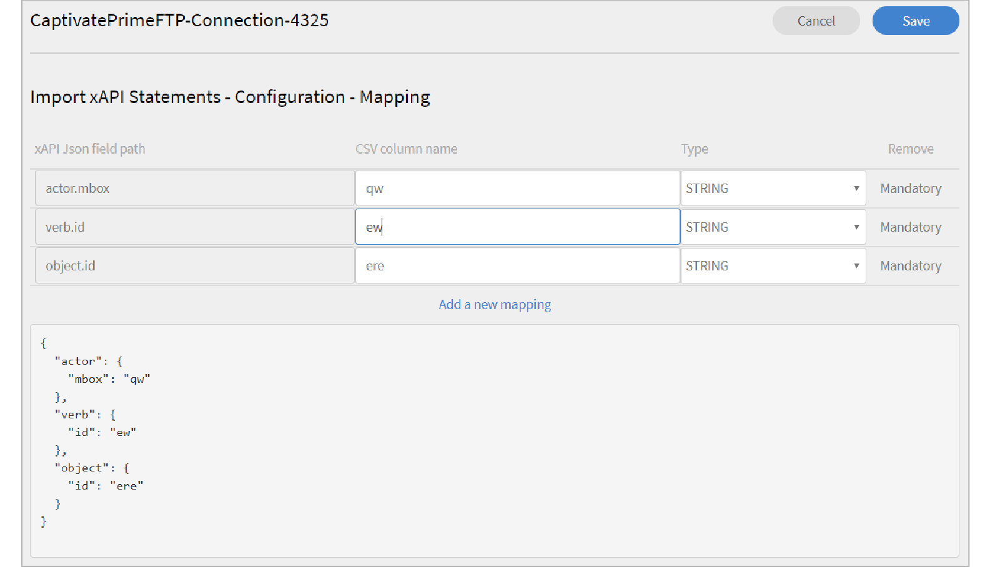
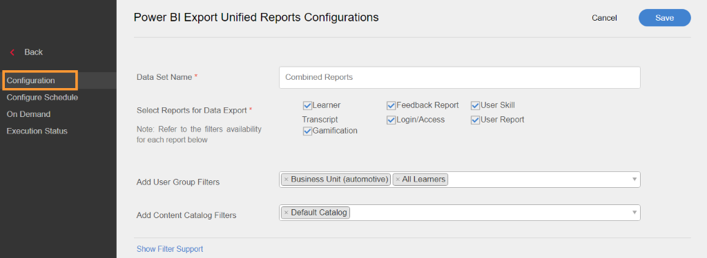
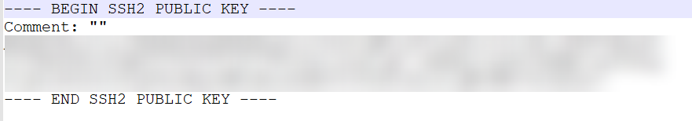
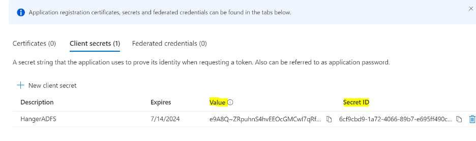
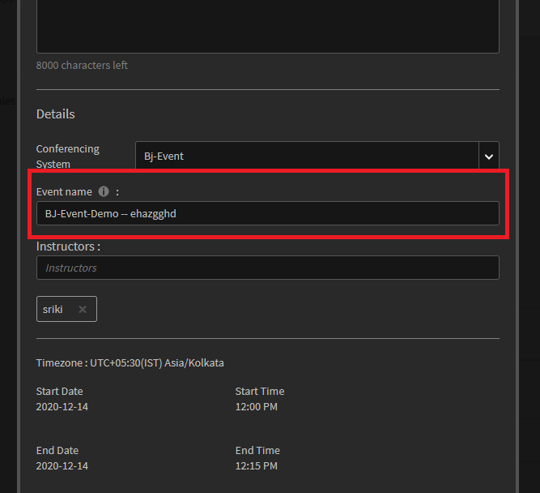

# Conectores de Learning Manager

Las empresas tienen otras aplicaciones y sistemas que deben integrarse con Learning Manager. Los conectores son utilidades que ayudan a realizar integraciones basadas en datos, como la importación de datos en Learning Manager desde sistemas externos.  También exporta datos a sistemas externos desde Learning Manager.

Learning Manager proporciona conectores de Salesforce y FTP. Con el conector de Salesforce, los administradores de integración de una organización pueden integrar su aplicación de Salesforce con Learning Manager. Como integrador, también puede utilizar el conector de FTP para importar automáticamente un conjunto de usuarios en su aplicación empresarial.

Learning Manager también proporciona los conectores de Lynda, getAbstract y Harvard Management System. Estos conectores permiten a los alumnos acceder a cursos de Lynda.com, getAbstract y Harvard ManageMentor y consumirlos.

Siga leyendo para saber cómo configurar y utilizar cada uno de estos conectores en Learning Manager.

<!--
>[!NOTE]
>
>**Update:** December 2020 update of Learning Manager
>
>For **FTP**, **Box**, and **Custom FTP** connectors, while exporting Learner Transcript or xAPI, you can also export the data as a **zip** file, for:
>
>* Learner Transcripts
>* xAPI
-->

>[!NOTE]
>
>Con la versión de noviembre de 2022 de Adobe Learning Manager, Zoom ha quedado obsoleto [Autenticación JWT para junio de 2023](https://marketplace.zoom.us/docs/guides/auth/jwt/). En consecuencia, el conector de Zoom con JWT seguirá funcionando hasta la fecha mencionada, pero recomendamos a los usuarios que creen una aplicación OAuth de servidor a servidor para reemplazar la funcionalidad en su cuenta. Cualquier conexión nueva tendrá la autenticación de Zoom OAuth de forma predeterminada.

## Conector de Salesforce {#sfconnector}

El conector de Salesforce conecta las cuentas de Learning Manager y Salesforce para automatizar la sincronización de datos. Las funciones del conector de Salesforce son las siguientes:

### Asignación de atributos

El administrador de integración puede elegir columnas de Salesforce y asignarlas a los atributos agrupables del administrador de aprendizaje correspondiente. Una vez completada la asignación, se utilizará la misma en las posteriores importaciones de usuarios. Se puede volver a configurar si el administrador desea tener una asignación diferente para importar usuarios.

### Importación automatizada de usuarios

El proceso de importación de usuarios permite al administrador de Learning Manager obtener detalles de los empleados de Salesforce e importarlos automáticamente en Learning Manager. Esta automatización evita el esfuerzo manual que supone crear un archivo CSV y cargarlo en Learning Manager.

### Programación automática

El uso de la función de programación automática junto con la función de importación automatizada de usuarios puede ser eficaz. El administrador de Learning Manager puede configurar la programación de acuerdo con las necesidades de la organización. Los usuarios de la aplicación Learning Manager pueden estar actualizados según la programación. La sincronización se puede realizar a diario en la aplicación Learning Manager.

### Filtrar usuarios

El administrador de Learning Manager puede aplicar filtros a los usuarios antes de importarlos. Por ejemplo, el administrador de Learning Manager puede elegir importar todos los usuarios de la jerarquía bajo uno o varios responsables específicos.

### Configurar el conector de Salesforce {#configuresalesforceconnector}

Para integrar Salesforce con Learning Manager, infórmese sobre el proceso

#### Requisitos previos {#prerequisites}

Asegúrese de tener la URL de la organización de Salesforce. Por ejemplo, si el nombre de su organización es **myorg**, la URL de Salesforce podría ser `https://myorg.salesforce.com`. Es la única entrada necesaria para conectar la cuenta de Salesforce con Learning Manager.

Asegúrese también de que dispone de las credenciales adecuadas para iniciar sesión en la cuenta.

#### Crear una conexión {#createaconnection}

1. En la página de inicio de Learning Manager, pase el ratón sobre la tarjeta/miniatura de Salesforce. Aparece un menú. Haga clic en **[!UICONTROL Connect]** en el menú.

   

   *Opción Conectar*

1. Aparece un cuadro de diálogo que le solicita que introduzca la URL de la organización. Haga clic en **[!UICONTROL Connect]** después de proporcionar la dirección URL.
1. Tras una conexión correcta, aparece la página de información general.

### Asignación de atributos {#mapattributes}

Una vez establecida correctamente la conexión, puede asignar columnas de Salesforce a los atributos correspondientes de Learning Manager. Este paso es obligatorio.

1. En la página de asignaciones, en el lado izquierdo se muestran las columnas de Learning Manager y en el derecho, las de Salesforce. Seleccione el nombre de columna adecuado que corresponda al nombre de columna del administrador de aprendizaje.

   
   *Asignación de atributos*

   >[!NOTE]
   >
   >Los datos de columna de Learning Manager que se muestran a la izquierda se obtienen de los campos activos. La **gerente** debe asignarse a un campo de tipo de dirección de correo electrónico. Asignar todas las columnas es obligatorio antes de poder usar el conector.

1. Haga clic en **[!UICONTROL Guardar]** después de completar la asignación.
1. El conector ya está listo para su uso. La cuenta que se ha configurado y que aparece como origen de datos dentro de la aplicación del administrador. El administrador puede programar la importación o la sincronización a petición.

## Uso del conector de Salesforce {#usingsalesforceconnector}

El conector de Salesforce se conecta a Salesforce.com para buscar los usuarios según su configuración y añadirlos a Learning Manager.

### Importar usuarios desde contactos de Salesforce {#import-salesforce-contacts}

Learning Manager mejora el conector de Salesforce para obtener contactos y usuarios de Salesforce e importarlos automáticamente en Learning Manager.

En la página del conector de Salesforce, introduzca la URL de Salesforce y complete la autenticación. Una vez que se haya autenticado, puede importar usuarios o contactos. Si elige la opción Contactos, especifique el subconjunto de contactos que se van a importar.

Elija las columnas de Salesforce y asígnelas a los atributos agrupables de Learning Manager correspondientes. Una vez completada la asignación, se utilizará la misma en las posteriores importaciones de usuarios.

1. Inicie sesión en Salesforce.
1. En la página de conexión, haga clic en **[!UICONTROL Importar usuarios internos]**.

   
   *Importar usuarios internos*

1. En la **Importar usuarios** , hay una nueva opción, Contactos. Haga clic en el botón de opción **Contactos** y verá las siguientes opciones.

   
   *Asignar los atributos de contacto*

1. Si hace clic en **[!UICONTROL Sí]**, puede realizar lo siguiente:

   * **Seleccione la columna Contactos:** Seleccione el campo que desea importar a Learning Manager.
   * **Especifique los valores:** Elija los valores que representan el campo seleccionado.

   
   *Especificar los valores*

   * Asigne las columnas de Salesforce a la de Learning Manager.
   * Para iniciar la importación, haga clic en **[!UICONTROL Guardar]**.

1. Si hace clic en **[!UICONTROL No. Importar todos los contactos]**, puede asignar los campos directamente sin filtrar los contactos. Aquí, importaría todos los contactos de Salesforce.
1. Para iniciar la importación, haga clic en **[!UICONTROL Guardar]**.

## Exportar registros de aprendizaje

Learning Manager ofrece la posibilidad de exportar a Salesforce registros de aprendizaje como transcripciones, informes de usuarios e informes de aptitudes. Puede determinar si los datos exportados deben vincularse a la tabla &quot;Usuario&quot; o &quot;Contactos&quot; de Salesforce.

*Exportación de registros de aprendizaje*

### Objetos personalizados en Salesforce

Antes de exportar registros de aprendizaje desde Learning Manager, debe crear objetos personalizados en Salesforce. Los objetos personalizados son objetos creados para almacenar información específica de su empresa o sector. Para obtener más información, consulte [Objetos personalizados de Salesforce](https://trailhead.salesforce.com/en/content/learn/modules/data_modeling/objects_intro).

A continuación se explica cómo crear los objetos:

1. Descargue e instale los paquetes para crear los objetos personalizados.

   * [Paquete 1](https://test.salesforce.com/packaging/installPackage.apexp?p0=04t1k0000008WPJ)
   * [Paquete 2](https://test.salesforce.com/packaging/installPackage.apexp?p0=04t1k0000008WPT)
   * [Paquete 3](https://test.salesforce.com/packaging/installPackage.apexp?p0=04t1k0000008WPi)

1. Cambie el nombre de los objetos personalizados en Salesforce.
1. Seleccione los eventos y haga clic en **[!UICONTROL Guardar]**.

**Vincular eventos con:** Elija la sección que desea exportar: Usuario o Contacto. Si elige el objeto Contacto, los usuarios que estén presentes en Learning Manager pero no en Salesforce se crearán en Salesforce.

*Opción Vincular eventos*

>[!NOTE]
>
>Puede crear varias conexiones en una sola cuenta. Una única conexión puede servir hasta tres objetos personalizados en Salesforce. Si desea crear varias conexiones para la misma cuenta de Salesforce, debe instalar los tres paquetes. Proporcionamos compatibilidad con hasta tres paquetes.
>
>Tantas conexiones desee crear, deberá instalar tantos paquetes como desee.

>[!NOTE]
>
>En la página Estado de ejecución de Salesforce, el número de registros procesados solo se puede comprobar desde Salesforce. Learning Manager muestra el estado como completado aunque haya una exportación parcial o un error en todos los registros que se han procesado.

## Instalar paquete de Salesforce

Learning Manager ofrece un paquete de la aplicación Salesforce. Una vez instalado y configurado en SFDC, los empleados de ventas pueden realizar sus actividades de formación en el portal de SFDC. Esta aplicación permite a los usuarios de SFDC explorar nuevos cursos de formación, ver recomendaciones y consumirlas directamente en el portal de SFDC. Los usuarios también reciben los anuncios enviados por los administradores en forma de membretes dentro de la aplicación dentro del portal de SFDC.

### Configurar en la aplicación de Learning Manager

1. Inicie sesión en su cuenta de administrador de Learning Manager como administrador de integración.
1. Haga clic en **[!UICONTROL Aplicaciones]** > **[!UICONTROL Aplicaciones destacadas]**.
1. Haga clic en **[!UICONTROL Salesforce]**.
1. En la página de la aplicación de Salesforce, anote el ID de aplicación (también conocido como ID de cliente) y el secreto de cliente mencionado en la descripción.
1. Haga clic en **[!UICONTROL Aprobar]** y la aplicación debe aprobarse correctamente.
1. Haga clic en **[!UICONTROL Recursos para desarrolladores]** > **[!UICONTROL Tokens de acceso para pruebas y desarrollo]**.
1. En la sección Obtener código de OAuth, el ID de cliente y el ámbito deben establecerse en: admin:read,admin:write. Haga clic en **[!UICONTROL Enviar]**.
1. En Obtener token de actualización, introduzca el ID de cliente y el secreto de cliente. Haga clic en **[!UICONTROL Enviar]** y anote el token de actualización.

### Crear cuenta en la aplicación Salesforce

1. Cree una cuenta en la página de registro de Salesforce . Debe crear una cuenta de Salesforce en la edición para desarrolladores o empresas.  [URL de registro de desarrollador](https://developer.salesforce.com/signup). Asegúrese de que debe utilizar el ID de correo electrónico para registrarse en Salesforce que había utilizado para Learning Manager.
1. Verifique su cuenta a través del correo electrónico de verificación.
1. Cree una contraseña e inicie sesión en Salesforce.
1. Anote la URL de Salesforce después de iniciar sesión (por ejemplo, site.lightning.force.com)

### Instalar paquete de Learning Manager

Si desea instalar el paquete, primero debe eliminar el paquete existente en Salesforce. Antes de la desinstalación, debe habilitar los ajustes, como se muestra a continuación. La aplicación de esta configuración es obligatoria; de lo contrario, no podrá instalar el paquete.

>[!NOTE]
>
>La aplicación Adobe Learning Manager solo se admite en la vista de Salesforce Lightning.

1. Inicie el [URL del paquete de Learning Manager](https://login.salesforce.com/packaging/installPackage.apexp?p0=04t1k0000008WOQ).
1. En la **Inicio de sesión** página, haga clic en **[!UICONTROL Usar dominio personalizado]**.
1. Introduzca la URL del paquete y haga clic en **[!UICONTROL Continuar]**. La página de instalación debe tener seleccionada la opción Instalar solo para administradores . No cambie esta opción.
1. Haga clic en **[!UICONTROL Instalar]**. Una vez instalado el paquete, haga clic en **[!UICONTROL Hecho]**. Se le guiará a la página Paquetes instalados y podrá ver el paquete instalado de Adobe Learning Manager.
1. Vaya al Iniciador de aplicaciones (junto a Configuración) y busque Adobe Learning Manager.
1. Para configurar la aplicación, haga clic en **[!UICONTROL Configurar]**.
1. Haga clic en **[!UICONTROL Nuevo]** y añada los siguientes detalles:

   * **Configuración:** Introduzca el nombre que desee.
   * **ClientID**: introduzca el valor obtenido en la primera sección.
   * **SecretoDeCliente:** Introduzca el valor obtenido en la primera sección.
   * **Token de actualización:** Introduzca el valor obtenido en la primera sección.
   * **URLbase de LearningManager:** La dirección URL del sitio en el que se aloja Learning Manager.

### Agregar configuración de sitio remoto

1. En la esquina superior derecha de la página, haga clic en **[!UICONTROL Configuración]**.
1. En **[!UICONTROL Búsqueda rápida]**, busque Configuración del sitio remoto.
1. Haga clic en **[!UICONTROL Nuevo sitio remoto]**.
1. Introduzca los detalles:

   * **Nombre del sitio remoto:** Introduzca el nombre que desee.
   * **URL del sitio remoto:** La dirección URL del sitio en el que se aloja Learning Manager.

1. Inicie Learning Manager.

### Habilitar notificaciones para la aplicación de Learning Manager

1. En la esquina superior derecha, haga clic en **[!UICONTROL Configuración]**.
1. Busque Notificaciones personalizadas.
1. Haga clic en **[!UICONTROL Nuevo]**.
1. Introduzca los siguientes datos:

   1. **Nombre de notificación personalizado:** NotificaciónDeLearningManager
   1. **Nombre de API:** NotificaciónDeLearningManager

1. Seleccione ambos **Escritorio** y **Móvil** como canales compatibles.

1. Haga clic en **[!UICONTROL Guardar]**.
1. Para habilitar las notificaciones automáticas para dispositivos móviles, siga los pasos que se indican a continuación:

   1. Instale la aplicación móvil de Salesforce en su teléfono móvil.
   1. Inicie sesión en la aplicación usando sus credenciales.
   1. Vaya a **Configuración** > **Configuración de entrega de notificaciones**.
   1. Añada Salesforce para iOS y Android.

### Desinstalar Learning Manager de Salesforce

1. En la aplicación Salesforce, vaya a Paquetes instalados.
1. Haga clic en **[!UICONTROL Desinstalar]**.

## Configurar Learning Manager para usuarios de Salesforce

La aplicación Learning Manager también está disponible para los usuarios que estén presentes en cualquier cuenta de Salesforce. El administrador de Salesforce puede añadir usuarios en función de los perfiles. Los perfiles de Salesforce son similares a los del Administrador de aprendizaje. Por ejemplo, administrador, administrador de integración, instructor, etc. El administrador de Salesforce también puede crear un perfil personalizado.

Como administrador de Salesforce, puede asignar los perfiles a los usuarios o crear un perfil personalizado.

Al instalar el paquete, puede asignar el perfil de Salesforce a los alumnos.

Después de instalar el paquete, debe configurar el perfil.

Haga clic en **[!UICONTROL Configurar]** > **[!UICONTROL Nuevo]** y, a continuación, agregue lo siguiente:

* Nombre de configuración
* ClientID
* SecretoDeCliente
* LearningManagerBaseURL
* Desactivar redirección

>[!NOTE]
>
>Para que los alumnos vean la aplicación de Learning Manager, debe activarla para todos los alumnos.

El siguiente paso es proporcionar permiso para acceder a la aplicación de Learning Manager.

*Definir permisos para acceder a la aplicación de Learning Manager*

Seleccione los usuarios y asigne los permisos correspondientes. Los alumnos ahora pueden acceder a la aplicación de Learning Manager.

A continuación, seleccione un perfil, por ejemplo, Perfil estándar de un usuario, y haga clic en el perfil. Haga clic en **[!UICONTROL Editar]** y en el **Configuración personalizada de la aplicación** , active la casilla de verificación **Adobe Learning Manager**. Esto hace que la aplicación sea accesible para el usuario.

En la **Ajustes de pestaña personalizados** , en la sección **Inicio del alumno** lista desplegable, seleccione la opción **Predeterminado en**.

Debe hacer que la aplicación esté visible para todos los perfiles.

Haga clic en **[!UICONTROL Guardar]** y los alumnos que pertenezcan a todos los perfiles accederán a la aplicación de Learning Manager.

### Cambios relacionados con la ruta de aprendizaje

#### Conexiones existentes

Si la opción Ruta de aprendizaje está desactivada en la cuenta de administrador, no se añaden filas ni columnas en el informe.

Si la opción Ruta de aprendizaje está activada en la cuenta de administrador, la columna &quot;Tipo&quot; se rellenará con Ruta de aprendizaje en caso de que los alumnos se inscriban en ella.

>[!NOTE]
>
>Si el indicador está habilitado y utiliza una conexión existente, es posible que se omitan algunos registros.

#### Nuevas conexiones

Si la opción Ruta de aprendizaje está desactivada en la cuenta de administrador, el informe de formación constará de las siguientes columnas, pero no contendrá ningún dato.

* **Ruta incrustada:** Muestra el nombre del programa de aprendizaje
* **Id. de ruta incrustada:** Muestra los ID del programa de aprendizaje.
* **ID de curso incrustado:** Muestra los ID de los cursos que se encuentran dentro de una ruta de aprendizaje.

Además, para las nuevas conexiones en cuentas en las que se habilita la ruta de aprendizaje, aparecerán las tres nuevas columnas y todos los datos fluirán.

Además, el informe contendrá el tipo de columna Ruta de aprendizaje (nivel superior) para todos los alumnos que se hayan inscrito en una ruta de aprendizaje.

En la columna Tipo, se cambiará el nombre del programa de aprendizaje a Ruta de aprendizaje. Para las conexiones existentes, no habrá cambios.

## Conector FTP de Learning Manager {#ftpconnector}

Con el conector de FTP, puede integrar Learning Manager con sistemas externos arbitrarios para automatizar la sincronización de datos. Se espera que los sistemas externos puedan exportar datos en formato CSV y colocarlos en la carpeta adecuada de la cuenta FTP de Learning Manager. Las funciones del conector de FTP son las siguientes:

También puede utilizar el conector de Box para la migración de datos, la importación de usuarios y la exportación de datos. Para obtener más información, consulte Conector de Box.

### Importación de datos {#dataimport}

El proceso de importación de usuarios permite al administrador de Learning Manager obtener detalles de los empleados del servicio FTP de Learning Manager e importarlos automáticamente en Learning Manager. Con esta función, puede integrar varios sistemas colocando el archivo CSV generado por esos sistemas en las carpetas adecuadas de las cuentas FTP. Learning Manager selecciona los archivos CSV, los combina e importa los datos según la programación. Consulte Programación para obtener más información.

**Asignación de atributos**

El administrador de integración puede elegir las columnas de CSV y asignarlas a los atributos agrupables de Learning Manager. Esta asignación es una tarea que se realiza una sola vez. Una vez realizada la asignación, se utilizará la misma en las posteriores importaciones de usuarios. La asignación se puede volver a configurar si el administrador desea tener una asignación diferente para importar usuarios.

#### Exportar datos {#exportdata}

La exportación de datos permite exportar aptitudes de usuarios y transcripciones de alumnos a una ubicación de FTP para su integración con cualquier sistema de terceros.

#### Programación {#scheduling}

El administrador puede configurar tareas de programación según los requisitos de la organización, y los usuarios de la aplicación Learning Manager se actualizan según la programación. Del mismo modo, el administrador de integración puede programar la exportación de aptitudes de forma oportuna para que se integre en un sistema externo. La sincronización se puede realizar a diario en la aplicación Learning Manager.

### Configurar el conector FTP de Learning Manager {#configurecaptivateprimeftpconnector}

Para integrar el conector FTP con Learning Manager, infórmese sobre el proceso.

#### Crear una conexión {#Createaconnection-1}

1. En la página de inicio de Learning Manager, pase el ratón sobre la tarjeta/miniatura FTP. Aparece un menú. Haga clic en **[!UICONTROL Connect]** en el menú.

   

   *Opción Conectar*

1. Aparece un cuadro de diálogo que le solicita que introduzca el ID de correo electrónico. Indique el ID de correo electrónico de la persona responsable de administrar la cuenta de FTP de Learning Manager para la organización. Haga clic en **[!UICONTROL Connect]** después de indicar el ID de correo electrónico.
1. Learning Manager le envía un correo electrónico solicitando al usuario que restablezca la contraseña antes de acceder al FTP por primera vez. El usuario debe restablecer la contraseña y utilizarla para acceder a la cuenta de FTP de Learning Manager.

   >[!NOTE]
   >
   >Solo se puede crear una cuenta FTP de Learning Manager para una cuenta de Learning Manager determinada.

   En la página de información general, puede especificar el nombre de conexión de su integración. Elija la acción que desea realizar entre las siguientes opciones:

   * Importar usuarios internos
   * Importar xAPI
   * Exportar aptitudes de usuarios: configurar una programación
   * Exportar aptitudes de usuarios: a petición
   * Exportar transcripciones de alumnos: Configurar una programación
   * Exportar transcripciones de alumnos a petición

   
   *Opciones de exportación*

### Importar

+++Usuario interno

La opción de importación de usuarios internos le permite importar los usuarios de un archivo CSV a un administrador de aprendizaje a petición o en programación.

+++

+++Asignar atributos

Una vez que la conexión se establece correctamente, puede asignar columnas de archivos CSV. Se coloca en la carpeta FTP según los atributos correspondientes de Learning Manager. Este paso es obligatorio.

1. En la página Asignar atributos, en el lado izquierdo, se muestran las columnas esperadas de Learning Manager, mientras que en el derecho, se muestran los nombres de las columnas de CSV. Inicialmente, en el lado derecho, puede ver un cuadro de selección vacío. Importe cualquier archivo .csv de plantilla haciendo clic **Elegir archivo**.
1. El paso anterior rellena la lista desplegable de selección del lado derecho con todos los nombres de columna de CSV. Seleccione el nombre de columna adecuado que corresponda al nombre de columna del administrador de aprendizaje.

   >[!NOTE]
   >
   >El campo de responsable debe asignarse a un campo de tipo de dirección de correo electrónico. Asignar todas las columnas es obligatorio antes de poder usar el conector.

1. Haga clic en **[!UICONTROL Guardar]** después de completar la asignación.

   El conector ya está listo para su uso. La cuenta configurada aparece como un origen de datos dentro de la aplicación del administrador para que el administrador programe la importación o la sincronización a petición.

+++

+++Uso del conector FTP de Learning Manager

1. Los archivos CSV de sistemas externos deben colocarse en la ruta siguiente:

   `code $OPERATION$/$OBJECT_TYPE$/$SUB_OBJECT_TYPE$/data.csv`

   >[!NOTE]
   >
   >En la versión de julio de 2016, solo se permite la importación de usuarios. Por lo tanto, para utilizar el conector de FTP, asegúrese de que los archivos CSV se coloquen en la carpeta siguiente:

   `code Home/import/user/internal/*.csv`

1. El conector de FTP toma todas las filas de los archivos CSV. Es importante que la fila correspondiente a un usuario en un archivo CSV no aparezca en ningún otro archivo CSV.
1. Todos los archivos CSV deben contener las columnas especificadas en la asignación.
1. Todos los archivos CSV necesarios deben estar presentes en la carpeta antes de que comience el proceso.

>[!NOTE]
>
>Al importar usuarios a Learning Manager, el administrador también debe saber cómo se administran los usuarios en Learning Manager. Consulte la [Ayuda de User Management](migration-manual.md#usermanagement) para obtener más información.

+++

+++Importar xAPI

Las opciones de importación de xAPI le permiten programar la importación de declaraciones de xAPI de servicios de terceros en Learning Manager a petición.

+++

+++Configuraciones necesarias para importar xAPI

1. En la página de configuración, seleccione una configuración existente que esté disponible en la lista de configuración para importar declaraciones xAPI del CSV. Haga clic en editar o **agregar una nueva configuración** para acceder a la página Configurar orígenes de importación.

   **Configuración**

   * En la página Configurar orígenes de importación, rellene los dos campos, Nombre y Nombre del archivo de origen. El nombre del archivo de origen debe coincidir con el nombre de archivo proporcionado en la ubicación de la carpeta FTP.
   * Haga clic en **[!UICONTROL Guardar]** para guardar los cambios.

   
   *Configurar*

   **Filtro**

   * En el panel izquierdo, haga clic en **[!UICONTROL Filtro]**.
   * En la página Configurar filtro de importación, rellene los campos Nombre y Condiciones para filtrar los registros. Haga clic en **[!UICONTROL Añadir nuevo filtro]** para agregar otro filtro. Puede guardar o eliminar un filtro haciendo clic en **Guardar** o **Eliminar** de la columna Acciones.

   
   *Filtro*

   **Asignación**

   * En el panel izquierdo, haga clic en **[!UICONTROL Asignación]**.
   * En la página Importar instrucciones de xAPI: asignación de configuración, en el lado izquierdo puede ver los nombres de ruta de campo JSON de xAPI que deben asignarse con los nombres de columna de CSV.
   * De forma predeterminada, los tres nombres de campo de ruta JSON que deben asignarse con los nombres de columna CSV son **actor.mbox**, **verb.id**, y **object.id**. Puede agregar otros campos para asignarlos haciendo clic en **Añadir una nueva asignación**.

   * Seleccione el tipo de nombre de columna que está asignando con el nombre de la ruta de acceso del campo Json (ya sea cadena, número, booleano o tipo de fecha).
   * Tras completar la asignación, haga clic en Guardar . La importación de xAPI ahora se puede importar según lo programado o a petición.

   
   *Asignación*

1. En el panel izquierdo, haga clic en **[!UICONTROL Configurar programación]**. Haga clic en **[!UICONTROL Habilitar programación]** para programar la importación de instrucciones xAPI.

   Puede especificar la fecha y la hora de inicio y, a continuación, la frecuencia de la programación de importación de xAPI en días. Por ejemplo, habilite la importación de xAPI cada 3 días.

   
   *Importar instrucciones xAPI: Configurar programación*

1. En el panel izquierdo, haga clic en **[!UICONTROL Ejecución a petición]**.

   
   *Importar declaraciones de xAPI: a petición*

1. En el panel izquierdo, haga clic en **[!UICONTROL Estado de ejecución]** para ver el resumen de todas las ejecuciones de este conector, en orden cronológico. Puede ver la fecha de inicio y la duración del tiempo que se tarda en importar xAPI, el tipo de importación (si es a petición o programada) y el estado de la importación (si la importación xAPI está en curso o ha finalizado o ha fallado).

   
   *Importar instrucciones de xAPI: estado de ejecución*

+++

### Exportar

+++Aptitudes

Existen dos opciones para exportar informes de aptitudes de usuarios.

**[!UICONTROL Aptitudes del usuario: a petición]**: puede especificar la fecha de inicio y exportar el informe mediante esta opción. El informe se extrae desde la fecha introducida hasta el presente.

*Opción de exportación a petición*

**[!UICONTROL Aptitudes del usuario: Configurar]**: esta opción le permite programar la extracción del informe. Active la casilla de verificación Habilitar programación y especifique la fecha y la hora de inicio. También puede especificar el intervalo en el que desea que se genere y se envíe el informe.

*Configurar la exportación de informes*

+++

Para abrir la carpeta Export donde se colocan los archivos exportados, abra el vínculo a la carpeta FTP que se proporciona en la página Aptitudes del usuario, como se muestra a continuación.

*Carpeta FTP para ver archivos*

Los archivos exportados automáticamente se encuentran en la ubicación **Inicio/exportación/&#42;FTP_location&#42;**

Los archivos exportados automáticamente están disponibles con el título: **skill_achievements_&#42;datar de &#42;_para_&#42;fecha de&#42;.csv**

*Archivo .csv exportado*

+++ Transcripciones de alumnos

**Configurar**: esta opción le permite programar la extracción del informe. Active la casilla de verificación Habilitar programación y especifique la fecha y la hora de inicio. También puede especificar el intervalo en el que desea que se genere y se envíe el informe.

+++

Para abrir la carpeta Export donde se colocan los archivos exportados en la ubicación de FTP, abra el vínculo a la carpeta de FTP que se proporciona en la página Transcripciones de alumnos, como se muestra a continuación

Los archivos exportados automáticamente se encuentran en la ubicación **Inicio/exportación/&#42;FTP_location&#42;**

Los archivos exportados automáticamente están disponibles con el título: **learner_transcript_&#42;datar de &#42;_para_&#42;fecha de&#42;.csv**

### Compatibilidad con campos csv manuales {#supportformanualcsvfields}

Al importar datos de usuarios a través de FTP, un administrador debe asignar todos los campos activos presentes en el sistema al campo correspondiente en el archivo .csv.

Esto es obligatorio para todos los campos activos de csv. Para los campos activos manuales, el administrador de integración puede seleccionar la opción **DontImportFromSource**.

Al seleccionar esta opción, los valores de campo activos manuales no se rellenan mediante la importación de csv. Los valores proporcionados por el alumno permanecen intactos.

>[!NOTE]
>
>Durante la asignación, si la opción **DontImportFromSource** está seleccionado para el campo activo csv, este campo se eliminará del sistema.

*Conector de FTP para campos activos*

## Conector de Lynda {#lyndaconnector}

El conector de Lynda lo utilizan los clientes empresariales de Lynda.com que desean que sus alumnos descubran y consuman cursos de Lynda desde Learning Manager. El conector se puede configurar para obtener cursos de Lynda.com periódicamente con su clave de API. Una vez creado un curso en Learning Manager, los usuarios pueden buscarlo y consumirlo. A continuación, se puede realizar un seguimiento del progreso del alumno en Learning Manager.

### Configurar el conector de Lynda {#configurethelyndaconnector}

1. En el tablero del administrador integrado, haga clic en Lynda.

   Verá el mosaico con tres opciones: Introducción, Conectar y Administrar conexiones.

1. Si va a configurar el conector de Lynda por primera vez, haga clic en Conectar.

   <!--Configure the Exavault FTP account before you configure this connector.-->

1. En la página de conexión, especifique un nombre para el conector. Introduzca la clave Appkey y la clave secreta para su conexión.

   >[!NOTE]
   >
   >Póngase en contacto con su proveedor para obtener la clave Appkey y la clave secreta.

1. Haga clic en Guardar.

   La configuración se guarda y se agrega la conexión de Lynda para su cuenta. Ahora puede hacer clic en Administrar conexiones en la página principal y editar su configuración en cualquier momento.

1. Si ya tiene una conexión establecida, haga clic en Administrar conexiones para ver todas las conexiones.

   >[!NOTE]
   >
   >La función de migración debe estar habilitada para su cuenta antes de configurar este conector.

1. Haga clic en la conexión que desee editar.
1. En el panel izquierdo, haga clic en **[!UICONTROL Configurar]**. Realice una de las acciones siguientes:

   * Vea o edite los detalles de su cuenta y la programación de sincronización desde esta ventana. Active la casilla de verificación Habilitar conexión si desea habilitar esta cuenta.
   * Haga clic en Editar y edite sus credenciales. Para deshacer las actualizaciones de este campo, haga clic en Restablecer
   * Haga clic en Habilitar programación para programar la sincronización. Puede especificar la fecha y la hora de inicio y, a continuación, la frecuencia de la programación de sincronización en días. Por ejemplo, habilite la sincronización cada tres días.

   Haga clic en **[!UICONTROL Guardar]** para guardar los cambios.

   

   *Configurar el conector de Lynda para Learning Manager*

1. En el panel izquierdo, haga clic en Ejecución a petición. Esta opción le permite importar fuentes de usuario y otros datos relevantes de Lynda. Introduzca la fecha de inicio de la ejecución a petición y haga clic en Ejecutar para ejecutar la sincronización. Se importan todos los datos desde la fecha de inicio hasta el presente.

   * Puede hacer clic en Deshabilitar acceso a Learning Manager durante la ejecución cuando la aplicación tenga un tiempo de inactividad durante la sincronización.
   * Si hace clic en Habilitar acceso a Learning Manager durante la ejecución, no se producirá ninguna interrupción en el servicio durante la sincronización.

   

   *Ejecución a petición del conector de Lynda*

1. También puede hacer clic en Estado de ejecución en el panel izquierdo en cualquier momento para ver el resumen de todas las ejecuciones de este conector, en orden cronológico. Puede ver la fecha de inicio y la duración de la sincronización, el tipo de sincronización (si se trata de sincronización a petición) y el estado de la sincronización (si la sincronización está en curso o se ha completado).

   >[!NOTE]
   >
   >Al eliminar y volver a crear una conexión, vuelven a aparecer las ejecuciones anteriores del conector. Puede ver todas las ejecuciones antes de eliminar la conexión.

   Sólo puede volver a ejecutar la última sincronización.

   

   *Ver el resumen de todas las ejecuciones haga clic en Estado de ejecución*

## conector de getAbstract {#getabstractconnector}

El conector de getAbstract lo utilizan los clientes empresariales de getAbstract.com, que desean que sus alumnos descubran y consuman resúmenes de getAbstract. El conector se puede configurar para obtener datos de uso periódicamente, en función de los registros de finalización de alumnos que se creen en Learning Manager. Siga leyendo para saber cómo configurar este conector en Learning Manager.

### Configurar el conector de getAbstract {#configurethegetabstractconnector}

1. En el tablero del administrador integrado, haga clic en getAbstract.

   En el mosaico, aparecen tres opciones: Introducción, Conectar y Administrar conexiones.

1. Si va a configurar el conector de getAbstract por primera vez, haga clic en Conectar.

   <!--Configure the Exavault FTP account before you configure this connector.

   Ensure that you share this FTP credentials with your content provider to access the feeds.-->

1. Escriba un nombre para la conexión en el campo Nombre de conexión.

   Introduzca las claves adecuadas en los campos ID de cliente y Secreto de cliente. Póngase en contacto con su proveedor para obtener las claves apropiadas para este conector.

   Las claves son necesarias para obtener los metadatos del curso para los cursos consumidos por el cliente.

1. Si ya tiene una conexión establecida, en la página de inicio, haga clic en getAbstract > Administrar conexiones para ver y editar la configuración existente.

   >[!NOTE]
   >
   >La función de migración debe estar habilitada para su cuenta antes de configurar este conector.

1. Haga clic en la conexión cuya configuración desee ver o editar.

   

   *Configurar el conector de getAbstract para Learning Manager*

1. En el panel izquierdo, haga clic en Configurar. Realice una de las acciones siguientes:

   * Vea o edite los detalles de su cuenta y la programación de sincronización desde esta ventana. Active la casilla de verificación Habilitar conexión si desea habilitar esta cuenta.
   * Haga clic en Editar y edite sus credenciales. Para deshacer las actualizaciones de este campo, haga clic en Restablecer
   * Haga clic en Habilitar programación para programar la sincronización. Puede especificar la fecha y la hora de inicio y, a continuación, la frecuencia de la programación de sincronización en días. Por ejemplo, habilite la sincronización cada tres días.

1. Haga clic en **[!UICONTROL Guardar]**.

   La configuración se guarda y se agrega la conexión getAbstract para la cuenta.

1. En el panel izquierdo, haga clic en Ejecución a petición. Esta opción le permite importar fuentes de usuario y otros datos relevantes de getAbstract. Introduzca la fecha de inicio de la ejecución a petición y haga clic en Ejecutar para ejecutar la sincronización. Se importan todos los datos desde la fecha de inicio hasta el presente.

   * Puede hacer clic en Deshabilitar acceso a Learning Manager durante la ejecución cuando la aplicación tenga un tiempo de inactividad durante la sincronización.
   * Si hace clic en Habilitar acceso a Learning Manager durante la ejecución, no se producirá ninguna interrupción en el servicio durante la sincronización.

1. También puede hacer clic en Estado de ejecución en el panel izquierdo en cualquier momento para ver el resumen de todas las ejecuciones de este conector, en orden cronológico. Puede ver la fecha de inicio y la duración de la sincronización, el tipo de sincronización (si se trata de sincronización a petición) y el estado de la sincronización (si la sincronización está en curso o se ha completado).

   >[!NOTE]
   >
   >Al eliminar y volver a crear una conexión, vuelven a aparecer las ejecuciones anteriores del conector. Puede ver todas las ejecuciones antes de eliminar la conexión.

   Sólo puede volver a ejecutar la última sincronización.

   Para que funcione cualquier tipo de sincronización, asegúrese de que la fuente de usuario esté presente en la carpeta FTP de getAbstract para las fechas especificadas en la sincronización.

   Consulte la siguiente hoja de Excel, que es un archivo de fuente de usuario de muestra de getAbstract. El nombre de archivo debe tener el formato siguiente: **report_export_yyyy_MM_dd_HHmmss.xlsx** o **report_export_yyyy_MM_dd.xlsx**.
   [getAbstract user feed sample excel sheet](assets/report-export-20170401175342.xlsx)

## Conector de Harvard ManageMentor {#hmmconnector}

El conector de Harvard ManageMentor lo utilizan los clientes empresariales de Harvard ManageMentor, que desean que sus alumnos descubran y consuman cursos de Harvard ManageMentor. El conector ayuda a crear cursos en Learning Manager y se puede configurar para obtener datos del progreso del alumno periódicamente. Para configurar este conector, realice el siguiente procedimiento:

### Configurar el conector de Harvard ManagerMentor {#configuretheharvardmanagermentorconnector}

1. En el tablero de administración integrada, haga clic en Harvard ManageMentor.

   En el mosaico, aparecen tres opciones: Introducción, Conectar y Administrar conexiones.

1. Si va a configurar el conector de Harvard ManageMentor por primera vez, haga clic en Conectar.

   <!--Configure the Exavault FTP account before you configure this connector.

   Ensure that you share this FTP credentials with your content provider to access the feeds.-->

1. En el campo Nombre de la conexión, escriba un nombre para la conexión. Haga clic en Conectar para guardar esta conexión.
1. Si ya tiene una conexión establecida, en la página de inicio, haga clic en Harvard ManageMentor > Administrar conexiones. Haga clic en la conexión en la que desee editar la configuración existente.

   >[!NOTE]
   >
   >La función de migración debe estar habilitada para su cuenta antes de configurar este conector.

   

   *Configurar el conector de Harvard Manage Mentor para Learning Manager*

1. En el panel izquierdo, haga clic en Configurar. Realice una de las acciones siguientes:

   * Vea o edite los detalles de su cuenta y la programación de sincronización desde esta ventana. Active la casilla de verificación Habilitar conexión si desea habilitar esta cuenta.
   * Haga clic en Habilitar programación para programar la sincronización. Puede especificar la fecha y la hora de inicio y, a continuación, la frecuencia de la programación de sincronización en días. Por ejemplo, habilite la sincronización cada tres días.

1. En el panel izquierdo, haga clic en Ejecución a petición. Esta opción le permite importar fuentes de usuario y otros datos relevantes de Harvard ManageMentor. Introduzca la fecha de inicio de la ejecución a petición y haga clic en Ejecutar para ejecutar la sincronización. Todos los datos desde la fecha de inicio hasta el presente se importan para esta conexión.

   * Puede hacer clic en Deshabilitar acceso a Learning Manager durante la ejecución cuando la aplicación tenga un tiempo de inactividad durante la sincronización.
   * Si hace clic en Habilitar acceso a Learning Manager durante la ejecución, no se producirá ninguna interrupción en el servicio durante la sincronización.

   Si desea automatizar la sincronización cada pocos días, especifique el número de días en el campo Repetir número de días. La sincronización garantiza que su cuenta esté actualizada con la última versión de los resúmenes y resúmenes de Harvard ManageMentor.

1. También puede hacer clic en Estado de ejecución en el panel izquierdo en cualquier momento para ver el resumen de todas las ejecuciones de este conector, en orden cronológico. Puede ver la fecha de inicio y la duración de la sincronización, el tipo de sincronización (si se trata de sincronización a petición) y el estado de la sincronización (si la sincronización está en curso o se ha completado).

   >[!NOTE]
   >
   >Al eliminar y volver a crear una conexión, vuelven a aparecer las ejecuciones anteriores del conector. Puede ver todas las ejecuciones antes de eliminar la conexión.

   Sólo puede volver a ejecutar la última sincronización.

   Para que la sincronización sea correcta, asegúrese de que al menos uno de los siguientes archivos esté presente en la carpeta FTP de Harvard ManageMentor:

   hmm12_metadata.xlsx: Este archivo proporciona los metadatos del curso para el conector de Harvard ManageMentor. Asegúrese de seguir la convención de nomenclatura al cargar el archivo.

   client_hmm12_20150125.xlsx: Es la fuente de usuario para el conector de Harvard ManageMentor. La convención de nomenclatura de archivos que se indica a continuación es **client_hmm12_yyyyMMdd.xlsx.**

   Consulte los dos ejemplos siguientes de fuente de usuario y de fuente de curso para este conector:

   * [Archivo de metadatos del curso para el conector de Harvard ManageMentor](assets/hmm12-metadata.xlsx)
   * [Fuente de usuario del conector de Harvard ManageMentor](assets/client-hmm12-20170304.xlsx)

## Conector de Workday {#workdayconnector}

Con el conector de Workday, puede integrar Learning Manager con el inquilino de Workday para automatizar la sincronización de datos.

### Importar

#### Asignación de atributos

El administrador de integración puede elegir columnas de Workday y asignarlas a los atributos agrupables de Learning Manager correspondientes. Una vez completada la asignación, se utilizará la misma en las posteriores importaciones de usuarios. Se puede volver a configurar si el administrador desea tener una asignación diferente para importar usuarios.

#### Importación automatizada de usuarios

El proceso de importación de usuarios permite a Learning Manager Administrator obtener detalles de los empleados de Workday e importarlos automáticamente en Learning Manager.

#### Filtrar usuarios

El administrador de Learning Manager puede aplicar filtros a los usuarios antes de importarlos. Por ejemplo, el administrador de Learning Manager puede elegir importar todos los usuarios de la jerarquía bajo uno o varios responsables específicos.

### Exportar

La opción Exportación de aptitudes de usuario permite a los usuarios exportar aptitudes de usuario a Workday automáticamente.

>[!NOTE]
>
>Las aptitudes de varias cuentas de Learning Manager no se pueden exportar simultáneamente con la misma cuenta de Workday.

### Programación {#Scheduling-1}

El administrador puede configurar tareas de programación según los requisitos de la organización, y los usuarios de la aplicación Learning Manager se actualizan según la programación. Del mismo modo, el administrador de integración puede programar la exportación de aptitudes de forma oportuna para que se integre en un sistema externo. La sincronización se puede realizar a diario en la aplicación Learning Manager.

### Configurar el conector de Workday {#configureworkdayconnector}

>[!PREREQUISITES]
>
>Solicite al administrador de Workday de su organización que cree un usuario del sistema de integración (ISU) con los permisos definidos en el documento ISU_Permissions. Descargue una copia del vínculo siguiente.

[Descargue una copia de la seguridad de usuario del sistema de integración (ISU).](assets/isu-permissions-v1.pdf) Para integrar el conector de Workday con Learning Manager, infórmese sobre el proceso.

1. En la página de inicio de Learning Manager, pase el ratón sobre el icono de Workday. Aparece un menú. Haga clic en **[!UICONTROL Connect]** en el menú.

   

   *Mosaico de Workday*

1. Aparece un cuadro de diálogo que le solicita que introduzca las credenciales de la nueva conexión. Antes de establecer la conexión, introduzca los siguientes campos.

   * Nombre de conexión: proporcione un nombre de conexión según sus preferencias.
   * URL de host: el administrador de integración puede obtener los detalles de la URL de host del administrador de Workday correspondiente.
   * Inquilino: el inquilino es interno de su empresa. El administrador de Workday le proporciona los detalles del inquilino.
   * Nombre de usuario y contraseña: el administrador de Workday crea un usuario del sistema integrado (ISU) con los privilegios de seguridad necesarios y lo comparte con el administrador de integración.

>[!NOTE]
>
>   Learning Manager utiliza la versión 28.1 de la API de Workday.

*Configurar el conector de Workday*

1. Haga clic en Conectar después de introducir información en todos los campos relevantes.

   >[!NOTE]
   >
   >También puede sincronizar varias conexiones de Workday con su cuenta de Learning Manager.

En la página de información general, puede especificar el nombre de conexión de su integración. Elija la acción que desea realizar entre las siguientes opciones:

* Importar usuarios internos
* Exportar aptitudes de usuarios: configurar una programación
* Exportar aptitudes de usuarios: a petición

*Introducción a Workday*

### Importar

#### Asignación de atributos {#MapAttributes-1}

Puede utilizar el conector de Workday para integrar Learning Manager y Workday para automatizar la sincronización de datos. Puede importar todos los usuarios activos de Workday a Learning Manager. Los usuarios se pueden importar desde diversas fuentes de datos, como FTP y Salesforce.

Antes de importar usuarios, deben asignarse los atributos de usuario de Learning Manager y Workday. En la página Información general, utilice la opción Usuarios internos de Importar para proporcionar los atributos de la asignación.

Introduzca las credenciales de Adobe Learning Manager en la columna Adobe Learning Manager. Utilice los menús desplegables para seleccionar las credenciales correctas para las columnas en Workday.

>[!NOTE]
>
>Actualmente, Learning Manager admite la importación de 44 atributos de usuario de Workday. Añada más atributos con los campos activos en el Administrador de aprendizaje.

*Asignación de atributos*

Seleccione la **Excluir trabajadores contingentes** para evitar que se importen los trabajadores temporales disponibles bajo un responsable.

Workday tiene cuatro niveles de jerarquía, mientras que Learning Manager tiene dos. Los cuatro niveles de Workday son categoría de perfil de aptitud, perfil de aptitud, categoría de elemento de aptitud y elemento de aptitud. El nombre de la aptitud y el nivel de Learning Manager se asignan en Workday en el elemento de aptitud.

>[!NOTE]
>
>Puede añadir atributos de Workday adicionales. Póngase en contacto con su CSAM para obtener los atributos añadidos.

+++Lista de atributos de Workday compatibles

wd:User_ID\
wd:Worker_ID\
wd:Personal_Data.wd:Name_Data.wd:Preferred_Name_Data.wd:Name_Detail_Data.@wd:Formatted_Name\
wd:Personal_Data.wd:Name_Data.wd:Legal_Name_Data.wd:Name_Detail_Data.@wd:Formatted_Name\
wd:Personal_Data.wd:Name_Data.wd:Legal_Name_Data.wd:Name_Detail_Data.wd:Prefix_Data.wd:Title_Descriptor\
wd:Personal_Data.wd:Name_Data.wd:Preferred_Name_Data.wd:Name_Detail_Data.wd:Prefix_Data.wd:Title_Descriptor\
wd:Personal_Data.wd:Name_Data.wd:Preferred_Name_Data.wd:Name_Detail_Data.wd:First_Name\
wd:Personal_Data.wd:Name_Data.wd:Preferred_Name_Data.wd:Name_Detail_Data.wd:Last_Name\
wd:Personal_Data.wd:Name_Data.wd:Legal_Name_Data.wd:Name_Detail_Data.wd:First_Name\
wd:Personal_Data.wd:Name_Data.wd:Legal_Name_Data.wd:Name_Detail_Data.wd:Last_Name\
wd:Personal_Data.wd:Contact_Data.wd:Address_Data.0.@wd:Formatted_Address\
wd:Personal_Data.wd:Contact_Data.wd:Address_Data.0.wd:Postal_Code\
wd:Personal_Data.wd:Contact_Data.wd:Address_Data.0.wd:Country_Region_Descriptor\
wd:Personal_Data.wd:Contact_Data.wd:Phone_Data.0.@wd:Formatted_Phone\
wd:Personal_Data.wd:Contact_Data.wd:Phone_Data.0.wd:Country_ISO_Code\
wd:Personal_Data.wd:Contact_Data.wd:Phone_Data.0.wd:International_Phone_Code\
wd:Personal_Data.wd:Contact_Data.wd:Phone_Data.0.wd:Phone_Number\
wd:Personal_Data.wd:Primary_Nationality_Reference.wd:ID.1.$\
wd:Personal_Data.wd:Gender_Reference.wd:ID.1.$\
wd:Personal_Data.wd:Identification_Data.wd:National_ID.0.wd:National_ID_Data.wd:ID\
wd:Personal_Data.wd:Identification_Data.wd:Custom_ID.0.wd:Custom_ID_Data.wd:ID\
wd:User_Account_Data.wd:Default_Display_Language_Reference.wd:ID.1.$\
wd:Role_Data.wd:Organization_Role_Data.wd:Organization_Role.0.wd:Organization_Role_Reference.wd:ID.1.$\
wd:Employment_Data.wd:Worker_Job_Data.0.wd:Position_Data.wd:Position_Title\
wd:Employment_Data.wd:Worker_Job_Data.0.wd:Position_Data.wd:Business_Title\
wd:Employment_Data.wd:Worker_Job_Data.0.wd:Position_Data.wd:Business_Site_Summary_Data.wd:Name\
wd:Employment_Data.wd:Worker_Job_Data.0.wd:Position_Data.wd:Business_Site_Summary_Data.wd:Address_Data.@wd:Formatted_Address\
wd:Employment_Data.wd:Worker_Job_Data.0.wd:Position_Data.wd:Job_Classification_Summary_Data.0.wd:Job_Classification_Reference.wd:ID.1.$\
wd:Employment_Data.wd:Worker_Job_Data.0.wd:Position_Data.wd:Job_Classification_Summary_Data.0.wd:Job_Group_Reference.wd:ID.1.$\
wd:Employment_Data.wd:Worker_Job_Data.0.wd:Position_Data.wd:Work_Space__Reference.wd:ID.1.$\
wd:Employment_Data.wd:Worker_Status_Data.wd:Active\
wd:Employment_Data.wd:Worker_Status_Data.wd:Active_Status_Date\
wd:Employment_Data.wd:Worker_Status_Data.wd:Hire_Date\
wd:Employment_Data.wd:Worker_Status_Data.wd:Original_Hire_Date\
wd:Employment_Data.wd:Worker_Status_Data.wd:Retirado\
wd:Employment_Data.wd:Worker_Status_Data.wd:Retirement_Date\
wd:Employment_Data.wd:Worker_Status_Data.wd:Terminated\
wd:Employment_Data.wd:Worker_Status_Data.wd:Termination_Date\
wd:Employment_Data.wd:Worker_Status_Data.wd:Termination_Last_Day_of_Work\
wd:Organization_Data.wd:Worker_Organization_Data.0.wd:Organization_Data.wd:Organization_Code\
wd:Organization_Data.wd:Worker_Organization_Data.0.wd:Organization_Data.wd:Organization_Name\
wd:Organization_Data.wd:Worker_Organization_Data.0.wd:Organization_Data.wd:Organization_Type_Reference.wd:ID.1.$\
wd:Organization_Data.wd:Worker_Organization_Data.0.wd:Organization_Data.wd:Organization_Subtype_Reference.wd:ID.1.$\
wd:Qualification_Data.wd:Education.0.wd:School_Name\
wd:Qualification_Data.wd:External_Job_History.0.wd:Job_History_Data.wd:Job_Title\
wd:Qualification_Data.wd:External_Job_History.0.wd:Job_History_Data.wd:Company\
wd:Management_Chain_Data.wd:Worker_Supervisory_Management_Chain_Data.wd:Management_Chain_Data.0.wd:Manager.Employee_ID

+++

### Exportar

Puede exportar todas las aptitudes obtenidas por un usuario desde Learning Manager a Workday. Solo se exportan todas las aptitudes de usuario activas y Learning Manager no exporta aptitudes retiradas. También puede conectar varios gestores de aprendizaje\
al mismo conector de Workday. Si los nombres de las aptitudes son los mismos en dos cuentas de Learning Manager, se asignan a la misma aptitud en Workday. Antes de actualizar la aptitud en Workday, en caso de que dos cuentas de Learning Manager utilicen la misma cuenta de Workday, es recomendable actualizar los nombres de las aptitudes en todas las cuentas de Learning Manager.

+++Aptitudes del usuario: Configurar

Esta opción le permite programar la extracción del informe. Asegúrese de que la casilla de verificación Habilitar exportación de aptitudes de usuario con esta conexión esté activada. Active la casilla de verificación Habilitar programación y especifique la fecha y la hora de inicio. También puede especificar el intervalo en el que desea que se genere y se envíe el informe. Active la casilla de verificación Habilitar programación e introduzca la fecha de inicio, la hora y la repetición después de &#39;n&#39; días. Una vez hecho esto, haga clic en Guardar.

*Configurar informe de aptitudes de usuarios*

+++

+++Aptitudes del usuario: a petición

Puede especificar la fecha de inicio y exportar el informe mediante esta opción. El informe se extrae desde la fecha introducida hasta el presente. Introduzca la fecha a partir de la cual desea comenzar a generar el informe y haga clic en Ejecutar.

*Informe de aptitudes de usuarios bajo demanda*

+++

+++Aptitudes del usuario: estado de ejecución

Aquí puede ver el resumen de todas las tareas y obtener su informe de estado. Puede descargar informes de errores haciendo clic en el vínculo del informe de errores.

*Informe de ejecución de aptitudes de usuarios*

+++

## conector miniOrange {#miniorangeconnector}

Con el conector de miniOrange, puede integrar Learning Manager con el inquilino de miniOrange para automatizar la sincronización de datos.

### Importar

#### Asignación de atributos

El administrador de integración puede elegir atributos de miniOrange y asignarlos a los atributos agrupables de Learning Manager correspondientes. Una vez completada la asignación, se utilizará la misma en las posteriores importaciones de usuarios. Se puede volver a configurar si el administrador desea tener una asignación diferente para importar usuarios.

#### Importación automatizada de usuarios

El proceso de importación de usuarios permite al administrador de Learning Manager obtener detalles de los empleados de miniOrange e importarlos automáticamente en Learning Manager.

#### Filtrar usuarios

El administrador de Learning Manager puede aplicar filtros a los usuarios antes de importarlos. Por ejemplo, el administrador de Learning Manager puede elegir importar todos los usuarios de la jerarquía bajo uno o varios responsables específicos.

Para configurar el conector de miniOrange, póngase en contacto con el equipo CSM de Learning Manager.

### Configurar el conector de miniOrange {#configureminiorangeconnector}

1. En la página de inicio de Learning Manager, pase el ratón sobre la tarjeta/miniatura miniOrange. Aparece un menú. Haga clic en  **[!UICONTROL Connect]** en el menú.

   

   *azulejo del conector miniOrange*

1. Haga clic en **[!UICONTROL Connect]** para establecer una nueva conexión. Aparece la página del conector de miniOrange. Introduzca los detalles de la cuenta que desea asignar.

   

   *Crear una conexión*

1. Si desea importar el usuario de miniOrange directamente como usuario interno de Learning Manager, utilice el **[!UICONTROL Importar usuarios internos]** opción.

   

   *Importar usuarios internos*

1. En la página de asignación, en el lado izquierdo se muestran las columnas de Learning Manager y en el derecho se muestran las columnas de miniOrnage. Seleccione el nombre de columna adecuado que corresponda al nombre de columna del administrador de aprendizaje.

   

   *Asignación de atributos*

1. Para ver y editar el origen de datos, como administrador, haga clic en **[!UICONTROL Configuración > Origen de datos]**.

   Se enumerará la fuente establecida de miniOrange. Si necesita editar el filtro, haga clic en **[!UICONTROL Editar]**.

   

   *Ver y editar un origen de datos*

1. Recibirá una notificación al finalizar la importación. Para ver o editar el registro de importación, haga clic en **[!UICONTROL Usuarios > Importar registro.]**

#### Eliminar una conexión {#deleteaconnection}

Para eliminar una conexión miniOrange establecida, siga estos pasos.

## Conectores de videoconferencia (BlueJeans Meetings y Zoom) {#bluejeansconnector}

Ahora puede integrar Learning Manager con conectores de BlueJeans y Zoom y utilizarlos para alojar clases.  El conector le permite configurar reuniones/clases de videoconferencia con los alumnos.

Para configurar y usar el conector, siga estos pasos.

1. En la página de inicio de Learning Manager, pase el ratón sobre la miniatura de BlueJeans/Zoom. Aparece un menú. Haga clic en  **[!UICONTROL Connect]** del menú.

   

   *Mosaico del conector de Zoom*

1. Se abre la página del conector de BlueJeans/Zoom. Introduzca los detalles de su cuenta en los campos respectivos para integrar y sincronizar la fuente de usuario. Puede obtener los detalles del administrador de su cuenta de conector.

   
   *Conectarse a BlueJeans/Zoom*

   >[!NOTE]
   >
   >Como alumno, al habilitar el conector, use el mismo ID de correo electrónico utilizado para su cuenta de Learning Manager para habilitar las fuentes de usuario en Learning Manager.

1. Una vez establecida la conexión, como autor, cree un curso de clase virtual con BlueJeans/Zoom como sistema de conferencia.

   

   *Crear un curso de clase virtual*

1. Los administradores, responsables y alumnos pueden inscribir alumnos en el curso creado. Al inscribirse, el alumno recibe un correo electrónico. El alumno puede iniciar sesión en su cuenta de Learning Manager para ver los detalles del programa y realizar el curso.
1. Cuando se completa el curso, se envía el informe de finalización a Learning Manager. El administrador puede ver el informe de finalización para comprobar la asistencia y la puntuación de los alumnos.

   
   *Informe de asistencia y puntuación*

### Crear una aplicación de OAuth de servidor a servidor de zoom

Al crear una aplicación de OAuth de servidor a servidor de Zoom para utilizarla en Adobe Learning Manager, debe añadir los ámbitos necesarios para Adobe Learning Manager al crear la conexión.

Adobe Learning Manager requiere los ámbitos siguientes y los ámbitos deben seleccionarse en la aplicación OAuth.

* Ver todas las reuniones/reuniones de usuarios:read:administrador
* Ver y administrar todas las reuniones/reuniones de usuarios:write:administrador
* Ver datos de informe/informe:read:administrador
* Ver toda la información del usuario /user:read:administrador
* Ver la información de los usuarios y administrar usuarios/usuarios:write:administrador

## Conector de Box {#boxconnector}

Con el conector de Box, puede integrar Learning Manager con sistemas externos arbitrarios para automatizar la sincronización de datos. Se espera que los sistemas externos puedan exportar datos en formato CSV y colocarlos en la carpeta adecuada de la cuenta de Box de Learning Manager. Las capacidades del conector de Box son las siguientes:

También puede utilizar el conector de FTP para la migración de datos, la importación de usuarios y la exportación de datos. Para obtener más información, [Conector FTP de Learning Manager.](connectors.md#main-pars_header_1427405935)

### Importación de datos {#DataImport-1}

El proceso de importación de usuarios permite al administrador de Learning Manager obtener detalles de los empleados desde el servicio de caja de Learning Manager e importarlos automáticamente en Learning Manager. Con esta función, puede integrar varios sistemas colocando el archivo .csv generado por esos sistemas en las carpetas adecuadas de las cuentas de Box. Learning Manager selecciona los archivos CSV, los combina e importa los datos según la programación. Consulte Programación para obtener más información.

**Asignación de atributos**

El administrador de integración puede elegir las columnas de CSV y asignarlas a los atributos agrupables de Learning Manager. Esta asignación es una tarea que se realiza una sola vez. Una vez realizada la asignación, se utilizará la misma en las posteriores importaciones de usuarios. La asignación se puede volver a configurar si el administrador desea tener una asignación diferente para importar usuarios.

## Exportación de datos {#dataexport}

La exportación de datos permite exportar aptitudes de usuarios y transcripciones de alumnos a una ubicación de Box para su integración con cualquier sistema de terceros.

## Programar informes {#schedulereports}

El administrador puede configurar tareas de programación según los requisitos de la organización, y los usuarios de la aplicación Learning Manager se actualizan según la programación. Del mismo modo, el administrador de integración puede programar la exportación de aptitudes de forma oportuna para que se integre en un sistema externo. La sincronización se puede realizar a diario en la aplicación Learning Manager.

## Configurar el conector de Box {#configureboxconnector}

Para integrar el conector de Box con Learning Manager, infórmese sobre el proceso.

1. En la página de inicio de Learning Manager, pase el ratón sobre la tarjeta/miniatura de Box. Aparece un menú. Haga clic en el elemento Conectar del menú.

   

   *Conectar a Box*

1. Aparece un cuadro de diálogo que le solicita que introduzca el ID de correo electrónico. Indique el ID de correo electrónico de la persona responsable de administrar la cuenta de Learning Manager Box para la organización. Haga clic en Conectar después de indicar el ID de correo electrónico.
1. Learning Manager le envía un correo electrónico solicitando al usuario que restablezca la contraseña antes de acceder a Box por primera vez. El usuario debe restablecer la contraseña y utilizarla para acceder a la cuenta de Box de Learning Manager.

   >[!NOTE]
   >
   >Solo se puede crear una cuenta de Learning Manager Box para una cuenta de Learning Manager determinada.

   En la página de información general, puede especificar el nombre de conexión de su integración. Elija la acción que desea realizar entre las siguientes opciones:

   * Importar usuarios internos
   * Importar informes de actividad de xAPI
   * Exportar aptitudes de usuarios: configurar una programación
   * Exportar aptitudes de usuarios: a petición
   * Exportar transcripciones de alumnos: Configurar una programación
   * Exportar transcripciones de alumnos a petición

## Importar

+++Usuario interno

La opción Importar usuario interno le permite programar la generación del informe de importación de usuarios automáticamente. Los informes generados se le envían como archivos .CSV.

+++

+++Asignar atributos

Una vez que se establece correctamente una conexión, puede asignar las columnas de archivos CSV que se colocan en la carpeta de Box a los atributos correspondientes de Learning Manager. Este paso es obligatorio.

1. En la página Asignar atributos, en el lado izquierdo, se muestran las columnas esperadas de Learning Manager, mientras que en el derecho, se muestran los nombres de las columnas de CSV. Inicialmente, en el lado derecho, puede ver un cuadro de selección vacío. Importe cualquier archivo .csv de plantilla haciendo clic en Elegir archivo.
1. El paso anterior rellena la lista desplegable de selección del lado derecho con todos los nombres de columna de CSV. Seleccione el nombre de columna adecuado que corresponda al nombre de columna del administrador de aprendizaje.

   *El campo de responsable debe asignarse a un campo de tipo de dirección de correo electrónico. Asignar todas las columnas es obligatorio antes de poder usar el conector.*

1. Tras completar la asignación, haga clic en Guardar .

   El conector ya está listo para su uso. La cuenta configurada aparece como un origen de datos dentro de la aplicación del administrador para que el administrador programe la importación o la sincronización a petición.

+++

+++Informe de actividad de xAPI

La opción Informe de actividad de xAPI permite generar la importación de declaraciones de xAPI desde servicios de terceros. Los archivos se guardan como archivos .CSV y, a continuación, se convierten en instrucciones xAPI al importar a Learning Manager.

+++

+++Configuraciones necesarias para importar xAPI

1. En la página de configuración, seleccione una configuración existente que esté disponible en la lista de configuración para importar declaraciones xAPI del CSV. Haga clic en Editar o A **Agregar una nueva configuración** para acceder a la página Importar archivo de origen de configuración de declaraciones xAPI.

   

   *Editar o añadir una nueva configuración*

   **Configuración**

   * En la página Configurar orígenes de importación, rellene los dos campos, Nombre y Nombre del archivo de origen. El nombre del archivo de origen debe coincidir con el nombre de archivo proporcionado en la ubicación de la carpeta FTP.
   * Haga clic en **[!UICONTROL Guardar]** para guardar los cambios.

   

   *Configurar*

   **Filtro**

   * En el panel izquierdo, haga clic en Filtro
   * En la página Configurar filtro de importación, rellene el campo Nombre y condiciones para filtrar los registros. Haga clic en Añadir nuevo filtro para añadir otro filtro. Puede guardar o eliminar un filtro haciendo clic en la opción Guardar o eliminar de la columna Acciones.

   

   *Filtro*

   **Asignación**

   * En el panel izquierdo, haga clic en Asignación.
   * En la página Configurar asignación de importación , en el lado izquierdo, puede ver los nombres de ruta de campo de JSON de xAPI que deben asignarse con los nombres de columna de CSV.
   * De forma predeterminada, los tres nombres de campo de ruta de JSON que deben asignarse con los nombres de columna CSV son **actor.mbox**, **verb.id**, y **object.id**. Puede agregar otros campos para asignar haciendo clic en Agregar nueva asignación.
   * Seleccione el tipo de nombre de columna que está asignando con el nombre de la ruta de acceso del campo Json (ya sea cadena, número, booleano o tipo de fecha).
   * Tras completar la asignación, haga clic en Guardar . La importación de xAPI ahora se puede importar según lo programado o a petición.

   
   *Asignación*

1. En el panel izquierdo, haga clic en **[!UICONTROL Configurar programación]**. Haga clic en Habilitar programación para programar la importación de instrucciones xAPI. Puede especificar la fecha y la hora de inicio y, a continuación, la frecuencia de la programación de importación de xAPI en días. Por ejemplo, habilite la importación de xAPI cada 3 días.

   
   *Importar instrucciones xAPI: Configurar programación*

1. En el panel izquierdo, haga clic en **[!UICONTROL Ejecución a petición]**.

   
   *Importar declaraciones de xAPI: a petición*

1. En el panel izquierdo, haga clic en **[!UICONTROL Estado de ejecución]** para ver el resumen de todas las ejecuciones de este conector, en orden cronológico. Puede ver la fecha de inicio y la duración del tiempo que se tarda en importar xAPI, el tipo de importación (si es a petición o programada) y el estado de la importación (si la importación xAPI está en curso o ha finalizado o ha fallado).

   
   *Importar instrucciones de xAPI: estado de ejecución*

+++

+++Uso del conector de Learning Manager Box

1. Los archivos CSV de sistemas externos deben colocarse en la ruta siguiente:

   `code $OPERATION$/$OBJECT_TYPE$/$SUB_OBJECT_TYPE$/data.csv`

   >[!NOTE]
   >
   >En la versión de julio de 2016, solo se permite la importación de usuarios. Por lo tanto, para usar el conector de Box, asegúrese de que los archivos CSV se coloquen en la carpeta siguiente:

   `code Home/import/user/internal/*.csv`

1. El conector de Box toma todas las filas de los archivos CSV. Es importante que la fila correspondiente a un usuario en un archivo CSV no aparezca en ningún otro archivo CSV.
1. Todos los archivos CSV deben contener las columnas especificadas en la asignación.
1. Todos los archivos CSV necesarios deben estar presentes en la carpeta antes de que comience el proceso.

Al importar usuarios a Learning Manager, el administrador también tiene que saber cómo se administran los usuarios en Learning Manager. Consulte la [Ayuda de User Management](migration-manual.md#usermanagement) para obtener más información.

+++

## Exportar

+++Aptitudes

Existen dos opciones para exportar informes de aptitudes de usuarios.

Aptitudes del usuario: A petición: puede especificar la fecha de inicio y exportar el informe usando esta opción. El informe se extrae desde la fecha introducida hasta el presente

**[!UICONTROL Aptitudes del usuario: Configurar]**: esta opción le permite programar la extracción del informe. Active la casilla de verificación Habilitar programación y especifique la fecha y la hora de inicio. También puede especificar el intervalo en el que desea que se genere y se envíe el informe.

+++

Para abrir la carpeta Export donde se colocan los archivos exportados en la ubicación de Box, abra el vínculo a la carpeta de Box que se proporciona en la página Aptitudes del usuario, como se muestra a continuación.

Los archivos exportados automáticamente se encuentran en la ubicación **Inicio/exportación/&#42;Ubicación_Cuadro&#42;**

Los archivos exportados automáticamente están disponibles con el título: **skill_achievements_&#42;datar de &#42;_para_&#42;fecha de&#42;.csv**

>[!NOTE]
>
>El cliente administra los permisos de acceso y el contenido en la carpeta de Box compartida por el equipo de Learning Manager.  Además, el contenido de la carpeta se almacenará físicamente en la región de Frankfurt.

### Compatibilidad con campos csv manuales {#Supportformanualcsvfields-1}

Al importar datos de usuarios a través de Box , un administrador debe asignar todos los campos activos presentes en el sistema al campo correspondiente en el archivo .csv.

Esto es obligatorio para todos los campos activos de csv. Para los campos activos manuales, el administrador de integración puede seleccionar la opción **DontImportFromSource**.

Al seleccionar esta opción, los valores de campo activos manuales no se rellenan mediante la importación de csv. Los valores proporcionados por el alumno permanecen intactos.

>[!NOTE]
>
>Durante la asignación, si la opción **DontImportFromSource** está seleccionado para el campo activo csv, este campo se eliminará del sistema.

*Conector de Box para campos activos*

>[!NOTE]
>
>Al utilizar cualquier conector o migración que use FTP/Box como origen de datos, se eliminarán todos los archivos csv procesados.
>
>El archivo .csv de los conectores de contenido, por ejemplo, LinkedIn, se eliminará pasados siete días, mientras que el archivo .csv de los usuarios de importación se eliminará inmediatamente.

## Conector de linkedIn Learning {#linkedinlearningconnector}

El conector de LinkedIn Learning lo utilizan los clientes empresariales de LinkedIn.com que desean que sus alumnos descubran y consuman cursos desde Learning Manager. El conector se puede configurar para obtener cursos periódicamente con su clave de API. Una vez creado un curso en Learning Manager, los usuarios pueden buscarlo y consumirlo. A continuación, se puede realizar un seguimiento del progreso del alumno en Learning Manager.

>[!NOTE]
>
>El tiempo de aprendizaje empleado en los cursos de LinkedIn Learning se comunica mediante el contenido/la plataforma de LinkedIn a la plataforma de aprendizaje de Learning Manager. Si LinkedIn Learning no envía el tiempo de aprendizaje, este no se podrá registrar en nuestra plataforma de aprendizaje. En tal caso, el tiempo de aprendizaje empleado que muestra Learning Manager es cero.

### Configurar opciones en el portal de Linkedln Learning {#configuresettingsinlinkedlnlearningportal}

1. Inicie sesión en Linkedln Learning LMS como administrador.
1. Haga clic en **[!UICONTROL administrador]** desde el panel de navegación superior.
1. Haga clic en **[!UICONTROL configuración]** de la siguiente ventana.
1. Seleccionar **[!UICONTROL Integración de reproducción]** en el panel de navegación izquierdo y, a continuación, haga clic en **Integración** .
1. Haga clic en **[!UICONTROL Configuración de inicio de contenido de LMS]** para ampliar su configuración.
1. Agregue los tres nombres de host siguientes: **learningmanager.adobe.com**, **learningmanagerlrs.adobe.com**, **cpcontents.adobe.com**
1. Seleccionar **[!UICONTROL Habilitar integración de AICC]**.

   

   *Configuración de linkedIn Learning*

### Configurar el conector de LinkedIn Learning {#configurelinkedinlearningconnector}

1. En el tablero del administrador de integración, haga clic en [!UICONTROL LinkedIn Learning]. Se muestran las opciones Introducción, Conectar y Administrar conexiones.
1. Si configura el conector de LinkedIn Learning por primera vez, haga clic en [!UICONTROL Connect].

   <!--Configure the Exavault FTP account before you configure this connector.

   
   *Configure connection*-->

1. En la página de conexión, especifique un nombre para el conector. Introduzca la clave Appkey y la clave secreta para su conexión.

   >[!NOTE]
   >
   >El administrador de la empresa puede generar una nueva aplicación a través del portal de administración de aprendizaje de LinkedIn para obtener la clave de aplicación y la clave secreta .

1. Haga clic en **[!UICONTROL Guardar]**.

   La configuración se guardará y se agregará la conexión de LinkedIn Learning para su cuenta. Ahora puede hacer clic en **[!UICONTROL Administrar conexiones]** desde la página de inicio y edite su configuración en cualquier momento.

1. Si ya tiene una conexión establecida, haga clic en **[!UICONTROL Administrar conexiones]** ver todas las conexiones.

   >[!NOTE]
   >
   >La función de migración debe estar habilitada para su cuenta antes de configurar este conector.

1. Haga clic en la conexión que desee editar.
1. En el panel izquierdo, haga clic en Configurar. Realice una de las acciones siguientes:

   * Vea o edite los detalles de su cuenta y la programación de sincronización desde esta ventana. Seleccione la **[!UICONTROL Habilitar conexión]** casilla de verificación si desea habilitar esta cuenta.
   * Haga clic en **[!UICONTROL Editar]** y editar sus credenciales. Para deshacer las actualizaciones de este campo, haga clic en Restablecer.
   * Haga clic en **[!UICONTROL Habilitar programación]** para programar la sincronización. Puede especificar la fecha y la hora de inicio y, a continuación, la frecuencia de la programación de sincronización en días. Por ejemplo, habilite la sincronización cada tres días.

   Haga clic en **[!UICONTROL Guardar]** para guardar los cambios.

1. En el panel izquierdo, haga clic en **[!UICONTROL Ejecución a petición]**. Esta opción le permite importar fuentes de usuario y otros datos relevantes de LinkedIn. Introduzca la fecha de inicio de la ejecución a petición y haga clic en Ejecutar para ejecutar la sincronización. Se importan todos los datos desde la fecha de inicio hasta el presente.

   * Puede hacer clic en **[!UICONTROL Deshabilitar acceso]** a Learning Manager durante la ejecución, donde la aplicación tiene un tiempo de inactividad durante la sincronización.
   * Si hace clic en **[!UICONTROL Habilitar acceso]** de Learning Manager durante la ejecución, no se producen interrupciones en el servicio durante la sincronización.

   

   *Ejecución del informe a petición*

1. También puede hacer clic en Estado de ejecución en el panel izquierdo en cualquier momento para ver el resumen de todas las ejecuciones de este conector, en orden cronológico. Puede ver la fecha de inicio y la duración de la sincronización, el tipo de sincronización (si se trata de sincronización a petición) y el estado de la sincronización (si la sincronización está en curso o se ha completado).

   

   *Informe de estado de ejecución*

   >[!NOTE]
   >
   >Al eliminar y volver a crear una conexión, vuelven a aparecer las ejecuciones anteriores del conector. Puede ver todas las ejecuciones antes de eliminar la conexión.

   Sólo puede volver a ejecutar la última sincronización.

### Filtrar contenido de LinkedIn Learning {#filter-linkedin}

Hay filtros en los conectores de LinkedIn para separar el contenido según las Bibliotecas de aprendizaje de LinkedIn. Además, también puede filtrar el contenido según el idioma y la biblioteca, e importar solo los cursos en los idiomas necesarios. Una vez importado, el contenido se separa en varios catálogos en función de la configuración de importación.

Estos son los filtros:

**Filtrar formación mediante:** Filtra un subconjunto de cursos de LinkedIn en Learning Manager.

* **Según el idioma**

*Filtrar por idioma*

* **Según la biblioteca de LinkedIn Learning**

*Filtrar por catálogo*

**Importar cursos de formación a**

*Importar formación a catálogos*

**Importar etiquetas**

Hay un tipo de etiqueta: **Etiqueta personalizada**, que se pueden utilizar para añadir etiquetas personalizadas a los cursos de LinkedIn Learning. Puede añadir tantas etiquetas como desee, separadas por comas.

*Añadir etiquetas personalizadas*

El contenido solo se guarda después de la migración. El contenido se guardará en los catálogos correspondientes.

## conector de Power BI {#powerbiconnector}

>[!NOTE]
>
>Learning Manager se integra únicamente con la licencia comercial de Microsoft Power BI. No se integra con Microsoft Power BI en la nube gubernamental.

Puede utilizar la integración con este conector para aprovechar sus cuentas de Power BI existentes para analizar y visualizar los datos de aprendizaje de Learning Manager en Power BI. Durante la configuración, el administrador de integración puede configurar su espacio de trabajo de Power BI para que se rellene de forma incremental con dos conjuntos de datos activos: informes de transcripciones de alumnos y de aptitudes de usuarios. A continuación, puede utilizar todas las funciones y la potencia de Power BI para desarrollar, implementar y distribuir paneles personalizados como lo deseen en sus organizaciones.

### Configuración del conector {#configuringtheconnector}

Para configurar el conector, en el menú **[!UICONTROL Conectores]** , pase el puntero del ratón sobre la **[!UICONTROL Power BI]** mosaico y clic **[!UICONTROL Connect]**. Se abre la página de Power BI. Para establecer una conexión, proporcione el ID de cliente de la aplicación, el secreto de cliente de la aplicación, el nombre del inquilino y el ID del espacio de trabajo (opcional). Para obtener estas credenciales, siga estos pasos.

*Configurar el conector de Power BI*

1. Launch <https://app.powerbi.com/embedsetup>.
1. Haga clic en **[!UICONTROL Incrustar para su organización]** e inicie sesión en su cuenta de Microsoft.
1. Introduzca el nombre de la aplicación.
1. En la sección Tipo de aplicación , seleccione la opción Aplicación web del servidor.
1. En la **[!UICONTROL URL de redirección]** , seleccione la opción **Usar una dirección URL personalizada** (Elija esta opción si conoce la dirección URL de la aplicación de destino). Introduzca la siguiente URL:

   `https://learningmanager.adobe.com/ctr/app/azure/_callback` (actualizar el dominio en función del entorno)

1. En el campo URL de inicio, introduzca la siguiente URL: `https://learningmanager.adobe.com/`
1. En la sección de permisos, seleccione **Leer todo el conjunto de datos** y **Leer y escribir todo el conjunto de datos**.

   Obtención del inquilino: póngase en contacto con el administrador de Power BI para proporcionar el nombre del inquilino.

   Obtención del ID de Workplace: la creación de Workplace solo está disponible para usuarios de Power BI Pro. Puede crear un lugar de trabajo en la Power BI y obtener el ID de la URL.

1. Haga clic en **[!UICONTROL Registrar aplicación]** y almacene el ID y el secreto de cliente.

>[!NOTE]
>
>Si desea volver a autorizar la conexión, debe crear otra Power App y especificar la URL de redirección de marca renovada.

Puede exportar transcripciones de alumnos, aptitudes de usuarios e informes de actividad de xAPI con el mismo método. Seleccione Transcripciones de alumnos/Aptitudes del usuario en el panel izquierdo. Se abre la página Exportar .

Habilite la **[!UICONTROL Active la casilla de verificación Aptitud del usuario/Transcripción del alumno al utilizar esta conexión]**. Guardar cambios.

**Exportar y configurar**: si desea programar la extracción del informe. Seleccione la **[!UICONTROL Habilitar programación]** y especifique la fecha y la hora de inicio. También puede especificar el intervalo en el que desea que se genere y se envíe el informe.

*Exportar configurar para programar el informe*

**Exportación a petición:** Puede especificar la fecha de inicio y exportar el informe mediante esta opción . El informe se extrae desde la fecha introducida hasta el presente.

*Exportación a petición*

Para ver los datos exportados, inicie sesión en su cuenta de Power BI. Los datos exportados se muestran en la opción conjuntos de datos.

### Exportar informes de actividad de xAPI en Learning Manager {#exportxapiactivityreportsincaptivateprime}

En la página de capacidades de PowerBI-xAPI, haga clic en **[!UICONTROL Exportar informe de actividad de xAPI]**.

*PowerBI: exportar informe de actividad de xAPI*

En el panel izquierdo, seleccione **Configuración** y siga estos pasos:

* Rellene el campo de ruta JSON que coincida con el nombre de la columna y el tipo de cadena.
* Para añadir más rutas JSON, haga clic en **[!UICONTROL Añadir]**.
* Puede editar las entradas de los campos de ruta JSON haciendo clic en **[!UICONTROL Editar]**.
* Haga clic en **[!UICONTROL Guardar]** para guardar los cambios.

**Configurar programación**

En el panel izquierdo, haga clic en **[!UICONTROL Configurar programación]** y haga lo siguiente:

* Haga clic en Habilitar exportación de instrucciones xAPI con esta conexión.
* Haga clic en **[!UICONTROL Habilitar programación]** y especifique la fecha y la hora de inicio. También puede especificar el intervalo de días en el que desea que la exportación se repita y se envíe.
* Haga clic en **[!UICONTROL Guardar]** para guardar y configurar los ajustes de programación.

*Exportación de xAPI Configurar programación*

**Bajo demanda**

En el panel izquierdo, haga clic en **[!UICONTROL Bajo demanda]** y especifique la fecha de inicio en la página Exportar extractos xAPi a petición.

*Exportación de xAPI a petición*

Todos los datos exportados se incluirán en un conjunto de datos creado por Adobe en su cuenta de Power BI.

La exportación de xAPI a Power BI falla si algunas de las instrucciones de xAPI en LRS no tienen una ruta json configurada para la exportación. Para las instrucciones xAPI donde la ruta json no está disponible, se debe agregar el valor de la constante N/A y mostrarlo en Power BI.

**Estado de ejecución**

Seleccionar **Estado de ejecución** para ver el resumen de todas las tareas en orden cronológico. El signo de advertencia indica errores durante la ejecución. Puede descargar informes de errores como **CSV** haciendo clic en el vínculo informe de errores.

*Estado de ejecución de exportación de xAPI*

### Informes unificados {#unified-reports}

Learning Manager proporciona una forma de crear exportaciones con una combinación de informes como Datos de usuario, Transcripciones de alumnos, Interacción, Comentarios y más, como un único conjunto de datos para su Power BI.

Esto permite a los usuarios de Power BI combinar los datos de varios informes para presentar análisis y visualizaciones mucho más eficaces en Power BI.

*Informes de Power BI unificados*

**Exportación a petición**

Especifique la fecha de inicio y la fecha de finalización, y exporte el informe usando esta opción. El informe se extrae para el intervalo de fechas especificado.

*Exportación a petición*

**Exportación programada**

Si desea programar la extracción del informe. Seleccione la **Habilitar programación** y especifique la fecha y la hora de inicio. También puede especificar el intervalo en el que desea que se genere y se envíe el informe.

*Configurar programación*

También puede exportar informes de formación a Power BI.

Los informes de formación se pueden exportar a Power BI como parte de la función Informes unificados.

El informe de formación tiene dos campos adicionales:

* Número de usuarios que han compartido comentarios sobre un curso
* Valoración media basada en estrellas de un curso

### Filtrar el estado de las transcripciones de alumnos {#lt-status}

En la sección Informes unificados de una conexión de Power BI, existe la opción de exportar transcripciones de alumnos en función del estado de los objetos de aprendizaje.

* **Seleccionar todo:** Exporte todos los registros o las actividades de nivel de módulo en el intervalo de fechas especificado.
* **Completado:** Exporte todos los registros que se hayan completado en el intervalo de fechas.
* **En curso:** Exporte todos los registros con el estado En curso.
* **No iniciado:** Excluya los registros con el estado Inscrito en el intervalo de fechas especificado, pero que no se han iniciado al generar el informe.

* **Dado de baja:** Incluir todos los registros que se han dado de baja en el intervalo de fechas.

*Filtrar el estado de las transcripciones de aprendizaje*

Puede exportar la lista correspondiente y utilizar Power BI para analizar el informe más adelante.

### Descargar plantillas de Power BI {#template}

Learning Manager también proporciona plantillas de Power BI ya creadas. Estas plantillas proporcionan una mejor capacidad de análisis a los administradores de cuentas de Adobe Learning Manager.

Puede descargar las plantillas, exportar los informes pertinentes y trazar informes fácilmente mediante estas plantillas disponibles.

*Descargar plantillas de Power BI*

Esto permite a los usuarios descargar estas plantillas y usarlas en la aplicación de Power BI, personalizarlas aún más y conseguir que sus informes cuenten una historia atractiva.

[**Descargar las plantillas**](https://documentcloud.adobe.com/link/track?uri=urn:aaid:scds:US:842bb6a2-cd7d-4c3d-b968-da38bc1cc18a)

<!--<table> 
 <tbody>
  <tr> 
   <td></td> 
   <td>
 
 
<a disablelinktracking="false" href="https://documentcloud.adobe.com/link/track?uri=urn:aaid:scds:US:842bb6a2-cd7d-4c3d-b968-da38bc1cc18a"><strong><em>Download the templates</em></strong></a>
</td> 
  </tr> 
 </tbody>
</table>-->

También puede descargar las plantillas manualmente a través del vínculo anterior. Utilice las plantillas y personalice sus informes en consecuencia.

### Exportar informe de formación

Los informes de formación se pueden exportar a Power BI como parte de la función Informes unificados.

El informe de formación presenta estos campos adicionales:

* Número de usuarios que han compartido comentarios sobre un curso
* Valoración media basada en estrellas de un curso

*Exportar informe de formación*

### Cambios relacionados con la ruta de aprendizaje

#### Administrador: transcripciones de aprendizaje e informe unificado

**Conexiones existentes**

Si la opción Ruta de aprendizaje está desactivada en la cuenta de administrador, no se añaden filas ni columnas en los informes.

Si la opción Ruta de aprendizaje está activada en la cuenta de administrador, el informe contendrá el tipo de columna Ruta de aprendizaje (nivel superior) para todos los alumnos que se hayan inscrito en una ruta de aprendizaje.

**Nuevas conexiones**

Si la opción Ruta de aprendizaje está desactivada en la cuenta de administrador, el informe de formación constará de las siguientes columnas:

* Ruta incrustada: muestra el nombre del programa de aprendizaje
* ID de ruta incrustada: muestra los ID del programa de aprendizaje.
* ID de curso incrustado: muestra los ID de los cursos que se encuentran dentro de una ruta de aprendizaje.

Además, el informe contendrá el tipo de columna Ruta de aprendizaje (nivel superior) para todos los alumnos inscritos en una ruta de aprendizaje.

En la columna Tipo, se cambiará el nombre del programa de aprendizaje a Ruta de aprendizaje. Para las conexiones existentes, no habrá cambios. Sin embargo, para las nuevas conexiones, los cambios se reflejarán después de 30 días.

#### Informe de formación: informe unificado

**Conexiones existentes**

Si la opción Ruta de aprendizaje está desactivada en la cuenta de administrador, no se añaden filas ni columnas en los informes.

Si la opción Ruta de aprendizaje está activada en la cuenta de administrador, el informe contendrá la columna &quot;Tipo&quot;. La columna contiene el nuevo valor &quot;Ruta de aprendizaje (nivel superior), donde corresponda&quot;.

**Nuevas conexiones**

Si la opción Ruta de aprendizaje está desactivada en la cuenta de administrador, el informe de formación constará de las siguientes columnas:

* **Ruta incrustada:** Muestra el nombre del programa de aprendizaje
* **Id. de ruta incrustada:** Muestra los ID del programa de aprendizaje.
* **ID de curso incrustado:** Muestra los ID de los cursos que se encuentran dentro de una ruta de aprendizaje.

Además, el informe contendrá el tipo de columna Ruta de aprendizaje (nivel superior) para todos los alumnos inscritos en una ruta de aprendizaje.

En la columna Tipo, se cambiará el nombre del programa de aprendizaje a Ruta de aprendizaje. Para las conexiones existentes, no habrá cambios. Sin embargo, para las nuevas conexiones, los cambios se reflejarán después de 30 días.

## FTP personalizado {#custom-ftp}

**Requisitos previos**

>[!NOTE]
>
>Para configurar el FTP personalizado, póngase en contacto con su CSM. El CSM proporcionará los detalles necesarios para configurar el FTP.
>
>La configuración del FTP implica un plazo de entrega y requiere la asistencia de TI para permitir la lista de direcciones IP y puertos, así como para crear determinadas carpetas con permisos específicos en el servidor FTP.

Learning Manager permite conectarse a la ubicación de FTP personalizada.

El FTP admitirá lo siguiente:

### Importación de datos

El proceso de importación de usuarios permite al administrador de Learning Manager obtener detalles de los empleados del servicio FTP de Learning Manager e importarlos automáticamente en Learning Manager. Con esta función, puede integrar varios sistemas colocando el archivo CSV generado por esos sistemas en las carpetas adecuadas de las cuentas FTP. Learning Manager selecciona los archivos CSV, los combina e importa los datos según la programación. Consulte Programación para obtener más información.

**Asignación de atributos**

El administrador de integración puede elegir las columnas de CSV y asignarlas a los atributos agrupables de Learning Manager. Esta asignación es una tarea que se realiza una sola vez. Una vez realizada la asignación, se utilizará la misma en las posteriores importaciones de usuarios. La asignación se puede volver a configurar si el administrador desea tener una asignación diferente para importar usuarios.

### Exportación de datos

La exportación de datos permite exportar aptitudes de usuarios y transcripciones de alumnos a una ubicación de FTP para su integración con cualquier sistema de terceros.

### Programar informes

El administrador puede configurar tareas de programación según los requisitos de la organización, y los usuarios de la aplicación Learning Manager se actualizan según la programación. Del mismo modo, el administrador de integración puede programar la exportación de aptitudes de forma oportuna para que se integre en un sistema externo. La sincronización se puede realizar a diario en la aplicación Learning Manager.

Para configurar su propio FTP, inicie sesión como administrador de integración y haga clic en **[!UICONTROL FTP personalizado]** > **[!UICONTROL Connect]**.

Hay dos tipos de autenticación:

*Opciones de autenticación de FTP personalizadas*

* **Básico:** En la autenticación básica, solo tendrá que proporcionar la dirección URL del dominio FTP, el nombre de usuario y la contraseña. Después de proporcionar los detalles, haga clic en Conectar.
* **Certificación:** Si el FTP del cliente admite la autenticación mediante certificado, puede elegir esta opción. Después de hacer clic en Generar clave SSH, la clave SSH se descarga en el equipo local. Al abrir el archivo, la clave presenta el siguiente aspecto:

*Clave pública SSH*

Debe colocar esta clave pública en el servidor FTP antes de agregar los siguientes detalles. Una vez que haya establecido la clave especificada como clave pública del FTP, proporcione la dirección URL del dominio FTP y el nombre de usuario, y haga clic en **Connect** para configurar la conexión.

Una vez que se haya configurado la conexión, se crean automáticamente las carpetas para importar y exportar en la ubicación de FTP. A continuación, el FTP personalizado proporciona las funciones de importación/exportación.

>[!NOTE]
>
>Un conector de FTP personalizado se puede configurar solo con servidores SFTP.

## Conector ADFS {#adfsconnector}

Requisitos previos para establecer una conexión ADFS:

* Inicie sesión en el Portal de Azure usando esta URL:  [https://portal.azure.com/](https://portal.azure.com/) antes de registrar su aplicación.
* Abra Azure Active Directory.

## Pasos para registrar la aplicación {#stepstoregisteryourapplication}

1. Haga clic en Azure Active Directory Haga clic en **[!UICONTROL Añadir]** > **[!UICONTROL Registro de aplicaciones]**.

   
   *Añadir registro de aplicación*

1. Introduzca el nombre de la aplicación.

   
   *Introduzca el nombre de la aplicación*

   Haga clic en **[!UICONTROL Registro]**.

1. En el panel derecho, seleccione **[!UICONTROL Certificados y secretos]**.

   

   *Seleccionar certificados y secretos*

1. Añada un secreto de cliente.

   

   *Agregar un secreto de cliente*

1. Agregue una descripción al secreto y establezca su caducidad en 24 meses.

   

   *Agregar descripción*

1. Copie el valor y el secreto, por ejemplo, en el bloc de notas.

   

   *Copiar valor y clave secreta*

1. Seleccionar **Permisos de API**.

   

   *Panel izquierdo que contiene permisos de API*

1. Seleccionar **Agregar permisos**. Además, habilite la opción **Conceder consentimiento de administrador**.

   

   *Añadir permisos*

1. Seleccionar **Microsoft Graph**.

   

   *Seleccionar Microsoft Graph*

1. Seleccionar **Permisos de aplicación**.

   

   *Seleccione Permisos de la aplicación*

1. Buscar por *directorio* y seleccione **Leer datos de directorio**.

   

   *Seleccione Leer datos de directorio*

1. Intro *usuario* como término de búsqueda.

   

   *Introduzca el término de búsqueda*

1. Seleccionar **Leer los perfiles completos de todos los usuarios**.

   

   *Seleccione Leer todos los perfiles completos de los usuarios*

1. Seleccionar **Agregar permisos**.

   

   *Seleccione Agregar permisos*

1. En la página de configuración de ADFS en Adobe Learning Manager, introduzca el ID de cliente y el secreto de cliente que ha obtenido anteriormente.

   Haga clic en **[!UICONTROL Connect]**.

1. Inicie sesión en **portal.azure.com**. Los valores se rellenarán en los campos Id. de inquilino y Dominio principal .

### Importar

#### Asignación de atributos

El administrador de integración puede elegir atributos de ADFS y asignarlos a los atributos agrupables de Learning Manager correspondientes. Una vez completada la asignación, se utilizará la misma en las posteriores importaciones de usuarios. Se puede volver a configurar si el administrador desea tener una asignación diferente para importar usuarios.

#### Importación automatizada de usuarios

El proceso de importación de usuarios permite al administrador de Learning Manager obtener detalles de los empleados desde ADFS e importarlos automáticamente en Learning Manager.

#### Filtrar usuarios

El administrador de Learning Manager puede aplicar filtros a los usuarios antes de importarlos. Por ejemplo, el administrador de Learning Manager puede elegir importar todos los usuarios de la jerarquía bajo uno o varios responsables específicos.

Para configurar el conector de ADFS, póngase en contacto con el equipo de CSM de Learning Manager.

## Configurar el conector de ADFS {#configureadfsconnector}

1. En la página de inicio de Learning Manager, pase el ratón sobre la tarjeta/miniatura de ADFS. Aparece un menú. Haga clic en la opción Conectar del menú.

   

   *Miniatura de ADFS*

1. Haga clic en Conectar para establecer una nueva conexión. Aparecerá la página del conector de ADFS. Introduzca los detalles de la cuenta que desea asignar.

   

   *Establecer conexión*

1. Si desea importar el usuario de ADFS directamente como usuario interno de Learning Manager, utilice la opción Importar usuarios internos .

   

   *Importar usuario a Learning Manager*

1. En la página de asignación, en el lado izquierdo se muestran las columnas de Learning Manager y en el derecho se muestran las columnas de ADFS. Seleccione el nombre de columna adecuado que corresponda al nombre de columna del administrador de aprendizaje.

   

   *Asignación de atributos*

1. Para ver y editar el origen de datos, como administrador, haga clic en **[!UICONTROL Configuración]** > **[!UICONTROL Origen de datos]**.

   Se enumeraría la fuente establecida de ADFS. Si necesita editar el filtro, haga clic en **[!UICONTROL Editar]**.

   
   *Configuración del origen de datos*

1. Recibirá una notificación al finalizar la importación. Para ver o editar el registro de importación, haga clic en **[!UICONTROL Usuarios]** > **[!UICONTROL Importar registro]**.

### Eliminar una conexión {#Deleteaconnection-1}

Para eliminar una conexión miniOrange establecida, siga estos pasos.

## Adobe Connect {#connect}

1. En Adobe Connect, haga clic en los tres puntos de la tarjeta y elija **Connect**.
1. Haga clic en **Configurar ahora** en la sección Configuración de Adobe Connect.
1. Indique las credenciales de inicio de sesión y nombre de dominio de Adobe Connect de la empresa.

   URL de Adobe Connect de ejemplo: ***mycompany.adobeconnect.com***

   Debe proporcionar el ID de correo electrónico del administrador de la cuenta de conexión de Adobe.

   >[!NOTE]
   >
   >Solo se admiten cuentas de conexión alojadas en el Adobe en Learning Manager. Ejemplo: &#39;.adobeconnect.com&#39;.

1. Haga clic en **[!UICONTROL Integrar]**.

   Después de autenticar el ID de correo electrónico, Learning Manager muestra el mensaje cuando Connect se ha integrado correctamente. Puede empezar a ver sus cursos de clase virtual automáticamente con Adobe Connect.

   **Una vez que el administrador de la cuenta de Connect haya autenticado su ID de correo electrónico, la solicitud se envía para su aprobación por parte del equipo de back-end de Adobe Connect. Por lo general, se tarda uno o dos días en aprobar y configurar la integración.**

   >[!NOTE]
   >
   >El administrador de la cuenta de Adobe Connect debe aceptar los Términos y condiciones de uso de Adobe Connect. Si esto no se acepta, su autenticación de inicio de sesión puede fallar. Después de crear la cuenta de Adobe Connect, inicie sesión en la cuenta una vez. Durante el primer inicio de sesión, aparece una página de términos y condiciones.

### Agregar información de sesión de clase virtual {#addvirtualclassroomsessioninformation}

Si el autor de un curso de clase virtual no ha proporcionado la información de la sesión, el administrador puede incluir los detalles de la sesión.

En el inicio de sesión del administrador, haga clic en el nombre del curso de clase virtual. Haga clic en Instancias en el panel izquierdo y en Detalles de la sesión.  Haga clic en el icono Editar situado en la esquina derecha de la página Detalles de la sesión para añadir la información de la sesión.

Con la integración de Adobe Learning Manager y Adobe Connect para la creación de sesiones o módulos de clase virtual, su cuenta de Connect debe admitir salas de reuniones con un número adecuado de salas y usuarios simultáneos para su caso de uso. Estas salas de reuniones se utilizan para alojar módulos de clase virtual de Learning Manager. Learning Manager crea dinámicamente una nueva sala de reuniones de Connect para cada módulo de clase virtual o sesión de Learning Manager.

>[!NOTE]
>
>Debe adquirir Adobe Connect por separado, además de Adobe Learning Manager.

### Sala de reuniones permanente de Adobe Connect {#persistent}

En Adobe Connect, los clientes utilizan salas de reuniones que ya han creado en Connect. Todas las salas de reuniones de Connect son permanentes y las plantillas de sala de reuniones se configuran cuidadosamente para proporcionar una experiencia unificada para cada sala de reuniones permanente.

Puede crear una sesión de clase virtual utilizando una de las salas ya creadas en Adobe Connect.

Learning Manager también permite a los alumnos entrar en la sala de conexión de su sesión virtual mediante un método de autenticación.

*Autenticación de Adobe Connect*

Al crear un módulo de clase virtual con Adobe Connect, puede seleccionar una sala permanente. Si **No** , se crea una sala de reuniones dinámica como antes.

*Selección de sala persistente*

Después de que un alumno haya realizado y completado un curso a través de Adobe Connect, tras un tiempo, la grabación de la sesión, junto con el código de acceso, se muestra en la aplicación del alumno.

*Grabación de Connect*

### Importar puntuaciones de pruebas de Adobe Connect {#quiz-adobe-connect}

Importa los datos de las pruebas en Learning Manager e intégralos con los flujos de trabajo de informes existentes para que los usuarios de Learning Manager puedan obtener datos de las pruebas, respuestas de los usuarios y puntuaciones de las sesiones de Adobe Connect en los informes, del mismo modo en que están disponibles para los módulos con ritmo personalizado que tienen pruebas.

En la sección Conectar, si un alumno realiza un curso de prueba o cualquier interacción que admita informes de prueba, se realiza un seguimiento de todas las interacciones de los alumnos, además de la finalización. El curso debe ser un curso de clase virtual de Connect.

Este es un breve flujo de trabajo del proceso.

**Adobe Connect - Anfitrión**

* El anfitrión de Connect crea un curso y carga contenido que contiene pruebas y es interactivo.
* El host crea un **Clase virtual** y guarda la formación de clase virtual. El anfitrión tiene la opción de vincular el curso creado anteriormente a la clase virtual o puede utilizar la **Compartir curso** desde la aplicación Connect durante la sesión para compartir el curso.

**Administrador de aprendizaje: autor**

* El autor crea un curso en Learning Manager con el tipo de módulo **Aula virtual.**
* Desde el **Sistema de conferencia** , elija Conectar como proveedor de clase virtual.
* Elija el curso Reunión permanente y seleccione el curso de clase virtual creado por el anfitrión en Connect. Elija el instructor. Guardar y publicar el curso.

**Learning Manager: alumno**

* Una vez publicado el curso, el alumno se inscribe en él.
* Se redirige al alumno a la sesión de clase virtual de Connect a la que el anfitrión de Connect le concede acceso.

**Adobe Connect - Anfitrión**

* En la sesión de clase virtual, el anfitrión de Connect comparte la prueba compartida anteriormente.

**Adobe Connect: alumno**

* El alumno realiza la prueba y cierra la sesión una vez finalizada la prueba.

**Learning Manager: alumno**

* El alumno cierra la sesión y esta se sincroniza automáticamente.

**Administrador de aprendizaje: administrador**

* Una vez finalizada la sesión, el flujo de trabajo de importación de la prueba se activará después de la duración programada.
* Espere hasta que se active la programación y se complete el procesamiento. Para comprobar el estado de procesamiento desde el lado del administrador de integración, puede ver el **Estado de ejecución** en el conector de Adobe Connect para ver el progreso. Una vez finalizada la ejecución, el estado cambiará a **Completado**.

* A continuación, el administrador elegirá el curso de Learning Manager creado anteriormente. El administrador observa lo siguiente:

   * **Asistencia y puntuación** -Muestra la puntuación final de la prueba y el estado de asistencia.
   * **Puntuación de pruebas de L2**

      * **Por usuario** - Muestra la puntuación final de la prueba como **Puntos** y **Porcentaje**.
      * **Por pregunta** - Muestra la información de la prueba como un gráfico de informe.

## Conector del Marketo Engage {#marketo}

Learning Manager se integra con Marketo Engage, un software de automatización de marketing que ayuda a ejecutar campañas de marketing.

El conector de Marketo Engage se ha diseñado para añadir (o actualizar) clientes potenciales en la base de datos de Marketo Engage cuando se añade un nuevo usuario a la cuenta de Learning Manager. También asocia los comportamientos de aprendizaje del usuario en Learning Manager (inscripción de cursos, finalización de cursos, asignación de aptitudes y logro de aptitudes) como objetos personalizados con los clientes potenciales correspondientes en Marketo Engage. Esto permite a un responsable de marketing utilizar esta información para dirigirse a audiencias objetivo en función de sus comportamientos de aprendizaje capturados desde Learning Manager y utilizar funciones de Marketo Engage como &quot;Listas inteligentes&quot;.

Como administrador de integración, puede integrar Learning Manager en una instancia de Marketo Engage para automatizar la sincronización de datos. Puede exportar usuarios internos y exportar inscripciones en cursos de formación y eventos de finalización de aptitudes. Las operaciones se pueden realizar según una programación y se pueden configurar a petición.

Para que Learning Manager se integre con su cuenta de Marketo, esta debe tener la capacidad de crear esquemas mediante API.

Desde la aplicación de Marketo, puede descargar estos tres informes:

* Informe de usuario
* Transcripciones de aprendizaje
* Informe de aptitudes de usuarios

Al crear una conexión de Marketo Engage, debe proporcionar los siguientes detalles:

* Nombre de conexión
* Id De Cliente
* Secreto de cliente
* Dominio de Marketo Engage

*Introducir credenciales para Marketo*

>[!NOTE]
>
>Puede obtener el ID y el secreto de cliente desde la aplicación del Marketo Engage. En la aplicación de Marketo, puede obtener el ID y el secreto de cliente desde el **LaunchPoint** y el dominio de Marketo de la sección **WebServices** sección.

En la **Informes unificados** de la conexión de Marketo Engage en la aplicación de Learning Manager, puede crear campañas basadas en lo siguiente:

* Se ha añadido un nuevo usuario a Learning Manager
* Un nuevo usuario se ha inscrito en un curso
* Un nuevo usuario ha completado un curso
* Un alumno se ha inscrito en una aptitud
* Un alumno ha obtenido una aptitud.

Como cualquier otro conector, puede programar y exportar datos a petición.

### Asignación de columnas en Marketo Engage {#columnmappinginmarketoengage}

En Marketo, hay dos tipos de bases de datos:

* Base de datos de clientes potenciales
* Base de datos de objetos personalizados

La asignación de columnas se utiliza para crear una base de datos de clientes potenciales. Los clientes potenciales son usuarios que ha exportado desde el Informe de usuarios.

Los campos del informe de usuarios se muestran en la columna Adobe del administrador de aprendizaje. Los campos de la columna Marketo son los que proporciona Marketo. Con ambas columnas, puede asignar cualquier campo de Learning Manager al campo de Marketo. En una columna de Learning Manager, se une a una columna relacionada de Marketo. Después de unir las columnas, se crea una base de datos de clientes potenciales.

A continuación, podrá ver todos los usuarios exportados en Marketo.

En la **Objetos personalizados de Marketo** En la aplicación de Marketo, puede ver que están presentes los tres informes: Transcripción del alumno, Aptitud del usuario e Informe del usuario. Estos informes tienen la cadena **&quot;cp_&quot;** delante de cada uno. Cada nuevo usuario que se exporta a Marketo se considera un cliente potencial.

### Eventos

Exporta datos de eventos de Learning Manager a una instancia de Marketo Engage. Seleccione los eventos que se van a exportar a la base de datos del Marketo Engage a petición o según una programación.

* Nueva adición de usuario
* Actualizar metadatos de usuario
* Actualizar la actividad del usuario
* Inscripción en formación
* Inscripción automática
* Finalización de aptitudes

## Eventos de BlueJeans {#bj-events}

El conector de eventos de BlueJeans conecta los sistemas de Learning Manager y BlueJeans para automatizar la sincronización de datos. Con este conector, puede:

* **Configurar sesiones virtuales mediante eventos de BlueJeans:** Configure un nuevo evento en BlueJeans y configure una sesión de clase virtual en Learning Manager seleccionando el evento de BlueJeans adecuado. Los detalles de fecha y hora se seleccionan automáticamente en los eventos de BlueJeans.
* **Sincronización automatizada de finalización de usuarios:** Un proceso automatizado de sincronización de finalización de usuarios permite al administrador de Learning Manager obtener automáticamente los registros de finalización de los eventos de BlueJeans.

Este nuevo conector requiere un conjunto independiente de credenciales para configurarlo. Las credenciales del conector de reuniones de BlueJeans existente no funcionarán para el conector de eventos de BlueJeans.

*Credenciales del conector de eventos de BlueJeans*

### Flujo de trabajo {#workflow}

1. El moderador del evento de BlueJeans crea un evento desde BlueJeans.
1. El autor crea un curso de evento de BlueJeans mediante la dirección URL del evento de BlueJeans, que se crea en fechas futuras.
1. Dado que los eventos de BlueJeans tienen un título similar para varios eventos, el autor debe anexar la dirección URL del asistente al nombre de la sala para que pueda elegir el evento adecuado.

   El formato para introducir la URL del evento: ***nombre del evento: url del asistente del evento***

   En el caso de las salas dinámicas, el comportamiento es similar al de Adobe Connect.

   
   *Configuración de eventos de BlueJeans*

1. Una vez que el autor introduzca la dirección URL del evento de BlueJeans, la fecha y la hora se rellenarán automáticamente.
1. Añada un instructor al evento. El instructor tendrá ahora privilegios elevados como presentador en un evento de BlueJeans.

Los administradores, responsables y alumnos pueden inscribir alumnos en el curso creado. Al inscribirse, el alumno recibe un correo electrónico. El alumno puede iniciar sesión en su cuenta de Learning Manager para ver los detalles del programa y realizar el curso.

Cuando se completa el curso, el informe de finalización se activa después de una duración programada. El administrador puede ver el informe de finalización para comprobar la asistencia y la puntuación de los alumnos.

Si el moderador de eventos de BlueJeans habilita la grabación durante la sesión, una vez finalizada la sesión, la grabación estará disponible en la aplicación del alumno.

*Configuración de eventos de BlueJeans*

Cuando se activa la casilla de verificación **Recuperar eventos creados por otros usuarios**, puede añadir la lista de creadores de eventos de BlueJeans en el **Creadores de eventos adicionales** campo. En la aplicación de autor, solo se pueden buscar los eventos creados por estos usuarios mediante el campo de escritura anticipada.

Si el **Creadores de eventos adicionales** El campo se deja en blanco. Todos los eventos creados en BlueJeans se podrán buscar en la aplicación de autor.

A continuación, el autor selecciona un evento de la lista de eventos disponibles en la aplicación de autor. Además, el autor puede añadir instructores al evento. Estos instructores de Learning Manager se convertirían en los presentadores de los eventos de BlueJeans.

>[!NOTE]
>
>Todos los usuarios deben pertenecer a la misma empresa en la aplicación de eventos de BlueJeans.

>[!NOTE]
>
>Hemos añadido un mecanismo de almacenamiento en caché que mejora la experiencia general del usuario. Se aplica cuando selecciona creadores de eventos adicionales. En este modo, los eventos se obtienen la primera vez que un autor busca un evento. La memoria caché se conserva durante 30 minutos para que los autores sepan cuánto tiempo deben esperar para obtener los nuevos eventos.

## Conector de Microsofts Teams

Microsoft® Teams® es una plataforma de colaboración persistente basada en chat que admite el uso compartido de documentos, reuniones en línea y otras funciones para las comunicaciones empresariales.

Adobe Learning Manager utiliza un conector de clase virtual que se puede utilizar para integrar reuniones de Microsofts Teams en Learning Manager.

El conector de Microsofts Teams conecta el administrador de aprendizaje y los sistemas de Microsofts Teams para habilitar la sincronización automática de datos. En la siguiente lista se describen las funciones del conector de Microsofts Teams:

**Configurar sesiones virtuales mediante Microsofts Teams**

Este conector ayuda a integrar su cuenta de Adobe Learning Manager con su cuenta de Microsofts Teams. Una vez integrado, el conector permite que un autor en Learning Manager utilice Microsofts Teams como proveedor de servicios de tecnología para los módulos de clase virtual creados en Learning Manager.

**Permitir que los Microsofts Teams autentiquen a los alumnos al entrar en una clase virtual**

Un organizador de reuniones puede habilitar el lobby para restringir la entrada a la reunión, así como controlar las otras opciones de la reunión según lo dispuesto por los Microsofts Teams.

**Utilizar sincronización automática de finalización de usuarios**

El proceso automatizado de sincronización de finalización de usuarios permite que un administrador de Learning Manager obtenga automáticamente los registros de finalización y la URL de registro para la reunión de equipos.

Para obtener más información, consulte  [**Instalar el conector de Microsofts Teams en Adobe Learning Manager**](install-microsoft-teams-connector.md).

## Training Data Access

>[!NOTE]
>
>**Esta funcionalidad específica solo está disponible si Adobe Learning Manager se vende como un complemento de Adobe Experience Manager.**

El conector de Acceso a datos de formación permite que la interfaz de usuario personalizada basada en AEM Sites recupere y represente información de formación para los alumnos, y ayuda a realizar búsquedas de forma sencilla y rápida.

El conector exporta metadatos de formación a una solución de almacenamiento y recuperación de datos. A continuación, puede configurar la interfaz basada en AEM Sites para utilizar estos dos servicios con el fin de recuperar datos de formación, representar páginas web y proporcionar a los alumnos una funcionalidad de búsqueda de formación optimizada.

Por ejemplo, una interfaz basada en AEM Sites que no tenga iniciada una sesión puede utilizar los metadatos exportados para ayudar al alumno a buscar, examinar y acceder a páginas de formación que muestren información de formación

Habilite este conector para crear y representar páginas web basadas en AEM Sites y ofrecer experiencias personalizadas a los alumnos de AEM, donde se obtiene la información del curso mediante una API pública (LMS sin encabezado).

### Configurar el conector

Utilice el conector de Training Data Access para integrar su cuenta de Adobe Learning Manager con el servicio de almacenamiento y recuperación de datos, así como con el sistema de habilitación de búsquedas, a fin de permitir que la interfaz basada en AEM Sites recupere datos de formación, represente páginas web y proporcione a los alumnos una funcionalidad de búsqueda de formación optimizada.

Exporta metadatos de formación desde Adobe Learning Manager a los servicios de recuperación de datos y habilitación de búsquedas. También puede crear una programación para automatizar estas exportaciones.

1. Escriba el nombre de la conexión y un nombre de dominio válido.

   

   *Escriba los nombres de conexión y dominio*

1. Haga clic en **[!UICONTROL Connect]**. Se generan la dirección URL base y la URL de recuperación.

   

   *Generar las direcciones URL*

1. Habilite la conexión.

   

   *Habilitar la conexión*

1. Una vez activada la conexión, las imágenes de todos los cursos, rutas de aprendizaje y certificados se migran a la CDN.
1. Exporte los metadatos de los cursos, las rutas de aprendizaje y los certificados en el servicio de búsqueda y recuperación.

### Crear sitio web en AEM

**Requisito previo:** Instale el paquete de AEM desde el  [**Repositorio de GitHub**](https://github.com/adobe/adobe-learning-manager-reference-site/releases/tag/1.0.0).

1. Utilice las direcciones URL base y de recuperación, el ID de cliente, el secreto de cliente y el token de actualización de administrador, y cree una configuración en AEM.
1. Cree el sitio web con los componentes AEM.
1. Publique el sitio web.

Para obtener más información, consulte este artículo  [**documento**](../../adobe-learning-manager-integration-aem.md).

### Alumnos

El sitio web publicado muestra una lista de todos los cursos, certificados y rutas de aprendizaje migrados que se recuperan del servicio de búsqueda para alumnos no registrados.

Cuando un alumno hace clic en Curso o Certificado o Ruta de aprendizaje, se inicia la página Información general. En la página, cuando el alumno se inscribe, debe iniciar sesión primero y, a continuación, realizar el curso.

## Conector de Adobe Commerce

>[!NOTE]
>
>Esta funcionalidad específica solo está disponible si Adobe Learning Manager se vende como complemento de Adobe Experience Manager.

>[!NOTE]
>
>Este conector también se puede habilitar para las cuentas de prueba.

Adobe Learning Manager ahora se integra con Adobe Commerce, una plataforma para crear experiencias de comercio electrónico para clientes B2B y B2C.

Adobe Commerce es una solución ampliable y escalable de habilitación comercial que te permite crear experiencias comerciales multicanal para clientes B2B y B2C en una única plataforma. Usa el conector de Adobe Commerce para conectar tu cuenta de Adobe Learning Manager con Adobe Commerce y disfrutar de las capacidades de comercio electrónico en la plataforma de aprendizaje.

Habilite este conector y utilice las funciones de Adobe Commerce para proporcionar las ofertas de aprendizaje como formación de pago. Tenga en cuenta que debe adquirir Adobe Commerce por separado antes de poder integrarlo con Adobe Learning Manager mediante este conector.

El conector se integra con Adobe Commerce mediante el envío de datos de formación a la plataforma comercial, lo que permite a los alumnos realizar un pago y adquirir formación.

Además de iniciar una compra, el conector también recopila los detalles de la compra de Adobe Commerce, que Adobe Learning Manager utiliza para validar la compra y desbloquear el acceso a la formación.

**Requisitos previos**

1. Habilitar  [RabbitMq](https://devdocs.magento.com/cloud/project/services-rabbit.html) o cualquier otro agente de mensajería.
1. Habilitar  [CRON](https://devdocs.magento.com/cloud/env/variables-deploy.html#cron_consumers_runner).
1. Para los pasos 1 y 2, edite los siguientes archivos:

   1. .magento.app.yaml
   1. .magento/services.yaml
   1. .magento.env.yaml

1. Anular el límite de opciones mediante el módulo personalizado. Este es un paso opcional, pero se recomienda encarecidamente para conjuntos de datos grandes.
1. Habilite todas las API asincrónicas en la página. Como puede haber muchos datos, la exportación se realiza de forma asincrónica. Las API de Adobe Commerce se denominan carga de solicitud que se envía. La solicitud envía los mensajes a una cola y hay un consumidor en esta cola, que procesa estos mensajes y crea productos en el lado del comercio. Adobe Commerce no proporciona este procesamiento asincrónico de forma predeterminada. Por esta razón, debe activar esta opción.
1. Añada un enlace para volver a ALM en la página de éxito del pago. Esta URL de retorno debe configurarse en Adobe Commerce. Dirección URL que se va a utilizar para el vínculo. -  `https://learningmanager.adobe.com/app/learner#/postPayment`
1. Cambie la indexación de &quot;Al guardar&quot; a &quot;Programado&quot;.  Para obtener más información, consulte este artículo  [KB](https://support.magento.com/hc/en-us/articles/360040227191).
1. Aplique los siguientes parches. Para obtener más información, consulte  [Aplicación de parches](https://devdocs.magento.com/cloud/project/project-patch.html).
1. Configura Fastly.  Se requiere Fastly para Adobe Commerce en infraestructuras de nube y se utiliza en entornos de clasificación y producción. Para obtener más información, consulte [Configuración de Fastly](https://devdocs.magento.com/cloud/cdn/configure-fastly.html).

### Configurar el conector

Como administrador de integración, en el conector de Adobe Commerce, haga clic en **[!UICONTROL Connect]**.

En la página de configuración, introduzca los siguientes detalles. Estos detalles, las claves de autorización, están disponibles en Adobe Commerce. Una vez que haya creado una integración en Adobe Commerce, las credenciales estarán disponibles allí.

*Configurar Adobe Commerce Connector*

Una vez activada la conexión del conector de Adobe Commerce, un autor puede establecer el precio de un curso, una ruta de aprendizaje o un certificado.

Después de publicar el curso, la ruta de aprendizaje o el certificado, un alumno puede comprar cursos en la aplicación del alumno.

* **Administrador de aprendizaje nativo:** El alumno puede adquirir un curso, un plan de aprendizaje o un certificado en Learning Manager. Esto solo es aplicable cuando el autor ha añadido un precio.
* **Personalizado con sitios AEM:** El alumno puede adquirir un curso en un sitio AEM.

### Flujo de trabajo

El administrador de Adobe Commerce configura Learning Manager como una integración.

El autor marca los cursos, las rutas de aprendizaje o los certificados como premium y asigna precios. Esta opción solo aparece si el comercio electrónico está activado para la cuenta. Para obtener más información, consulte [Crear cursos](../../authors/feature-summary/courses.md).

El curso o la ruta de aprendizaje no estarán disponibles para su compra hasta que los datos se sincronicen en Adobe Commerce.

### Exportar cursos a Adobe Commerce

Una vez que un autor haya establecido los precios de varios cursos, rutas de aprendizaje o certificaciones, usted, como administrador de integración, exportará los cursos, rutas de aprendizaje o certificaciones a Adobe Commerce.

1. Haga clic en **[!UICONTROL Exportar metadatos de formación]** > **[!UICONTROL Bajo demanda]**.

1. Seleccione las fechas.

1. Haga clic en **[!UICONTROL Ejecutar]**. Tras ejecutarse correctamente, todos los cursos o rutas de aprendizaje a los que se aplique un precio se moverán a Adobe Commerce. A continuación, el alumno puede comprar el curso en Learning Manager.

### Administrador de aprendizaje nativo con Adobe Commerce

#### Alumno

Como alumno, debe haber iniciado sesión para comprar un curso, un certificado o una ruta de aprendizaje.

Para adquirir el curso, haga clic en Comprar ahora. Se le redirigirá a Adobe Commerce para completar la compra. Una vez que el pago se haya realizado correctamente, aparece un mensaje que le solicita volver a Learning Manager e iniciar el curso. También debe iniciar sesión en Adobe Commerce por separado para completar la compra.

Al adquirir un curso, certificado o ruta de aprendizaje de ALM Native o AEM, recibe correos electrónicos de ALM y de Adobe Commerce.

Además, también puede activar o desactivar correos electrónicos de Adobe Commerce.

### AEM sitios con Adobe Commerce

Cuando la opción Personalizado con sitios de AEM está activada, usted, como alumno, puede comprar cursos en un sitio de AEM personalizado.

El sitio de AEM tendrá todos los metadatos de Learning Manager para habilitar la búsqueda a través de Adobe Commerce. Los cursos se obtienen de Adobe Commerce en casos sin registrar.

Es posible tanto la experiencia de inicio de sesión como la de no inicio de sesión. Los usuarios que no hayan iniciado sesión pueden buscar y examinar el catálogo de cursos, el plan de aprendizaje y los certificados. Sin embargo, si desea adquirir un curso, debe iniciar sesión en el sitio de AEM.

Al igual que con el administrador de aprendizaje nativo, después de iniciar sesión, puede añadir un curso al carro y, a continuación, previsualizarlo o comprarlo.

### Configurar el conector de Adobe Commerce

#### Requisito previo

El administrador activa la casilla de verificación. **Habilitar precios para cursos de formación**, en **Configuración > General** en la aplicación de administración. Si la opción está activada, los autores pueden especificar los precios de los cursos de formación. Al agregar una conexión de Adobe Commerce, esta casilla de verificación se selecciona y se aplica automáticamente.

Adobe Learning Manager ayuda al comercio electrónico a comprar y vender formación. Aquí, los usuarios pueden vender formación para promover la venta incremental y cruzada de sus productos.

Con la integración de Adobe Commerce, Adobe Learning Manager facilita la compra y venta de formación para ofrecer una experiencia del cliente más completa en los contextos de Customer Partner Education.

Los principales objetivos de esta integración son los siguientes:

* Los usuarios pueden generar ingresos vendiendo cursos en Adobe Learning Manager o en una interfaz de aprendizaje descentralizada.
* Habilite la integración de Adobe Commerce en la plataforma para vender cursos mediante la aplicación y el AEM nativos de Learning Manager.
* Permite que los clientes de Learning Manager ofrezcan formación formal en forma de cursos de pago.
* Permite que los alumnos previsualicen los cursos antes de decidirse a adquirirlos.

#### nativo de Adobe Learning Manager

**Administrador de integración**

1. En la página Administrador de integración, agregue el conector de Adobe Commerce. Obtenga las autenticaciones de la aplicación creada en Adobe Commerce.
1. Una vez que se activa Adobe Commerce, el comercio electrónico se activa en Adobe Learning Manager. Los datos de Learning Manager a Adobe Commerce se sincronizan según una programación. Los datos incluyen toda la formación (de pago) junto con los metadatos (usuarios, aptitudes, nombre del autor, precio, etc.).

>[!NOTE]
>
>Adobe Learning Manager y Adobe Commerce tienen diferentes inicios de sesión.

### AEM

En este modo, un alumno realiza el curso en un sitio basado en AEM, que se crea utilizando plantillas y componentes basados en AEM.

En el sitio de AEM, el alumno tiene asistencia para el carro de compras, el botón Añadir al carro, la eliminación de cursos del carro de compras, etc.

Si el usuario no ha iniciado sesión, puede seguir buscando catálogos de cursos y ver los detalles del curso, pero no puede adquirir un curso. Como alumno, debe haber iniciado sesión si desea adquirir un curso.

Después de que el alumno adquiera el curso, se le redirigirá a la página de información general del curso en el estado Inscrito, donde podrá realizar el curso de formación adquirido.

#### Sin encabezado: sin sesión iniciada

Un alumno puede:

* Busque cualquier curso de formación en la barra de búsqueda.
* Filtrar cualquier formación por rango de precios.

Un alumno no puede:

* Adquiera un curso en la página Información general .
* Previsualiza el contenido de pago.

#### Sin encabezado: inicio de sesión

Un alumno puede:

* Explora, ve, busca y filtra cursos de formación gratuitos o de pago.

* Añada un curso a un carro y, a continuación, busque y adquiera.
* Agregue, actualice o elimine cursos de formación en el carro.
* Paga simultáneamente varios cursos de formación.
* Vista previa de un curso de pago en el Reproductor.
* Consulta los mensajes si hay algún error de pago.

* Después de adquirir el curso, consulte la factura como archivo adjunto en el correo electrónico.

#### Sincronización bajo demanda

La sincronización entre Learning Manager y Adobe Commerce se produce dos veces al día. Una vez que el administrador habilite una cuenta para el comercio electrónico, el **Habilitar la exportación de metadatos de formación con esta conexión** , cuando está activada, almacena las imágenes del curso, la ruta de aprendizaje y los certificados en una CDN pública.

Si los datos siguen sin sincronizarse, la información de precios no aparece para un alumno.

Para el administrador de aprendizaje nativo, si el comercio electrónico está activado y la sincronización entre el administrador de aprendizaje y Adobe Commerce se ha completado, los alumnos pueden ver o buscar formación gratuita o de pago.

Por AEM, no hay un Buy Now, solo un **Añadir al carrito** botón. Este botón también permanece desactivado si no se realiza la sincronización.

#### Preguntas más frecuentes

+++¿Qué cursos no se pueden comprar?

Un alumno no puede comprar cursos, como certificaciones recurrentes, formación de la tienda de contenido, formación adquirida, formación en conectores, ayudas de trabajo y cursos aprobados o nominados por el responsable.
+++

+++¿Se produce algún cambio en el informe de transcripciones de alumnos y cursos de formación?

Estos informes muestran el precio y la fecha de compra de todos los cursos de formación adquiridos en la cuenta.
+++

+++¿Puede un alumno inscribirse en un curso de formación gratuito?

Sí, un alumno puede inscribirse en una formación gratuita. El curso de formación gratuito muestra el botón Vista previa e inscripción en la página Resumen del curso de formación.
+++
