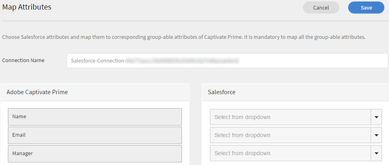
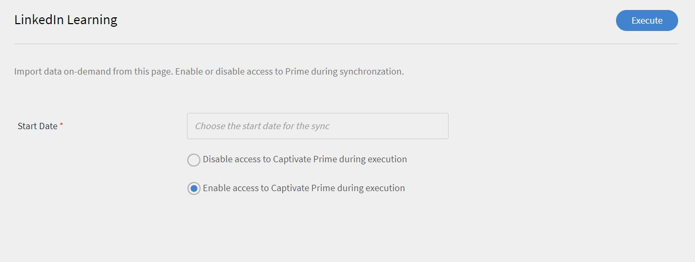
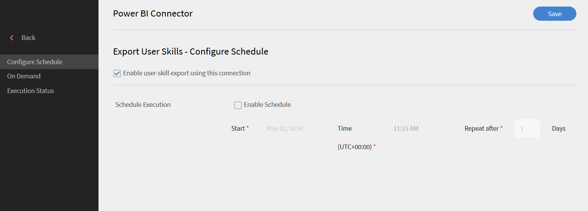
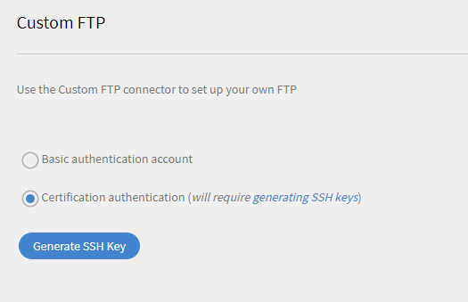
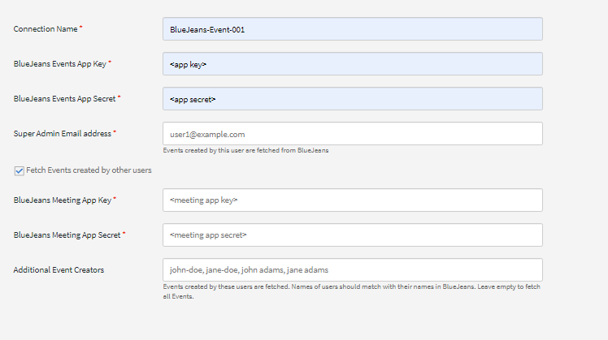

# Conectores de Learning Manager

Las empresas tienen otras aplicaciones y sistemas que se deben integrar con Learning Manager. Los conectores son utilidades que ayudan a realizar integraciones basadas en datos, como la importación de datos en Learning Manager desde sistemas externos.  También realiza la exportación de datos a sistemas externos desde el Administrador de aprendizaje.

Learning Manager ofrece conectores de Salesforce y FTP. Con el conector de Salesforce, los administradores de integración de una empresa integran su aplicación Salesforce con Learning Manager. En calidad de integrador, el conector de FTP también puede utilizarse para importar automáticamente un conjunto de usuarios en la aplicación empresarial.

Asimismo, Learning Manager proporciona los conectores de Lynda, getAbstract y Harvard Management System. Dichos conectores permiten que los alumnos accedan a cursos de Lynda.com, getAbstract y Harvard ManageMentor, respectivamente, y los consuman.

Siga leyendo para saber cómo configurar y usar cada uno de estos conectores en Learning Manager.

<!--
>[!NOTE]
>
>**Update:** December 2020 update of Learning Manager
>
>For **FTP**, **Box**, and **Custom FTP** connectors, while exporting Learner Transcript or xAPI, you can also export the data as a **zip** file, for:
>
>* Learner Transcripts
>* xAPI
-->

>[!NOTE]
>
>Con la versión de noviembre de 2022 de Adobe Learning Manager, Zoom ha dejado de utilizar [la autenticación JWT para junio de 2023](https://marketplace.zoom.us/docs/guides/auth/jwt/). Por lo tanto, el conector de Zoom con JWT seguirá funcionando hasta la fecha indicada, pero recomendamos a los usuarios que creen una aplicación OAuth de servidor a servidor para reemplazar esta función en la cuenta. Todas las conexiones nuevas tendrán la autenticación de OAuth de Zoom de forma predeterminada.

## Conector de Salesforce {#sfconnector}

El conector de Salesforce conecta las cuentas de Learning Manager y Salesforce para automatizar la sincronización de datos. Estas son las prestaciones del conector de Salesforce:

### Asignación de atributos

El administrador de integración puede seleccionar columnas de Salesforce y asignarlas a los correspondientes atributos agrupables de Learning Manager. Tras finalizar la asignación, se aplicará la misma en las posteriores importaciones de usuarios. Se puede volver a configurar si el administrador quiere otra asignación para importar usuarios.

### Importación automatizada de usuarios

El proceso de importación de usuarios permite que el administrador de Learning Manager obtenga datos de los usuarios de Salesforce y los importe automáticamente a Learning Manager. Esta automatización evita la creación y la carga manuales del archivo .csv en Learning Manager.

### Programación automática

El uso de la programación automática junto con la importación automática de usuarios puede ser eficaz. El administrador de Learning Manager puede configurar la programación conforme a los requisitos de la empresa. Los usuarios de la aplicación Administrador de aprendizaje pueden estar al día según la programación. La sincronización se puede realizar a diario en la aplicación Learning Manager.

### Filtrar usuarios

El administrador de Learning Manager puede aplicar filtros en los usuarios antes de importarlos. Por ejemplo, el administrador de Learning Manager puede optar por importar todos los usuarios en la jerarquía bajo uno o más responsables específicos.

### Configurar el conector de Salesforce {#configuresalesforceconnector}

Para integrar Salesforce con el Administrador de aprendizaje, infórmese sobre el proceso

#### Requisitos previos {#prerequisites}

Compruebe que disponga de la URL de la empresa de Salesforce. Por ejemplo, si su empresa se **llama myorg**, la URL de Salesforce podría ser `https://myorg.salesforce.com`. Es lo único que debe indicarse para conectar la cuenta de Salesforce con Learning Manager.

Asimismo, compruebe que tenga las credenciales adecuadas para iniciar sesión en la cuenta.

#### Crear una conexión {#createaconnection}

1. En la página principal de Learning Manager, coloque el cursor sobre la tarjeta/miniatura de Salesforce. Aparece un menú. Haga clic en la opción **[!UICONTROL Conectar]** del menú.

   

   *Opción Conectar*

1. Un cuadro de diálogo le solicita la URL de la empresa. Haga clic en Conectar **** después de haber indicado la URL.
1. Tras conectarse correctamente, aparece la página de información general.

### Asignación de atributos {#mapattributes}

Una vez que la conexión se establece correctamente, puede asignar columnas de Salesforce a los atributos correspondientes del Administrador de aprendizaje. Este paso es obligatorio.

1. En la página de asignaciones, en el lado izquierdo están las columnas del Administrador de aprendizaje; en el derecho, las de Salesforce. Seleccione el nombre de columna adecuado que asignar al nombre de columna del Administrador de aprendizaje.

   
   *Asignación de atributos*

   >[!NOTE]
   >
   >Los datos de la columna del Administrador de aprendizaje mostrados en el lado izquierdo se obtienen de los campos activos. El **campo de responsable** debe asignarse necesariamente a un campo de tipo de dirección de correo electrónico. Asignar todas las columnas es obligatorio antes de poder usar el conector.

1. Haga clic en **[!UICONTROL Guardar]** después de completar la asignación.
1. El conector ya está listo para utilizarse. La cuenta que se ha configurado y aparece como fuente de datos dentro de la aplicación del administrador. El administrador puede programar la importación o la sincronización a petición.

## Uso del conector de Salesforce {#usingsalesforceconnector}

El conector de Salesforce se conecta a Salesforce.com para buscar a los usuarios según su configuración y añadirlos a Learning Manager.

### Importar usuarios desde contactos de Salesforce {#import-salesforce-contacts}

Learning Manager mejora el conector de Salesforce para obtener contactos y usuarios de Salesforce e importarlos automáticamente a Learning Manager.

En la página del conector de Salesforce, introduzca la URL de Salesforce y complete la autenticación. Una vez que se haya autenticado, puede proceder a importar usuarios o contactos. Si elige la opción Contactos, especifique el subconjunto de contactos que se importarán.

Elija las columnas de Salesforce y asígnelas a los atributos agrupables del Administrador de aprendizaje correspondientes. Tras finalizar la asignación, se aplicará la misma en las posteriores importaciones de usuarios.

1. Inicie sesión en Salesforce.
1. En la página de conexión, haga clic en **[!UICONTROL Importar usuarios]** internos.

   
   *Importar usuarios internos*

1. En la **página Importar usuarios** , hay una nueva opción, Contactos. Haga clic en el botón **de opción Contactos** y verá las siguientes opciones.

   
   *Asignación de atributos de contacto*

1. Si hace clic en **[!UICONTROL Sí]**, puede realizar lo siguiente:

   * **Elegir columna Contactos:** seleccione el campo que desea importar al Administrador de aprendizaje.
   * **Especificar valores:** elija los valores que representan el campo seleccionado.

   
   *Especifique los valores*

   * Asigne las columnas de Salesforce a la del Administrador de aprendizaje.
   * Para iniciar la importación, haga clic en **[!UICONTROL Guardar]**.

1. Si hace clic en **[!UICONTROL No. Importe todos los contactos]**, puede asignar los campos directamente sin filtrar los contactos. Aquí, importaría todos los contactos de Salesforce.
1. Para iniciar la importación, haga clic en **[!UICONTROL Guardar]**.

## Exportar registros de aprendizaje

El Administrador de aprendizaje ofrece la posibilidad de exportar a Salesforce registros de aprendizaje como transcripciones, informes de usuarios o informes de aptitudes. Puede determinar si los datos exportados deben vincularse con la tabla &quot;Usuario&quot; o la tabla &quot;Contactos&quot; en Salesforce.

*Exportar registros de aprendizaje*

### Objetos personalizados de Salesforce

Antes de exportar registros de aprendizaje desde el Administrador de aprendizaje, debe crear objetos personalizados en Salesforce. Los objetos personalizados son objetos creados para almacenar información específica de su empresa o sector. Para obtener más información, consulte [Objetos personalizados de Salesforce](https://trailhead.salesforce.com/en/content/learn/modules/data_modeling/objects_intro).

A continuación, se explica cómo crear los objetos:

1. Descargue e instale los paquetes para crear los objetos personalizados.

   * [Paquete 1](https://test.salesforce.com/packaging/installPackage.apexp?p0=04t1k0000008WPJ)
   * [Paquete 2](https://test.salesforce.com/packaging/installPackage.apexp?p0=04t1k0000008WPT)
   * [Paquete 3](https://test.salesforce.com/packaging/installPackage.apexp?p0=04t1k0000008WPi)

1. Cambie el nombre de los objetos personalizados en Salesforce.
1. Seleccione los eventos y haga clic en **[!UICONTROL Guardar]**.

>[!NOTE]
>
>Asegúrese de que se le haya concedido acceso de administrador del sistema a todos los campos activos añadidos después de la instalación del paquete.

**Vincular eventos con:** Elija la sección que desea exportar: Usuario o Contacto. Si elige el objeto Contacto, los usuarios que están presentes en el Administrador de aprendizaje pero no en Salesforce, se crearán en Salesforce.

*Opción Vincular eventos*

>[!NOTE]
>
>Puede crear varias conexiones en una única cuenta. Una única conexión puede servir a hasta tres paquetes en Salesforce. Si desea crear varias conexiones para la misma cuenta de Salesforce, debe instalar los tres paquetes. Se ofrece compatibilidad con hasta tres paquetes.
>
>Debe instalar tantos paquetes como conexiones desee crear.

>[!NOTE]
>
>En la página Estado de ejecución de Salesforce, el número de registros procesados solo se puede comprobar desde Salesforce. El administrador de aprendizaje muestra el estado como completado, aunque haya una exportación parcial o un error en todos los registros que se habían procesado.

## Instalar paquete de Salesforce

Learning Manager ofrece un paquete de aplicación de Salesforce. Una vez instalado y configurado en SFDC, los empleados de ventas pueden realizar sus actividades de formación en el portal de SFDC. Esta aplicación permite a los usuarios de SFDC explorar nuevas formaciones, ver recomendaciones y consumirlas directamente en el portal de SFDC. Los usuarios también reciben los anuncios enviados por los administradores en forma de cabeceras directamente dentro de la aplicación dentro del portal de SFDC.

### Configurar en la aplicación Learning Manager

1. Inicie sesión en su cuenta de administrador de Learning Manager como administrador de integración.
1. Haga clic en **[!UICONTROL Aplicaciones]** > **[!UICONTROL Aplicaciones]** destacadas.
1. Haga clic en **[!UICONTROL Salesforce]**.
1. En la página de la aplicación Salesforce, anote el ID de la aplicación (también conocido como ID de cliente) y el secreto de cliente mencionados en la descripción.
1. Haga clic en **[!UICONTROL Aprobar]** y su aplicación debe aprobarse correctamente.
1. Haga clic en **[!UICONTROL Recursos]** de desarrollador > **[!UICONTROL acceder a los tokens para pruebas y desarrollo]**.
1. En la sección Obtener código OAuth, el ID de cliente y el ámbito deben establecerse en - admin:read,admin:write. Haga clic en **[!UICONTROL Enviar]**.
1. En Obtener token de actualización, introduzca el ID de cliente y el secreto de cliente. Haga clic en **[!UICONTROL Enviar]** y anote el token de actualización.

### Crear cuenta en la aplicación Salesforce

1. Cree una cuenta en la página de registro de Salesforce. Debe crear una cuenta de Salesforce en la edición de desarrollador o empresarial.  [URL de registro de desarrollador.](https://developer.salesforce.com/signup) Asegúrese de usar el ID de correo electrónico para registrarse en Salesforce que había utilizado para el Administrador de aprendizaje.
1. Compruebe su cuenta mediante el correo electrónico de verificación.
1. Cree una contraseña e inicie sesión en Salesforce.
1. Tenga en cuenta la URL de Salesforce después del inicio de sesión (p. ej., site.lightning.force.com).

### Instalar paquete de Learning Manager

Si desea instalar el paquete, primero debe eliminar el paquete existente en Salesforce. Antes de la desinstalación, debe activar la configuración, como se muestra a continuación. La aplicación de esta configuración es obligatoria; de lo contrario, no podrá instalar el paquete.

>[!NOTE]
>
>La aplicación Adobe Learning Manager solo se admite en la vista Lightning de Salesforce.

1. Inicie la URL](https://login.salesforce.com/packaging/installPackage.apexp?p0=04t1k0000008WOQ) del paquete del administrador de [aprendizaje.
1. En la **página de inicio de sesión** , haga clic en **[!UICONTROL Usar dominio]** personalizado.
1. Introduzca la URL del paquete y haga clic en **[!UICONTROL Continuar]**. La página de instalación debe tener seleccionada la opción Instalar solo para administradores. No cambie esta opción.
1. Haga clic en **[!UICONTROL Instalar]**. Una vez instalado el paquete, haga clic en **[!UICONTROL Listo]**. Se le guiará a la página Paquetes instalados y podrá ver el paquete instalado de Adobe Learning Manager.
1. Vaya al Iniciador de aplicaciones (junto a Configuración) y busque Adobe Learning Manager.
1. Para configurar la aplicación, haga clic en **[!UICONTROL Configurar]**.
1. Haga clic en **[!UICONTROL Nuevo]** y añada los siguientes detalles:

   * **Configuración:** introduzca el nombre que desee.
   * **ClientID:** Introduzca el valor que ha obtenido de la primera sección.
   * **Secreto de cliente:** Introduzca el valor que ha obtenido de la primera sección.
   * **RefreshToken:** Introduzca el valor que ha obtenido de la primera sección.
   * **LearningManagerBaseURL:** la dirección URL del sitio donde se aloja el Administrador de aprendizaje.

### Agregar configuración de sitio remoto

1. En la esquina superior derecha de la página, haga clic en **[!UICONTROL Configurar]**.
1. En **[!UICONTROL Búsqueda]** rápida, busque Configuración del sitio remoto.
1. Haga clic en **[!UICONTROL Nuevo sitio]** remoto.
1. Introduzca los detalles:

   * **Nombre del sitio remoto:** introduzca el nombre que desee.
   * **URL del sitio remoto:** la dirección URL del sitio en el que se aloja Learning Manager.

1. Inicie Learning Manager.

### Habilitar notificaciones para la aplicación Administrador de aprendizaje

1. En la esquina superior derecha, haga clic en **[!UICONTROL Configuración]**.
1. Buscar notificaciones personalizadas.
1. Haga clic en **[!UICONTROL Nuevo]**.
1. Introduzca los siguientes datos:

   1. **Nombre de notificación personalizado:** LearningManagerNotification
   1. **Nombre de API:** LearningManagerNotification

1. Seleccione Desktop **** y **Mobile** como canales admitidos.

1. Haga clic en **[!UICONTROL Guardar]**.
1. Para habilitar las notificaciones push para dispositivos móviles, siga los pasos que se indican a continuación:

   1. Instale la aplicación móvil de Salesforce en su teléfono móvil.
   1. Inicie sesión en la aplicación utilizando sus credenciales.
   1. Vaya a **Configuración** > **Configuración de entrega de notificaciones**.
   1. Añada Salesforce para iOS y Android.

### Desinstalar Learning Manager de Salesforce

1. En la aplicación Salesforce, vaya a Paquetes instalados.
1. Haga clic en **[!UICONTROL Desinstalar]**.

## Configurar Learning Manager para usuarios de Salesforce

La aplicación Learning Manager también está disponible para los usuarios que estén presentes en cualquier cuenta de Salesforce. El administrador de Salesforce puede añadir usuarios en función de los perfiles. Los perfiles de Salesforce son similares a los de Learning Manager. Por ejemplo, Administrador, Administrador de integración, Instructor, etc. El administrador de Salesforce también puede crear un perfil personalizado.

Como administrador de Salesforce, puede asignar los perfiles a los usuarios o crear un perfil personalizado.

Al instalar el paquete, puede asignar el perfil de Salesforce a los alumnos.

Después de instalar el paquete, debe configurar el perfil.

Haga clic en **[!UICONTROL Configurar]** > **[!UICONTROL nuevo]** y, a continuación, agregue lo siguiente:

* Nombre de configuración
* ClientID
* ClientSecret
* LearningManagerBaseURL
* Deshabilitar redirección

>[!NOTE]
>
>Para que los alumnos puedan ver la aplicación Administrador de aprendizaje, debe habilitar la aplicación para todos los alumnos.

El siguiente paso es proporcionar el permiso para acceder a la aplicación Learning Manager.

*Definir permisos para acceder a la aplicación Administrador de aprendizaje*

Seleccione los usuarios y asigne los permisos correspondientes. Los alumnos ya pueden acceder a la aplicación Learning Manager.

A continuación, seleccione un perfil, por ejemplo, Perfil estándar de un usuario, y haga clic en el perfil. Haga clic **[!UICONTROL en Editar]** y, en la sección Ajustes **de aplicación** personalizados, active la casilla **de verificación Adobe Learning Manager**. Esto hace que la aplicación sea accesible para el usuario.

En la sección **Ajustes de pestaña personalizados**, en la lista desplegable **Página de inicio del alumno**, seleccione la opción **Por defecto en**.

Debe hacer que la aplicación esté visible para todos los perfiles.

Haga clic en **[!UICONTROL Guardar]** y los alumnos que pertenezcan a todos los perfiles accederán a la aplicación Learning Manager.

### Cambios relacionados con la ruta de aprendizaje

#### Conexiones existentes

Si la opción Ruta de aprendizaje está desactivada en la cuenta de administrador, no se añaden filas ni columnas en el informe.

Si la opción Ruta de aprendizaje está activada en la cuenta de administrador, la columna &quot;Tipo&quot; se rellenará con la ruta de aprendizaje en caso de que los alumnos se inscriban en ella.

>[!NOTE]
>
>Si el indicador está habilitado y utiliza una conexión existente, es posible que se pierdan algunos registros.

#### Nuevas conexiones

Si la opción Ruta de aprendizaje está desactivada en la cuenta de administrador, el informe de formación constará de las siguientes columnas, pero no contendrá ningún dato.

* **Ruta incrustada:** muestra el nombre del programa de aprendizaje
* **ID de ruta incrustada:** muestra los ID del programa de aprendizaje.
* **ID de curso incrustado:** muestra los ID de los cursos que se encuentran dentro de un programa de formación.

Además, para las nuevas conexiones en las cuentas en las que la opción Ruta de aprendizaje está activada, aparecerán las tres columnas nuevas y todos los datos fluirán.

Además, el informe contendrá el tipo de columna Ruta de aprendizaje (nivel superior) de todos los alumnos inscritos en un programa de formación.

En la columna Tipo, el programa de aprendizaje pasará a llamarse Ruta de aprendizaje. Para las conexiones existentes, no habrá cambios.

## Conector FTP de Learning Manager {#ftpconnector}

Con el conector de FTP, es posible integrar Learning Manager con sistemas externos arbitrarios para automatizar la sincronización de datos. En principio, los sistemas externos pueden exportar datos en formato CSV y colocarlos en la carpeta apropiada de la cuenta de FTP de Learning Manager. Estas son las prestaciones del conector de FTP:

También puede utilizar el Conector de Box para la migración de datos, la importación de usuarios y la exportación de datos. Para obtener más información, consulte Conector de Box.

### Importación de datos {#dataimport}

El proceso de importación de usuarios permite que el administrador de Learning Manager obtenga datos del servicio de FTP de Learning Manager y los importe automáticamente a Learning Manager. Esta función permite integrar varios sistemas colocando el archivo .csv generado por dichos sistemas en las carpetas correspondientes de las cuentas de FTP. Learning Manager recopila los archivos .csv, los combina e importa los datos conforme a la programación. Consulte la función Programación para obtener más información.

**Asignación de atributos**

El administrador de integración puede seleccionar las columnas del archivo .csv y asignarlas a los atributos agrupables de Learning Manager. Esta asignación es una acción que se efectúa una sola vez. Tras finalizar la asignación, la misma asignación se aplica en las posteriores importaciones de usuarios. La asignación se puede volver a configurar si el administrador quiere otra asignación para importar usuarios.

#### Exportación de datos {#exportdata}

La opción Exportación de datos permite exportar aptitudes de usuarios y transcripciones de alumnos a una ubicación de FTP para su integración con cualquier otro sistema de tercero.

#### Programación {#scheduling}

El usuario puede configurar tareas de programación conforme a los requisitos de la empresa y los usuarios de Learning Manager están al día según la programación. Asimismo, el administrador de integración puede programar la exportación de aptitudes de manera oportuna para integrarse con un sistema externo. La sincronización se puede realizar a diario en la aplicación Learning Manager.

### Configurar el conector FTP de Learning Manager {#configurecaptivateprimeftpconnector}

Para integrar el conector de FTP con el Administrador de aprendizaje, infórmese sobre el proceso.

#### Crear una conexión {#Createaconnection-1}

1. En la página principal de Learning Manager, coloque el cursor sobre la tarjeta/miniatura de FTP. Aparece un menú. Haga clic en la opción **[!UICONTROL Conectar]** del menú.

   

   *Opción Conectar*

1. Un cuadro de diálogo le solicita el ID de correo electrónico. Proporcione el ID de correo electrónico de la persona responsable de administrar la cuenta de FTP de Learning Manager para la organización. Haga clic en Conectar **** después de haber indicado el ID de correo electrónico.
1. Learning Manager le envía un mensaje de correo electrónico solicitando al usuario que restablezca la contraseña antes de acceder al FTP por primera vez. El usuario debe restablecer la contraseña y usarla para acceder a la cuenta de FTP de Learning Manager.

   >[!NOTE]
   >
   >Solo se puede crear una cuenta de FTP de Learning Manager para una determinada cuenta de Learning Manager.

   En la página de información general, puede especificar el nombre de conexión de la integración. Elija la acción que desea efectuar de las siguientes opciones:

   * Importar usuarios internos
   * Importar xAPI
   * Exportar usuarios externos: Configurar una programación
   * Exportar usuarios externos: A petición
   * Exportar transcripciones de alumnos: Configurar una programación
   * Exportar transcripciones de alumnos: A petición

   
   *Opciones de exportación*

### Importar

+++Usuario interno

La opción de importar usuarios internos le permite importar los usuarios de un archivo .csv a un Administrador de aprendizaje bajo demanda o programación.

+++

++++Asignación de atributos

Una vez que la conexión se establece correctamente, puede asignar columnas de archivos .csv. Se coloca en la carpeta FTP para los atributos correspondientes de Learning Manager. Este paso es obligatorio.

1. En la página Asignación de atributos, en el lado izquierdo están las columnas esperadas del Administrador de aprendizaje; en el derecho, las de CSV. Al principio, en el lado derecho, hay un cuadro de selección vacío. Importe cualquier archivo .csv de plantilla haciendo clic en **Elegir archivo**.
1. El paso anterior rellena la lista desplegable seleccionada de la derecha con todos los nombres de columnas de CSV. Seleccione el nombre de columna adecuado que asignar al nombre de columna del Administrador de aprendizaje.

   >[!NOTE]
   >
   >El campo de responsable debe asignarse necesariamente a un campo de tipo de dirección de correo electrónico. Asignar todas las columnas es obligatorio antes de poder usar el conector.

1. Haga clic en **[!UICONTROL Guardar]** después de completar la asignación.

   El conector ya está listo para utilizarse. La cuenta que se ha configurado ahora aparece como fuente de datos dentro de la aplicación del administrador, para que el administrador programe la importación o la sincronización a petición.

+++

+++Uso del conector de FTP del Administrador de aprendizaje

1. Los archivos .csv de sistemas externos se deben ubicar en la ruta siguiente:

   `code $OPERATION$/$OBJECT_TYPE$/$SUB_OBJECT_TYPE$/data.csv`

   >[!NOTE]
   >
   >En la versión de julio de 2016, solo se permite la importación de usuarios. Por lo tanto, para usar el conector de FTP, asegúrese de que los archivos .csv se coloquen en la carpeta siguiente:

   `code Home/import/user/internal/*.csv`

1. El conector de FTP toma todas las filas de los archivos .csv. Es importante que la fila correspondiente a un usuario en un archivo .csv no aparezca en ningún otro archivo .csv.
1. Todos los archivos .csv deben contener las columnas especificadas en la asignación.
1. Todos los archivos .csv necesarios deben estar presentes en la carpeta antes de que comience el proceso.

>[!NOTE]
>
>Al importar usuarios a Learning Manager, el administrador también necesita saber cómo se administran los usuarios en Learning Manager. Consulte Ayuda de [administración de](migration-manual.md#usermanagement) usuarios para obtener más información.

+++

+++Importar xAPI

Las opciones de Importar xAPI permiten programar la importación de declaraciones xAPI de servicios de terceros en Learning Manager a petición.

+++

+++Configuraciones necesarias para importar xAPI

1. En la página configuración, seleccione una configuración existente que esté disponible en la lista de configuraciones para importar declaraciones xAPI desde el CSV. Haga clic en el vínculo Editar o **agregar una nueva configuración** para ir a la página configurar orígenes de importación.

   **Configuración**

   * En la página de configuración de orígenes de importación, rellene los campos de nombre y nombre de archivo de origen. El nombre del archivo de origen debe coincidir con el que figura en la ubicación de la carpeta FTP.
   * Haga clic en **[!UICONTROL Guardar]** para guardar sus cambios.

   
   *Configurar*

   **Filtro**

   * En el panel izquierdo, haga clic en **[!UICONTROL Filtro]**.
   * En la página de configuración del filtro de importación, complete los campos relativos al nombre y las condiciones para filtrar los registros. Haga clic en **[!UICONTROL Añadir nuevo filtro]** para incorporar otro filtro. Un filtro se puede guardar o eliminar haciendo clic, respectivamente, en la opción **Guardar** o **Eliminar** de la columna Acciones.

   
   *Filtro*

   **Asignación**

   * En el panel izquierdo, haga clic en **[!UICONTROL Asignación]**.
   * En el lado izquierdo de la página de configuración de asignación de declaraciones, se pueden ver los nombres de ruta de los campos JSON de xAPI que se deben asignar a los nombres de columna de CSV.
   * De forma predeterminada, los tres nombres de campo de ruta JSON que se deben asignar a los nombres de columna de CSV son **actor.mbox**, **verb.id** y **object.id**. Puede añadir otros campos para asignar haciendo clic en **Añadir nueva asignación**.

   * Seleccione el tipo de nombre de columna que asigna al nombre de ruta de campo JSON (cadena, número, valor booleano o tipo de fecha).
   * Tras completar la asignación, haga clic en Guardar. La importación de xAPI ahora se puede importar mediante programación o a petición.

   
   *Asignación*

1. En el panel izquierdo, haga clic en **[!UICONTROL Configurar programación]**. Haga clic en **[!UICONTROL Habilitar programación]** para programar la importación de declaraciones xAPI.

   Puede indicar la hora y la fecha de inicio; a continuación, especifique de la programación de importación de xAPI en días. Por ejemplo, habilite la importación de xAPI cada 3 días.

   
   *Importación de declaraciones xAPI: Configuración de programación*

1. En el panel izquierdo, haga clic en **[!UICONTROL Ejecución]** a petición.

   
   *Importar declaraciones xAPI a petición*

1. En el panel izquierdo, haga clic en **[!UICONTROL Estado de la ejecución]** para examinar el resumen de todas las ejecuciones de este conector en orden cronológico. Puede ver la fecha de inicio y la duración del proceso de importación de xAPI, el tipo de importación (a petición o programada) y el estado de la importación (en curso, completada o con errores).

   
   *Importación de instrucciones xAPI: Estado de la ejecución*

+++

### Exportar

+++Habilidades

Hay dos opciones para exportar informes de aptitudes del usuario.

**[!UICONTROL Aptitudes del usuario: A petición]**: puede especificar la fecha de inicio y exportar el informe usando la opción. El informe se extrae desde la fecha indicada hasta el presente.

*Opción de exportación a petición*

**[!UICONTROL Aptitudes del usuario: Configurar]**: esta opción le permite programar la extracción del informe. Seleccione la casilla de verificación Habilitar programación y especifique la fecha y la hora de inicio. También puede especificar el intervalo en el que desea que se genere y se envíe el informe.

*Configurar exportación de informe*

+++

Para abrir la carpeta Export donde se colocan los archivos exportados, abra el vínculo a la carpeta de FTP que se proporciona en la página Aptitudes del usuario como se muestra a continuación.

*Carpeta de FTP para ver archivos*

Los archivos exportados automáticamente se encuentran en la ubicación **Inicio/exportación/&#42;FTP_location&#42;**

Los archivos exportados automáticamente están disponibles con el título **skill_achievements_fecha desde &#42;_, hasta&#42;_&#42;.csv&#42;**

*Archivo .csv exportado*

+++Transcripciones de alumnos

**Configurar**: Esta opción le permite programar la extracción del informe. Seleccione la casilla de verificación Habilitar programación y especifique la fecha y la hora de inicio. También puede especificar el intervalo en el que desea que se genere y se envíe el informe.

+++

Para abrir la carpeta Export donde se colocan los archivos exportados en la ubicación del FTP, abra el vínculo a la carpeta de FTP que se proporciona en la página Transcripciones de alumnos como se muestra a continuación.

Los archivos exportados automáticamente se encuentran en la ubicación **Inicio/exportación/&#42;FTP_location&#42;**

Los archivos exportados automáticamente están disponibles con el título **learner_transcript_fecha desde, hasta&#42;&#42;__&#42;.csv&#42;**

### Compatibilidad con campos de .csv manuales {#supportformanualcsvfields}

Al importar datos de usuarios a través de FTP, un administrador debe asignar todos los campos activos presentes en el sistema al campo correspondiente en el archivo .csv.

Esto es obligatorio para todos los campos activos de .csv. Para los campos activos manuales, el administrador de integración puede seleccionar la opción **DontImportFromSource**.

Al seleccionar esta opción, los valores de campos activos manuales no se rellenan mediante la importación de un archivo .csv. Los valores proporcionados por el alumno permanecen intactos.

>[!NOTE]
>
>Durante la asignación, si se selecciona la opción **DontImportFromSource** para el campo activo csv, este campo se eliminará del sistema.

*Conector de FTP para campos activos*

## Conector de Lynda {#lyndaconnector}

El conector Lynda es válido para clientes empresariales de Lynda.com que desean que sus alumnos descubran y consuman cursos de Lynda desde Learning Manager. El conector se puede configurar para obtener cursos de Lynda.com de manera periódica con la clave de API. Después de crear un curso en Learning Manager, los usuarios lo pueden buscar y consumir. Después, se puede seguir el progreso del alumno desde Learning Manager.

### Configurar el conector de Lynda {#configurethelyndaconnector}

1. En el tablero del administrador de integración, haga clic en Lynda.

   Verá el mosaico con tres opciones: Introducción, Connect y Administrar conexiones.

1. Si configura el conector de Lynda por primera vez, haga clic en Conectar.

   <!--Configure the Exavault FTP account before you configure this connector.-->

1. En la página de conexión, especifique un nombre para el conector. Indique la Appkey y la clave secreta de la conexión.

   >[!NOTE]
   >
   >Póngase en contacto con su proveedor para obtener la Appkey y la clave secreta.

1. Haga clic en Guardar.

   La configuración se guarda y se agrega la conexión de Lynda para su cuenta. Ahora puede hacer clic en Administrar conexiones desde la página de inicio y editar su configuración en cualquier momento.

1. Si ya tiene una conexión establecida, haga clic en Administrar conexiones para ver todas sus conexiones.

   >[!NOTE]
   >
   >La función de migración debe estar habilitada para su cuenta antes de configurar este conector.

1. Haga clic en la conexión que desea editar.
1. En el panel izquierdo, haga clic en **[!UICONTROL Configurar]**. Elija una de las opciones siguientes:

   * Vea o edite los detalles de su cuenta y el calendario de sincronización desde esta ventana. Seleccione la casilla de verificación Habilitar conexión si desea habilitar esta cuenta.
   * Haga clic en Editar y edite sus credenciales. Haga clic en Restablecer para deshacer sus actualizaciones en este campo.
   * Haga clic en Habilitar programación para programar su sincronización. Puede indicar la hora y la fecha de inicio; a continuación, especifique ingresar la frecuencia de su programa de sincronización en días. Por ejemplo, habilite la sincronización cada tres días.

   Haga clic en **[!UICONTROL Guardar]** para guardar sus cambios.

   

   *Configurar el conector de Lynda para el Administrador de aprendizaje*

1. En el panel izquierdo, haga clic en Ejecución a petición. Esta opción le permite importar fuentes de usuario y otros datos relevantes de Lynda. Indique la fecha de inicio para la ejecución a petición y haga clic en Ejecutar para ejecutar la sincronización. Se importan todos los datos desde la fecha de inicio hasta el presente.

   * Puede hacer clic en Deshabilitar acceso a Learning Manager durante la ejecución en la que la aplicación tiene un tiempo de inactividad durante la sincronización.
   * Si hace clic en Habilitar acceso a Learning Manager durante la ejecución, no hay interrupción en el servicio durante la sincronización.

   

   *Ejecución a petición para el conector de Lynda*

1. También puede hacer clic en Estado de la ejecución en el panel izquierdo en cualquier momento para ver el resumen de todas las ejecuciones de este conector, en orden cronológico. Puede ver la fecha de inicio y la duración de la sincronización, el tipo de sincronización (si se trata de sincronización a petición) y el estado de la sincronización (si la sincronización está en curso o está completa).

   >[!NOTE]
   >
   >Cuando elimina y vuelve a crear una conexión, aparecen de nuevo las ejecuciones anteriores del conector. Puede ver todas las ejecuciones antes de eliminar la conexión.

   Puede repetir una ejecución solo de la última sincronización.

   

   *Ver el resumen de todas las ejecuciones hacer clic en Estado de la ejecución*

## Conector de getAbstract {#getabstractconnector}

El conector de getAbstract es válido para clientes empresariales de getAbstract.com que desean que sus alumnos descubran y consuman cursos de getAbstract. El conector se puede configurar para obtener datos de uso de manera periódica en función de los registros de finalización de alumno que se creen en Learning Manager. Siga leyendo para saber cómo configurar y usar este conector en Learning Manager.

### Configurar el conector de getAbstract {#configurethegetabstractconnector}

1. En el tablero del administrador de integración, haga clic en getAbstract.

   En el mosaico, se ven tres opciones: Introducción, Connect y Administrar conexiones.

1. Si configura el conector de getAbstract por primera vez, haga clic en Conectar.

   <!--Configure the Exavault FTP account before you configure this connector.

   Ensure that you share this FTP credentials with your content provider to access the feeds.-->

1. En el campo Nombre de conexión, asigne un nombre a la conexión.

   Indique las claves pertinentes en los campos ID y Secreto de cliente. Póngase en contacto con su proveedor para obtener las claves correspondientes a este conector.

   Las claves son necesarias para obtener los metadatos de curso para los cursos consumidos por el cliente.

1. Si ya tiene una conexión establecida, en la página de inicio, haga clic en getAbstract > Administrar conexiones para ver y editar su configuración.

   >[!NOTE]
   >
   >La función de migración debe estar habilitada para su cuenta antes de configurar este conector.

1. Haga clic en la conexión cuya configuración desea ver o editar.

   

   *Configurar el conector de getAbstract para el Administrador de aprendizaje*

1. En el panel izquierdo, haga clic en Configurar. Elija una de las opciones siguientes:

   * Vea o edite los detalles de su cuenta y el calendario de sincronización desde esta ventana. Seleccione la casilla de verificación Habilitar conexión si desea habilitar esta cuenta.
   * Haga clic en Editar y edite sus credenciales. Haga clic en Restablecer para deshacer sus actualizaciones en este campo.
   * Haga clic en Habilitar programación para programar su sincronización. Puede indicar la hora y la fecha de inicio; a continuación, especifique ingresar la frecuencia de su programa de sincronización en días. Por ejemplo, habilite la sincronización cada tres días.

1. Haga clic en **[!UICONTROL Guardar]**.

   La configuración se guarda y se agrega la conexión de getAbstract para su cuenta.

1. En el panel izquierdo, haga clic en Ejecución a petición. Esta opción le permite importar fuentes de usuario y otros datos relevantes de getAbstract. Indique la fecha de inicio para la ejecución a petición y haga clic en Ejecutar para ejecutar la sincronización. Se importan todos los datos desde la fecha de inicio hasta el presente.

   * Puede hacer clic en Deshabilitar acceso a Learning Manager durante la ejecución en la que la aplicación tiene un tiempo de inactividad durante la sincronización.
   * Si hace clic en Habilitar acceso a Learning Manager durante la ejecución, no hay interrupción en el servicio durante la sincronización.

1. También puede hacer clic en Estado de la ejecución en el panel izquierdo en cualquier momento para ver el resumen de todas las ejecuciones de este conector, en orden cronológico. Puede ver la fecha de inicio y la duración de la sincronización, el tipo de sincronización (si se trata de sincronización a petición) y el estado de la sincronización (si la sincronización está en curso o está completa).

   >[!NOTE]
   >
   >Cuando elimina y vuelve a crear una conexión, aparecen de nuevo las ejecuciones anteriores del conector. Puede ver todas las ejecuciones antes de eliminar la conexión.

   Puede repetir una ejecución solo de la última sincronización.

   Para que funcione cualquier tipo de sincronización, asegúrese de que la fuente del usuario esté presente en la carpeta FTP de getAbstract para las fechas especificadas en la sincronización.

   Consulte la siguiente hoja de Excel, que es un archivo de fuente de usuario de muestra de getAbstract. El nombre de archivo debe tener el formato: **exportación_de_informe_aaaa_MM_dd_HHmmss.xlsx** o **exportación_de_informe_aaaa_MM_dd.xlsx**.
   [Hoja de Excel de muestra de fuente de usuario de getAbstract](assets/report-export-20170401175342.xlsx)

## Conector de Harvard ManageMentor {#hmmconnector}

El conector de Harvard ManageMentor es válido para clientes empresariales de Harvard ManageMentor que desean que sus alumnos descubran y consuman cursos de Harvard ManageMentor. El conector ayuda a crear cursos en Learning Manager; se puede configurar para obtener datos sobre el progreso de los alumnos de forma periódica. Para configurar este conector, realice el procedimiento siguiente:

### Configurar el conector de Harvard ManageMentor {#configuretheharvardmanagermentorconnector}

1. En el tablero del administrador de integración, haga clic en Harvard ManageMentor.

   En el mosaico, se ven tres opciones: Introducción, Connect y Administrar conexiones.

1. Si configura el conector de Harvard ManageMentor por primera vez, haga clic en Conectar.

   <!--Configure the Exavault FTP account before you configure this connector.

   Ensure that you share this FTP credentials with your content provider to access the feeds.-->

1. En el campo Nombre de conexión, asigne un nombre a la conexión. Haga clic en Conectar para guardar esta conexión.
1. Si ya tiene una conexión establecida, en la página de inicio, haga clic en Harvard ManageMentor > Administrar conexiones. Haga clic en la conexión cuya configuración desea editar.

   >[!NOTE]
   >
   >La función de migración debe estar habilitada para su cuenta antes de configurar este conector.

   

   *Configurar el conector de Harvard ManageMentor para Learning Manager*

1. En el panel izquierdo, haga clic en Configurar. Elija una de las opciones siguientes:

   * Vea o edite los detalles de su cuenta y el calendario de sincronización desde esta ventana. Seleccione la casilla de verificación Habilitar conexión si desea habilitar esta cuenta.
   * Haga clic en Habilitar programación para programar su sincronización. Puede indicar la hora y la fecha de inicio; a continuación, especifique ingresar la frecuencia de su programa de sincronización en días. Por ejemplo, habilite la sincronización cada tres días.

1. En el panel izquierdo, haga clic en Ejecución a petición. Esta opción le permite importar fuentes de usuario y otros datos relevantes de Harvard ManageMentor. Indique la fecha de inicio para la ejecución a petición y haga clic en Ejecutar para ejecutar la sincronización. Se importan todos los datos desde la fecha de inicio hasta el presente para esta conexión.

   * Puede hacer clic en Deshabilitar acceso a Learning Manager durante la ejecución en la que la aplicación tiene un tiempo de inactividad durante la sincronización.
   * Si hace clic en Habilitar acceso a Learning Manager durante la ejecución, no hay interrupción en el servicio durante la sincronización.

   Si desea automatizar la sincronización cada pocos días, especifique el número de días en el campo Repetir número de días. La sincronización garantiza que su cuenta se actualice con la última versión de los resúmenes de Harvard ManageMentor.

1. También puede hacer clic en Estado de la ejecución en el panel izquierdo en cualquier momento para ver el resumen de todas las ejecuciones de este conector, en orden cronológico. Puede ver la fecha de inicio y la duración de la sincronización, el tipo de sincronización (si se trata de sincronización a petición) y el estado de la sincronización (si la sincronización está en curso o está completa).

   >[!NOTE]
   >
   >Cuando elimina y vuelve a crear una conexión, aparecen de nuevo las ejecuciones anteriores del conector. Puede ver todas las ejecuciones antes de eliminar la conexión.

   Puede repetir una ejecución solo de la última sincronización.

   Para que la sincronización sea correcta, asegúrese de que al menos uno de los siguientes archivos esté presente en la carpeta FTP de Harvard ManageMentor:

   hmm12_metadata.xlsx: este archivo proporciona los metadatos de cursos para el conector de Harvard ManageMentor. Asegúrese de seguir la convención de nomenclatura cuando cargue el archivo.

   client_hmm12_20150125.xlsx: esta es la fuente del usuario para el conector de Harvard ManageMentor. La convención de nomenclatura de archivos que se debe seguir es **cliente_hmm12_aaaaMMdd.xlsx.**

   Vea los dos ejemplos siguientes de fuente de usuario y de siguientes de curso para este conector:

   * [Archivo de metadatos de cursos para el conector de Harvard ManageMentor](assets/hmm12-metadata.xlsx)
   * [Fuente de usuario para el conector de Harvard ManageMentor](assets/client-hmm12-20170304.xlsx)

## Conector de Workday {#workdayconnector}

Con el conector de Workday, puede integrar Learning Manager con el inquilino de Workday para automatizar la sincronización de datos.

### Importar

#### Asignación de atributos

El administrador de integración puede seleccionar columnas de Workday y asignarlas a los correspondientes atributos agrupables de Learning Manager. Tras finalizar la asignación, se aplicará la misma en las posteriores importaciones de usuarios. Se puede volver a configurar si el administrador quiere otra asignación para importar usuarios.

#### Importación automatizada de usuarios

El proceso de importación de usuarios permite que el administrador de Learning Manager obtenga datos de los usuarios de Workday y los importe automáticamente a Learning Manager.

#### Filtrar usuarios

El administrador de Learning Manager puede aplicar filtros en los usuarios antes de importarlos. Por ejemplo, el administrador de Learning Manager puede optar por importar todos los usuarios en la jerarquía bajo uno o más responsables específicos.

### Exportar

La opción Exportación de aptitudes de usuario permite exportar aptitudes de usuarios a Workday automáticamente.

>[!NOTE]
>
>Las aptitudes de varias cuentas de Learning Manager no se pueden exportar simultáneamente con la misma cuenta de Workday.

#### Puntos a destacar

* Asegúrese de que UUID, la dirección de correo electrónico y el nombre del empleado sean únicos en las múltiples integraciones de Workday. Los valores incorrectos provocarán un error de conexión.
* El campo UUID rellenado una vez a través de Workday activado no puede ser eliminado por ningún cliente que se enfrente al administrador del LMS. Si desea cambiar el valor, póngase en contacto con el equipo de asistencia o de incorporación de Adobe Learning Manager.
* Es posible que la opción Purgar usuarios tampoco funcione, ya que la Purga de usuarios solo admite 50 usuarios para ser purgas por ejecución. Tenga mucho cuidado al cargar los usuarios a través de los UUID.

### Programación {#Scheduling-1}

El usuario puede configurar tareas de programación conforme a los requisitos de la empresa y los usuarios de Learning Manager están al día según la programación. Asimismo, el administrador de integración puede programar la exportación de aptitudes de manera oportuna para integrarse con un sistema externo. La sincronización se puede realizar a diario en la aplicación Learning Manager.

### Configurar el conector de Workday {#configureworkdayconnector}

>[!PREREQUISITES]
>
>Solicite al administrador de Workday de su empresa que cree un usuario de sistema de integración con los permisos definidos en el documento ISU_Permissions. Descargue una copia del vínculo a continuación.

[Descargue una copia de la seguridad del usuario de sistema de integración.](assets/isu-permissions-v1.pdf) Para integrar el conector de Workday con el Administrador de aprendizaje, infórmese sobre el proceso.

1. En la página principal del Administrador de aprendizaje, desplace el ratón por encima del mosaico de Workday. Aparece un menú. Haga clic en la opción **[!UICONTROL Conectar]** del menú.

   

   *Mosaico de Workday*

1. Un cuadro de diálogo le solicita las credenciales de la nueva conexión. Rellene los campos siguientes antes de efectuar la conexión.

   * Nombre de conexión: proporcione un nombre de conexión según su preferencia.
   * URL de host: el administrador de integración puede obtener los detalles de URL de host del administrador de Workday correspondiente.
   * Inquilino: el inquilino es interno de su empresa. Su administrador de Workday le proporciona los detalles del inquilino.
   * Nombre de usuario y contraseña: el administrador de Workday crea un usuario de sistema de integración con los privilegios de seguridad necesarios y lo comparte con el administrador de integración.

>[!NOTE]
>
>   Learning Manager utiliza la versión 40.1 de la API de Workday.

*Configurar el conector de Workday*

1. Haga clic en Conectar después de proporcionar información en todos los campos pertinentes.

   >[!NOTE]
   >
   >También puede tener varias conexiones de Workday sincronizadas con su cuenta de Learning Manager.

En la página de información general, puede especificar el nombre de conexión de la integración. Elija la acción que desea efectuar de las siguientes opciones:

* Importar usuarios internos
* Exportar usuarios externos: Configurar una programación
* Exportar usuarios externos: A petición

*Información general de Workday*

### Importar

#### Asignación de atributos {#MapAttributes-1}

Con el conector de Workday, puede integrar Learning Manager y Workday para automatizar la sincronización de datos. Puede importar todos los usuarios activos de Workday a Learning Manager. Los usuarios pueden importarse de diversas fuentes de datos, incluidos FTP y Salesforce.

Antes de importar usuarios, deben asignarse los atributos de usuario de Learning Manager y Workday. En la página Descripción general, use la opción Usuarios internos en Importar para proporcionar la asignación de atributos.

Introduzca las credenciales de Adobe Learning Manager en la columna Adobe Learning Manager. Use los menús desplegables a fin de seleccionar las credenciales correctas para las columnas en Workday.

>[!NOTE]
>
>Actualmente, Learning Manager admite la importación de 69 atributos de usuario de Workday. Añada más atributos mediante los campos activos de Learning Manager.

*Asignación de atributos*

Seleccione la **casilla de verificación Excluir trabajadores** contingentes para evitar que se importen los trabajadores temporales disponibles bajo un administrador.

Workday tiene cuatro niveles de jerarquía, mientras que Learning Manager tiene dos niveles. Los cuatro niveles de Workday son categoría de perfil de aptitud, perfil de aptitud, categoría de elemento de aptitud y elemento de aptitud. El nombre de la aptitud y el nivel del responsable de aprendizaje se asignan en Workday debajo del elemento de aptitud.

>[!NOTE]
>
>Puede añadir atributos de Workday adicionales. Póngase en contacto con su CSAM para obtener los atributos añadidos.

+++ Lista de atributos de Workday admitidos

wd:User_ID
wd:Worker_ID
director
wd:Personal_Data.wd:Name_Data.wd:Preferred_Name_Data.wd:Name_Detail_Data.@wd:Formatted_Name
wd:Personal_Data.wd:Name_Data.wd:Legal_Name_Data.wd:Name_Detail_Data.@wd:Formatted_Name
wd:Personal_Data.wd:Name_Data.wd:Legal_Name_Data.wd:Name_Detail_Data.wd:Prefix_Data.wd:Title_Descriptor
wd:Personal_Data.wd:Name_Data.wd:Preferred_Name_Data.wd:Name_Detail_Data.wd:Prefix_Data.wd:Title_Descriptor
wd:Personal_Data.wd:Name_Data.wd:Preferred_Name_Data.wd:Name_Detail_Data.wd:First_Name
wd:Personal_Data.wd:Name_Data.wd:Preferred_Name_Data.wd:Name_Detail_Data.wd:Last_Name
wd:Personal_Data.wd:Name_Data.wd:Legal_Name_Data.wd:Name_Detail_Data.wd:First_Name
wd:Personal_Data.wd:Name_Data.wd:Legal_Name_Data.wd:Name_Detail_Data.wd:Last_Name
wd:Personal_Data.wd:Contact_Data.wd:Address_Data.0.@wd:Formatted_Address
wd:Personal_Data.wd:Contact_Data.wd:Address_Data.0.wd:Postal_Code
wd:Personal_Data.wd:Contact_Data.wd:Email_Address_Data.0.wd:Email_Address
wd:Personal_Data.wd:Contact_Data.wd:Address_Data.0.wd:Country_Region_Descriptor
wd:Personal_Data.wd:Contact_Data.wd:Phone_Data.0.@wd:Formatted_Phone
wd:Personal_Data.wd:Contact_Data.wd:Phone_Data.0.wd:Country_ISO_Code
wd:Personal_Data.wd:Contact_Data.wd:Phone_Data.0.wd:International_Phone_Code
wd:Personal_Data.wd:Contact_Data.wd:Phone_Data.0.wd:Phone_Number
wd:Personal_Data.wd:Primary_Nationality_Reference.wd:ID.1.$
wd:Personal_Data.wd:Gender_Reference.wd:ID.1.$
wd:Personal_Data.wd:Identification_Data.wd:National_ID.0.wd:National_ID_Data.wd:ID
wd:Personal_Data.wd:Identification_Data.wd:Custom_ID.0.wd:Custom_ID_Data.wd:ID
wd:User_Account_Data.wd:Default_Display_Language_Reference.wd:ID.1.$
wd:Role_Data.wd:Organization_Role_Data.wd:Organization_Role.0.wd:Organization_Role_Reference.wd:ID.1.$
wd:Employment_Data.wd:Worker_Job_Data.0.wd:Position_Data.wd:Position_Title
wd:Employment_Data.wd:Worker_Job_Data.0.wd:Position_Data.wd:Business_Title
wd:Employment_Data.wd:Worker_Job_Data.0.wd:Position_Data.wd:Business_Site_Summary_Data.wd:Nombre
wd:Employment_Data.wd:Worker_Job_Data.0.wd:Position_Data.wd:Business_Site_Summary_Data.wd:Address_Data.@wd:Formatted_Address
wd:Employment_Data.wd:Worker_Job_Data.0.wd:Position_Data.wd:Job_Classification_Summary_Data.0.wd:Job_Classification_Reference.wd:ID.1.$
wd:Employment_Data.wd:Worker_Job_Data.0.wd:Position_Data.wd:Job_Classification_Summary_Data.0.wd:Job_Group_Reference.wd:ID.1.$
wd:Employment_Data.wd:Worker_Job_Data.0.wd:Position_Data.wd:Work_Space__Reference.wd:ID.1.$
wd:Employment_Data.wd:Worker_Job_Data.0.wd:Position_Data.wd:Job_Profile_Summary_Data.wd:Job_Family_Reference.0.wd:ID.1.$
wd:Employment_Data.wd:Worker_Job_Data.0.wd:Position_Data.wd:Job_Profile_Summary_Data.wd:Job_Profile_Name
wd:Employment_Data.wd:Worker_Job_Data.0.wd:Position_Data.wd:Job_Profile_Summary_Data.wd:Job_Profile_Reference.wd:ID.1.$
wd:Employment_Data.wd:Worker_Job_Data.0.wd:Position_Data.wd:Business_Site_Summary_Data.wd:Address_Data.0.wd:Country_Reference.wd:ID.2.$
wd:Employment_Data.wd:Worker_Job_Data.0.wd:Position_Data.wd:Worker_Type_Reference.wd:ID.1.$
wd:Employment_Data.wd:Worker_Job_Data.0.wd:Position_Data.wd:Business_Site_Summary_Data.wd:Address_Data.0.@wd:Formatted_Address
wd:Employment_Data.wd:Worker_Job_Data.0.wd:Position_Data.wd:Job_Profile_Summary_Data.wd:Management_Level_Reference.wd:ID.1.$
wd:Employment_Data.wd:Worker_Status_Data.wd:Activo
wd:Employment_Data.wd:Worker_Status_Data.wd:Active_Status_Date
wd:Employment_Data.wd:Worker_Status_Data.wd:Hire_Date
wd:Employment_Data.wd:Worker_Status_Data.wd:Original_Hire_Date
wd:Employment_Data.wd:Worker_Status_Data.wd:Retirado
wd:Employment_Data.wd:Worker_Status_Data.wd:Retirement_Date
wd:Employment_Data.wd:Worker_Status_Data.wd:Terminado
wd:Employment_Data.wd:Worker_Status_Data.wd:Termination_Date
wd:Employment_Data.wd:Worker_Status_Data.wd:Termination_Last_Day_of_Work
wd:Organization_Data.wd:Worker_Organization_Data.0.wd:Organization_Data.wd:Organization_Code
wd:Organization_Data.wd:Worker_Organization_Data.0.wd:Organization_Data.wd:Organization_Name
wd:Organization_Data.wd:Worker_Organization_Data.0.wd:Organization_Data.wd:Organization_Type_Reference.wd:ID.1.$
wd:Organization_Data.wd:Worker_Organization_Data.0.wd:Organization_Data.wd:Organization_Subtype_Reference.wd:ID.1.$
wd:Qualification_Data.wd:Education.0.wd:School_Name
wd:Qualification_Data.wd:External_Job_History.0.wd:Job_History_Data.wd:Job_Title
wd:Qualification_Data.wd:External_Job_History.0.wd:Job_History_Data.wd:Empresa
wd:Management_Chain_Data.wd:Worker_Supervisory_Management_Chain_Data.wd:Management_Chain_Data.0.wd:Manager.Employee_ID
Correo electrónico principal del trabajo
wd:Organization_Type_Reference_Cost_Center_ID
wd:Organization_Type_Reference_Cost_Center_Name
wd:Organization_Type_Reference_Company
wd:Organization_Subtype_Reference_Department
wd:Organization_Subtype_Reference_Division
wd:Universal_ID
wd:Integration_Field_Override_Data.3.wd:Value
wd:Employment_Data.wd:Worker_Job_Data.0.wd:Position_Data.wd:Business_Site_Summary_Data.wd:Address_Data.0.wd:Country_Region_Descriptor
wd:Employment_Data.wd:Worker_Job_Data.0.wd:Position_Data.wd:Business_Site_Summary_Data.wd:Address_Data.0.wd:Country_Region_Reference.wd:ID.2.$
wd:Personal_Data.wd:Contact_Data.wd:Address_Data.0.wd:Municipio

+++

### Exportar

Puede exportar todas las aptitudes logradas por un usuario de Learning Manager a Workday. Solo se exportan todas las aptitudes de usuario activas; Learning Manager no exporta aptitudes retiradas. También puede conectar varios gestores de aprendizaje\
cuentas al mismo conector de Workday. Si los nombres de las aptitudes son los mismos en dos cuentas de Learning Manager, se asignan a la misma aptitud en Workday. Antes de actualizar la aptitud en Workday, en caso de que dos cuentas de Learning Manager utilicen la misma cuenta de Workday, es aconsejable actualizar los nombres de las aptitudes en todas las cuentas de Learning Manager.

+++ Aptitudes de usuario: Configurar

Esta opción le permite programar la extracción del informe. Asegúrese de que la casilla de verificación Habilitar exportación de aptitudes de usuario con esta conexión esté habilitada. Seleccione la casilla de verificación Habilitar programación y especifique la fecha y la hora de inicio. También puede especificar el intervalo en el que desea que se genere y se envíe el informe. Seleccione la casilla de verificación Habilitar programación; a continuación, indique valores para Fecha de inicio, Hora y Repetir después de &#39;n&#39; cantidad de días. Una vez hecho esto, haga clic en Guardar.

*Configurar el informe de aptitudes del usuario*

+++

+++ Aptitudes del usuario: A petición

Puede especificar la fecha de inicio y exportar el informe usando la opción. El informe se extrae desde la fecha indicada hasta el presente. Especifique la fecha a partir de la cual desea comenzar a generar el informe y haga clic en Ejecutar.

*Informe de aptitudes del usuario a petición*

+++

+++ Aptitudes de usuario: Estado de la ejecución

Aquí puede ver el resumen de todas las tareas y obtener su informe de estado. Puede descargar informes de errores haciendo clic en el vínculo del informe de errores.

*Informe de ejecución de aptitudes del usuario*

+++

## Conector de miniOrange {#miniorangeconnector}

Con el conector de miniOrange, se puede integrar Learning Manager con el inquilino de miniOrange para automatizar la sincronización de datos.

### Importar

#### Asignación de atributos

El administrador de integración puede seleccionar atributos de miniOrange y asignarlos a los atributos agrupables del Administrador de aprendizaje correspondientes. Tras finalizar la asignación, se aplicará la misma en las posteriores importaciones de usuarios. Se puede volver a configurar si el administrador quiere otra asignación para importar usuarios.

#### Importación automatizada de usuarios

El proceso de importación de usuarios permite que el administrador de Learning Manager obtenga datos de los empleados de miniOrange y los importe automáticamente al Learning Manager.

#### Filtrar usuarios

El administrador de Learning Manager puede aplicar filtros en los usuarios antes de importarlos. Por ejemplo, el administrador de Learning Manager puede optar por importar todos los usuarios en la jerarquía bajo uno o más responsables específicos.

Para configurar el conector de miniOrange, póngase en contacto con el equipo de CSM de Learning Manager.

### Configurar el conector de miniOrange {#configureminiorangeconnector}

1. En la página principal del Administrador de aprendizaje, desplace el ratón sobre la tarjeta/miniatura de miniOrange. Aparece un menú. Haga clic  **[!UICONTROL en la opción Conectar]** del menú.

   

   *Mosaico conector de miniOrange*

1. Haga clic en Conectar **** para establecer una nueva conexión. Aparece la página del conector de miniOrange. Especifique los detalles de la cuenta que desea asignar.

   

   *Crear una conexión*

1. Si desea importar el usuario de miniOrange directamente como usuario interno del Administrador de aprendizaje, utilice la **[!UICONTROL opción Importar usuarios]** internos.

   

   *Importar usuarios internos*

1. En la página de asignaciones, en el lado izquierdo puede ver las columnas del Administrador de aprendizaje y en el lado derecho puede ver las columnas de miniOrnage. Seleccione el nombre de columna adecuado que asignar al nombre de columna del Administrador de aprendizaje.

   

   *Asignación de atributos*

1. Para ver y editar la fuente de datos, como administrador, haga clic en **[!UICONTROL Configuración > Fuente de datos]**.

   La fuente miniOrange establecida aparece en la lista. Si necesita editar el filtro, haga clic en **[!UICONTROL Editar]**.

   

   *Visualización y edición de un origen de datos*

1. Cuando termina la importación, recibe una notificación. Para ver o editar el registro de importación, haga clic en **[!UICONTROL Usuarios > Registro de importación]**.

<!-- #### Delete a connection {#deleteaconnection}

To delete an established  miniOrange  connection, follow these steps. -->

## Conector de zoom {#zoom-connector}

Puede integrar el Administrador de aprendizaje con conectores de Zoom y utilizarlos para alojar clases.  El conector le permite configurar reuniones o clases de videoconferencia con los alumnos.

Siga estos pasos para configurar y utilizar el conector.

1. En la página principal del Administrador de aprendizaje, pase el ratón por encima de la miniatura de Zoom. Aparece un menú. Haga clic en  **[!UICONTROL la opción Conectar]** del menú.

   <!-- 

   *Zoom connector tile* -->

1. Se abre la página del conector de Zoom. Indique los detalles de su cuenta en los respectivos campos para integrar y sincronizar la fuente de usuario. Puede obtener los detalles del administrador de su cuenta del conector.

   <!-- 
   *Connect to BlueJeans/ Zoom* -->

   >[!NOTE]
   >
   >Como alumno, mientras habilita el conector, use el mismo ID de correo electrónico que usó para su cuenta de Learning Manager para volver a habilitar las fuentes de usuario en Learning Manager.

1. Una vez establecida la conexión, como autor, cree un curso de clase virtual con Zoom como sistema de conferencia.

   <!-- 
   
   *Create a VC course* -->

1. Los administradores, responsables y alumnos pueden inscribir alumnos en el curso creado. Después de la inscripción, el alumno recibe un correo electrónico. El alumno puede iniciar sesión en su cuenta de Learning Manager para ver los detalles del programa y realizar el curso.
1. Cuando se completa el curso, se envía el informe de finalización a Learning Manager. El administrador puede ver el informe de finalización para verificar la asistencia y la puntuación de los alumnos.

   
   *Informe de asistencia y puntuación*

### Creación de una aplicación OAuth de zoom de servidor a servidor

Al crear una aplicación OAuth de zoom de servidor a servidor para utilizarla en Adobe Learning Manager, debe agregar los ámbitos requeridos por Adobe Learning Manager al crear la conexión.

Adobe Learning Manager requiere los ámbitos siguientes y los ámbitos deben seleccionarse en la aplicación OAuth.

* Ver todas las reuniones de usuarios `/meeting:read:admin`
* Ver y administrar todas las reuniones de usuarios `/meeting:write:admin`
* Ver datos del informe `/report:read:admin`
* Ver toda la información del usuario `/user:read:admin`
* Ver la información de los usuarios y administrarlos `/user:write:admin`

## Conector de Box {#boxconnector}

Con el conector de Box, se puede integrar Learning Manager con sistemas externos arbitrarios para automatizar la sincronización de datos. En principio, los sistemas externos pueden exportar datos en formato CSV y colocarlos en la carpeta apropiada de la cuenta de Learning Manager Box. Estas son las prestaciones del Conector de Box:

También puede utilizar el Conector de Box para la migración de datos, la importación de usuarios y la exportación de datos. Para obtener más información, consulte [Conector FTP de Learning Manager.](connectors.md#main-pars_header_1427405935)

### Importación de datos {#DataImport-1}

El proceso de importación de usuarios permite que el administrador de Learning Manager obtenga datos del servicio de Box de Learning Manager y los importe automáticamente a Learning Manager. Esta función permite integrar varios sistemas colocando el archivo .csv generado por dichos sistemas en las carpetas correspondientes de las cuentas de Box. Learning Manager recopila los archivos .csv, los combina e importa los datos conforme a la programación. Consulte la función Programación para obtener más información.

**Asignación de atributos**

El administrador de integración puede seleccionar las columnas del archivo .csv y asignarlas a los atributos agrupables de Learning Manager. Esta asignación es una acción que se efectúa una sola vez. Tras finalizar la asignación, la misma asignación se aplica en las posteriores importaciones de usuarios. La asignación se puede volver a configurar si el administrador quiere otra asignación para importar usuarios.

## Exportación de datos {#dataexport}

La opción Exportación de datos permite exportar aptitudes de usuarios y transcripciones de alumnos a una ubicación de Box para su integración con cualquier sistema de tercero.

## Programar informes {#schedulereports}

El usuario puede configurar tareas de programación conforme a los requisitos de la empresa y los usuarios de Learning Manager están al día según la programación. Asimismo, el administrador de integración puede programar la exportación de aptitudes de manera oportuna para integrarse con un sistema externo. La sincronización se puede realizar a diario en la aplicación Learning Manager.

## Configurar el conector de Box {#configureboxconnector}

Para integrar el conector de Box con el Administrador de aprendizaje, infórmese sobre el proceso.

1. En la página principal del Administrador de aprendizaje, desplace el ratón por encima de la tarjeta/miniatura de Box. Aparece un menú. Haga clic en la opción Conectar del menú.

   

   *Conectarse a Box*

1. Un cuadro de diálogo le solicita el ID de correo electrónico. Proporcione el ID de correo electrónico de la persona responsable de administrar la cuenta de Learning Manager Box para la empresa. Haga clic en Conectar después de haber indicado el ID de correo electrónico.
1. Learning Manager le envía un mensaje de correo electrónico solicitando al usuario que restablezca la contraseña antes de acceder a Box por primera vez. El usuario debe restablecer la contraseña y usarla para acceder a la cuenta de Learning Manager Box.

   >[!NOTE]
   >
   >Solo se puede crear una cuenta de Learning Manager Box para una determinada cuenta de Learning Manager.

   En la página de información general, puede especificar el nombre de conexión de la integración. Elija la acción que desea efectuar de las siguientes opciones:

   * Importar usuarios internos
   * Informes de actividad de importación de xAPI
   * Exportar usuarios externos: Configurar una programación
   * Exportar usuarios externos: A petición
   * Exportar transcripciones de alumnos: Configurar una programación
   * Exportar transcripciones de alumnos: A petición

## Importar

+++ Usuario interno

La opción de importación de usuarios internos le permite programar la generación del informe de importación de usuarios automáticamente. Los informes que se generan se le envían como archivos .csv.

+++

++++Asignación de atributos

Una vez que la conexión se establece correctamente, puede asignar las columnas de archivos .csv que se colocan en la carpeta Box para los atributos correspondientes del Administrador de aprendizaje. Este paso es obligatorio.

1. En la página Asignación de atributos, en el lado izquierdo están las columnas esperadas del Administrador de aprendizaje; en el derecho, las de CSV. Al principio, en el lado derecho, hay un cuadro de selección vacío. Importe cualquier archivo .csv de plantilla haciendo clic en Elegir archivo.
1. El paso anterior rellena la lista desplegable seleccionada de la derecha con todos los nombres de columnas de CSV. Seleccione el nombre de columna adecuado que asignar al nombre de columna del Administrador de aprendizaje.

   *El campo de responsable debe asignarse necesariamente a un campo de tipo de dirección de correo electrónico. Asignar todas las columnas es obligatorio antes de poder usar el conector.*

1. Haga clic en Guardar después de completar la asignación.

   El conector ya está listo para utilizarse. La cuenta que se ha configurado ahora aparece como fuente de datos dentro de la aplicación del administrador, para que el administrador programe la importación o la sincronización a petición.

+++

+++Informe de actividad de xAPI

La opción Informe de actividad de xAPI permite generar la importación de declaraciones xAPI de servicios de terceros. Los archivos se guardan como archivos .csv y, a continuación, se convierten en declaraciones xAPI mientras se importan a Learning Manager.

+++

+++Configuraciones necesarias para importar xAPI

1. En la página configuración, seleccione una configuración existente que esté disponible en la lista de configuraciones para importar declaraciones xAPI desde el CSV. Haga clic en Editar o en dd **una nueva configuración** para ir a la página Importar declaraciones xAPI-Configuration-Source File.

   

   *Editar o agregar una nueva configuración*

   **Configuración**

   * En la página de configuración de orígenes de importación, rellene los campos de nombre y nombre de archivo de origen. El nombre del archivo de origen debe coincidir con el que figura en la ubicación de la carpeta FTP.
   * Haga clic en **[!UICONTROL Guardar]** para guardar sus cambios.

   

   *Configurar*

   **Filtro**

   * En el panel izquierdo, haga clic en Filtro.
   * En la página de configuración del filtro de importación, complete los campos relativos al nombre y las condiciones para filtrar los registros. Haga clic en Añadir nuevo filtro para incorporar otro filtro. Un filtro se puede guardar o eliminar haciendo clic, respectivamente, en la opción Guardar o Eliminar de la columna Acciones.

   

   *Filtro*

   **Asignación**

   * En el panel izquierdo, haga clic en Asignación.
   * En el lado izquierdo de la página de configuración de asignación de importaciones, se pueden ver los nombres de ruta de campos JSON de xAPI que se deben asignar a los nombres de columna de CSV.
   * De forma predeterminada, los tres nombres de campo de ruta JSON que se deben asignar a los nombres de columna de CSV son **actor.mbox**, **verb.id** y **object.id**. Puede añadir otros campos para asignar haciendo clic en Añadir nueva asignación.
   * Seleccione el tipo de nombre de columna que asigna al nombre de ruta de campo JSON (cadena, número, valor booleano o tipo de fecha).
   * Tras completar la asignación, haga clic en Guardar. La importación de xAPI ahora se puede importar mediante programación o a petición.

   
   *Asignación*

1. En el panel izquierdo, haga clic en **[!UICONTROL Configurar programación]**. Haga clic en Habilitar programación para programar la importación de declaraciones xAPI. Puede indicar la hora y la fecha de inicio; a continuación, especifique de la programación de importación de xAPI en días. Por ejemplo, habilite la importación de xAPI cada 3 días.

   
   *Importación de declaraciones xAPI: Configuración de programación*

1. En el panel izquierdo, haga clic en **[!UICONTROL Ejecución]** a petición.

   
   *Importación de declaraciones xAPI: A petición*

1. En el panel izquierdo, haga clic en **[!UICONTROL Estado de la ejecución]** para examinar el resumen de todas las ejecuciones de este conector en orden cronológico. Puede ver la fecha de inicio y la duración del proceso de importación de xAPI, el tipo de importación (a petición o programada) y el estado de la importación (en curso, completada o con errores).

   
   *Importación de instrucciones xAPI: Estado de la ejecución*

+++

+++ Uso del conector de Learning Manager Box

1. Los archivos .csv de sistemas externos se deben ubicar en la ruta siguiente:

   `code $OPERATION$/$OBJECT_TYPE$/$SUB_OBJECT_TYPE$/data.csv`

   >[!NOTE]
   >
   >En la versión de julio de 2016, solo se permite la importación de usuarios. Por lo tanto, para usar el conector de Box, asegúrese de que los archivos .csv se coloquen en la carpeta siguiente:

   `code Home/import/user/internal/*.csv`

1. El conector de Box toma todas las filas de los archivos .csv. Es importante que la fila correspondiente a un usuario en un archivo .csv no aparezca en ningún otro archivo .csv.
1. Todos los archivos .csv deben contener las columnas especificadas en la asignación.
1. Todos los archivos .csv necesarios deben estar presentes en la carpeta antes de que comience el proceso.

Al importar usuarios a Learning Manager, el administrador también necesita saber cómo se administran los usuarios en Learning Manager. Consulte Ayuda de [administración de](migration-manual.md#usermanagement) usuarios para obtener más información.

+++

## Exportar

+++Habilidades

Hay dos opciones para exportar informes de aptitudes del usuario.

Aptitudes del usuario: A petición: puede especificar la fecha de inicio y exportar el informe usando esta opción. El informe se extrae desde la fecha indicada hasta el presente

**[!UICONTROL Aptitudes del usuario: Configurar]**: esta opción le permite programar la extracción del informe. Seleccione la casilla de verificación Habilitar programación y especifique la fecha y la hora de inicio. También puede especificar el intervalo en el que desea que se genere y se envíe el informe.

+++

Para abrir la carpeta Export donde se colocan los archivos exportados en la ubicación de Box, abra el vínculo a la carpeta de Box que se proporciona en la página Aptitudes del usuario como se muestra a continuación.

Los archivos exportados automáticamente se encuentran en la ubicación **Inicio/exportar/&#42;Box_location&#42;**

Los archivos exportados automáticamente están disponibles con el título **skill_achievements_fecha desde &#42;_, hasta&#42;_&#42;.csv&#42;**

>[!NOTE]
>
>El cliente gestiona los permisos de acceso y el contenido en la carpeta de Box compartida por el equipo del responsable de aprendizaje.  Además, el contenido de la carpeta se almacenará físicamente en la región de Frankfurt.

### Compatibilidad con campos de .csv manuales {#Supportformanualcsvfields-1}

Al importar datos de usuarios a través de Box, un administrador debe asignar todos los campos activos presentes en el sistema al campo correspondiente en el archivo .csv.

Esto es obligatorio para todos los campos activos de .csv. Para los campos activos manuales, el administrador de integración puede seleccionar la opción **DontImportFromSource**.

Al seleccionar esta opción, los valores de campos activos manuales no se rellenan mediante la importación de un archivo .csv. Los valores proporcionados por el alumno permanecen intactos.

>[!NOTE]
>
>Durante la asignación, si se selecciona la opción **DontImportFromSource** para el campo activo csv, este campo se eliminará del sistema.

*Conector de Box para campos activos*

>[!NOTE]
>
>Al utilizar cualquier conector o migración que use FTP/Box como origen de datos, se eliminarán todos los archivos csv procesados.
>
>El archivo .csv de los conectores de contenido, por ejemplo, LinkedIn, se eliminará pasados siete días, mientras que el archivo .csv de los usuarios de importación se eliminará inmediatamente.

## Conector de LinkedIn Learning {#linkedinlearningconnector}

El conector de LinkedIn Learning es válido para clientes empresariales de LinkedIn.com que desean que sus alumnos descubran y consuman cursos desde Learning Manager. El conector se puede configurar para obtener cursos de manera periódica con la clave de API. Después de crear un curso en Learning Manager, los usuarios lo pueden buscar y consumir. Después, se puede seguir el progreso del alumno desde Learning Manager.

>[!NOTE]
>
>Obtendrá los ID exclusivos de aprendizaje para todos los cursos importados del conector de LinkedIn Learning a Adobe Learning Manager.

>[!NOTE]
>
>El tiempo de aprendizaje empleado en los cursos de LinkedIn Learning se comunica mediante el contenido/la plataforma de LinkedIn a la plataforma de aprendizaje de Learning Manager. Si LinkedIn Learning no envía el tiempo de aprendizaje, este no se podrá registrar en nuestra plataforma de aprendizaje. En ese caso, el tiempo de aprendizaje dedicado por el Administrador de aprendizaje es cero.

### Configure las opciones en el portal de Linkedln Learning {#configuresettingsinlinkedlnlearningportal}

1. Inicie sesión como administrador en el LMS de Linkedln Learning.
1. Haga clic **[!UICONTROL en administrador]** en el panel de navegación superior.
1. En la ventana siguiente, haga clic en la ficha **[!UICONTROL Configuración]**.
1. Seleccione **[!UICONTROL Integración]** de reproducción en el panel de navegación de la izquierda y, a continuación, haga clic en la **ficha Integración** .
1. Haga clic en **[!UICONTROL Configuración]** de contenido de LMS para expandir las opciones.
1. Añada los tres nombres de host siguientes: **learningmanager.adobe.com**, **learningmanagerlrs.adobe.com** y **cpcontents.adobe.com**.
1. Seleccione **[!UICONTROL Habilitar la integración AICC]**.

   

   *Configuración de LinkedIn Learning*

### Configurar el conector de LinkedIn Learning {#configurelinkedinlearningconnector}

1. En el tablero del administrador de integración, haga clic en [!UICONTROL LinkedIn Learning]. Se muestran las opciones Introducción, Conectar y Gestionar conexiones.
1. Si configura el conector de LinkedIn Learning por primera vez, haga clic en [!UICONTROL Conectar].

   <!--Configure the Exavault FTP account before you configure this connector.

   
   *Configure connection*-->

1. En la página de conexión, especifique un nombre para el conector. Indique la Appkey y la clave secreta de la conexión.

   >[!NOTE]
   >
   >El administrador de la empresa puede generar una nueva aplicación del portal de gestión de LinkedIn Learning para obtener la Appkey y la clave secreta.

1. Haga clic en **[!UICONTROL Guardar]**.

   La configuración se guarda y se añade la conexión de LinkedIn Learning para su cuenta. Ahora puede hacer clic en **[!UICONTROL Administrar conexiones]** desde la página de inicio y editar su configuración en cualquier momento.

1. Si ya tiene una conexión establecida, haga clic en Administrar conexiones ]**para**[!UICONTROL  ver todas sus conexiones.

   >[!NOTE]
   >
   >La función de migración debe estar habilitada para su cuenta antes de configurar este conector.

1. Haga clic en la conexión que desea editar.
1. En el panel izquierdo, haga clic en Configurar. Elija una de las opciones siguientes:

   * Vea o edite los detalles de su cuenta y el calendario de sincronización desde esta ventana. Seleccione la casilla de **[!UICONTROL verificación Habilitar conexión]** si desea habilitar esta cuenta.
   * Haga clic en **[!UICONTROL Editar]** y edite sus credenciales. Para deshacer sus actualizaciones en este campo, haga clic en Restablecer.
   * Haga clic en **[!UICONTROL Habilitar programación]** para programar su sincronización. Puede indicar la hora y la fecha de inicio; a continuación, especifique ingresar la frecuencia de su programa de sincronización en días. Por ejemplo, habilite la sincronización cada tres días.

   Haga clic en **[!UICONTROL Guardar]** para guardar sus cambios.

1. En el panel izquierdo, haga clic en **[!UICONTROL Ejecución]** a petición. Esta opción le permite importar fuentes de usuario y otros datos relevantes de LinkedIn. Indique la fecha de inicio para la ejecución a petición y haga clic en Ejecutar para ejecutar la sincronización. Se importan todos los datos desde la fecha de inicio hasta el presente.

   * Puede hacer clic en **[!UICONTROL Deshabilitar acceso]** al Administrador de aprendizaje durante la ejecución donde la aplicación tiene un tiempo de inactividad durante la sincronización.
   * Si hace clic en **[!UICONTROL Habilitar acceso]** al Administrador de aprendizaje durante la ejecución, no hay interrupción en el servicio durante la sincronización.

   

   *Ejecución de informes a petición*

1. También puede hacer clic en Estado de la ejecución en el panel izquierdo en cualquier momento para ver el resumen de todas las ejecuciones de este conector, en orden cronológico. Puede ver la fecha de inicio y la duración de la sincronización, el tipo de sincronización (si se trata de sincronización a petición) y el estado de la sincronización (si la sincronización está en curso o está completa).

   

   *Estado de la ejecución del informe*

   >[!NOTE]
   >
   >Cuando elimina y vuelve a crear una conexión, aparecen de nuevo las ejecuciones anteriores del conector. Puede ver todas las ejecuciones antes de eliminar la conexión.

   Puede repetir una ejecución solo de la última sincronización.

### Filtrar contenido de LinkedIn Learning {#filter-linkedin}

Hay filtros en los conectores de LinkedIn para separar el contenido según las bibliotecas de LinkedIn Learning. Además, también puede filtrar el contenido según el idioma y la biblioteca, e importar solo los cursos en los idiomas necesarios. Una vez importado, el contenido se separa en varios catálogos según la configuración de importación.

Estos son los filtros:

**Filtrar formación mediante:** filtra un subconjunto de cursos de LinkedIn en Learning Manager.

* **Basado en el idioma**

*Filtrar por idioma*

* **Basado en la biblioteca de LinkedIn Learning**

*Filtrar por catálogo*

**Importar formación a**

*Importar formación a catálogos*

**Importar etiquetas**

Hay un tipo de etiqueta, **Etiqueta personalizada**, que se puede utilizar para añadir etiquetas personalizadas a los cursos de LinkedIn Learning. Puede añadir tantas etiquetas como desee, separadas por comas.

*Agregar etiquetas personalizadas*

El contenido se guarda solo después de la migración. El contenido se guardará en los catálogos correspondientes.

## Conector de Power BI {#powerbiconnector}

>[!NOTE]
>
>Learning Manager admite la integración solo con licencias comerciales de Microsoft Power BI. No se integra con Microsoft Power BI en la nube gubernamental.

Puede usar la integración con este conector para aprovechar sus cuentas existentes de Power BI para analizar y visualizar datos de aprendizaje desde el Administrador de aprendizaje dentro de Power BI. Durante la configuración, el administrador de integración puede configurar su espacio de trabajo de Power BI para que se complete gradualmente con dos conjuntos de datos dinámicos: informes de transcripciones de alumnos y de aptitudes de usuarios. Luego, puede utilizar todas las características y la potencia de Power BI para desarrollar, implementar y distribuir paneles personalizados como lo deseen en sus empresas.

### Configuración del conector {#configuringtheconnector}

Para configurar el conector, en la **[!UICONTROL página Conectores, deslice el cursor sobre el mosaico de]** **[!UICONTROL Power BI]** y haga clic en **[!UICONTROL Conectar]**. Se abre la página de Power BI. Para establecer una conexión, proporcione el ID de cliente de la aplicación, el secreto de cliente de la aplicación, el nombre del inquilino y el ID del espacio de trabajo (opcional). Para obtener estas credenciales, siga estos pasos.

*Configurar el conector de Power BI*

1. Inicie <https://app.powerbi.com/embedsetup>.
1. Haga clic en **[!UICONTROL Insertar para su organización]** e inicie sesión en su cuenta Microsoft.
1. Escriba el nombre de la aplicación.
1. En la sección Tipo de aplicación, seleccione la opción Aplicación web del lado del servidor.
1. En la **[!UICONTROL sección Redirigir URL]** , seleccione la opción **Usar una URL** personalizada (elija esta opción si conoce la URL de la aplicación de destino). Escriba la siguiente URL:

   `https://learningmanager.adobe.com/ctr/app/azure/_callback` (Actualice el dominio en función del entorno)

1. En el campo URL de inicio, ingrese la siguiente URL, `https://learningmanager.adobe.com/`
1. En la sección de permisos, seleccione Leer **todo el conjunto** de datos y **Leer y escribir todo el conjunto** de datos.

   Obtención del inquilino: comuníquese con su administrador de Power BI para especificar el nombre del inquilino.

   Obtención del Id de Workplace: la creación de Workplace solo está disponible para los usuarios de Power BI Pro. Puede crear un lugar de trabajo en Power BI y obtener el Id de la URL.

1. Haga clic en **[!UICONTROL Registrar aplicación]** y almacene el ID y el secreto del cliente.

>[!NOTE]
>
>Si desea autorizar la conexión nuevamente, debe crear otra Power App y especificar la URL de redireccionamiento renombrada.

Puede usar el mismo método para exportar transcripciones de alumnos, aptitudes de usuarios y el informe de actividad de xAPI. Seleccione Transcripciones de alumnos/Aptitudes de usuarios en el panel izquierdo. Se abre la página Exportar.

Habilite la opción **[!UICONTROL Habilitar la exportación de Transcripciones de alumnos/Aptitudes de usuarios con esta casilla de verificación de conexión]**. Guarde los cambios.

**Exportar configuración**: si desea programar la extracción del informe. Seleccione la casilla de **[!UICONTROL verificación Habilitar programación]** y especifique la fecha y la hora de inicio. También puede especificar el intervalo en el que desea que se genere y se envíe el informe.

*Configure la exportación para programar el informe*

**Exportar a petición:** puede especificar la fecha de inicio y exportar el informe utilizando la opción. El informe se extrae desde la fecha indicada hasta el presente.

*Exportar a petición*

Los datos exportados se pueden visualizar al iniciar sesión en la cuenta de Power BI. Los datos exportados se enumeran en la opción de conjuntos de datos.

### Exportar informes de actividad de xAPI en Learning Manager {#exportxapiactivityreportsincaptivateprime}

En la página de capacidades de PowerBI-xAPI, haga clic en **[!UICONTROL Exportar informe]** de actividad de xAPI.

*PowerBI: Exportar informe de actividad de xAPI*

En el panel izquierdo, seleccione **Configuración** y aplique los pasos siguientes:

* Rellene el campo de la ruta de JSON que coincide con el tipo de cadena y el nombre de columna.
* Para incorporar más rutas de JSON, haga clic en **[!UICONTROL Añadir]**.
* Las entradas de los campos de ruta de JSON se pueden modificar haciendo clic en **[!UICONTROL Editar]**.
* Haga clic en **[!UICONTROL Guardar]** para guardar sus cambios.

**Configurar programación**

En el panel izquierdo, haga clic en **[!UICONTROL Configurar programación]** y efectúe el procedimiento siguiente:

* Haga clic en Habilitar exportación de declaraciones xAPI mediante esta conexión.
* Haga clic en la casilla de verificación **[!UICONTROL Habilitar programación]** y especifique la fecha y la hora de inicio. También puede especificar el intervalo de días en el que desea que exporte y se repita el informe.
* Haga clic en el botón **[!UICONTROL Guardar]** para guardar la configuración de la programación.

*Programación de la exportación de xAPI*

**A petición**

En el panel izquierdo, haga clic en **[!UICONTROL A petición]** y especifique la fecha de inicio en la página Exportar declaraciones xAPi: a petición.

*Exportación de xAPI a petición*

Todos los datos exportados se transferirán a un conjunto de datos creado por Adobe en su cuenta de Power BI.

La exportación de xAPI a Power BI falla si algunas de las declaraciones xAPI del LRS no tienen una ruta de JSON que se configura para exportar. En el caso de declaraciones xAPI sin ruta de JSON, el valor de constante N/A se debe añadir y mostrar en Power BI.

**Estado de la ejecución**

Seleccione **Estado de la ejecución** para examinar el resumen de todas las tareas en orden cronológico. La señal de advertencia indica errores durante la ejecución. Puede descargar informes de errores en forma **CSV** haciendo clic en el vínculo del informe de errores.

*Estado de la ejecución de exportación de xAPI*

### Informes unificados {#unified-reports}

Learning Manager proporciona una forma de crear, exportar con una combinación de informes, como datos de usuario, transcripciones de alumnos, interacción, informes de comentarios, etc., como un conjunto de datos en Power BI.

Esto permite a los usuarios de Power BI combinar los datos de varios informes para presentar análisis y visualizaciones mucho más eficaces en Power BI.

*Informes unificados de Power BI*

**Exportación a petición**

Especifique la fecha de inicio y la de finalización, y exporte el informe usando la opción. Se extrae el informe para el intervalo de fechas especificado.

*Exportación a petición*

**Exportación programada**

Si desea programar la extracción del informe: Seleccione la casilla de verificación **Habilitar programación** y especifique la fecha y la hora de inicio. También puede especificar el intervalo en el que desea que se genere y se envíe el informe.

*Configurar la programación*

También puede exportar informes de formación a Power BI.

Los informes de formación se pueden exportar a Power BI como parte de la función Informes unificados.

El informe de formación presenta dos campos adicionales:

* Número de usuarios que han compartido comentarios sobre un curso
* Valoración media basada en estrellas de un curso

### Filtrar el estado de las transcripciones de alumnos {#lt-status}

En la sección Informes unificados de una conexión de Power BI, existe la opción de exportar transcripciones de alumnos en función del estado de los objetos de aprendizaje.

* **Seleccionar todo:** exporte todos los registros o las actividades de nivel de módulo en el intervalo de fechas especificado.
* **Completado:** exporte todos los registros con el estado Completado en el intervalo de fechas.
* **En curso:** exporte todos los registros que tengan el estado En curso.
* **No iniciado:** excluya los registros que se han inscrito en un intervalo de fechas determinado, pero que no se han iniciado al generar el informe.

* **Dado de baja:** incluya todos los registros con el estado Dado de baja en el intervalo de fechas.

*Filtrar el estado de las transcripciones de aprendizaje*

Puede exportar la lista correspondiente y, a continuación, utilizar Power BI para analizar el informe más adelante.

### Descargar plantillas de Power BI {#template}

Learning Manager también proporciona plantillas de Power BI listas para usar. Estas plantillas proporcionan una mayor capacidad de análisis a los administradores de cuentas de Adobe Learning Manager.

Puede descargar las plantillas, exportar informes relevantes y trazar informes utilizando fácilmente estas plantillas disponibles.

*Descargar plantillas de Power BI*

Esto permite a los usuarios descargar estas plantillas y usarlas en la aplicación Power BI y personalizarlas aún más, y hacer que los informes cuenten una historia convincente.

[**Descargar las plantillas**](https://documentcloud.adobe.com/link/track?uri=urn:aaid:scds:US:842bb6a2-cd7d-4c3d-b968-da38bc1cc18a)

<!--<table> 
 <tbody>
  <tr> 
   <td></td> 
   <td>
 
 
<a disablelinktracking="false" href="https://documentcloud.adobe.com/link/track?uri=urn:aaid:scds:US:842bb6a2-cd7d-4c3d-b968-da38bc1cc18a"><strong><em>Download the templates</em></strong></a>
</td> 
  </tr> 
 </tbody>
</table>-->

También puede descargar manualmente las plantillas a través del vínculo mostrado anteriormente. Utilice las plantillas y personalice sus informes como desee.

### Exportar informe de formación

Los informes de formación se pueden exportar a Power BI como parte de la función Informes unificados.

El informe de formación presenta estos campos adicionales:

* Número de usuarios que han compartido comentarios sobre un curso
* Valoración media basada en estrellas de un curso

*Exportar informe de formación*

### Cambios relacionados con la ruta de aprendizaje

#### Administrador: transcripciones de aprendizaje e informe unificado

**Conexiones existentes**

Si la opción Ruta de aprendizaje está desactivada en la cuenta de administrador, no se añaden filas ni columnas en los informes.

Si la opción Ruta de aprendizaje está activada en la cuenta de administrador, el informe contendrá el tipo de columna Ruta de aprendizaje (nivel superior) para todos los alumnos que están inscritos en una ruta de aprendizaje.

**Nuevas conexiones**

Si la opción Ruta de aprendizaje está desactivada en la cuenta de administrador, el informe de formación constará de las siguientes columnas:

* Ruta incrustada: muestra el nombre del programa de aprendizaje
* ID de ruta de acceso incrustada: muestra los ID del programa de aprendizaje.
* ID de curso incrustado: muestra los ID de los cursos que se encuentran dentro de una ruta de aprendizaje.

Además, el informe contendrá el tipo de columna Ruta de aprendizaje (nivel superior) para todos los alumnos inscritos en una ruta de aprendizaje.

En la columna Tipo, el nombre del programa de aprendizaje cambiará a Ruta de aprendizaje. Para las conexiones existentes, no habrá cambios. Sin embargo, para las conexiones nuevas, los cambios se reflejarán después de 30 días.

#### Informe de formación: informe unificado

**Conexiones existentes**

Si la opción Ruta de aprendizaje está desactivada en la cuenta de administrador, no se añaden filas ni columnas en los informes.

Si la opción Ruta de aprendizaje está activada en la cuenta de administrador, el informe contendrá la columna &quot;Tipo&quot;. La columna contiene el nuevo valor &quot;Ruta de aprendizaje (nivel superior), donde corresponda&quot;.

**Nuevas conexiones**

Si la opción Ruta de aprendizaje está desactivada en la cuenta de administrador, el informe de formación constará de las siguientes columnas:

* **Ruta incrustada:** muestra el nombre del programa de aprendizaje
* **ID de ruta incrustada:** muestra los ID del programa de aprendizaje.
* **ID de curso incrustado:** muestra los ID de los cursos que se encuentran dentro de un programa de formación.

Además, el informe contendrá el tipo de columna Ruta de aprendizaje (nivel superior) para todos los alumnos inscritos en una ruta de aprendizaje.

En la columna Tipo, el nombre del programa de aprendizaje cambiará a Ruta de aprendizaje. Para las conexiones existentes, no habrá cambios. Sin embargo, para las conexiones nuevas, los cambios se reflejarán después de 30 días.

## FTP personalizado {#custom-ftp}

**Requisitos previos**

>[!NOTE]
>
>Para configurar el FTP personalizado, póngase en contacto con su CSM. El CSM proporcionará los detalles necesarios para configurar el FTP.
>
>La configuración del FTP implica un tiempo de entrega y requiere soporte de TI para permitir la lista de IP y puertos, y también crear ciertas carpetas con permisos específicos en su servidor FTP.

Learning Manager permite conectarse a la ubicación de FTP personalizada.

El FTP admitirá lo siguiente:

### Importación de datos

El proceso de importación de usuarios permite que el administrador de Learning Manager obtenga datos del servicio de FTP de Learning Manager y los importe automáticamente a Learning Manager. Esta función permite integrar varios sistemas colocando el archivo .csv generado por dichos sistemas en las carpetas correspondientes de las cuentas de FTP. Learning Manager recopila los archivos .csv, los combina e importa los datos conforme a la programación. Consulte la función Programación para obtener más información.

**Asignación de atributos**

El administrador de integración puede seleccionar las columnas del archivo .csv y asignarlas a los atributos agrupables de Learning Manager. Esta asignación es una acción que se efectúa una sola vez. Tras finalizar la asignación, la misma asignación se aplica en las posteriores importaciones de usuarios. La asignación se puede volver a configurar si el administrador quiere otra asignación para importar usuarios.

### Exportación de datos

La opción Exportación de datos permite exportar aptitudes de usuarios y transcripciones de alumnos a una ubicación de FTP para su integración con cualquier sistema de terceros.

### Programar informes

El usuario puede configurar tareas de programación conforme a los requisitos de la empresa y los usuarios de Learning Manager están al día según la programación. Asimismo, el administrador de integración puede programar la exportación de aptitudes de manera oportuna para integrarse con un sistema externo. La sincronización se puede realizar a diario en la aplicación Learning Manager.

Para configurar su propio FTP, inicie sesión como administrador de integración y haga clic en **[!UICONTROL FTP personalizado]** > **[!UICONTROL de Connect]**.

Hay dos tipos de autenticación:

*Opciones de autenticación FTP personalizadas*

* **Básico:** En la autenticación básica, solo necesitará proporcionar la url, el nombre de usuario y la contraseña del dominio FTP. Tras proporcionar los detalles, haga clic en Conectar.
* **Certificación:** Si el FTP del cliente admite la autenticación de certificados, pueden elegir esta opción. Después de hacer clic en Generar clave SSH, la clave SSH se descarga en su equipo local. Al abrir el archivo, la clave es similar a la siguiente:

*Clave pública SSH*

Debe colocar esta clave pública en el servidor FTP antes de agregar los detalles siguientes. Una vez que haya establecido la clave dada como clave pública de su FTP, proporcione la URL del dominio FTP y el nombre de usuario y haga clic en **el botón Conectar** para configurar la conexión.

Una vez que se ha configurado la conexión, se crean automáticamente carpetas para importar y exportar en la ubicación del ftp. A continuación, la funcionalidad de importación y exportación la proporciona FTP personalizado.

>[!NOTE]
>
>Un conector de FTP personalizado se puede configurar solo con servidores SFTP.

## Conector de ADFS {#adfsconnector}

Requisitos previos para establecer una conexión de ADFS:

* Inicie sesión en su portal de Azure con esta URL:  [https://portal.azure.com/](https://portal.azure.com/) antes de registrar su aplicación.
* Abra Azure Active Directory.

## Pasos para registrar la aplicación {#stepstoregisteryourapplication}

* Haga clic en Azure Active Directory. Haga clic en **[!UICONTROL Agregar]** > **[!UICONTROL registro]** de aplicación.

  <!---->
  <!-- *Add app registration*-->

* Introduzca el nombre de la aplicación.

  <!---->
  <!--*Enter the name of the application*-->

  Haga clic en **[!UICONTROL Registrar]**.

* En el panel derecho, seleccione **[!UICONTROL Certificados y secretos]**.

  <!---->

  <!--*Select Certificates and Secrets*-->

* Añada un secreto de cliente.

  <!---->

  <!--*Add a client secret*-->

* Añada una descripción para el secreto y establezca su caducidad en 24 meses.

  <!-- -->

  <!--*Add description*-->

* Copie el valor y el secreto, por ejemplo, en el bloc de notas.

  <!-- -->

  <!--*Copy value and secret key*-->

* Seleccione **Permisos de API**.

  <!---->

  <!-- *Left pane containing API Permissions*-->

* Seleccione **Agregar permisos**. Además, active la opción **Conceder consentimiento de administrador**.

  

  *Añadir permisos*

* Seleccione **Microsoft Graph**.

  <!---->

  <!--*Select Microsoft Graph*-->

* Seleccione **Permisos de la aplicación**.

  

  *Seleccione Permisos de la aplicación*

* Busque *directorio* y seleccione **Leer datos de directorio**.

  

  *Seleccionar Leer datos de directorio*

* Introduzca *usuario* como término de búsqueda.

  

  *Introduzca el término de búsqueda*

* Seleccione **Leer los perfiles completos de todos los usuarios**.

  

  *Seleccione Leer todos los perfiles completos de los usuarios*

* Seleccione **Agregar permisos**.

  <!---->

  <!-- *Select Add Permissions*-->

### Página Configuración de ADFS

1. En la página de configuración de ADFS en Adobe Learning Manager, introduzca el ID y el secreto de cliente que ha obtenido anteriormente.

   Haga clic en **[!UICONTROL Conectar]**.

1. Inicie sesión en **portal.azure.com**. Los valores se rellenarán en los campos ID de inquilino y Dominio principal.

### Importar

#### Asignación de atributos

El administrador de integración puede seleccionar atributos de ADFS y asignarlos a los atributos agrupables del Administrador de aprendizaje correspondientes. Tras finalizar la asignación, se aplicará la misma en las posteriores importaciones de usuarios. Se puede volver a configurar si el administrador quiere otra asignación para importar usuarios.

#### Importación automatizada de usuarios

El proceso de importación de usuarios permite que el administrador de Learning Manager obtenga datos de los usuarios de ADFS y los importe automáticamente a Learning Manager.

#### Filtrar usuarios

El administrador del Administrador de aprendizaje puede aplicar filtros en los usuarios antes de importarlos. Por ejemplo, el administrador de Learning Manager puede optar por importar todos los usuarios en la jerarquía bajo uno o más responsables específicos.

Para configurar el conector de ADFS, póngase en contacto con el equipo de CSM del Administrador de aprendizaje.

## Configurar el conector de ADFS {#configureadfsconnector}

1. En la página principal del Administrador de aprendizaje, desplace el ratón por encima de la tarjeta/miniatura de ADFS. Aparece un menú. Haga clic en la opción Conectar del menú.

   

   *Miniatura de ADFS*

1. Haga clic en Conectar para establecer una nueva conexión. Aparece la página del conector de ADFS. Especifique los detalles de la cuenta que desea asignar.

   

   *Establecer conexión*

1. Si desea importar el usuario de ADFS directamente como usuario interno de Learning Manager, utilice la opción Importar usuarios internos.

   

   *Importar un usuario al Administrador de aprendizaje*

1. En la página de asignaciones, en el lado izquierdo puede ver las columnas del Administrador de aprendizaje y en el lado derecho puede ver las columnas de ADFS. Seleccione el nombre de columna adecuado que asignar al nombre de columna del Administrador de aprendizaje.

   

   *Asignación de atributos*

1. Para ver y editar la fuente de datos, como administrador, haga clic en **[!UICONTROL Configuración]** > fuente ]**de**[!UICONTROL  datos.

   La fuente de ADFS establecida aparece en la lista. Si necesita editar el filtro, haga clic en **[!UICONTROL Editar]**.

   
   *Configuración de fuente de datos*

1. Cuando termina la importación, recibe una notificación. Para ver o editar el registro de importación, haga clic en **[!UICONTROL Usuarios]** > **[!UICONTROL Registro de importación]**.

### Eliminar una conexión {#Deleteaconnection-1}

Para eliminar una conexión de miniOrange establecida, siga estos pasos.

## Adobe Connect {#connect}

1. En Adobe Connect, haga clic en los tres puntos de la tarjeta, y seleccione **Connect**.
1. Haga clic en el vínculo Configurar ahora **en la** sección Configuración de Adobe Connect.
1. Indique las credenciales de inicio de sesión y nombre de dominio de Adobe Connect de la empresa.

   URL de Adobe Connect de ejemplo: ***mycompany.adobeconnect.com***

   Debe indicar el Id del correo electrónico del administrador de la cuenta de Adobe Connect.

   >[!NOTE]
   >
   >En Learning Manager, solo se admiten cuentas alojadas por Adobe Connect. Ejemplo: &#39;.adobeconnect.com&#39;.

1. Haga clic en **[!UICONTROL Integrar]**.

   Después de autenticar el ID de correo electrónico, Learning Manager muestra el mensaje porque Connect se ha integrado correctamente. De este modo, ya puede empezar a ver sus cursos de clase virtual mediante Adobe Connect.

   **Una vez que el administrador de la cuenta de Connect haya autenticado su ID de correo electrónico, la solicitud se envía para su aprobación por parte del equipo de back-end de Adobe Connect. Por lo general, se tarda uno o dos días en aprobar y configurar la integración.**

   >[!NOTE]
   >
   >El administrador de la cuenta de Adobe Connect debe aceptar los términos y condiciones del uso de Adobe Connect. Si no se acepta, su autenticación de inicio de sesión puede fallar. Después de crear la cuenta de Adobe Connect, inicie sesión en la cuenta una vez. La primera vez que se inicia sesión, aparece una página de términos y condiciones.

### Añadir información sobre la sesión de la clase virtual {#addvirtualclassroomsessioninformation}

Si el autor de un curso de clase virtual no ha proporcionado información sobre la sesión, el administrador puede incluir los datos de la sesión.

Tras iniciar sesión como administrador, haga clic en el nombre del curso de clase virtual. Haga clic en Instancias en el panel izquierdo y en Datos de la sesión.  Haga clic en el icono de editar en la esquina derecha de la página Datos de la sesión para añadir información sobre la sesión.

Con la integración de Adobe Learning Manager y Adobe Connect para la creación de sesiones o módulos de clase virtual, su cuenta de Connect debe admitir salas de reuniones con un número adecuado de salas y usuarios simultáneos para su caso práctico. Estas salas de reuniones se usan para alojar módulos de clase virtual de Learning Manager. Learning Manager crea dinámicamente una sala de reuniones para cada sesión o módulo de aula virtual dentro de Learning Manager.

>[!NOTE]
>
>Adobe Connect se debe adquirir por separado de Adobe Learning Manager.

### Sala de reunión permanente de Adobe Connect {#persistent}

En Adobe Connect, los clientes utilizan salas de reuniones que ya se han creado en dicho programa. Todas las salas de reuniones son permanentes en Adobe Connect y las plantillas de sala de reuniones se configuran cuidadosamente a fin de ofrecer una experiencia unificada para cada sala de reuniones permanente.

Puede crear una sala de reuniones virtual a partir de una sala de reuniones que ya se haya creado en Adobe Connect.

Learning Manager también permite que los alumnos tengan acceso a la sala de reuniones de Connect para participar en una sesión virtual mediante un método de autenticación.

*Autenticación de Adobe Connect*

Al crear un módulo de clase virtual con Adobe Connect, puede seleccionar una sala permanente. Si se selecciona **No**, se crea una sala de reuniones dinámica como antes.

*Selección persistente de habitaciones*

Después de que un alumno haya realizado y completado un curso a través de Adobe Connect, tras un tiempo, la grabación de la sesión, junto con el código de acceso, aparecerán en la aplicación del alumno.

*Conexión de la grabación*

### Importar puntuaciones de pruebas de Adobe Connect {#quiz-adobe-connect}

Importe datos de pruebas de Connect en el Administrador de aprendizaje e intégrelos con el flujo de trabajo de informes existente para que los usuarios de Learning Manager puedan obtener datos de las pruebas, las respuestas de los usuarios y las puntuaciones de las sesiones de Adobe Connect dentro del informe, de igual forma que está disponible para los módulos con ritmo personalizado que tienen pruebas.

En la sección Conectar, si un alumno realiza un curso de prueba o cualquier interacción que admita informes de pruebas, se realiza un seguimiento de todas las interacciones de los alumnos, además de la finalización. El curso debe ser un curso de clase virtual de Connect.

Este es un breve flujo de trabajo del proceso.

**Adobe Connect: anfitrión**

* El anfitrión de Connect crea un curso y carga contenido que incluye pruebas y es interactivo.
* El anfitrión crea un curso de **clase virtual** y lo guarda. El anfitrión tiene la opción de vincular el curso creado anteriormente a la clase virtual o puede utilizar la opción **Compartir curso** desde la aplicación Connect durante la sesión para compartir el curso.

**Administrador de aprendizaje: autor**

* El autor crea un curso en el Administrador de aprendizaje con el tipo de módulo como **Aula virtual.**
* En la lista desplegable **Sistema de conferencia**, elija Conectar como proveedor de clase virtual.
* Elija el curso Reunión permanente y seleccione el curso de clase virtual creado por el anfitrión en Connect. Elija el instructor. Guarde y publique el curso.

**Administrador de aprendizaje: alumno**

* Una vez publicado el curso, el alumno se inscribirá en él.
* Se redirige al alumno a la sesión de clase virtual de Connect a la que el anfitrión de Connect le concede acceso.

**Adobe Connect: anfitrión**

* En la sesión de clase virtual, el anfitrión de Connect comparte la prueba compartida anteriormente.

**Adobe Connect: alumno**

* El alumno completa la prueba y, a continuación, cierra la sesión.

**Administrador de aprendizaje: alumno**

* El alumno cierra la sesión y esta se sincroniza automáticamente.

**Administrador de aprendizaje - Administrador**

* Una vez que la sesión haya caducado, el flujo de trabajo de importación de pruebas se activará tras la duración programada.
* Espere a que se active la programación y se haya completado el procesamiento. Para comprobar el estado de procesamiento desde la perspectiva del administrador de integración, puede ver el **Estado de ejecución** en el conector de Adobe Connect a fin de ver el progreso. Una vez que la ejecución se haya realizado correctamente, el estado cambiará a **Completado**.

* A continuación, el administrador elegirá el curso de gestión de aprendizaje creado anteriormente. El administrador ve lo siguiente:

   * **Asistencia y puntuación**: muestra la puntuación final de la prueba y el estado de asistencia.
   * **Puntuación de pruebas de L2**

      * **Por usuario** : muestra la puntuación final de la prueba que se muestra en **puntos** y **porcentaje**.
      * **Por pregunta**: muestra la información de la prueba como un gráfico de informe.

## Conector de Marketo Engage {#marketo}

Learning Manager se integra con Marketo Engage, un software de automatización de marketing que ayuda a ejecutar campañas de marketing.

Marketo Engage Connector está diseñado para agregar (o actualizar) clientes potenciales en la base de datos de Marketo Engage cuando se agrega un nuevo usuario a la cuenta de Learning Manager. También asocia comportamientos de aprendizaje del usuario en Learning Manager (inscripción en el curso, finalización del curso, asignación de habilidades y realización de habilidades) como objetos personalizados con los clientes potenciales correspondientes en Marketo Engage. Esto permite a un comercializador utilizar esta información para dirigirse a audiencias en función de sus comportamientos de aprendizaje capturados del Administrador de aprendizaje y utilizar funciones de Marketo Engage como &quot;Listas inteligentes&quot;.

Como administrador de integración, puede integrar Learning Manager en una instancia de Marketo Engage para automatizar la sincronización de datos. Puede exportar usuarios internos, inscripciones en cursos de formación y eventos de finalización de aptitudes. Las operaciones se pueden realizar según una programación y se pueden configurar a petición.

Para que Learning Manager se integre con su cuenta de Marketo, su cuenta de Marketo debe tener la capacidad de crear esquemas mediante API.

En la aplicación de Marketo, puede descargar estos tres informes:

* Informe de usuarios
* Transcripción de aprendizaje
* Informe de aptitudes de usuarios

Cuando crea una conexión de Marketo Engage, debe proporcionar los siguientes detalles:

* Nombre de la conexión
* ID de cliente
* Secreto de cliente
* Dominio Marketo Engage

*Ingrese las credenciales para Marketo*

>[!NOTE]
>
>Puede obtener el ID y el secreto de cliente en la aplicación de Marketo Engage. En la aplicación Marketo, puede obtener la identificación y el secreto del cliente desde la **sección LaunchPoint** y el dominio Marketo desde la **sección WebServices** .

En la **sección Informes** unificados de la conexión Markeo Engage de la aplicación Learning Manager, puede crear campañas basadas en lo siguiente:

* Se añade un nuevo usuario al Administrador de aprendizaje
* Un nuevo usuario se ha inscrito en un curso.
* Un nuevo usuario ha completado un curso.
* Un alumno se ha inscrito en una aptitud.
* Un alumno ha conseguido una aptitud.

Como cualquier otro conector, puede programar y exportar datos a petición.

### Asignación de columnas en Marketo Engage {#columnmappinginmarketoengage}

En Marketo, hay dos tipos de bases de datos:

* Base de datos de clientes potenciales
* Base de datos de objetos personalizados

La asignación de columnas permite crear una base de datos de clientes potenciales. Los clientes potenciales son usuarios exportados desde el Informe de usuario.

Los campos del informe de usuarios se muestran en la columna Adobe Learning Manager. Los campos de la columna Marketo son los que proporciona Marketo. Con ambas columnas, puede asignar cualquier campo de Learning Manager al de Marketo. Desde una columna de Learning Manager, se une a una columna relacionada de Marketo. Después de unir las columnas, se crea una base de datos de clientes potenciales.

A continuación, puede ver todos los usuarios exportados en Marketo.

En la sección **Marketo Custom Objects** (Objetos personalizados de Marketo) de la aplicación de Marketo, puede ver que están presentes los tres informes: informe de usuarios, transcripción del alumno y aptitudes de usuarios. Estos informes tienen la cadena **&quot;cp_&quot;** antepuesta a cada uno. Cada nuevo usuario que se exporta a Marketo se considera un cliente potencial.

### Eventos

Exporte datos de eventos de Learning Manager a una instancia de Marketo Engage. Seleccione los eventos que se van a exportar en la base de datos del Marketo Engage a petición o según una programación.

* Adición de nuevos usuarios
* Actualizar metadatos de usuarios
* Actualizar la actividad de usuario
* Inscripción en formación
* Inscripción automática
* Finalización de aptitudes

<!--## BlueJeans Events {#bj-events}

BlueJeans Events connector connects Learning Manager and BlueJeans systems to automate data synchronization. Using this connector, you can:

* **Set up virtual sessions using BlueJeans Events:** Configure a new event in BlueJeans and setup a VC session in Learning Manager by selecting the appropriate BlueJeans event. Date and time details are picked automatically from the BlueJeans events.
* **Automated User Completion Syncing:** An Automated user completion syncing process allows the Learning Manager Administrator to fetch completion records for BlueJeans events automatically.

This new connector requires a separate set of credentials to configure the connector. The credentials of the existing BlueJeans Meetings connector will not work for BlueJeans Events connector.

 
*Credentials for BlueJeans Event Connector*

### Workflow {#workflow}

1. The BlueJeans Event moderator creates an event from within BlueJeans.
1. The author creates BlueJeans event course using the BlueJeans event url, which is created in future dates.
1. Since BlueJeans events have a similar title for multiple events, the author must append the event attendee url to the room name, so that he/she can choose the appropriate event.

   The format to enter event url: ***event name--event attendee url***

   For Dynamic rooms, the behavior is similar to that of Adobe Connect.

   
   *BlueJeans Events configuration*

1. Once the author enters the BlueJeans event url, the date and time will be auto populated.
1. Add an instructor to the event. The instructor will now have elevated privileges as a Presenter in a BlueJeans event.

Administrators, managers, and learners can enroll learners to the created course. Upon enrollment, the learner receives an email. The learner can sign in to their Learning Manager account to view the program details and take the course.

When the course is complete, the completion report gets triggered after a scheduled duration. The administrator can see the completion report to check the attendance and score of the learners.

If the BlueJeans Event moderator enables the recording during the session, after session ends, the recording is available in the learner app.

*BlueJeans Events configuration*

When you enable the check-box **Fetch Events created by the other users**, you can then add the list of BlueJeans event creators in the **Additional Event Creators** field. In the Author app, only events created by these users are searchable via the type-ahead field.

If the **Additional Event Creators** field is left blank, all events created in BlueJeans will be available for searching in the Author App.

The Author, in the Author app, then selects an event from the list of available events. In addition, the Author can add instructors to the event. These instructors in Learning Manager would become the presenters within BlueJeans events.

>[!NOTE]
>
>All users must belong to the same enterprise in BlueJeans Events App.

>[!NOTE]
>
>We've added a caching mechanism that improves the overall user experience. It is applicable when you select additional event creators. In this mode, the events are fetched the first time when an author searches for an event. The cache persists for 30 mins so that authors know how long they must wait to fetch the new events.-->

## Conector de Microsoft Teams

Microsoft® Teams® es una plataforma de colaboración persistente basada en chat que admite el uso compartido de documentos, reuniones en línea y otras funciones para las comunicaciones empresariales.

Adobe Learning Manager utiliza un conector de clase virtual que se puede utilizar para integrar reuniones de Microsoft Teams en Learning Manager.

El conector de Microsoft Teams conecta los sistemas Learning Manager y Microsoft Teams para habilitar la sincronización automática de datos. En la siguiente lista, se describen las funciones del conector de Microsoft Teams:

**Configurar sesiones virtuales con Microsoft Teams**

Este conector ayuda a integrar su cuenta de Adobe Learning Manager con su cuenta de Microsoft Teams. Una vez integrado, el conector permite que un autor en Learning Manager utilice Microsoft Teams como proveedor de servicios de tecnología para los módulos de clase virtual creados en Learning Manager.

**Permitir que Microsoft Teams autentique a los alumnos al entrar en la clase virtual**

Un organizador de reuniones puede habilitar el lobby para restringir la entrada a la reunión, así como controlar las otras opciones de la reunión según lo dispuesto por los Microsoft Teams.

**Utilizar la sincronización automatizada de finalización de usuarios**

El proceso automatizado de sincronización de finalización de usuarios permite que un administrador de Learning Manager obtenga automáticamente los registros de finalización y la URL de registro para la reunión de Teams.

Para obtener más información, consulte  [**Instalar el conector de Microsoft Teams en Adobe Learning Manager**](install-microsoft-teams-connector.md).

## Experiencia sin inicio de sesión

La experiencia sin sesión le permite crear una experiencia en tiempo real para los usuarios que no han iniciado sesión. Por ejemplo, una experiencia sin inicio de sesión sirve como página de destino para campañas de marketing para fomentar las suscripciones.

La experiencia de no haber iniciado sesión en Adobe Learning Manager se puede configurar con el conector de acceso ]**a datos de**[!UICONTROL  formación. El conector ofrece las siguientes ofertas:

* Oferta estándar
* Oferta premium

**Oferta estándar**

La oferta estándar es crear la versión nativa de Adobe Learning Manager. Los usuarios pueden crear una experiencia headless solo de demostración y sin sesión iniciada. La experiencia headless de demostración no es escalable y no debe utilizarse en un entorno de producción.

**Oferta premium**

La oferta premium ayuda a los usuarios a crear una interfaz sin encabezados, que se configura mediante el conector de acceso ]**a datos de**[!UICONTROL  capacitación. Esto permite a los usuarios obtener datos en tiempo real sobre los detalles del curso y de la ruta de aprendizaje, como el nombre, la descripción, el autor, las habilidades, la duración, etc. Para escenarios de aprendizaje mixto, también obtiene límites de puestos en tiempo real, puestos ocupados, límites de lista de espera y recuento de listas de espera. Los clientes pueden utilizar estas API para crear funciones de búsqueda y filtro, así como un resumen completo del curso para los alumnos que no han iniciado sesión.

Los clientes pueden comprar un plan premium para crear esta experiencia altamente escalable sin iniciar sesión.

>[!NOTE]
>
>Póngase en contacto con el equipo de soporte o CSM para adquirir el plan premium.

Después de que un usuario compra un plan, el equipo de CSM activará el plan premium para ellos. Con el conector de acceso a datos de formación, los usuarios pueden configurar una experiencia sin sesión iniciada con las funciones mencionadas anteriormente.

### Conector de acceso a datos de entrenamiento

>[!IMPORTANT]
>
>Esta funcionalidad específica solo está disponible si Adobe Learning Manager se vende como un complemento de Adobe Experience Manager. Los datos del curso estarían obsoletos en 24 horas.

>[!NOTE]
>
>La sección destaca cómo funciona la infraestructura, pero para crear una experiencia sin encabezado o basada en AEM que no haya iniciado sesión, contáctenos. Le sugeriremos el enfoque correcto para su caso de uso. Esta funcionalidad no está disponible actualmente como autoservicio.

El **[!UICONTROL conector de Acceso]** a datos de formación le permite crear una experiencia sin cabeza. Esta experiencia puede ser independiente o una interfaz de usuario personalizada basada en AEM Sites. Ayuda a recuperar y mostrar la información de formación a los alumnos y permite buscar y filtrar. Una vez que se habilita el conector de datos, habrá un conjunto de API públicas disponibles para crear la interfaz, donde se mostrará a los alumnos la información del curso o ruta de aprendizaje.

#### Configurar el conector

Utilice el conector de acceso ]**a datos de formación para integrar su cuenta de Adobe Learning Manager con los**[!UICONTROL  sistemas de almacenamiento y búsqueda de datos. Esto ayuda a que su interfaz basada en Sitios AEM obtenga datos de formación, muestre páginas web y ofrezca mejores opciones de búsqueda para los alumnos.

Exporte los metadatos de formación de Adobe Learning Manager a los servicios de habilitación de búsqueda y recuperación de datos mediante las API. También puede crear una programación para automatizar estas exportaciones.

Para configurar el conector de acceso a datos de formación, siga estos pasos:

1. En la aplicación Administrador de integración, seleccione **[!UICONTROL Acceso]** a los datos de formación > **[!UICONTROL Introducción]**.
1. Seleccione **[!UICONTROL Siguiente]** en la **[!UICONTROL página Introducción]** .
1. Escriba el nombre de conexión y los dominios permitidos.

   Escriba el nombre de conexión y el nombre de dominio.

1. Seleccione el **[!UICONTROL Tipo de interfaz]** de las siguientes opciones:

   * **[!UICONTROL Native Learning Manager]**: esta es la oferta estándar, que solo está disponible para la interfaz nativa.
***[!UICONTROL Interfaces]** sin cabeza: Esta es la oferta premium que expone las API para crear una experiencia sin inicio de sesión.

   Tipos de interfaz

1. Seleccione **[!UICONTROL Conectar]**. La URL base y la URL de CDN se generarán automáticamente.
Puede utilizar estas direcciones URL para recuperar los datos mediante las API.

   >[!NOTE]
   >
   >Los clientes que utilicen la oferta premium obtendrán una URL diferente a la de los usuarios de la oferta estándar.

1. Seleccione **[!UICONTROL Exportar metadatos]** de formación en la página del conector.
1. Seleccione **[!UICONTROL Habilitar exportación de metadatos de]** formación con esta conexión para exportar los datos de formación.
1. Una vez que habilite la conexión, las imágenes de todos los cursos, rutas de aprendizaje y certificados se migran a la CDN.
1. Exporte los metadatos de los cursos, rutas de aprendizaje y certificados al servicio de búsqueda y recuperación.
1. Puede programar la exportación de metadatos seleccionando la opción Habilitar programación. La programación se realizará automáticamente cada 3 horas para el plan premium.
1. Para un informe a petición, vaya a A petición ]**, seleccione la fecha]** de **[!UICONTROL inicio y, a**[!UICONTROL  continuación **[!UICONTROL , haga clic en]** Ejecutar.
Puede comprobar el estado de la ejecución del informe en la página Estado]**de la**[!UICONTROL  ejecución.

### Crear sitio web en AEM

**Requisito previo:** instale el paquete AEM desde el  [**repositorio**](https://github.com/adobe/adobe-learning-manager-reference-site/releases/tag/1.0.0) de GitHub.

1. Utilice las direcciones URL base y de recuperación, el ID y el secreto de cliente, y el token de actualización de administrador, y cree una configuración en AEM.
1. Cree el sitio web con los componentes de AEM.
1. Publique el sitio web.

Para obtener más información, consulte este  [**documento**](../../adobe-learning-manager-integration-aem.md).

### Alumnos

En el sitio web publicado, se muestra una lista de todos los cursos, las rutas de aprendizaje y los certificados migrados que se han recuperado del servicio de búsqueda para los alumnos que no han iniciado sesión.

Cuando un alumno hace clic en Curso, Certificado o Ruta de aprendizaje, se inicia la página Descripción general. En esta página, cuando se inscribe un alumno, este debe iniciar sesión primero y, a continuación, realizar el curso.

## Conector de Adobe Commerce

>[!NOTE]
>
>Esta funcionalidad específica solo está disponible si Adobe Learning Manager se vende como un complemento de Adobe Experience Manager.

>[!NOTE]
>
>Este conector también se puede habilitar para las cuentas de prueba.

Adobe Learning Manager ahora se integra con Adobe Commerce, una plataforma para crear experiencias de comercio electrónico para clientes B2B y B2C.

Adobe Commerce es una solución ampliable y escalable de habilitación comercial que permite crear experiencias comerciales multicanal para clientes B2B y B2C en una única plataforma. Utilice el conector de Adobe Commerce para conectar su cuenta de Adobe Learning Manager con Adobe Commerce y llevar a cabo funciones de comercio electrónico en la plataforma de aprendizaje.

Active este conector y utilice las funciones de Adobe Commerce para proporcionar las ofertas de aprendizaje como cursos de formación de pago. Tenga en cuenta que debe adquirir Adobe Commerce por separado para poder integrarlo con Adobe Learning Manager mediante este conector.

El conector se integra con Adobe Commerce mediante el envío de datos de formación la plataforma de comercio, lo que permite a los alumnos realizar un pago y adquirir un curso de formación.

Además de iniciar una compra, el conector también recopila la información de la misma desde Adobe Commerce, que Adobe Learning Manager utiliza para validar la compra y desbloquear el acceso al curso de formación.

**Requisitos previos**

1. Active  [RabbitMq](https://devdocs.magento.com/cloud/project/services-rabbit.html) o cualquier otro agente de mensajería.
1. Habilite [CRON.](https://devdocs.magento.com/cloud/env/variables-deploy.html#cron_consumers_runner)
1. Para los pasos 1 y 2, edite los siguientes archivos:

   1. .magento.app.yaml
   1. .magento/services.yaml
   1. .magento.env.yaml

1. Anule el límite de opciones mediante el módulo personalizado. Este es un paso opcional, pero muy recomendable para grandes conjuntos de datos.
1. Active todas las API asincrónicas en la página. Como puede haber muchos datos, la exportación se realiza de forma asincrónica. Las API de Adobe Commerce se denominan &quot;carga de solicitud de envío&quot;. La solicitud empuja los mensajes a una cola y hay un consumidor en esta cola, que procesa estos mensajes y crea productos en el lado del comercio. Adobe Commerce no proporciona este procesamiento asincrónico de forma predeterminada. Es por eso que debe habilitar esta opción.
1. Añada un vínculo para volver a ALM en la página de pago realizado correctamente. Esta dirección URL de retorno debe configurarse en Adobe Commerce. La URL que se usará para el vínculo. -  `https://learningmanager.adobe.com/app/learner#/postPayment`
1. Cambie la indexación de &quot;Al guardar&quot; a &quot;Programado&quot;.  Para obtener más información, consulte este  [KB](https://support.magento.com/hc/en-us/articles/360040227191).
1. Aplique las siguientes revisiones. Para obtener más información, consulte  [Aplicación de parches](https://devdocs.magento.com/cloud/project/project-patch.html).
1. Configurar rápidamente.  Fastly es necesario para Adobe Commerce en la infraestructura en la nube, y se utiliza en entornos de ensayo y producción. Para obtener más información, consulte [Configuración de Fastly](https://devdocs.magento.com/cloud/cdn/configure-fastly.html).

### Configurar el conector

Como administrador de integración, en el conector de Adobe Commerce, haga clic en **[!UICONTROL Conectar]**.

En la página de configuración, introduzca los siguientes detalles. Estos detalles, las claves de autorización, están disponibles en Adobe Commerce. Una vez que haya creado una integración en Adobe Commerce, las credenciales estarán disponibles allí.

*Configurar Adobe Commerce Connector*

Una vez activada la conexión del conector de Adobe Commerce, un autor puede establecer el precio de un curso, una ruta de aprendizaje o un certificado.

Después de publicar el curso, la ruta de aprendizaje o el certificado, un alumno puede comprar cursos en su aplicación.

* **Aplicación nativa de Learning Manager:** el alumno puede adquirir un curso, un plan de aprendizaje o un certificado en Learning Manager. Esto solo es aplicable cuando el autor ha añadido un precio.
* **Personalizados mediante sitios de AEM:** el alumno puede adquirir un curso en un sitio de AEM.

### Flujo de trabajo

El administrador de Adobe Commerce configura Learning Manager como una integración.

El autor marca los cursos, las rutas de aprendizaje o los certificados como premium y asigna precios. Esta opción solo aparece si se ha activado el comercio electrónico para la cuenta. Para obtener más información, consulte [Crear cursos](../../authors/feature-summary/courses.md).

El curso o la ruta de aprendizaje no estarán disponibles para su compra hasta que los datos se sincronicen en Adobe Commerce.

### Exportar cursos a Adobe Commerce

Una vez que un autor haya establecido los precios de varios cursos, rutas de aprendizaje o certificaciones, usted, como administrador de integración, exportará estos componentes a Adobe Commerce.

>[!NOTE]
>
>En la versión de marzo de 2024 de Adobe Learning Manager, hemos introducido la compatibilidad con [Adobe Commerce 2.4.6](https://experienceleague.adobe.com/docs/commerce-operations/release/notes/adobe-commerce/2-4-6.html?lang=en).

1. Haga clic en **[!UICONTROL Exportar metadatos]** de formación > **[!UICONTROL A petición]**.

1. Seleccione las fechas.

1. Haga clic en **[!UICONTROL Ejecutar]**. Tras ejecutarse correctamente, todos los cursos o las rutas de aprendizaje a los que se les aplique un precio se desplazarán a Adobe Commerce. El alumno puede comprar el curso en el Administrador de aprendizaje.

### Native Learning Manager con Adobe Commerce

#### Alumno

Como alumno, debe haber iniciado sesión para comprar un curso, certificado o ruta de aprendizaje.

Para adquirir el curso, haga clic en Comprar ahora. Se le redirigirá a Adobe Commerce para completar la compra. Una vez que el pago se haya realizado correctamente, puede ver un mensaje que le pedirá que vuelva al Administrador de aprendizaje y comience el curso. También debe iniciar sesión en Adobe Commerce por separado para completar la compra.

Al adquirir un curso, un certificado o una ruta de aprendizaje de la aplicación nativa de ALM o AEM, recibirá mensajes de correo electrónico de ALM y Adobe Commerce.

Además, también puede habilitar/deshabilitar correos electrónicos de Adobe Commerce.

### Sitios de AEM con Adobe Commerce

Cuando la opción Personalizado mediante sitios de AEM está activada, usted, como alumno, puede comprar cursos en un sitio de AEM personalizado.

El sitio de AEM tendrá todos los metadatos de Learning Manager para activar la búsqueda mediante Adobe Commerce. Si no se ha iniciado sesión, los cursos se obtienen de Adobe Commerce.

Se puede utilizar tanto con una sesión iniciada como sin ella. Los usuarios que no hayan iniciado sesión pueden buscar y examinar el catálogo de cursos, el plan de aprendizaje y los certificados. Sin embargo, si desea adquirir un curso, debe iniciar sesión en el sitio de AEM.

Al igual que con la aplicación nativa de Learning Manager, después de iniciar sesión, puede añadir un curso al carro y, a continuación, previsualizarlo o comprarlo.

### Configurar el conector de Adobe Commerce

#### Requisito previo

El administrador habilita la casilla **Habilitar precios para los entrenamientos** en **Configuración > General** en la aplicación Administrador. Si la opción está activada, los autores pueden especificar los precios de los cursos de formación. Al añadir una conexión de Adobe Commerce, esta casilla de verificación se selecciona y se aplica automáticamente.

Adobe Learning Manager impulsa el comercio electrónico mediante la compra y la venta de cursos de formación. En esta ubicación, los usuarios pueden vender cursos de formación para promover la venta incremental y cruzada de sus productos.

Con la integración de Adobe Commerce, Adobe Learning Manager facilita la compra y la venta de cursos de formación para ofrecer una experiencia de cliente más completa en situaciones educativas de socios clientes.

Los principales objetivos de esta integración son los siguientes:

* Los usuarios pueden generar ingresos vendiendo cursos en Adobe Learning Manager o en una interfaz de aprendizaje sin cabeza.
* Habilite la integración de Adobe Commerce en la plataforma para vender cursos con la aplicación nativa de Learning Manager y AEM.
* Permite a los clientes de Learning Manager ofrecer aprendizaje formal en forma de cursos de pago.
* Permita que los alumnos obtengan una vista previa de los cursos antes de decidir adquirir la formación.

#### Aplicación nativa de Adobe Learning Manager

**Administrador de integración**

1. En la página del administrador de integración, añada el conector de Adobe Commerce. Obtenga las autenticaciones de la aplicación creada en Adobe Commerce.
1. Una vez que se active Adobe Commerce, se habilitará el comercio electrónico en Adobe Learning Manager. Los datos transferidos de Learning Manager a Adobe Commerce se sincronizan según una programación. Los datos incluyen todos los cursos de formación (de pago), junto con los metadatos (usuarios, aptitudes, nombre del autor, precio, etc.).

>[!NOTE]
>
>Adobe Learning Manager y Adobe Commerce tienen inicios de sesión diferentes.

### AEM

En este modo, un alumno realiza el curso en un sitio basado en AEM, que se crea mediante plantillas y componentes basados en AEM.

En el sitio de AEM, el alumno admite el carro de la compra, el botón Agregar al carrito, la eliminación de cursos del carro de la compra, etc.

Si el usuario no ha iniciado sesión, el usuario puede realizar búsquedas en los catálogos y ver la información de un curso, aunque no puede comprarlo. El alumno debe haber iniciar sesión si desea comprar un curso.

Después de que el alumno adquiera el curso, se le redirigirá a la página de información general del curso con el estado Inscrito, donde podrá realizar el curso de formación comprado.

#### Sin encabezado: sin una sesión iniciada

Un alumno puede realizar lo siguiente:

* Buscar un curso de formación en la barra de búsqueda.
* Filtrar cursos de formación por un intervalo de precios.

Un alumno no puede realizar lo siguiente:

* Comprar un curso en la página de información general.
* Previsualizar el contenido de pago.

#### Sin encabezado: con una sesión iniciada

Un alumno puede realizar lo siguiente:

* Explorar, ver, buscar y filtrar cursos de formación gratuitos o de pago.

* Añadir un curso a un carro y, a continuación, comprarlo.
* Añadir, actualizar o eliminar cursos de formación en el carro.
* Pagar simultáneamente varios cursos de formación.
* Previsualizar un curso de pago en el reproductor.
* Consultar los mensajes si hay algún error de pago.

* Consultar la factura como un archivo adjunto de correo electrónico después de comprar el curso.

#### Sincronización a petición

La sincronización entre Learning Manager y Adobe Commerce se realiza dos veces al día. Después de que el administrador habilite una cuenta para el comercio electrónico, la **opción Habilitar exportación de metadatos de formación con esta** conexión, cuando está habilitada, almacena las imágenes del curso, la ruta de aprendizaje y los certificados en una CDN pública.

Si los datos siguen sin sincronizarse, la información de precios no aparecerá para un alumno.

En el caso del Administrador de aprendizaje nativo, si el comercio electrónico está habilitado y se ha completado la sincronización entre el Administrador de aprendizaje y Adobe Commerce, los alumnos pueden ver o buscar formación gratuita o de pago.

Para AEM, no hay Comprar ahora, solo un **botón Agregar al carrito** . Este botón también permanece desactivado si no se realiza la sincronización.

#### Preguntas más frecuentes

+++¿Qué cursos no se pueden comprar?

Un alumno no puede comprar cursos, como certificaciones recurrentes, formación de la tienda de contenido, formación obtenida, formación de conectores, ayudas de trabajo y cursos aprobados o presentados por el responsable.
+++

+++¿Existe algún cambio en la transcripción del alumno y en el informe de formación?

Estos informes muestran el precio y la fecha de compra de todos los cursos de formación adquiridos en la cuenta.
+++

+++¿Puede un alumno inscribirse en una formación gratuita?

Sí, un alumno puede inscribirse en formación gratuita. En el curso de formación gratuito, se muestra el botón Previsualizar e inscribirse en la página de información general del curso.
+++
