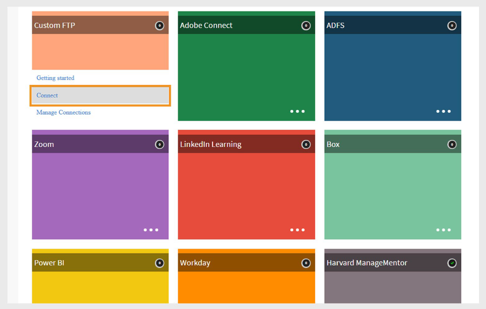

# Conector de FTP personalizado en Adobe Learning Manager

## Introducción

El conector de FTP personalizado en Adobe Learning Manager permite el intercambio seguro y automatizado de datos entre Adobe Learning Manager y el servidor FTP (SFTP) de su organización. Con esta integración, los administradores pueden importar datos de usuario de sistemas externos y exportar transcripciones de alumnos o datos de aptitudes de forma programada. Esta configuración agiliza la sincronización de datos, reduce el trabajo manual y permite una integración perfecta con sistemas de informes o recursos humanos de terceros. La configuración requiere la coordinación con su equipo de TI y la asistencia del administrador de éxito del cliente (CSM) de Adobe.

>[!NOTE]
>
>Para configurar una conexión FTP personalizada, póngase en contacto con el administrador de éxito de clientes (CSM). El proceso de configuración puede implicar la asistencia de su equipo de TI para incluir direcciones IP en la lista blanca, abrir los puertos necesarios y crear carpetas con los permisos de acceso necesarios.

## Funciones admitidas

El conector de FTP personalizado admite las siguientes acciones:

### Importación de datos

El proceso de importación de usuarios obtiene automáticamente los datos de los empleados de su servidor FTP y los importa a Adobe Learning Manager. Esto resulta útil cuando se integran varios sistemas que generan archivos CSV que contienen datos de usuario.

- Coloque los archivos CSV en la carpeta **import** designada en su servidor FTP.
- Adobe Learning Manager detecta los archivos, los combina si es necesario e importa los datos del usuario en función de la programación definida.

Consulte la sección [Programación](/help/migrated/integration-admin/feature-summary/custom-ftp-connector.md#scheduling-reports) para obtener información sobre cómo automatizar este proceso.

### Asignación de atributos

Como administrador de integración, puede asignar las columnas del archivo CSV a atributos agrupables en Adobe Learning Manager.

- La asignación es una configuración que se realiza una sola vez.
- Se utiliza la misma correspondencia para las importaciones posteriores.
- Puede volver a configurar las asignaciones si cambia la estructura de datos.

### Exportación de datos

Adobe Learning Manager le permite exportar:

- Aptitudes del usuario
- Transcripciones de alumnos

Estos archivos de informe se colocan en la carpeta de exportación de su FTP y pueden ser consumidos por sistemas de terceros para informes, análisis u otros procesos descendentes.

### Programación de informes

Los administradores de integración pueden programar:

- Importaciones de usuarios
- Exportaciones de transcripciones de alumnos

La programación garantiza que su entorno Adobe Learning Manager esté actualizado con los sistemas de origen. Puede configurar las sincronizaciones diarias o los intervalos personalizados según sea necesario.

## Configurar el conector de FTP personalizado

Para configurar el conector de FTP personalizado:

1. Inicie sesión en Adobe Learning Manager como administrador de integración.
2. Pase el ratón sobre el mosaico **FTP personalizado** y seleccione **Conectar**.

   
   _Seleccione Conectar para configurar el conector de FTP personalizado_

### Elegir método de autenticación

Puede configurar la conexión FTP personalizada mediante uno de estos dos tipos de autenticación:

#### Cuenta de autenticación básica

1. Escriba los siguientes datos:

   - **Tu dominio FTP**
   - **Nombre de usuario de FTP**
   - **Contraseña de FTP**

   
   _Escriba el dominio FTP, el nombre de usuario y la contraseña para la configuración._

2. Seleccione **Conectar**.

#### Autenticación de certificados

Si el servidor FTP admite la autenticación mediante clave SSH:

1. Seleccione **Generar clave SSH**.

   
   _Seleccione Generar clave SSH para descargar la clave_

2. La clave pública se descargará en su equipo.
3. Agregue esta clave a la lista de claves autorizadas del servidor FTP.
4. Escriba los siguientes datos:

   - **Tu dominio FTP**
   - **Nombre de usuario de FTP**
5. Seleccione **Conectar**.

>[!NOTE]
>
>Solo se admiten **servidores SFTP** para la configuración de FTP personalizada.

## Configuración posterior a la conexión

Una vez establecida la conexión:

- Adobe Learning Manager crea automáticamente carpetas para **import** y **export** en tu servidor FTP.
- Puede empezar a importar y exportar datos en función de la programación y la configuración de asignación.
