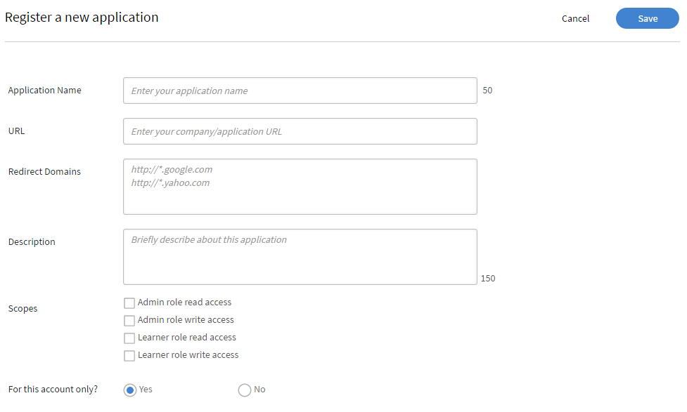

# Adobe Learning Manager Developer Manual

## Información general

Adobe Learning Manager proporciona API RESTful que permiten a los desarrolladores integrar y personalizar aplicaciones o flujos de trabajo de manera efectiva. El Manual del desarrollador ofrece orientación sobre cómo utilizar estas API, y abarca temas como la autenticación, los modelos de datos y la integración con otras aplicaciones. Además, esta guía [Documentación de referencia de API](https://learningmanager.adobe.com/docs/primeapi/v2/) ayuda a los desarrolladores a crear aplicaciones externas o flujos de trabajo de backend que interactúan con diversas funciones de Adobe Learning Manager, como la creación de cursos, el seguimiento del progreso de los alumnos, la asignación de aptitudes, la certificación, la interacción y las transcripciones.

Este manual cubre lo siguiente:

* Autenticación de OAuth2.0
* Modelos de objetos de API
* Incluir, campos y otros parámetros
* Casos prácticos del mundo real

>[!IMPORTANT]
>
>Este manual para desarrolladores abarca exclusivamente las API V2 de Adobe Learning Manager. Todos los ejemplos, estructuras de solicitud y flujos de trabajo de autenticación descritos en esta guía son específicos de los puntos finales /primeapi/v2/. Para obtener información sobre versiones anteriores o API obsoletas, consulte la [documentación de referencia de API](https://learningmanager.adobe.com/docs/primeapi/v2/).

## Escenarios de uso de API

Los desarrolladores pueden utilizar las API de Learning Manager para mejorar o integrar Learning Manager con otras aplicaciones empresariales. Puede crear aplicaciones web, de escritorio o móviles con cualquier tecnología. Los desarrolladores pueden acceder a los datos de Learning Manager, pero el usuario controla dónde y cómo se utiliza la aplicación.

## Autenticación mediante OAuth 2.0

Para acceder a las API de Adobe Learning Manager de forma segura, debe autenticarse mediante el mecanismo OAuth 2.0 de ALM. Este proceso incluye el registro de la aplicación, la generación de un código de autorización, su cambio por un token de actualización y, por último, el uso del token de actualización para obtener un token de acceso.

### Registrar una aplicación

Integra Adobe Learning Manager con aplicaciones externas para una versatilidad mejorada. Los pasos implican el acceso a la interfaz del administrador de integración, el registro de la aplicación y la obtención del ID y el secreto de cliente. Genere tokens de autenticación de OAuth 2.0, incluidos tokens de autorización, actualización y acceso, desde Adobe Learning Manager. Use el flujo de OAuth 2.0 para autenticar y autorizar de forma segura su aplicación. El token de acceso tiene una validez de siete días.

1. Inicie sesión en Adobe Learning Manager como administrador de integración.
2. Seleccione **[!UICONTROL Aplicaciones]** en el panel izquierdo.

   

3. Seleccione **[!UICONTROL Registrar]** y agregue la siguiente información:

   * **[!UICONTROL Nombre de la aplicación]**: escriba el nombre de la aplicación (50 caracteres como máximo).
   * **[!UICONTROL URL]**: la dirección URL oficial de la empresa o aplicación. Utilizado para identificación y referencia.
   * **[!UICONTROL Dominios de redirección]**: especifique los dominios (por ejemplo, [http://learningmanager.adobe.com](http://learningmanager.adobe.com)) a los que ALM puede redirigir después de la autorización.  Puede mencionar varias direcciones URL, pero estas deben ser válidas.
   * **[!UICONTROL Descripción]**: breve descripción de lo que hace la aplicación.
   * **[!UICONTROL Ámbitos]**: seleccione una de las seis opciones disponibles para definir el ámbito de la aplicación. En función de su elección, los puntos finales de la API de Learning Manager están accesibles para la aplicación. Por ejemplo, si elige Acceso de lectura de la función de alumno, todos los puntos finales de la API de alumno de Learning Manager solo estarán accesibles en modo de solo lectura en la aplicación.

      * Acceso de lectura y escritura de la función de administrador: permite a la aplicación acceder a los datos o modificarlos como administrador.
      * Acceso de lectura y escritura de la función de alumno: permite que la aplicación acceda a los datos de los alumnos o los modifique.
      * Acceso de lectura y escritura de xAPI: permite a la aplicación acceder a las instrucciones de la API de experiencia (xAPI) y enviarlas.

   * **[!UICONTROL ¿Solo para esta cuenta?]**

      * **[!UICONTROL Sí]**: si elige Sí, la aplicación no estará visible para otros administradores de cuentas.
      * **[!UICONTROL No]**: si elige No, otros administradores de cuentas también pueden tener acceso a esta aplicación, pero deben usar el id. de aplicación para tener acceso a ella. El ID de aplicación se genera y se muestra en el modo de edición de la aplicación de Learning Manager.

     

4. Seleccione **[!UICONTROL Guardar]** para registrar la aplicación.

   * Después de registrar la aplicación, esta estará disponible en la lista de aplicaciones creadas en la cuenta. Seleccione la aplicación y verá lo siguiente además de los campos introducidos anteriormente:
   * ID de aplicación: ID de cliente. Este ID indica a ALM la aplicación que solicita acceso. Se incluye en las solicitudes de API para identificar la aplicación.
   * Secreto de aplicación: se utiliza para autenticar la aplicación y verificar su identidad durante los pasos de intercambio de tokens (por ejemplo, al solicitar un token de actualización o de acceso).

   

## Obtener un token de acceso

### Obtener código de autorización de redirección

Después de obtener el ID de cliente y el secreto de cliente, utilícelos para solicitar un token de acceso, que se utiliza para autenticar llamadas de API.

Para comenzar el flujo de código de autorización, agregue la siguiente dirección URL en un explorador:

```
GET https://learningmanager.adobe.com/oauth/o/authorize?client_id=<Enter your clientId>&redirect_uri=<Enter a url to redirect to>&state=<Any String data>&scope=<one or more comma separated scopes>&response_type=CODE 
```

Una vez que el usuario autorice la aplicación, Adobe Learning Manager redirigirá al URI de redirección especificado con un parámetro de consulta anexado:

[https://yourapp.com/callback?code=abc123xyz](https://yourapp.com/callback?code=abc123xyz)

Se añade un código de parámetro junto con el URI de redirección.

### Obtener token de actualización del código

Después de obtener el código, utilice cualquier herramienta de la API y añada la siguiente solicitud de POST:

```https://learningmanager.adobe.com/oauth/token ```

**Cuerpo de solicitud (x-www-form-url-coded)**:

```
grant_type=authorization_code  
&code=abc123xyz  
&client_id=<your_client_id>  
&client_secret=<your_client_secret>  
&redirect_uri=<your_redirect_url> 
```

**Respuesta**

```
{ 

  "access_token": "eyJhbGciOiJIUzI1...", 
  "refresh_token": "xTjlfz0jCk6gF1...", 
  "expires_in": 604800, 
  "token_type": "Bearer" 

} 
```

Utilice access_token en el encabezado Authorization para realizar solicitudes de API autenticadas.

### Usar el token de acceso en una llamada de API

Verifique el token de acceso mediante lo siguiente:

```
GET https://learningmanager.adobe.com/oauth/token/check?access_token=<access_token> 
```

Un token de acceso es válido durante siete días. Después de siete días, debe generar un nuevo token de acceso mediante el token de actualización. Si genera un nuevo token de acceso a partir del token de actualización mientras un token de acceso existente sigue siendo válido, se devuelve el token existente.

### Obtener tokens de acceso para pruebas y desarrollo

Cuando se trabaja con API de Adobe Learning Manager (ALM), los desarrolladores necesitan un token de acceso de OAuth 2.0 válido para autenticar las solicitudes de API. La generación de este token a través del flujo estándar de OAuth puede resultar compleja y requerir mucho tiempo, especialmente para pruebas, aprendizaje o desarrollo rápidos. Adobe Learning Manager proporciona una herramienta de generación de tokens para simplificar este proceso.

Esta herramienta es ideal durante:

* Compilaciones de prueba de concepto (POC)

* Desarrollo en fase inicial

* Solución de problemas de integración de API

Estos tokens están pensados únicamente para su uso personal durante las fases de desarrollo y depuración. Tenga en cuenta que los tokens de prueba conceden acceso a sus datos de ALM, por lo que es esencial tratarlos de forma segura. No comparta nunca sus tokens de prueba con otros usuarios, no los utilice en aplicaciones de producción ni los incluya en repositorios de código públicos. Trátalos como contraseñas para garantizar la seguridad de tu cuenta y tus datos.

1. Inicie sesión en Adobe Learning Manager como administrador de integración.
2. Seleccione **[!UICONTROL Recursos de desarrolladores]** y, a continuación, **[!UICONTROL seleccione Tokens de acceso para pruebas y desarrollo]**.

   

3. Escriba el **[!UICONTROL ID de cliente]** que obtuvo después de crear una aplicación para obtener el código de OAuth. A continuación, seleccione **[!UICONTROL Enviar]**.

   

4. Agregue el **[!UICONTROL ID de cliente]** y el **[!UICONTROL secreto de cliente]** para obtener el token de actualización. A continuación, seleccione **[!UICONTROL Enviar]**. OAuth se rellena previamente desde el paso anterior.

   

5. Agregue el ID de cliente y el secreto de cliente para obtener el token de acceso. A continuación, seleccione **[!UICONTROL Enviar]**.

   

6. Agregue el token de acceso y seleccione Enviar para obtener los detalles del token de acceso.

   

Al seleccionar **[!UICONTROL Submit]**, se verifica el token de acceso y aparece la siguiente respuesta:

```
{ 
  "access_token": "access token", 
  "refresh_token": "refresh token", 
  "user_role": "admin", 
  "account_id": "1234", 
  "user_id": "123456", 
  "expires_in": 604800 
} 
```

Como antes, el token de acceso para las pruebas caduca en siete días.

### Usar una herramienta de API para probar los puntos finales

Aunque puedes usar cualquier herramienta de prueba de API de terceros, usaremos Postman para probar los puntos finales. En los ejemplos de este documento se utiliza Postman para probar los puntos finales.

1. Abra Postman y cree una nueva solicitud.
2. Seleccione la ficha Autorización.
3. Establezca el Tipo de autenticación en Token del portador.

   
4. Pegue el token de acceso obtenido en la sección anterior, en el campo Token.

   

5. Añada lo siguiente en la pestaña Encabezados .

   * Clave: aceptar
   * Valor: application/json
6. Introduzca el punto final de la API en el campo URL. Ejemplo: [https://learningmanager.adobe.com/learningManager/api/v2/users](https://learningmanager.adobe.com/learningManager/api/v2/users)
Consulte la [Referencia de la API de Adobe Learning Manager](https://learningmanager.adobe.com/docs/primeapi/v2/) para obtener más información.
7. Seleccione Enviar para realizar la solicitud de API.

## Tipos de API

### API de administración

Las API de administración de Adobe Learning Manager permiten a los administradores automatizar y administrar las operaciones de aprendizaje a escala.

Mediante el uso de las API de administración, los desarrolladores pueden:

>[!NOTE]
>
>La lista no es exhaustiva.

* **Administrar usuarios y grupos**: Cree, actualice y elimine usuarios o asígnelos a grupos.
* **Inscribir alumnos**: Automatiza la inscripción en cursos, rutas de aprendizaje o certificaciones.
* **Realizar un seguimiento del progreso del alumno**: Recupere el progreso del curso/módulo, las puntuaciones de las pruebas y el estado de finalización.
* **Generar informes**: Accede a los datos sobre la actividad, la participación y el rendimiento del alumno.
* **Administrar contenido**: Crea y organiza cursos y objetos de aprendizaje.

Consulte [Referencia de la API de Adobe Learning Manager](https://learningmanager.adobe.com/docs/primeapi/v2/) para obtener más información.

### API de alumno

Las API de alumno están diseñadas para usuarios autenticados (alumnos) y permiten acceder a información específica del alumno. Estas API permiten tareas como:

* Acceso a los cursos y el progreso de un alumno
* Obtención de insignias o certificaciones obtenidas
* Actualización de información de perfil de alumno
* Visualización de aptitudes asociadas a cursos completados

**Puntos clave:**

* Estas API requieren un token de usuario autenticado, lo que garantiza la seguridad y la privacidad de los datos.
* Las API están pensadas para situaciones en las que los usuarios están completamente registrados y con sesión iniciada, en lugar de para usuarios anónimos o compartidos.

Consulte [Referencia de la API de Adobe Learning Manager](https://learningmanager.adobe.com/docs/primeapi/v2/) para obtener más información.

## Diseño de API y parámetros comunes

Las API proporcionan a los desarrolladores acceso a recursos clave de Learning Manager, como usuarios, cursos, aptitudes, certificaciones y programas de aprendizaje. Sigue los principios de REST, utilizando métodos HTTP (GET, POST, PUT, DELETE) para las operaciones de datos.

| | |
|--|--|
| Métodos | GET, PUT, POST, DELETE |
| Formato | application/vnd.api+json, aplicación/json. [Más información](https://developer.mozilla.org/en-US/docs/Web/HTTP/Guides/MIME_types/Common_types) sobre los tipos MIME comunes. |
| URL básica | [https://learningmanager.adobe.com/primeapi/v2/](https://learningmanager.adobe.com/primeapi/v2/) |

### Parámetros comunes

| Parámetros | Propósito |
|--|--|
| incluir | Obtén recursos relacionados en una sola llamada. |
| campos | Seleccione atributos específicos para reducir la carga útil. |
| filtrar | Resultados estrechos (por ejemplo, por ID, nombre) |
| clasificar | Resultados del pedido. |
| page[limit], page[offset] | Compatibilidad con paginación. |

A continuación se ofrece una breve explicación de cada uno de ellos:

### incluir

Las API de ALM se pueden utilizar para recuperar información útil al crear una aplicación personalizada o un LMS sin encabezado. Los puntos finales de la API se pueden incluir además con parámetros &quot;include&quot; adicionales para recuperar la información adicional que está en relación con los datos recibidos de forma predeterminada. Estas relaciones son relaciones de modelo de datos, por ejemplo, al realizar una llamada para obtener detalles del usuario, recibirá la información del usuario y la relación del ID del responsable y el ID de cuenta de ALM. Con el parámetro include, puede extraer detalles adicionales junto con los detalles del usuario, como los detalles de su responsable y los detalles de la cuenta de ALM de forma detallada.
En resumen, el parámetro **include** se utiliza en llamadas de API para obtener recursos relacionados (vinculados) junto con el recurso principal en una única respuesta. Resulta útil cuando desea acceder a datos anidados o dependientes, como módulos de un curso o las aptitudes asignadas a un alumno, sin realizar llamadas de API independientes.

Principales ventajas:

* Reduce varias llamadas a la API: evita la necesidad de solicitar manualmente cada recurso relacionado.
* Mejora la eficiencia: desarrollo más rápido, menor carga del servidor y procesamiento más rápido de los datos.
* Garantiza la coherencia de los datos: recupera todos los datos relacionados en una instantánea coherente.

**Cómo usar el parámetro include**

Añada el parámetro include a la URL de la API y especifique las entidades relacionadas que desea incluir.

**Rutas de inclusión comunes**

| Incluir valor | Descripción |
|---|---|
| instancias | Devuelve todas las instancias del objeto de aprendizaje |
| enrollment | Devuelve los detalles de inscripción del usuario |
| instances.loResources.resources | Recupera módulos y recursos dentro de una instancia |
| suplementarioResources | Devuelve los recursos complementarios asociados |
| skills.skillLevel.badge | Obtiene los niveles de aptitud y sus insignias asociadas |
| prerrequisitoOA | Incluye objetos de aprendizaje de requisitos previos |
| subLO | Recupera objetos de subaprendizaje (utilizados en programas de aprendizaje o certificaciones) |
| subLOs.enrollment | Inscripción en objetos de subaprendizaje |
| instances.badge | Insignia asignada para la finalización de una instancia de curso |
| subLOs.subLOs.instances.loResources.resources | Recursos profundamente anidados dentro de una instancia de subobjeto de aprendizaje |

**Ejemplo 1**

Recupere los detalles de un usuario utilizando el parámetro userID en el extremo.

```
https://learningmanager.adobe.com/primeapi/v2/users/<userID>
```

```
GET https://learningmanager.adobe.com/primeapi/v2/users/<userID>
```

En la respuesta, puede ver que el objeto de datos tiene una relación con la cuenta y el administrador del usuario.

```
"relationships": {
            "account": {
                "data": {
                    "id": "1010",
                    "type": "account"
                }
            },
            "manager": {
                "data": {
                    "id": "3400476",
                    "type": "user"
                }
            }
        }
```

Mediante el parámetro include de la solicitud, puede recuperar información detallada sobre el responsable, como se muestra a continuación:

```
GET https://learningmanager.adobe.com/primeapi/v2/users/<userid>?include=manager
```

**Ejemplo 2**

Para recuperar los detalles del curso, utilice el parámetro include en la llamada al punto final. El siguiente punto final obtiene la información del curso junto con sus relaciones.

```
GET https://learningmanager.adobe.com/primeapi/v2/learningObjects/<courseID>
```

Las relaciones se muestran en la respuesta de la siguiente manera:

* instancias
* aptitudes
* autores

```
"relationships": {
            "authors": {
                "data": [
                    {
                        "id": "3400468",
                        "type": "user"
                    }
                ]
            },
            "instances": {
                "data": [
                    {
                        "id": "course:16444_31598",
                        "type": "learningObjectInstance"
                    }
                ]
            },
            "skills": {
                "data": [
                    {
                        "id": "course:16444_1796",
                        "type": "learningObjectSkill"
                    },
                    {
                        "id": "course:16444_3103",
                        "type": "learningObjectSkill"
                    }
                ]
            }
        }
```

Otras relaciones podrían incluir (no presentes en la respuesta anterior):

* prerrequisitoOA
* OAs suplementarias
* suplementarioResources

Para obtener datos detallados de las instancias y aptitudes, incluya &quot;instancias, aptitudes&quot; en el parámetro include.

```
GET https://learningmanager.adobe.com/primeapi/v2/learningObjects/<courseID>?include=instances,skills
```

Ahora, por ejemplo, si desea recuperar más datos asociados a la instancia del curso, como loResources (información del módulo del curso), aplique loResources como un include anidado.

```
GET https://learningmanager.adobe.com/primeapi/v2/learningObjects/<courseID>?include=instances.loResources
```

Además, combine aptitudes e instancias con una inclusión anidada.

```
GET https://learningmanager.adobe.com/primeapi/v2/learningObjects/<courseID>?include=instances,instances.loResources,skills
```

**Otros filtros incluidos**

<table>
  <tbody>
  <tr>
   <td>
    <p style="text-align: left;"><b>Programas de aprendizaje</b></p></td>
   <td>
    <p style="text-align: left;"><b>Curso</b></p></td>
  </tr>
  <tr>
  <td><br>subLOs.prerequisiteLOs.enrollment</br><br>subLOs.subLOs.prerequisiteLOs.enrollment</br><br>subLOs.enrollment.loResourceGrades</br><br>subLOs.subLOs.enrollment.loResourceGrades</br><br>subLOs.subLOs.instances.loResources.resources.room</br><br>subLOs.instances.loResources.resources.room</br><br>subLOs.supplementaryResources</br><br>subLOs.enrollment</br><br>SubLOs.enrollment.loInstance.loResources.resources</br><br>subLOs.supplementaryLOs.instances.loResources.resources</br>
  </td>
  <td>
  <br>instances.enrollment.loResourceGrades</br><br>enrollment.loInstance.loResources.resources</br>prerrequisitoLOs</br><br>authors</br><br>instance.loResources.resources</br><br>suplementarioLOs.instance.loResources.resources</br><br>suplementarioResources</br><br>instance.badge</br><br>skills.skillLevel.badge</br><br>skills.skillLevel.skill</br><br>instance.loResources.resources.room</br><br>prerrequisitoLOs.enrollment</br><br>enrollment.loResource Grados</br>
  </td>
  </tr>
  </table>

#### campos

Los atributos y relaciones de un objeto de API se denominan &quot;Fields&quot;. Utilice Fields como parámetro en llamadas de API para recuperar atributos específicos del modelo. Sin el parámetro Fields, la llamada de API recupera todos los atributos disponibles.

Por ejemplo, en la siguiente llamada de API, fields[skill]=name obtiene únicamente el atributo name del modelo de aptitud.

```
GET https://learningmanager.adobe.com/primeapi/v2/users/3400490/userSkills/3400490_1796_1?include=skillLevel.skill&fields[skill]=name
```

#### paginación

La paginación de API es una técnica que se utiliza en las API para desglosar grandes conjuntos de datos en fragmentos más pequeños y manejables, denominados páginas, en lugar de devolver todos los datos en una sola respuesta.

La paginación reduce la carga del cliente y del servidor, limita el tamaño de respuesta para evitar cuellos de botella en el servidor o es útil para mostrar datos en tablas o listas de una página a la vez.

**Cómo funciona la paginación en las API de ALM**

Las API de ALM admiten la paginación a través de parámetros como:

* page[limit]: número de registros por página.
* page[offset]: número de registros que se van a omitir.
* page[cursor]: puntero al siguiente conjunto de resultados. En lugar de utilizar la paginación basada en desplazamiento (que omite varios registros), la paginación basada en cursor utiliza un marcador único devuelto por la API para obtener la siguiente página de resultados.

A continuación se indica cómo utilizar la paginación en las API:

**página[límite]**

Mientras que [https://learningmanager.adobe.com/primeapi/v2/users](https://learningmanager.adobe.com/primeapi/v2/users) devuelve todos los usuarios e información relacionada en una sola llamada, el uso de page[limit] restringe el número de resultados al valor especificado.

Para devolver solo cinco registros de usuario en una sola llamada, utilice la siguiente API:

```
GET https://learningmanager.adobe.com/primeapi/v2/users?page[limit]=5
```

**página[desplazamiento]**

Utilice esta llamada de API para devolver tres registros de usuario, omitir los cinco primeros usuarios y comenzar desde el sexto.

```
GET https://learningmanager.adobe.com/primeapi/v2/users?page[limit]=3&page[offset]=5 
```

**página[cursor]**

1. Comience solicitando la primera página con un límite de 5.

   ```
   GET https://learningmanager.adobe.com/primeapi/v2/users?page[limit]=5
   ```

2. Copie el valor del cursor de links.next y utilícelo en la siguiente solicitud:

   ```
   "links": {
       "self": "https://learningmanager.adobe.com/primeapi/v2/users?page[limit]=5",
       "next": "https://learningmanager.adobe.com/primeapi/v2/users?page[limit]=5&page[cursor]=3400482"
    }
   ```

3. Envíe la siguiente solicitud:

   ```
   GET https://learningmanager.adobe.com/primeapi/v2/users?page[limit]=5&page[cursor]=3400482
   ```

Esto devuelve el siguiente conjunto de 10 registros, comenzando después del último elemento de la página anterior.

#### filtrar

El parámetro filter permite limitar los resultados de la API en función de uno o varios valores de campo.

Las API de Adobe Learning Manager proporcionan diferentes variaciones del parámetro de filtro para reducir las respuestas.

Consulte [Referencia de la API de Adobe Learning Manager](https://learningmanager.adobe.com/docs/primeapi/v2/) para obtener más información.

En este ejemplo se muestra cómo filtrar las ayudas de trabajo en las que se ha inscrito un alumno mediante el punto final con el parámetro filter:

```
GET https://learningmanager.adobe.com/primeapi/v2/users/3400480/enrollments?filter.loTypes=jobAid
```

#### clasificar

El parámetro de ordenación se utiliza para ordenar los resultados de la API en orden ascendente o descendente en función de uno o varios campos.

Adobe Learning Manager proporciona varias opciones de ordenación para ordenar la respuesta de la API. Consulte [Referencia de la API de Adobe Learning Manager](https://learningmanager.adobe.com/docs/primeapi/v2/) para obtener más información.

Extendiendo el ejemplo anterior, ahora ordenará la inscripción del usuario en programas de aprendizaje por fecha de inscripción en orden ascendente.

```
GET https://learningmanager.adobe.com/primeapi/v2/users/3400480/enrollments?filter.lotypes=learningProgram&sort=dateEnrolled
```

## Descripción general de los modelos de API

Las API de Adobe Learning Manager permiten a los desarrolladores acceder a los objetos de Learning Manager como recursos RESTful. Cada punto final de la API representa un recurso, por lo general, una instancia de objeto como una insignia o una colección de esos objetos. A continuación, los desarrolladores utilizan verbos de HTTP como PUT, GET, POST y DELETE para realizar las operaciones CRUD en esos objetos (colecciones).


| Objeto de Learning Manager | Descripción |
|----|----|
| account | Engloba los detalles de un cliente de Learning Manager. |
| insignia | Una insignia es una muestra de los logros que obtienen los alumnos cuando alcanzan hitos específicos mientras avanzan en un curso. |
| catalog | El catálogo es una colección de objetos de aprendizaje. |
| interfaz | El usuario es el modelo clave en Learning Manager. Por lo general, los usuarios son los alumnos internos o externos de una organización que consumen objetos de aprendizaje. Sin embargo, pueden desempeñar otras funciones, como la de autor o responsable, junto con la función de alumno. El ID de usuario, el tipo y la dirección de correo electrónico son algunos de los atributos integrados. |
| resource | Se utiliza para modelar cada recurso de contenido que un módulo busca englobar. Todos los recursos encapsulados dentro de un &quot;loResource&quot; son equivalentes en términos del objetivo de aprendizaje, pero difieren entre sí en términos de tipo de entrega o configuración regional del contenido. |
| userNotification | Este modelo contiene información de notificación relativa a un alumno. |
| userSkill | Indica el porcentaje de una única aptitud que ha alcanzado un solo usuario. |
| userBadge | UserBadge relaciona una única insignia con un único usuario. Contiene detalles como cuándo se logró, assertionUrl, etc. |
| skill | El modelo de aptitudes consta de niveles y créditos. Los alumnos pueden adquirir aptitudes una vez completado el curso correspondiente. |
| skillLevel | Un nivel de aptitud consta de uno o varios cursos que se van a consumir para adquirir un nivel, junto con sus créditos asociados. |
| learningObject | Un objeto de aprendizaje es una abstracción de varios tipos de objetos en los que los usuarios pueden inscribirse y con los que pueden aprender. Actualmente, Learning Manager dispone de cuatro tipos de objetos de aprendizaje: curso, certificación, programa de aprendizaje y ayuda de trabajo. |
| learningObjectInstance | Una instancia específica de un objeto de aprendizaje. |
| learningObjectResource | Esto es equivalente al concepto de módulo . Un curso se compone de uno o más módulos. En Learning Manager, un módulo se puede entregar de diversas formas equivalentes. Por lo tanto, loResource básicamente encapsula todos esos recursos equivalentes. |
| loResourceGrade | Engloba el resultado del usuario que consume un recurso específico en el contexto de un objeto de aprendizaje en el que está inscrito. Contiene información como la duración que ha dedicado el usuario al recurso, el porcentaje de progreso realizado por el usuario, el estado de aprobado/suspenso y la puntuación obtenida por el usuario en cualquier prueba asociada. |
| calendar | Un objeto de calendario es una lista de los próximos cursos de clase o clase virtual en los que el usuario puede inscribirse. |
| l1FeedbackInfo | Los comentarios de L1 engloban las respuestas proporcionadas por un alumno para las preguntas de comentarios asociadas a los objetos de aprendizaje. Por lo general, esta información se recopila una vez que el usuario ha completado un objeto de aprendizaje si se ha configurado la recopilación de esa información de los alumnos. |
| enrollment | Esta abstracción engloba los detalles relativos a la transacción que representan la asignación de un usuario específico a una determinada instancia de objeto de aprendizaje. |


## Puntos de conexión y API de alumno

Estos son los puntos finales clave de la API para trabajar con datos de alumnos. Estas API guían a los desarrolladores en la interacción con la información del alumno, el seguimiento del progreso, la administración de inscripciones y la recuperación del contenido del curso.

### Recuperar detalles de todos los alumnos

Recupere detalles del alumno (nombre, correo electrónico, UUID, perfil de usuario, etc.). Utilice la API para enumerar todos los alumnos de la cuenta.

```
GET https://learningmanager.adobe.com/primeapi/v2/users
```

### Recuperar detalles de un alumno específico

Si desea ver el perfil de un alumno por ID, utilice la siguiente API para realizar una llamada.

```
GET https://learningmanager.adobe.com/primeapi/v2/users/<userID>
```

### Enumera todos los cursos, programas de aprendizaje, ayudas de trabajo y certificaciones

Recupere los detalles de todos los objetos de aprendizaje en los que el alumno se ha inscrito, se ha completado o el administrador ha habilitado.

```
GET https://learningmanager.adobe.com/primeapi/v2/learningObjects
```

### Obtener detalles de un objeto de aprendizaje específico

Obtenga información detallada sobre un objeto de aprendizaje. Incluye su fecha de creación, fecha de publicación, fecha de actualización y otra información.

```
GET https://learningmanager.adobe.com/primeapi/v2/learningObjects/<LearningObjectID>
```

### Recuperar lista de aptitudes vinculadas a cursos

Muestra las aptitudes asignadas a todos los alumnos de la cuenta.

```
GET https://learningmanager.adobe.com/primeapi/v2/skills
```

### Obtener información sobre el nivel de aptitud y las insignias

Comprueba el progreso de los alumnos en los recorridos de aprendizaje basados en habilidades.

```
GET https://learningmanager.adobe.com/primeapi/v2/skills/<skillID>?include=levels
```

### Lista de todas las insignias creadas para una cuenta

Realice una llamada al siguiente punto final para recuperar una lista de todas las insignias creadas para una cuenta de una organización.

```
GET https://learningmanager.adobe.com/primeapi/v2/badges
```

### Recuperar información de una insignia

Obtenga información detallada sobre una insignia, incluido su nombre, la URL de la imagen de insignia y el estado de la insignia.

```
GET https://learningmanager.adobe.com/primeapi/v2/badges/<skillID>
```

Esto produce la siguiente respuesta:

```
{
    "links": {
        "self": "https://learningmanager.adobe.com/primeapi/v2/badges/499"
    },
    "data": {
        "id": "499",
        "type": "badge",
        "attributes": {
            "imageUrl": "https://cpcontentsdev.adobe.com/public/account/1010/accountassets/1010/badges/test_57a5ab00555a475a8fc6671562184dc9.png",
            "name": "penguins",
            "state": "Retired"
        }
    }
}
```

## Otros ejemplos de uso de API

### Crear un usuario

1. Utilice el punto final:

   ```
   POST https://learningmanager.adobe.com/primeapi/v2/users
   ```

   Procesa los atributos del cuerpo de la API o de la carga de JSON para generar un usuario y, posteriormente, proporciona a un usuario el ID de usuario respectivo rellenado.

2. Utilice la siguiente carga útil como cuerpo:

   ```
   { 
      "data": { 
        "type": "user", 
        "attributes": { 
         "email": "bob@example.com", 
          "name": "Bob", 
          "userType": "INTERNAL" 
        } 
      } 
    }
   ```

Hay tres atributos obligatorios:

* correo electrónico: ID de correo electrónico del usuario. Este valor debe ser único para cada usuario.
* name: el nombre del usuario.
* userType: en la actualidad, solo se pueden añadir usuarios internos utilizando este extremo. El userType debe ser &quot;INTERNAL&quot;.

Aparece la siguiente respuesta:

```
{
  "links": {
      "self": "https://learningmanager.adobe.com/primeapi/v2/users"
  },
  "data": {
      "id": "13386404",
      "type": "user",
      "attributes": {
          "avatarUrl": "https://cpcontents.adobe.com/public/images/default_user_avatar.svg",
          "email": "bob@example.com",
          "name": "Bob",
          "pointsEarned": 0,
          "pointsRedeemed": 0,
          "preferredResolution": "AUTO",
          "profile": "Employee",
          "roles": [
              "Learner"
          ],
          "state": "ACTIVE",
          "userType": "Internal",
          "userUniqueId": "bob@example.com"
      },
      "relationships": {
          "account": {
              "data": {
                  "id": "1010",
                  "type": "account"
              }
          },
          "manager": {
              "data": {
                  "id": "3400468",
                  "type": "user"
              }
          }
      }
  }
}
```

### Eliminar un usuario

1. Obtenga el ID de usuario del usuario que desea eliminar.

   ```
   GET https://learningmanager.adobe.com/primeapi/v2/users/<userID>
   ```

2. A continuación, utilice DELETE para realizar la siguiente llamada:

   ```
   DELETE https://learningmanager.adobe.com/primeapi/v2/users/<userID>
   ```

Aparece una respuesta 204. Un código de respuesta 204 indica éxito sin contenido que devolver. El servidor ha procesado correctamente la solicitud, pero no tiene ningún dato que proporcionar al cliente.

El estado del usuario es ahora **[!UICONTROL DELETED]** después de recuperar los detalles del usuario.

### Actualizar detalles de usuarios

1. Actualizar los detalles del usuario que utiliza la API v2. El alumno puede modificar bio, uiLocale, contentLocale y timezone. Para las cuentas grandes, se trata de llamadas asincrónicas. Hay muchos otros atributos de usuario que se pueden actualizar mediante este extremo de API. Utilice el extremo /users/{id}, donde id es el id. de usuario cuyos detalles se van a actualizar.

```
PATCH https://learningmanager.adobe.com/primeapi/v2/users/<userID>
```

Agregue lo siguiente en la carga de la solicitud para actualizar el usuario con el identificador `<userID>`, de la sección anterior.

Cambie cualquier campo de la carga útil.

```
{
    "data": {
        "id": "3400468",
        "type": "user",
        "attributes": {
            "avatarUrl": "https://cpcontents.adobe.com/public/images/default_user_avatar.svg",
            "binUserId": "3e6d571f-3956-44db-be69-8e458bde649f",
            "bio": "Manager",
            "contentLocale": "de-DE",
            "email": "user@example.com",
            "enrollOnClick": true,
            "fields": {
                "Web": "Web",
                "newfororder": "newvalue",
                "location": "New",
                "test1": "b"
            },
            "gamificationEnabled": true,
            "lastLoginDate": "2025-04-30T09:30:51.000Z",
            "metadata": {
                "level": "5",
                "expertise": "java",
                "sport": "tennis"
            },
            "name": "John Adams",
            "pointsEarned": 8600,
            "pointsRedeemed": 0,
            "preferredResolution": "AUTO",
            "profile": "Employee",
            "roles": [
                "Learner",
                "Admin",
                "Author",
                "Instructor",
                "Integration Admin",
                "Manager"
            ],
            "state": "ACTIVE",
            "timeZoneCode": "213",
            "uiLocale": "en-US",
            "userType": "Internal",
            "userUniqueId": "user@example.com"
        },
        "relationships": {
            "account": {
                "data": {
                    "id": "1010",
                    "type": "account"
                }
            }
        }
    }
}
```

Después de realizar la llamada, se actualizan los detalles del usuario.

### Crear un perfil externo

Un perfil externo hace referencia a un perfil de usuario que se crea para alumnos externos, normalmente personas que no forman parte de la base de usuarios internos de la organización. Estos alumnos pueden incluir clientes, socios, proveedores, franquiciados o contratistas temporales que necesiten acceso a los programas de formación o certificación ofrecidos por la organización.

1. Utilice el siguiente punto final:

   ```
   POST https://learningmanager.adobe.com/primeapi/v2/externalProfiles
   ```

2. Utilice la siguiente carga útil como cuerpo:

```
{
    "data": {
      "type": "externalProfile",
      "attributes": {
        "name": "Jonas Albertson",
        "expiry": "2027-12-31T18:29:59.000Z",
        "managerEmail": "jonas@acme.com",
        "seatLimit": 10
      }
    }
}
```

La carga útil tiene los siguientes atributos:

* name: el nombre del usuario externo.
* expiry: fecha de caducidad (en formato ISO-8601) del registro del usuario en Adobe Learning Manager.
* managerEmail: la dirección de correo electrónico del responsable del usuario de la organización asociada.
* seatLimit: número de puestos permitidos para la organización asociada.

Después de hacer la llamada, obtendrá la siguiente respuesta:

```
{
    "links": {
        "self": "https://learningmanager.adobe.com/primeapi/v2/externalProfiles"
    },
    "data": {
        "id": "18805",
        "type": "externalProfile",
        "attributes": {
            "accessKey": "8gte2ne7f4r14",
            "enabled": true,
            "expiry": "2027-12-31T18:29:59.000Z",
            "managerEmail": "jonas@acme.com",
            "name": "Jonas Albertson",
            "seatLimit": 10,
            "url": "https://learningmanager.adobe.com/eplogin?groupid=18805&accesskey=8gte2ne7f4r14"
        }
    }
}
```

Esto significa que el usuario externo se ha añadido correctamente a Adobe Learning Manager. Envíe la URL que aparece en la respuesta al usuario, mediante la cual puede registrarse en la plataforma.

### Extraer informe de usuarios con el ID de usuario y los detalles del responsable

Se puede descargar un informe de usuario directamente desde la interfaz de usuario del administrador (**[!UICONTROL Administrador]** > **[!UICONTROL Usuarios]** > **[!UICONTROL Interno]**). Sin embargo, el informe no devuelve el ID de usuario ni los detalles del responsable asociado.

Utilice la API Trabajos para descargar el informe. La API de trabajos ayuda a generar informes, operaciones en bloque (inscripciones o asignaciones de insignias), finalizaciones de certificaciones o generación de insignias.

Así es como puedes descargar el informe:

1. Añada la siguiente carga a la API de trabajos.

   ```
   {
       "data": {
           "type": "job",
           "attributes": {
               "description": "description of your choice",
               "jobType": "generateUsers",
               "payload":{
                   "expandMetadata":true
               }
           }
      }
   }
   ```

2. Utilice el siguiente punto final.

   ```
   POST https://learningmanager.adobe.com/primeapi/v2/jobs
   ```

3. Copie el id. de trabajo de la respuesta.

   ```
   {
       "links": {
           "self": "https://learningmanager.adobe.com/primeapi/v2/jobs"
       },
       "data": {
           "id": "43118",
           "type": "job",
           "attributes": {
               "dateCreated": "2025-05-26T06:35:35.000Z",
               "description": "description of your choice",
               "jobType": "generateUsers",
               "payload": {
                   "expandMetadata": true
               },
             "status": {
                   "code": "Submitted"
               }
           }
       }
   }
   ```

   En la respuesta, el identificador del trabajo es 43118.
4. Después de copiar el ID, use el ID en la API de trabajos para descargar el informe.

   ```
   GET https://learningmanager.adobe.com/primeapi/v2/jobs/43118
   ```

5. Copie la URL S3 de la respuesta.
6. Pegue la URL en el navegador. El explorador le pedirá que guarde o abra el archivo CSV. Guarde el archivo en el equipo.
El archivo descargado contiene las siguientes columnas:

internalUserID, userEmail, customerDefinedUniqueUserId, name, managerEmail, userType, state, excludeFromGamification, pointsEarned, profile, roles, dateCreated, lastLoginDate, dateDeleted, uiLocale, contentLocale, timeZoneCode, userSource, group, Active fields, metadata y lastSocialActivityDate.

### Generar insignia mediante la API de trabajos

1. Obtener una lista de insignias de un usuario de la organización. Utilice el siguiente punto final:

   ```
   GET https://learningmanager.adobe.com/primeapi/v2/users/3400476/userBadges
   ```

   Donde 3400476 es el ID de usuario.
2. Copie el identificador de insignia de la respuesta. Por ejemplo, 3400476_759_COMPETENCY_1796_1 es el identificador de la insignia.

   ```
   {
    "id": "3400476_759_COMPETENCY_1796_1",
    "type": "userBadge",
    "attributes": {
        "assertionUrl": "https://cpcontentsdev.adobe.com/public/accountassets/1010/badges/assertions/a99566b5aa8f4cfa92380581733c63a9_1626278856926.json",
        "dateAchieved": "2016-02-25T08:45:25.000Z",
        "modelType": "skillLevel"
    },
    "relationships": {
        "badge": {
            "data": {
                "id": "759",
                "type": "badge"
            }
        },
        "learner": {
            "data": {
                "id": "3400476",
                "type": "user"
            }
        },
        "model": {
            "data": {
                "id": "1796_1",
                "type": "skillLevel"
            }
        }
    }
   }
   ```

3. Cree una carga y especifique el identificador de insignia en la carga. A continuación se muestra un ejemplo de carga útil:

   ```
   {
    "data": {
        "type": "job",
        "attributes": {
            "description": "Acme Corp Badge",
            "jobType": "generateUserBadge",
            "payload": {
                "userBadgeId": "3400476_759_COMPETENCY_1796_1"
            }
        }
    }
   }  
   ```

   Después de hacer una llamada, obtendrá el ID del trabajo en la respuesta.
4. Tome el Id. de trabajo de la respuesta y use el Id. de trabajo del siguiente punto final para realizar la llamada.

   ```
   GET https://learningmanager.adobe.com/primeapi/v2/jobs/<jobsID>
   ```

5. Copie la URL de insignia de la respuesta y ábrala en un navegador. El certificado se descargará como PDF.

### Crear usuarios en Adobe Learning Manager

El extremo POST/usuarios le ayuda a crear un usuario mediante el modo sin encabezado. Cree usuarios con información detallada, como el proceso de registro en la interfaz de usuario nativa del administrador de aprendizaje de Adobe.

Por ejemplo,

```
POST https://learningmanager.adobe.com/primeapi/v2/users
```

Añada el siguiente cuerpo a la solicitud:

```
{   
   "data":  
     {  
       "type": "user",  
       "attributes": {  
         "bio": "",  
         "contentLocale": "fr-FR",  
         "email": "user@work.com",  
         "enrollOnClick": true,  
         "fields": {  
           "Learning Categories": [  
             "Business"  
           ],  
           "Categories": "IT"  
         },  
         "gamificationEnabled": true,  
         "name": "Test User",  
         "profile": "Engineer",  
         "userType": "INTERNAL",  
         "userUniqueId": "user@work.com"  
       },  
       "relationships": {  
         "account": {  
           "data": {  
             "id": "108079",  
             "type": "account"  
           }  
         }
         }  
       }  
    } 
```

Después de realizar la llamada, aparece la siguiente respuesta:

```
{
    "links": {
        "self": "https://learningmanager.adobe.com/primeapi/v2/users"
    },
    "data": {
        "id": "13385627",
        "type": "user",
        "attributes": {
            "avatarUrl": "https://cpcontents.adobe.com/public/images/default_user_avatar.svg",
            "email": "user@work.com",
            "name": "Test User",
            "pointsEarned": 0,
            "pointsRedeemed": 0,
            "preferredResolution": "AUTO",
            "profile": "Engineer",
            "roles": [
                "Learner"
            ],
            "state": "ACTIVE",
            "userType": "Internal",
            "userUniqueId": "user@work.com"
        },
        "relationships": {
            "account": {
                "data": {
                    "id": "1010",
                    "type": "account"
                }
            },
            "manager": {
                "data": {
                    "id": "3400468",
                    "type": "user"
                }
            }
        }
    }
}
```

Se agregará un nuevo usuario a Adobe Learning Manager.

### Comentarios posteriores a L1

1. Recupere los datos de curso, instancia e inscripción del alumno. Utilice el siguiente punto final:

   ```
   GET /enrollments
   ```

2. Compruebe si los comentarios de L1 están activados para la instancia del curso.

   ```
   GET https://learningmanager.adobe.com/primeapi/v2/learningObjects/<loID>/instances/<loInstanceID>/l1Feedback
   ```

3. Envíe los comentarios de L1.

   ```
   POST /enrollments/{id}/l1Feedback
   ```

Ejemplo de carga útil necesaria:

```
{
    "data": {
      "id": "course:7454218_10333537_11257863",
      "type": "feedback",
      "attributes": {
        "questions": [
          {
            "answer": "8",
            "questionId": "1",
            "mandatory": true,
            "questionType": "scaleTen"
          }
        ],
        "score": 80
      }
    }
  }
```

### Obtener información del nivel de módulo de un curso

1. Recupere los detalles de un objeto de aprendizaje por ID.

   ```
   GET https://learningmanager.adobe.com/primeapi/v2/learningObjects/<loID>
   ```

   ```
   {
    "links": {
        "self": "https://learningmanager.adobe.com/primeapi/v2/learningObjects/course:1171899"
    },
    "data": {
        "id": "course:1171899",
        "type": "learningObject",
        "attributes": {
            "authorNames": [
                "James Adams"
            ],
            "dateCreated": "2017-11-01T15:28:09.000Z",
            "datePublished": "2017-11-01T15:28:20.000Z",
            "dateUpdated": "2017-11-01T15:28:20.000Z",
            "duration": 60,
            "effectiveModifiedDate": "2017-11-01T15:28:20.000Z",
            "effectivenessIndex": 0,
            "enrollmentType": "Self Enroll",
            "hasOptionalLoResources": false,
            "hasPreview": false,
            "isExternal": false,
            "isMqaEnabled": false,
            "isPrerequisiteEnforced": false,
            "isSubLoOrderEnforced": false,
            "loFormat": "Self Paced",
            "loResourceCompletionCount": 3,
            "loType": "course",
            "moduleResetEnabled": false,
            "state": "Published",
            "unenrollmentAllowed": true,
            "catalogLabels": [
                {
                    "catalogLabelValueIds": [
                        {
                            "name": "Sales",
                            "id": "catalogLabel:13_31"
                        }
                    ],
                    "description": "",
                    "mandatory": false,
                    "name": "Department",
                    "values": [
                        "Sales"
                    ]
                }
            ],
            "localizedMetadata": [
                {
                    "locale": "en-US",
                    "name": " Test course 2"
                }
            ],
            "rating": {
                "averageRating": 0,
                "ratingsCount": 0
            }
        },
        "relationships": {
            "authors": {
                "data": [
                    {
                        "id": "3400468",
                        "type": "user"
                    }
                ]
            },
            "instances": {
                "data": [
                    {
                        "id": "course:1171899_2067352",
                        "type": "learningObjectInstance"
                    }
                ]
            },
            "skills": {
                "data": [
                    {
                        "id": "course:1171899_1797",
                        "type": "learningObjectSkill"
                    }
                ]
            }
        }
    }
   }
   ```

2. Utilice el parámetro include para recuperar lo siguiente:

   a. Enumere todos los módulos del objeto de aprendizaje.

   ```
   GET https://learningmanager.adobe.com/primeapi/v2/learningObjects/course:1171899?include=instances.loResources
   ```

   b. Enumere todo el contenido de los módulos.

   ```
   GET https://learningmanager.adobe.com/primeapi/v2/learningObjects/course:1171899?include=instances.loResources.resources
   ```

### Comprobar el progreso del módulo

1. Recupere el objeto de aprendizaje del catálogo mediante el ID del curso.

   ```
   GET https://learningmanager.adobe.com/primeapi/v2/learningObjects?page[limit]=10&filter.loTypes=course&sort=name&filter.ignoreEnhancedLP=true&id=<courseID>
   ```

2. Obtenga los detalles de inscripción de un alumno mediante el ID de inscripción.

   ```
   GET https://learningmanager.adobe.com/primeapi/v2/enrollments/<enrollmentID>
   ```

   Copie el ID de grado de recurso del objeto de aprendizaje de la respuesta.
3. Utilice el ID en el siguiente punto final.

   ```
   GET https://learningmanager.adobe.com/primeapi/v2/loResourceGrades/<courseResourceGradeID>
   ```

En la respuesta, obtendrá información sobre el progreso del módulo.

### Implementar la suplantación del alumno

Al implementar un LMS sin encabezado con Adobe Learning Manager como motor, las organizaciones pueden requerir que el personal de soporte suplante a los alumnos para la solución de problemas o la asistencia. El método de suplantación basado en API garantiza un acceso seguro a la vez que mantiene la confidencialidad de las credenciales del alumno y admite transiciones fluidas en los estados de sesión.

Adobe Learning Manager (ALM) facilita la suplantación de alumnos en entornos de LMS sin periféricos a través de una API dedicada. Esta función permite al personal de soporte asumir temporalmente la identidad de un alumno, lo que le permite diagnosticar problemas, probar funcionalidades o proporcionar asistencia práctica simulando la experiencia del alumno. La suplantación se activa mediante un token de acceso de administrador en caché, que se utiliza para generar mediante programación un token de acceso de alumno. Este proceso permite que el sistema funcione como si hubiera iniciado sesión como alumno.

>[!IMPORTANT]
>
>Los usuarios deben solicitar acceso especial a la API para utilizar esta función, y el sistema debe gestionar el cambio de sesión, la autorización y otros indicadores para garantizar la transparencia y la responsabilidad durante la suplantación.

**Detalles del extremo de API**

```
POST /oauth/learnerToken
```

**Ejemplo completo de URL**

```
https://learningmanager.adobe.com/oauth/o/learnerToken?learner_email=foo@acme.com&force=false
```

**Parámetros de consulta:**

* learner_email: (cadena) el correo electrónico del alumno que se va a suplantar.
* force: (booleano) Indica si se debe generar por la fuerza un nuevo token si existe.

**Cuerpo de solicitud:**

```
{
    "client_id": "your-client-id",
    "client_secret": "your-client-secret",
    "refresh_token": "your-admin-refresh-token"
}  
```

**Ejemplo de respuesta:**

```
{
    "access_token": "generated-token",
    "refresh_token": "new-refresh-token",
    "user_role": "learner",
    "account_id": "123456",
    "user_id": "7891011",
    "expires_in": 604800
}  
```

**Ejemplo de cURL:**

```
curl --location --request POST 'https://learningmanager.adobe.com/oauth/o/learnerToken?learner_email=foo@acme.com&force=false' \
--header 'Content-Type: application/json' \
--data-raw '{
  "client_id": "xxxx",
  "client_secret": "xxxx",
  "refresh_token": "xxxx"
}'
```

### Generar transcripciones de alumnos

**Códigos de error**

| Estado HTTP | Significado | Resolución de problemas |
|---|---|---|
| 400 | Solicitud incorrecta | Compruebe si faltan parámetros o no están bien formados en la solicitud. Compruebe los campos obligatorios y el formato correcto. Por ejemplo, sintaxis no válida para filtros, campos o parámetros include. |
| 401 | No autorizado Falta token o no es válido | Asegúrese de que el token de acceso sea correcto e esté incluido en el encabezado de autorización. Compruebe que el token esté activo. Utilice también el ID de cliente y el secreto de cliente correctos al solicitar el token. |
| 403 | Prohibido. Sin acceso | No tiene permiso para tener acceso al recurso. Compruebe que el token tenga los ámbitos correctos (admin:read, learner:write, etc.). |
| 404 | Recurso no encontrado | El extremo o el identificador de recurso son incorrectos o no existen. Asegúrese de que el recurso existe en la lista de parámetros. |
| 406 | No aceptable: encabezado Aceptar incorrecto | Agregue este encabezado a su solicitud: Acepte: application/vnd.api+json <br>Las API de Adobe Learning Manager requieren estrictamente este tipo de contenido.</br> |
| 500 | Error interno del servidor | Se trata de un problema del lado del servidor. Inténtelo de nuevo más tarde o informe al equipo de asistencia de Adobe Learning Manager si el problema persiste. |


<!--# Application developer manual

>[!NOTE]
>
>Learning Manager V1 API is now deprecated. We recommend that you use V2 APIs to interact with Learning Manager.


## Overview {#overview}

[Adobe Learning Manager](http://www.adobe.com/in/products/learningmanager.html) is a cloud-hosted, learner-centric, and self-service learning management solution. Customers can access Learning Manager resources programmatically using the Learning Manager API to integrate it with other enterprise applications. The API can also be used by Adobe partners to enhance the value proposition of Learning Manager, by extending its functionality or by integrating it with other applications or services.

### Usage scenario {#usagescenario}

Using Learning Manager API, developers can build self-contained applications that extend the functionality of Learning Manager or integrate Learning Manager with other enterprise applications workflows. You can develop a web application, desktop client or a mobile app using any technology of your choice. As a developer you can access your application data from within Learning Manager. The deployment of the application that you develop is external to the Learning Manager platform and you have full control over the software development lifecycle as the application evolves. Typically, applications are developed by a customer organization for use with their Learning Manager account, and these applications are private to that specific customer organization. Also, Adobe partners can build generic applications with Learning Manager API, that can be used by a large set of Learning Manager customers.

## Learning Manager API {#apidescription}

The Learning Manager API is based on principles of REST, and exposes key elements of the Learning Manager Object Model to application developers through HTTP. Before knowing the details of the API endpoints and the HTTP methods, developers can become familiar with the various Learning Manager objects, their attributes and inter-relationships. Once the models are understood, it will be useful to get a basic understanding of the structure of API requests and responses, and a few common programming terms that we use generically across the API.

For details of the various API endpoints and methods, refer to the  [Learning Manager API documentation](https://learningmanager.adobe.com/docs/primeapi/v2/).

## Learner APIs

Adobe Learning Manager - Learner APIs allow you to create a custom learning experience for your users. The usage of these APIs need a valid user token and are to be used only for the purpose of workflows where there is a fully licensed/registered Learner.
 
>[!IMPORTANT]
>
>They are not to be used, as is, for any sort of data retrieval to support any non-logged in user/shared users or any other such cases.
 
The non-logged in use cases require special handling. 

**Reach out to the Solution Architecture team, in case you have any questions on the appropriate use of these APIs and ensure that a Solution Architect has vetted a solution before you deploy it**.

## API authentication {#apiauthentication}

When writing an application that makes API calls to Learning Manager, you have to register your application using the Integration Admin app. 

Learning Manager APIs use OAuth 2.0 framework to authenticate and authorize your client applications. 

**Procedure**

**1. Set up your application**

You can set up your application with client id and client secret to use the proper end points. Once you register your application, you can get the clientId and clientSecret. Get URL should be used in browser as it authenticates the Learning Manager users using their pre-configured accounts such as SSO, Adobe ID, and so on. 

```
GET https://learningmanager.adobe.com/oauth/o/authorize?client_id=<Enter your clientId>&redirect_uri=<Enter a url to redirect to>&state=<Any String data>&scope=<one or more comma separated scopes>&response_type=CODE.
```

After successful authentication, your browser redirects to the redirect_uri mentioned in the above URL. A parameter **code** is appended along with the redirect uri.

**2. Get refresh token from code**

`POST https://learningmanager.adobe.com/oauth/token Content-Type: application/x-www-form-urlencoded`

Body of the post request:

```
client_id: 
<enter your clientid>
 & 
 client_secret: 
 <enter your clientsecret>
  & 
  code: 
  <code from step 1></code>
 </enter>
</enter>
```

**3.** **Obtain an access token from refresh token**

URL to obtain access token: 

POST [https://learningmanager.adobe.com/oauth/token/refresh](https://learningmanager.adobe.com/oauth/token/refresh) Content-Type: application/x-www-form-urlencoded

Body of the post request:

```
client_id: 
<enter your clientid>
 & 
 client_secret: 
 <enter your clientsecret>
  & 
  refresh_token: 
  <refresh token>
   
  </refresh>
 </enter>
</enter>
```

**URL to verify access token details**

`GET https://learningmanager.adobe.com/oauth/token/check?access_token=<access_token>`

**Usage limitation**

An access token is valid for seven days. After a day, you have to generate a new access token using refresh token. If you generate a new access token from refresh token while an existing access token is still valid, the existing token is returned. 

Some of the frequently used terms in Learning Manager API are explained below for your reference. 

**Includes**

Developers can access a single API object model and also multiple models associated with that model. To access the subsequent related models, you need to understand the relationship of each model with other models. **Includes** parameter enables developers to access the dependant models. You can use comma separator to access multiple models. For sample usage and more details on **includes**, refer to sample API model section in this page. 

**API request**

The API requests can be made by making a HTTP Request. Depending upon the end point and method developer may have a choice of various HTTP verbs such as GET, PUT, POST, DELETE, PATCH, etc. For some requests query parameters can be passed. When making a request for a specific data model, the user can also request for related models as described in the JSON API specifications. The structure of a typical API Request is described in [sample model usage](/help/migrated/integration-admin/feature-summary/developer-manual.md#api-usage-illustration).

**API response**

When an API request is made by a client, a SON document is obtained according to the JSON API specification. The response also contains the HTTP Status code, which the developer can verify to perform the appropriate next steps in his application logic. The structure of a typical API Response is described in  [sample model usage](/help/migrated/integration-admin/feature-summary/developer-manual.md#api-usage-illustration).

**Errors**

When an API request fails, an Error response is obtained. The HTTP Status code returned in the response indicates the nature of error. Error codes are represented with numbers for each model in the API reference. 200, 204, 400 and 404 are some of the common errors represented in APIs indicating HTTP access issues.  

**Fields**

API object's attributes and its relationships are collectively called Fields. Refer to [JSON API for more information.](http://jsonapi.org/format/#document-resource-object-fields) You can use Fields as a parameter while making API calls to fetch one or more specific attributes from the model. In absence of the Fields parameter, the API call fetches all the available attributes from the model. For example, in the following API call, fields[skill]=name fetches you the name attribute of the skill model alone. 

`https://learningmanager.adobe.com/primeapi/v2/users/{userId}/userSkills/{id}?include=skillLevel.skill&fields[skill]=name `

**Pagination**

Sometimes, an API request results in a long list of objects to be returned in the response. In such cases, the pagination attribute enables the developer to fetch the results sequentially in terms of multiple pages, where each page contains a range of records. For example, pagination attribute in Learning Manager enables you to set the maximum number of records to be displayed in a page. Also, you can define the range value of records to be displayed on page. 

**Sorting**

Sorting is allowed in API models. Based on the model, choose the type of sorting to be applied for the results. Sorting can be applied in ascending or descending order. For example, if you specify `code sort=name`, then it is ascending sort by name. If you specify `code sort=-name`, it is descending sort by name. Refer to [JSON API spec for more information](http://jsonapi.org/format/#fetching-sorting). 

## API usage illustration {#samplemodel}

Let us consider a scenario where a developer wants to get skill name, max points assigned for skill level and points earned by the learner for that skill.

A userSkill model in Learning Manager APIs consists of id, type, dateAchieved, dateCreated, pointsEarned as default attributes. So, when a developer uses GET method to acquire details of userSkill model, the current data pertaining to the default attributes is shown in the response output. 

But, in this scenario, the developer wants to get the skill name, and points of skill level for the user. Learning Manager API enables you to access this related information using relationship fields and include parameter. The associated models for userSkill are obtained in relatioships tag. You can get the details of each associated models by calling these models along with the userSkill. To get this information, use **`code include`** parameter with dot (period) separated values for each of the associated models. You can use comma as separator to request another model like user include=skillLevel.skill,course

**API Call**

`https://learningmanagerqe1.adobe.com/primeapi/v1/users/%7buserId%7d/userSkills/%7bid%7d?include=skillLevel.skill&fields%5bskill%5d=name&fields%5bskillLevel%5d=maxCredits&fields%5buserSkill%5d=pointsEarned`

For example userId can be 746783 and the userSkills id: 746783_4426_1. 

**Response of API call**

```
\{ 
 "links": {"self": "https://learningmanager.adobe.com/primeapi/v2/users/746783/userSkills/746783_4426_1?include=skillLevel.skill&fields[userSkill]=pointsEarned&fields[skillLevel]=maxCredits&fields[skill]=name"}, 
 "data": { 
 "id": "746783_4426_1", 
 "type": "userSkill", 
 "attributes": {"pointsEarned": 5}, 
 "links": {"self": "https://learningmanager.adobe.com/primeapi/v2/users/746783/userSkills/746783_4426_1"} 
 }, 
 "included": [ 
 { 
 "id": "4426", 
 "type": "skill", 
 "attributes": {"name": "Java"}, 
 "links": {"self": "https://learningmanager.adobe.com/primeapi/v2/skills/4426"} 
 }, 
 { 
 "id": "4426_1", 
 "type": "skillLevel", 
 "attributes": {"maxCredits": 10} 
 } 
 ] 
} 

```

## Learning Manager models {#models}

The Learning Manager API allows developers to access Learning Manager objects as RESTful resources. Each API endpoint represents a resource, typically an object instance like Badge, or a collection of such objects. The developers then use the HTTP verbs such as PUT, GET, POST and DELETE to perform the CRUD operations on those objects (collections).

+++V1 API

The following diagram represents the various elements of the Learning Manager Object Model in V1 API.


The following table describes various elements of the Learning Manager V1 object model: 

<table border="1" cellspacing="0" cellpadding="0">
 <tbody>
  <tr>
   <td>
    <p><strong>Serial No</strong></p></td>
   <td>
    <p><strong>Learning Manager Object</strong></p></td>
   <td>
    <p><strong>Description</strong></p></td>
  </tr>
  <tr>
   <td>
    <p>1.      </p></td>
   <td>
    <p>user</p></td>
   <td>
    <p>User is the key model in Learning Manager. Users are typically the internal or external learners of an organization who consume learning objects. However they may play some other roles such as author and Manager along with learner role. User id, type, email are some of the inline attributes. </p></td>
  </tr>
  <tr>
   <td>
    <p>2.      </p></td>
   <td>
    <p>course</p></td>
   <td>
    <p>Course is one of the learning objects supported in Learning Manager, that consists of one or more modules. </p></td>
  </tr>
  <tr>
   <td>
    <p>3.      </p></td>
   <td>
    <p>module</p></td>
   <td>
    <p>Module is a building block to create learning objects in Learning Manager. Modules can be of four different types such as Class room, virtual class room, activity and self-paced. Use this module model to get the details of all modules in an account. </p></td>
  </tr>
  <tr>
   <td>
    <p>4.      </p></td>
   <td>
    <p>certification</p></td>
   <td>
    <p>Certification is awarded to learners based on successful completion of courses. Courses are required in the application before you use certifications. </p></td>
  </tr>
  <tr>
   <td>
    <p>5.      </p></td>
   <td>
    <p>learning program</p></td>
   <td>
    <p>Learning programs are uniquely designed courses meeting specific learning requirements of users. Typically, learning programs are used to drive learning goals spanning across individual courses. </p></td>
  </tr>
  <tr>
   <td>
    <p>6.      </p></td>
   <td>
    <p>badge</p></td>
   <td>
    <p>Badge is a token of accomplishment that learners get when they reach specific milestones as they progress within a course. </p></td>
  </tr>
  <tr>
   <td>
    <p>7.      </p></td>
   <td>
    <p>skill</p></td>
   <td>
    <p>Skills model consists of levels and credits. Skills can be acquired by learners after relevant course completion. </p></td>
  </tr>
  <tr>
   <td>
    <p>8.      </p></td>
   <td>
    <p>certificationEnrollment</p></td>
   <td>
    <p>This model provides details of an enrollment by a user to a single certification.</p></td>
  </tr>
  <tr>
   <td>
    <p>9.  </p></td>
   <td>
    <p>courseEnrollment</p></td>
   <td>
    <p>This model provides details of an enrollment by a user to a single course. </p></td>
  </tr>
  <tr>
   <td>
    <p>10.  </p></td>
   <td>
    <p>courseInstance</p></td>
   <td>
    <p>A course can have one or many instances associated with it. You can get Course instance </p></td>
  </tr>
  <tr>
   <td>
    <p>11.  </p></td>
   <td>
    <p>courseSkill</p></td>
   <td>
    <p>A courseSkill model specifies the progress of a single skill that is achieved by completing a course.</p></td>
  </tr>
  <tr>
   <td>
    <p>12.  </p></td>
   <td>
    <p>courseModule</p></td>
   <td>A courseModule model specifies how a module is included  in a course. For instance, whether the module is used for pretest or for content.</td>
  </tr>
  <tr>
   <td>
    <p>13.  </p></td>
   <td>learningProgramInstance</td>
   <td>
    <p>A learning program can consist of multiple instances imbibing similar properties of a learning program or customized instances. </p></td>
  </tr>
  <tr>
   <td>
    <p>14.  </p></td>
   <td>
    <p>job aid</p></td>
   <td>
    <p>Job aid is a learning content accessible to learners without any enrollment or completion criteria. You can fetch, updated date, state, id information along with its related models such as job aid version, authors and skill level. </p></td>
  </tr>
  <tr>
   <td>
    <p>15.  </p></td>
   <td>
    <p>jobAidVersion</p></td>
   <td>
    <p>Job aid can have one or many versions associated to it based on number revisions in content and number of uploads. This model provides details of a single job aid version. </p></td>
  </tr>
  <tr>
   <td>
    <p>16.  </p></td>
   <td>
    <p>learningProgramInstanceEnrollment</p></td>
   <td>
    <p>Learning program consists of one or many instances. Learners can enroll to a learning program instance by themselves or assigned by administrator. This model provides details of an enrollment by a user to a single learning program instance. </p></td>
  </tr>
  <tr>
   <td>
    <p>17.  </p></td>
   <td>
    <p>moduleVersion</p></td>
   <td>
    <p>A module can have one or many versions based on its revised content uploads. Use this model to obtain specific info about any single module version. </p></td>
  </tr>
  <tr>
   <td>
    <p>18.  </p></td>
   <td>
    <p>skillLevel</p></td>
   <td>
    <p>A skill level comprises of one or many courses to be consumed in order to acquire a level along with its associated credits. </p></td>
  </tr>
  <tr>
   <td>
    <p>19.  </p></td>
   <td>
    <p>userBadge</p></td>
   <td>
    <p>UserBadge relates a single badge with a single user. It contains details such as when was it achieved, assertionUrl and so on. </p></td>
  </tr>
  <tr>
   <td>
    <p>20.  </p></td>
   <td>
    <p>userSkill</p></td>
   <td>
    <p>UserSkill indicates how much of a single skill level is achieved by a single user.</p></td>
  </tr>
 </tbody>
</table>

+++

+++V2 API

Following are the various elements of the Learning Manager class diagram in V2 API.


<table>
 <tbody>
  <tr>
   <th><b>Learning Manager Object</b></th>
   <th><b>Description</b></th>
  </tr>
  <tr>
   <td>account</td>
   <td>Encapsulates the details of a Learning Manager customer.</td>
  </tr>
  <tr>
   <td><code>
     badge
    </code></td>
   <td>Badge is a token of accomplishment that learners get when they reach specific milestones as they progress within a course. <br></td>
  </tr>
  <tr>
   <td><code>
     catalog
    </code></td>
   <td>Catalog is a collection of learning objects.</td>
  </tr>
  <tr>
   <td><code>
     user
    </code></td>
   <td>User is the key model in Learning Manager. Users are typically the internal or external learners of an organization who consume learning objects. However, they may play some other roles such as author and Manager along with learner role. User id, type, email are some of the inline attributes. </td>
  </tr>
  <tr>
   <td>resource</td>
   <td>This is used to model each content resource that a module seeks to encapsulate. All resources encapsulated within <code>
     an
    </code> <code>
     loResource
    </code> are equivalent in terms of the learning objective, but they differ from each other in terms of delivery type or content locale.<br></td>
  </tr>
  <tr>
   <td>userNotification</td>
   <td>This model contains notification information pertaining to a learner.<br></td>
  </tr>
  <tr>
   <td>userSkill</td>
   <td>UserSkill indicates how much of a single skill level is achieved by a single user.<br></td>
  </tr>
  <tr>
   <td>userBadge</td>
   <td>UserBadge relates a single badge <code>
     with
    </code> a single user. It contains details such as when was it achieved, <code>
     assertionUrl
    </code> and so on. <br></td>
  </tr>
  <tr>
   <td>skill</td>
   <td>Skills model consists of levels and credits. Skills can be acquired by learners after relevant course completion. <br></td>
  </tr>
  <tr>
   <td>skillLevel</td>
   <td>A skill level comprises of one or many courses to be consumed in order to acquire a level along with its associated credits. <br></td>
  </tr>
  <tr>
   <td>learningObject</td>
   <td>A Learning Object is an abstraction for various kinds of objects which users can enroll into and learn from. Currently Learning Manager has the four types of Learning Objects – Course, Certification, Learning Program <code>
     and
    </code> Job Aid.<br></td>
  </tr>
  <tr>
   <td>learningObjectInstance<br></td>
   <td>A specific instance of a learning object.<br></td>
  </tr>
  <tr>
   <td>learningObjectResource</td>
   <td>This is equivalent to the concept of <code>
     module
    </code>. A course is composed of one <code>
     of
    </code> more modules. In Learning Manager, a module can be delivered in a variety of equivalent ways. Therefore the <code>
     loResource
    </code> essentially encapsulates all those equivalent resources.<br></td>
  </tr>
  <tr>
   <td>loResourceGrade<br></td>
   <td>This encapsulates the outcome of the user consuming a specific resource in the context of a learning object he is enrolled into. It has information such as the duration spent by <code>
     user
    </code> in the resource, percentage progress made by the user, pass/fail status and the score obtained by the user in any associated quiz.<br></td>
  </tr>
  <tr>
   <td>calendar<br></td>
   <td>A calendar object is a list of <code>
     upcoming classroom
    </code> or virtual classroom courses that the user can enroll into.<br></td>
  </tr>
  <tr>
   <td>l1FeedbackInfo<br></td>
   <td>L1 Feedback encapsulates the answers provided by a learner for the feedback questions associated with Learning Objects. Typically this is collected after the user completes a Learning Object if configured to collect such feedback from learners.<br></td>
  </tr>
  <tr>
   <td>enrollment<br></td>
   <td>This abstraction encapsulates the details pertaining to the transaction representing the assignment of a specific user to a specific learning object instance.<br></td>
  </tr>
 </tbody>
</table>

+++

List of object attributes and relationships.

+++account

**Attributes** 
dateCreated  
gamificationEnabled  
id  
locale  
loginUrl  
logoUrl  
name  
subdomain  
themeData  
timeZoneCode

**Relationships** 
contentLocales(localizationMetadata)  
gamificationLevels(gamificationLevel)  
timeZones(timeZone)  
uiLocales(localizationMetadata)

+++

+++badge

**Attributes** 
id  
imageUrl  
name  
state

+++

+++catalog

**Attributes** 
dateCreated  
dateUpdated  
description  
id  
isDefault  
isInternallySearchable  
isListable  
name  
state

+++

+++data

**Attributes** 
id  
names

+++

+++gamification

**Attributes** 
color  
name  
points

+++

+++learningObject

**Attributes** 
authorNames  
dateCreated  
datePublished  
dateUpdated  
effectivenessIndex  
enrollmentType  
id  
imageUrl  
isExternal  
isSubLoOrderEnforced  
loType  
state  
tags

**Relationships** 
authors(user)  
enrollment(learningObjectInstanceEnrollment)  
instances(learningObjectInstance)  
prerequisiteLOs(learningObject)  
skills(learningObjectSkill)  
subLOs(learningObject)  
supplementaryLOs(learningObject)  
supplementaryResources(resource)

+++

+++learningObjectInstance

**Attributes** 
completionDeadline  
dateCreated  
enrollmentCount  
id  
isDefault  
seatLimit  
state  
validity

**Relationships** 
badge(badge)  
l1FeedbackInfo(feedbackInfo)  
learningObject(learningObject)  
loResources(learningObjectResource)  
localizedMetadata(localizationMetadata)  
subLoInstances(learningObjectInstance)

+++

+++learningObjectInstanceEnrollment

**Attributes** 
dateCompleted  
dateEnrolled  
dateStarted  
hasPassed  
id  
progressPercent  
score  
state

**Relationships** 
learner(user)  
learnerBadge(userBadge)  
learningObject(learningObject)  
loInstance(learningObjectInstance)  
loResourceGrades(learningObjectResourceGrade)

+++

+++learningObjectResource

**Attributes** 
externalReporting  
id  
loResourceType  
resourceType  
version

**Relationships** 
learningObject(learningObject)  
loInstance(learningObjectInstance)  
localizedMetadata(localizationMetadata)  
resources(resource)

+++

+++learningObjectResourceGrade

**Attributes** 
dateCompleted  
dateStarted  
dateSuccess  
duration  
hasPassed  
id  
progressPercent  
score

**Relationships** 
loResource(learningObjectResource)

+++

+++learningObjectSkill

**Attributes** 
credits  
id  
**Relationships** 
learningObject(learningObject)  
skillLevel(skillLevel)

+++

+++recommendation

**Attributes** 
id  
reason

**Relationships** 
learningObject(learningObject)

+++

+++resource

**Attributes** 
authorDesiredDuration  
completionDeadline  
contentStructureInfoUrl  
contentType  
contentZipSize  
contentZipUrl  
dateCreated  
dateStart  
desiredDuration  
downloadUrl  
extraData  
hasQuiz  
hasToc  
id  
instructorNames  
isDefault  
locale  
location  
name  
onlyQuiz  
reportingInfo  
reportingType  
seatLimit

+++

+++skill

**Attributes** 
description  
id  
name  
state

**Relationships** 
levels(skillLevel)

+++

+++skillLevel

**Attributes** 
id  
level  
maxCredits  
name  
**Relationships** 
badge(badge)  
skill(skill)

+++

+++user

**Attributes** 
avatarUrl  
bio  
contentLocale  
email  
fields  
id  
name  
pointsEarned  
profile  
roles  
state  
timeZoneCode  
uiLocale

**Relationships** 
account(account)  
manager(user)

+++

+++userBadge

**Attributes** 
assertionUrl  
dateAchieved  
id  
modelType

**Relationships** 
badge(badge)  
learner(user)  
model(learningObject)

+++

+++userCalendar

**Attributes** 
course  
courseType  
dateStart  
enrolled  
id  
month  
quarter

**Relationships** 
containerLO(learningObject)  
course(learningObject)

+++

+++userNotification

**Attributes** 
actionTaken  
channel  
dateCreated  
id  
message  
modelIds  
modelNames  
modelTypes  
read  
role

+++

+++userSkill

**Attributes** 
dateAchieved  
dateCreated  
id  
pointsEarned

**Relationships** 
learnerBadge(userBadge)  
learningObject(learningObject)  
skillLevel(skillLevel)  
user(user)

+++

## Application development process {#registration}

## Pre-requisites {#prerequisites}

As a developer you have to create a trial account on Learning Manager, so that you can have full access to all the roles within that account. To be able to write an application, a developer has to create some users and courses and get the account to a reasonable state so that the application being developed can have access to some sample data.

## Create client id and secret {#createclientidandsecret}

1. In **Integration Admin** login, click **[!UICONTROL Applications]** on the left pane. 

   

   *Select Applications on Integration Admin*

1. Click **[!UICONTROL Register]** at the upper-right corner of the page to register your application details. Registration page appears. 

   

   *Register the application*

   It is mandatory to fill up all the fields in this page. 

   **Application Name**: Enter your application name. It is not mandatory to use the same application name, it can be any valid name. 

   **URL**: If you know the exact URL where the application is hosted, you can mention it. If you are not aware, then you can mention your company URL. Valid URL name is mandatory in this field. 

   **Redirect Domains**: Enter the domain name of the application where you want the Learning Manager application to redirect after OAuth authentication. You can mention multiple URLs here but you have to use the valid URLs such as `http://google.com`, `http://yahoo.com` and so on. 

   **Description:** Enter the brief description for your application. 

   **Scopes:** Choose one of the four available options to define the scope of your application. Based on your choice mentioned here, Learning Manager API endpoint are accessible for your application. For example, If you chose **Learner role read access**, then all the Learning Manager learner API end points are read-only accessible to your application. 

   **For this account only?**   
   **Yes** - if you choose Yes, then the application is not visible to other account administrators.  
   **No** - if you choose No, other account admins can also access this application but they need to use the application id to access this application. Application id is generated and displayed in Learning Manager application Edit mode. 

   If you choose **Admin role read and write access** as scope while registering the application and choose **Admin role read access** while authoring the APIs, you can still have write access for the application as the app registration scope supersedes the authorization workflow. 

1. Click **[!UICONTROL Register]** at the upper-right corner after filling up the details in the registration page.

## Application development and testing {#applicationdevelopmentandtesting}

The Learning Manager API can be used by developers to build any application. Developers have to ensure that their accounts consist of some valid users and courses. They can create a few dummy users and courses and simulate activity in the trial account, so that they can test functionality of the application.

## Application deployment {#applicationdeployment}

We recommend that the Learning Manager Administrator or an Integration Administrator for the production account, to take ownership of making the application available to users within their organization. Once the application has been tested and is considered ready for production, inform the administrator of the production account. Ideally, the administrators want to generate a new client-id and client-secret for the application in the production account, and perform the necessary steps to incorporate them inside the application in a secure manner. The actual procedure for deploying applications varies from enterprise to enterprise, and the Learning Manager Administrator of your organization has to take support from the IT/IS department within your organization to complete the deployment.

## External application approval {#externalapplicationapproval}

You can add external applications by clicking **Approve** at the upper-right corner of the **Applications** page. Provide the external application id and click **Save.**


*Add and approve an external application*

## Frequently Asked Questions

+++Does Learning Manager have an E-commerce integration?

Adobe Learning Manager does not have an E-commerce integration. However, we provide APIs so that you can create your own headless LMS and implement E-commerce features.
+++
-->