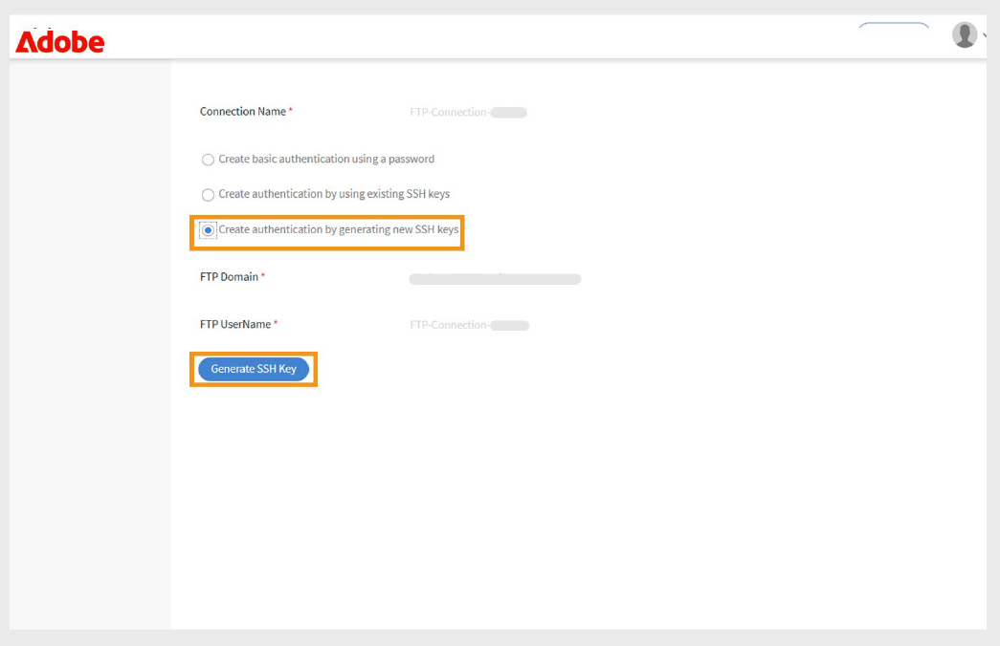
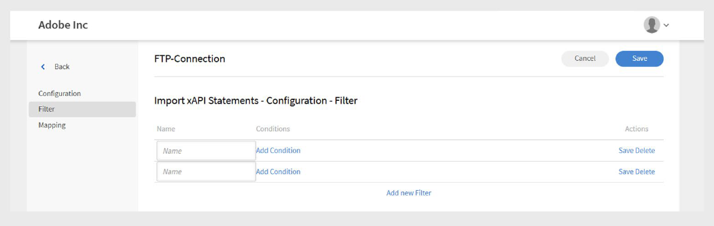

# Conector de FTP en Adobe Learning Manager

## Introducción

FTP (File Transfer Protocol, Protocolo de transferencia de archivos) es un protocolo de red estándar que se utiliza para transferir archivos entre un cliente y un servidor a través de Internet o de una red local. Permite a los usuarios cargar, descargar y administrar archivos en un servidor remoto. Para las transferencias de archivos seguras, se suelen utilizar variantes como SFTP (SSH File Transfer Protocol) y FTPS (FTP Secure). El FTP se ha adoptado ampliamente en entornos empresariales para automatizar el intercambio de datos entre sistemas, como la sincronización de datos de usuarios o de formación entre Adobe Learning Manager y plataformas externas.

Este documento ofrece instrucciones paso a paso para los administradores de integración sobre la configuración y el uso del conector de FTP en Adobe Learning Manager. El conector FTP permite el intercambio automatizado de datos entre Learning Manager y sistemas externos mediante protocolos de transferencia de archivos seguros.

Aprenderá a configurar conexiones FTP, asignar campos de datos, programar importaciones o exportaciones automatizadas de usuarios y supervisar la actividad de sincronización. Esta guía permite una integración fluida y segura con plataformas de aprendizaje externas o sistemas de RR. HH. Puede importar usuarios internos e instrucciones de xAPI, así como exportar aptitudes de usuarios, transcripciones de alumnos y datos de xAPI.

Los administradores de integración deben generar archivos CSV para migrar usuarios, datos de usuarios o contenido de aprendizaje, y cargarlos en las carpetas designadas de la cuenta FTP de Adobe Learning Manager. A continuación, Adobe Learning Manager lee, combina e importa los datos en función de una programación definida.

Realice estas operaciones a petición o mediante la configuración de una programación que satisfaga las necesidades de su organización.

## Ventajas de la integración con FTP

- Reduce el esfuerzo manual y los errores humanos en la gestión de datos.
- Integra datos de varias fuentes externas simultáneamente.
- Admite operaciones de datos programadas y bajo demanda.
- Permite la asignación detallada de campos entre diferentes formatos del sistema.

## Requisitos previos

Antes de configurar el conector de FTP, asegúrese de que su entorno cumpla estos requisitos:

- Función de administrador de integración con permisos de conector FTP.
- Conexión a Internet estable con ancho de banda adecuado para transferencias de archivos.
- Configuración del cortafuegos que permite el tráfico FTP en los puertos requeridos.
- Acceso al puerto requerido, según los requisitos de seguridad

### Permiso y acceso

Asegúrese de que tiene lo siguiente:

- Acceso para generar y administrar claves SSH (si se utiliza la autenticación SSH).
- Permiso para crear y actualizar archivos CSV en las carpetas de FTP especificadas.

## Capacidades clave

### Importación y exportación de datos con el conector de FTP

El conector de FTP en Adobe Learning Manager simplifica el intercambio de datos entre sistemas externos y su cuenta de Adobe Learning Manager. Admite operaciones de importación o exportación programadas y bajo demanda, lo que reduce el esfuerzo manual y garantiza una información precisa y actualizada.

Este método admite la integración con varios sistemas externos. Si los diferentes sistemas generan archivos CSV independientes, Adobe Learning Manager combina los datos y los importa como un solo lote.

### Importar datos a Adobe Learning Manager

_Importación de datos de usuario_

Cargue archivos CSV estructurados en carpetas FTP designadas para importar datos de usuarios internos. Adobe Learning Manager lee y procesa estos archivos según la programación configurada para mantener actualizada la información del usuario.

_Integración de varios orígenes_

Si utiliza varios sistemas externos, cada sistema puede generar su propio archivo CSV. Adobe Learning Manager combina los archivos y procesa los datos como un solo lote, lo que facilita la administración de registros de usuario de diferentes orígenes.

_importación de xAPI_

El conector también admite instrucciones xAPI (Experience API). Importa estos desde sistemas de aprendizaje de terceros para realizar un seguimiento de las actividades de aprendizaje y generar informes al respecto en varias plataformas.

### Exportar datos desde Adobe Learning Manager

_Exportación de datos de alumno_

Exporta datos de usuarios, como el progreso de habilidades, la finalización de cursos y las métricas de rendimiento, a una ubicación de FTP designada. Utilice estos datos para informes o análisis externos.

_Transcripciones de alumnos_

Genera y exporta transcripciones detalladas con finalizaciones de cursos, certificaciones y rutas de aprendizaje para respaldar el cumplimiento normativo y la verificación de credenciales.

### Asignación de atributos

Asigne columnas de archivos CSV a atributos de usuario de Adobe Learning Manager. Puede reutilizar y actualizar la configuración de asignación según sea necesario, lo que facilita la adaptación a los cambios en los requisitos de datos.

### Programación y automatización

Programe las tareas de importación y exportación para que se ejecuten a intervalos regulares, como diarios, semanales o personalizados. Esto garantiza actualizaciones de datos coherentes sin esfuerzo manual.

## Configurar el conector de FTP

Configure el conector de FTP para establecer la sincronización de datos segura entre Adobe Learning Manager y sistemas externos.

Para configurar el conector de FTP:

1. Inicie sesión como administrador de integración.
2. Seleccione **FTP de Adobe Learning Manager** y, a continuación, seleccione **Introducción**.

   
   _La interfaz del conector FTP de Adobe Learning Manager muestra el botón Introducción_

3. Seleccione **Siguiente** para continuar con el asistente de instalación del conector FTP.

   
   _La página Configuración muestra el botón Siguiente para continuar con la instalación del conector FTP_

### Configurar la autenticación

Adobe Learning Manager admite tres métodos de autenticación, cada uno con diferentes niveles de seguridad y requisitos de complejidad.

#### Autenticación básica

Este método utiliza credenciales tradicionales de nombre de usuario y contraseña para el acceso FTP. Aunque es más fácil de implementar, proporciona una seguridad más baja que las alternativas basadas en SSH.

1. Seleccione **Crear autenticación básica usando una contraseña**.
2. Escriba el nombre de usuario y la contraseña de FTP en los campos proporcionados. Verifique que las credenciales se hayan introducido correctamente antes de continuar.

   
   _Formulario de autenticación FTP con campos de nombre de usuario y contraseña, que muestra la opción de autenticación básica seleccionada_

#### Autenticación de clave SSH existente

Utilice este método si ya ha establecido pares de claves SSH para la autenticación segura.

1. Seleccione **Crear autenticación usando claves SSH existentes**.
2. Copie y pegue el contenido de la clave pública en el campo de texto proporcionado. Asegúrese de que el formato de la clave pública sea correcto (normalmente empieza por ssh-rsa o ssh-ed25519).

   
   _Interfaz de autenticación de clave SSH con campo de texto para la entrada de clave pública_

#### Generar una nueva clave SSH

Utilice esta opción para crear un nuevo par de claves SSH específicamente para esta conexión FTP.

1. Seleccione **Crear autenticación generando nueva clave SSH**.
2. Seleccione **Generar clave SSH** para crear un nuevo par de claves. Descargue y almacene de forma segura la clave privada generada. La clave pública se configurará automáticamente para la conexión FTP.

   
   _Pantalla de generación de claves SSH con el botón Generar clave SSH y otras opciones de configuración_

## Conectarse a FTP mediante FileZilla

FileZilla es una herramienta opcional para la gestión de conexiones FTP. Se puede utilizar cuando necesite cargar archivos manualmente, verificar las estructuras de directorios o solucionar problemas de conexión fuera de los procesos automatizados de Adobe Learning Manager.

### Instalación y configuración de FileZilla

FileZilla es un cliente FTP gratuito y de código abierto que proporciona una interfaz fácil de usar para las operaciones de transferencia de archivos.

Para conectar el FTP a FileZilla:

1. Descargue e instale FileZilla desde el [sitio web oficial](https://filezilla-project.org/).
2. Abra **FileZilla**.
3. Seleccione **Archivo** y, a continuación, seleccione **Administrador del sitio**.
4. Seleccione **Nuevo sitio**.
5. Escriba los siguientes datos:
   - **Dominio FTP:** La dirección del servidor FTP al que desea conectarse, por ejemplo, ftp.example.com. Puede encontrar el dominio host en la página Conector FTP de Adobe Learning Manager.
   - **Puerto:** El puerto FTP predeterminado es 21. Sin embargo, Adobe Learning Manager utiliza el puerto 22 para las conexiones seguras.
   - **Nombre de usuario de FTP:** Nombre de inicio de sesión necesario para obtener acceso al servidor FTP.
   - **Contraseña de FTP:** Contraseña vinculada a su nombre de usuario de FTP.
6. Seleccione **Conectar**.
7. Una vez conectado, puede transferir archivos arrastrando y soltando entre los paneles local (izquierda) y remoto (derecha).

## Usar el conector de FTP en Adobe Learning Manager

### Importar usuarios internos mediante el conector FTP

La función de importación de usuarios permite la sincronización automática de los datos de los empleados de los sistemas de RR. HH. y otras fuentes externas en Adobe Learning Manager.

### Asignación de atributos

La asignación de atributos crea la conexión entre los datos externos y la estructura de datos compatible de Adobe Learning Manager, lo que garantiza que los datos se coloquen en los campos correctos. Este paso es obligatorio.

Para asignar atributos:

1. Seleccione **Usuarios internos** en la página **Conector de FTP**.
2. Seleccione **Asignación de columnas**.
3. En la página **Asignar atributos**:
   - El **lado izquierdo** muestra los campos obligatorios en Adobe Learning Manager.
   - El **lado derecho** muestra los nombres de las columnas del CSV. Inicialmente, este lado contiene listas desplegables vacías.
   - Seleccione **Elegir CSV** para cargar un archivo CSV de muestra. Esto rellena el menú desplegable del lado derecho con los nombres de columna del archivo CSV. Consulte [este artículo](https://experienceleague.adobe.com/en/docs/learning-manager/using/integration/migration-manual#csv).
   - Asigne cada campo de Adobe Learning Manager a la columna CSV correspondiente.

   
   _Interfaz de asignación de atributos que muestra campos de Adobe Learning Manager a la izquierda y listas desplegables de columnas de CSV a la derecha_

4. Seleccione **Guardar** para completar la asignación.

Después de guardar, la cuenta configurada aparece como **origen de datos** en la aplicación del administrador. Los administradores pueden programar una importación o activar una sincronización manual.

### Importar instrucciones de xAPI

La importación de instrucciones de xAPI permite un seguimiento detallado de la actividad de aprendizaje al incorporar datos de aprendizaje externos en Adobe Learning Manager.

_Configurar origen_

La configuración de origen de xAPI establece la conexión entre los sistemas de aprendizaje externos y el seguimiento de la actividad de Adobe Learning Manager.

Para configurar un origen:

1. Vaya a la sección de configuración de xAPI.
2. Seleccione **Agregar una nueva configuración** en la lista de configuración.

   
   _Página de administración de configuración con el botón Agregar una nueva configuración y la lista de configuración existente_

3. Escriba **Nombre** y **Nombre de archivo de origen**:
   - **Nombre:** Identificador descriptivo para este origen de xAPI (por ejemplo, integración de LMS o sistema de formación externo).
   - **Nombre de archivo de origen:** Nombre de archivo exacto que se cargará en la carpeta FTP (debe coincidir exactamente, incluida la extensión de archivo).

   
   _Formulario de configuración que muestra el campo de nombre y el campo de nombre de archivo de origen_

4. Seleccione **Guardar** para crear la configuración básica.

_Agregar filtros (opcional)_

Los filtros le permiten importar de forma selectiva instrucciones xAPI según criterios específicos.

Para agregar un filtro para el origen:

1. Seleccione **Filtro** en el panel izquierdo.
2. Seleccione **Agregar nuevo filtro**.

   
   _Página de configuración de filtros con el botón Agregar nuevo filtro_

3. Configure lo siguiente:
   - **Nombre:** Nombre descriptivo de la regla de filtro.
   - **Condición:** Operador de comparación (igual a, contiene, mayor que, etc.).

   
   _Cuadro de diálogo de creación de filtros que muestra el campo de nombre y las condiciones_

4. Seleccione **Agregar nuevo filtro** para agregar más filtros.
5. Seleccione **Guardar** o **Eliminar** según sea necesario en la columna **Acciones**.
6. Después de agregar filtros, selecciona **Guardar**.

_Asignar campos_

Para asignar los campos:

1. Seleccione **Asignación** en el panel izquierdo.
2. En la página **Asignación**, verá las rutas de campo JSON a la izquierda y los nombres de columna CSV a la derecha.

   
   _Agregar una asignación para el origen de importación_

3. De forma predeterminada, asigne los siguientes campos obligatorios:
   - **actor.mbox:** Representa la dirección de correo electrónico del alumno (el actor que realiza
la acción). Identifica de manera exclusiva quién realizó la actividad.
   - **verb.id:** Este es el identificador de la acción realizada por el alumno, como
completado, intentado o pasado. Especifica la acción del alumno.
   - **object.id:** Indica el objeto de aprendizaje o la actividad con la que interactuó el alumno,
como un curso, módulo o ruta de aprendizaje.
4. Seleccione **Agregar una nueva asignación** para asignar campos adicionales.
5. Para cada campo, seleccione el **tipo de datos** adecuado (cadena, número, booleano o fecha).
6. Seleccione **Guardar** para completar la asignación.

## Programar la importación

La programación automatizada garantiza una sincronización de datos coherente sin intervención manual,
mantener registros actuales de actividades de aprendizaje.

Para programar la importación:

1. Seleccione **Configurar programación** en el panel izquierdo.

   
   _La página de configuración de la programación muestra las opciones de habilitación y los controles de tiempo_

2. Seleccione **Habilitar la importación de instrucciones xAPI usando esta conexión.**
3. Seleccione **Habilitar programación** para configurar importaciones automáticas.
4. Establezca los siguientes parámetros:
   - **Fecha de inicio:** Cuándo deben comenzar las importaciones programadas.
   - **Hora:** Hora del día para la ejecución de la importación.
   - **Repetir después de:** La frecuencia con la que se deben ejecutar las importaciones (intervalos diarios, semanales y personalizados).
5. Seleccione **Guardar**.

## Ejecutar a petición (opcional)

La ejecución a petición proporciona importaciones inmediatas de datos fuera de las operaciones programadas normales.

Cuándo utilizar las importaciones a petición:

- Prueba de nuevas configuraciones antes de la programación
- Procesamiento de actualizaciones de datos urgentes o urgentes
- Gestión de migraciones o correcciones de datos de un solo uso. Solución de problemas de importación

Para importar manualmente instrucciones xAPI:

1. Seleccione **Bajo demanda** en el panel izquierdo.
2. Seleccione **Ejecutar**.

   
   _Página de ejecución a petición con el botón Ejecutar_

## Ver estado de ejecución

La supervisión del estado permite una gestión proactiva de las operaciones de importación y una rápida identificación de los problemas.

Para ver el estado de ejecución:

1. Seleccione **Estado de ejecución** para ver una lista de todas las ejecuciones de importación.
2. La página muestra:

   - **Fecha de inicio:** Cuándo comenzó la operación de importación.
   - **Duración:** Tiempo total necesario para el procesamiento.
   - **Tipo de importación:** Si la importación se programó o a petición.
   - **Estado actual:** Información de estado en tiempo real.
      - **En curso:** Se está ejecutando la importación
      - **Completado:** Finalización correcta con recuentos de registros
      - **Error:** Error con información de diagnóstico

## Solucionar error de importación

La sección Estado de ejecución proporciona un resumen completo de todas las tareas de importación en orden cronológico, lo que permite a los administradores supervisar las operaciones e identificar rápidamente los problemas.

Indicadores de estado:

- **Correcto:** La importación se completó sin errores.
- **Signo de advertencia:** Indica errores o problemas durante la ejecución.
- **En curso:** operación de importación en ejecución.
- **Pendiente:** Importación programada pero aún no iniciada.

Cuando se producen errores, el sistema muestra indicadores de advertencia junto a las ejecuciones de importación fallidas. Seleccione el vínculo Informe de errores para descargar informes de errores detallados.
