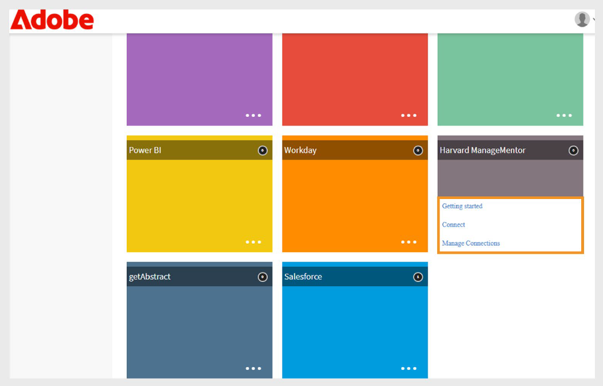
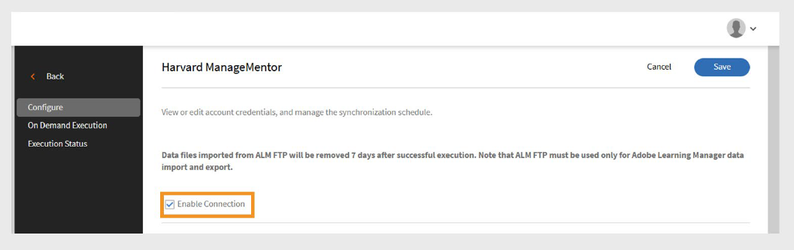

# Conector de Harvard ManageMentor en Adobe Learning Manager

## Introducción

El **conector de Harvard ManageMentor** está diseñado para clientes empresariales que utilizan Harvard ManageMentor. Permite a los alumnos descubrir y acceder a los cursos de Harvard ManageMentor directamente desde Adobe Learning Manager. Una vez conectado, el sistema puede obtener datos del progreso del alumno periódicamente y crear cursos en Adobe Learning Manager basados en los metadatos importados.

Este artículo explica cómo configurar y utilizar el conector de Harvard ManageMentor en Adobe Learning Manager.

Con esta integración, los administradores de integración pueden conectar la cuenta de Harvard ManageMentor de la empresa a Adobe Learning Manager para importar automáticamente cursos y realizar un seguimiento del progreso de los alumnos, sin crear nuevo contenido de formación desde cero.

## Requisito previo

Asegúrese de que la característica **Migración** esté habilitada para su cuenta antes de configurar el conector.

## Configurar el conector

Utilice el conector de Harvard ManageMentor para incorporar cursos de Harvard ManageMentor a Adobe Learning Manager. Después de conectar la cuenta, puede importar detalles del curso y realizar un seguimiento del progreso del alumno.

Para configurar el conector:

1. Inicie sesión como administrador de integración.
2. Seleccione **Harvard ManageMentor** en la página principal.
3. Seleccione una de las siguientes opciones en el mosaico del conector:
   - **Introducción**
   - **Conectar**
   - **Administrar conexiones**

   
   _El mosaico Harvard ManageMentor muestra tres opciones de configuración_

## Crear una nueva conexión

Para crear una nueva conexión:

1. Seleccione **Connect** en el icono **Harvard ManageMentor**.

   
   _Seleccione Conectar para crear una nueva conexión de Harvard ManageMentor_

2. Escriba la conexión en el campo **Nombre de conexión**.
3. Seleccione **Conectar** para crear la conexión.

   
   _Escriba el nombre en el campo Nombre de conexión_

## Administrar la conexión

Después de configurar el conector de Harvard ManageMentor, puede administrar su conexión en Adobe Learning Manager. Puede cambiar la configuración de sincronización y ejecutar las sincronizaciones manualmente o según una programación.

### Habilitar la conexión

Para habilitar la conexión:

1. Seleccione **Administrar conexiones** en el mosaico **Harvard ManageMentor**.

   
   _Administrar conexiones para configurar y programar la importación de datos_

2. Seleccione la conexión.
3. Seleccione **Configurar** en el panel de navegación izquierdo.
4. Seleccione **Habilitar conexión** y, a continuación, seleccione **Guardar**.

   
   _Habilite el conector de Harvard ManageMentor para importar los datos_

### Programar sincronización

Para programar la sincronización:

1. Seleccione **Administrar conexiones** en el mosaico **Harvard ManageMentor**.
2. Seleccione la conexión.
3. Seleccione **Configurar** en el panel de navegación izquierdo.
4. Seleccione **Habilitar programación** en la sección **Programar sincronización**.

   
   _Programar la importación de datos de Harvard ManageMentor a Adobe Learning Manager_

5. Seleccione la fecha y hora de inicio en UTC.
6. Escriba el número de días tras los cuales debe repetirse la sincronización.
7. Seleccione **Guardar**.

La configuración de sincronización se guarda. El conector se ejecutará según lo programado e importará datos de Harvard ManageMentor en Adobe Learning Manager.

## Ejecutar sincronización a petición

La opción **Sincronización a petición** le permite importar manualmente datos de Harvard ManageMentor a Adobe Learning Manager. Esto resulta útil cuando desea actualizar los datos de actividad del alumno inmediatamente, sin esperar a la siguiente sincronización programada.

Para ejecutar la importación de datos a petición:

1. Seleccione **Administrar conexiones** en el mosaico **Harvard ManageMentor**.
2. Seleccione la conexión.
3. Seleccione **Ejecución a petición** en el panel izquierdo.
4. Seleccione **Fecha de inicio**.

   
   _Ejecutar la solicitud a petición para importar datos inmediatamente de Harvard ManageMentor a Adobe Learning Manager_

5. Seleccione una de las opciones siguientes:

   - **Deshabilitar el acceso a Adobe Learning Manager durante la ejecución**: Se recomienda si la sincronización puede causar tiempo de inactividad.
   - **Habilitar acceso a Adobe Learning Manager durante la ejecución**: Recomendado para evitar la interrupción del servicio.
6. Seleccione **Ejecutar** para importar todos los datos desde la fecha de inicio hasta el presente.

### Ver historial de ejecución

En la página Estado de ejecución se enumeran todas las ejecuciones de sincronización en orden. Si una ejecución tiene errores, aparece un icono de advertencia. Si es necesario, puede comprobar el registro de errores, corregir el archivo CSV y volver a ejecutar la sincronización más reciente.

Para ver el historial de ejecuciones:

1. Seleccione **Estado de ejecución** en el panel izquierdo.
2. Puede ver las siguientes columnas:
   - **Ejecutar**
   - **Fecha de inicio**
   - **Duración**
   - **Tipo** (Programado o Bajo demanda)
   - **Estado** (En curso o Completado)

   
   _Ver el estado de ejecución de las importaciones bajo demanda y programadas_

>[!NOTE]
>
>Si elimina y vuelve a crear una conexión, el historial de ejecución de las ejecuciones anteriores seguirá siendo visible. Sólo puede volver a ejecutar la última sincronización.

### Requisito para la sincronización

Asegúrese de que los siguientes archivos estén presentes en la carpeta FTP de Harvard ManageMentor:

- **hmm12_metadata.csv** Este archivo contiene metadatos del curso. Siga el formato de nombre de archivo correcto.
- **client_hmm12_yyyyMMdd.csv** Este archivo es la fuente de usuario. El formato de la fecha debe coincidir con aaaaMMdd.

**Archivos de muestra**

- [Archivo de metadatos del curso para el conector de Harvard ManageMentor](https://experienceleague.adobe.com/docs/learning-manager/assets/hmm12-metadata.csv?lang=en)
- [Archivo de fuente de usuario para el conector de Harvard ManageMentor](https://experienceleague.adobe.com/docs/learning-manager/assets/client-hmm12-20170304.csv?lang=en)
