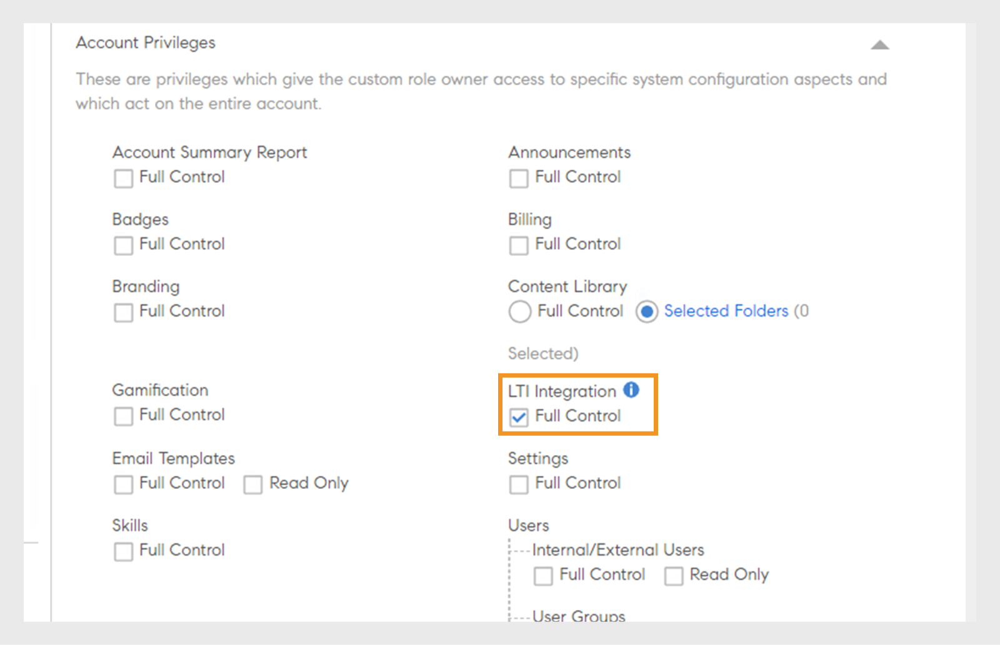

# Integración de LTI

## ¿Qué es LTI?

La interoperabilidad de las herramientas de aprendizaje (LTI) es un estándar de IMS para la integración de aplicaciones de aprendizaje sofisticadas en entornos educativos. Los usuarios pueden acceder al contenido de aprendizaje externo de proveedores de contenido externos directamente en su LMS sin iniciar sesión ni navegar a otro LMS.

## Integración de LTI con Adobe Learning Manager

Adobe Learning Manager ahora es compatible con la versión 1.3 de LTI, que le permite actuar tanto como proveedor de herramientas como consumidor de herramientas. Esta función mejora la interoperabilidad entre Adobe Learning Manager y otros sistemas de gestión de aprendizaje (LMS).

**LTI como proveedor de herramientas**: LTI como proveedor de herramientas permite que los sistemas externos se integren con un LMS. Adobe Learning Manager actúa como proveedor de herramientas de LTI, lo que permite a otras plataformas de LMS acceder a objetos de aprendizaje desde Adobe Learning Manager directamente desde su LMS.

**LTI como consumidor de herramientas**: LTI como consumidor de herramientas permite a LMS integrar herramientas externas a través de la interoperabilidad de herramientas de aprendizaje (LTI). En este escenario, LMS es un consumidor de servicios proporcionados por herramientas externas. Adobe Learning Manager actúa como consumidor de herramientas de LTI, lo que le permite integrar herramientas de aprendizaje de terceros, lo que permite a los alumnos de Adobe Learning Manager consumir los objetos de aprendizaje de las herramientas de terceros dentro de Adobe Learning Manager.

## Configurar el conector LTI en ALM

Siga estos pasos para habilitar la integración de LTI en Adobe Learning Manager:

1. Inicie sesión como **[!UICONTROL administrador de integración]**.
2. En la página principal, seleccione **[!UICONTROL Aplicaciones]** > **[!UICONTROL Aplicaciones destacadas]**.
3. Seleccione **[!UICONTROL Integraciones LTI]** en la página **[!UICONTROL Aplicaciones]**.
4. Seleccione la opción **[!UICONTROL Habilitar integraciones LTI]** y elija **[!UICONTROL Guardar]**.

_Habilitar integraciones LTI_

>[!NOTE]
>
>Una vez activada, no se puede modificar ni desactivar la opción Integraciones LTI.

Esto creará la nueva barra lateral Integraciones LTI en la cuenta del administrador.

_Barra lateral LTI_

Se ha agregado una nueva función personalizada, **[!UICONTROL Integración LTI]**, en **[!UICONTROL Privilegios de cuenta]**, en la sección **[!UICONTROL Función personalizada]**. Los administradores pueden asignar esta función a los usuarios, lo que les permite acceder a la sección **[!UICONTROL Integración de LTI]**. Los administradores también deben conceder permisos de **[!UICONTROL Catálogos]** a estos usuarios para exportar los cursos. Esta configuración proporciona acceso completo a las secciones LTI y Catálogos para exportar cursos.

_Función personalizada de integración LTI_

## Adobe Learning Manager como proveedor de herramientas LTI

Como proveedor de LTI, Adobe Learning Manager le permite exportar cursos de sus catálogos como paquetes de LTI que se pueden compartir con plataformas de LMS externas.

### Cree y comparta las credenciales de LTI con un LMS externo: flujo de trabajo de administrador

Siga estos pasos para compartir las credenciales de LTI con LMS externo:

1. Inicie sesión como **[!UICONTROL administrador]**.
2. En la página principal, seleccione **[!UICONTROL Integración de LTI]** > **[!UICONTROL Configuración de herramienta LTI]**. Puede ver las credenciales de configuración en esta página.
3. El administrador puede compartir estas credenciales con un LMS externo para el registro del sitio de LTI.

   
   _Credenciales de configuración de herramientas LTI_

   * **[!UICONTROL URL de token]**: la dirección URL en la que el LMS solicita un token de acceso para autenticar y autorizar la comunicación con la herramienta LTI.
   * **[!UICONTROL URL del vínculo de destino]**: la dirección URL de destino a la que se redirige a los usuarios al iniciar la herramienta LTI desde el LMS.
   * **[!UICONTROL URL del conjunto de claves público]**: la dirección URL que proporciona las claves públicas utilizadas para comprobar los tokens de seguridad para la comunicación segura.
   * **[!UICONTROL URL de redirección]**: la dirección URL a la que se envían los usuarios después de completar una acción en la herramienta LTI, y que normalmente los redirige al LMS.

### Configuración de LMS externo

Con las credenciales compartidas por el administrador de Adobe Learning Manager, el administrador de LMS externo registra Adobe Learning Manager y genera las credenciales. Estas credenciales se añadirán a la Adobe Learning Manager como paso final para configurar Adobe Learning Manager como proveedor de herramientas. A continuación se indican las credenciales generadas por el LMS externo:

* **[!UICONTROL Id. de emisor o plataforma]**: identificador único del LMS o la plataforma que envía la solicitud de inicio de LTI al proveedor de herramientas.
* **[!UICONTROL ID de cliente]**: identificador único asignado a la herramienta LTI por el LMS para fines de autorización.
* **[!UICONTROL Id. de implementación]**: identificador que vincula una implementación específica de la herramienta LTI al LMS para administrar varias instancias.
* **[!UICONTROL URL de token]**: extremo en el que el LMS solicita un token de acceso para autenticar y autorizar interacciones con la herramienta LTI.
* **[!UICONTROL URL de autenticación]**: la dirección URL a la que el LMS envía usuarios para autenticar e iniciar la conexión LTI.
* **[!UICONTROL URL de clave pública]**: la dirección URL que proporciona la clave pública utilizada por la herramienta LTI para verificar los tokens de seguridad y garantizar una comunicación segura.

### Añadir Adobe Learning Manager como proveedor de herramientas: flujo de trabajo de administrador

Siga estos pasos para añadir Adobe Learning Manager como proveedor de herramientas:

1. Inicie sesión como **[!UICONTROL administrador]**.
2. En la página principal, seleccione **[!UICONTROL Integraciones LTI]** > **[!UICONTROL Plataformas LTI]**.
3. Seleccione **[!UICONTROL Agregar]** e introduzca las credenciales compartidas por LMS externo.

   
   _Agregar una nueva plataforma LTI_

4. Una vez agregados todos estos valores, seleccione **[!UICONTROL Validar]** y **[!UICONTROL Agregar]**.

### Exportar paquete LTI: flujo de trabajo de administrador

LTI Tools le permite exportar formación desde sus catálogos como un paquete descargable de contenido de aprendizaje que se puede compartir con sistemas de administración de aprendizaje (LMS) o plataformas externas mediante el estándar de interoperabilidad de herramientas de aprendizaje (LTI).

Siga estos pasos para exportar el curso desde Adobe Learning Manager:

1. Inicie sesión como **[!UICONTROL administrador]**.
2. En la página principal, seleccione **[!UICONTROL Integraciones LTI]** > **[!UICONTROL Exportaciones de paquetes LTI]**.
3. Seleccione **[!UICONTROL Exportación de nuevo paquete]**.

   
   _Exportar paquete LTI_

4. Seleccione el catálogo requerido de la lista. Puede ver la lista de cursos disponibles en el catálogo.
5. Seleccione los cursos requeridos y seleccione **[!UICONTROL Exportar como LTI]**.
6. Seleccione el curso para ver el vínculo de inicio.
7. Seleccione el icono **[!UICONTROL Enlace de descarga]** para descargar el paquete. El paquete es un archivo zip que contiene los archivos IMSCC exportados correctamente.

Con este vínculo de inicio o este archivo IMSCC, puede exportar los cursos de Adobe Learning Manager al LMS externo. Los alumnos pueden consumir los cursos de Adobe Learning Manager desde su LMS.

>[!NOTE]
>
>Si un administrador edita un curso o actualiza los módulos después de crear el vínculo de inicio, el vínculo se actualizará automáticamente. Sin embargo, si un administrador retira un curso después de crear el vínculo de inicio, el curso retirado no se iniciará en el consumidor de LTI.

## Adobe Learning Manager como consumidor de LTI: flujo de trabajo de administrador

Como consumidor de LTI, Adobe Learning Manager le permite utilizar actividad, herramientas, contenido y widgets de proveedores de LTI externos.
Para añadir Adobe Learning Manager como consumidor de LTI, necesita las siguientes credenciales del proveedor de LTI externo:

* Iniciar URL de inicio de sesión
* URL de vínculo de destino
* URL de redirección
* Tipo de clave pública

Siga estos pasos para añadir Adobe Learning Manager como consumidor de LTI:

1. Inicie sesión como **[!UICONTROL administrador]**.
2. En la página principal, seleccione **[!UICONTROL Integraciones LTI]** > **[!UICONTROL Registro de herramienta LTI]**.
3. Seleccione **[!UICONTROL Agregar]** > **[!UICONTROL Nueva herramienta LTI]**.

   >[!NOTE]
   >
   >Puede importar varias herramientas LTI cargando un archivo .csv.

4. Introduzca las credenciales anteriores del proveedor de LTI.

   
   _Agregar una nueva herramienta LTI_

5. Una vez hecho esto, seleccione **[!UICONTROL Validar]** y **[!UICONTROL Agregar]**.
6. Puede ver la siguiente pantalla:

   
   _Credenciales de registro_

7. Comparta estas credenciales con el proveedor de LTI para el registro. Una vez completado el registro, puede obtener el vínculo de inicio o el archivo IMSCC del proveedor de LTI para importar los cursos.

### Crear contenido LTI: flujo de trabajo de autor

Los proveedores de LTI le proporcionan un vínculo de inicio o un archivo IMSCC para añadir sus cursos a Adobe Learning Manager. Siga estos pasos para añadir cursos desde un LMS externo:

1. Inicie sesión como **[!UICONTROL autor]**.
2. Seleccione **[!UICONTROL Biblioteca de contenido]** > **[!UICONTROL Agregar]** > **[!UICONTROL Módulo LTI]**.

   
   _Agregar contenido LTI - Autor_

3. Escriba **[!UICONTROL Nombre]** y **[!UICONTROL Descripción]**.
4. Escriba **[!UICONTROL Launch Link]** y **[!UICONTROL Custom Parameters]** del proveedor LTI.
5. Seleccione su [!UICONTROL proveedor de LTI] en el menú desplegable **[!UICONTROL Proveedor de herramientas]**.
6. Busque y seleccione **[!UICONTROL Public]** en la opción **[!UICONTROL Agregar a carpeta]**. De este modo, los cursos estarán disponibles para todos los autores.
7. Seleccione **[!UICONTROL Guardar]**.
Una vez creado el contenido, puede añadirlo al crear el curso.

### Crear curso con contenido LTI: flujo de trabajo de autor

Siga estos pasos para crear un curso con contenido LTI:

1. Inicie sesión como **[!UICONTROL autor]**.
2. En la página principal, seleccione **[!UICONTROL Cursos]** > **[!UICONTROL Agregar]**.
3. Escriba el **[!UICONTROL Nombre]** y la **[!UICONTROL Descripción]** del curso.
4. En la opción **[!UICONTROL Módulos]**, seleccione **[!UICONTROL Agregar módulos]** > **[!UICONTROL Módulo con ritmo personalizado]**.
5. Selecciona el **[!UICONTROL contenido LTI]** que has creado y selecciona **[!UICONTROL Guardar]**.
6. Especifique los detalles necesarios, como **[!UICONTROL Aptitudes]**, **[!UICONTROL Autores]** y **[!UICONTROL Tipo de inscripción]**.
7. Una vez hecho esto, publique el curso. Los alumnos de Adobe Learning Manager pueden realizar los cursos de LTI desde el proveedor de LTI externo.

## Situaciones de error de exportación de LTI

Los siguientes tipos de cursos no se pueden exportar como cursos LTI:

* **Curso con módulo de actividad**: Cursos que contienen módulos específicos basados en actividad.
* **Curso con varios tipos de entrega**: Los cursos con varios tipos de entrega incluyen módulo con ritmo personalizado, módulo virtual o de clase, módulo de actividad y aprendizaje mixto.
* **Curso con requisitos previos**: Cursos que requieren finalización previa.
* **Curso con inscripción múltiple**: Cursos que contienen inscripción múltiple
* **Cursos con varias instancias**: cursos que ofrecen varias instancias de entrega.

| Instancia predeterminada | Una o varias instancias no predeterminadas | Expectativa | Mensajes de error |
|---|---|---|---|
| Activo | Ninguno | Exportar | Ninguno |
| Activo | Activo | No exportar | Varias instancias |
| Activo | Retirado | No exportar | Varias instancias |
| Activo | Eliminada | Exportar | Ninguno |
| Retirado | Ninguno | No exportar | Retirar instancia de definición |
| Retirado | Activo | No exportar | Retirar instancia de definición, varias instancias |
| Retirado | Retirado | No exportar | Retirar instancia de definición, varias instancias |
| Retirado | Eliminar | No exportar | Retirar instancia de definición |

* **Cursos con varias respuestas a preguntas**: Cursos con MQA habilitado.
* **Curso con cambio de instancia habilitado**: Cursos que permiten a los alumnos cambiar de instancia.
* **Curso de pago**: Cursos que requieren pago para inscribirse.
* **Cursos que forman parte de la ruta de aprendizaje, la certificación o el plan de aprendizaje**: los cursos que forman parte de las rutas de aprendizaje o los planes.
* **Cursos que no son de tipo de inscripción automática**: los cursos están restringidos a la inscripción automática del alumno.
* **Cursos de clase o clase virtual**: Cursos con sesiones de clase o clase virtual.
* **Cursos con módulos no obligatorios**: Cursos que contienen módulos opcionales o no obligatorios.

_Estado de exportación_

## Limitaciones de LTI

Las siguientes son limitaciones de LTI tanto para el consumidor de LTI como para el proveedor de LTI:

* Es posible exportar cursos combinados, lo que afecta a la experiencia de consumo de cursos de los alumnos.
* Es posible exportar cursos con ritmo personalizado con aula, clase virtual o módulos de actividad, lo que afecta a la experiencia del curso de los alumnos.
* Es posible exportar cursos compartidos como LinkedIn Learning y Go1.
* Es posible iniciar cursos con fechas de inscripción anteriores en ALM, lo que afecta al acceso y la experiencia de los alumnos en los cursos.
* Los alumnos no pueden consumir cursos de LTI en la aplicación móvil de iOS ALM, lo que afecta a la experiencia de consumo del curso.
* Los alumnos no pueden descargar ni acceder a los cursos de LTI sin conexión en la aplicación móvil de ALM, ya que estos cursos los proporcionan plataformas de terceros.
* Los administradores solo pueden ver los catálogos activados y no pueden ver los catálogos desactivados.
* ALM tiene limitaciones en las longitudes de nombre (63 caracteres) y correo electrónico (64 caracteres), lo que impide el acceso de los alumnos de LTI externos que excedan estos límites.
* Los retrasos en la sincronización de la finalización de los cursos o de la sincronización de grados se deben al sistema LTI de terceros.
* Los mensajes de sincronización de cursos no aparecen para los alumnos de equipos que consumen cursos de LTI a través de la aplicación para equipos o el navegador, lo que afecta a las notificaciones de los alumnos.
* Los informes de datos de usuario no pueden exportar datos para usuarios registrados mediante LTI.
* Los nombres de proveedores de herramientas no se reconocen automáticamente cuando los autores agregan vínculos de inicio en el consumidor de herramientas, lo que requiere una selección manual.
* Las cargas masivas de herramientas a través de CSV requieren la codificación UTF-8 para caracteres acentuados para evitar errores de importación.
* Los administradores de cuentas de LTI no pueden compartir cursos, rutas de aprendizaje ni certificaciones que incluyan módulos LTI.
* No se pueden volver a sincronizar las notas cuando los usuarios vuelven a abrir el reproductor para los cursos de ALM completados, lo que afecta a las actualizaciones de puntuación de los alumnos y requiere un reactivador manual.
* ALM solo permite a los usuarios activos y de prueba consumir los cursos de LTI.
* La sincronización de grados activada en Moodle impide que se inicie el reproductor ALM, lo que afecta el acceso y la experiencia de los alumnos en el curso.
* El campo activo de LTI es de un solo valor y no admite varios valores.
* Los motivos de error no están disponibles cuando falla una exportación durante la migración de cursos sin contenido principal.
* Las notas externas del curso de LTI no aparecen en la transcripción del alumno y las puntuaciones no son visibles en la página Prueba de L2, lo que afecta al seguimiento del rendimiento de los alumnos.

## Prácticas recomendadas

Se recomienda crear un catálogo con cursos compatibles con LTI para evitar errores de exportación y facilitar la exportación de los cursos.

Catálogo LTI que muestra el estado de exportación correcto
