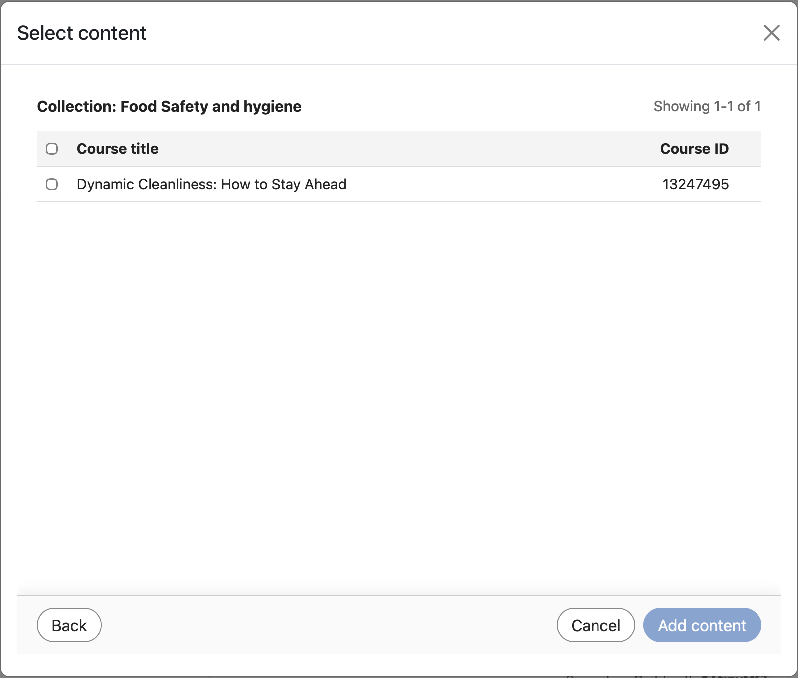

# Vínculos profundos de LTI en Adobe Learning Manager

## Información general

**La siguiente sección es para administradores**

La vinculación profunda de LTI es una función ventajosa de LTI que permite a los instructores o a los autores de cursos examinar, seleccionar e incorporar elementos de aprendizaje específicos de Adobe Learning Manager (ALM) directamente en un curso de consumidor o plataforma de una herramienta LTI externa (como Canvas o Moodle).

Los vínculos profundos de LTI simplifican el proceso de añadir cursos a una plataforma de aprendizaje como Moodle. En el flujo de trabajo actual, un autor debe copiar manualmente la URL del curso, incluido el parámetro UUID de exportación, y luego pegar los detalles necesarios en el LMS mientras configura el vínculo del curso. Este paso debe repetirse para cada curso y para cada ubicación. Por ejemplo, si es necesario añadir el mismo curso en 10 ubicaciones diferentes, el autor debe repetir el proceso de copiar y pegar 10 veces. Este enfoque manual aumenta el esfuerzo e introduce un mayor riesgo de errores de configuración.

La vinculación profunda elimina esta sobrecarga, ya que permite al LMS gestionar la selección de cursos durante la configuración y proporciona la dirección URL de inicio adecuada para la selección de contenido.

En este modelo:

* Los instructores y autores del LMS externo lanzan una experiencia de selección de enlaces profundos exclusiva para explorar ALM.
* El sistema devuelve un objeto de vínculo profundo de ALM al LMS externo para que el elemento seleccionado se pueda incrustar como parte del flujo de trabajo de creación de cursos.
* Los estudiantes consumen contenido vinculado profundamente en su LMS principal, que lanza sin problemas el material alojado en ALM.

## Sentencia de problema

Actualmente, ALM admite la integración de LTI 1.3, pero sin un flujo de trabajo completo de vinculación profunda, los instructores y los autores no tienen una forma estructurada de:

* Lanza una experiencia de selección de enlaces profundos dedicada desde un modo.
* Examine solo los objetos de aprendizaje que se deben exponer para una plataforma determinada.
* Seleccione un objeto de aprendizaje específico de la plataforma.
* ALM devuelve ese objeto de aprendizaje a la plataforma para que se pueda incrustar directamente en un curso.

Sin esta capacidad:

* La selección de contenido es manual o fragmentada
* Todo el contenido de la cuenta puede quedar expuesto involuntariamente a menos que se filtre explícitamente
* Las integraciones de proveedores de herramientas son más difíciles de poner en práctica
* Los autores de los cursos no pueden incrustar contenido LTI externo con un flujo de trabajo coherente y controlado

## Objetivos

Los objetivos principales de esta función son los siguientes:

1. Habilitar vinculación profunda de LTI en un proveedor de herramientas de LTI
   * Soporte de lanzamientos de enlaces profundos desde ALM a un proveedor de herramientas LTI.
2. Proporcionar un flujo de trabajo de selección de contenido controlado
   * Exponer solo catálogos y contenido aprobados y relevantes durante la selección de vínculos profundos.
3. Permitir a instructores y autores seleccionar objetos de aprendizaje
   * Proporciona una interfaz de usuario que se puede filtrar y buscar para seleccionar objetos de aprendizaje elegibles.
4. Devolver una respuesta válida de vínculo profundo a ALM
   * Redirija al usuario a la plataforma mediante el parámetro deep_link_return_url con la carga útil de enlaces profundos necesaria.
5. Compatibilidad con la exposición de catálogos específica de la plataforma
   * Permite a los administradores controlar qué catálogos se exponen y a qué plataforma LTI.

## Personas y sus funciones

El flujo de trabajo de vinculación profunda de LTI implica los siguientes perfiles:

| Persona | Descripción |
|---|---|
| Instructor o autor | Crea o administra cursos e inicia el flujo de selección de vínculos profundos para incrustar contenido externo. |
| Administrador de integración | Registra y administra las herramientas de LTI y habilita y configura el comportamiento de vinculación profunda. |
| Administración | Inicia y consume contenido agregado a través del flujo de trabajo de vínculos profundos. |

*Cada persona se asigna a un paso distinto en el flujo de trabajo de vinculación profunda, desde la configuración hasta el consumo.*

## Requisitos de datos y parámetros

La vinculación profunda intercambia los siguientes parámetros entre ALM y la plataforma LTI:

| Parámetro | Propósito |
|---|---|
| `deep_link_return_url` | Extremo de retorno utilizado para devolver el objeto de vínculo profundo seleccionado a ALM |
| `accepted_types` | Define los tipos de recursos aceptados por la plataforma |
| `accept_multiple` | Indica si se permite la selección de varios recursos; configurable por herramienta |
| `auto_create` | Indica que la plataforma puede crear automáticamente la entrada de recurso vinculada |

*Estos parámetros controlan qué contenido se muestra y cómo se devuelven las selecciones a ALM.*

## Crear un vínculo profundo

### Requisito previo

1. Debe haber iniciado sesión como administrador de integración.
2. Al configurar la integración de LTI, seleccione la casilla de verificación Admite vinculación profunda .
3. Indique la URL en el campo para llevar al usuario o autor a la selección.
4. Seleccione Guardar cambios.

   La misma dirección URL de inicio se reutiliza para simplificar la configuración y el uso.

   El comportamiento viene determinado por el tipo de mensaje LTI. Cuando el tipo de mensaje es `content_consumption`, se dirige al usuario al reproductor del curso. Cuando el tipo de mensaje es `content_selection`, el usuario se distribuye a través del flujo de vinculación profunda, donde el autor puede seleccionar el contenido deseado directamente sin copiar manualmente los identificadores específicos del curso.

   Después de guardar los cambios, selecciona la pestaña **Seleccionar contenido**. (La ficha **Seleccionar contenido** solo se activa después de seleccionar esta casilla de verificación).

**La siguiente sección es para autores.**

Como autor, puedes seleccionar contenido desde la ventana **Seleccionar contenido**. La ventana **Seleccionar contenido** muestra **Catálogo**, **Recuento de cursos** y **Fecha de exportación**.

1. Vaya a la herramienta de integración externa.

   

2. Seleccione un **Catálogo** y seleccione los cursos a los que desee vincular con vínculos profundos seleccionando las casillas de verificación junto a cada curso. Si añade varios cursos, aparece una ventana emergente de confirmación para que lo confirme.

   

   

3. Seleccione **Agregar contenido**. Al seleccionar **Agregar contenido**, se rellenan todos los campos automáticamente. Puede ver el UUID de exportación en el campo Parámetros personalizados. Se muestra un mensaje de confirmación si ha seleccionado varios cursos en el paso anterior.

   

4. En este momento, puede seleccionar **Cancelar** y volver a la pestaña **Seleccionar contenido** si desea seleccionar otros cursos o realizar cambios o puede seleccionar **Guardar y volver** al curso o seleccionar **Guardar y mostrar**. Los enlaces profundos se añaden a los destinos.

   
