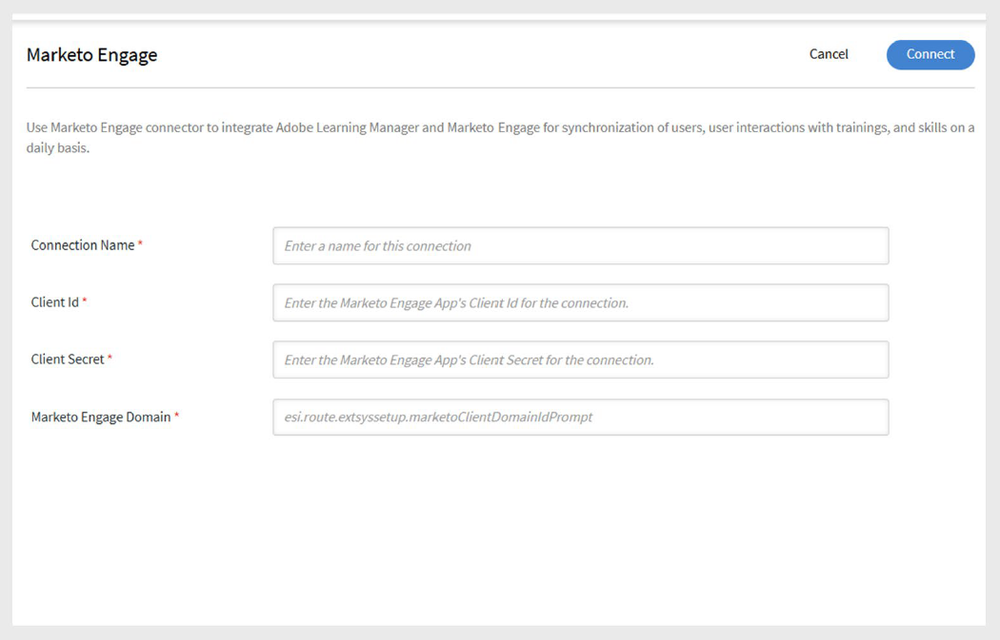

# Conector de Marketo Engage en Adobe Learning Manager

## Introducción

Marketo Engage Connector permite a Adobe Learning Manager integrarse a la perfección con Marketo Engage, una plataforma de automatización de marketing. Esta integración ayuda a los responsables de marketing a realizar un seguimiento de los datos de comportamiento de los alumnos de Adobe Learning Manager y a actuar en consecuencia al sincronizarlos con la base de datos de Marketo.

El conector de Marketo Engage permite una sincronización de datos perfecta entre los dos sistemas y permite a los responsables de marketing utilizar los datos de las actividades de aprendizaje para crear campañas de marketing dirigidas.

El conector de Marketo Engage le permite:

- Añada o actualice automáticamente clientes potenciales en la base de datos de Marketo Engage cuando los usuarios se añadan a Adobe Learning Manager.
- Sincronice los comportamientos de aprendizaje de los usuarios, como las inscripciones en cursos, las finalizaciones, las asignaciones de aptitudes y las finalizaciones de aptitudes como objetos personalizados en Marketo.
- Crea campañas dinámicas en Marketo con estos datos, aprovechando funciones como **Listas inteligentes**.

Esta integración ayuda a los responsables de marketing a orientar a las audiencias en función de su recorrido de aprendizaje en Adobe Learning Manager.

## Funciones principales

- Creación automatizada de clientes potenciales y actualizaciones basadas en los usuarios de Adobe Learning Manager.
- Exporte la actividad de aprendizaje (inscripciones, finalizaciones y logros de aptitudes) como objetos personalizados a Marketo.
- Programe o active exportaciones a petición.
- Compatibilidad con informes unificados, incluidos:
   - Informe de usuario
   - Transcripción de aprendizaje
   - Informe de aptitudes de usuarios

## Requisitos previos

Antes de realizar la integración, asegúrese de que su cuenta de Marketo admita la creación de esquemas mediante API.

Necesitará los siguientes detalles para crear la conexión:

- **Nombre de conexión**
- **Id. de cliente**
- **Secreto de cliente**
- **Dominio del Marketo Engage**

>[!NOTE]
>
>Puede obtener el ID de cliente y el secreto de cliente en la aplicación de Marketo Engage en **LaunchPoint** y el dominio en la sección **Web Services**.

## Configurar el conector

Para configurar el conector del Marketo Engage:

1. Inicie sesión en Adobe Learning Manager como administrador de integración.
2. Pase el ratón sobre el icono **Marketo Engage** y seleccione **Conectar**.

   
   _Seleccione Conectar para configurar el conector del Marketo Engage_

3. Escriba las credenciales requeridas

   - Nombre de conexión
   - ID de cliente
   - Secreto de cliente
   - Dominio de Marketo Engage

   
   _Escriba los detalles necesarios para el conector de Marketo Engage_

4. Seleccione **Conectar** para establecer la conexión.

## Eventos y desencadenantes de campañas

Puede activar la exportación de datos a Marketo Engage en función de los siguientes eventos:

- Se añade un nuevo usuario a Adobe Learning Manager.
- Un usuario está inscrito en un curso.
- Un usuario finaliza un curso.
- Un usuario está inscrito en una aptitud.
- Un usuario completa una aptitud.

Estos eventos se pueden exportar **a petición** o **de forma programada**.

## Asignación de columnas

Marketo utiliza dos bases de datos:

- **Base de datos de clientes potenciales**: para registros de usuarios potenciales
- **Base de datos de objetos personalizados**: para registros de actividad y eventos personalizados

Para asignar campos entre Adobe Learning Manager y Marketo:

1. Los campos **Informe de usuario** de Adobe Learning Manager se muestran en una columna.
2. Los **campos de Marketo** correspondientes se muestran en la columna adyacente.
3. Asigna los campos apropiados de Learning Manager a Marketo para crear y actualizar clientes potenciales.
4. Después de la asignación, todos los usuarios exportados aparecen como clientes potenciales en la base de datos de clientes potenciales de Marketo.

Los informes exportados en la sección **Objetos personalizados de Marketo** llevan el prefijo &quot;cp_&quot;.

## Eventos de exportación compatibles

Puede exportar los siguientes eventos relacionados con el usuario a su instancia de Marketo Engage:

- Nuevo usuario añadido
- Metadatos de usuario actualizados
- Actividad del usuario actualizada
- Inscripción en formación
- Inscripción automática
- Finalización de aptitudes

Estas exportaciones ayudan a impulsar la participación y personalizar las campañas de divulgación utilizando los datos de la actividad de aprendizaje.
