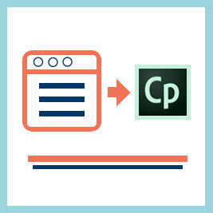

# Manual de migración

Manual de referencia para administradores de integración que desean migrar un LMS existente a LMS de Learning Manager

## Resumen {#overview}

<table>
 <tbody>
  <tr>
   <td></td>
   <td>
    
<a href="https://business.adobe.com/products/learning-manager/adobe-learning-manager.html">Adobe Learning Manager</a> es una solución de gestión del aprendizaje automatizada basada en la nube y centrada en el alumno. El Adobe permite a las empresas que ya disponen de sistemas de gestión de aprendizaje (LMS) migrar los datos y el contenido de formación de su organización a la aplicación LMS de Learning Manager. 
</td>
  </tr>
 </tbody>
</table>

### Escenario de uso {#usagescenario}

En general, las grandes empresas tienen su LMS interno o cualquier proveedor proporciona sistemas de gestión de aprendizaje heredados. El LMS consta de los datos y el contenido de formación de su empresa. Como empresa, al adquirir Learning Manager, es posible que desee mover los datos y el contenido del LMS existente a Learning Manager para poder aprovechar las ventajas del LMS moderno e intuitivo sin perder ninguno de los datos heredados de su organización.

Learning Manager proporciona las herramientas y especificaciones necesarias para que el administrador de integración de su organización pueda configurar y realizar las tareas de migración.

A partir de hoy, los administradores de una organización pueden acceder a la función Migración en Learning Manager poniéndose en contacto con el equipo de asistencia de Adobe. Para habilitar la función Migración en su cuenta, puede ponerse en contacto con el equipo de asistencia de Adobe Learning Manager.

## Proceso de migración {#apidescription}

Los requisitos previos para la migración, los pasos clave involucrados en el proceso de migración, los sprints de migración, las especificaciones, los datos y los pasos de migración de contenido se explican en esta sección de la siguiente manera:

### Requisitos previos {#prerequisites}

El equipo de Learning Manager espera que los administradores de integración de su organización realicen las siguientes tareas antes de llevar a cabo el proceso de migración:

* El administrador de integración extrae los datos y el contenido del LMS original y los transforma en los formatos de archivo definidos por Learning Manager.
* Learning Manager no admite la importación de usuarios como parte del proceso de migración y espera que la organización importe usuarios mediante conectores. Adobe Systems espera que estos conectores estén configurados antes del proceso de migración. Consulte la [Ayuda de conectores de Learning Manager](connectors.md) para obtener más información.

Learning Manager recomienda que los administradores puedan probar el proceso de migración en una cuenta de prueba antes de migrar los datos y el contenido al entorno de producción de Learning Manager.

### Pasos clave del proceso de migración {#keystepsofmigrationprocess}

Estos son los pasos clave que conlleva la migración de contenido y datos de un LMS existente a Learning Manager:

1. El administrador de integración o el socio evalúa los datos y el contenido del LMS que se deben migrar.
1. El administrador de integración evalúa las herramientas y especificaciones que proporciona Learning Manager para la ingesta de datos y contenido.
1. El administrador de integración escribe código o realiza un trabajo manual para exportar los datos y el contenido de formación del LMS anterior en función de la funcionalidad proporcionada por el LMS anterior.
1. Una vez que los datos y el contenido de formación están disponibles, el administrador de integración analiza y asigna los datos y el contenido para que coincidan con las especificaciones de migración de Learning Manager.
1. El administrador de integración utiliza las herramientas proporcionadas por Learning Manager para migrar en el siguiente orden:

   1. Transferir a los alumnos a Learning Manager
   1. Transfiere contenido de formación a Learning Manager y
   1. Por último, transfiere los datos de formación a Learning Manager.

La organización puede empezar a utilizar el LMS de Learning Manager junto con el contenido heredado.

### Ámbito de los objetos de migración {#scopeofmigrationobjects}

Solo puede migrar contenido para los siguientes objetos de aprendizaje:

* Módulo
* Insignias
* Curso
* Versión del módulo
* Instancia del curso
* Módulo del curso
* Aptitudes
* Nivel de aptitud
* Curso de habilidades
* Certificación
* Curso de certificación
* Confirmación de certificación
* Programa de aprendizaje
* Curso del programa de aprendizaje
* Instancia de programa de aprendizaje
* Instancia del curso del programa de aprendizaje
* Ayuda de trabajo
* Versión de ayuda de trabajo
* Curso de ayudas de trabajo
* Aptitudes de ayuda de trabajo
* Inscripción
* Inscripción de certificación
* Inscripción en programas de aprendizaje
* Inscripción de ayuda de trabajo
* Calificaciones del curso de usuario

### Conceptos clave de la migración {#keyconceptsofmigration}

A continuación, se explican brevemente algunos de los conceptos clave del proceso de migración de Learning Manager para su referencia rápida:

**Proyecto de migración**

En Learning Manager, un proyecto de migración consta de uno o varios sprints. También puede tener varios proyectos de migración para su cuenta. El proceso de migración en Learning Manager comienza con la creación de un proyecto de migración.

**Sprint**

Un sprint, en el proceso de migración de Learning Manager, define un conjunto de elementos de migración que ha elegido migrar desde el LMS existente. Un elemento de migración puede ser un módulo de curso, registros de alumnos o un conjunto de cursos. Puede tener varios elementos de datos de aprendizaje en un sprint. Puede ejecutar trabajos de migración en cada sprint.

**Ejecuciones de sprint**

Ejecución de sprint es el proceso de iniciar un trabajo de migración de sprint. Puede detener la ejecución del sprint en cualquier momento de una ejecución.

**Sprint vuelve a ejecutarse**

Puede volver a ejecutar un sprint de migración después de que se complete en cualquier momento. Esta situación de nueva ejecución o repetición de un sprint se produce cuando se desea anexar los datos de un elemento de sprint y migrarlo de nuevo a la aplicación o corregir los errores en archivos CSV.

**Especificación de CSV**

Learning Manager proporciona un conjunto de [especificaciones estándar de CSV](migration-manual.md#main-pars_header_140933605). La práctica recomendada es revisar estas especificaciones de CSV antes de comenzar con el proceso de migración. El administrador de integración de su organización puede analizar los formatos de datos existentes y asignarlos para que coincidan con los elementos de plantilla CSV proporcionados por Learning Manager.

**Etiquetas de proyecto de migración**

Adobe Systems recomienda utilizar un conjunto de palabras clave como etiquetas para identificar fácilmente los proyectos de migración dentro de la aplicación Learning Manager. Estas etiquetas le permiten identificar sus proyectos internamente en la aplicación Learning Manager en cualquier momento.

**Módulo sin contenido**

Learning Manager le permite cargar un módulo sin contenido. Adobe Systems lo considera un módulo sin contenido en Learning Manager. En un escenario en el que desee migrar algunos de los datos heredados de su LMS existente sin la necesidad de ningún contenido, puede cargar el archivo module_version.csv sin referencia a URL.

## Especificaciones de CSV y ejemplos de CSV {#csv}

A continuación, encontrará las especificaciones de CSV estándar que puede usar para asignar con los datos de migración de LMS. Haga clic en csv-specifications y sample-csvs para descargar los archivos zip. El archivo csv-specifications.zip descargado contiene siete archivos de hoja de Excel. Estos archivos de hoja de Excel son especificaciones con descripciones para que entienda cómo rellenar los archivos .csv. Los archivos .csv correspondientes deben contener los datos de cada campo en el formato prescrito, como se explica en estos archivos .xlsx.

<table border="1" cellspacing="0" cellpadding="0" width="100%">
 <tbody>
  <tr>
   <th>
    
<b>Sl.no</b>
</th>
   <th>
    
<b>Nombre de archivo</b>
</th>
   <th>
    
<b>Descripción del contenido</b>
</th>
   <th>
    
Notas
</th>
  </tr>
  <tr>
   <td>
    
1
</td>
   <td>
    
module.xlsx
</td>
   <td>
    
Metadatos para module.csv
</td>
   <td> </td>
  </tr>
  <tr>
   <td>
    
2
</td>
   <td>
    
badge.xlsx
</td>
   <td>
    
Metadatos para badge.xlsx
</td>
   <td> </td>
  </tr>
  <tr>
   <td>
    
3
</td>
   <td>
    
course.xlsx
</td>
   <td>
    
Metadatos para course.csv
</td>
   <td>
    
Mencione un nombre de autor para un curso determinado, ya que a veces varios nombres de autor no se muestran con precisión en la aplicación después de la migración. 
</td>
  </tr>
  <tr>
   <td>
    
4
</td>
   <td>
    
module_version.xlsx 
</td>
   <td>
    
Metadatos para module_version.csv
</td>
   <td>
    
Asegúrese de indicar la ruta URL de la carpeta de la cuenta de Box donde ha cargado el contenido. 
</td>
  </tr>
  <tr>
   <td>
    
5
</td>
   <td>
    
course_instance.xlsx
</td>
   <td>
    
Metadatos para course_instance.csv 
</td>
   <td> </td>
  </tr>
  <tr>
   <td>
    
6
</td>
   <td>
    
session.xlsx
</td>
   <td>
    
Metadatos para session.csv
</td>
   <td>
    
Asegúrese de que todas las entradas del archivo CSV de la sesión estén asociadas al menos a un módulo de clase o clase virtual
</td>
  </tr>
  <tr>
   <td>
    
7
</td>
   <td>
    
course_module.xlsx
</td>
   <td>
    
Metadatos para course_module.csv
</td>
   <td> </td>
  </tr>
  <tr>
   <td>
    
8
</td>
   <td>
    
skill.xlsx
</td>
   <td>
    
Metadatos para skill.csv
</td>
   <td> </td>
  </tr>
  <tr>
   <td>
    
9
</td>
   <td>
    
skill_level.xlsx
</td>
   <td>
    
Metadatos para skill_level.csv
</td>
   <td> </td>
  </tr>
  <tr>
   <td>
    
10
</td>
   <td>
    
skill_course.xlsx
</td>
   <td>
    
Metadatos para skill_course.csv
</td>
   <td> </td>
  </tr>
  <tr>
   <td>
    
11
</td>
   <td>
    
certification.xlsx
</td>
   <td>
    
Metadatos para Certification.csv
</td>
   <td> </td>
  </tr>
  <tr>
   <td>
    
12
</td>
   <td>
    
certification_course.xlsx
</td>
   <td>
    
Metadatos para certification_course.csv
</td>
   <td> </td>
  </tr>
  <tr>
   <td>
    
13
</td>
   <td>
    
certification_commit.xlsx
</td>
   <td>
    
Metadatos para certification_commit.csv
</td>
   <td> </td>
  </tr>
  <tr>
   <td>
    
14
</td>
   <td>
    
learning_program.xlsx
</td>
   <td>
    
Metadatos para learning_program.csv
</td>
   <td> </td>
  </tr>
  <tr>
   <td>
    
15
</td>
   <td>
    
learning_program_course.xls 
</td>
   <td>
    
Metadatos para learning_program_course.csv 
</td>
   <td> </td>
  </tr>
  <tr>
   <td>
    
16
</td>
   <td>
    
learning_program_instance.xlsx 
</td>
   <td>
    
Metadatos para learning_program_instance.csv
</td>
   <td> </td>
  </tr>
  <tr>
   <td>
    
17
</td>
   <td>
    
learning_program_instance_course_instance.xlsx 
</td>
   <td>
    
Metadatos para learning_program_instance_course_instance.csv
</td>
   <td> </td>
  </tr>
  <tr>
   <td>
    
18
</td>
   <td>
    
job_aid.xlsx
</td>
   <td>
    
Metadatos para job_aid.csv
</td>
   <td>
    
Cada job_aid migrado necesita tener una o más versiones de job_aid.
</td>
  </tr>
  <tr>
   <td>
    
19
</td>
   <td>
    
Job_aid_version.xlsx
</td>
   <td>
    
Metadatos para job_aid_version.csv
</td>
   <td> </td>
  </tr>
  <tr>
   <td>
    
20
</td>
   <td>
    
job_aid_course.xlsx
</td>
   <td>
    
Metadatos para job_aid_course.csv
</td>
   <td> </td>
  </tr>
  <tr>
   <td>
    
21
</td>
   <td>
    
job_aid_skills.xlsx
</td>
   <td>
    
Metadatos para job_aid_skills.csv
</td>
   <td> </td>
  </tr>
  <tr>
   <td>
    
22
</td>
   <td>
    
enrollments.xlsx
</td>
   <td>
    
Metadatos para enrollments.csv
</td>
   <td> </td>
  </tr>
  <tr>
   <td>
    
23
</td>
   <td>
    
certification_enrollement.xlsx
</td>
   <td>
    
Metadatos para certification_enrollement.csv
</td>
   <td> </td>
  </tr>
  <tr>
   <td>
    
24
</td>
   <td>
    
learning_program_enrollment.xlsx
</td>
   <td>
    
Metadatos para learning_program_enrollment.csv  
</td>
   <td> </td>
  </tr>
  <tr>
   <td>
    
25
</td>
   <td>
    
job_aid_enrollment.xlsx
</td>
   <td>
    
Metadatos para job_aid_enrollment.csv
</td>
   <td> </td>
  </tr>
  <tr>
   <td>
    
26
</td>
   <td>
    
user_course_grade.xlsx
</td>
   <td>
    
 
      Metadatos para user_course_grade.csv
</td>
   <td>
    
Proporcione los datos de registros de alumno necesarios en el archivo .csv aunque no sean obligatorios. Sin esta información, aunque el archivo .csv se procese para la migración, es posible que la aplicación Learning Manager no refleje ningún dato. El archivo sample-csvs.zip contiene siete archivos .csv con una convención de nomenclatura similar a la anterior.
</td>
  </tr>
 </tbody>
</table>

Learning Manager solo admite valores de fecha y hora en formato UTF 8 y de 32 bits. Es posible que aparezcan errores durante la migración si menciona la fecha en los archivos CSV con una fecha fuera de rango, como 2038-07-17T08:53:21.000Z o 1980-04-17T08:13:25.322Z.
[sample-csvs.zip](assets/sample-csvs.zip) [csv_specifications.zip](assets/csv-specifications.zip)Durante la importación, debe tener en cuenta las siguientes dependencias de los archivos CSV:

* module_version.csv depende de module.csv
* course_instance.csv depende de course.csv
* course_module.csv depende de course.csv, module.csv y module_version.csv
* course_instance.csv depende de course.csv
* session.csv depende de course.csv y module.csv
* enrollment.csv depende de course.csv
* user_course_grade.csv depende de course.csv y module.csv
* skill_course.csv depende de course.csv
* skill_level.csv depende de skill.csv
* learning_program_instance.csv depende de learning_program y learning_program_course.csv.
* learning_program_course.csv depende de learning_program.csv.
* learning_program_enrollment.csv depende de learning_program y learning_program_instance.csv
* learning_program_instance_course_instance.csv depende de learning_program.csv, learning_program_instance.csv y course_instance.csv.
* certification_course.csv depende de certification.csv y course.csv
* certification_commit.csv depende de certification.csv y certification_course.csv
* certification_enrollment.csv depende de certification.csv, certification_course.csv y certification_enrollment.csv

## Procedimiento de migración {#migrationprocedure}

Antes de comenzar con el procedimiento de migración, es importante tener en cuenta los siguientes puntos:

* Solo puede haber un proyecto de migración activo en una cuenta en un momento dado. Dentro de un proyecto, solo puede haber un sprint activo en un momento dado.
* No se puede deshacer una ejecución que ya está en proceso de migración. Sin embargo, puede utilizar la opción de eliminación existente en cada función de Learning Manager para deshacer cualquier migración de datos o contenido.
* Tan pronto como se inicia el proyecto de migración, pasa al estado &quot;En proceso de migración&quot;. Durante la migración, ninguna otra función que no sea la de administrador de integración puede iniciar sesión en Learning Manager.

### Creación de cuentas de FTP y Box {#creatingftpandboxaccounts}

La planificación del proyecto de migración es muy importante. Se recomienda dividir los proyectos en varios sprints e identificar claramente lo que desea migrar en cada sprint. Incluso puede ser una buena idea realizar una validación después de cada sprint para tener confianza en los datos migrados en ese sprint, en lugar de una gran fase de validación al final del proyecto. Antes de iniciar el sprint como parte del proyecto de migración, debe cargar archivos CSV de datos y contenido en servidores FTP y Box, respectivamente. Si no tiene cuentas para FTP y Box personalizados, puede crearlas.

**Crear cuenta FTP**

Haga clic en **[!UICONTROL Solicitud de carpeta CSV FTP]**. Aparece un cuadro de diálogo emergente que le solicita que introduzca su ID de correo electrónico. Consulte las instrucciones en línea y cree una cuenta de FTP. En cuanto cree su cuenta, podrá ver las carpetas de su proyecto de migración y del proyecto de sprint en FTP.

A continuación se muestra una captura de pantalla de ejemplo de los archivos de proyecto y la carpeta de FTP como referencia.

<!---->

**Crear cuenta de Box**

Cree la carpeta de carga de contenido en un proceso similar al seguido para la creación de la carpeta FTP. Haga clic en Migración en el panel izquierdo y, a continuación, haga clic en Solicitar una carpeta de carga de contenido en la parte inferior de la página que aparece.

Recibiría un correo electrónico de Box con un vínculo a la carpeta compartida. Si no tiene una cuenta de Box, haga clic en Registrarse y cree una cuenta. Las instrucciones de inicio de sesión se envían al ID de correo electrónico del administrador de integración.

**Cargar datos (archivos .csv) en carpetas de FTP o de Box**

Crear una cuenta de FTP o Box es un requisito previo para crear un proyecto de migración. Por lo tanto, en esta fase puede crear un proyecto de migración y un sprint en la aplicación Learning Manager.  Consulte la **Procedimiento de migración de datos y contenido** de esta página para crear el proyecto de migración.

En la cuenta de FTP o Box, haga clic en el nombre de la carpeta del proyecto y haga clic en el nombre de sprint. Dentro de la carpeta de sprint, puede cargar los archivos de datos .csv que desee migrar. Para cargar, haga clic en el botón Cargar archivos en la parte superior del servidor FTP o Box y suelte los archivos .csv. A continuación se muestra una captura de pantalla de ejemplo después de cargarla en FTP como referencia.

<!---->

Puede volver al proyecto de migración de Learning Manager y hacer clic en **[!UICONTROL Actualizar]** y ver todos los tipos de datos .csv que se enumeran en el sprint de migración.

**Cargar contenido de formación en carpetas de contenido**

Carga el contenido de formación de tu LMS existente en tu cuenta de Box. Si ya ha creado el proyecto de migración y el sprint, la cuenta de Box rellenará el proyecto de migración y el nombre del sprint. Puede cargar el contenido en la misma ruta. Consulte la **Procedimiento de migración de datos y contenido** de esta página para crear el proyecto de migración.

Puede arrastrar y soltar los archivos de contenido o hacer clic en **[!UICONTROL Cargar]** y seleccione los archivos en el escritorio. Si el tamaño de archivo de su contenido es enorme, puede experimentar cierto retraso en la carga de los archivos. Según el tamaño del archivo, el tiempo que se tarda en cargar los archivos en la cuenta de Box varía.

A continuación se muestra una captura de pantalla de la cuenta de Box después de cargar contenido para su referencia:

*Archivos en la cuenta de Box*

Una vez cargados los archivos en su cuenta de Box, asegúrese de indicar la ruta relativa de este archivo de contenido de Box en el archivo module_version.csv . Este es un paso obligatorio para indicar la ruta del contenido del módulo.

Una vez que inicie sesión en los servidores de FTP y Box y cargue el contenido, las ubicaciones de CSV aparecerán como se muestra en la captura de pantalla siguiente en Learning Manager.

*Ubicaciones de CSV en la cuenta de Box*

## Procedimiento de migración de datos y contenido {#dataandcontentmigrationprocedure}

El procedimiento para migrar los datos y el contenido del LMS empresarial a Learning Manager se explica a continuación:

Examine los requisitos previos del proceso de migración antes de comenzar con la migración. Consulte la [Especificaciones de CSV y ejemplos de CSV](migration-manual.md#main-pars_header_140933605) de esta página y prepare los archivos CSV para la migración de datos y contenido.

1. Inicie sesión en la aplicación Learning Manager como administrador de integración y haga clic en **[!UICONTROL Migración]** en el panel izquierdo.

   Aparecerá la página principal Proyectos de migración. Si su organización ya ha creado proyectos de migración, puede ver la lista de todos los proyectos de migración en esta página.

1. Haga clic en **[!UICONTROL Nuevo]** en la esquina superior derecha de la página para crear un proyecto de migración. También puede hacer clic en **[!UICONTROL Crear un proyecto de migración]** en la página para crear un proyecto de migración. Aparece la página Crear un proyecto de migración.

   Si aún no ha creado una carpeta FTP, se le pedirá que cree una carpeta FTP en la cuenta. Este es el paso obligatorio antes de comenzar a crear un proyecto de migración.

   
   *Crear carpeta FTP*

   Proporcione el nombre del proyecto, la etiqueta del proyecto, el catálogo de cursos y la descripción de su proyecto de migración. Haga clic en **[!UICONTROL Crear]**.

   Los elementos de datos de migración se identifican mediante esta etiqueta de proyecto de migración. Si no tiene ningún catálogo de cursos específico, elija el catálogo predeterminado en el menú desplegable. Todos los cursos que migre mediante un proyecto de migración se incluirán en el catálogo que elija en esta fase. Si no elige ningún catálogo, todos los cursos migrados formarán parte del catálogo predeterminado.

1. La página de configuración de sprint aparece como se muestra en la captura de pantalla siguiente. Debe crear un sprint como parte de su proyecto de migración. Elija Nombre del sprint y proporcione una breve descripción del sprint. Puede elegir Sí si desea migrar contenido como parte de este sprint. Haga clic en **[!UICONTROL Siguiente]**.

   
   *Migración de sprint*

   Seleccione la casilla de verificación con título **Los usuarios se han agregado o modificado desde la última ejecución**, para sincronizar la lista de usuarios con la aplicación de Learning Manager. Si está migrando el contenido y los datos a la aplicación Learning Manager, puede que no sea necesario. Sin embargo, si transcurre un intervalo de tiempo entre la migración del sprint anterior y la última migración del sprint, la práctica recomendada es sincronizar la lista de usuarios. Este paso permite que la base de datos de Learning Manager esté sincronizada con los usuarios del LMS.

   Este paso de sincronización se recomienda cuando se migran enrollment.csv y user_course_grade.csv. Este paso permite que la base de datos de Learning Manager esté sincronizada con la base de datos de migración y garantiza que todos los usuarios cuyos registros se vayan a migrar al sprint estén disponibles en la base de datos de migración.

1. Puede iniciar la migración del sprint con los datos y el contenido cargados. Haga clic en **[!UICONTROL Actualizar]** antes de iniciar la ejecución del sprint para sincronizar las carpetas de FTP y contenido con la aplicación Learning Manager.

   
   *Iniciar migración de sprint*

   Haga clic en **[!UICONTROL Inicio]** en la esquina superior derecha de la página. Puede hacer clic en **[!UICONTROL Detener]** en cualquier momento durante el proceso de migración del sprint para anular la migración del sprint.

   El estado de la migración se muestra en cada uno de los elementos de datos de sprint y en el contenido. Compruebe el número de elementos correctos y fallidos como parte de la ejecución del sprint de migración.

   Si va a cargar contenido del módulo, asegúrese de que la ruta de la carpeta de contenido se proporciona en module_version.csv. Si no se da este paso, es posible que se produzcan errores durante la migración. Por ejemplo, si carga contenido de un módulo con ritmo personalizado, como vídeos, debe especificar la ruta relativa de la URL de Box en module_version.csv. Para el contenido del módulo Actividad, puede especificar el nombre de URL.

   A continuación se proporciona una captura de pantalla de ejemplo del cuadro de diálogo de progreso como referencia. Como se muestra en la captura de pantalla, puede ver el número de registros procesados para cada elemento de datos de migración junto con el estado de los elementos correctos y fallidos. Haga clic en Descargar registros de errores junto a los elementos fallidos para descargar y ver los registros de errores. Puede corregir los problemas en CSV y volver a cargarlos en FTP.

   
   *Ver el progreso del sprint*

   Haga clic en Lista de sprints en el panel izquierdo si desea ver la lista de todos los sprints de un proyecto de migración. Puede ver una lista de todos los sprints, el número de ejecuciones que ejecutó para cada sprint, la fecha de inicio, la duración y el estado de finalización, como se muestra en la captura de pantalla de ejemplo a continuación.

   
   *Ver lista de sprints*

1. Después de cargar los últimos archivos CSV actualizados, puede hacer clic en Volver a ejecutar en la esquina superior derecha de la página. La nueva ejecución vuelve a procesar todos los elementos de datos, ignorando los elementos que no tienen ningún cambio. Una vez que esté satisfecho con la migración de los elementos de datos en un sprint, puede marcar la migración de primavera como completada haciendo clic en el botón situado en la parte superior de la página. Puede iniciar un nuevo sprint con más elementos de datos más adelante. Una vez marcado un sprint como completado, no se puede volver a ejecutarlo. Del mismo modo, en un proyecto de migración puede tener cualquier número de sprints. Una vez que esté satisfecho con el estado de migración de todos los sprints, puede marcar el proyecto de migración como completado haciendo clic en **Marcar proyecto como completado** en la página Lista de sprints.

   Antes de marcar el proyecto de migración como completado, debe asegurarse de que todos los sprints del proyecto se han completado. Una vez marcado el proyecto de migración como completado, no puede volver atrás y crear sprints en ese proyecto ni realizar modificaciones en ese proyecto. Debe crear otro proyecto de migración y agregarle sprints.

## Verificación de migración {#registration}

Después de migrar los datos y el contenido de aprendizaje desde el LMS heredado de su organización, puede verificar los datos y el contenido importados utilizando diversas funciones de objetos de aprendizaje. Por ejemplo, puede iniciar sesión en la aplicación Learning Manager como administrador y verificar la disponibilidad de los datos y el contenido de los módulos y cursos importados.

## Retroadaptación en la migración {#retrofittinginmigration}

Esta función de integración le permite reajustar los datos históricos de un objeto de aprendizaje de un sistema de gestión de aprendizaje heredado a un curso activo creado en Learning Manager.

A continuación, encontrará las especificaciones de CSV estándar que puede usar para asignar con los datos de migración de LMS. Haga clic en csv-specifications y sample-csvs para descargar los archivos zip. El archivo csv-specifications.zip descargado contiene cuatro archivos de hoja de Excel. Estos archivos de hoja de Excel son especificaciones con descripciones para que entienda cómo rellenar los archivos .csv. Los archivos .csv correspondientes deben contener los datos de cada campo en el formato prescrito, como se explica en estos archivos .xlsx.

1-enrollment.xlsx-contiene descripciones de los metadatos requeridos para el archivo retrofit_enrollment.csv.

2-certification_enrollment.xlsx-contiene descripciones de los metadatos requeridos para el archivo retrofit_certification_enrollment.csv.

3-learning_program_enrollment.xlsx-contiene descripciones de los metadatos requeridos para el archivo retrofit_learning_program_enrollment.csv.

4-user_course_grades.xlsx-contiene descripciones de los metadatos necesarios para el archivo retrofit_user_course_grades.csv.
[csv-specifications.zip](assets/csv-specifications.zip)

## Solución de problemas de migración {#troubleshootingmigrationissues}

[Haga clic aquí](../../kb/troubleshooting-migration.md) para obtener más información sobre la solución a los problemas a los que se enfrentan los administradores de integración al migrar datos y contenido de su LMS existente a la aplicación Learning Manager.

## Sugerencias para la administración de usuarios {#usermanagement}

En este tema, puede encontrar algunas sugerencias para comprender cómo se consideran y administran los usuarios en Learning Manager. Estos conceptos le ayudarán a administrar mejor los usuarios al utilizar las funciones de importación, conectores y migración de CSV de Learning Manager.

## ID de Learning Manager {#captivateprimeids}

Learning Manager proporciona dos tipos de ID exclusivos para los usuarios:

* ID de correo electrónico
* UUID (ID único universal)

Learning Manager admite UUID para proporcionar flexibilidad a las organizaciones en el control de cuentas de usuario. Como administrador, si tiene un UUID de usuarios en una cuenta, puede modificar los ID de correo electrónico de los usuarios de esa cuenta.

**Escenario de uso de UUID en una organización**

Supongamos que un empleado A se une a una empresa denominada Learning Manager como contratista. Durante el período de contrato, la empresa de Learning Manager puede no proporcionar el ID de correo electrónico de la empresa como A@example.com. En su lugar, la empresa puede considerar solo la cuenta de correo electrónico personal del empleado, por ejemplo, A@gmail.com. Una vez transcurridos seis meses del período de contrato, si el mismo empleado A se une a Learning Manager como empleado a tiempo completo, es posible que Learning Manager desee cambiar su ID de correo electrónico a su ID de correo electrónico de empresa: A@example.com.

Tener acceso UUID a la cuenta de usuario beneficiará a la empresa Learning Manager en el escenario mencionado anteriormente. La empresa de Learning Manager puede sustituir fácilmente el ID de correo electrónico personal del empleado A por un ID de correo electrónico oficial. Los registros del empleado relevantes para esta cuenta no se verán afectados por este cambio.

## Identificación de usuario único {#singleuseridentification}

Learning Manager identifica y recuerda cómo se añade un solo usuario, por ejemplo, mediante el registro automático, la carga de CSV o un solo usuario añadido mediante la interfaz de usuario o mediante API.

* Si se añade un solo usuario mediante la interfaz de usuario (IU) o la API, puede eliminar dicho tipo de usuarios individuales mediante la interfaz de usuario o la API.
* Puede actualizar usuarios individuales mediante el proceso de carga de CSV, pero debe recordar que estos usuarios individuales se tratan como usuarios de CSV y que los flujos de trabajo de CSV son aplicables a dichos usuarios.

## Asignación del rol de responsable {#assigningmanagerrole}

No se puede asignar una función de responsable directamente a ningún usuario en Learning Manager. Un usuario X puede convertirse en administrador de aprendizaje solo cuando se establece un atributo de administrador de cualquier usuario (por ejemplo, Y) de esa cuenta como X.

En un escenario en el que X es el responsable de los usuarios, por ejemplo, A, B y C, si X abandona la organización, debe asegurarse de que el atributo Responsable de A, B y C esté establecido en el nuevo responsable. Como alternativa, también puede establecer el atributo de responsable de estos usuarios como ROOT temporalmente y asignarlo con el nuevo nombre de responsable más adelante.

Para obtener más información sobre este tema, consulte el siguiente contenido de la Ayuda:

* [Preguntas frecuentes sobre la carga de CSV](/help/migrated/administrators/add-users-in-bulk.md)
* [Ayuda sobre la función para añadir usuarios](/help/migrated/administrators/feature-summary/add-users-user-groups.md)

