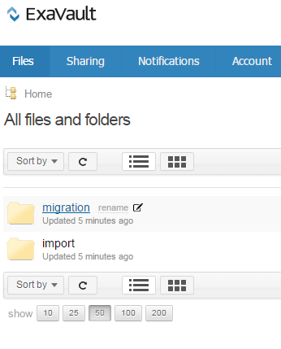
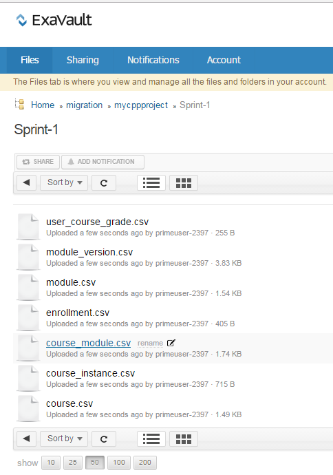
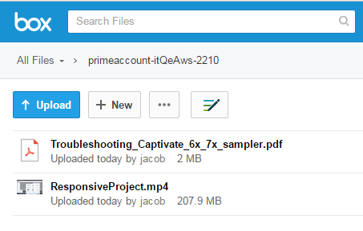
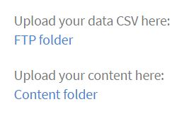
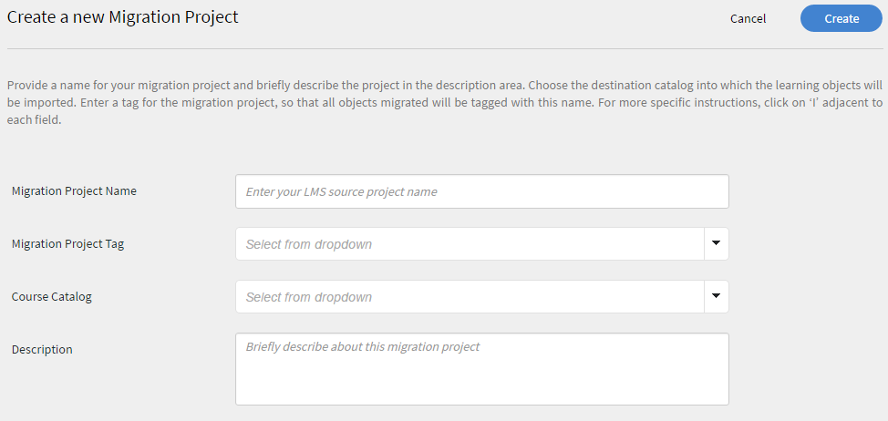
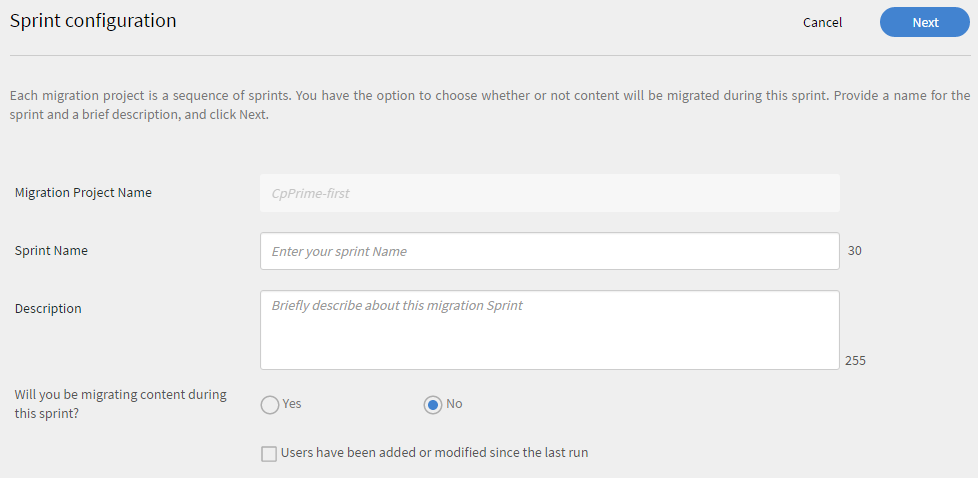
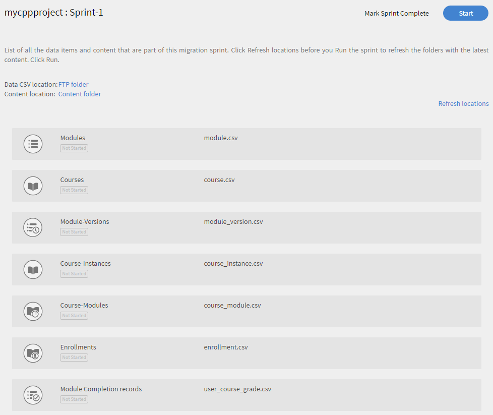
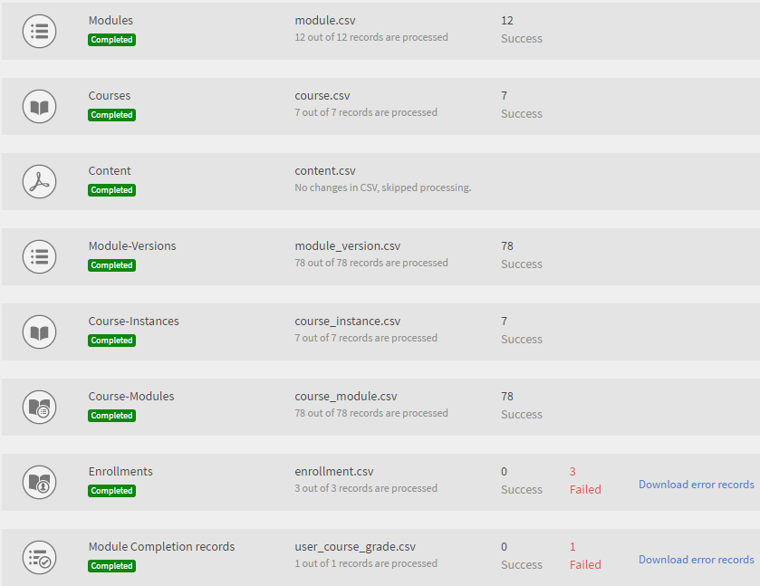
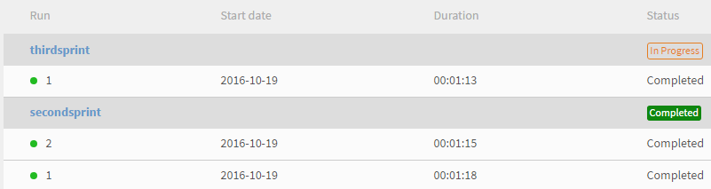

# Manual de migración

Manual de referencia para los administradores de integración que desean migrar un LMS existente al LMS de Learning Manager

<!-- ## Overview {#overview} -->

## Escenario de uso {#usagescenario}

En general, las grandes empresas tienen su LMS interno u otros sistemas de gestión de aprendizaje heredados suministrados por un proveedor. El LMS incluye datos y contenido de formación de la empresa. Como empresa, cuando adquiere Learning Manager, es posible que desee transferir los datos y el contenido de su LMS a Learning Manager para aprovechar las ventajas del LMS avanzado e intuitivo sin perder los datos antiguos de su empresa.

Learning Manager ofrece las especificaciones y las herramientas necesarias para que el administrador de integración de su empresa pueda configurar y realizar las tareas de migración.

A partir de hoy, los administradores de una empresa pueden acceder a la función Migración en Learning Manager poniéndose en contacto con el equipo de asistencia de Adobe. Para activar la función Migración en su cuenta, puede ponerse en contacto con el equipo de asistencia de Adobe Learning Manager.

## Proceso de migración {#apidescription}

En esta sección se describen los requisitos previos para la migración, los pasos clave del proceso de migración, los sprints de migración, las especificaciones y los pasos para la migración de contenido y datos:

### Aviso importante sobre migración

Debe tener en cuenta que los plazos de migración dependen en gran medida de la calidad y el tamaño de los datos. Si necesita migrar durante la incorporación, planifique esta actividad con mucha antelación y colabore estrechamente con el equipo de incorporación de Adobe Learning Manager para evitar retrasos.

### Requisitos previos {#prerequisites}

El equipo de Learning Manager espera que los administradores de la integración de su empresa realicen las tareas siguientes antes de emprender el proceso de migración:

* El administrador de integración extrae los datos y el contenido del LMS en cuestión, y transforma los datos a los formatos de archivo definidos por Learning Manager.
* Learning Manager no admite la importación de usuarios como parte del proceso de migración y espera que la empresa importe los usuarios mediante conectores. Adobe Systems espera que estos conectores estén configurados antes del proceso de migración. Para obtener más información, consulte el contenido de la [Ayuda sobre los conectores de Learning Manager](connectors.md).

Learning Manager recomienda que los administradores prueben el proceso de migración en una cuenta para tal efecto antes de migrar los datos y el contenido al entorno de producción de Learning Manager.

### Pasos clave del proceso de migración {#keystepsofmigrationprocess}

Los pasos clave que conlleva la migración de contenido y datos de un LMS a Learning Manager son los siguientes:

1. El administrador o socio de integración evalúa los datos del LMS y el contenido que se debe migrar.
1. El administrador de integración evalúa las herramientas y especificaciones que proporciona Learning Manager para la ingesta de datos y contenido.
1. El administrador de integración escribe el código o realiza un trabajo manual para exportar los datos y el contenido de formación del LMS anterior basándose en la funcionalidad proporcionada por el LMS anterior.
1. Una vez que los datos y el contenido de formación están disponibles, el administrador de integración analiza y asigna los datos y el contenido para que coincidan con las especificaciones de migración de Learning Manager.
1. El administrador de integración utiliza las herramientas proporcionadas por Learning Manager para migrar en el siguiente orden:

   1. Transferir a los alumnos a Learning Manager.
   1. Transferir contenido de formación a Learning Manager.
   1. Por último, transferir los datos de formación a Learning Manager.

La empresa puede empezar a utilizar el LMS de Learning Manager junto con el contenido heredado.

### Alcance de los objetos de la migración {#scopeofmigrationobjects}

Puede migrar contenido solo para los siguientes objetos de aprendizaje:

* Módulo
* Insignias
* Curso
* Versión del módulo
* Instancia del curso
* Módulo del curso
* Aptitudes
* Nivel de aptitud
* Curso de aptitudes
* Certificación
* Curso de certificación
* Confirmación de certificación
* Programa de aprendizaje
* Curso del programa de aprendizaje
* Instancia del programa de aprendizaje
* Instancia del curso del programa de aprendizaje
* Ayuda de trabajo
* Versión de ayuda de trabajo
* Curso de ayuda de trabajo
* Aptitudes de ayuda de trabajo
* Inscripción
* Inscripción de certificación
* Inscripción en el programa de aprendizaje
* Inscripción de ayuda de trabajo
* Calificaciones del curso del usuario

### Conceptos clave de la migración {#keyconceptsofmigration}

A continuación se describen brevemente algunos de los conceptos clave del proceso de migración de Learning Manager a fin de poderlos consultar si lo necesita en algún momento:

**Proyecto de migración**

En Learning Manager, un proyecto de migración consiste en uno o más sprints. También puede tener varios proyectos de migración para su cuenta. El proceso de migración en Learning Manager comienza con la creación de un proyecto de migración.

**Sprint**

En el proceso de migración de Learning Manager, un sprint se define como un conjunto de elementos de migración que ha decidido migrar desde el LMS actual. Un elemento de migración puede ser un módulo de curso, registros de alumnos o un conjunto de cursos. Puede tener varios elementos de datos de aprendizaje en un sprint. En cada sprint, es posible ejecutar trabajos de migración.

**Ejecuciones de sprint**

Una ejecución de sprint es el proceso de iniciar un trabajo de migración de sprint. La ejecución de sprint en cualquier momento del proceso.

**Nuevas ejecuciones de sprint**

Puede volver a ejecutar un sprint de migración después de su finalización en cualquier momento. Esta situación de nueva ejecución o repetición de un sprint ocurre cuando desea agregar datos en un elemento de sprint y volverlo a migrar a la aplicación nuevamente o corregir los errores en CSV.

**Especificación en CSV**

Learning Manager proporciona un conjunto de [especificaciones CSV estándar](migration-manual.md#main-pars_header_140933605). El procedimiento recomendado es revisar estas especificaciones CSV antes de comenzar con el proceso de migración. El administrador de integración de su empresa puede analizar los formatos de datos y asignarlos para que coincidan con los elementos de la plantilla CSV proporcionados por Learning Manager.

**Etiquetas del proyecto de migración**

Adobe Systems recomienda utilizar un conjunto de palabras clave como etiquetas para identificar fácilmente sus proyectos de migración dentro de la aplicación Learning Manager. Estas etiquetas le permiten identificar sus proyectos internamente en la aplicación Learning Manager en cualquier momento.

**Módulo sin contenido**

Learning Manager le permite cargar un módulo sin contenido. Adobe Systems lo considera un módulo sin contenido en Learning Manager. En un escenario en el que desee migrar algunos de los datos heredados de su LMS sin necesidad de ningún contenido, puede cargar el archivo module_version.csv sin referencia a la URL.

## Especificaciones y ejemplos de CSV {#csv}

A continuación, encontrará las especificaciones de CSV estándar que puede usar para correlacionar con los datos de migración de LMS. Haga clic en csv-specifications y sample-csvs para descargar los archivos zip. El archivo csv-specifications.zip descargado contiene siete archivos de hojas cálculo de Excel. Dichos archivos son especificaciones con descripciones para que comprenda cómo rellenar los archivos .csv. Los archivos .csv correspondientes deben contener los datos de cada campo en el formato prescrito tal como se explica en estos archivos .xlsx.

<table border="1" cellspacing="0" cellpadding="0" width="100%">
 <tbody>
  <tr>
   <th>
    <p><b>N.º</b></p></th>
   <th>
    <p><b>Nombre de archivo</b></p></th>
   <th>
    <p><b>Descripción del contenido</b></p></th>
   <th>
    <p>Notas</p></th>
  </tr>
  <tr>
   <td>
    <p>1</p></td>
   <td>
    <p>module.xlsx</p></td>
   <td>
    <p>Metadatos para module.csv</p></td>
   <td> </td>
  </tr>
  <tr>
   <td>
    <p>2</p></td>
   <td>
    <p>badge.xlsx</p></td>
   <td>
    <p>Metadatos para badge.xlsx</p></td>
   <td> </td>
  </tr>
  <tr>
   <td>
    <p>3</p></td>
   <td>
    <p>course.xlsx</p></td>
   <td>
    <p>Metadatos para course.csv</p></td>
   <td>
    <p>Mencione un nombre de autor para un curso determinado, ya que a veces, si hay varios nombres de autor, no se muestran correctamente en la aplicación después de la migración. </p></td>
  </tr>
  <tr>
   <td>
    <p>4</p></td>
   <td>
    <p>module_version.xlsx </p></td>
   <td>
    <p>Metadatos para module_version.csv</p></td>
   <td>
    <p>Proporcione la ruta URL de la carpeta de la cuenta de Box donde cargó el contenido. </p></td>
  </tr>
  <tr>
   <td>
    <p>5</p></td>
   <td>
    <p>course_instance.xlsx</p></td>
   <td>
    <p>Metadatos para course_instance.csv </p></td>
   <td> </td>
  </tr>
  <tr>
   <td>
    <p>6</p></td>
   <td>
    <p>session.xlsx</p></td>
   <td>
    <p>Metadatos para session.csv</p></td>
   <td>
    <p>Asegúrese de que cada entrada de session.csv esté asociada al menos con un módulo de clase/clase virtual</p></td>
  </tr>
  <tr>
   <td>
    <p>7</p></td>
   <td>
    <p>course_module.xlsx</p></td>
   <td>
    <p>Metadatos para course_module.csv</p></td>
   <td> </td>
  </tr>
  <tr>
   <td>
    <p>8</p></td>
   <td>
    <p>skill.xlsx</p></td>
   <td>
    <p>Metadatos para skill.csv</p></td>
   <td> </td>
  </tr>
  <tr>
   <td>
    <p>9</p></td>
   <td>
    <p>skill_level.xlsx</p></td>
   <td>
    <p>Metadatos para skill_level.csv</p></td>
   <td> </td>
  </tr>
  <tr>
   <td>
    <p>10</p></td>
   <td>
    <p>skill_course.xlsx</p></td>
   <td>
    <p>Metadatos para skill_course.csv</p></td>
   <td> </td>
  </tr>
  <tr>
   <td>
    <p>11</p></td>
   <td>
    <p>certification.xlsx</p></td>
   <td>
    <p>Metadatos para Certification.csv</p></td>
   <td> </td>
  </tr>
  <tr>
   <td>
    <p>12</p></td>
   <td>
    <p>certification_course.xlsx</p></td>
   <td>
    <p>Metadatos para certification_course.csv</p></td>
   <td> </td>
  </tr>
  <tr>
   <td>
    <p>13</p></td>
   <td>
    <p>certification_commit.xlsx</p></td>
   <td>
    <p>Metadatos para certification_commit.csv</p></td>
   <td> </td>
  </tr>
  <tr>
   <td>
    <p>14</p></td>
   <td>
    <p>learning_program.xlsx</p></td>
   <td>
    <p>Metadatos para learning_program.csv</p></td>
   <td> </td>
  </tr>
  <tr>
   <td>
    <p>15</p></td>
   <td>
    <p>learning_program_course.xls </p></td>
   <td>
    <p>Metadatos para learning_program_course.csv </p></td>
   <td> </td>
  </tr>
  <tr>
   <td>
    <p>16</p></td>
   <td>
    <p>learning_program_instance.xlsx </p></td>
   <td>
    <p>Metadatos para learning_program_instance.csv</p></td>
   <td> </td>
  </tr>
  <tr>
   <td>
    <p>17</p></td>
   <td>
    <p>learning_program_instance_course_instance.xlsx </p></td>
   <td>
    <p>Metadatos para learning_program_instance_course_instance.csv</p></td>
   <td> </td>
  </tr>
  <tr>
   <td>
    <p>18</p></td>
   <td>
    <p>job_aid.xlsx</p></td>
   <td>
    <p>Metadatos para job_aid.csv</p></td>
   <td>
    <p>Cada job_aid migrado debe tener una o más versiones de job_aid.</p></td>
  </tr>
  <tr>
   <td>
    <p>19</p></td>
   <td>
    <p>Job_aid_version.xlsx</p></td>
   <td>
    <p>Metadatos para job_aid_version.csv</p></td>
   <td> </td>
  </tr>
  <tr>
   <td>
    <p>20</p></td>
   <td>
    <p>job_aid_course.xlsx</p></td>
   <td>
    <p>Metadatos para job_aid_course.csv</p></td>
   <td> </td>
  </tr>
  <tr>
   <td>
    <p>21</p></td>
   <td>
    <p>job_aid_skills.xlsx</p></td>
   <td>
    <p>Metadatos para job_aid_skills.csv</p></td>
   <td> </td>
  </tr>
  <tr>
   <td>
    <p>22</p></td>
   <td>
    <p>enrollments.xlsx</p></td>
   <td>
    <p>Metadatos para enrollments.csv</p></td>
   <td> </td>
  </tr>
  <tr>
   <td>
    <p>23</p></td>
   <td>
    <p>certification_enrollement.xlsx</p></td>
   <td>
    <p>Metadatos para certification_enrollement.csv</p></td>
   <td> </td>
  </tr>
  <tr>
   <td>
    <p>24</p></td>
   <td>
    <p>learning_program_enrollment.xlsx</p></td>
   <td>
    <p>Metadatos para learning_program_enrollment.csv<br><br></p></td>
   <td> </td>
  </tr>
  <tr>
   <td>
    <p>25</p></td>
   <td>
    <p>job_aid_enrollment.xlsx</p></td>
   <td>
    <p>Metadatos para job_aid_enrollment.csv</p></td>
   <td> </td>
  </tr>
  <tr>
   <td>
    <p>26</p></td>
   <td>
    <p>user_course_grade.xlsx</p></td>
   <td>
    <p><br>
      Metadatos para user_course_grade.csv</p></td>
   <td>
    <p>Proporcione los datos necesarios de registros de alumnos en el archivo .csv aunque no sean obligatorios. Sin esta información, aunque el archivo .csv se procese para la migración, es posible que la aplicación Learning Manager no refleje ningún dato. El archivo sample-csvs.zip contiene siete archivos .csv con una convención de nomenclatura similar a la anterior.</p></td>
  </tr>
  <tr>
   <td>
    <p>27</p></td>
   <td>
    <p>user_skill.xlsx</p></td>
   <td>
    <p><br>
      Metadatos para user_skill.csv</p></td>
   <td>
    <p> </p></td>
  </tr>
 </tbody>
</table>

Learning Manager admite valores de fecha y hora solo en formato UTF 8 y de 32 bits. Es posible que aparezcan errores durante la migración si menciona la fecha en archivos CSV con una fecha fuera de rango, como 2038-07-17T08:53:21.000Z o 1980-04-17T08:13:25.322Z.

* [sample-csvs.zip](assets/sample-csvs.zip)
* [csv_specifications.zip](assets/csv-specifications.zip)

Debe tener en cuenta las siguientes dependencias en los archivos .csv durante la importación:

* module_version.csv depende de module.csv
* course_instance.csv depende de course.csv
* course_module.csv depende de course.csv, module.csv y module_version.csv
* course_instance.csv depende de course.csv
* session.csv depende de course.csv y module.csv
* enrollment.csv depende de course.csv
* user_course_grade.csv depende de course.csv y module.csv
* skill_course.csv depende de course.csv
* skill_level.csv depende de skill.csv
* learning_program_instance.csv depende de learning_program y learning_program_course.csv
* learning_program_course.csv depende de learning_program.csv
* learning_program_enrollment.csv depende de learning_program y learning_program_instance.csv
* learning_program_instance_course_instance.csv depende de learning_program.csv, learning_program_instance.csv y course_instance.csv.
* certification_course.csv depende de certification.csv y course.csv
* certification_commit.csv depende de certification.csv y certification_course.csv
* certification_enrollment.csv depende de certification.csv, certification_course.csv y certification_enrollment.csv

### Orden del curso del programa de aprendizaje en archivos CSV de migración

En versiones anteriores de las especificaciones de migración, el archivo learning_program_course.csv incluía una columna de orden, lo que sugiere que se pueda controlar la secuencia de cursos dentro de un programa de aprendizaje durante la migración.

Adobe Learning Manager ya no utiliza esta columna. El orden de los cursos en un programa de aprendizaje no se puede controlar mediante archivos CSV de migración y el sistema omite los valores proporcionados en la columna del orden, aunque se haya establecido **orderEnforced** en true.

Para evitar confusiones, la columna de orden se ha eliminado de las especificaciones oficiales del archivo CSV. Si tiene secuencias de comandos o herramientas existentes que aún generan esta columna, puede quitarla sin problemas; no afecta a la forma en que se crean o muestran los programas de aprendizaje.

## Proceso de migración {#migrationprocedure}

Antes de comenzar el procedimiento de migración, es importante tener en cuenta los siguientes puntos:

* Solo puede haber un proyecto de migración activo en una cuenta en cualquier momento dado. Dentro de un proyecto, solo puede haber un sprint activo en cualquier momento dado.
* No puede deshacer una ejecución que ya está en proceso de migración. Sin embargo, puede usar la opción de eliminación que hay dentro de cada función de Learning Manager para deshacer cualquier migración de datos o contenido.
* Tan pronto como se inicia el proyecto de migración, pasa al estado &quot;En proceso de migración&quot;. Durante la migración, la función de administrador de integración es la única que puede iniciar sesión en Learning Manager.

### Crear cuentas de FTP y Box {#creatingftpandboxaccounts}

Es muy importante planificar el proyecto de migración. Se recomienda dividir los proyectos en varios sprints e identificar claramente lo que se desea migrar en cada sprint. Incluso puede ser buena idea hacer una validación después de cada sprint para tener seguridad sobre los datos migrados en ese sprint, en lugar de una validación a gran escala al final del proyecto. Antes de comenzar el sprint como parte del proyecto de migración, debe cargar archivos CSV de datos y contenido en servidores de FTP y Box, respectivamente. Si no tiene cuentas para FTP y Box personalizados, puede crearlas.

<!--**Create FTP account**-->

<!--
Click **[!UICONTROL Request for CSV FTP folder]**. A pop-up dialog appears prompting you to enter your e-mail id. Go through online instructions and create an FTP account. As soon as you create your account, you can view your migration project and sprint project folders in FTP. 

A sample snapshot of project files and folder of FTP is shown below for your reference. 
-->

<!---->

**Crear una cuenta de Box**

Cree una carpeta de carga de contenido en un proceso similar al de la creación de la carpeta FTP. Haga clic en Migración en el panel izquierdo; a continuación, haga clic en Solicitar una carpeta de carga de contenido en la parte inferior de la página que se abre.

Recibirá un correo de Box con un vínculo a la carpeta compartida. Si no tiene ninguna cuenta de Box, haga clic en Registrar y cree una. Las instrucciones de inicio de sesión se envían al ID de correo electrónico del administrador de la integración.

**Cargar datos (archivos .csv) en carpetas de FTP o de Box**

Crear una cuenta de FTP o de Box es un requisito previo para la creación de un proyecto de migración. Por lo tanto, en esta fase puede crear un proyecto de migración y un sprint en la aplicación Learning Manager.  Consulte la sección **Procedimiento de migración de datos y contenido** en esta página para crear el proyecto de migración.

En la cuenta de FTP o de Box, haga clic en el nombre de la carpeta del proyecto y haga clic en el nombre del sprint. Dentro de la carpeta de sprints, puede cargar los archivos de datos .csv que desea migrar. Para cargar, haga clic en el botón Cargar archivos en la parte superior del servidor FTP o Box y suelte los archivos .csv. A continuación se muestra una captura de pantalla de ejemplo después de cargarla en FTP como referencia.

<!---->

Puede volver al proyecto de migración de Learning Manager, hacer clic en **[!UICONTROL Actualizar]** y ver todos los tipos de datos .csv que se enumeran para el sprint de migración.

**Cargar contenido de formación en las carpetas de contenido**

Suba el contenido de formación del LMS a su cuenta de Box. Si ya ha creado el proyecto de migración y el sprint, la cuenta de Box rellena el proyecto de migración y el nombre de sprint. Puede cargar el contenido en la misma ruta. Consulte la sección **Procedimiento de migración de datos y contenido** en esta página para crear el proyecto de migración.

Puede arrastrar y soltar los archivos de contenido, o bien hacer clic en **[!UICONTROL Cargar]** y seleccionar los archivos en el escritorio. Si el tamaño del archivo de su contenido es muy grande, puede experimentar algún retraso en la carga de los archivos. El tiempo necesario para cargar los archivos en la cuenta de Box varía según el tamaño que tenga el archivo.

A continuación se muestra una captura de pantalla de la cuenta de Box después de subir contenido:



*Archivos en la cuenta de Box*

Una vez que los archivos se cargan en su cuenta de Box, asegúrese de mencionar la ruta relativa de este archivo de contenido de Box en el archivo module_version.csv. Es un paso obligatorio para que indique la ruta del contenido del módulo.

Después de iniciar sesión en los servidores de FTP y Box y de cargar el contenido, las ubicaciones de CSV aparecen como se muestra en la captura siguiente en Learning Manager.



*Ubicaciones CSV en la cuenta de Box*

## Migración de alternativas y equivalentes

### Información general

En este tema se describe el modelo de datos basado en CSV y el comportamiento de la migración para introducir la equivalencia de objetos de aprendizaje (LO) en el sistema.

### Archivos CSV existentes (contexto)

Estos archivos CSV ya existen en la plataforma y proporcionan el objeto de aprendizaje principal, el módulo y el contexto de finalización (lista no exhaustiva):

* user_course_grade.csv
* moduleversion
* module.csv
* course.csv
* course_module.csv

Estos archivos se siguen utilizando tal cual y no se modifican con la nueva función de equivalencia, sino que forman los datos subyacentes sobre los que funcionará la equivalencia.

### Nuevos archivos CSV para alternativas

Se han introducido dos nuevos archivos CSV para admitir las relaciones de alternativas de objetos de aprendizaje y las finalizaciones de usuarios relacionadas.

#### &#x200B;1. equivalence_relations.csv

Define asignaciones de equivalencia entre objetos de aprendizaje (LO) de origen y destino, que pueden ser cursos o rutas de aprendizaje (LP).

**Esquema:**

* sourceId
* sourceloType (curso/programa de aprendizaje)
* targetId
* targetLotype (course / LP)
* dateCreated
* relationStatus (ACTIVO/DELETE)
* dateModified

**Propósito:**

* Representa una relación de equivalencia entre dos objetos de aprendizaje.
* relationStatus controla si la relación está activa o eliminada actualmente.
* dateCreated y dateModified admiten la auditoría.

#### equivalence_user_completed.csv

Captura la información de finalización a nivel de usuario para objetos de aprendizaje equivalentes, alineados con las relaciones definidas en equivalence_relations.csv.

**Esquema:**

* userId
* sourceId
* sourceloType (curso/programa de aprendizaje)
* targetId
* targetLotype (course / LP)
* dateCompleted

**Propósito:**

* Registra explícitamente las **finalizaciones de objetos de aprendizaje de destino** que se deben inferir para un usuario en función de la relación de equivalencia y la finalización de objetos de aprendizaje de origen existente.
* Actúa como **origen autorizado** para las finalizaciones de usuarios vinculadas a datos equivalentes migrados.

### Reglas de migración y semántica del comportamiento

#### &#x200B;1. No hay compatibilidad de reconversión para archivos CSV nuevos equivalentes

* Todos los datos relacionados con la equivalencia deben introducirse mediante la migración.
* El sistema no admitirá escenarios en los que:
  * Los datos de objetos de aprendizaje (cursos/programas de aprendizaje) se crearon a través de la interfaz de usuario y
  * Las relaciones de equivalencia se importan posteriormente solo mediante CSV.

Esto significa:

* El patrón admitido es: Las definiciones de OA y sus relaciones de equivalencia se gestionan como parte de un flujo de migración coherente.
* Los flujos híbridos en los que los objetos de aprendizaje creados por la interfaz de usuario se adaptan con equivalencia de solo CSV no son compatibles.

#### &#x200B;2. Sin finalizaciones o infinalizaciones retroactivas de relaciones migradas

Cuando se introduce una relación de equivalencia mediante migración (es decir, mediante equivalence_relations.csv):

* El sistema no realizará cálculos retroactivos de finalización o infinalización basados únicamente en esa relación.
* En su lugar, todos los datos de finalización de usuario necesarios deben proporcionarse explícitamente mediante equivalence_user_completed.csv.

**Implicación:**

* equivalence_user_completed.csv es la única fuente de confianza para cualquier finalización que deba reconocerse en el momento de la migración como resultado de la equivalencia.
* La plataforma no intentará deducir ni rellenar las finalizaciones a partir del progreso del curso existente.

#### &#x200B;3. Comportamiento para las nuevas finalizaciones después de la migración

Si:

* Se ha creado una relación de equivalencia a través de la migración y
* Un alumno finaliza posteriormente el objeto de aprendizaje de origen (tras la migración).

a continuación:

* El sistema activará finalizaciones alternativas para el objeto de aprendizaje de destino, es decir, la equivalencia se comporta normalmente en el futuro para las finalizaciones de nuevo origen.

**Distinción de clave:**

* **En el momento de la migración:** las finalizaciones deben venir a través de equivalence_user_completed.csv.
* **Después de la migración:** la lógica de tiempo de ejecución nativo controlará finalizaciones alternativas cuando se complete un objeto de aprendizaje de origen.

#### &#x200B;4. Incidencia en objetos de aprendizaje de orden superior

Las finalizaciones alternativas que se reciben a través de CSV (es decir, a través de equivalence_user_completed.csv) activarán el nuevo cálculo de los objetos de aprendizaje de orden superior.

Los objetos de aprendizaje de orden superior pueden incluir:

* Rutas de aprendizaje

**Implicación técnica:**

* La ingesta de equivalence_user_completed.csv no es una operación &quot;silenciosa&quot;: inicia la misma lógica de cálculo o acumulación que se activaría al finalizar el tiempo de ejecución normal.
* Los sistemas que integren o programen esta migración deben planificar la carga y la temporización de los cálculos.

## Webhooks para alternativos

Cuando un alumno finaliza un curso mediante una inscripción alternativa o una relación, Adobe Learning Manager genera un evento webhook dedicado que es distinto del webhook de finalización del curso estándar, lo que permite a las integraciones aplicar una lógica de gestión diferente para finalizaciones alternativas. Los eventos Webhook también se generan para la finalización retroactiva y la finalización retroactiva, y cubren los cambios históricos en el estado del curso, incluidos los que se derivan de las actualizaciones de las relaciones, de modo que los sistemas externos permanecen sincronizados con el estado de finalización actual del alumno.

Para obtener información sobre webhooks para alternativas, vea [Webhooks para alternativas](/help/migrated/integration-admin/feature-summary/webhooks.md#webhooks-for-alternates)

## Procedimiento de migración de datos y contenido {#dataandcontentmigrationprocedure}

El procedimiento para migrar los datos y el contenido de LMS de su empresa a Learning Manager se explica a continuación:

Revise los requisitos previos del proceso de migración antes de comenzar con la migración. Consulte la sección [Especificaciones y ejemplos de CSV](migration-manual.md#main-pars_header_140933605) en esta página, y prepare los archivos .csv para la migración de datos y contenido.

1. Inicie sesión en la aplicación Learning Manager como administrador de integración y haga clic en **[!UICONTROL Migración]** en el panel izquierdo.

   Aparece la página de inicio de los proyectos de migración. Si su empresa ya ha creado proyectos de migración, puede ver la lista de todos los proyectos de migración en esta página.

1. Haga clic en **[!UICONTROL Nuevo]** en la esquina superior derecha de la página para crear un proyecto de migración. También puede hacer clic en el vínculo **[!UICONTROL Crear un proyecto de migración]** en la página para crear un proyecto de migración. Aparece la página Crear un proyecto de migración.

   Si aún no ha creado una carpeta FTP, se le pedirá que cree una carpeta FTP en la cuenta. Es un paso obligatorio para poder crear un proyecto de migración.

   
   *Crear carpeta FTP*

   Proporcione el nombre del proyecto, la etiqueta del proyecto, el catálogo del curso y la descripción de su proyecto de migración. Haga clic en **[!UICONTROL Crear]**.

   Los elementos de datos de migración se identifican utilizando esta etiqueta de proyecto de migración. Si no tiene ningún catálogo de cursos concreto, elija el catálogo predeterminado en el menú desplegable. Todos los cursos que migre utilizando un proyecto de migración se incluirán en el catálogo que elija en esta etapa. Si no elige ningún catálogo, todos los cursos migrados serán parte del catálogo predeterminado.

1. La página de configuración de sprints aparece como se muestra en la siguiente captura de pantalla. Debe crear un sprint como parte del proyecto de migración. Seleccione el nombre de sprint y escriba una breve descripción. Puede elegir Sí para migrar contenido como parte de este sprint. Haga clic en **[!UICONTROL Siguiente]**.

   
   *Migración de sprint*

   Seleccione la casilla de verificación **Se han añadido o modificado usuarios desde la última ejecución** para sincronizar la lista de usuarios con la aplicación Learning Manager. Si está migrando el contenido y los datos a la aplicación Learning Manager, esto quizá no sea necesario. Sin embargo, si transcurre un tiempo entre la migración de sprints anterior y la última, se recomienda sincronizar la lista de usuarios. Gracias a este paso, la base de datos de Learning Manager está sincronizada con los usuarios del LMS.

   Se recomienda realizar este paso de sincronización cuando se migran enrollment.csv y user_course_grade.csv. Este paso permite que la base de datos de Learning Manager esté sincronizada con su base de datos de migración y garantiza que todos los usuarios cuyos registros para migrar al sprint estén disponibles en la base de datos de migración.

1. Puede comenzar la migración del sprint con los datos y el contenido que ha cargado. Haga clic en el vínculo **[!UICONTROL Actualizar]** antes de iniciar la ejecución del sprint para sincronizar las carpetas de FTP y contenido con la aplicación Learning Manager.

   
   *Iniciar migración de sprint*

   Haga clic en **[!UICONTROL Inicio]** en la esquina superior derecha de la página. Puede hacer clic en **[!UICONTROL Detener]** en cualquier momento durante el proceso de migración del sprint para anular la migración del sprint.

   El estado de la migración se muestra en cada elemento y contenido de los datos del sprint. Compruebe la cantidad de elementos correctos y fallidos como parte de la ejecución del sprint de migración.

   Si está cargando contenido del módulo, asegúrese de que la ruta de la carpeta de contenido esté indicada en module_version.csv. Si olvida este paso, puede recibir errores durante la migración. Por ejemplo, si está cargando contenido de un módulo con ritmo personalizado, por ejemplo vídeos, debe especificar la ruta relativa de la URL de Box en module_version.csv. Para el contenido del módulo de actividad, puede especificar el nombre de la URL.

   A continuación se proporciona una captura de pantalla de ejemplo del cuadro de diálogo de progreso. Como se muestra en la captura, puede ver el número de registros procesados para cada elemento de datos de migración, junto con el estado de elementos correctos y fallidos. Haga clic en Descargar registros de errores para los elementos fallidos a fin de descargar y ver los registros de errores. Puede solucionar los errores en CSV y cargarlos de nuevo en FTP.

   
   *Ver progreso de sprint*

   Haga clic en la lista de sprints en el panel izquierdo para ver la lista de todos los sprints de un proyecto de migración. Puede ver una lista de todos los sprints, el número de ejecuciones que ejecutó para cada sprint, la fecha de inicio, la duración y el estado de finalización, como se muestra en la captura de pantalla de ejemplo a continuación.

   
   *Ver lista de sprints*

1. Después de cargar los últimos archivos .csv actualizados, puede hacer clic en Volver a ejecutar en la esquina superior derecha de la página. La nueva ejecución vuelve a procesar todos los elementos de datos y omite los elementos en los que no se haya realizado ningún cambio. Cuando esté satisfecho con la migración de los elementos de datos en un sprint, marque la migración del sprint como completada haciendo clic en el botón en la parte superior de la página. Puede comenzar un nuevo sprint con más elementos de datos más adelante. Una vez marcado un sprint como completado, no es posible volver a ejecutarlo. Asimismo, en un proyecto de migración puede tener cualquier cantidad de sprints. Cuando esté satisfecho con el estado de migración de todos los sprints, marque el proyecto de migración como completado haciendo clic en el vínculo **Marcar proyecto como completado** en la página de la lista de sprints.

   Antes de marcar el proyecto de migración como completado, debe asegurarse de haber completado todos los sprints del proyecto. Una vez que haya marcado el proyecto de migración como completado, no podrá volver atrás, crear sprints en dicho proyecto ni realizar modificaciones en él. Deberá crear otro proyecto de migración y añadirle sprints.

## Verificación de la migración {#registration}

Después de migrar los datos y el contenido de aprendizaje del LMS heredado de la empresa, puede verificar dichos datos y contenido importados utilizando diferentes funciones de los objetos de aprendizaje. Por ejemplo, puede iniciar sesión en la aplicación Learning Manager como administrador y verificar la disponibilidad de los datos y el contenido de los cursos y módulos importados.

## Migración mediante API

Adobe Learning Manager (ALM) proporciona una función de migración para ingestar datos o contenido de sistemas externos, utilizada principalmente para migrar desde plataformas de LMS anteriores.

Sin embargo, algunas organizaciones pueden requerir que este proceso se ejecute de forma regular (por ejemplo, de forma nocturna o semanal), en lugar de realizar una importación única.

Como ejemplo, verás cómo un cliente ficticio (NovaFX) se integra con un proveedor externo ficticio (SquareCorp) y automatiza las migraciones programadas. La integración permite:

* Los cursos de SquareCorp aparecen como objetos de aprendizaje en ALM para alumnos de NovaFX.
* NovaFX realiza el seguimiento del progreso de los alumnos de los cursos alojados en SquareCorp directamente en ALM.

### Requisitos de integración

SquareCorp debe proporcionar:

* Información de metadatos del curso: Una API para compartir los metadatos del curso a los que tiene acceso NovaFX.
* Información de los datos de progreso: Una API para compartir información de progreso y finalización de alumnos periódicamente.

### Definiciones clave

* **Proyecto activo:** Un proyecto está activo si está &quot;En curso&quot; o &quot;Inicializado&quot;.
* **Sprint activo:** Un sprint está activo si está &quot;En curso&quot; o &quot;Inicializado&quot;.

### Automatizar la ejecución del sprint

Cree una aplicación o script que realice lo siguiente según una programación:

1. Recupere los metadatos del curso, las inscripciones de usuarios y las calificaciones de alumnos de SquareCorp.
2. Genere los archivos CSV.
3. Cargue los archivos en Box o FTP.
4. Active el sprint mediante las API de migración.

### Detalles de API

#### Iniciar una ejecución de migración

**Extremo:** POST /primeapi/v2/bulkimport/startrun

Parámetros:

* **lockaccount (booleano):** El parámetro determina si se debe bloquear la cuenta al inicio de la ejecución. De forma predeterminada, se establece en false. Se recomienda que los usuarios eviten utilizar este parámetro a menos que haya una razón válida para bloquear la cuenta.
* **catalogid (Integer):** Este parámetro le permite seleccionar el catálogo de destino durante la migración. Normalmente se establece al crear el proyecto de migración, pero se puede ajustar para ejecuciones individuales. Cuando se cambie el catálogo, los objetos de aprendizaje añadidos en futuras ejecuciones se colocarán en el catálogo elegido más recientemente. Si es necesario volver al catálogo seleccionado durante la creación del proyecto de migración, también debe especificarse explícitamente.
* **migrationProjectId (Integer):** El parámetro es necesario para desencadenar un proyecto de migración específico cuando se habilitan varias ejecuciones habilitadas para API en la cuenta.

#### Comprobar si puede comenzar la sincronización

Asegúrese de que el contenido se pueda sincronizar con la carpeta de sprint. No copie archivos de contenido o metadatos en la carpeta FTP a menos que esta API devuelva un objeto de respuesta correcto.

**Extremo:** GET /primeapi/v2/bulkimport/cansync

Parámetros:

* **migrationProjectId (Integer)** El parámetro es necesario para desencadenar un proyecto de migración específico cuando se habilitan varias ejecuciones habilitadas para API en la cuenta.

<b>Respuesta correcta</b>

```
{  
    "status": "OK",  
    "title": "BULKIMPORT_CAN_SYNC_NOW",  
    "source": {  
        "info": "Yes"  
    }  
} 
```

<b>Respuesta correcta</b>

```
{ 
    "status": "BAD_REQUEST", 
    "title": "BULKIMPORT_ERROR_CANNOT_SYNC", 
    "source": { 
        "info": "Error, No active projects" 
    } 
} 
```

<b>Posibles respuestas de API</b>

| Acción | Tipo | Mensaje |
| ------------------------------------- | ------- | ------------------------------------------------------------------------------------- |
| BULKIMPORT_RUN_INITIATED_SUCCESSFULLY | Correcto | Ejecución iniciada correctamente |
| BULKIMPORT_ERROR_CANNOT_INITATE_RUN | Error | Una ejecución está en curso |
| BULKIMPORT_ERROR_CANNOT_INITATE_RUN | Error | Hay más de un proyecto activo |
| BULKIMPORT_ERROR_CANNOT_INITATE_RUN | Error | Hay más de un sprint |
| BULKIMPORT_ERROR_CANNOT_INITATE_RUN | Error | No hay proyectos activos |
| BULKIMPORT_ERROR_CANNOT_INITATE_RUN | Error | Sin sprints activos |
| BULKIMPORT_ERROR_CANNOT_INITATE_RUN | Error | El catálogo proporcionado no es un identificador válido o no pertenece a la cuenta principal |
| BULKIMPORT_CAN_SYNC_NOW | Información | Puede sincronizar ahora |
| BULKIMPORT_ERROR_CANNOT_SYNC | Error | Una ejecución está en curso |
| BULKIMPORT_ERROR_CANNOT_SYNC | Error | Hay más de un proyecto activo |
| BULKIMPORT_ERROR_CANNOT_SYNC | Error | Hay más de un sprint |
| BULKIMPORT_ERROR_CANNOT_SYNC | Error | No hay proyectos activos |
| BULKIMPORT_ERROR_CANNOT_SYNC | Error | Sin sprints activos |
| BULKIMPORT_ERROR_CANNOT_SYNC | Error | No hay archivos válidos en la carpeta |

### Ejemplo de flujo de integración

1. Compruebe la API cansync.
2. Genere y cargue archivos CSV.
3. Active el sprint con la API startrun.
4. Supervisar la respuesta y controlar los errores.

### limitaciones

Las API de migración no proporcionan funcionalidad para comprobar los errores relacionados con la migración directamente en el archivo CSV de salida después de la ejecución del sprint. Sin embargo, estos errores se pueden revisar como filas dentro del archivo CSV accediendo a la interfaz de usuario del administrador de integración después de una ejecución de sprint.

### Verificación de la migración mediante API

La API de migración, `runStatus`, permite a los administradores de integración realizar un seguimiento del progreso de las ejecuciones de migración desencadenadas a través de la API.

La API `runStatus` también proporciona un vínculo directo para descargar registros de errores en formato CSV para las ejecuciones completadas. El vínculo de descarga permanece activo durante siete días y los registros se conservan durante un mes.

**Curl de muestra**

**Punto final**

```
GET /bulkimport/runStatus
```

**Parámetros**

* **migrationProjectId**: (Obligatorio). Identificador único de un proyecto de migración. Un proyecto de migración se utiliza para transferir datos y contenido de un sistema de gestión de aprendizaje (LMS) existente a Adobe Learning Manager. Cada proyecto de migración puede constar de varios sprints, que son unidades más pequeñas de tareas de migración.

* **sprintId**: (Obligatorio). Identificador único de un sprint dentro de un proyecto de migración. Un sprint es un subconjunto de tareas de migración que incluye elementos de aprendizaje específicos (por ejemplo, cursos, módulos o registros de alumnos) que se migran de un LMS existente a Adobe Learning Manager. Cada sprint se puede ejecutar de forma independiente, lo que permite la migración por fases.

* **sprintRunId**: (Obligatorio). Identificador único utilizado para hacer un seguimiento de la ejecución de un sprint específico dentro de un proyecto de migración. Se asocia con el proceso de migración real de los elementos definidos en un sprint. El sprintRunId ayuda a supervisar, solucionar problemas y administrar el trabajo de migración.

**Respuesta**

```
{
  "sprintId": 2510080,
  "sprintRunId": 2740845,
  "migrationProjectId": 2509173,
  "startTime": 1746524711052,
  "endTime": 1746524711052,
  [
    {
      "id": 2609923,
      "lastHeartbeatTime": 1746524711052,
      "objectName": "content",
      "jobState": "COMPLETED",
      "errorCsvLink": "",
      "errorLogLink": "migration/5830/2509173/2510080/2740845/content_err.csv",
      "sequenceNumber": 1
    },
    {
      "id": 2609922,
      "lastHeartbeatTime": 1746524713577,
      "objectName": "course",
      "jobState": "WAITING_IN_QUEUE",
      "errorCsvLink": "",
      "errorLogLink": null,
      "sequenceNumber": 2
    }
  ]
}
```

Además, la respuesta de API `startRun` ahora incluye el id. del proyecto de migración, el id. de sprint y el id. de ejecución de sprint, que son necesarios para consultar el nuevo extremo de estado.

```
curl -X GET --header 'Accept: text/html' 'https://learningmanager.adobe.com/primeapi/v2/bulkimport/runStatus?migrationProjectId=001&sprintId=10001&sprintRunId=7'
```

Produce la siguiente respuesta. La respuesta contiene:

* `migrationId`
* `sprintId`
* `sprintRunId`

**Respuesta**

```
{
  "status": "OK",
  "title": "BULKIMPORT_RUN_INITIATED_SUCCESSFULLY",
  "source": {
    "info": "Success",
    "migrationInfo": {
      "migrationProjectId": "001",
      "sprintId": "10001",
      "sprintRunId": "7"
    }
  }
}
```

## Readaptación de la migración {#retrofittinginmigration}

Esta función de integración le permite adaptar datos históricos para un objeto de aprendizaje de un sistema de gestión de aprendizaje antiguo a un curso activo que se crea en Learning Manager.

A continuación, encontrará las especificaciones de CSV estándar que puede usar para correlacionar con los datos de migración de LMS. Haga clic en csv-specifications y sample-csvs para descargar los archivos zip. El archivo csv-specifications.zip descargado contiene cuarto archivos de hojas de cálculo de Excel. Dichos archivos son especificaciones con descripciones para que comprenda cómo rellenar los archivos .csv. Los archivos .csv correspondientes deben contener los datos de cada campo en el formato prescrito tal como se explica en estos archivos .xlsx.

1-enrollment.xlsx-contiene descripciones de los metadatos requeridos para el archivo retrofit_enrollment.csv.

2-certification_enrollment.xlsx-contiene descripciones de los metadatos requeridos para el archivo retrofit_certification_enrollment.csv.

3-learning_program_enrollment.xlsx-contiene descripciones de los metadatos requeridos para el archivo retrofit_learning_program_enrollment.csv.

4-user_course_grades.xlsx-contiene descripciones de los metadatos necesarios para el archivo retrofit_user_course_grades.csv.
[csv-specifications.zip](assets/csv-specifications.zip)

>[!NOTE]
>
>El UUID (Universally Unique Id) también es una columna en el archivo .csv de migración.


## Solución de problemas de migración {#troubleshootingmigrationissues}

Consulte este [artículo](../../kb/troubleshooting-migration.md) para obtener información sobre la solución a los problemas a los que se enfrentan los administradores de integración al migrar datos y contenido de su LMS existente a la aplicación Learning Manager.

## Consejos para la administración de usuarios {#usermanagement}

En este tema, encontrará algunos consejos para comprender cómo se consideran y administran los usuarios en Learning Manager. Estos conceptos le ayudarán a administrar mejor los usuarios utilizando la importación de CSV, los conectores y las funciones de migración de Learning Manager.

## ID de Learning Manager {#captivateprimeids}

Learning Manager proporciona dos tipos de ID únicos para los usuarios:

* Identificación de correo electrónico
* UUID (identificador único universal)

Learning Manager admite UUID para ofrecer flexibilidad a las empresas en el control de las cuentas de usuarios. Como administrador, si tiene UUID de usuarios en una cuenta, puede modificar los ID de correo electrónico de los usuarios de esa cuenta.

**Escenario de uso de UUID en una empresa**

Supongamos que un empleado A se une a una empresa denominada Learning Manager como contratista. Durante el período de contrato, es posible que la empresa de Learning Manager no proporcione el ID de correo electrónico de la empresa como `A@example.com`. En su lugar, la empresa puede considerar solo la cuenta de correo electrónico personal del empleado, por ejemplo, `A@gmail.com`. Después de completar 6 meses del período de contrato, si el mismo empleado A se une a Learning Manager como empleado a tiempo completo, es posible que Learning Manager desee cambiar su ID de correo electrónico a su ID de correo electrónico de empresa: `A@example.com`.

Tener acceso UUID a la cuenta de usuario beneficiará a la empresa Learning Manager en la hipótesis mencionada anteriormente. La empresa Learning Manager puede reemplazar fácilmente la identificación de correo electrónico personal del empleado A con una identificación de correo electrónico oficial. Este cambio no afectará a los registros del empleado correspondientes a esta cuenta.

## Identificación de usuario único {#singleuseridentification}

Learning Manager identifica y recuerda cómo se le añade un usuario único, por ejemplo mediante el registro automático, cargando un archivo .csv o añadiendo un solo usuario mediante la interfaz de usuario o una API.

* Si se añade un solo usuario mediante la interfaz de usuario (IU) o una API, puede eliminar ese tipo de usuarios individuales mediante la interfaz de usuario o la API.
* Puede actualizar usuarios individuales utilizando el proceso de carga de CSV, pero debe recordar que estos usuarios únicos se tratan como usuarios CSV y se aplican los flujos de trabajo CSV a dichos usuarios.

## Asignar la función de responsable {#assigningmanagerrole}

No puede asignar una función de responsable directamente a ningún usuario en Learning Manager. Un usuario X puede convertirse en responsable de Learning Manager solo cuando establece un atributo de responsable de cualquier usuario (por ejemplo, Y) en esa cuenta como X.

En el supuesto de que X es el responsable de los usuarios, por ejemplo A, B y C, si X abandona la empresa, debe asegurarse de que el atributo Responsable de A, B y C esté configurado en el nuevo responsable. Una alternativa es establecer el atributo Responsable de estos usuarios como ROOT temporalmente y asignar el nuevo nombre de responsable más adelante.

Para obtener más información sobre este tema, consulte el siguiente contenido de la Ayuda:

* [Preguntas más frecuentes sobre la carga de CSV](/help/migrated/administrators/feature-summary/add-users-user-groups.md#bulk-upload-internal-users/)
* [Ayuda sobre la función de añadir usuarios](/help/migrated/administrators/feature-summary/add-users-user-groups.md)

## Cambios en la API

La versión de abril de 2026 de Adobe Learning Manager ofrece mejoras específicas en la API pública en las áreas de alternativas y equivalentes, acceso a contenido con ventana de tiempo, intentos de cuestionario basados en contenido, experiencias de alumno sin sesión iniciada y administración de ayudas de trabajo. Estas actualizaciones están diseñadas para seguir siendo en gran medida compatibles con versiones anteriores, al tiempo que permiten patrones de integración más precisos y ampliables.

Para ver los cambios de la API, vea [Cambios de la API](/help/migrated/api-changes-alm.md).

## Migración de la sesión VILT a Adobe Learning Manager {#migrationofviltsessiontoalm}

Adobe Learning Manager admite la migración en bloque y la actualización de los datos de sesión de formación virtual con instructor (VILT) a través de archivos CSV. Utilice este flujo de trabajo para configurar las fechas de inicio de las instancias, asociar instancias de rutas de aprendizaje a instancias de cursos y configurar sesiones de clase virtual para Microsofts Teams, Adobe Connect y Zoom.

>[!NOTE]
>
>Los Id. de columna de todos los archivos CSV de migración ahora utilizan el prefijo alm, por ejemplo, `almCourseID` y `almModuleID`. Esto reemplaza el prefijo principal heredado utilizado en las versiones anteriores.

### Migración de sesión VILT basada en CSV

La migración a Adobe Learning Manager permite a los administradores crear o actualizar contenido de aprendizaje en bloque mediante archivos CSV estructurados. Puede aplicar estos flujos de trabajo de CSV tanto a los cursos de migración (contenido importado de un sistema externo) como a los cursos de adaptación (contenido creado directamente en la aplicación del autor de ALM).

En la migración de la sesión VILT participan cuatro archivos CSV:

* **CSV de instancias de cursos:** crea o actualiza instancias de cursos, incluidas las fechas de inicio
* El archivo CSV de instancias de aprendizaje **LP:** crea o actualiza instancias de rutas de aprendizaje, incluidas fechas de inicio
* El archivo CSV **LP a la asociación de instancia de curso:** asigna una instancia de ruta de aprendizaje a una instancia de curso específica
* El archivo CSV de sesión **1&rbrace; crea sesiones de clase virtual con detalles del sistema de conferencia**

Descargue los archivos anteriores [aquí](assets/csv-and-xlsx-migration-files.zip).

Los cuatro archivos CSV aceptan `almCourseID` para hacer referencia a cursos y `almModuleID` para hacer referencia a módulos. Estos ID son los identificadores únicos asignados por ALM cuando se crea un curso o módulo.

### Establezca la fecha de inicio para las instancias de cursos y rutas de aprendizaje

Utilice **Course Instance CSV** y **LP Instance CSV** para agregar o actualizar la fecha de inicio en una instancia. Esto se aplica tanto a las instancias creadas por la migración como a las creadas por la interfaz de usuario (adaptación).

**CSV de instancias de cursos: Agregar una fecha de inicio**

1. Abra el archivo CSV de instancias de cursos.
2. Agregue la columna `startDate` si aún no está presente.
3. Introduzca la fecha de inicio de cada fila de instancia en formato AAAA-MM-DD.
4. Rellene la columna `almCourseID` con el ID del curso de ALM para el curso que desea actualizar.
5. Cargue el archivo CSV a través de la ejecución de la migración.

CSV de instancias de **LP: Agregar una fecha de inicio**

1. Abra el archivo CSV de instancias de LP.
2. Agregue la columna `startDate` si aún no está presente.
3. Introduzca la fecha de inicio de cada fila de instancia en formato AAAA-MM-DD.
4. Rellene la columna `almLearningProgramID` con el ID de ruta de aprendizaje de ALM.
5. Cargue el CSV a través de la ejecución de migración en.

>[!NOTE]
>
>La columna `startDate` es opcional. Si lo incluye, el valor debe ser anterior a `completionDate`. Las filas donde `startDate` es posterior a `completionDate` generarán un error y aparecerán en la migración.

### Asociación de instancias de rutas de aprendizaje con instancias de cursos

Utilice el CSV de asociación de LP a instancia de curso para vincular una instancia de ruta de aprendizaje a una instancia de curso específica. Este paso es necesario para los cursos VILT que forman parte de una ruta de aprendizaje.

1. Abra el archivo CSV del programa de aprendizaje a la asociación de instancias de cursos.
2. Para cada fila, rellene las siguientes columnas:
a. `almLearningProgramID`: el ID de la ruta de aprendizaje de ALM
b. `almLearningProgramInstanceID`: el ID de instancia de ruta de aprendizaje ALM
c. `almCourseID`: el ID del curso de ALM
d. `almCourseInstanceID`: el ID de instancia del curso de ALM
3. Cargue el archivo CSV a través de la ejecución de la migración.

### Escenarios de asociación admitidos

No se admiten todas las combinaciones de orígenes de migración y adaptación. Consulte la siguiente tabla antes de crear el archivo CSV.

| Origen de ruta de aprendizaje | Origen de instancia del curso | Admitido |
|-----------------------------|-------------------------------|-----------|
| Migración | Migración | Sí |
| Readaptación (creada en la interfaz de usuario) | Readaptación (creada en la interfaz de usuario) | Sí |
| Migración | Readaptación (creada en la interfaz de usuario) | No |
| Readaptación (creada en la interfaz de usuario) | Migración | No |

>[!NOTE]
>
>Si necesita asociar una instancia de ruta de aprendizaje de adaptación a una instancia de curso de migración (o viceversa), añada el curso a la ruta de aprendizaje directamente a través de la aplicación de autor de ALM en lugar de utilizar este CSV.

### Configurar detalles de sesiones de clase virtual

Use el archivo **CSV de sesiones** para crear o actualizar sesiones VILT con detalles de conferencia de clase virtual. Se han añadido cuatro columnas al CSV de sesiones para admitir esto:

| Columna | Descripción |
|--------------|-------------------------------------------------------|
| `almCourseID ` | ID de ALM del curso |
| `almModuleID` | ID de ALM del módulo |
| `metadata` | Objeto JSON que contiene la configuración específica del sistema VC |
| `meetingID` | Id. de reunión del sistema de clase virtual externo |

### Formato de metadatos por sistema de conferencia

El campo `metadata` acepta un objeto JSON. La estructura varía según el sistema de conferencia. Todos los nombres de clave **distinguen mayúsculas de minúsculas y deben usar camelCase** exactamente como se muestra.

**Microsofts Teams**

```
{
  "organizerEmail": "user@example.com",
  "coOrganizerEmail": "user2@example.com",
  "lobbyBypass": true,
  "isCompletionCriteria": false
}
```

Todos los campos de metadatos de Teams son opcionales. Si no proporciona `organizerEmail`, ALM utiliza el correo electrónico del administrador de equipos configurado en su cuenta de ALM como organizador predeterminado.

**Adobe Connect**

```
{
  "primaryInstructor": "instructor@example.com",
  "persistentRoom": true,
  "templateID": "template-id-value"
}
```

El campo `primaryInstructor` es **obligatorio** para las sesiones de Adobe Connect. Todos los demás campos son opcionales. Puede proporcionar `persistentRoom` o `templateID`, si proporciona `templateID`, ALM crea la sala utilizando esa plantilla.

**Zoom**

El zoom no requiere un objeto JSON de metadatos. Pase el instructor de sesión mediante la columna instructor estándar del CSV de sesiones.

### Cargar el archivo CSV de sesión

1. Abra el archivo CSV de sesión.
2. Añada las cuatro nuevas columnas: almCourseID, almModuleID, metadatos e MeetingID.
3. Para cada fila de sesión, rellene almCourseID y almModuleID con los ID de ALM del curso y el módulo.
4. Añada el ID de la reunión desde el sistema de clase virtual (Teams, Adobe Connect o Zoom).
5. Cree el objeto JSON de metadatos utilizando el formato del sistema de conferencias.
6. Asegúrese de que todos los nombres de claves JSON utilicen la ortografía exacta de camelCase. Una carcasa incorrecta provoca un error en la fila.
7. Cargue el archivo CSV a través de la ejecución de la migración.

Solucionar errores comunes de migración

| Problema | Solución |
|-------|----------|
| Errores de fila con &quot;La fecha límite de finalización debe ser mayor que la fecha de inicio&quot; | Asegúrese de que `startDate` es anterior a `completionDate` en el archivo CSV de instancias. |
| Error de asociación de LP a instancia de curso | Confirme que tanto la ruta de aprendizaje como la instancia del curso se crearon a través del mismo origen (migración o adaptación de ambos). No se admiten orígenes mixtos. |
| La fila de la sesión falla con un error de metadatos | Compruebe que todos los nombres de clave JSON del campo `metadata` utilizan exactamente camelCase. Las claves distinguen entre mayúsculas y minúsculas. |
| Los equipos `isCompletionCriteria` no tienen ningún efecto | El indicador de la función de criterios de finalización para equipos debe habilitarlo el administrador de la cuenta de ALM para que los valores de migración surtan efecto. |
| Se ha creado la fila de sesión pero el campo del instructor está vacío | Si el correo electrónico del instructor proporcionado no coincide con un usuario de ALM, la sesión se crea con un campo de instructor vacío. Verifique que el correo electrónico del instructor exista en ALM antes de cargar. |

## Migrar módulos LTI {#migrationofltimodules}

### Información general

La migración LTI amplía el flujo de trabajo de migración existente y no requiere archivos de migración adicionales. Los registros de asociación de cursos, módulos y módulos existentes siguen utilizando el formato de migración estándar. La información específica de LTI se suministra a través de los datos de la versión del módulo.

### Usar archivos para la migración a LTI

Los módulos LTI se migran utilizando los archivos de migración estándar.

Los siguientes archivos siguen utilizando el formato de migración existente:

* course.csv
* module.csv
* course_module.csv

No se requieren campos específicos de LTI en estos archivos. Las opciones específicas de LTI se configuran en el archivo `module_version.csv`.

### Configurar una versión del módulo LTI

Utilice el archivo `module_version.csv` para definir las propiedades de una versión de módulo LTI.

Además de los campos existentes admitidos en `module_version.csv`, Adobe Learning Manager admite valores y atributos específicos de LTI.

#### contentType

Utilice el valor `LTI` en el campo `contentType` para identificar la versión del módulo como módulo LTI.

*Campo y valor utilizados para identificar una versión del módulo LTI*

| **Campo** | **Valor** |
|-------------|-----------|
| contentType | LTI |

#### MultiLaunchUrl

Especifica la dirección URL de inicio del proveedor LTI externo.

Cuando un alumno inicia el módulo en Adobe Learning Manager, se le redirige al punto final de LTI configurado.

*Campo utilizado para especificar la dirección URL de inicio del proveedor LTI externo*

| **Campo** | **Descripción** |
|--------------|--------------------------------------------------|
| MultiLaunchUrl | URL de inicio proporcionada por la plataforma LTI externa |

#### MultiCustomParams

Especifica parámetros de inicio personalizados que se pasan al proveedor LTI durante el inicio.

Utilice este campo cuando la plataforma externa requiera parámetros de configuración o contexto de inicio adicionales.

*Campo utilizado para pasar parámetros de inicio personalizados al proveedor de LTI*

| **Campo** | **Descripción** |
|-----------------|------------------------------------------------------------|
| MultiCustomParams | Parámetros personalizados pasados a la plataforma LTI durante el inicio |

#### tpName

Especifica el nombre del proveedor de LTI de terceros asociado al módulo.

*Campo utilizado para identificar el proveedor de LTI de terceros*

| **Campo** | **Descripción** |
|-----------|-----------------------------------------------------------------|
| tpName | Nombre del proveedor de LTI de terceros asociado al módulo |

### Ejemplo de versión del módulo LTI

En el ejemplo siguiente se muestra un registro de versión de módulo configurado para un módulo LTI:

```csv
moduleId,moduleVersion,contentType,dateCreated,duration,desiredDuration,contentUrl,hasQuiz,ltiLaunchUrl,ltiCustomParams,tpName
2024101905,1,LTI,2024-10-19T09:55:21.123Z,60,60,,,https://m42almintegrationsv01.moodlecloud.com/enrol/lti/launch.php,"id=8600f9a1-256f-4a0c-bcfc-36377eba8ae1
param=1",DND_Moodle_isProducer
```

En este ejemplo:

* La versión del módulo se identifica como un módulo LTI mediante el valor `contentType=LTI`.
* La dirección URL de inicio señala al proveedor LTI externo.
* Los parámetros de inicio personalizados se proporcionan mediante `ltiCustomParams`.
* El proveedor se identifica mediante el campo `tpName`.

### Migración de un módulo LTI

Para migrar un módulo LTI:

1. Cree el registro del curso en `course.csv`.
2. Cree el registro de módulo en `module.csv`.
3. Asocie el curso y el módulo en `course_module.csv`.
4. Agregue los detalles de la versión del módulo en `module_version.csv`.
5. Establezca el valor `contentType` en `LTI`.
6. Proporcione la URL de inicio de LTI y cualquier parámetro de inicio opcional.
7. Ejecute el sprint de migración.

El marco de migración procesa el módulo LTI como parte del flujo de trabajo de migración estándar.

### Validar versiones del módulo LTI

Al crear versiones del módulo LTI:

* Use el valor `LTI` para el campo `contentType`.
* Proporcione una dirección URL de inicio válida en el campo `ltiLaunchUrl`.
* Especifique el nombre del proveedor externo en el campo `tpName`.
* Asegúrese de que el módulo esté asociado a un curso a través de los archivos de migración estándar.
* Siga todos los requisitos de migración de versiones de módulos existentes y las reglas de validación documentadas para `module_version.csv`.

El sistema de migración aplica el flujo de trabajo de procesamiento de migración estándar además de los campos específicos de LTI.

## Migrar cursos adaptables

Si está migrando cursos desde un sistema externo a Adobe Learning Manager y desea configurarlos como cursos adaptables con visibilidad a nivel de módulo y reglas de finalización por grupo de usuarios, puede utilizar dos archivos CSV para definir tanto los cursos como sus reglas adaptables.

### Lo que necesita migrar

La migración de un curso adaptable requiere dos cambios en su paquete CSV de migración estándar:

* **Actualización de** _course.csv_: una nueva columna que marca un curso como adaptable
* **Un nuevo archivo,** _course_ module_user_group.csv_: una fila por regla de módulo a grupo de usuarios

Ambos archivos deben incluirse en el mismo proyecto de migración.

### Actualizar course.csv

Añada la columna isAdaptive al archivo course.csv.

| **Columna** | **Valores** | **Descripción** |
| --- | --- | --- |
| isAdaptive | verdadero o en blanco | Se establece en true para cursos adaptables. Déjelo en blanco o establézcalo en false para los cursos normales. |

El resto de columnas de course.csv no se modifican.

**Ejemplo de orden de columnas:**

* id
* courseName
* descripción
* courseCreationDate
* state
* secuencial
* autor
* thumbnailUrl
* etiquetas
* isAdaptive

>[!NOTE]
>
>La columna isAdaptive es opcional para los cursos normales. Si se omite o se deja en blanco, el curso se trata como un curso normal.

### Añadir course_module_user_group.csv

Se trata de un nuevo archivo CSV que define las reglas de visibilidad adaptable y finalización para cada módulo de cada curso adaptable. Cada fila asigna un módulo a un grupo de usuarios con un tipo de regla.

| **Columna** | **Descripción** |
| --- | --- |
| courseId | El identificador de origen del curso (debe coincidir con el id de course.csv). |
| moduleId | El identificador de origen del módulo (debe coincidir con el identificador del módulo en los archivos del módulo) |
| userGroupId | El ID de Adobe Learning Manager del grupo de usuarios al que se aplica esta regla. |
| tipo | OBLIGATORIO: el grupo de usuarios debe completar este módulo para completar el curso. OPCIONAL: el grupo de usuarios puede ver y acceder a este módulo, pero no es necesario para completarlo. |
| operación | AGREGAR: cree o actualice esta regla. DELETE: elimine esta regla. |

**Ejemplo de orden de columnas:**

* courseId
* moduleId
* userGroupId
* tipo
* operación

### Reglas para el archivo

* Cada módulo de contenido de un curso adaptable debe tener al menos una fila en este archivo. Un módulo sin reglas no está visible para ningún alumno.
* Los módulos previos al trabajo y los módulos de prueba no requieren reglas. Se aplican automáticamente a todos los alumnos inscritos y no deben aparecer en este archivo.
* Puede tener varias filas para el mismo módulo. Uno por grupo de usuarios.
* Si envía una fila ADD para una regla que ya existe en el sistema, la regla existente se actualiza en lugar de crear un duplicado.

### Cargar pedido

Los archivos de su proyecto de migración deben cargarse y procesarse en el orden siguiente. Los archivos posteriores dependen de los datos creados por archivos anteriores y fallarán si no se sigue el orden.

* **module.csv**: Definir los módulos
* **module_version.csv**: Definir las versiones del módulo
* **course.csv**: (con isAdaptive=true para cursos adaptables): cree los cursos
* **course_module.csv**: Vincular módulos a cursos
* **course_module_user_group.csv**: Aplicar reglas de visibilidad y finalización adaptables

Descargue los archivos de migración aquí: [Archivos de migración de cursos adaptables](/help/migrated/integration-admin/feature-summary/assets/adaptive-courses-migration-files.zip)

>[!IMPORTANT]
>
>**course_module_user_group.csv** debe cargarse en último lugar. Las reglas de este archivo hacen referencia a un curso y a un módulo que deben estar vinculados al paso 4 para poder aplicar las reglas.

### Validación y referencia de error

Adobe Learning Manager valida todas las filas de course_module_user_group.csv antes de aplicar las reglas. Cualquier fila que no supere la validación se rechaza con un mensaje de error. Las filas válidas restantes se siguen procesando.

| **Escenario** | **Qué sucede** | **Mensaje de error** |
| --- | --- | --- |
| Reglas proporcionadas para un curso que no está marcado como adaptable | Fila rechazada | El curso debe ser adaptable para tener reglas de visibilidad del contenido. ID del curso: {courseId} |
| Curso marcado como adaptable, pero sin reglas para ninguno de sus módulos de contenido | Curso rechazado | El curso adaptable debe tener al menos una regla de visibilidad para cada módulo de contenido. ID del curso: {courseId} no tiene reglas para los módulos: {moduleIds} |
| El módulo no está vinculado al curso | Fila rechazada | El módulo {moduleId} no está vinculado al curso {courseId}. Añada el módulo al curso a través de course_module.csv en primer lugar. |
| El módulo es un módulo de trabajo previo o de prueba (no un módulo de contenido) | Fila rechazada | Las reglas de visibilidad solo se aplican a los módulos de tipo de contenido. El módulo {moduleId} tiene el tipo {actualType}. |
| El grupo de usuarios no existe o está inactivo | Fila rechazada | No se encontró el grupo de usuarios {userGroupId} o está inactivo. |
| El valor de tipo no es OBLIGATORIO ni OPCIONAL | Fila rechazada | Tipo &#39;{type}&#39; no válido. Debe ser OBLIGATORIO u OPCIONAL. |
| El valor de la operación no es ADD ni DELETE | Fila rechazada | Operación &#39;{operation}&#39; no válida. Debe ser ADD o DELETE. |
| ADD se ha enviado para una regla que ya existe | Regla actualizada silenciosamente | Sin error: la regla existente se actualiza con el nuevo valor de tipo. |

## Migrar jerarquía de carpetas de contenido {#migratecontentfolderhierarchy}

Si está migrando el contenido de aprendizaje de otra plataforma a Adobe Learning Manager y desea conservar la organización de carpetas existente, puede utilizar archivos CSV para crear una estructura de carpetas jerárquica y asociar los archivos de contenido a las carpetas adecuadas.

Esta migración se suele realizar como parte de una migración de plataforma más grande, después de que los usuarios, cursos, módulos y archivos de contenido ya se hayan importado a Adobe Learning Manager. Este paso de la migración reorganiza el contenido en la estructura de carpetas que tenía en el sistema de origen.

### Qué hace esta migración

La migración de carpetas de contenido crea hasta tres niveles de carpetas anidadas en la biblioteca de contenido de Adobe Learning Manager y asocia los archivos de contenido existentes a las subcarpetas correctas. Los vínculos de cursos y módulos a archivos de contenido no se ven afectados. Solo cambia la organización de la carpeta.

La migración se ejecuta como un trabajo en segundo plano asincrónico. Cargue un archivo CSV, los procesos de migración en segundo plano, y podrá supervisar el progreso mientras el sistema funciona. La migración se puede volver a ejecutar si se necesitan correcciones; las filas que ya se procesaron correctamente se omiten automáticamente en una ejecución posterior.

### Dos fases de migración

La migración de carpetas de contenido tiene dos fases independientes. Cada uno puede ejecutarse y validarse por separado.

| Fase | Lo que usted proporciona | Qué hace |
| --- | --- | --- |
| **Fase 1: Estructura de carpetas** | `content_folder.csv` | Crea la jerarquía de carpetas Nivel 1, Nivel 2 y Nivel 3 en Adobe Learning Manager |
| **Fase 2: asociación de contenido** | `module_version.csv` (actualizado con la ruta de la carpeta) | Asocia los archivos de contenido a las carpetas correctas al importar versiones de módulos |

La fase 2 no requiere un archivo CSV independiente: se agrega una columna de ruta de carpeta al archivo `module_version.csv` existente.

### Fase 1: Crear la jerarquía de carpetas

#### Planifique primero la jerarquía de carpetas

Antes de preparar el archivo CSV, asigne la estructura de carpetas o categorías del sistema de origen a la jerarquía de tres niveles de Adobe Learning Manager. Adobe Learning Manager admite una profundidad máxima de tres niveles (Nivel 1 → Nivel 2 → Nivel 3). Si el sistema de origen tiene un anidamiento más profundo, aplíquelo a tres niveles antes de la migración.

>[!NOTE]
>
>Si el sistema de origen utiliza barras diagonales (`/`) en los nombres de categoría o carpeta, sustitúyalas por un guion (`-`) o un guion bajo (`_`) antes de preparar el archivo CSV. Adobe Learning Manager no permite `/` en los nombres de carpeta porque está reservado para la resolución de rutas de carpeta.


#### content_folder.csv

Use `content_folder.csv` para definir la jerarquía de carpetas de destino. Cada fila del archivo representa una carpeta.

**Referencia de columna:**

| Columna | Obligatorio | Descripción |
| --- | --- | --- |
| `id` | Sí | Un identificador único que asigne a esta carpeta. Este es su propio identificador de referencia; por ejemplo, un identificador de categoría del sistema de origen. Se utiliza para vincular carpetas principales y secundarias dentro del archivo y para que la migración se vuelva a ejecutar de forma segura. |
| `name` | Sí | Nombre para mostrar de la carpeta. Máximo 63 caracteres. No puede contener una barra diagonal (`/`). Debe ser único entre las carpetas que tengan el mismo elemento principal. |
| `description` | No | Una descripción opcional de la carpeta. Máximo 2.046 caracteres. |
| `parentExternalId` | No | `id` de la carpeta principal. Deje en blanco las carpetas de Nivel 1 (raíz). Para las carpetas de nivel 2, escriba el `id` del nivel primario de nivel 1. Para las carpetas de nivel 3, escriba el `id` del nivel primario de nivel 2. |
| `action` | Sí | Operación que se va a realizar: `CREATE_FOLDER`, `UPDATE_FOLDER` o `DELETE_FOLDER`. |

**Ejemplo:**

```
id,name,description,parentExternalId,action
folder_001,Training,,, CREATE_FOLDER
folder_002,Sales,,folder_001,CREATE_FOLDER
folder_003,Onboarding,,folder_002,CREATE_FOLDER
folder_004,HR,,,CREATE_FOLDER
folder_005,Compliance,,folder_004,CREATE_FOLDER
```

En este ejemplo:

* `Training` y `HR` son carpetas de nivel 1 (no primarias)
* `Sales` es una carpeta de nivel 2 en `Training`
* `Onboarding` es una carpeta de nivel 3 en `Sales`
* `Compliance` es una carpeta de nivel 2 en `HR`

**Reglas de validación:**

* Una carpeta no puede ser su propio antecesor: no se permiten referencias circulares
* La profundidad máxima de la carpeta es de 3 niveles (Nivel 1 → Nivel 2 → Nivel 3)
* Dos carpetas con el mismo padre no pueden tener el mismo nombre
* El `parentExternalId` debe hacer referencia a otra fila del mismo archivo CSV o a una carpeta existente que ya se encuentre en su cuenta
* Las carpetas principales deben mostrarse antes que sus carpetas secundarias en el archivo

>[!NOTE]
>
>Puede hacer referencia a una carpeta existente de su cuenta (creada antes de esta migración) como la carpeta principal de una nueva carpeta utilizando el prefijo `existing:` seguido del identificador de la carpeta en la columna `parentExternalId`; por ejemplo, `existing:12345`.


### Fase 2: Asociar contenido a carpetas

Los archivos de contenido se asocian con carpetas a través de la columna `folder` del archivo `module_version.csv`. No se requiere un archivo CSV independiente para esta fase.

#### Se ha actualizado module_version.csv: columna de carpeta

La columna `folder` de `module_version.csv` ahora admite rutas de carpeta además de nombres de carpeta simples.

| valor de carpeta | Cómo se resuelve |
| --- | --- |
| `Sales` (sin barra) | Resuelve por nombre de carpeta: el comportamiento existente para las carpetas de nivel 1. |
| `Training/Sales/Onboarding` (barras diagonales) | Resuelve por ruta: navega desde el nivel 1 hacia abajo por cada nivel hasta llegar a la subcarpeta de destino. |
| `"Training/Sales,HR/Compliance"` (separado por comas, entre comillas) | Asocia el archivo de contenido a varias carpetas; cada ruta resuelta independientemente |
| (en blanco) | Sin asociación de carpetas: el contenido permanece en la ubicación predeterminada |

**Ejemplo:**

```
moduleId,moduleVersion,contentType,...,folder
MOD001,1,content,...,Training/Sales/Onboarding
MOD002,1,content,...,HR/Compliance
MOD003,1,content,...,"Training/Sales,HR/Compliance"
MOD004,1,content,...,Marketing
```

>[!IMPORTANT]
>
>Al asociar un archivo de contenido a varias carpetas, la lista separada por comas debe ir entre comillas dobles en el archivo CSV, ya que las comas también se utilizan como separadores de columnas.

>[!NOTE]
>
>Esta fase permite añadir un archivo de contenido a una carpeta. No se admite eliminar un archivo de contenido de una carpeta mediante el enfoque de ruta de carpeta : use la interfaz de administración de Adobe Learning Manager para eliminar las asociaciones de carpetas después de la migración.

### Orden de migración

Cuando ejecute una migración de contenido completo, cargue y procese los archivos en el siguiente orden:

1. `module.csv`: definir los módulos
2. `module_version.csv` (sin rutas de carpeta): cargar contenido del módulo
3. `course.csv`: crear cursos
4. `course_module.csv`: vincular módulos a cursos
5. `content_folder.csv`: crear la jerarquía de carpetas (fase 1)
6. `module_version.csv` (con rutas de carpeta): asociar contenido a carpetas (fase 2)

>[!NOTE]
>
>`content_folder.csv` debe procesarse antes del archivo de versión del módulo que contiene las rutas de acceso a carpetas, porque la estructura de carpetas debe existir antes de que se pueda asociar contenido a ella.


### Validación y referencia de error

Adobe Learning Manager valida todas las filas de `content_folder.csv` antes de procesar. Las filas que no superan la validación se omiten y se notifican como errores. Se seguirán procesando las filas válidas del mismo archivo.

| Escenario | ¿Qué sucede? | Resolución |
| --- | --- | --- |
| El nombre de la carpeta tiene más de 63 caracteres | Fila rechazada | Acorte el nombre en el CSV antes de volver a cargarlo |
| La descripción supera los 2.046 caracteres | Fila rechazada | Acorte la descripción del archivo CSV |
| Un nombre de carpeta contiene una barra diagonal (`/`) | Fila rechazada | Reemplazar `/` por `-` o `_` en el nombre de la carpeta |
| Dos carpetas con el mismo padre tienen el mismo nombre | Fila rechazada | Cambiar el nombre de una de las carpetas duplicadas |
| `parentExternalId` hace referencia a un Id. que no se encuentra en el archivo o en la cuenta | Fila rechazada | Confirme que el ID de carpeta principal es correcto y que la fila principal se ha procesado correctamente |
| La profundidad de la carpeta supera los 3 niveles | Fila rechazada | Aplanar la jerarquía hasta un máximo de 3 niveles antes de migrar |
| Referencia circular detectada (la carpeta A es antecesora de la carpeta B y B aparece como principal de A) | CSV completo rechazado | Revise la cadena `parentExternalId` y quite la referencia circular |
| `action` no es `CREATE_FOLDER`, `UPDATE_FOLDER` o `DELETE_FOLDER` | Fila rechazada | Corrija el valor `action`; solo se aceptan estos tres valores |
| `DELETE_FOLDER` para una carpeta que todavía contiene archivos de contenido | Fila rechazada | Mueva los archivos de contenido a otra carpeta antes de eliminar o elimine la fila y el identificador de eliminación manualmente en la interfaz de administración |
| `UPDATE_FOLDER` para un `id` que no existe en la cuenta | Fila rechazada | Confirme que la carpeta se creó correctamente en una ejecución anterior; usar `CREATE_FOLDER` para nuevas carpetas |
| `CREATE_FOLDER` para un `id` que ya se ha migrado correctamente | Fila omitida | No es necesario realizar ninguna acción: se trata del comportamiento previsto al volver a ejecutar una migración |
| La ruta de la carpeta en `module_version.csv` hace referencia a una carpeta que no existe | Fila de módulo rechazada | Ejecute primero el sprint de la estructura de carpetas o compruebe que el nombre y la ruta de la carpeta estén escritos correctamente |
| Barra doble en la ruta de la carpeta (por ejemplo, `Training//Sales`) | Fila de módulo rechazada | Quitar la barra diagonal adicional del trazado |


### Retrocompatibilidad

Si ya usas `content_folder.csv` o `module_version.csv` en tus flujos de trabajo de migración, tus archivos existentes seguirán funcionando sin cambios.

| Escenario | Comportamiento |
| --- | --- |
| `content_folder.csv` existente sin la columna `parentExternalId` | Funciona de forma idéntica: las carpetas se crean como carpetas de nivel 1, igual que antes |
| `module_version.csv` existente con nombres de carpeta simples (no `/`) | Funciona igual: los nombres de carpeta se resuelven mediante la búsqueda de nombres, igual que antes |
| Nuevo `module_version.csv` con rutas de acceso de carpeta que contienen `/` | La resolución basada en la ruta de acceso se activa automáticamente por la presencia de `/` |
| Mezcla de nombres y rutas de acceso simples en el mismo `module_version.csv` | Cada fila se resuelve independientemente: ambos formatos funcionan en el mismo archivo |
| Volver a ejecutar el mismo `content_folder.csv` | Seguro: las filas que ya se han procesado correctamente se omiten automáticamente |

### Prácticas recomendadas

**Preparando content_folder.csv**

* Utilice los identificadores de categoría o carpeta propios del sistema de origen como valor `id`. Se almacenan permanentemente para volver a ejecutar el seguimiento y deben permanecer estables.
* Mantenga los nombres de carpeta por debajo de 63 caracteres. Trunque en el CSV antes de cargar. La migración rechazará los nombres que excedan el límite.
* Asegúrese de que no haya dos carpetas con el mismo nombre. Las carpetas situadas bajo diferentes elementos principales pueden compartir un nombre.
* Aunque el orden de las filas del archivo no afecta al resultado (la migración ordena las filas automáticamente), al enumerar las carpetas principales antes que las secundarias, el archivo se revisa más fácilmente.

**Preparando module_version.csv con rutas de acceso de carpeta**

* La coincidencia de ruta de carpeta no distingue entre mayúsculas y minúsculas, pero los nombres de carpeta deben coincidir exactamente con lo que se creó en Phase 1.
* Ejecute la fase 1 (estructura de carpetas) antes de ejecutar la fase 2 (asociación de contenido). La resolución de rutas comprueba las carpetas que ya existen: si no se ha creado todavía una carpeta, la fila del módulo fallará.
* Evite las barras dobles en las rutas de acceso: `Training//Sales` fallará debido a un segmento de ruta de acceso vacío.
* Las barras diagonales iniciales y finales se recortan automáticamente: `Training/Sales/` y `/Training/Sales` se resuelven correctamente, pero evite que aparezcan con claridad.

**Ejecutando la migración**

* Pruebe primero con un lote pequeño: cargue entre 10 y 20 filas para verificar el formato CSV antes de escalar a su conjunto de datos completo.
* Complete el sprint de estructura de carpetas antes de iniciar el sprint de versión de módulo. Si se ejecutan en paralelo, pueden producirse errores de resolución de rutas.
* Una vez completados ambos sprints, verifique en la interfaz de administración de Adobe Learning Manager que el árbol de carpetas muestre la jerarquía correcta y que los archivos de contenido aparezcan en las carpetas esperadas.