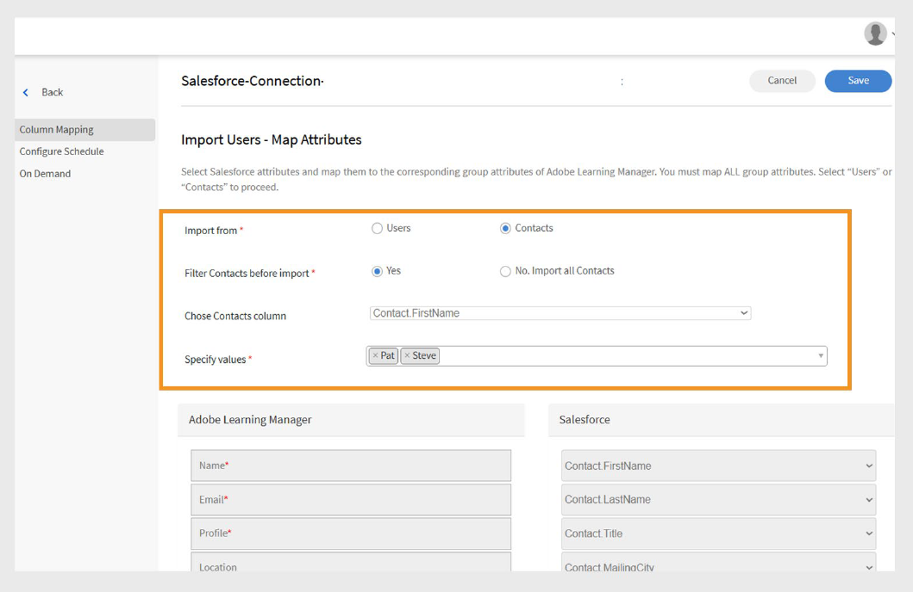

# Conector de Salesforce para Adobe Learning Manager

## Introducción

El conector de Salesforce integra las cuentas de Salesforce y Adobe Learning Manager (ALM), lo que permite la importación automatizada de usuarios, la sincronización de datos y las exportaciones de registros de aprendizaje. Esta guía explica cómo configurar el conector, administrar los datos de los usuarios e integrar la información de aprendizaje en Salesforce.

El conector de Salesforce para Adobe Learning Manager permite una integración fluida al importar usuarios automáticamente, admitir la asignación de datos personalizados y exportar registros de aprendizaje a Salesforce.

Siguiendo esta guía, aprenderá a:

- Establece conexiones seguras entre Salesforce y Adobe Learning Manager.
- Configurar procesos automatizados de importación de usuarios desde Salesforce.
- Asigne campos de Salesforce a atributos de Adobe Learning Manager de forma efectiva.
- Exporta los registros de aprendizaje a Salesforce para obtener informes completos.
- Configurar filtrado y programación para la sincronización de datos de destino.

## ¿Qué es el conector de Salesforce?

El conector de Salesforce es una potente herramienta de integración que crea un puente perfecto entre Salesforce CRM y Adobe Learning Manager. Este conector elimina la entrada manual de datos al sincronizar automáticamente la información del usuario, los datos de contacto y los registros de aprendizaje entre las dos plataformas.

## Capacidades clave

### Asignación de atributos

Ayuda a crear vínculos flexibles entre campos de Salesforce y atributos de usuario de Adobe Learning Manager. Puede asignar campos estándar como Nombre, Correo electrónico y Responsable a los atributos correspondientes en Learning Manager. El conector también admite campos personalizados en ambas plataformas, incluye la validación de campos necesaria para mantener la precisión de los datos y permite guardar configuraciones de asignación para su reutilización en futuras importaciones.

### Importación automatizada de usuarios

Simplifica la incorporación y el mantenimiento de los usuarios mediante procesos de importación automatizados que eliminan la gestión manual de archivos CSV.

- Importación directa desde objetos de usuario de Salesforce sin formatos de archivo intermedios.
- Sincronización en tiempo real de los cambios de perfil de usuario.
- Compatibilidad con usuarios estándar y contactos externos.

### Programación automática de importaciones

Configure programaciones de sincronización automatizadas que mantengan la moneda de los datos sin intervención manual. Seleccione una de las opciones de programación de intervalos diarios, semanales o personalizados.

- Configuración de la zona horaria para organizaciones globales.
- Programación de pico/fuera de pico para optimizar el rendimiento del sistema.

### Filtro de usuario

- Aplique criterios de filtrado para dirigirse a poblaciones de usuarios específicos y optimice la eficiencia de la sincronización de datos.
- Filtrado basado en funciones para programas de formación específicos.
- Filtrado geográfico o por ubicación para implementaciones regionales
- Filtrado de campos personalizados mediante criterios y fórmulas de Salesforce.

## Requisitos previos

Antes de configurar el conector de Salesforce, asegúrese de que su entorno cumpla estos requisitos:

- [URL de organización de Salesforce](https://myorg.salesforce.com)
- Credenciales de inicio de sesión del administrador para Salesforce y Adobe Learning Manager.
- Administrador del sistema o permisos equivalentes en Salesforce.
- Cuenta de Adobe Learning Manager activa con las licencias adecuadas

## Configurar el conector de Salesforce

El conector de Salesforce en Adobe Learning Manager permite a los administradores de integración automatizar la sincronización de datos de usuario y registros de aprendizaje entre Salesforce y Adobe Learning Manager.

Para crear un conector de Salesforce:

1. Inicie sesión como administrador de integración.
2. Seleccione **Salesforce** y, a continuación, **Connect**.

   
   _Página de conectores de Adobe Learning Manager que muestra el conector de Salesforce con el botón Conectar resaltado_

3. Escriba la URL de la organización de Salesforce y seleccione **Conectar**. Esto le llevará a la página de inicio de sesión de Salesforce.

   
   _Formulario de inicio de sesión de Salesforce con campos de entrada de nombre de usuario y contraseña_

4. Inicie sesión con su nombre de usuario y contraseña. Complete los pasos de autenticación adicionales, como la verificación de dos factores o la respuesta a preguntas de seguridad.

   Tras la autenticación correcta, aparece la página de descripción general del conector, que confirma la conexión establecida entre los sistemas.

   
   _La página de información general del conector de Salesforce muestra el estado de la conexión correcta_

### Asignación de atributos

Descripción de la asignación de atributos La asignación de atributos crea la conexión esencial entre los campos de datos de Salesforce y los atributos de usuario de Adobe Learning Manager, lo que garantiza que la información del usuario se transfiera con precisión entre sistemas.

#### Requisitos de asignación

- Todos los campos obligatorios de Adobe Learning Manager deben asignarse a los campos correspondientes de Salesforce.
- Las configuraciones de asignación son reutilizables y persistentes en varias importaciones

Para asignar los atributos:

1. Vaya a la página de resumen del conector de Salesforce .
2. Seleccione **Usuarios internos** y, a continuación, seleccione **Configurar asignación**.
3. Seleccione una de las siguientes acciones:

   - **Usuarios:** cuentas de Salesforce estándar utilizadas por empleados o miembros del equipo interno
   - **Contactos:** Personas externas, como clientes, socios o proveedores.

4. Haga coincidir los campos activos de Adobe Learning Manager con las columnas de Salesforce en la página de asignación. El campo **Administrador** debe asignarse a un campo de correo electrónico del administrador de usuarios.

   
   _Interfaz de asignación de campos que muestra atributos de usuario de Adobe Learning Manager a la izquierda y selecciones desplegables de campos de Salesforce a la derecha_

5. Seleccione **Guardar** para completar la asignación.

## Importar usuarios y contactos

El conector de Salesforce permite a Adobe Learning Manager conectarse con su cuenta de Salesforce e importar usuarios automáticamente según su configuración.

- **Usuarios internos**: Empleados y miembros del personal con cuentas de usuario de Salesforce
- **Contactos externos**: Clientes, partners, proveedores y otras partes interesadas externas.
- **Importaciones mixtas**: Combinación de usuarios y contactos en un único proceso de sincronización.
- **Importaciones filtradas**: Sincronización de destino basada en criterios específicos.

El conector de Salesforce permite a Adobe Learning Manager conectarse con su cuenta de Salesforce e importar usuarios automáticamente según su configuración.

El conector admite la importación de contactos además de los usuarios estándar de Salesforce. Esto ayuda a ampliar los programas de formación a las partes interesadas externas, como clientes o socios.

Para importar contactos:

1. Seleccione **Salesforce** en la página **Conectores**.
2. Seleccione **Importar usuarios internos** en la página de conexión.

   
   _Página del conector de Salesforce con la opción Importar usuarios internos resaltada_

3. Seleccione **Contactos** en la página **Importar usuarios**.
4. Seleccione **Sí** para la opción **Filtrar contactos antes de importar**. **
5. Configure las opciones siguientes:

   - **Elegir la columna Contactos:** Seleccione el campo que desea importar a Adobe Learning Manager.
   - **Especificar valores:** Seleccione los valores que representan el campo seleccionado.
   - Asigne los atributos de Salesforce a los campos de Adobe Learning Manager

   
   _Configuración de importación de contactos que muestra opciones de filtrado y asignación de campos_

6. Seleccione **Guardar**.
7. Si selecciona **No. Importar todos los contactos**, puede asignar los campos directamente sin filtrar los contactos.

## Exportar registros de aprendizaje

La funcionalidad de exportación de registros de aprendizaje le permite compartir datos de Adobe Learning Manager con Salesforce, lo que crea capacidades de análisis y creación de informes completas que combinan resultados de aprendizaje con datos de CRM.

### Objetos personalizados de Salesforce

Antes de exportar registros de aprendizaje desde Adobe Learning Manager, cree objetos personalizados en Salesforce. Los objetos personalizados le permiten almacenar datos específicos de su organización o industria. Para obtener más información, vea [Objetos personalizados de Salesforce](https://trailhead.salesforce.com/en/content/learn/modules/data_modeling/objects_intro).

### Instalar paquetes de Adobe Learning Manager

Adobe proporciona paquetes prediseñados que crean los objetos personalizados necesarios:

- [Paquete 1](https://test.salesforce.com/packaging/installPackage.apexp?p0=04t1k0000008WPJ): Campos y objetos de aprendizaje principales
- [Paquete 2](https://test.salesforce.com/packaging/installPackage.apexp?p0=04t1k0000008WPT): Objetos de análisis de aprendizaje ampliado
- [Paquete 3](https://test.salesforce.com/packaging/installPackage.apexp?p0=04t1k0000008WPi): Objetos adicionales de informes e integración

>[!IMPORTANT]
>
>Reemplace [test.salesforce.com](https://acrobat.adobe.com/home/test.salesforce.com) en las direcciones URL del paquete por el dominio real de la organización de Salesforce.

### Proceso de instalación del paquete

Para instalar los paquetes:

1. Inicie sesión en Salesforce como administrador.
2. Vaya a cada URL del paquete en el navegador.
3. Siga los pasos del asistente de instalación para cada paquete y conceda los permisos adecuados a los usuarios que tendrán acceso a los datos de aprendizaje.
4. Cambie el nombre de los objetos personalizados en Salesforce.
5. Seleccione los eventos y haga clic en **Guardar**.

>[!NOTE]
>
>Asegúrese de que se haya concedido acceso de administrador del sistema a todos los campos activos añadidos después de la instalación del paquete.

### Exportar registros

Para exportar los registros a Salesforce:

1. Seleccione **Exportar registros unificados** en la página de conectores de **Salesforce**.
2. Seleccione los eventos de los siguientes:

   - Nueva adición de usuario
   - Inscripción en formación
   - Finalización de formación
   - Inscripción de aptitudes
   - Finalización de aptitudes

3. Seleccione **Objeto de contacto** en el evento **Links con la opción**. Esto garantiza que los usuarios que existen en Adobe Learning Manager pero no en Salesforce se creen en Salesforce.

   
   _Configuración de exportación de registros de aprendizaje que muestra la selección de eventos y las opciones de vinculación_

>[!NOTE]
>
>Puede crear varias conexiones dentro de una sola cuenta. Cada conexión puede admitir hasta tres objetos personalizados en Salesforce. Para crear varias conexiones para la misma cuenta de Salesforce, se pueden instalar hasta tres paquetes. El número de paquetes instalados debe coincidir con el número de conexiones deseadas.

## Configuración de la aplicación Salesforce

Adobe Learning Manager proporciona un paquete de la aplicación Salesforce. Una vez instalado y configurado en su instancia de Salesforce, los usuarios de ventas pueden acceder a la formación y completarla directamente en el portal de Salesforce. La aplicación permite a los usuarios descubrir nuevos cursos, ver recomendaciones personalizadas y consumir contenido sin salir de Salesforce.

### Acceder a la aplicación Salesforce

Para configurar la aplicación Salesforce:

1. Inicie sesión como administrador de integración.
2. Seleccione **Aplicaciones** y, a continuación, seleccione **Aplicaciones destacadas**.
3. Seleccione **Salesforce**.

   
   Página de _Aplicaciones de Adobe Learning Manager que muestra la sección Aplicaciones destacadas con el mosaico de aplicaciones de Salesforce resaltado_

4. Observe el **Id. de aplicación** y el **Secreto de cliente** que se muestran en el cuadro de texto de descripción.

   
   _La página de detalles de la aplicación Salesforce en Adobe Learning Manager muestra el ID de aplicación y el secreto de cliente en el cuadro de descripción_

5. Seleccione **Aprobar** para habilitar la aplicación.

### Generar tokens de acceso

Para generar tokens de acceso:

1. Vaya a **Recursos de desarrolladores** en Adobe Learning Manager.
2. Seleccione **Tokens de acceso para pruebas y desarrollo**.
3. En la sección **Obtener código OAuth**, escriba el ID de cliente (ID de aplicación) y el ámbito debe establecerse en **admin:read,admin:write**.
4. Seleccione **Enviar**.
5. En la sección **Obtener token de actualización**, escriba el **ID de cliente** y el **secreto de cliente**.
6. Seleccione **Enviar** y anote el token de actualización y el token de acceso.

>[!IMPORTANT]
>
>Anote el token de actualización y el token de acceso generados.

### Crear una cuenta de Salesforce

Si no dispone de una cuenta de Salesforce, siga estos pasos para crear una con la misma dirección de correo electrónico que su cuenta de Adobe Learning Manager. Puede utilizar la edición Developer o Enterprise. Es importante registrarse con el mismo ID de correo electrónico asociado con su cuenta de Adobe Learning Manager.

1. Vaya a la [página de registro de desarrollador de Salesforce](https://developer.salesforce.com/signup).
2. Escriba los detalles necesarios con la misma dirección de correo electrónico utilizada para su cuenta de Adobe Learning Manager.
3. Compruebe su bandeja de entrada y verifique su cuenta a través del correo electrónico enviado por Salesforce.
4. Establezca su contraseña e inicie sesión en Salesforce.
5. Después de iniciar sesión, anote la URL de Salesforce (p. ej., https://yourorg.lightning.force.com) para utilizarla durante la configuración.

### Instalar el paquete de Adobe Learning Manager

Esta sección trata sobre la instalación del paquete de Adobe Learning Manager en su entorno de Salesforce.

>[!IMPORTANT]
>
>La aplicación de Adobe Learning Manager solo es compatible con la vista de Salesforce Lightning. Asegúrese de que Lightning Experience esté activado antes de continuar.

#### Instalar el paquete

Para instalar el paquete:

1. Abra la [URL del paquete de Adobe Learning Manager](https://login.salesforce.com/packaging/installPackage.apexp?p0=04t1k0000008WOQ).
2. Escriba su nombre de usuario y contraseña en la página de inicio de sesión.
3. Seleccione **Instalar**. En la página de instalación, mantenga seleccionada la opción Instalar solo para administradores; no lo cambie.
4. Seleccione **Listo**. Se le guiará a la página **Paquetes instalados**, donde podrá ver el paquete instalado de Adobe Learning Manager.

Se le redirigirá a la página Paquetes instalados, donde puede verificar la instalación del paquete de Adobe Learning Manager

#### Configurar la aplicación

Para configurar la aplicación:

1. Seleccione **Iniciador de aplicaciones** (icono de cuadrícula de 9 puntos junto a Configuración).
2. Busque Adobe Learning Manager.
3. Para configurar la aplicación, seleccione **Configurar**.
4. Seleccione **New** y agregue los siguientes detalles:

   - **Configuración:** introduzca el nombre que desee.
   - **ClientID**: Introduzca el valor obtenido en la primera sección.
   - **Secreto de cliente:** Escriba el valor obtenido en la primera sección.
   - **Token de actualización:** Escriba el valor obtenido en la primera sección.
   - **LearningManagerBaseURL:** Dirección URL del sitio en el que se aloja Adobe Learning Manager.

### Configuración del sitio remoto

Salesforce requiere una configuración del sitio remoto para permitir la comunicación con servicios externos como Adobe Learning Manager.

#### Agregar configuración de sitio remoto

Para agregar la configuración del sitio remoto:

1. En Salesforce, seleccione **Configuración** en la esquina superior derecha.
2. Seleccione **Instalación** en la esquina superior derecha de la página.
3. Busque **Configuración del sitio remoto** en **Búsqueda rápida**.
4. Seleccione **Nuevo sitio remoto**.
5. Introduzca los detalles:

   - **Nombre del sitio remoto:** Escriba el nombre que desee (por ejemplo, Adobe Learning Manager).
   - **Dirección URL del sitio remoto:** Escriba la dirección URL en la que se aloja Adobe Learning Manager.
6. Seleccione **Guardar**.

### Configurar notificaciones

Configure las notificaciones para mantener a los usuarios informados sobre las actividades de aprendizaje y las actualizaciones.

#### Creación de notificaciones personalizadas

Para activar las notificaciones:

1. Seleccione **Instalación** en la esquina superior derecha.
2. Busque **Notificaciones personalizadas** y, a continuación, seleccione **Nuevo**.
3. Escriba los siguientes datos:

   - **Nombre de notificación personalizado:** LearningManagerNotification
   - **Nombre de API:** LearningManagerNotification

4. Seleccione **Escritorio** y **Móvil** como canales compatibles.
5. Seleccione **Guardar**.

#### Habilitar notificaciones automáticas móviles (opcional)

Para los usuarios que desean recibir notificaciones en dispositivos móviles:

Para habilitar las notificaciones push para dispositivos móviles, siga los pasos que se indican a continuación:

1. Instale la aplicación móvil de Salesforce en su teléfono móvil.
2. Inicie sesión en la aplicación utilizando sus credenciales.
3. Vaya a **Configuración** y seleccione **Configuración de entrega de notificaciones**.
4. Añada Salesforce para iOS y Android.

### Configuración de usuario y permisos

Esta sección trata sobre la configuración de permisos y acceso de usuarios para la aplicación Adobe Learning Manager en Salesforce.

#### Descripción de perfiles de usuario

La aplicación de Adobe Learning Manager admite varios perfiles de usuario que corresponden a funciones en Adobe Learning Manager:

- Administrador
- Administrador de integración
- El instructor
- Alumno
- Perfiles personalizados (según sea necesario)

#### Asignar o crear perfiles de usuario

Puede utilizar perfiles existentes o crear perfiles personalizados para los usuarios de Adobe Learning Manager:

**Usar perfiles existentes**

1. Vaya a **Configuración** y seleccione **Usuarios**.
2. Seleccione **Perfiles**.
3. Seleccione un perfil que se alinee con las funciones de los usuarios
4. Asigne este perfil a los usuarios durante la instalación del paquete.

**Crear perfiles personalizados**

1. Vaya a **Configurar** y seleccione **&#x200B; usuarios. &#x200B;**
2. Seleccione **Perfiles**.
3. Haga clic en **Nuevo perfil**.
4. Cree un perfil personalizado basado en uno existente y adaptado a los usuarios de Adobe Learning Manager.

#### Configurar el perfil

Para configurar un perfil:

1. Después de instalar el paquete, selecciona **Configurar** y luego **Nuevo**.
2. Escriba los siguientes datos:

   - **Nombre de configuración**
   - **IDcliente**
   - **SecretoCliente**
   - **LearningManagerBaseURL**
   - **Deshabilitar redirección**

>[!NOTE]
>
>Asegúrese de que la aplicación de Adobe Learning Manager esté activada para que todos los alumnos puedan verla.

#### Establecer permisos de usuario

Seleccione los usuarios y asigne los permisos necesarios para acceder a la aplicación de Adobe Learning Manager.

#### Actualizar configuración de perfil

1. Seleccione un perfil (p. ej., perfil estándar) y, a continuación, seleccione **Editar**.
2. En la sección **Configuración de la aplicación personalizada**, marca la casilla de **Adobe Learning Manager** para que la aplicación sea accesible.
3. En la sección **Configuración de pestaña personalizada**, establezca la **página de inicio del alumno** en **Valor predeterminado de**.
4. Seleccione **Guardar** para aplicar los cambios.

Los alumnos con los perfiles asignados ahora pueden acceder a la aplicación Adobe Learning Manager en Salesforce.

Ha configurado correctamente el conector de Salesforce para Adobe Learning Manager. Los usuarios ahora pueden acceder a su contenido de aprendizaje directamente en Salesforce, lo que mejora la adopción y la participación en los programas de formación de su organización.
