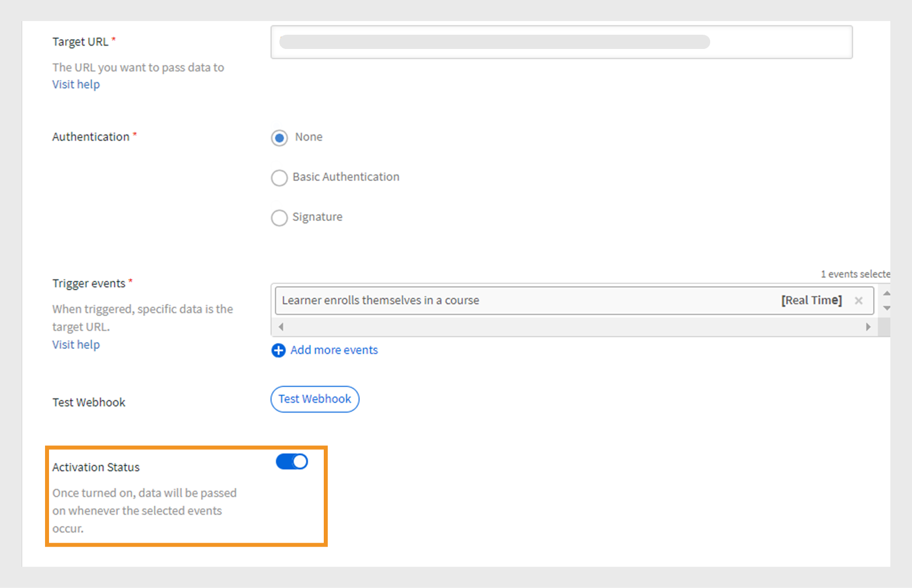

# Webhooks

Un webhook permite a una entidad enviar automáticamente datos o notificaciones en tiempo real a otra entidad cuando se produce un evento específico. Permitirá a una aplicación proporcionar información a otras aplicaciones sin solicitarla constantemente. Por ejemplo, si un usuario completa un curso de Sistema de gestión de aprendizaje (LMS), un webhook puede enviar automáticamente esa información a otra plataforma, como CRM o herramienta de creación de informes. Los webhooks se suelen utilizar en integraciones para automatizar procesos y reducir la necesidad de actualizaciones manuales entre sistemas. Configure los webhooks proporcionando una URL de devolución de llamada a la que enviar los datos.

## Webhooks frente a API

Los webhooks y las API ayudan a los sistemas a comunicarse entre sí, pero funcionan de formas diferentes. Con las API, la información se comparte solo cuando el usuario la solicita. Por ejemplo, si un alumno requiere datos de progreso del curso, envía una solicitud a la API, que, a continuación, proporciona la información. Por otro lado, los webhooks envían datos automáticamente inmediatamente cuando se produce un evento. Por ejemplo, si un alumno completa un curso, enviará los datos inmediatamente a la dirección URL del listener sin ninguna solicitud manual.

## ¿Qué son las API en tiempo real?

Las API en tiempo real permiten a las aplicaciones intercambiar datos instantáneamente cuando se produce un evento. A diferencia de las API tradicionales, que esperan a que un usuario solicite información, las API en tiempo real comparten datos en el momento en que sucede. Los webhooks actúan como una API en tiempo real y ayudan a compartir los datos inmediatamente cada vez que se produce el evento especificado. La API en tiempo real garantiza que esta transferencia de datos se produzca inmediatamente sin necesidad de ninguna solicitud manual, lo que permite que los sistemas se mantengan actualizados al instante.

## Eventos de Webhook

Los eventos Webhook son acciones específicas que se producen en un sistema que envía automáticamente datos a una dirección URL del listener. Por ejemplo, cuando un alumno se inscribe en un curso, se activa un evento webhook que envía los detalles de inscripción a la dirección URL del listener.

Los eventos Webhook se clasifican en dos categorías:

* **Eventos en tiempo real**: los eventos se procesan y se envían en tiempo real a una dirección URL de destino
* **Eventos en tiempo no real**: los eventos se procesan en lotes y se envían a horas especificadas en lugar de en tiempo real

## URL del Listener

Una dirección URL de Listener es un extremo o destino que recibe información de datos cuando se produce un evento. Siempre que se produce un evento específico, como un usuario que se inscribe en un curso, el sistema envía automáticamente los detalles a esta dirección URL sin ninguna solicitud manual. La URL del listener es la dirección en la que se entregan todas estas actualizaciones.
Webhook envía la información relevante en formato JSON. A continuación se muestra un ejemplo de carga para un evento activado en Adobe Learning Manager:

```
{
  "accountId": 1010,
  "events": [
    {
      "eventId": "d5fb7071-10a9-46b2-9f9e-79dde346c052",
      "eventName": "COURSE_ENROLLMENT_BATCH",
      "timestamp": 1727414643000,
      "eventInfo": "1727414643000-047210-84242-0",
      "data": {
        "userId": 4279332,
        "loId": "course:7374992",
        "loInstanceId": "course:7376092_10250977",
        "loType": "course",
        "enrollmentSource": "ADMIN_ENROLL",
        "dateEnrolled": 1727414643
      }
    }
  ]
}
```

## Crear y administrar webhooks: administrador de integración

Siga los pasos que se indican a continuación para crear la integración de Webhooks en Adobe Learning Manager:

1. Inicie sesión como **[!UICONTROL administrador de integración]**.
2. En la página principal, seleccione **[!UICONTROL Webhooks]** > **[!UICONTROL Agregar Webhook]**.

   
   _Agregar un webhook_

3. Escriba el **[!UICONTROL Nombre]** y la **[!UICONTROL Descripción]** del webhook.
4. Escriba la dirección URL del agente de escucha como **[!UICONTROL dirección URL de destino]** a la que desea pasar los datos del evento.
5. Seleccione cualquiera de los métodos de autenticación:
La autenticación en Webhooks es un método de seguridad para asegurarse de que los datos enviados a la dirección URL de un agente de escucha proceden de una fuente de confianza.
   * **[!UICONTROL Ninguno]**: no se requiere autenticación.
   * **[!UICONTROL Básico]**: esta es una autenticación basada en credenciales. Introduzca el nombre de usuario y la contraseña.
   * **[!UICONTROL Firma]**: el sistema crea una firma especial y la agrega a los datos de webhook. El servidor receptor comprueba este código para asegurarse de que los datos son reales y no se han modificado. Genera una firma y utilízala para la autenticación. Descargue la firma como JSON.
6. Seleccione los eventos Webhook en el menú desplegable **[!UICONTROL Eventos desencadenantes]**.

   >[!NOTE]
   >
   >También puede probar los webhooks seleccionando la opción Probar webhooks de la página Añadir webhook.

7. Seleccione el botón de alternancia **[!UICONTROL Estado de activación]** para habilitar el webhook. Una vez habilitado, los datos se pasarán siempre que se produzcan los eventos seleccionados.

>[!NOTE]
>
>Puede crear y administrar hasta 5 webhooks.

### Editar webhooks: administrador de integración

Siga estos pasos para editar webhooks desde Adobe Learning Manager:

1. Inicie sesión como **[!UICONTROL administrador de integración.]**
2. Seleccione **[!UICONTROL Webhooks]** en la página principal.
3. Seleccione el webhook que desea editar.

   
   _Editar el webhook_
4. Seleccione **[!UICONTROL Editar]** para modificar los detalles del webhook y seleccione **[!UICONTROL Guardar]**.

### Eliminar webhooks: administrador de integración

Siga estos pasos para editar webhooks desde Adobe Learning Manager:

1. Inicie sesión como **[!UICONTROL administrador de integración]**.
2. Seleccione **[!UICONTROL Webhooks]** en la página principal.
3. Seleccione el webhook que desea eliminar.
4. Seleccione **[!UICONTROL Eliminar]** para quitar los webhooks.


_Quitar el webhook_

### Retirar webhooks: administrador de integración

Siga estos pasos para retirar los webhooks:

1. Inicie sesión como **[!UICONTROL administrador de integración]**.
2. Seleccione **[!UICONTROL Webhooks]** en la página principal.
3. Seleccione el webhook que desea editar.
4. Seleccione **[!UICONTROL Editar]** y deshabilite el **[!UICONTROL Estado de activación]** para retirar el webhook.


_Retirar el webhook_

## Webhooks para alternativos {#webhooks-for-alternates}

ALM proporciona eventos webhook dedicados para finalizaciones alternativas que admiten la automatización, integraciones y sincronización con sistemas externos.

Estos acontecimientos permiten a los consumidores externos distinguir de manera fiable entre las finalizaciones directas y las finalizaciones concedidas a través de relaciones alternativas.

### Información general

Cuando un alumno finaliza un curso mediante una alternativa o relación, ALM activa un evento webhook que es independiente del webhook de finalización del curso estándar. Esto garantiza que las integraciones puedan responder de forma diferente a las finalizaciones alternativas cuando sea necesario.

Los eventos Webhook también se activan cuando se produce la finalización retroactiva o la infinalización retroactiva, lo que abarca las actualizaciones históricas, así como los cambios en las relaciones.

### Comportamiento del evento Webhook

* Un evento distinto de webhook se activa cuando un alumno recibe el estado Completado mediante alternativo de un curso de destino.
* El evento se genera cuando el alumno finaliza un curso de origen configurado que satisface el destino mediante una relación alternativa.
* Este webhook no se activa para las finalizaciones directas del curso.
* Cuando se activa la finalización retroactiva o la finalización retroactiva, se emiten eventos webhook para cada curso de alumno y destino afectado.

### Detalles de carga útil Webhook

La carga útil de webhook de finalización alternativa incluye los siguientes atributos clave:

* **ID de alumno**
Identifica el alumno que recibió la finalización alternativa.
* **Curso de origen**
El curso o la ruta de aprendizaje que el alumno ha completado directamente.
* **Curso de destino**
El curso marcado como completado mediante la relación alternativa.
* **Método de finalización**
Indica que el método de finalización es alternativo.
* **Fecha de finalización**
Se deriva de la fecha de finalización del curso de origen.
* **Tipo de relación**
Especifica si la relación es alternativa.

Para escenarios de finalización retroactiva, los eventos webhook indican que se ha revocado una finalización alternativa existente.

### Consideraciones de integración

Los sistemas externos pueden utilizar estos eventos webhook para:

* Actualizar registros de alumnos
* Sincronizar estado de finalización
* Notificaciones de activadores o flujos de trabajo descendentes
* Mantener registros de auditoría para fines de cumplimiento

Los consumidores de webhook deben diferenciar explícitamente entre finalizaciones directas y alternativas.

Las finalizaciones alternativas no otorgan habilidades, insignias ni recompensas por interacción lúdica. Los comentarios deben gestionarse en consecuencia en los sistemas descendentes.

## Webhooks para rutas de aprendizaje adaptables

### Introducción

Adobe Learning Manager proporciona **eventos webhook** que notifican a los sistemas externos cada vez que se actualiza el estado de finalización de una **ruta de aprendizaje (programa de aprendizaje)**. Esto permite sincronizar sistemas descendentes (como HR, informes o plataformas de análisis) siempre que se deshaga o vuelva a calcular el registro de finalización de un alumno.

Hay dos nuevos tipos de eventos webhook disponibles:

**LEARNING_PATH_COMPLETION_ROLLBACK**: se activa cuando un **alumno** actualiza el estado de finalización de una ruta de aprendizaje por sí mismo.

**LEARNING_PATH_COMPLETION_ROLLBACK_BATCH**: se activa cuando un **administrador** actualiza el estado de finalización de una ruta de aprendizaje para **uno o más alumnos** (por ejemplo, mediante operaciones en bloque).

Estos eventos usan una **estructura de carga común** y puede ser consumida por tu punto final de webhook para actualizar o reprocesar los datos de finalización de tu lado.

### Estructura común de la carga útil

Cada solicitud webhook contiene la siguiente estructura de nivel superior:

```
{
  "accountId": 69735,
  "events": [
    {
      "eventId": "757b9d58-048c-4ae2-9fff-35f9def7ef29",
      "eventName": "LEARNING_PATH_COMPLETION_ROLLBACK",
      "timestamp": "2026-01-20T05:48:10.000Z",
      "eventInfo": "1768888090000-197513-137581-0",
      "data": {
        "userId": 13446697,
        "loId": "learningProgram:157165",
        "loInstanceId": "learningProgram:157165_148769",
        "loType": "learningProgram",
        "enrollmentSource": "SELF_ENROLL",
        "dateEnrolled": "2026-01-20T05:44:05.000Z"
      }
    }
  ]
}
```

Se usa la **misma estructura** para ambos tipos de eventos; solo difieren el eventName y los valores dentro de los datos (por ejemplo, userId, loId, enrollmentSource).

#### Ejemplo: actualización iniciada por el alumno

Cuando un alumno actualiza el estado de finalización de su propia ruta de aprendizaje, el webhook envía un evento LEARNING_PATH_COMPLETION_ROLLBACK:

```
{
  "accountId": 69735,
  "events": [
    {
      "eventId": "757b9d58-048c-4ae2-9fff-35f9def7ef29",
      "eventName": "LEARNING_PATH_COMPLETION_ROLLBACK",
      "timestamp": "2026-01-20T05:48:10.000Z",
      "eventInfo": "1768888090000-197513-137581-0",
      "data": {
        "userId": 13446697,
        "loId": "learningProgram:157165",
        "loInstanceId": "learningProgram:157165_148769",
        "loType": "learningProgram",
        "enrollmentSource": "SELF_ENROLL",
        "dateEnrolled": "2026-01-20T05:44:05.000Z"
      }
    }
  ]
}
```

Utilice este evento para **volver a calcular o restablecer los datos de finalización del alumno** en los sistemas externos cuando el alumno solicite explícitamente una actualización.

#### Ejemplo: actualización por lotes iniciada por el administrador

Cuando un administrador realiza una actualización de finalización para uno o más alumnos (por ejemplo, corrigiendo finalizaciones históricas para un grupo), el webhook emite un evento LEARNING_PATH_COMPLETION_ROLLBACK_BATCH:

```
{
  "accountId": 69735,
  "events": [
    {
      "eventId": "757b9d58-048c-4ae2-9fff-35f9def7ef29",
      "eventName": "LEARNING_PATH_COMPLETION_ROLLBACK_BATCH",
      "timestamp": "2026-01-20T05:48:10.000Z",
      "eventInfo": "1768888090000-197513-137581-0",
      "data": {
        "userId": 13446698,
        "loId": "learningProgram:157166",
        "loInstanceId": "learningProgram:157166_148770",
        "loType": "learningProgram",
        "enrollmentSource": "ADMIN_ENROLL",
        "dateEnrolled": "2026-01-21T05:44:05.000Z"
      }
    }
  ]
}
```

En las operaciones por lotes, el extremo de webhook puede recibir **varios objetos de evento en una sola solicitud**, uno por alumno cuya finalización se haya actualizado. La integración debe iterar en la matriz de eventos y procesar cada evento de forma independiente.

### Cómo utilizar estos eventos en integraciones

Puede utilizar estos eventos webhook para:

**Sincronizar registros de finalización** con sistemas LMS/LRS, HR o de informes externos cuando se revierte o se vuelve a calcular una finalización.

**Activa flujos de trabajo descendentes** como reasignaciones, notificaciones o nuevos cálculos de certificaciones e insignias.

**Mantén registros de auditoría** registrando eventId, timestamp y eventInfo junto con los identificadores de la ruta de aprendizaje y del alumno.

Como mínimo, el controlador del webhook debe:

Valide la carga útil y analice los eventos[].
Use eventName para determinar si el cambio fue **iniciado por el alumno** o **iniciado por el administrador/lote**.

Utilice userId, loId y loInstanceId para localizar y actualizar el registro correspondiente en el sistema.
Aproveche eventId para evitar el procesamiento duplicado si el mismo evento se envía más de una vez.

## Webhooks para agregar y quitar miembros de grupos de usuarios

Dos nuevos tipos de eventos webhook tienen los estados finales:

* RESPUESTA:ASYNCAPI_USERGROUP_USER_ADDED
* RESPUESTA:ASYNCAPI_USERGROUP_USER_REMOVED

### Ejemplo de carga útil

```
{
  "accountId": 69735,
  "events": [
    {
      "eventId": "cd2972c8-cb15-47a0-a23f-e4a16cb720f5",
      "eventName": "RESPONSE:ASYNCAPI_USERGROUP_USER_REMOVED",
      "timestamp": "2026-03-18T13:38:12.000Z",
      "eventInfo": "cd2972c8-cb15-47a0-a23f-e4a16cb720f5",
      "data": {
        "status": "SUCCESS",
        "request": {
          "metadata": { "event_id": "cd2972c8-cb15-47a0-a23f-e4a16cb720f5" },
          "data": [ { "type": "user", "id": "13446641" } ]
        }
      }
    }
  ]
}
```

### Elementos clave

* `accountId` identifica la cuenta ALM.
* `events` es una matriz de objetos de evento.
* `eventId` coincide con el identificador de solicitud asincrónica original.
* `eventName` indica una operación de agregar o quitar.
* `timestamp` muestra la hora de finalización.
* `data.status` informa actualmente de &quot;CORRECTO&quot; para los lotes correctos.
* `data.request` contiene la solicitud exacta enviada.

La integración debe incluir principalmente `eventId` (o `metadata.event_id`) y `status`.

### Ejemplos

#### Adición de usuarios de forma asincrónica

**Paso 1. Realizar la llamada asincrónica**

POST /primeapi/v2/async/userGroups/12345/users

```
{
  "metadata": {
    "event_id": "sync-2026-03-30T10:15:00Z-ug-12345",
    "sourceSystem": "HRIS",
    "batchId": "hr_2026_03_30_0001"
  },
  "data": [
    { "type": "user", "id": "11101219" },
    { "type": "user", "id": "11101220" }
  ]
}
```

**Paso 2. Leer la respuesta inmediata**

```
{ "event_id": "sync-2026-03-30T10:15:00Z-ug-12345" }
```

Ahora puede marcar este trabajo como enviado en su sistema.

**Paso 3. Controlar el webhook**

Ejemplo de devolución de llamada Webhook:

```
{
  "accountId": 69735,
  "events": [
    {
      "eventId": "sync-2026-03-30T10:15:00Z-ug-12345",
      "eventName": "RESPONSE:ASYNCAPI_USERGROUP_USER_ADDED",
      "timestamp": "2026-03-30T10:15:43.000Z",
      "data": {
        "status": "SUCCESS",
        "request": {
          "metadata": {
            "event_id": "sync-2026-03-30T10:15:00Z-ug-12345",
            "sourceSystem": "HRIS",
            "batchId": "hr_2026_03_30_0001"
          },
          "data": [
            { "type": "user", "id": "11101219" },
            { "type": "user", "id": "11101220" }
          ]
        }
      }
    }
  ]
}
```

Un consumidor típico:

* Busque el trabajo interno.
* Opcionalmente, compruebe la suscripción mediante GET /userGroups/{id}/users.
* Marque el trabajo como completado.

#### Quitar usuarios de forma asincrónica

La remoción es simétrica, usando DELETE con la misma estructura corporal.

```
{
  "metadata": {
    "event_id": "sync-2026-03-30T11:00:00Z-ug-12345",
    "sourceSystem": "HRIS",
    "batchId": "hr_2026_03_30_0002"
  },
  "data": [ { "type": "user", "id": "11101219" } ]
}
```

Respuesta inmediata:

```
{ "event_id": "sync-2026-03-30T11:00:00Z-ug-12345" }
```

Más tarde, llega un webhook RESPONSE:ASYNCAPI_USERGROUP_USER_REMOVED con el mismo eventId.

Vea [API pública asíncrona para la pertenencia a grupos de usuarios](/help/migrated/api-changes-alm.md#asynchronous-public-apis-for-user-group-membership) para obtener más información.
