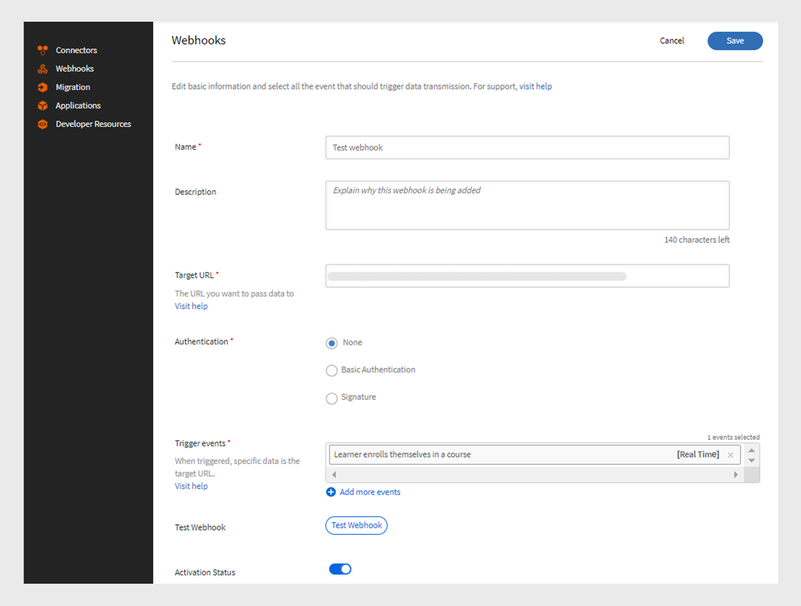

# Webhooks

Un webhook permite a una entidad enviar automáticamente datos o notificaciones en tiempo real a otra entidad cuando se produce un evento específico. Permitirá a una aplicación proporcionar información a otras aplicaciones sin solicitarla constantemente. Por ejemplo, si un usuario completa un curso de Sistema de gestión de aprendizaje (LMS), un webhook puede enviar automáticamente esa información a otra plataforma, como CRM o herramienta de creación de informes. Los webhooks se suelen utilizar en integraciones para automatizar procesos y reducir la necesidad de actualizaciones manuales entre sistemas. Configure los webhooks proporcionando una URL de devolución de llamada a la que enviar los datos.

## Webhooks frente a API

Los webhooks y las API ayudan a los sistemas a comunicarse entre sí, pero funcionan de formas diferentes. Con las API, la información se comparte solo cuando el usuario la solicita. Por ejemplo, si un alumno requiere datos de progreso del curso, envía una solicitud a la API, que, a continuación, proporciona la información. Por otro lado, los webhooks envían datos automáticamente inmediatamente cuando se produce un evento. Por ejemplo, si un alumno completa un curso, enviará los datos inmediatamente a la dirección URL del listener sin ninguna solicitud manual.

## ¿Qué son las API en tiempo real?

Las API en tiempo real permiten a las aplicaciones intercambiar datos instantáneamente cuando se produce un evento. A diferencia de las API tradicionales, que esperan a que un usuario solicite información, las API en tiempo real comparten datos en el momento en que sucede. Los webhooks actúan como una API en tiempo real y ayudan a compartir los datos inmediatamente cada vez que se produce el evento especificado. La API en tiempo real garantiza que esta transferencia de datos se produzca inmediatamente sin necesidad de ninguna solicitud manual, lo que permite que los sistemas se mantengan actualizados al instante.

## Eventos de Webhook

Los eventos Webhook son acciones específicas que se producen en un sistema que envía automáticamente datos a una dirección URL del listener. Por ejemplo, cuando un alumno se inscribe en un curso, se activa un evento webhook que envía los detalles de inscripción a la dirección URL del listener.
Los eventos Webhook se clasifican en dos categorías:

* **Eventos en tiempo real**: los eventos se procesan y se envían en tiempo real a una dirección URL de destino
* **Eventos en tiempo no real**: los eventos se procesan en lotes y se envían a horas especificadas en lugar de en tiempo real

## URL del Listener

Una dirección URL de Listener es un extremo o destino que recibe información de datos cuando se produce un evento. Siempre que se produce un evento específico, como un usuario que se inscribe en un curso, el sistema envía automáticamente los detalles a esta dirección URL sin ninguna solicitud manual. La URL del listener es la dirección en la que se entregan todas estas actualizaciones.
Webhook envía la información relevante en formato JSON. A continuación se muestra un ejemplo de carga para un evento activado en Adobe Learning Manager:

```
{
  "accountId": 1010,
  "events": [
    {
      "eventId": "d5fb7071-10a9-46b2-9f9e-79dde346c052",
      "eventName": "COURSE_ENROLLMENT_BATCH",
      "timestamp": 1727414643000,
      "eventInfo": "1727414643000-047210-84242-0",
      "data": {
        "userId": 4279332,
        "loId": "course:7374992",
        "loInstanceId": "course:7376092_10250977",
        "loType": "course",
        "enrollmentSource": "ADMIN_ENROLL",
        "dateEnrolled": 1727414643
      }
    }
  ]
}
```

## Crear y administrar webhooks: administrador de integración

Siga los pasos que se indican a continuación para crear la integración de Webhooks en Adobe Learning Manager:

1. Inicie sesión como **[!UICONTROL administrador de integración]**.
2. En la página principal, seleccione **[!UICONTROL Webhooks]** > **[!UICONTROL Agregar Webhook]**.

   
   _Agregar un webhook_

3. Escriba el **[!UICONTROL Nombre]** y la **[!UICONTROL Descripción]** del webhook.
4. Escriba la dirección URL del agente de escucha como **[!UICONTROL dirección URL de destino]** a la que desea pasar los datos del evento.
5. Seleccione cualquiera de los métodos de autenticación:
La autenticación en Webhooks es un método de seguridad para asegurarse de que los datos enviados a la dirección URL de un agente de escucha proceden de una fuente de confianza.
   * **[!UICONTROL Ninguno]**: no se requiere autenticación.
   * **[!UICONTROL Básico]**: esta es una autenticación basada en credenciales. Introduzca el nombre de usuario y la contraseña.
   * **[!UICONTROL Firma]**: el sistema crea una firma especial y la agrega a los datos de webhook. El servidor receptor comprueba este código para asegurarse de que los datos son reales y no se han modificado. Genera una firma y utilízala para la autenticación. Descargue la firma como JSON.
6. Seleccione los eventos Webhook en el menú desplegable **[!UICONTROL Eventos desencadenantes]**.

   >[!NOTE]
   >
   >También puede probar los webhooks seleccionando la opción Probar webhooks de la página Añadir webhook.

7. Seleccione el botón de alternancia **[!UICONTROL Estado de activación]** para habilitar el webhook. Una vez habilitado, los datos se pasarán siempre que se produzcan los eventos seleccionados.

>[!NOTE]
>
>Puede crear y administrar hasta 5 webhooks.

### Editar webhooks: administrador de integración

Siga estos pasos para editar webhooks desde Adobe Learning Manager:

1. Inicie sesión como **[!UICONTROL administrador de integración.]**
2. Seleccione **[!UICONTROL Webhooks]** en la página principal.
3. Seleccione el webhook que desea editar.

   
   _Editar el webhook_
4. Seleccione **[!UICONTROL Editar]** para modificar los detalles del webhook y seleccione **[!UICONTROL Guardar]**.

### Eliminar webhooks: administrador de integración

Siga estos pasos para editar webhooks desde Adobe Learning Manager:

1. Inicie sesión como **[!UICONTROL administrador de integración]**.
2. Seleccione **[!UICONTROL Webhooks]** en la página principal.
3. Seleccione el webhook que desea eliminar.
4. Seleccione **[!UICONTROL Eliminar]** para quitar los webhooks.


_Quitar el webhook_

### Retirar webhooks: administrador de integración

Siga estos pasos para retirar los webhooks:

1. Inicie sesión como **[!UICONTROL administrador de integración]**.
2. Seleccione **[!UICONTROL Webhooks]** en la página principal.
3. Seleccione el webhook que desea editar.
4. Seleccione **[!UICONTROL Editar]** y deshabilite el **[!UICONTROL Estado de activación]** para retirar el webhook.


_Retirar el webhook_

## Eventos en tiempo real

| S.No | Eventos de webhook | Descripción |
|---|---|---|
| 1 | CI_STATS | Se activa cuando hay un cambio en la disponibilidad de la licencia o lista de espera de una instancia de curso. |
| 2 | COURSE_ENROLLMENT | Se activa cuando un alumno se inscribe en un curso. |
| 3 | COURSE_COMPLETED | Se activa cuando un alumno finaliza un curso. |
| 4 | LEARNING_PATH_ENROLLMENT | Se activa cuando un alumno se inscribe en una ruta de aprendizaje. |
| 5 | LEARNING_PATH_COMPLETED | Se activa cuando un alumno completa una ruta de aprendizaje. |
| 6 | CERTIFICATION_ENROLLMENT | Se activa cuando un alumno se inscribe en una certificación. |
| 7 | CERTIFICATION_COMPLETED | Se activa cuando un alumno completa una certificación. |
| 8 | COURSE_UNENROLLMENT | Se activa cuando un alumno se da de baja de un curso. |
| 9 | LEARNING_PATH_UNENROLLMENT | Se activa cuando un alumno se da de baja de una ruta de aprendizaje. |
| 10 | CERTIFICATION_UNENROLLMENT | Se activa cuando un alumno se da de baja de una certificación. |
| 11 | LEARNING_OBJECT_DRAFT | Se activa durante la creación de un objeto de aprendizaje en estado de borrador. |
| 12 | LEARNING_OBJECT_DELETION | Se activa al eliminar un objeto de aprendizaje. |
| 13 | LEARNING_OBJECT_MODIFICATION | Se activa durante la modificación de un objeto de aprendizaje. |
| 14 | LEARNING_OBJECT_INSTANCE_MODIFICATION | Se activa durante la creación o modificación de una instancia de objeto de aprendizaje.<div><b>Nota:</b> Se recomienda utilizar instancias de curso solo después de publicar el curso.</div> |
| 15 | LEARNING_OBJECT_INSTANCE_DELETION | Se activa durante la eliminación de una instancia de objeto de aprendizaje. |

## Eventos en tiempo no real

| S.No | Eventos de webhook | Descripción |
|---|---|---|
| 1 | COURSE_ENROLLMENT_BATCH | Se activa cuando un administrador, responsable o plataforma inscribe alumnos en un curso. |
| 2 | COURSE_COMPLETED_BATCH | Se activa cuando un administrador, responsable o plataforma marca un curso como completado. |
| 3 | LEARNING_PATH_ENROLLMENT_BATCH | Se activa cuando un administrador, responsable o plataforma inscribe alumnos en una ruta de aprendizaje. |
| 4 | LEARNING_PATH_COMPLETED_BATCH | Se activa cuando un administrador o responsable marca una ruta de aprendizaje como completada. |
| 5 | CERTIFICATION_ENROLLMENT_BATCH | Se activa cuando un administrador, responsable o plataforma inscribe alumnos en una certificación. |
| 6 | CERTIFICATION_COMPLETED_BATCH | Se activa cuando un administrador, administrador o plataforma marca una certificación como completada. |
| 7 | LEARNER_PROGRESS | Realiza un seguimiento del progreso de un alumno cuando se completa un módulo. |
| 8 | COURSE_UNENROLLMENT_BATCH | Se activa cuando un administrador, responsable o plataforma da de baja a los alumnos de un curso. |
| 9 | LEARNING_PATH_UNENROLLMENT_BATCH | Se activa cuando un administrador, responsable o plataforma da de baja a los alumnos de una ruta de aprendizaje. |
| 10 | CERTIFICATION_UNENROLLMENT_BATCH | Se activa cuando un administrador, responsable o plataforma da de baja a los alumnos de una certificación. |
| 11 | LEARNING_OBJECT_MODIFICATION_BATCH | Se activa durante la modificación de un objeto de aprendizaje mediante el flujo de trabajo de migración. |
| 12 | LEARNING_OBJECT_INSTANCE_MODIFICATION_BATCH | Se activa durante la creación o modificación de una instancia de objeto de aprendizaje mediante el flujo de trabajo de migración. |

## Prácticas recomendadas para webhooks

Los webhooks permiten la comunicación entre servicios en tiempo real y basada en eventos. Sin embargo, una implementación incorrecta puede provocar la pérdida de eventos, un rendimiento lento del sistema o riesgos de seguridad. A continuación, se indican las prácticas recomendadas para implementar webhooks, centrándose en la tolerancia a errores, la fiabilidad y la seguridad.

### Tolerancia a fallos

La tolerancia a errores del sistema webhook de ALM proporciona recomendaciones para que los suscriptores gestionen posibles problemas, como la pérdida de eventos, los eventos duplicados y la entrega fuera de orden.

ALM tiene un tiempo de espera de conexión configurado de 10 segundos y un tiempo de espera de socket configurado de 5 segundos. Se espera que el cliente reconozca el mensaje en cuanto lo reciba. Esto garantiza que el cliente no se retrase al procesar los mensajes. En caso de que se produzca algún procesamiento posterior que requiera mucho tiempo, el cliente debe seguir reconociendo el evento al instante y, a continuación, gestionar el procesamiento posterior al final.

#### Retención de datos

Los eventos se mantienen durante 7 días. Si no se procesan en este plazo, se pierden de forma permanente. Si la recuperación se produce el último día y se necesita más tiempo, el sistema no ampliará el período de retención.
Si los eventos se producen más rápido de lo que se consumen, algunos eventos pueden perderse. Aunque esto es poco común, los suscriptores deben supervisar para evitar que se convierta en un problema a largo plazo.

#### Desactivación de webhooks

Cuando un suscriptor no responde a los eventos de webhook, el sistema ALM reintenta los webhooks utilizando una desconexión exponencial para evitar saturar al suscriptor.

El proceso de reintento comienza con un intervalo inicial de 5 segundos. Si el suscriptor no responde, el tiempo de espera se duplica a 10, 20, 40 y 80 segundos, y finalmente aumenta a un máximo de 5 minutos. Una vez que llega a los 5 minutos, el sistema continuará reintentando cada 5 minutos hasta que termine el período de retención de 7 días. Si el suscriptor sigue sin responder durante todo este período, el webhook se deshabilitará automáticamente. Se enviará un correo electrónico de recordatorio al suscriptor a intervalos regulares.

#### Duplicar eventos

Si un suscriptor tarda más de 5 segundos en responder después de procesar un evento, el sistema podría intentar procesar el mismo evento de nuevo. Se recomienda utilizar los ID de evento para realizar un seguimiento de los eventos que ya se han procesado. Además, si el webhook se bloquea después de enviar el evento pero antes de guardar que se ha procesado, puede que se vuelva a intentar el mismo grupo de eventos. Se recomienda utilizar ID de lote o ID de evento individuales para reconocer e ignorar cualquier duplicado.

#### Eventos fuera de orden

ALM intenta mantener los eventos en el orden correcto, pero a veces los eventos se pueden distribuir fuera de orden, especialmente entre eventos en tiempo real y no en tiempo real.

Si un administrador inscribe a varios alumnos en un curso a la vez, los eventos de inscripción se marcan como no en tiempo real. Sin embargo, si un alumno finaliza el curso rápidamente, ese evento de finalización se marca como en tiempo real y se puede impartir antes de los eventos de inscripción.

#### Recomendación de tolerancia a fallos

Para evitar estos errores, los suscriptores deben supervisar activamente los eventos de webhook y configurar alertas para problemas como eventos perdidos, entregas duplicadas o secuencias fuera de orden.

## Directrices específicas para eventos de Webhook

1. Si obtiene primero un evento LEARNER_PROGRESS, omita los eventos que se enumeran a continuación:

   * COURSE_ENROLLMENT
   * COURSE_ENROLLMENT_BATCH
   * LEARNING_PATH_ENROLLMENT
   * LEARNING_PATH_ENROLLMENT_BATCH
   * CERTIFICATION_ENROLLMENT
   * CERTIFICATION_ENROLLMENT_BATCH

2. Omita el evento LEARNER_PROGRESS si se produce después de los eventos siguientes:

   * COURSE_COMPLETED
   * COURSE_COMPLETED_BATCH
   * LEARNING_PATH_COMPLETED
   * LEARNING_PATH_COMPLETED_BATCH
   * CERTIFICATION_COMPLETED
   * CERTIFICATION_COMPLETED_BATCH

3. Utilice el campo de marca de tiempo para determinar si se debe ignorar o procesar el evento, excepto para el evento LEARNER_PROGRESS.


## Ejemplos de cargas para los eventos

+++CI_STATS

```
{
  "accountId": 1234,
  "events": [
    {
      "eventId": "01234567-0458-4450-b5dd-6bc1edr4560",
      "eventName": "CI_STATS",
      "timestamp": 1725604147,
      "eventInfo": "1725604145-LoSt",
      "data": {
        "loInstanceId": "course:1234567_123456775",
        "waitlistCount": 0,
        "enrollmentCount": 10,
        "seatLimit": 30
      }
    }
  ]
}
```

+++

+++COURSE_ENROLLMENT

```
{
  "accountId": 1234,
  "events": [
    {
      "eventId": "29123ec1-4576-4ec5-a057-3a6dr45t9d6",
      "eventName": "COURSE_ENROLLMENT",
      "timestamp": 1725524713,
      "eventInfo": "1725524713000-040366-10488-0",
      "data": {
        "userId": 1234567,
        "loId": "course:1234567",
        "loInstanceId": "course:1234567_1234567",
        "loType": "course",
        "enrollmentSource": "SELF_ENROLL",
        "dateEnrolled": 1725524713
      }
    }
  ]
  }
```

+++

+++COURSE_ENROLLMENT_BATCH

```
{
  "accountId": 1234,
  "events": [
    {
      "eventId": "29572ec1-4576-4ec5-a057-3wsd43r59d6",
      "eventName": "COURSE_ENROLLMENT_BATCH",
      "timestamp": 1725524713,
      "eventInfo": "1725524713000-040366-10488-0",
      "data": {
        "userId": 1234567,
        "loId": "course:1234567",
        "loInstanceId": "course:12345678_123456788",
        "loType": "course",
        "enrollmentSource": "ADMIN_ENROLL",
        "dateEnrolled": 1725524713
      }
    }
  ]
  }
```

+++

+++COURSE_COMPLETED

```
{
  "accountId": 1234,
  "events": [
    {
      "eventId": "c1a3168c-6c98-4ed3-b0b0-ba3da5087c1c",
      "eventName": "COURSE_COMPLETED",
      "timestamp": 1725523823,
      "eventInfo": "1725523823000-040363-12018-0",
      "data": {
        "userId": 12345678,
        "loId": "course:12345671",
        "loInstanceId": "course:1234567_12345674",
        "loType": "course",
        "enrollmentSource": "SELF_ENROLL",
        "dateCompleted": 1725523818,
        "hasPassed": true
      }
    }
  ]
}
```

+++

+++COURSE_COMPLETED_BATCH

```
{
  "accountId": 1234,
  "events": [
    {
      "eventId": "c1a3168c-6c98-4ed3-b0b0-ba3da5087c1c",
      "eventName": "COURSE_COMPLETED_BATCH",
      "timestamp": 1725523823,
      "eventInfo": "1725523823000-040363-12018-0",
      "data": {
        "userId": 112345678,
        "loId": "course:12345678",
        "loInstanceId": "course:1234567_12345678",
        "loType": "course",
        "enrollmentSource": "ADMIN_ENROLL",
        "dateCompleted": 1725523818,
        "hasPassed": true
      }
    }
  ]
}
```

+++

+++RUTA_DE_APRENDIZAJE_INSCRIPCIÓN

```
{
  "accountId": 1234,
  "events": [
    {
      "eventId": "96ed0791-338f-4c4c-83bc-9fwfr4564965",
      "eventName": "LEARNING_PATH_ENROLLMENT",
      "timestamp": 1725604249,
      "eventInfo": "1725604248000-040653-71396-0",
      "data": {
        "userId": 11234567,
        "loId": "learningProgram:123456",
        "loInstanceId": "learningProgram:12345_134567",
        "loType": "learningProgram",
        "enrollmentSource": "SELF_ENROLL",
        "dateEnrolled": 1725604248
      }
    }
  ]
}
```

+++

+++RUTA_DE_APRENDIZAJE_LOTE_DE_INSCRIPCIÓN

```
{
  "accountId": 1234,
  "events": [
    {
      "eventId": "96edft791-338f-4c4c-83bc-9f7erf94965",
      "eventName": "LEARNING_PATH_ENROLLMENT",
      "timestamp": 1725604249,
      "eventInfo": "1725604248000-040653-71396-0",
      "data": {
        "userId": 12345678,
        "loId": "learningProgram:12347",
        "loInstanceId": "learningProgram:12345_12345",
        "loType": "learningProgram",
        "enrollmentSource": "ADMIN_ENROLL",
        "dateEnrolled": 1725604248
      }
    }
  ]
  }
```

+++

+++RUTA_DE_APRENDIZAJE_COMPLETADA

```
{
  "accountId": 1234,
  "events": [
    {
      "eventId": "e207104e-d554-4027-944b-08fty6fdddf",
      "eventName": "LEARNING_PATH_COMPLETED",
      "timestamp": 1725604392,
      "eventInfo": "1725604391000-040653-314618-0",
      "data": {
        "userId": 11080928,
        "loId": "learningProgram:12345",
        "loInstanceId": "learningProgram:12345_95662",
        "loType": "learningProgram",
        "enrollmentSource": "SELF_ENROLL",
        "dateCompleted": 1725604380,
        "hasPassed": true
      }
    }
  ]
  }
```

+++

+++RUTA_DE_APRENDIZAJE_COMPLETADA_LOTE

```
{
  "accountId": 1234,
  "events": [
    {
      "eventId": "e207104e-d554-4027-944b-086debefdddf",
      "eventName": "LEARNING_PATH_COMPLETED",
      "timestamp": 1725604392,
      "eventInfo": "1725604391000-040653-314618-0",
      "data": {
        "userId": 12345678,
        "loId": "learningProgram:12345",
        "loInstanceId": "learningProgram:12345_95662",
        "loType": "learningProgram",
        "enrollmentSource": "ADMIN_ENROLL",
        "dateCompleted": 1725604380,
        "hasPassed": true
      }
    } 
    ]
    }
```

+++

+++CERTIFICATION_ENROLLMENT

```
{
  "accountId": 1234,
  "events": [
    {
      "eventId": "8bdfr76-148e-4128-80e9-b89123456755",
      "eventName": "CERTIFICATION_ENROLLMENT",
      "timestamp": 1725604672,
      "eventInfo": "1725604672000-040654-559128-0",
      "data": {
        "userId": 12345678,
        "loId": "certification:1234567",
        "loInstanceId": "certification:123456_160299",
        "loType": "certification",
        "enrollmentSource": "SELF_ENROLL",
        "dateEnrolled": 1725604672
      }
    }
  ]
}
```

+++

+++CERTIFICATION_ENROLLMENT_BATCH

```
{
  "accountId": 1234,
  "events": [
    {
      "eventId": "8b2ee776-148e-4128-80e9-12345678",
      "eventName": "CERTIFICATION_ENROLLMENT_BATCH",
      "timestamp": 1725604672,
      "eventInfo": "1725604672000-040654-559128-0",
      "data": {
        "userId": 123456788,
        "loId": "certification:1234567",
        "loInstanceId": "certification:12345678_160299",
        "loType": "certification",
        "enrollmentSource": "ADMIN_ENROLL",
        "dateEnrolled": 1725604672
      }
    }
  ]
  }
```

+++

+++CERTIFICATION_COMPLETED

```
{
  "accountId": 1234,
  "events": [
    {
      "eventId": "b8b63bf8-7521-4bc0-bc51-7f951ff63ea9",
      "eventName": "CERTIFICATION_COMPLETED",
      "timestamp": 1725604769,
      "eventInfo": "1725604768000-040654-756257-0",
      "data": {
        "userId": 12345678,
        "loId": "certification:1245678",
        "loInstanceId": "certification:1234567_160299",
        "loType": "certification",
        "enrollmentSource": "SELF_ENROLL",
        "dateCompleted": 1725604740
      }
    }
  ]
  }
```

+++

+++CERTIFICATION_COMPLETED_BATCH

```
{
  "accountId": 1234,
  "events": [
    {
      "eventId": "b8b63bf8-7521-4bc0-bc51-7f951ff63ea9",
      "eventName": "CERTIFICATION_COMPLETED_BATCH",
      "timestamp": 1725604769,
      "eventInfo": "1725604768000-040654-756257-0",
      "data": {
        "userId": 12345678,
        "loId": "certification:134567",
        "loInstanceId": "certification:1234567_160299",
        "loType": "certification",
        "enrollmentSource": "ADMIN_ENROLL",
        "dateCompleted": 1725604740
      }
    }
  ]
  }
```

+++

+++PROGRESO_DEL_ALUMNO

```
{
  "accountId": 1234,
  "events": [
    {
      "eventId": "dd04d3a4-c3df-44fa-a1cf-7edd6e3d2075",
      "eventName": "LEARNER_PROGRESS",
      "timestamp": 1725604552,
      "eventInfo": "1725604551000-297002-5823-0",
      "data": {
        "loId": "course:7542090",
        "loType": "course",
        "userId": 12345678,
        "loInstanceId": "course:1234567_11234567",
        "dateStarted": 1725604380,
        "progressPercent": 50
      }
}
]
}
```

+++

+++COURSE_UNENROLLMENT

```
{
  "accountId": 1234,
  "events": [
    {
      "eventId": "f3417817-8cb8-40ea-a441-813bec1c7724",
      "eventName": "COURSE_UNENROLLMENT",
      "timestamp": 1725515824,
      "eventInfo": "1725506253000-040298-24078-0",
      "data": {
        "userId": 12345671,
        "loId": "course:12345678",
        "loInstanceId": "course:12345678_14450088",
        "loType": "course",
        "enrollmentSource": "ADMIN_ENROLL",
      }
    }
  ]
}
```

+++

+++COURSE_UNENROLLMENT_BATCH

```
{
  "accountId": 1234,
  "events": [
    {
      "eventId": "f3417817-8cb8-40ea-a441-8123e45724",
      "eventName": "COURSE_UNENROLLMENT_BATCH",
      "timestamp": 1725515824,
      "eventInfo": "1725506253000-040298-24078-0",
      "data": {
        "userId": 123456781,
        "loId": "course:12345678",
        "loInstanceId": "course:12345678_14450088",
        "loType": "course",
        "enrollmentSource": "SELF_ENROLL"
    }
   }
  ]
}
```

+++

+++RUTA_DE_APRENDIZAJE_DARSE DE BAJA

```
{
  "accountId": 1234,
  "events": [
    {
      "eventId": "8e5df878-1dfd-47ac-9bfe-7d123456d1",
      "eventName": "LEARNING_PATH_UNENROLLMENT",
      "timestamp": 1725516573,
      "eventInfo": "1725506667000-040299-28209-0",
      "data": {
        "userId": 12345678,
        "loId": "learning_program:1234567",
        "loInstanceId": "learning_program:1234567_109139",
        "loType": "learning_program",
        "enrollmentSource": "SELF_ENROLL",
       
      }
    }
]
}
```

+++

+++RUTA_DE_APRENDIZAJE_UNENROLLMENT_BATCH

```
{
  "accountId": 1234,
  "events": [
    {
      "eventId": "8e5df878-1dfd-47ac-9bfe-7d4952e3edd1",
      "eventName": "LEARNING_PATH_UNENROLLMENT",
      "timestamp": 1725516573,
      "eventInfo": "1725506667000-040299-28209-0",
      "data": {
        "userId": 1234567,
        "loId": "learning_program:1234567",
        "loInstanceId": "learning_program:1234567_109139",
        "loType": "learning_program",
        "enrollmentSource": "ADMIN_ENROLL"
      }
    }
]
}
```

+++

+++CERTIFICATION_UNENROLLMENT

```
{
  "accountId": 1234,
  "events": [
    {
      "eventId": "7902766b-54d8-472d-b933-7e89d1b75ef8",
      "eventName": "CERTIFICATION_UNENROLLMENT",
      "timestamp": 1725517341,
      "eventInfo": "1725507900000-040304-1065-0",
      "data": {
        "userId": 12345678,
        "loId": "certification:1234567",
        "loInstanceId": "certification:12345678_162078",
        "loType": "certification",
        "enrollmentSource": "SELF_ENROLL"
      }
    }
  ]
}
```

+++

+++CERTIFICATION_UNENROLLMENT_BATCH

```
{
  "accountId": 1234,
  "events": [
    {
      "eventId": "7902766b-54d8-472d-b933-7e89d1b75ef8",
      "eventName": "CERTIFICATION_UNENROLLMENT_BATCH",
      "timestamp": 1725517341,
      "eventInfo": "1725507900000-040304-1065-0",
      "data": {
        "userId": 12345678,
        "loId": "certification:1234567",
        "loInstanceId": "certification:1234567_162078",
        "loType": "certification",
        "enrollmentSource": "SELF_ENROLL"
      }
    }
  ]
}
```

+++

+++LEARNING_OBJECT_DRAFT

```
{
  "accountId": 1234,
  "events": [
    {
      "eventId": "1712349f-26ec-453c-b56a-cdf18a841948",
      "eventName": "LEARNING_OBJECT_DRAFT",
      "timestamp": 1725519188,
      "eventInfo": "1725519188000-040344-48604-0",
      "data": {
        "loId": "course:12345671",
        "loType": "course"
      }
    }
  ]
}
```

+++

+++ELIMINACIÓN_OBJETO_APRENDIZAJE

```
{
  "accountId": 1234,
  "events": [
    {
      "eventId": "023456-5517-4c09-9cde-d953cdd8582c",
      "eventName": "LEARNING_OBJECT_DELETION",
      "timestamp": 1725605296,
      "eventInfo": "1234567800-040656-662792-0",
      "data": {
        "loId": "course:1234567",
        "loType": "course"
      }
    }
   ]
}
```

+++

+++MODIFICACIÓN_OBJETO_DE_APRENDIZAJE

```
{
  "accountId": 1234,
  "events": [
    {
      "eventId": "22345668-af3e-4dd3-a515-ce19d7234873",
      "eventName": "LEARNING_OBJECT_MODIFICATION_BATCH",
      "timestamp": 1725523081,
      "eventInfo": "123456000-039736-54153-0",
      "data": {
        "loId": "learningProgram:1234567",
        "loType": "learningProgram"

      }
    }
  ]
}
```

+++

+++LEARNING_OBJECT_MODIFICATION_BATCH

```
{
  "accountId": 1234,
  "events": [
    {
      "eventId": "2234567068-af3e-4dd3-a515-ce19d7234873",
      "eventName": "LEARNING_OBJECT_MODIFICATION_BATCH",
      "timestamp": 1725523081,
      "eventInfo": "123456700-039736-54153-0",
      "data": {
        "loId": "learningProgram:1234567",
        "loType": "learningProgram"

      }
    }
  ]
}
```

+++

+++LEARNING_OBJECT_INSTANCE_MODIFICATION

```
{
  "accountId": 1234,
  "events": [
    {
      "eventId": "b131da98-ab8d-43e9-b671-e79131cd69dc",
      "eventName": "LEARNING_OBJECT_INSTANCE_MODIFICATION",
      "timestamp": 1725603298,
      "eventInfo": "1723456000-040649-741781-0",
      "data": {
        "loInstanceId": "course:12345678_14453691",
        "loId": "course:12345678",
        "loType": "course"
        
      }
    }
  ]
}
```

+++

+++LEARNING_OBJECT_INSTANCE_MODIFICATION_BATCH

```
{
  "accountId": 1234,
  "events": [
    {
      "eventId": "b23458-ab8d-43e9-b671-e79131cd69dc",
      "eventName": "LEARNING_OBJECT_INSTANCE_MODIFICATION_BATCH",
      "timestamp": 1725603298,
      "eventInfo": "112345000-040649-741781-0",
      "data": {
        "loInstanceId": "course:12345678_14453691",
        "loId": "course:1234568",
        "loType": "course"

      }
    }
  ]
}
```

+++

+++LEARNING_OBJECT_INSTANCE_DELETION

```
{
  "accountId": 1234,
  "events": [
    {
      "eventId": "1234560-d73a-457b-83f3-666ba9654edb",
      "eventName": "LEARNING_OBJECT_INSTANCE_DELETION",
      "timestamp": 1725605491,
      "eventInfo": "17223456700-040657-236307-0",
      "data": {
        "loInstanceId": "course:1234567_14453849",
        "loId": "course:1234567",
        "loType": "course"

      }
    }
  ]
}
```

+++

