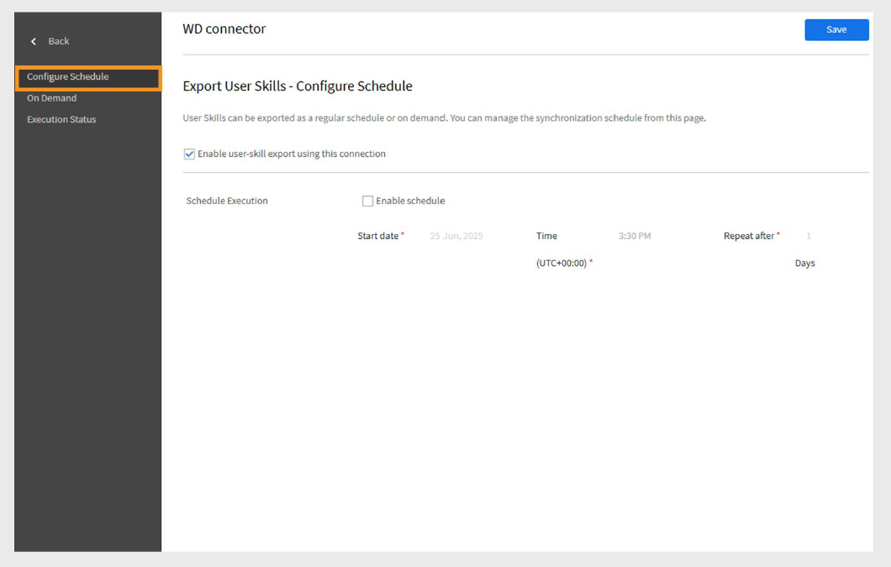

# Conector de Workday en Adobe Learning Manager

## Introducción

**Workday** es un sistema basado en la nube que ayuda a las organizaciones a administrar los empleados y los datos financieros. Se utiliza principalmente para tareas de RR. HH. como la contratación, la nómina y el seguimiento del rendimiento. Cuando se conecta con Adobe Learning Manager, permite la sincronización automática de los datos de usuarios y aptitudes entre las dos plataformas.

Workday Connector le permite integrar perfectamente Adobe Learning Manager con el inquilino de Workday de su organización. Esta integración permite la sincronización automática de los datos del usuario y las aptitudes entre los dos sistemas, lo que mejora la precisión de los datos y reduce el esfuerzo manual.

## Principales ventajas

- Importar usuarios de Workday a Adobe Learning Manager.
- Asigna atributos entre Workday y Adobe Learning Manager.
- Exportar aptitudes de usuario de Adobe Learning Manager a Workday.
- Programe las tareas de sincronización de datos para que se ejecuten automáticamente.

## Requisitos previos

Antes de configurar el conector de Workday, consulte a su administrador de Workday para obtener los siguientes detalles:

- URL de host
- ID de inquilino
- Nombre de usuario
- Contraseña

## Configurar el conector de Workday

Puede configurar el conector de Workday en Adobe Learning Manager para que pueda importar datos de usuarios de Workday, volver a exportar aptitudes de usuarios a Workday y programar sincronizaciones automatizadas para mantener ambos sistemas actualizados.

Para configurar el conector de Workday:

1. Inicie sesión en Adobe Learning Manager como administrador de integración.
2. Pase el ratón sobre el mosaico **Workday** y seleccione **Connect**.

   
   _Configurar el conector de Workday para importar y exportar los datos_

3. Escriba los siguientes detalles de conexión:
   - **Nombre de conexión**: El nombre de su elección para la conexión.
   - **Dirección Url Del Host**: Lo proporciona el administrador de Workday.
   - **Inquilino**: Identificador interno del administrador de Workday.
   - **Nombre de usuario y contraseña**: El administrador de Workday crea un usuario de sistema integrado (ISU) con los privilegios de seguridad necesarios y lo comparte con el administrador de integración.

   
   _Agregue los detalles necesarios para configurar el conector de Workday_

4. Seleccione **Conectar** para completar la instalación.

>[!NOTE]
>
>Puede configurar varias conexiones de Workday en su cuenta.

## Importar usuarios desde Workday

### Asignación de atributos

Puede utilizar el conector de Workday para importar a Adobe Learning Manager usuarios activos de su inquilino de Workday. Esta integración simplifica la administración de usuarios al mantener sincronizados los registros de los empleados. Además de Workday, Adobe Learning Manager también admite importaciones de usuarios desde otras fuentes de datos como FTP y Salesforce.

Antes de importar usuarios, debe asignar atributos de usuario entre Workday y Learning Manager.

1. Vaya a la página **Información general** en Workday Connector.
2. Seleccione **Usuarios internos** en la sección **Importar**.

   
   _Seleccionar usuarios internos para asignar los atributos de usuario_

3. Utilice la opción **Asignar atributos** para vincular campos entre los dos sistemas:
   - En la columna **Adobe Learning Manager**, seleccione el atributo Adobe Learning Manager correspondiente.
   - En la columna **Workday**, use el menú desplegable para seleccionar el atributo Workday correspondiente.

   
   _Asignando los atributos de Workday con campos de Adobe Learning Manager_

   >[!NOTE]
   >
   >Adobe Learning Manager admite actualmente la importación de hasta **69 atributos de usuario** desde Workday. Puede habilitar campos adicionales mediante la función **Campos activos** en Adobe Learning Manager. Para añadir atributos personalizados de Workday, póngase en contacto con su administrador de cuentas de éxito de clientes (CSAM).

4. Seleccione la casilla de verificación **Excluir trabajadores contingentes** para evitar la importación de trabajadores temporales.
5. Aplique filtros si es necesario, por ejemplo, para importar usuarios con administradores específicos.

>[!IMPORTANT]
>
>Asegúrese de que el UUID, la dirección de correo electrónico y el nombre del empleado sean únicos. Los valores incorrectos o duplicados pueden provocar errores de integración.

## Atributos de Workday compatibles

Lista de atributos de Workday compatibles:

```
wd:User_ID wd:Worker_ID manager wd:Personal_Data.wd:Name_Data.wd:Preferred_Name_Data.wd:Name_Detail_Data.@wd:Formatted_Name wd:Personal_Data.wd:Name_Data.wd:Legal_Name_Data.wd:Name_Detail_Data.@wd:Formatted_Name wd:Personal_Data.wd:Name_Data.wd:Legal_Name_Data.wd:Name_Detail_Data.wd:Prefix_Data.wd:Title_Descriptor wd:Personal_Data.wd:Name_Data.wd:Preferred_Name_Data.wd:Name_Detail_Data.wd:Prefix_Data.wd:Title_Descriptor wd:Personal_Data.wd:Name_Data.wd:Preferred_Name_Data.wd:Name_Detail_Data.wd:First_Name wd:Personal_Data.wd:Name_Data.wd:Preferred_Name_Data.wd:Name_Detail_Data.wd:Last_Name wd:Personal_Data.wd:Name_Data.wd:Legal_Name_Data.wd:Name_Detail_Data.wd:First_Name wd:Personal_Data.wd:Name_Data.wd:Legal_Name_Data.wd:Name_Detail_Data.wd:Last_Name wd:Personal_Data.wd:Contact_Data.wd:Address_Data.0.@wd:Formatted_Address wd:Personal_Data.wd:Contact_Data.wd:Address_Data.0.wd:Postal_Code wd:Personal_Data.wd:Contact_Data.wd:Email_Address_Data.0.wd:Email_Address wd:Personal_Data.wd:Contact_Data.wd:Address_Data.0.wd:Country_Region_Descriptor wd:Personal_Data.wd:Contact_Data.wd:Phone_Data.0.@wd:Formatted_Phone wd:Personal_Data.wd:Contact_Data.wd:Phone_Data.0.wd:Country_ISO_Code wd:Personal_Data.wd:Contact_Data.wd:Phone_Data.0.wd:International_Phone_Code wd:Personal_Data.wd:Contact_Data.wd:Phone_Data.0.wd:Phone_Number wd:Personal_Data.wd:Primary_Nationality_Reference.wd:ID.1.$ wd:Personal_Data.wd:Gender_Reference.wd:ID.1.$ wd:Personal_Data.wd:Identification_Data.wd:National_ID.0.wd:National_ID_Data.wd:ID wd:Personal_Data.wd:Identification_Data.wd:Custom_ID.0.wd:Custom_ID_Data.wd:ID wd:User_Account_Data.wd:Default_Display_Language_Reference.wd:ID.1.$ wd:Role_Data.wd:Organization_Role_Data.wd:Organization_Role.0.wd:Organization_Role_Reference.wd:ID.1.$ wd:Employment_Data.wd:Worker_Job_Data.0.wd:Position_Data.wd:Position_Title wd:Employment_Data.wd:Worker_Job_Data.0.wd:Position_Data.wd:Business_Title wd:Employment_Data.wd:Worker_Job_Data.0.wd:Position_Data.wd:Business_Site_Summary_Data.wd:Name wd:Employment_Data.wd:Worker_Job_Data.0.wd:Position_Data.wd:Business_Site_Summary_Data.wd:Address_Data.@wd:Formatted_Address
wd:Employment_Data.wd:Worker_Job_Data.0.wd:Position_Data.wd:Job_Classification_Summary_Data.0.wd:Job_Classification_Reference.wd:ID.1.$ wd:Employment_Data.wd:Worker_Job_Data.0.wd:Position_Data.wd:Job_Classification_Summary_Data.0.wd:Job_Group_Reference.wd:ID.1.$ wd:Employment_Data.wd:Worker_Job_Data.0.wd:Position_Data.wd:Work_Space__Reference.wd:ID.1.$ wd:Employment_Data.wd:Worker_Job_Data.0.wd:Position_Data.wd:Job_Profile_Summary_Data.wd:Job_Family_Reference.0.wd:ID.1.$ wd:Employment_Data.wd:Worker_Job_Data.0.wd:Position_Data.wd:Job_Profile_Summary_Data.wd:Job_Profile_Name wd:Employment_Data.wd:Worker_Job_Data.0.wd:Position_Data.wd:Job_Profile_Summary_Data.wd:Job_Profile_Reference.wd:ID.1.$ wd:Employment_Data.wd:Worker_Job_Data.0.wd:Position_Data.wd:Business_Site_Summary_Data.wd:Address_Data.0.wd:Country_Reference.wd:ID.2.$ wd:Employment_Data.wd:Worker_Job_Data.0.wd:Position_Data.wd:Worker_Type_Reference.wd:ID.1.$ wd:Employment_Data.wd:Worker_Job_Data.0.wd:Position_Data.wd:Business_Site_Summary_Data.wd:Address_Data.0.@wd:Formatted_Address wd:Employment_Data.wd:Worker_Job_Data.0.wd:Position_Data.wd:Job_Profile_Summary_Data.wd:Management_Level_Reference.wd:ID.1.$ wd:Employment_Data.wd:Worker_Status_Data.wd:Active wd:Employment_Data.wd:Worker_Status_Data.wd:Active_Status_Date wd:Employment_Data.wd:Worker_Status_Data.wd:Hire_Date wd:Employment_Data.wd:Worker_Status_Data.wd:Original_Hire_Date wd:Employment_Data.wd:Worker_Status_Data.wd:Retired wd:Employment_Data.wd:Worker_Status_Data.wd:Retirement_Date wd:Employment_Data.wd:Worker_Status_Data.wd:Terminated wd:Employment_Data.wd:Worker_Status_Data.wd:Termination_Date wd:Employment_Data.wd:Worker_Status_Data.wd:Termination_Last_Day_of_Work wd:Organization_Data.wd:Worker_Organization_Data.0.wd:Organization_Data.wd:Organization_Code wd:Organization_Data.wd:Worker_Organization_Data.0.wd:Organization_Data.wd:Organization_Name wd:Organization_Data.wd:Worker_Organization_Data.0.wd:Organization_Data.wd:Organization_Type_Reference.wd:ID.1.$ wd:Organization_Data.wd:Worker_Organization_Data.0.wd:Organization_Data.wd:Organization_Subtype_Reference.wd:ID.1.$ wd:Qualification_Data.wd:Education.0.wd:School_Name wd:Qualification_Data.wd:External_Job_History.0.wd:Job_History_Data.wd:Job_Title wd:Qualification_Data.wd:External_Job_History.0.wd:Job_History_Data.wd:Company wd:Management_Chain_Data.wd:Worker_Supervisory_Management_Chain_Data.wd:Management_Chain_Data.0.wd:Manager.Employee_ID Primary Work Email wd:Organization_Type_Reference_Cost_Center_ID wd:Organization_Type_Reference_Cost_Center_Name wd:Organization_Type_Reference_Company wd:Organization_Subtype_Reference_Department
wd:Organization_Subtype_Reference_Division wd:Universal_ID wd:Employment_Data.wd:Worker_Job_Data.0.wd:Position_Data.wd:Business_Site_Summary_Data.wd:Address_Data.0.wd:Country_Region_Descriptor wd:Employment_Data.wd:Worker_Job_Data.0.wd:Position_Data.wd:Business_Site_Summary_Data.wd:Address_Data.0.wd:Country_Region_Reference.wd:ID.2.$ wd:Personal_Data.wd:Contact_Data.wd:Address_Data.0.wd:Municipality
```

## Exportar aptitudes de usuarios a Workday

Puede exportar todas las aptitudes de usuario activas de Adobe Learning Manager a Workday. Las aptitudes retiradas no se exportan.

>[!IMPORTANT]
>
>- No intente exportar aptitudes de varias cuentas de Adobe Learning Manager a la misma cuenta de Workday simultáneamente.
>- Si varias cuentas de Adobe Learning Manager utilizan la misma cuenta de Workday, asegúrese de que los nombres de las aptitudes sean coherentes en todas las cuentas para evitar conflictos.

### Configurar una exportación programada

Para configurar las exportaciones programadas:

1. Seleccione **Aptitudes del usuario** y, a continuación, seleccione **Configurar programación** en la página **Información general de Workday**.

   
   _Seleccione Aptitudes del usuario para programar la exportación_

2. Seleccione la casilla de verificación **Habilitar exportación de aptitudes de usuario con esta conexión**.
3. Seleccione **Habilitar programación**.
4. Establezca la fecha de inicio, la hora y el intervalo de frecuencia.

   
   _Configurar la exportación programada en el conector de Workday_

5. Seleccione **Guardar** para aplicar la programación.

### Exportación a petición

Para crear exportaciones bajo demanda:

1. Seleccione **Bajo demanda** en la página **Información general de Workday**.
2. Escriba la fecha de inicio a partir de la cual debe comenzar el informe.
3. Seleccione **Ejecutar** para ejecutar el informe.

### Ver estado de ejecución

1. Vaya a **Estado de ejecución**.
2. Ver el estado de todas las tareas y descargar informes de errores según sea necesario.

## Programación de tareas de sincronización

Puede configurar el conector para que ejecute tareas de sincronización de datos automáticamente:

- Programa importaciones diarias de usuarios desde Workday a Learning Manager.
- Programe exportaciones periódicas de aptitudes de usuarios a Workday.

>[!NOTE]
>
>La programación garantiza que los registros de usuario y los datos de aptitudes estén siempre actualizados en ambos sistemas.

## Puntos que recordar

- Los administradores de LMS orientados al cliente no pueden eliminar el campo UUID rellenado desde Workday.
- La función **Purga de usuarios** solo admite hasta 50 usuarios por ejecución. Tenga cuidado al importar usuarios con UUID.
- Las aptitudes se asignan en el nivel de elemento de aptitud en Workday, utilizando el nombre de la aptitud y el nivel de Adobe Learning Manager.
