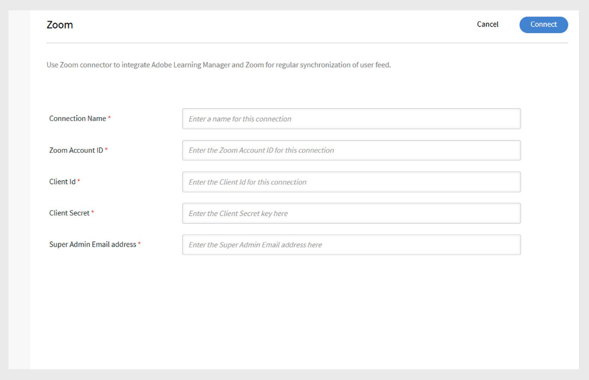

# Conector de Zoom en Adobe Learning Manager

## Introducción

El conector de Zoom en Adobe Learning Manager permite una integración perfecta con Zoom para ofrecer sesiones de clase virtual en directo. Con esta integración, los instructores pueden alojar reuniones de Zoom directamente desde el Administrador de aprendizaje, inscribir alumnos y realizar un seguimiento de los datos de asistencia y finalización. Los alumnos reciben invitaciones automáticas y pueden unirse a las sesiones a través de sus cuentas de Adobe Learning Manager. Después de la sesión, los datos de asistencia y rendimiento se sincronizan de nuevo con Adobe Learning Manager para la creación de informes y el seguimiento.

## Configurar el conector de Zoom

Para configurar el conector de Zoom:

1. Inicie sesión en Adobe Learning Manager como administrador de integración.
2. Pase el ratón sobre el mosaico **Zoom**.

   
   _Configurar el conector de Zoom en Adobe Learning Manager_

3. Seleccione **Conectar**. Se abre la página de configuración del conector de Zoom.
4. Escriba los siguientes detalles de la cuenta en los campos respectivos. Puede obtener estas credenciales del administrador de la cuenta de Zoom:

   * Nombre de conexión
   * ID de cuenta de Zoom
   * ID de cliente
   * Secreto de cliente
   * Dirección de correo electrónico del superadministrador

   
   _Escriba los detalles de configuración para configurar el conector de Zoom_

5. Seleccione **Conectar** para establecer la integración.

>[!NOTE]
>
>Al habilitar el conector, **los alumnos deben usar la misma dirección de correo electrónico** para sus cuentas de Zoom y Adobe Learning Manager para garantizar que los datos de usuario se sincronicen correctamente.

## Crear cursos de Zoom

Una vez establecida la conexión:

1. Inicie sesión como **autor** y cree un nuevo curso de clase virtual.
2. Seleccione **Zoom** como sistema de conferencia durante la creación del curso.
3. Asigne alumnos al curso a través de administradores, responsables o mediante inscripción automática.
4. Al inscribirse, los alumnos reciben un correo electrónico con los detalles del curso.
5. Los alumnos pueden iniciar sesión en su cuenta de Adobe Learning Manager para acceder al curso y unirse a la sesión de Zoom.

## Seguimiento de asistencia y finalización

Una vez finalizada la sesión virtual:

* Adobe Learning Manager recibe automáticamente el estado de finalización de Zoom.
* Los administradores pueden ver informes de asistencia y puntuación en Adobe Learning Manager para realizar un seguimiento de la participación y el rendimiento de los alumnos.

## Crear una aplicación de OAuth de servidor a servidor de Zoom

Para utilizar el conector de Zoom con Adobe Learning Manager, debe crear una aplicación OAuth de servidor a servidor de Zoom y configurar los ámbitos necesarios.

### Ámbitos de OAuth requeridos

Al crear la aplicación en Zoom, asegúrese de que están seleccionados los siguientes ámbitos:

| Lo que quieres | Buscar esta palabra clave | A continuación, elija |
|---|---|---|
| Ver todas las reuniones de usuarios | reunión | `meeting:read:meeting:admin, meeting:read:list_meetings:admin` |
| Ver o administrar todas las reuniones de usuarios | reunión | `meeting:update:meeting:admin, meeting:delete:meeting:admin, meeting:write:meeting:admin` |
| Ver datos del informe | informe | `report:read:meeting:admin, report:read:user:admin` (elija el que coincida con su extremo). |
| Ver toda la información del usuario | interfaz | `user:read:user:admin, user:read:list_users:admin` |
| Administrar usuarios | interfaz | `user:update:user:admin, user:write:user:admin` |
| Agregar un registrante de la reunión | solicitante de registro | `meeting:write:registrant:admin` |
| Enumerar todos los inscritos de la reunión | solicitante de registro | `meeting:read:list_registrants:admin` |
| Reuniones de subcuentas | reunión + buscar :master | `meeting:write:meeting:master` |
| Informe de los participantes de la reunión | participante | `report:read:list_meeting_participants:admin` |

