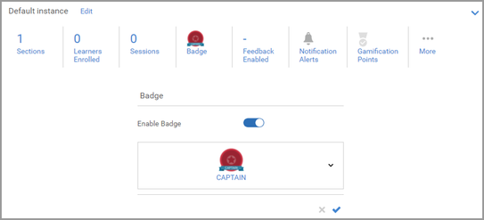

# No se puede asignar una insignia

## Problema

Incluso después de completar un curso o formación, no se concede una insignia de la forma prevista.

## Descripción

Una vez que un alumno completa un curso/programa de aprendizaje/certificación, no se le concede ninguna insignia.

## Causa

La insignia asignada al objeto de aprendizaje se añade una vez que el alumno ha completado el objeto de aprendizaje.

En la versión anterior, no se podía añadir una insignia posteriormente si no había ninguna insignia asignada a un objeto de aprendizaje en el momento en el que el alumno completaba ese objeto.

En las versiones actuales, esta función está disponible.

## Resolución

Si el alumno experimente un problema, pruebe a realizar los pasos siguientes:

## Curso/programa de aprendizaje

1. Inicie sesión como administrador.

1. Abra el objeto de aprendizaje correspondiente (curso/programa de aprendizaje).

1. Haga clic en **[!UICONTROL Instancias]** > **[!UICONTROL Insignia]**.

   

1. Quite la insignia del objeto de aprendizaje y haga clic en **[!UICONTROL Guardar]**.

   

1. Reasigna la insignia al objeto de aprendizaje y haz clic en **[!UICONTROL Guardar]**.

   Este paso asignará la insignia a todos los alumnos inscritos en el objeto de aprendizaje.

## Certificación

1. Inicie sesión como administrador.
1. Abra la certificación.
1. Haga clic en **[!UICONTROL Información general]** > **[!UICONTROL Insignia]**.
1. Quite la insignia de la certificación y haga clic en **[!UICONTROL Guardar]**.

   

1. Reasigna la insignia a la certificación y haz clic en **[!UICONTROL Guardar]**.
