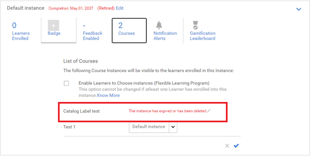

# Problemas relacionados con la retirada de un programa de aprendizaje

## Problema

Un programa de aprendizaje se retira automáticamente.

## Causa

Hay situaciones en las que se ha retirado un programa de aprendizaje sin que el administrador o el autor lo hayan hecho de forma explícita.

Este problema se debe a que un programa de aprendizaje es una colección de cursos. Los cursos superiores en el orden se retiran si alguno de los cursos que contienen incluye una instancia retirada o si se retira la instancia del curso.

## Resolución

Para comprobar el curso que contiene una instancia retirada, siga los pasos que se indican a continuación:

1. Inicie sesión como administrador e inicie el programa de aprendizaje correspondiente.

1. Haga clic en **[!UICONTROL Instancias]** > **CCursos**. En esta página, se muestran todos los cursos que forman parte de este programa de aprendizaje. Podrá ver el curso que contiene una instancia retirada.

   

   *Ver la lista de todos los cursos*

1. Cuando haya averiguado la instancia del curso que se ha retirado, haga clic en **[!UICONTROL Cursos]** > **[!UICONTROL Abrir el curso]**.

1. Haga clic en **[!UICONTROL Instancias]**. En la instancia retirada, haga clic en **[!UICONTROL Editar]** y, a continuación, cambie la fecha de finalización a una fecha futura en la que desee que se retire la instancia.

   

   *Editar la fecha de finalización de un curso*

1. Una vez completado el proceso, haga clic en la lista desplegable, como se muestra en la siguiente imagen. A continuación, haga clic en **[!UICONTROL Reabrir instancia]**.

   

   *Reabrir la instancia de un curso*

1. Visite el programa de aprendizaje correspondiente. Haga clic en **[!UICONTROL Instancias]** y ejecute el paso anterior para volver a abrir la instancia del programa de aprendizaje.
