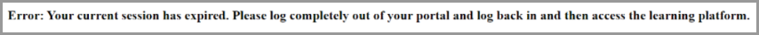

# Problemas de inicio de sesión en Learning Manager

## Problema

No se puede iniciar sesión en Adobe Learning Manager.

## Error

Al intentar iniciar sesión en Adobe Learning Manager, aparece el mensaje de error, que se muestra a continuación:

*Mensaje de error de una sesión caducada*

## Razón

Cuando un usuario inicia sesión mediante el inicio de sesión único (SSO), crea una cookie de sesión que se almacena en el navegador. También permite al usuario iniciar sesión en otras aplicaciones. La mayoría de los SSO se han configurado para que se cierre la sesión después de 24 horas. El usuario debe autenticarse de nuevo para iniciar una nueva sesión.

En algunos casos, un usuario no puede acceder al sistema debido a cookies de SSO obsoletas. Estas cookies se reenvían a Adobe Learning Manager para la autenticación. La sesión no finalizará si un usuario no cierra el navegador durante mucho tiempo o no ha cerrado la sesión.

Adobe Learning Manager rechaza estas cookies obsoletas, lo que genera un error.

## Resolución

Si Adobe Learning Manager rechaza una cookie obsoleta, pruebe las siguientes opciones:

1. Borre las cookies y la memoria caché del navegador. Para obtener más información, consulte este [documento](unable-log-in-learning-manager.md).

   Como alternativa, el administrador de IDP puede definir un cierre de sesión forzado después de un determinado tiempo. Este paso autentica de nuevo al usuario para iniciar una nueva sesión.

Existen otras razones por las que se produce este error, pero la indicada anteriormente es la más frecuente.

## Vínculos de referencia:

[Microsoft: sesión de acceso condicional durante toda la vida](https://docs.microsoft.com/es-es/azure/active-directory/conditional-access/howto-conditional-access-session-lifetime)
