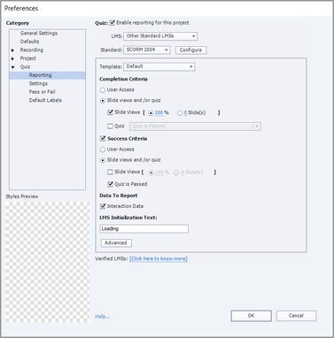

# El módulo está marcado como incompleto al finalizar el curso en Adobe Learning Manager

## Problema

Incluso después de que un alumno complete un curso en Adobe Learning Manager, el módulo se marca como incompleto.

## Causa

SCORM 2004 define los criterios de éxito y finalización y envía las sentencias para ambos por separado.

Por ejemplo, permita que haya un conjunto de contenidos con **Criterios de finalización** de vistas de diapositivas al 100 % y **Criterios de éxito** establecidos como &quot;Prueba superada&quot;.

Un alumno completa el curso, pero no lo hace. En este caso, el progreso es del 100 %, pero el módulo se marca como incompleto, ya que el alumno no puede cumplir con el **Criterios de éxito**.

## Solución

El problema está relacionado con los informes **Preferencias** para el proyecto. El autor debe verificar los criterios establecidos para la finalización y el éxito del curso.

Si se requiere algún cambio, el autor puede hacerlo mediante una herramienta de creación de contenido, como Adobe Captivate Classic. A continuación, el autor puede actualizar el módulo en consecuencia.

*Ver Preferencias De Informes De Captivate Classic*
