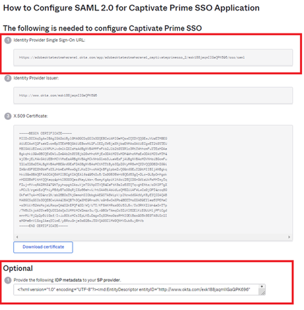

# Integración de Okta Active Directory con Adobe Learning Manager {#okta-active-directory-integration-with-adobe-learning-manager}

En este documento, aprenderá a integrar Adobe Learning Manager con Okta Active Directory (AD). Al integrar Adobe Learning Manager con Okta AD, puede:

* Compruebe y controle el acceso de los usuarios de Learning Manager en Okta AD.
* Permite que los usuarios inicien sesión automáticamente en Adobe Learning Manager con sus cuentas de Okta AD.
* Administre sus cuentas en una ubicación central: el portal de Okta.

Adobe Learning Manager admite SSO iniciado por el proveedor de identidades (IdP) y el proveedor de servicios (SP).

## Crear una aplicación en OKTA

1. Inicie sesión como administrador en Okta AD.
1. Haga clic en **[!UICONTROL Aplicaciones]**. Se abrirá Application Store en Okta.

   

   *Ver tienda de aplicaciones en Okta*

1. Haga clic en **[!UICONTROL Crear integración de aplicaciones]**.

   

   *Seleccione Crear integración de aplicaciones*

1. Seleccionar **[!UICONTROL SAML 2.0]** desde la nueva ventana de integración de aplicaciones.

   

   *Seleccione la opción SAML2.0*

1. Seleccionar **[!UICONTROL Crear integración de SAML]** > **[!UICONTROL Página Configuración general]**. Introduzca un nombre de aplicación.

   Tenga en cuenta que puede ser cualquier nombre para identificar de forma exclusiva la aplicación. Una vez hecho esto, haga clic en **[!UICONTROL Siguiente]**.

   

   *Introduzca el nombre de la aplicación*

1. Realice los siguientes pasos en la página Configurar SAML :

   **Para la configuración de IDP:**

   1. En el campo URL de inicio de sesión único, escriba la URL: [https://learningmanager.adobe.com/saml/SSO](https://learningmanager.adobe.com/saml/SSO)
   1. En el campo URL de audiencia, escriba la URL: [https://learningmanager.adobe.com](https://learningmanager.adobe.com/)
   1. En la **Formato de ID de nombre** cuadro desplegable, seleccione **Dirección de correo electrónico**.
   1. En la **Nombre de usuario de aplicación** , seleccione el nombre de usuario de Okta.
   1. Si desea pasar atributos adicionales, puede agregar los atributos en la **Instrucción Attributes** (Opcional)

   

   *Añadir atributos de SAML*

   **Para la configuración del SP:**

   1. En el campo URL de inicio de sesión único, escriba la URL: [https://learningmanager.adobe.com/saml/SSO](https://learningmanager.adobe.com/saml/SSO)
   1. En el campo URL de audiencia, escriba la URL: [https://learningmanager.adobe.com](https://learningmanager.adobe.com/)
   1. En el cuadro desplegable Formato de ID de nombre, seleccione **Dirección de correo electrónico**.
   1. En el menú desplegable Aplicación, seleccione el nombre de usuario de Okta.
   1. Haga clic en **Mostrar configuración avanzada**.
   1. Debajo **Algoritmo de firma**, seleccione RSA-SHA256
   1. En la **Algoritmo de aserción**, seleccione SHA256
   1. En la **Cifrado de aserción** dropbox, seleccione **Cifrado**.

   1. En la **Certificado de cifrado** , cargue el archivo de certificado compartido por el Adobe.
   1. Si desea pasar atributos adicionales, puede agregar los atributos en la **Instrucción Attributes** (Opcional).

   

   *Añadir atributos adicionales*

   Una vez hecho esto, haga clic en **[!UICONTROL Siguiente]**.

1. La **Comentarios**  es opcional. Una vez que haya seleccionado las opciones y haya proporcionado sus comentarios, haga clic en **[!UICONTROL Finalizar]**.

   

   *Completar la configuración de SAML*

## Extraer archivo de metadatos y URL iniciado por IDP

Para ver la URL y el archivo de metadatos iniciados por IdP/SP, realice los siguientes pasos:

1. Abra la aplicación que ha creado.
1. En el **Inicio de sesión único** , haga clic en **[!UICONTROL Ver instrucciones]**.

   

   *Seleccione la pestaña SSO*

   **Para IDP:**

   1. La URL de inicio de sesión único del proveedor de identidades es la URL iniciada por el IdP.
   1. Copie todo el texto que está presente en la **Opcional** campo.
   1. Abra un nuevo documento del bloc de notas y pegue el texto copiado.
   1. Haga clic en **[!UICONTROL Archivo]** > **[!UICONTROL Guardar como]** > &quot;filename.xml&quot;. Este será el archivo de metadatos.

   **Para SP:**

   1. La URL de inicio de sesión único del proveedor de identidades es la URL iniciada por el IdP.
   1. El emisor del proveedor de identidades es el ID de entidad.
   1. Copie todo el texto que está presente en la **Opcional** campo.
   1. Abra un nuevo documento del bloc de notas y pegue el texto copiado.
   1. Haga clic en **[!UICONTROL Archivo]** > **[!UICONTROL Guardar como]** > **[!UICONTROL nombreDeArchivo.xml]**. Este será el archivo de metadatos.

   

   *Guardar archivo SP XML*

   Debe guardar este archivo en formato XML.

## Configuración de SSO de Adobe Learning Manager

Para configurar el inicio de sesión único de Adobe Learning Manager, siga los pasos que se indican en el artículo siguiente.

<!--

article not in TOC

[SSO Authentication](/help/migrated/kb/sso-authentication-for-learning-manager.md)
-->