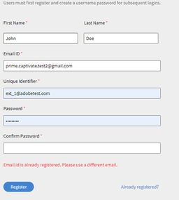

# No se puede registrar como usuario externo

## Problema

Los alumnos externos no pueden registrarse en un perfil.

## Error

El ID de correo electrónico ya está registrado. Utilice un correo electrónico diferente.

*Mensaje de error de un correo electrónico ya registrado*

## Descripción

Hay situaciones en las que un usuario no puede registrarse en un perfil externo. El usuario recibe el error anterior al registrarse.

## Causa

Este problema se produce en una de las situaciones siguientes:

* El usuario ya está registrado en otro perfil externo.
* El usuario ya es un alumno interno.
* El usuario presenta el estado Eliminado.

## Resolución:

**Escenario 1:** El usuario ya está registrado en otro perfil externo.

1. Inicie sesión como administrador.
1. Debajo **Gestionar**, haga clic en **[!UICONTROL Usuarios]** > **[!UICONTROL Externo]**.
1. Abra el perfil del que el usuario ya forma parte haciendo clic en Puestos usados.

   

   *Abrir perfil de usuario*

1. Seleccione el usuario y haga clic en **[!UICONTROL Acciones]** > **[!UICONTROL Cambiar perfil]**.

   

   *Cambiar perfil de usuario*

   Esto abre una ventana para seleccionar un nuevo perfil, como se muestra a continuación.

   

   *Seleccionar perfil de usuario*

1. Una vez seleccionado, haga clic en **[!UICONTROL Cambiar]**.

**Escenario 2:** El usuario está presente como alumno interno.

1. Inicie sesión como administrador.
1. Debajo **Gestionar**, haga clic en **[!UICONTROL Usuarios]** > **[!UICONTROL Interno]**.
1. Haga clic para abrir un perfil de alumno y haga clic en el icono Editar.

   

   *Abrir un perfil interno de alumno*

1. Cambiar la dirección de correo electrónico del alumno o añadir *_old* a la dirección de correo electrónico existente. Esto liberará la dirección de correo electrónico.

   Por ejemplo, si la dirección de correo electrónico del alumno es *<abc@adobe.com>,* cámbielo a *<abc_old@adobe.com>*

1. Haga clic en **Guardar** para conservar los cambios realizados.

**Escenario 3**: el usuario presenta el estado Eliminado.

1. Inicie sesión como administrador.
1. Debajo **Gestionar**, haga clic en **[!UICONTROL Usuarios]** > **[!UICONTROL Limpieza de usuarios]**.
1. Seleccione el alumno y haga clic en el icono Editar .

   

   *Editar dirección de correo electrónico del usuario*

1. Cambiar la dirección de correo electrónico del alumno o añadir *_old* a la dirección de correo electrónico existente. Esto liberará la dirección de correo electrónico.

   Por ejemplo, si la dirección de correo electrónico del alumno es **<abc@adobe.com>**, cámbielo a **<abc_old@adobe.com>**.
