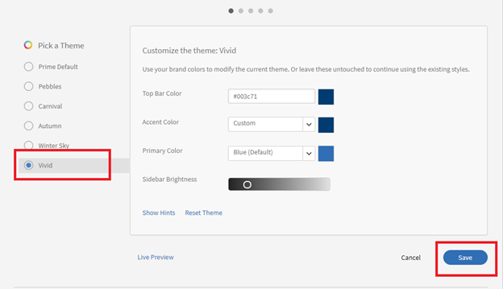

# Los botones de selección no aparecen en Learning Manager

## Problema

Debido a la falta de botones de opción, un administrador no puede realizar lo siguiente (no es una lista exhaustiva):

* Asignar o quitar funciones.
* Enviar un correo de bienvenida.
* Eliminar un usuario.

## Causa

El problema se debe a temas incorrectos en la cuenta.

*Los botones de opción no están visibles*

## Resolución

Vuelva a cargar los temas y corrija el aspecto de los botones de opción. Efectúe los pasos siguientes:

1. Como administrador, haga clic en **[!UICONTROL Marca]**.
1. En la sección **Temas**, haga clic en **[!UICONTROL Editar].**
1. Elija cualquier tema y guarde los cambios.

   

   *Seleccionar cualquier tema*

1. Vuelva al tema anterior y guarde los cambios.
1. Cierre sesión en Adobe Learning Manager y vuelva a iniciarla.
