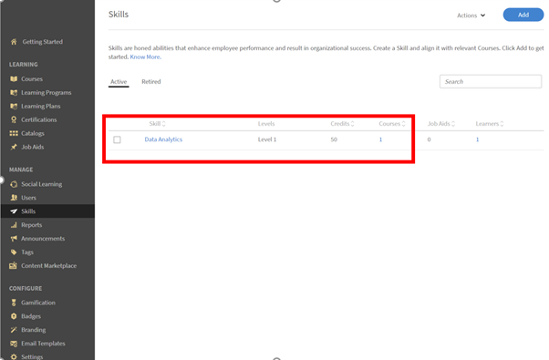

# No se puede obtener una aptitud después de completar un curso

## Problema

Un alumno, incluso después de completar un curso, no obtiene ninguna aptitud. Las aptitudes asignadas a ese curso permanecen como **En curso** para el alumno.

## Causa

Este problema se produce si **Créditos necesarios** para obtener esta aptitud es mayor que los **Créditos obtenidos** por el alumno después de completar el curso.

## Solución

Comprueba los **Créditos de aptitudes** y **Punto** actuales para obtener la aptitud. Siga los pasos mostrados a continuación:

1. Genere un informe de **transcripciones de alumnos** para el alumno.
1. Al generar la transcripción del alumno, haga clic en **[!UICONTROL Opciones avanzadas]** y marque la opción **[!UICONTROL Incluir datos de aptitudes y hojas de resumen]**.

   

   *Seleccione la opción Incluir datos de aptitudes y hojas de resumen*

1. Abra el informe de transcripciones de alumnos descargado.
1. Vaya a la hoja **[!UICONTROL Transcripción de aptitudes]**. Aquí puede ver los **[!UICONTROL Créditos necesarios]** y los **[!UICONTROL Créditos obtenidos]** por el alumno.

   Por ejemplo, en el ejemplo siguiente, los créditos necesarios para obtener la aptitud de un curso son 50. Sin embargo, el alumno solo ha obtenido un crédito.

   

   *Ver créditos requeridos*

1. Para comprobar los créditos asignados a una aptitud concreta, inicie sesión como administrador y vaya a la ficha **Aptitudes**, como se muestra a continuación:

   

   *Ficha Aptitudes de inicio*

1. Para comprobar el número de créditos asignados a un curso, inicie sesión como autor y abra el curso. Haga clic en **[!UICONTROL Configuración]** > **Aptitudes del curso**, como se muestra a continuación:

   

   *Ver aptitudes del curso*
