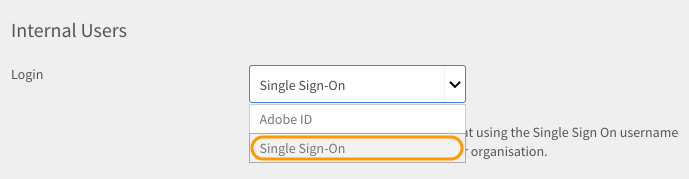

# Iniciar sesión en Learning Manager mediante autenticación con inicio de sesión único (SSO)

Este documento proporciona información sobre cómo configurar la autenticación con SSO para iniciar sesión en una cuenta de Learning Manager.

Para configurar la autenticación con SSO, siga estos pasos:

1. Abra **[!UICONTROL Configuración]** > **[!UICONTROL Métodos de inicio de sesión.]**

   

1. Elija **[!UICONTROL Usuarios internos]** o **[!UICONTROL Usuarios externos]**, según lo que se necesite.
1. Haga clic en el menú desplegable situado junto a  **[!UICONTROL login]** y seleccione **[!UICONTROL Inicio de sesión único]**.

   

1. Para ajustar la configuración de inicio de sesión único (SSO), haga clic en  **[!UICONTROL Cambia.]**

   

1. Intro  **[!UICONTROL URL de autenticación iniciada por IDP]** proporcionado por su proveedor de servicios y cargue su archivo XML haciendo clic en **[!UICONTROL Archivo XML de metadatos de IDP.]**

   

   El SSO que configure en Learning Manager debe ser compatible con SAML 2.0.

   Ya puede iniciar sesión en Learning Manager mediante autenticación con SSO.

