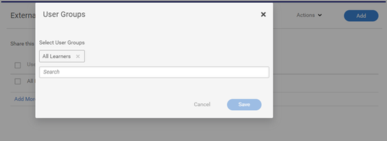

# No se puede buscar un curso en Learning Manager

## Problema

Un alumno no puede buscar un curso en Learning Manager.

## Escenario 1: la inscripción se realiza a través de un objeto de aprendizaje superior

### Resumen

Hay situaciones en las que un alumno busca en un curso y este no aparece en la lista. Sin embargo, si el alumno se ha inscrito en un programa de aprendizaje/certificación, este puede ver el curso en el objeto de aprendizaje.

### ¿Por qué sucede esto?

En Learning Manager, cuando un alumno se inscribe a través de un programa de aprendizaje/certificación, la inscripción en ese curso se realiza a través del programa de aprendizaje/certificación.

Por lo tanto, el alumno no puede buscar cursos independientes en **Mi aprendizaje**.

Sin embargo, el alumno no puede ver los cursos dentro del programa de aprendizaje/certificación.

## Escenario 2: el alumno no tiene acceso al catálogo que contiene el curso.

### Resumen

Un alumno no puede buscar cursos en el catálogo o el panel de aprendizaje.

### ¿Por qué sucede esto?

Este problema se produce si:

* El alumno no forma parte del catálogo que contiene el curso **O**
* El curso no forma parte del catálogo al que tiene acceso el alumno.

### Resolución

1. Inicie sesión como administrador.

1. Haga clic en **[!UICONTROL Catálogo]** y busque el catálogo que contiene el curso.
1. Haga clic en **[!UICONTROL Compartir internamente]** o **[!UICONTROL Contenido]** (dependiendo del escenario mencionado anteriormente).

   

   *Compartir el catálogo internamente*

1. Consulte los siguientes escenarios:

   * El alumno no forma parte del catálogo

     Para compartir el catálogo, haga clic en **[!UICONTROL Añadir]** y añada el grupo de usuarios del que el usuario forma parte. Haga clic en **[!UICONTROL Guardar]**.

     

     *Añadir el grupo de usuarios*

   * El curso no forma parte del catálogo

     En la sección Contenido, haga clic en **[!UICONTROL Añadir contenido]** y seleccione el curso que debe añadir al catálogo.

     

     *Añadir contenido al curso*
