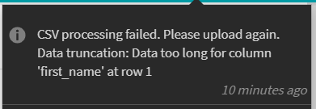
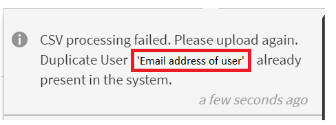

# No se puede cargar un archivo CSV

## Error: datos truncados: datos demasiado largos para la columna.

Al intentar cargar un archivo CSV en Adobe Learning Manager, aparece el siguiente mensaje de error.

*Mensaje de error que indica que el procesamiento de CSV ha fallado*

## Causa

El error se produce si los datos presentes en la columna especificada superan el límite de caracteres definido para la columna.

## Resolución

* Abra el archivo CSV.
* Compruebe los datos de la columna indicada en el error.
* Si hay algún valor grande (por ejemplo, mayor de 60 caracteres), cámbielo para corregir los datos.

## Error: la primera columna del archivo CSV presenta un carácter especial.

No se puede cargar un archivo CSV porque la primera columna muestra un carácter especial durante la asignación de columnas.

*Carácter especial en la columna Nombre*

## Causa

El problema se produce cuando el archivo CSV se guarda en formato UTF-8 en Excel. Al guardar un archivo CSV en Excel como UTF-8, el archivo se guarda en formato UTF-BOM. Puede comprobarlo mediante el Bloc de notas++ o al cargar un archivo CSV en Learning Manager; durante la asignación de columnas, la primera columna muestra un carácter especial.

## Resolución

* **A:** Guardar a través de Excel:

   1. Abra el archivo CSV en Excel.
   1. Guarde el archivo como CSV normal.

* **B:** Guardando mediante Bloc de notas o Bloc de notas++:

   * Abra el archivo CSV en el Bloc de notas o el Bloc de notas++.
   * Guarde el archivo en formato UTF-8.

## Error: la dirección de correo electrónico del usuario ya está presente en el sistema.

No se puede cargar un archivo CSV porque no se ha completado correctamente su procesamiento. Aparece el siguiente mensaje de error:

*Mensaje de error para un usuario duplicado*

## Causa

Este problema se produce si hay un usuario que ya está presente en el sistema con la misma dirección de correo electrónico o UUID.

## Resolución

### Escenario 1

**Cuentas en las que UUID no está habilitado.**

En este escenario, hay dos razones para este error:

1. El usuario que está intentando añadir es responsable de un perfil externo. Para resolver este problema, abra el perfil externo del que forma parte el usuario, seleccione el usuario, haga clic en **[!UICONTROL Acciones]** > **[!UICONTROL Asignar función]** > **[!UICONTROL Responsable]** y cambie el responsable del perfil.
1. El usuario que está intentando agregar se ha purgado. En este caso, no podrá añadir el usuario con la misma dirección de correo electrónico hasta que se complete el proceso de purga. Como solución alternativa&#x200B;**, a**&#x200B;ñada el usuario con una dirección de correo electrónico secundaria para proporcionar acceso a la plataforma. Una vez completado el proceso de purga, edite al usuario y cambie la dirección de correo electrónico a la dirección correcta.

### Escenario 2

**Cuentas habilitadas para UUID.**

En las cuentas con UUID activado, este problema puede producirse si a un usuario se le ha asignado un UUID que ya está siendo utilizado por otro usuario en la cuenta o si el usuario tiene una dirección de correo electrónico diferente.

Por ejemplo, puede haber dos usuarios, A y B, con direcciones de correo electrónico, <a@xyz.com> y <b@xyz.com> con UUID 1 y 2 respectivamente.

Ahora, si carga un archivo CSV que tenga el UUID del usuario A como 3 y el UUID del usuario B como 2, aparecerá un error.

>[!TIP]
>
>Para resolver este problema, **debe tener la misma dirección de correo electrónico y el mismo UUID para el usuario en el CSV y el sistema.**
