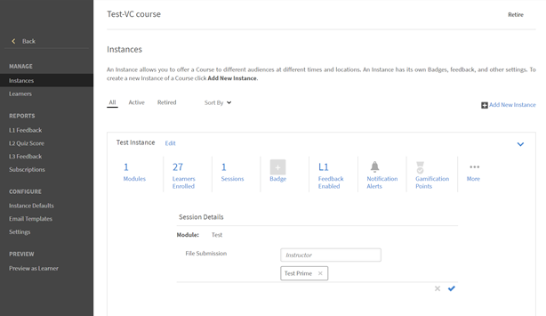

# No se pueden ver los envíos de archivos en Adobe Learning Manager

## El problema

Un instructor no puede ver los envíos de archivos que ha cargado un alumno.

## Descripción

Los instructores no pueden ver los archivos que los alumnos han cargado en el **Módulo de actividad de envío**.

Por ejemplo, un alumno se ha inscrito en una instancia denominada **Instancia de prueba** de un curso, como se muestra a continuación:

*Ver instancia*

A continuación, el alumno abre el curso y carga un archivo en el módulo Actividad.

Al intentar aprobar un envío, el instructor no puede realizar esta acción.

*Cargar un archivo en el módulo de actividad*

## Causa

Si no hay ningún instructor en la instancia del curso en el que está inscrito el alumno, se produce el problema.

## Resolución

Para comprobar si se ha añadido un instructor a la instancia del curso, siga los pasos que se indican a continuación:

1. Vaya a la configuración del curso.
1. En la **Gestionar** , haga clic en **[!UICONTROL Instancias].**
1. En la instancia en la que el alumno está inscrito, haga clic en **[!UICONTROL Sesiones]**.

   

   *Seleccione Sesiones en la instancia*

   No hay ningún instructor asignado a esta sesión.

1. Haga clic en **[!UICONTROL Editar]**. Añada el instructor que aprueba el envío del archivo.

   

   *Añadir el instructor*
1. Guarde los cambios.

