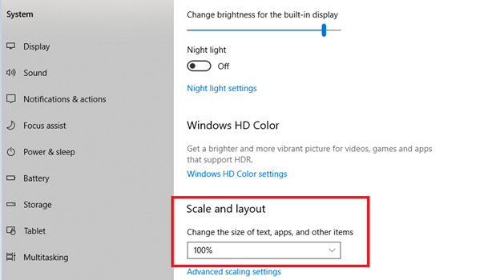

# No se puede ver el calendario

## Problema

No puede ver el calendario al editar la fecha de caducidad de un perfil externo.

## Descripción

Cuando un administrador intenta editar la fecha de caducidad de un perfil de inscripción externo y hace clic en el calendario para editar la fecha de caducidad, el calendario no aparece.

## Causa

El problema se debe a lo siguiente:

* El nivel de zoom del navegador es superior al 100 %.
* La escala y el diseño de los ajustes de visualización superan el 100 %.

## Solución

### Navegador

1. Inicie el navegador.
1. Inicie sesión en Adobe Learning Manager.
1. En la barra de direcciones, haga clic en el icono de zoom.
1. Haga clic en **[!UICONTROL Restablecer]**.
1. Cambie la fecha de caducidad del perfil de inscripción.

### Configuración de visualización

1. Haga clic en **[!UICONTROL Inicio]** > **[!UICONTROL Configuración]** > **[!UICONTROL Sistema]**.
1. Haga clic en **[!UICONTROL Mostrar]**.
1. En la sección **[!UICONTROL Escala y diseño]**, utilice la lista desplegable. Cambie la configuración al 100 %.

   

   *Cambiar configuración de pantalla*

1. Reinicie el equipo.
