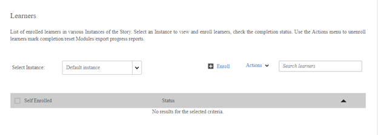

# No se pueden ver los alumnos de un curso

## Problema

No puede ver a los alumnos inscritos en un curso.

## Descripción

La ficha Alumnos de un curso no muestra ningún alumno inscrito. Sin embargo, si genera un informe, puede ver los alumnos inscritos en el mismo.

*No se muestra ningún alumno*

## Causa

Si un alumno se inscribe a través de un objeto de aprendizaje superior (programa de aprendizaje o certificación), el alumno estará visible en la ficha Alumno del objeto de aprendizaje superior. El alumno no podrá realizar búsquedas en la ficha Alumnos del curso.

**Cómo ver a qué objeto de aprendizaje superior se inscribe el alumno?**

Puede consultar esta información en el informe Transcripciones de aprendizaje. Para generar una transcripción de alumno, siga los pasos que se indican a continuación:

1. Inicie sesión como Administrador.
1. Haga clic en **[!UICONTROL Informes]** > **[!UICONTROL Informes personalizados]** > **[!UICONTROL Informes de Excel]** > **[!UICONTROL Transcripciones de alumnos]**.

1. Escriba el nombre del **[!UICONTROL alumno]** y especifique el intervalo de **[!UICONTROL fecha]**.
1. Expanda la sección **[!UICONTROL Opciones avanzadas]** y seleccione la opción **[!UICONTROL Activar información a nivel de módulo]**.
1. Haga clic en **[!UICONTROL Generar]**.

   En la transcripción del alumno, puede ver a qué objeto de aprendizaje superior se inscribe el alumno.
