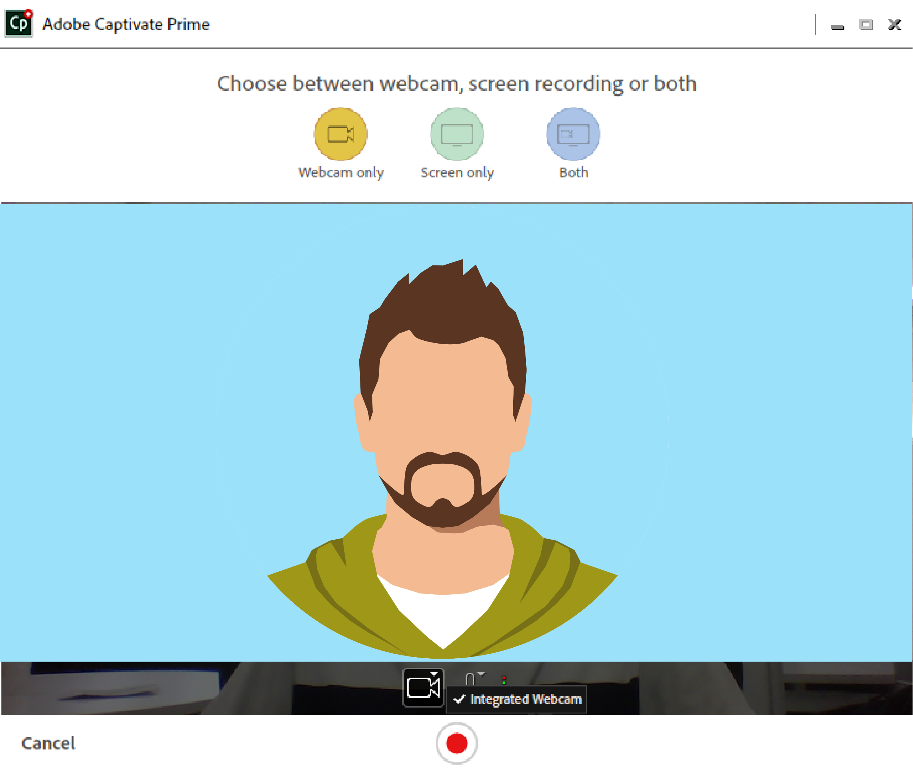
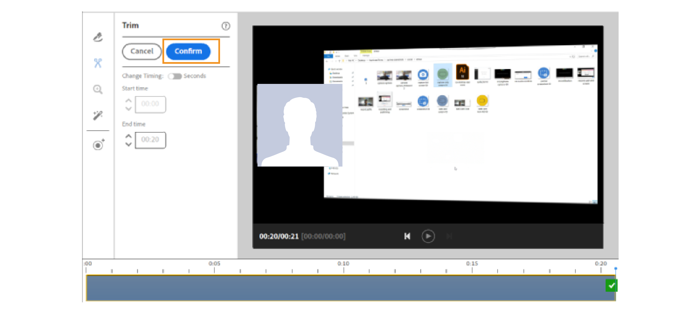

# aplicación de Adobe Learning Manager para escritorio

Aprenda a utilizar la aplicación de escritorio de Adobe Learning Manager para crear y enriquecer contenido que se pueda compartir en Aprendizaje social.

La aplicación de escritorio de Adobe Learning Manager está pensada principalmente para los alumnos que utilizan Aprendizaje social de Learning Manager. Una vez instalada en un escritorio, la aplicación permite a los alumnos crear contenido y publicarlo en tableros en Learning Manager para facilitar el aprendizaje informal, colaborativo y social entre compañeros. Además, la aplicación de escritorio también garantiza que los alumnos reciban notificaciones de Aprendizaje social en su escritorio, incluso aunque no estén necesariamente conectados a la aplicación web de Learning Manager.

Los alumnos pueden crear contenido enriquecido que incluya vídeo, audio y capturas de pantalla, y compartirlos con otros alumnos. El contenido podría ser literalmente cualquier cosa: una demostración o un tutorial de software, una presentación, un podcast o una captura de pantalla anotada de algo que se pueda compartir.

En la página web de Aprendizaje social, haga clic en nueva publicación y seleccione grabar vídeo, grabar audio, tomar una captura de pantalla o la galería de Learning Manager para iniciar la aplicación de escritorio. Para obtener más información sobre el aprendizaje social, [haga clic aquí](feature-summary/social-learning-web-user.md).

Si los usuarios no tienen la aplicación de escritorio, puede descargarla desde la página de Adobe Learning Manager para escritorio. Si no puede descargar, [haga clic aquí](../kb/troubleshooting-issues-with-adobe-learning-manager-desktop-app.md).

Una vez que el usuario haya terminado de instalar la aplicación, debe iniciar sesión en ella con sus credenciales de alumno de Learning Manager. La página de inicio se muestra como la captura de pantalla siguiente.

>[!NOTE]
>
>Los alumnos no podrán utilizar la aplicación de escritorio si Aprendizaje social está desactivado para su cuenta.

<!---->
<!--*Home page*-->

## Creación de un vídeo {#creatingavideo}

La aplicación de escritorio permite al usuario grabar la web, la pantalla y ambas cosas.

<!---->
<!--*Record web, screen, or both*-->

Haga lo siguiente para realizar una grabación de vídeo y publicarla en la plataforma web de aprendizaje social:

1. Asegúrese de que se cumplen los requisitos de hardware y software. Consulte [Requisitos del sistema](../system-requirements.md) para obtener más información.
1. Para iniciar una grabación desde Aprendizaje social, seleccione el icono de grabación de vídeo (web, pantalla, ambos), que abre la aplicación de escritorio de Learning Manager. En la aplicación de escritorio con el usuario conectado, el contenido se puede crear y, a continuación, publicar.
1. Para empezar a grabar desde la aplicación de escritorio, inicie sesión en la aplicación utilizando sus credenciales de Learning Manager como alumno.
1. Aparece la página principal.
1. Para crear una publicación, puede elegir una de las tres opciones que se proporcionan en la página principal. Para iniciar la ventana de grabación, haga clic en el icono Grabar vídeo .
1. En función de los requisitos, puede elegir la cámara web, la pantalla o ambos.

   **Cámara web** La cámara web captura al narrador que muestra o presenta un proyecto o aplicación, incluido el audio. Seleccione el icono de cámara web de las opciones anteriores para que aparezca la ventana de Inicio.

   **Pantalla** Grabar las acciones realizadas en la pantalla del monitor. Al seleccionar el icono de pantalla, la pantalla se resalta con un cuadro de diálogo de grabación en el centro de la pantalla.

   **Ambos** Graba las acciones del narrador y de la pantalla. Al seleccionar el último icono, la pantalla se resalta y el usuario obtiene una ventana interactiva junto con ella.

1. Defina las preferencias de grabación.

   **Seleccionar cámara** Haga clic en el icono de la cámara de vídeo en la parte inferior de la ventana de grabación de vídeo. Seleccione una cámara que el usuario desee utilizar entre las opciones especificadas.

   **Seleccionar micrófono** Haga clic en el icono de micrófono situado en la parte inferior de la ventana de vídeo o audio y seleccione un micrófono que el usuario desee utilizar entre las opciones indicadas.

   >[!NOTE]
   >
   >Si el usuario no desea grabar audio con pantalla o vídeo, seleccione la **Ninguno** de la lista desplegable que aparece al hacer clic en el icono de audio.
   >
   >Cuando los usuarios comienzan a grabar su pantalla o ellos mismos, aparece un cuadro de diálogo emergente que les pide que confirmen si desean continuar grabando sin soporte de audio. Haga clic en Sí para continuar.

1. Utilice el botón de grabación para empezar a grabar. La grabación comienza después de la cuenta atrás (3 segundos).
1. Haga clic en el botón de pausa o reanudación para hacer una pausa durante la grabación y reanudarla si lo desea. Para editar la grabación, consulte [Edición de una grabación](adobe-learning-manager-app-for-desktop.md#Editing) y para publicar consulte [Publicar una grabación](adobe-learning-manager-app-for-desktop.md#Publishing).

## Creación de un audio {#creatinganaudio}

<!---->
*Grabación de audio*

Para grabar un audio, haga lo siguiente:

1. Haga clic en el icono de grabación de audio en la ventana de inicio de la aplicación de escritorio de Learning Manager.
1. Asegúrese de subir el volumen del micrófono haciendo clic en el icono de volumen del micrófono y ajustando el volumen.
1. Haga clic en el botón Grabar para iniciar la grabación.
1. Cuando los usuarios terminen de grabar el audio, haga clic en el botón de pausa para detener la grabación.
1. Para previsualizar la grabación, haga clic en el botón de reproducción.
1. Si los usuarios desean grabar un audio adicional en el mismo archivo, haga clic en **[!UICONTROL Currículum]**. Una vez que se alcance la grabación deseada, haga clic en **[!UICONTROL Siguiente]** para guardar el archivo en la ubicación deseada. La grabación se guarda en la galería de la aplicación de Adobe Learning Manager para escritorio, donde los usuarios pueden ver sus grabaciones y capturas de pantalla.
1. Para editar la grabación, consulte [Edición de una grabación](adobe-learning-manager-app-for-desktop.md#Editing) y para publicar consulte [Publicar una grabación](adobe-learning-manager-app-for-desktop.md#Publishing).

## Creación de una captura de pantalla {#creatingascreenshot}

Para tomar una captura de pantalla, haga lo siguiente:

1. Haga clic en el icono de captura de pantalla de la página principal de la aplicación de escritorio de Learning Manager.
1. Para capturar solo una parte de la pantalla, haga clic en el icono Recortar parte de la pantalla. Para capturar la pantalla completa, haga clic en el icono de captura de pantalla completa .

   <!--
   *Capture a screenshot*-->

1. Para ayudar a otros alumnos a comprender y conservar mejor la presentación o el contenido estático, agregue anotaciones al contenido.
1. Para editar la captura de pantalla: [haga clic aquí](adobe-learning-manager-app-for-desktop.md#Editing)y para publicar una captura de pantalla [haga clic aquí](adobe-learning-manager-app-for-desktop.md#Publishing).

## Edición de un vídeo, un audio y una captura de pantalla {#editing}

Una vez guardado el archivo, la ventana de edición aparece instantáneamente en el sistema, donde las grabaciones pueden hacerse para que tengan un aspecto perfecto y profesional, mediante las siguientes opciones:

## Anotaciones (grabaciones de vídeo y capturas de pantalla) {#annotationsvideorecordingsandscreenshots}

Las anotaciones se pueden utilizar en grabaciones de vídeo y capturas de pantalla para resaltar detalles específicos o escribir texto para que lo lean los demás usuarios.

>[!NOTE]
>
>En el caso de los vídeos, los usuarios solo pueden realizar anotaciones en la parte superior de la pantalla.

* Las diferentes anotaciones que se pueden seleccionar son **elipse**, **línea**, **flecha**, **resaltar**, y **texto**.

* Elija un color para cada anotación en el panel colores del panel propiedades de la anotación.
* Para **Texto**, elija las siguientes propiedades: Fuente, negrita, cursiva, encabezado, alineación, color y color de fondo.

>[!NOTE]
>
>Para ver el color de fondo del texto, habilite el color de fondo para sí.

## Recorte (todo tipo de grabaciones de vídeo y audio) {#trimalltypesofvideoandaudiorecordings}

Para recortar o eliminar partes de un vídeo o audio que no sean necesarias, utilice la herramienta de recorte.

Para recortar, haga clic en **[!UICONTROL Iniciar recorte]** o haga clic en el icono más de la cronología para comenzar a recortar. A continuación, haga clic en el botón de pausa del reproductor para detener el recorte. Haga clic en **[!UICONTROL Confirmar]** para completar el recorte.

Las grabaciones se pueden recortar introduciendo el tiempo en el **[!UICONTROL Hora de inicio]** y **[!UICONTROL Hora de finalización]** campos de entrada después de habilitar **[!UICONTROL Cambiar temporización]**.

*Iniciar recorte*

*Confirmar recorte*

## Panorámica y zoom (cualquier grabación de vídeo) {#panampzoomanyvideorecording}

La acción Panorámica y zoom solo se puede realizar en **Ambos** (cámara web y pantalla) grabaciones de vídeo. De forma predeterminada, se selecciona toda la cámara web o pantalla. Seleccione el manejador de esquina y arrastre para seleccionar la parte de la pantalla que se va a mostrar o enfocar. Haga doble clic en la ventana para ver la pantalla completa.

*Panorámica y zoom*

## Promoción de marca (todo tipo de grabaciones de vídeo) {#brandingalltypesofvideorecordings}

Para crear un nombre único para un vídeo junto con un tema coherente, seleccione la herramienta de marca. El objetivo de la promoción de la marca es establecer una presencia significativa y diferenciada en el sistema de gestión del aprendizaje que atraiga y retenga a los alumnos para que vean el vídeo completo.

Para añadir una marca o un tema a un vídeo, haga lo siguiente:

1. Haga clic en el icono de marca del panel de navegación izquierdo en la ventana de edición.
1. Seleccione una **Tema** de las opciones especificadas o los usuarios pueden personalizar su propio tema añadiendo un **inicio**, **fondo,** y **fin** vídeo de su sistema.

   >[!NOTE]
   >
   >Para descargar más temas, haga clic en **Obtener más activos** botón.

1. Añada un texto de título de vídeo y seleccione una ubicación en el **Mostrar en** para que se muestre.

   >[!NOTE]
   >
   >El texto del título solo se puede añadir como parte de un vídeo de promoción de la marca. Se requiere un tema antes de asignar un título al vídeo de promoción de la marca.

1. Añada un nombre de presentador y un título de presentador al vídeo, si es necesario. Escriba un número dentro del intervalo de tiempo del vídeo en el campo Mostrar en cabezal de reproducción para el nombre y el título del presentador que se va a mostrar mientras se reproduce el vídeo.
1. Añada un icono de marca en el lado izquierdo o derecho de la pantalla de vídeo si es necesario. Para seleccionar un icono de marca, haga clic en **[!UICONTROL Seleccionar]** > **[!UICONTROL Examinar desde el sistema]**.
1. Para previsualizar el vídeo, haga clic en el botón de reproducción en la pantalla de previsualización.

   

   *Branding*

## Grabación de clips adicionales (todo tipo de grabaciones de vídeo y audio) {#recordingadditionalclipsalltypesofvideoandaudiorecordings}

Es posible grabar clips de audio y vídeo adicionales en un archivo de vídeo o audio existente.

Para iniciar una nueva grabación, haga clic en el icono de clip adicional de grabación. La nueva grabación se inserta en la posición del cabezal de reproducción en la grabación que se está editando.

## Publicación de una grabación de vídeo, una grabación de audio y una captura de pantalla {#publishing}

Una vez que se hayan realizado todos los cambios y ediciones, haga clic en **[!UICONTROL Compartir]** > escriba o busque un **habilidad o tablero** que mejor se relacione con la publicación > **Post**.

<!---->
*Publicación en la web*

## Explorar la galería de escritorio de Learning Manager {#browsingcaptivateprimedesktopgallery}

Todas las grabaciones y capturas de pantalla se guardan en la aplicación de Adobe Learning Manager para escritorio. Para examinar estos archivos, haga clic en **[!UICONTROL Galería]** desde el panel de navegación izquierdo en la página de inicio.

>[!NOTE]
>
>La galería también se puede iniciar desde Aprendizaje social haciendo clic en el icono **Galería de Learning Manager** al crear una publicación.

En la ventana de la galería, escriba el nombre del archivo que está buscando en el campo de búsqueda.

Para crear una nueva grabación desde la ventana de la galería, haga clic en **Grabar nuevo** botón.

Para editar o eliminar un archivo de la galería, haga clic en los tres puntos de la parte inferior del archivo y seleccione su opción en la lista emergente.

## Notificaciones {#notifications}

Las notificaciones de Learning Manager aparecen en la ventana de notificaciones, independientemente de si el alumno ha iniciado sesión o no en la aplicación web de Learning Manager. Las notificaciones incluyen publicaciones o tableros que los usuarios han creado, están siguiendo o en los que han participado. Al hacer clic en la notificación, el usuario se dirigirá a la web de Aprendizaje social de Learning Manager.

Para silenciar las notificaciones, haga clic en **[!UICONTROL Menú Perfil*]* > **[!UICONTROL Configuración] > **[!UICONTROL Silenciar notificaciones]**.

## Configuración en la aplicación de escritorio de Adobe Learning Manager {#settingsinadobecaptivateprimedesktopapplication}

En la **Configuración** , cambie la siguiente configuración:

Silenciar notificaciones, aplicación de inicio automático, aplicación de actualización automática, permitir la mejora del producto.

Los usuarios también pueden cambiar la ubicación de la galería haciendo clic en **Cambiar** hipervínculo.

*Configuración de la aplicación Adobe Learning Manager*
