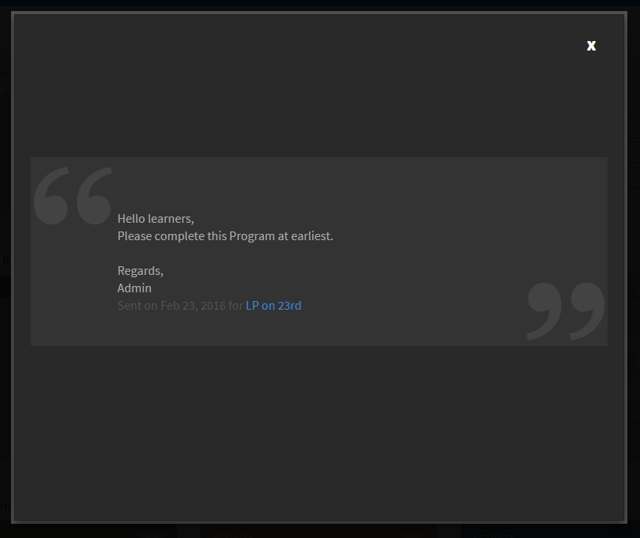

# Anuncios

Un anuncio es un mensaje multimedia (texto, imagen o vídeo) que un administrador difunde entre un determinado conjunto de usuarios.

El administrador puede difundir mensajes entre los alumnos para informarles de la existencia de un evento o una actividad. Cuando un anuncio se difunde entre un determinado grupo o entre usuarios de objetos de aprendizaje, todos los alumnos asociados al grupo de destino reciben notificaciones.

## Notificación de anuncios {#announcementsnotification}

Aparece un mensaje de difusión de notificación en el tablero del alumno como barra de título resaltada. Si el alumno no está conectado en el momento en que se realiza el anuncio, la notificación aparece cuando ese alumno inicia sesión en la aplicación Learning Manager. Asimismo, los alumnos pueden ver los anuncios antiguos de notificaciones.

*Notificación de anuncio pendiente*

Al hacer clic en Ver, se puede ver una lista de anuncios. Esta es una lista de anuncios de muestra:

*Ver todos los anuncios*

## Un anuncio de muestra {#asampleannouncement}

A continuación se ofrece un anuncio de muestra para tenerlo como referencia.

*Ver detalles de un anuncio*
