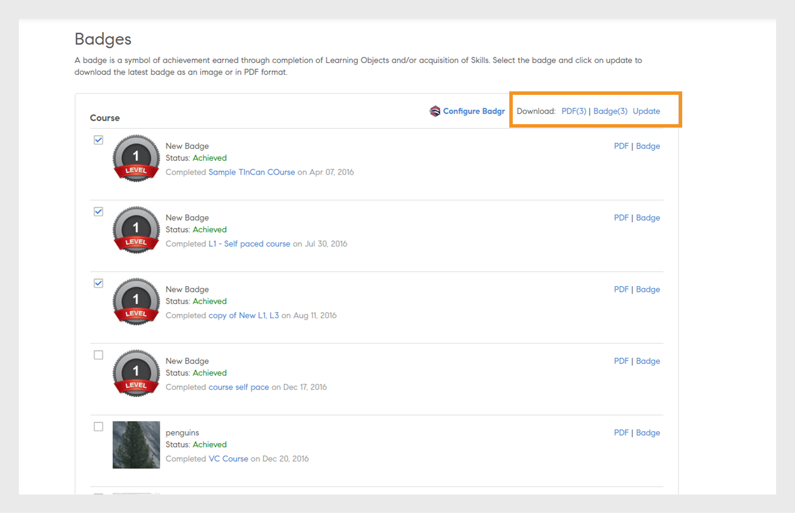

# Insignias

Obtenga información sobre cómo ver y descargar insignias mediante la aplicación de alumno de Learning Manager.

## Insignias {#Badges-1}

Las insignias son logros que el empleado puede ganar por la realización de un curso. Adobe Learning Manager presenta uno de los conceptos de aprendizaje electrónico más recientes denominado Insignias. Los profesionales de todo el mundo utilizan estas insignias como representación de aptitudes o logros de aprendizaje.

Las insignias ayudan a los alumnos a definirse mejor y a mostrar su conjunto específico de aptitudes, además de aportar credibilidad y buena visibilidad para los alumnos.

## Cómo ver y descargar insignias {#viewinganddownloadingbadges}

En calidad de alumno, puede ver insignias en el widget Mis logros en la página de inicio del alumno. Aparece una lista de insignias en la parte superior de la página, junto a su perfil. A la vez, solo puede ver hasta siete insignias en la página principal. Sin embargo, puede ver la lista completa de insignias en el cuadro de diálogo, al hacer clic en cualquier insignia.

Las insignias obtenidas recientemente se muestran en la parte situada más a la izquierda de la lista de insignias que aún se deben obtener. Puede que note una opacidad del 40 % para las insignias que aún se deben obtener respecto de las insignias obtenidas, lo cual facilita la identificación.

Haga clic en cualquier insignia para obtener una lista de todas las insignias adquiridas por usted. También puede ver todas las insignias disponibles alineadas con los cursos respectivos. En las insignias que aún no se han alcanzado, haga clic en el nombre del curso para ver el curso alineado con la insignia. A continuación, se proporciona una captura de pantalla de muestra como referencia.

Haga clic en **[!UICONTROL Descargar todas las insignias]** para descargar todas las insignias obtenidas en formato zip. También puede descargar una insignia individual si hace clic en el icono del cubo junto al nombre de cada insignia.

**Descargar insignia como PDF**

También puede descargar un conjunto de insignias o una insignia individual en formato PDF.

* Haga clic en **[!UICONTROL Descargar todos los registros de insignias]** para descargar las insignias adquiridas por usted como PDF.
* Para descargar insignias individuales, seleccione la insignia y haga clic en el icono del PDF junto al nombre de la insignia.

**En el caso de los certificados con vencimiento, es decir, los certificados recurrentes, Learning Manager menciona la fecha de validez del certificado. Las fechas aparecerán en la interfaz de usuario y en el archivo PDF del certificado.**

## Insignias abiertas {#openbadges}

La plataforma de insignias abiertas, compatible con Learning Manager, se está **retirando**. Actualmente, Learning Manager no admite insignias abiertas.

Las insignias abiertas son un estándar para reconocer y verificar el aprendizaje de los alumnos. Puede utilizar estas insignias para mostrar sus logros en línea.

Learning Manager admite el concepto de insignias abiertas para sus alumnos. Puede utilizar las insignias descargadas como insignias abiertas. Cada insignia que descarga tiene la información de metadatos que admite el nuevo estándar de insignias abiertas.

## Compatibilidad con insignias de Badgr

Los alumnos pueden integrar su cuenta de la plataforma de aprendizaje con su cuenta de Badgr. Esto permite a los alumnos compartir insignias en sitios web de redes sociales a través de su cuenta de Badgr. Badgr también ofrece insignias autenticables basadas en el estándar Backpack, lo que significa que las insignias se verifican.

Las insignias abiertas son aquellas que tienen algunos metadatos incrustados en su imagen. Estos metadatos proporcionan información sobre el emisor, el destinatario, la tarea realizada, la validez de la insignia, etc. Se podrá acceder a la mochila de Badgr directamente desde Learning Manager para proporcionar un lugar central en el que almacenar todas las insignias y compartirlas. Los alumnos pueden iniciar sesión en su cuenta de Badgr y establecer la integración. A partir de entonces, las insignias obtenidas en Learning Manager se cargan automáticamente en la cuenta de Badgr.

Una vez que el administrador active la opción **Integración de Badgr**, un alumno puede realizar la integración con Badgr y configurar su insignia. Para realizar la integración, el alumno debe iniciar sesión en la cuenta de Badgr desde Learning Manager.

>[!NOTE]
>
>Learning Manager no ofrece una cuenta de Badgr como parte de esta integración. El alumno debe crear su propia cuenta e integrarse con el administrador de aprendizaje.

El alumno debe tener una cuenta de Badgr creada antes de establecer una conexión desde el administrador de aprendizaje.

En la aplicación del alumno, en la página Insignias, hay una opción denominada Configurar Badgr. Si se hace clic en la opción, se iniciará un cuadro de diálogo en el que el estado de la conexión debe mostrarse como Conectado/No conectado.

## Actualización de insignias

Un alumno puede actualizar su insignia a la más reciente. Para ello, debe seleccionar la insignia y hacer clic en **Actualizar **en la sección superior derecha de la página. Se produce una actualización de insignia en caso de que un administrador o autor modifique la imagen de insignia o la insignia del objeto de aprendizaje.

Este proceso de actualización de la página se denomina reprocesamiento manual. En este caso, la insignia se vuelve a cargar en Backpack de Badgr una vez completado el procesamiento, incluso aunque presente la misma imagen o nombre. Después de actualizar la insignia, el alumno recibe una notificación de que la actualización se ha completado.

## Preguntas más frecuentes {#frequentlyaskedquestions}

**1. ¿Cómo descargar la insignia como alumno?**

En la página de insignias, puede descargar una insignia como imagen o en formato de PDF. Elija una aptitud o un curso y haga clic en **PDF** o **Insignia**.
