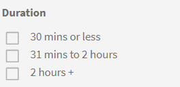

# Catálogos

Obtenga información sobre cómo utilizar catálogos en Learning Manager a fin de ver los objetos de aprendizaje disponibles

**Catálogo** consta de todos los cursos, programas de aprendizaje, certificaciones y ayudas de trabajo disponibles para una función de alumno en la cuenta de la empresa.

Los alumnos pueden ver todos los objetos de aprendizaje asignados y aptos (programas de aprendizaje, cursos y certificaciones) en el **Catálogo predeterminado**. Estos objetos de aprendizaje son exclusivos de cada alumno en función de su función, designación, grupo de usuarios, perfil, etc.

Puede filtrar la lista de objetos de aprendizaje mediante las aptitudes y el tipo de objetos de aprendizaje (con ritmo personalizado, mixto, clase, clase virtual, actividad). También puede filtrar mediante las opciones del panel izquierdo: por objetos de aprendizaje, por aptitudes y por estado de finalización.

Utilice la barra de búsqueda situada en la parte superior de la página para introducir los nombres de los objetos de aprendizaje que ya conoce.

*Ver catálogos*

Como alumno, puede filtrar la formación según su formato, por ejemplo, Clase, Ritmo personalizado o Clase virtual. Además, el alumno también puede filtrar los cursos de formación según su duración. El administrador puede activar o desactivar ahora el filtro Niveles de aptitudes, que ya está disponible.

*Filtrar formación según el formato de la formación*

También puede filtrar según la duración de un curso de formación. El filtro de duración no incluye la duración del trabajo previo y de la prueba.

*Filtrar por duración del curso*

La formación **Duración** y **Formato** los filtros se identifican en función del contenido de formación disponible para la instancia predeterminada y la configuración regional preferida de la cuenta.

Una vez publicado un curso de formación, este puede tardar hasta una hora en que los datos estén disponibles como filtro.
