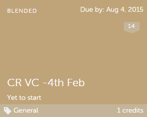

# Cursos

Lea este artículo para obtener información sobre cómo ver y consumir cursos en Learning Manager. Participe en debates y proporcione comentarios.

Los autores crean cursos. Los alumnos pueden realizar cursos y los administradores pueden realizar un seguimiento del rendimiento de los alumnos según el consumo del curso.

## Información general {#overview}

Adobe Learning Manager permite a los alumnos acceder a los cursos, programas de aprendizaje y certificaciones. Los alumnos pueden explorar todos los cursos disponibles mediante el catálogo o si se inscriben en los cursos de su elección. Los alumnos pueden ver todos los cursos en los que se inscribieron y los cursos asignados a ellos en la ficha Aprendizaje.

>[!NOTE]
>
>Los alumnos también pueden instalar la aplicación de iPad de Learning Manager desde Apple Store y la aplicación de Android de Learning Manager desde Google Play y acceder a los cursos en dispositivos móviles. Todas las funciones de los alumnos también están disponibles en la aplicación. Además, los alumnos pueden realizar cursos sin conexión y obtener acceso sin problemas después de conectarse. Consulte [Usuarios de tabletas iPad y Android](ipad-android-tablet-users.md) para obtener más información.

## Cómo ver los cursos {#viewingcourses}

Puede ver una lista de todos los cursos disponibles como alumno. Haga clic en Mi aprendizaje en la página de inicio o en el panel izquierdo para ver todos los cursos en los que se ha inscrito.

*Ver cursos asignados*

Si todavía no ha comenzado el curso, puede hacer clic en el botón Iniciar situado junto al curso. Si ya lo ha comenzado, puede hacer clic en el botón Continuar.

Para ver un curso completado, haga clic en el botón Regresar junto al curso.

Un curso puede tener varias instancias. Haga clic en el nombre del curso para ver los detalles. En el panel derecho, puede ver la fecha límite para cada instancia del curso.

*Ver un curso completado*

## Eficacia del curso {#courseeffectiveness}

La puntuación de la eficacia del curso ayuda a los alumnos a elegir los cursos con las puntuaciones más eficaces según sus necesidades de aprendizaje. La eficacia del curso se evalúa con el fin de comprender la utilidad de un curso para el alumno. Se calcula a partir de comentarios recibidos por el número de usuarios para un curso concreto. Si el porcentaje de alumnos que ofrecen comentarios es alto, la clasificación de la eficacia del curso es alta.

Se trata de una combinación de los resultados de los comentarios de los alumnos sobre el contenido del curso, los resultados de las pruebas del curso de un alumno y los comentarios del responsable que evalúa a un alumno en función de lo aprendido en el curso.

En la página Cursos, un alumno puede ver la clasificación de la eficacia del curso en las vistas en miniatura del curso, tal y como se muestra en la siguiente imagen. Puede ver la clasificación para este curso de 14.

*Ver clasificación de eficacia del curso*

Para ver los detalles de la clasificación de la eficacia del curso, haga clic en el valor de eficacia del curso. Se abre una ventana emergente como se muestra a continuación.

*Ver la eficacia del curso*

Haga clic en la flecha hacia abajo en la esquina inferior derecha de la ventana emergente para ver cómo se realizan los cálculos de la eficacia del curso.

*Cálculo de la eficacia del curso*

## Cómo buscar cursos y programas de aprendizaje {#searchingcoursesandlearningprograms}

Adobe Learning Manager hace que sea más fácil encontrar los cursos de su elección. Puede buscar los cursos de las siguientes maneras:

1. Haga clic en el icono de búsqueda que aparece en la esquina superior derecha. Aparece un campo de búsqueda. Escriba el nombre del curso/programa de aprendizaje o cualquier palabra clave asociada a los cursos. Puede buscar cursos por metadatos, notas, aptitudes, insignias o etiquetas. Las etiquetas permiten la búsqueda en el campo de búsqueda, lo cual significa que las etiquetas se muestran en el campo de búsqueda mientras escribe.
1. El alumno puede ajustar los resultados de búsqueda en la página del catálogo mediante el tipo, las aptitudes, las etiquetas y el estado.

Puede ordenar los cursos por relevancia, nombre o fecha de publicación haciendo clic en Ordenar por y eligiendo en el menú desplegable.

En la página de resultados de búsqueda, puede filtrar los cursos según su **duración** y el **formato** de los cursos. Esto le proporciona una mayor flexibilidad al buscar cursos y le garantiza que encuentre los cursos adecuados para usted.

## Cómo inscribirse en los cursos {#enrollingforcourses}

Los alumnos se inscriben en los cursos de las tres maneras siguientes:

1. El administrador/responsable inscribe a algunos alumnos en cursos obligatorios en función de las necesidades de la empresa.
1. El responsable selecciona algunos cursos para los miembros de su equipo. Obtendrá una notificación con una opción para aceptar o rechazar el curso/programa de aprendizaje. Cuando los alumnos aceptan la nominación, se inscriben en el curso/programa de aprendizaje.
1. Los alumnos pueden inscribirse directamente en un curso/programa de aprendizaje:

   1. Si el curso/programa de aprendizaje es con inscripción propia, el alumno queda inscrito inmediatamente.
   1. Si el curso/programa de aprendizaje es de tipo aprobado por el responsable, el alumno recibe el estado **aprobación pendiente**. Después de la aprobación del responsable, el alumno se inscribe en el curso.
   1. Si los alumnos se inscriben en un curso que ya cuenta con una lista de espera (en el caso de cursos de clase), deben esperar hasta que alguien deje el curso o hasta que el administrador los apruebe para el curso.

Los alumnos pueden inscribirse en una amplia lista de cursos según su elección. En la ficha Cursos se muestran todos los cursos que tiene asignados o en los que se ha inscrito.

Sin embargo, tiene la opción de realizar cualquiera de los cursos que aparecen en el catálogo si mueve el ratón sobre él y hace clic en Explorar. Aparece la página Inscribir. Haga clic en Inscribirme, en la esquina superior derecha de la página, para incluir el curso en la lista Cursos.

Un curso/programa de aprendizaje puede tener varias instancias/sesiones. En el catálogo, haga clic en el nombre del icono del curso/programa de aprendizaje para ver los detalles. Puede ver la opción para inscribirse en la instancia curso/programa de aprendizaje según la fecha límite de cada instancia del curso/programa de aprendizaje.

**Registrar interés en cursos** 

Puede registrarse para expresar interés en cualquier curso de clase que no tenga sesiones planificadas. Recibirá notificaciones cuando la sesión del curso comience a unirse al curso.

>[!NOTE]
>
>Los alumnos deben ver un mensaje de conflicto si se inscriben en dos sesiones diferentes al mismo tiempo o en momentos superpuestos.

## Flujo de trabajo como alumno

Como alumno, solo podrá valorar un curso tras su inscripción en él. Puedes ver el promedio de la valoración basada en estrellas de cualquier curso en la página **Inicio**, la página **Mi aprendizaje** y el **Catálogo**.

1. Inicie sesión como **alumno**. Se carga la **página principal**.

1. Busque un curso. Para ello, introduzca el nombre del curso en la barra de búsqueda. También puedes elegir entre la lista de cursos mostrada haciendo clic en **Mi aprendizaje** o **Catálogo** en el panel izquierdo.

1. Después de seleccionar un curso, haga clic en **[!UICONTROL Inscribir]**.

   
   *Inscribirse en un curso*

1. Seleccione el número de estrellas para valorar un curso según corresponda, siendo 1 la puntuación inferior y 5, la superior. A continuación, haz clic en **[!UICONTROL Enviar]**.

   
   *Enviar clasificación de cursos*

   Un alumno puede volver a enviar los comentarios proporcionando la valoración basada en estrellas varias veces, ya que se tiene en cuenta la valoración más reciente.

1. Se muestra un mensaje de confirmación tras el envío.

   
   *Mensaje de confirmación de comentarios*

   Si desea volver a enviar los comentarios, haga clic en el mensaje. Una vez que se haya enviado la valoración, el mensaje se muestra durante tres segundos y, a continuación, aparece la valoración. Si desea cambiar la valoración, puede seleccionar una estrella diferente y enviarla.

Los cursos se pueden ordenar en función de la valoración media proporcionada. Puede ordenar los casos en el menú desplegable Ordenar por situado en la esquina superior derecha, disponible en **Catálogo**.

## Realizar un curso {#consumingnbspacourse}

Después de inscribirse en un curso, puede comenzar a realizarlo. Para esto, haga clic en el botón Iniciar en el curso. También puede hacer clic en **[!UICONTROL Cursos]** en la ficha **[!UICONTROL Aprendizaje]**. Seleccione un curso que desee comenzar a realizar.

Si todavía no ha comenzado un curso, puede hacer clic en el botón Iniciar situado junto al curso.

Puede ver todos los módulos del curso en una ventana del navegador.

**Funciones del reproductor** 

**índice**: al realizar un curso, el reproductor muestra una tabla de contenido para ese curso en particular en el panel izquierdo de la ventana. Puede hacer clic en cada tema y desplazarse hasta dicho contenido directamente.

**Marcadores**: si alguno de los módulos del curso tiene una tabla de contenido del módulo, los temas de la tabla de contenido del módulo se pueden marcar para consultarlos más adelante. Al marcarlos, aparece un icono de cinta al lado de la entrada del índice. Los marcadores pueden eliminarse haciendo clic en la cinta nuevamente.

**Notas**: hay una provisión disponible para grabar notas mientras realiza el curso. Después de grabar notas, puede guardarlas y descargarlas como PDF, o enviarlas por correo electrónico al Id. de correo electrónico de los alumnos registrados. Al hacer clic en Guardar, podrá elegir la ubicación para guardarlas como un archivo PDF.

*Tomar notas del curso*

**Subtítulos opcionales**: para cursos desarrollados por Adobe Captivate, si los subtítulos opcionales están habilitados durante el desarrollo del curso, el alumno puede ver los subtítulos. Haga clic en CC en la parte inferior del reproductor. La opción de subtítulos solo está disponible para el contenido HTML de Captivate 8.0.2. Para los demás tipos de módulos, la opción CC no aparece en la barra de reproducción.

**Regresar al curso**: puede volver a visitar un curso en dos modos en dos posibles situaciones:

* Haga clic en Regresar cuando el curso esté en estado Completo.
* Haga clic en Continuar cuando el curso esté en estado Incompleto.

**Pantalla completa** Haga clic en el icono Pantalla completa en la esquina inferior derecha del reproductor para ver el curso en la ventana de pantalla completa.

**Botones de navegación** Puede hacer clic en las flechas arriba/abajo para desplazarse por las diapositivas en el contenido de PDF, DOCX y PPTX. Las flechas de la diapositiva pueden utilizarse para desplazarse a los siguientes temas para todos los tipos de contenido.

**Cerrar el curso** Haga clic en el icono de cerrar (x) en la esquina superior derecha del reproductor para salir del curso.

*Después de salir del curso, puede volver a visitar el curso haciendo clic en el botón Regresar en la página de descripción del curso.*

## Valoración basada en estrellas

Solo después de inscribirse en un curso, un alumno puede proporcionar comentarios destacados sobre el curso. En la página Resumen del curso de un curso, el alumno puede valorar el curso con estrellas (1-inferior, 5-superior).

*Proporcionar una valoración basada en estrellas como comentario*

Un alumno podrá seleccionar una estrella en particular (de un total de 5) y enviar la valoración. El alumno también puede editar la selección haciendo clic en una estrella diferente. Una vez enviado, se mostrará un mensaje de agradecimiento por sus comentarios.

Si el alumno desea volver a enviar los comentarios, puede realizar esta acción haciendo clic en el mensaje. El botón **Enviar** se vuelve a habilitar. Un alumno puede proporcionar una valoración basada en estrellas varias veces después de inscribirse en un curso. Siempre se tiene en cuenta la valoración más reciente.

Una vez que el alumno haya proporcionado una valoración, la valoración media de estrellas y el número de alumnos que han proporcionado la valoración aparecen en la página **Resumen del curso**.

*Descripción general del curso*

Para todas las cuentas existentes, esta función está desactivada. Los administradores pueden activarla en Configuración. Solo entonces los alumnos podrán ver las valoraciones basadas en estrellas.

## Tienda de contenido

La opción Tienda de contenido se encuentra en el panel izquierdo de la aplicación del alumno. Al hacer clic en la opción, puede ver todos los cursos/Todo el catálogo y las listas de reproducción revisadas.

En la página siguiente, puede ver los cursos que están presentes en todo el catálogo. Cada curso presenta su duración y el tema más amplio al que pertenece. Puede elegir el tema en el filtro de la izquierda de la página.

Puede previsualizar un curso exactamente durante dos minutos.

*Curso de vista previa en la tienda*

Cuando el administrador le invite a explorar y previsualizar una amplia gama de cursos, aparecerá una notificación.

Como alumno, puede expresar interés por todo un catálogo o cualquier lista de reproducción revisada en la sección **Lista de reproducción revisada**.

*Ver lista de reproducción revisada*

Después de expresar su interés por un curso o formación, el interés se registra y el administrador puede obtener ese registro.

En la aplicación del alumno, todos los administradores tienen acceso a la Tienda de contenido. Si el administrador revoca el acceso, los alumnos no podrán ver la ficha Tienda de contenido.

Los alumnos invitados por el administrador pueden explorar la Tienda de contenido.

>[!NOTE]
>
>Tienda de contenido no es compatible con Internet Explorer 11.

Todos los filtros y otras opciones se muestran en el siguiente vídeo.

### Vista previa del contenido

Puede explorar y previsualizar el curso para ver si este se adapta a sus necesidades de aprendizaje. Haga clic en el botón **Vista previa** y vea la vista previa del curso. La vista previa está disponible durante dos minutos.

*Obtener una vista previa del contenido en la tienda*

## Centro de contenido

El centro de contenido permite a los administradores y a los expertos en la materia preseleccionar listas de reproducción necesarias desde la aplicación del alumno. Una vez preseleccionado, los administradores pueden descargar el formulario de solicitud de compra y compartirlo con el agente de ventas de Adobe.

Un administrador puede invitar a los expertos en la materia a preseleccionar las listas de reproducción en las que están interesados.

El centro de contenido está disponible en la función Alumno para todos los administradores. Los administradores permiten a los expertos en la materia preseleccionar las listas de reproducción que les interese comprar.

La página Centro de contenido está visible de forma continua para los administradores en la función Alumno, lo que les permite preseleccionar listas de reproducción fácilmente. Para ayudarle a seleccionar la lista de reproducción correcta, los administradores pueden hacer que esta página esté accesible para los expertos en el materia de su cuenta. Visite la página Formación empresarial del administrador y realizar los pasos necesarios para proporcionar acceso.

## Elegir instancia de curso {#choosecourseinstance}

Si es un alumno que se ha inscrito en una instancia de curso cuya sesión ha caducado, ahora puede cambiar a otra sesión para avanzar. Esto solo puede hacerse si el programa de aprendizaje es flexible.

Para cambiar la instancia de curso, siga estos pasos:

1. Abra Catálogos > Programa de aprendizaje.

   
   *Seleccionar un programa de aprendizaje*

1. Utilice los botones de opción para elegir si desea ver todos los cursos o cursos con instancias no seleccionadas. Tenga en cuenta que si el alumno ha completado la instancia, no puede cambiar a otra instancia.

   
   *Ver todos los cursos o cursos con instancias no seleccionadas*

1. El menú desplegable de instancias del curso muestra las instancias disponibles. Seleccione la instancia en la lista desplegable.

   
   *Seleccionar una instancia*

1. Para aplicar la instancia seleccionada, haga clic en **[!UICONTROL Actualizar inscripción]**. La opción Actualizar inscripción se encuentra en la parte superior derecha de la página.

   Se inscribe la instancia recién seleccionada. Si un alumno se inscribe en una instancia de curso que forma parte de otro objeto de aprendizaje y actualiza la instancia de curso que forma parte del programa de aprendizaje flexible, se le dará de baja automáticamente de los demás objetos de aprendizaje tras recibir una advertencia.

## Cómo finalizar un curso {#completingacourse}

En calidad de alumno, puede completar la cantidad pertinente de módulos de un curso para finalizar el curso. Los criterios de finalización de los cursos dependen de la cantidad de módulos que el autor haya definido como obligatorios. Cuando se inscriba en un curso con un criterio mínimo de finalización, puede ver dicho criterio en el panel derecho de la página Curso.

*Ver criterios de finalización*

Por ejemplo, si un curso tiene un criterio de finalización de un módulo de un total de dos, bastará con completar un módulo para marcar dicho curso como finalizado. En este caso, cuando finalice el primer módulo, la barra de progreso mostrará el estado de finalización 100 %.

Si los módulos están ordenados por el autor, debe completar la cantidad pertinente de módulos siguiendo el orden a partir del primero. Si los módulos no están ordenados, puede completar la cantidad pertinente de módulos en el orden que quiera.

Tras finalizar un curso con la cantidad obligatoria de módulos, si desea completar los módulos opcionales, puede regresar al curso.

## Ver y participar en debates {#viewingandpariticpatingindiscussions}

Como alumno, puede interactuar con otros alumnos y sus instructores en la ficha Debate. Puede ver las publicaciones de todos los cursos que visualice o en los que se inscriba. Si el administrador ha habilitado los debates para un curso, puede ver la ficha Debate junto a la ficha Notas para ese curso.

Al hacer clic en la ficha Debates, puede ver las publicaciones y los comentarios de ese curso. Si ya se ha inscrito en un curso, también puede empezar a escribir publicaciones o comentarios para que los vean los demás usuarios. Tras escribir el mensaje, haga clic en Publicar. Su publicación debe contener al menos 10 caracteres.

La publicación se ve al instante en la ficha Debates. Puede ordenar las publicaciones como Más recientes primero o Más antiguos primero, y eliminar las publicaciones que haya escrito. Aunque se dé de baja del curso, puede seguir viendo todas las publicaciones y eliminar las que haya escrito.

*Ver discusiones de participantes*

La ficha Debate no está activada para los usuarios externos.

*Ficha Discusión*

## Ciclo de vida del curso {#courselifecycle}

Un ciclo de vida del curso típico tiene el siguiente aspecto:

**Borrador**: cuando un autor termina de crear un curso y lo guarda. En este estado, el curso aún no está disponible para los alumnos.

**Publicado**: cuando un autor termina de publicar un curso. En este estado, el curso está disponible para que los alumnos se inscriban.

**Retirado**: después de publicar un curso, un autor puede moverlo al estado Retirado si no desea que el curso aparezca en el catálogo de cursos para los alumnos.

**Eliminado**: un curso en estado eliminado se elimina cuando se quita por completo de la aplicación de Adobe Learning Manager. Solo los autores pueden eliminar los cursos cuando estos están en estado Borrador o Retirado.

*Descripción general del ciclo de vida de un curso*
