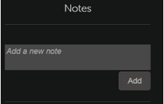
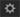

# Reproductor Fluidic

Lea este artículo para saber cómo usar el reproductor Fluidic para los cursos.

El reproductor Fluidic es una plataforma que permite a los alumnos ver contenido con una experiencia de aprendizaje mixta y sin interrupciones. Todos los formatos admitidos se reproducen de manera consistente en este reproductor. Los autores y los administradores pueden obtener una vista previa del contenido con el reproductor.

## Funciones del reproductor {#playerfeatures}

<!---->

**Índice** : Mientras realiza un curso, el reproductor muestra un índice para ese curso en el panel izquierdo de la ventana. Puede hacer clic en cada tema y desplazarse hasta dicho contenido directamente.

**Marcadores** : si los módulos del curso tienen un índice del módulo, puede marcar temas en el índice del módulo para consultarlos más adelante. Al marcarlos, aparece un icono de estrella al lado de la entrada del índice. Los marcadores pueden eliminarse haciendo clic de nuevo en la estrella.

**Notas** : Se ofrece la opción de grabar notas mientras se está tomando el curso. Después de grabar notas, puede guardarlas y descargarlas como PDF, o enviarlas por correo electrónico al Id. de correo electrónico de los alumnos registrados. Al hacer clic en Guardar, podrá elegir la ubicación para guardarlas como un archivo PDF.

*Tomar notas del curso*

**Subtítulos opcionales** : Para los cursos desarrollados por Adobe Captivate, si los subtítulos opcionales están activados durante el desarrollo del curso, el alumno puede ver los subtítulos. Haga clic en CC en la parte inferior del reproductor.

**Regresar al curso** : Puede regresar a un curso de dos maneras, en dos situaciones posibles:

* Haga clic en Regresar cuando el curso esté en estado Completo.
* Haga clic en Continuar cuando el curso esté en estado Incompleto.

**Pantalla** completa Haga clic en el icono de pantalla completa en la esquina inferior derecha del reproductor para ver el curso en una ventana de pantalla completa.

**Botones de navegación** Utilice las flechas hacia arriba/abajo para moverse por las diapositivas del contenido en PDF, DOCX y PPTX. Las flechas de la diapositiva pueden utilizarse para desplazarse a los siguientes temas para todos los tipos de contenido.

**Salto hacia delante/atrás** Mientras reproduce un curso, puede utilizar el  icono para saltar hacia atrás diez segundos y el   icono para saltar hacia delante diez segundos.

**Modificar velocidad de reproducción** Haga clic en el icono  para abrir el cuadro de diálogo de configuración. Aparecerá un mensaje emergente con la palabra &quot;Velocidad&quot;. Haga clic en Velocidad para ver las cinco configuraciones de velocidad disponibles: 0,25x, 0,5x, 1x, 1,5x y 2x. 1x es el valor predeterminado, que es la velocidad de reproducción normal.

*Seleccione la velocidad de reproducción adecuada*

**Modificar los ajustes de volumen:** Utilice el botón de control de volumen para modificar el volumen cuando realiza un curso. Arrastre el control de volumen hacia arriba o hacia abajo para cambiar los ajustes de volumen.

*Ajustar el volumen*

**Cerrar el curso** Haga clic en el icono de cerrar (x) en la esquina superior derecha del reproductor para salir del curso.

Después de salir del curso, puede regresar a este si hace clic en el **botón Regresar** / **Continuar** en la página de descripción del curso.

El reproductor Fluidic también se puede incrustar en una aplicación o un sitio web externo con la API de Learning Manager.

El reproductor Fluidic móvil tiene las siguientes funciones:

* Tocar o tocar la pantalla no debe pausar el reproductor. En su lugar, debería abrir la barra de navegación del jugador.
* Si no se interactúa con la barra de navegación, desaparecerá después de 3 segundos.
* La barra de navegación permanecerá activa hasta que se cierren los elementos del menú de navegación (índice, notas, ajustes).
