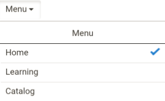
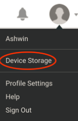
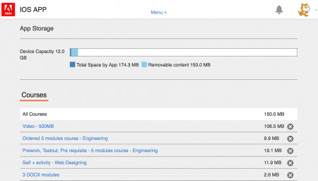

# Primeros pasos como alumno

Empiece a utilizar la aplicación de alumno en Learning Manager.

La aplicación de alumno en Learning Manager está totalmente basada en widgets; gracias a ello, se puede acceder a las diferentes funciones con uno o dos clics.

En la aplicación web Learning Manager, después de iniciar sesión como alumno, puede ver los widgets siguientes en la página de inicio:

**Mi aprendizaje**: puede ver y hacer clic en los objetos de aprendizaje por tipo y por plazo. Haga clic en el círculo del widget Mi aprendizaje para acceder directamente al tipo de objeto de aprendizaje o para ver los objetos de aprendizaje por plazo.

**Mis aptitudes**: ahora puede ver el mapa de actitudes en la esquina superior derecha de la página. Consulte [mapa de aptitudes](skills-levels.md) para obtener más información.

**Widget Objeto de aprendizaje**: está justo debajo de Mi aprendizaje; muestra los objetos de aprendizaje para el usuario. Debajo de Mi aprendizaje, puedes ver todos los [cursos](courses.md), [programas de aprendizaje](learning-programs.md) y [certificaciones](certifications.md) que te has inscrito o que tienes asignados. Puede empezar a consumir un objeto de aprendizaje o regresar a uno desde este widget.

**Calendario de aprendizaje**: este widget muestra la lista de aprendizaje previsto y planificado en su empresa en la empresa por trimestres. El estado de inscripción es Inscrito, si se ha inscrito en un determinado curso.

**Aprendizaje recomendado**: en este widget, puede ver todos los cursos recomendados para su perfil por el administrador o el responsable de su empresa. Puede hacer clic en estos vínculos para navegar a las páginas del curso.

**Mis logros**: obtendrá insignias después de completar los cursos. Estas insignias se muestran junto a su perfil en la parte superior de la página. Haga clic en Insignias para ver información específica. Para obtener más información sobre insignias, consulte la función [insignias](badges.md).

Este widget también muestra los puntos de interacción para el alumno. Haga clic en el vínculo Interacción para ver los puntos con más información y otras funciones de Interacción. Para obtener más información sobre los puntos de interacción y la tabla de posiciones, consulte la función [Interacción](gamification.md).

Si accede a Learning Manager desde una tableta iPad o Android, consulte el tema Aplicaciones de iPad y Android en esta página.

## Línea de tiempo de aprendizaje {#learningtimeline}

La línea de tiempo de aprendizaje muestra a los alumnos la programación con los cursos que deben realizar. En esta sección, podrá ver las alertas para todos los cursos, certificaciones y programas de aprendizaje en orden ascendente de las fechas límite. Las fechas límite en cada una de sus actividades de aprendizaje se muestran en el panel izquierdo.

Haga clic en cada uno de los objetos de aprendizaje en el icono a la izquierda para ver la información correspondiente como tarjetas de cursos en el panel derecho. Puede hacer clic en el icono del curso/programa de aprendizaje/certificación para ver la información completa de cada objeto de aprendizaje.

Deslice el ratón sobre el área de la línea de tiempo para ver la barra de desplazamiento del lado derecho. Utilice la barra de desplazamiento para ir hacia arriba o hacia abajo y ver más alertas.

## Usuarios de aplicaciones de iPad y Android {#ipadandandroidappusers}

En la aplicación de Learning Manager en tabletas iPad o Android, después de iniciar sesión como alumno, puede ver la información en la ficha Inicio de la siguiente manera:

Para desplazarse a las funciones de aprendizaje y catálogo, toque el menú desplegable **Menú** y elija la opción adecuada.

### Acceso a la aplicación sin conexión

Puede acceder a la aplicación Learning Manager sin conexión en tabletas iPad y Android. Descargue y realice cursos en modo sin conexión; vuelva a sincronizar el contenido con la aplicación en línea cuando se conecte a la red.

1. Toque el menú desplegable en la parte superior y toque la opción Aprendizaje. Se muestra una lista de todos los cursos disponibles en iconos.
1. Toque el icono de descarga en la parte inferior de cada icono de objeto de aprendizaje para descargar el contenido de aprendizaje.

   

1. Cuando está en línea, aparece un mensaje en una barra situada en la parte superior de la aplicación para comprobar si desea sincronizar el contenido en línea. Presione la barra en rojo si su respuesta es sí. Una barra de color verde indica que el contenido está sincronizado con la aplicación en línea.

**Controlar el almacenamiento del dispositivo**

Puede controlar el almacenamiento de su dispositivo periódicamente.\
Toque el icono de perfil en la esquina superior derecha de la aplicación y toque la opción de menú **Almacenamiento del dispositivo**.

Aparece un cuadro de diálogo de información de almacenamiento de la aplicación, como se muestra a continuación.

Con la información de almacenamiento de la aplicación, puede comprobar el espacio total del dispositivo, de la aplicación y de los cursos descargados. Esta información le permite descargar cursos según corresponda. Para eliminar cursos descargados en el dispositivo, presione el icono X junto al nombre de cada curso.
