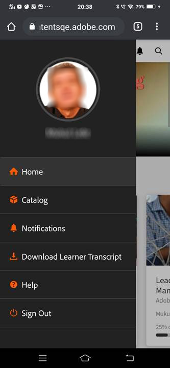

# Aplicación de alumno para móviles y tabletas

Lea este artículo para aprender a descargar la aplicación de alumno de Learning Manager para smartphones y tabletas. Aprenda a realizar los cursos en su móvil o tableta.

## Información general {#overview}

La aplicación de alumno de Learning Manager está disponible para usuarios de teléfonos Android y iPhone. Vaya a Google Play Store (sistema operativo Android) o iTunes (macOS) y descargue la aplicación Learning Manager.

Después de descargar e instalar esta aplicación, inicie sesión en ella con sus credenciales de alumno. Al abrir la aplicación móvil de Learning Manager, se muestra la siguiente pantalla de forma predeterminada.

*La página de inicio de la aplicación de Learning Manager*

## Página de inicio {#homepage}

Para todas las cuentas que tienen activada la opción Diseño envolvente, hay una nueva página de inicio que admite la configuración de Diseño envolvente. La página principal se organiza como una lista de tarjetas para lo siguiente:

|  |  |
|---|---|
|  |  |

*Lista de tarjetas en la página principal*

*Fuente social del alumno*

## Comentarios de valoración {#feedbackrating}

Learning Manager solicita al alumno que proporcione comentarios sobre su experiencia con la aplicación para dispositivos móviles. Esta solicitud de comentarios aparece una vez al mes y proporciona a los usuarios un intervalo de tiempo suficiente para probar la aplicación y, a continuación, proporcionar los comentarios.

<!--
|  | |
|---|---|
-->

Para los usuarios existentes, debería aparecer la ventana emergente de comentarios una vez que cierren el Reproductor por primera vez después de actualizar la aplicación a la versión más reciente.

Tenga en cuenta que la recopilación de comentarios es anónima y solo aparece para los usuarios que han activado la opción **Compartir datos de uso** a través de una configuración en la configuración de la aplicación.

## Descargar insignia {#downloadbadge}

Los alumnos pueden descargar sus insignias en formato de PDF e imagen. En la sección Perfil de usuario, desplácese hacia abajo y haga clic en cualquier vínculo para descargar una insignia. El distintivo descargado se guarda en la carpeta predeterminada del dispositivo. La aplicación le permite abrir la carpeta o el archivo justo después de que finalice la descarga.

|  |
|---|

*Descargar una insignia*

## Diseño interactivo para una experiencia web móvil {#responsive}

Una experiencia web móvil totalmente interactiva que garantiza que los alumnos utilicen sus dispositivos para consumir formación, incluso aunque no hayan instalado la aplicación móvil.

La primera vez que inicie sesión en la aplicación del alumno mediante el navegador del dispositivo, esta se mostrará en forma de un diseño interactivo y sencillo para dispositivos móviles.

La compatibilidad con la interfaz de usuario interactiva para la Web móvil solo está disponible cuando una cuenta **se ha configurado únicamente para el diseño envolvente**. La interfaz de usuario interactiva **no está disponible para el diseño clásico**.

<!--
<table>
 <tbody>
  <tr>
   <td>
    
<strong>Home page</strong>

    
<strong>View options</strong>

    
<strong>Start course</strong>
</td>
   <td>
    
<strong>My Learning List</strong>

    
<strong>View catalog</strong>

    
<strong>Apply filters</strong>
</td>
   <td>
    
<strong>Recommendations based on interest</strong>

    
<strong>View notifications</strong>

    
<strong>Share url</strong>
</td>
  </tr>
 </tbody>
</table>
-->

## Funciones no admitidas en la experiencia móvil envolvente {#unsupportedfeaturesinmobileimmersiveexperience}

Los siguientes flujos de trabajo aparecen en la experiencia clásica para un alumno:

* Varios intentos
* Flexi LP
* Situaciones de carga de archivos
* Proporcionar comentarios de L1

Otras funciones de la aplicación que no se admiten son:

* Aplicación social: se redirigirá a un alumno a la experiencia clásica si este hace clic en el widget Social de la página de inicio.
* Configuración de perfil/editar perfil.
* Ver insignia/aptitudes.
* Tabla de posiciones: se redirigirá a un alumno a la experiencia clásica si este hace clic en el widget Tabla de posiciones de la página de inicio.
* Descargar ayudas de trabajo.
* Opciones de filtro en Buscar.

El Aprendizaje social ahora ofrece experiencias web móviles envolventes.

Hay algunas funciones que no se admiten en la aplicación envolvente para dispositivos móviles. Estos son:

| **Área** | **No admitido** |
|---|---|
| Tablero | Creación de tableros, Edición de tableros, Copiar URL , Eliminar , Informe, Ordenar , Filtrar |
| Publicar | Tipo de encuesta Creación posterior, Editar , Varios archivos adjuntos a la publicación, Copiar URL, Fijar al principio |
| Comentario/ respuesta | Editar, Marcar como respuesta correcta, Cargar imagen/vídeo/audio en comentario o respuesta |
| Medios | Capturar audio (solo carga del archivo de audio) |
| Otros | Notificaciones, Vista de publicación, Tabla de posiciones de Social, Personas a las que sigo y Perfil de usuario |

## Permitir a los alumnos descargar la ayuda de trabajo {#download-job-aid}

En el modo envolvente para dispositivos móviles, un alumno puede descargar una ayuda de trabajo. Toque **Configuración** y, a continuación, pulse **Catálogos**. Descargue una ayuda de trabajo de la lista que aparece.

|  |
|---|

*Descargar una ayuda de trabajo*

## Permitir a los alumnos descargar transcripciones de alumnos {#download-learner-transcript}

En el modo envolvente para dispositivos móviles, un alumno puede descargar transcripciones de alumnos.

|  |  |
|---|---|

*Descargar transcripciones de alumnos*

## Ver insignias y aptitudes {#viewbadgesandskills}

**Visualización de insignias, aptitudes y puntos de interacción**

La pantalla predeterminada muestra las insignias, las aptitudes y los puntos de interacción obtenidos recientemente justo debajo de la información de su perfil. Si utiliza un teléfono, se muestran las insignias obtenidas recientemente. Deslice el dedo a la derecha para ver más información.

**Mis aprendizajes pendientes**

De forma predeterminada, la pantalla muestra los cursos en los que se ha inscrito. El gráfico muestra los aprendizajes vencidos, los que se acercan al plazo y los que están en seguimiento.

Toque un curso para ver los detalles del mismo y su fecha de finalización (si procede). Desde esta pantalla, puede continuar o volver al curso, en función de su estado de finalización.

*Ver aprendizajes pendientes*

**Visualizar catálogos**

Toque el icono junto al icono de libro en la parte inferior de la pantalla. Inmediatamente verá el catálogo con todos los objetos de aprendizaje asociados. Puede elegir verlos en el diseño de cuadrícula o elegir la vista detallada. Seleccione recomendaciones para ver recomendaciones de cursos basadas en su historial de aprendizaje.

*Ver recomendaciones de cursos*

## Ordenar y filtrar objetos de aprendizaje {#sortandfilterlearningobjects}

**Ordenar y filtrar**

Haga clic en el icono de ordenar en la esquina superior derecha de la pantalla de cursos o catálogos para ordenar los objetos de aprendizaje alfabéticamente (de forma ascendente o descendente) o por fecha de publicación. También puede filtrar los objetos de aprendizaje por tipo, estado de finalización, aptitudes o etiquetas. Toque y seleccione el filtro y toque Aplicar para aplicar el filtro.

**Utilizar la funcionalidad de búsqueda**

En la parte superior de la pantalla del teléfono, aparece un icono de búsqueda. Toque dicho icono para buscar los objetos de aprendizaje por metadatos del curso. ID exclusivo, aptitudes, etc.

**Administrar perfiles, configuraciones y notificaciones**

Toque  en la esquina superior izquierda de la pantalla para ver su perfil, las notificaciones y la configuración de la cuenta.

Este menú también permite escanear el código QR para marcar la asistencia a los cursos.

Todo lo que tienes que hacer es pulsar el icono **Escanear código QR** y escanear el código.

**Consumo sin conexión de cursos**

Cuando se consumen cursos descargados mientras se está en línea, Learning Manager accede al curso descargado en lugar de realizar llamadas al servidor.

## Escanear código QR para inscribirse {#qrcode}

Puede escanear un código QR para inscribirse en un curso. Una vez que el administrador del aprendizaje genera un código QR, puede escanearlo desde la aplicación e inscribirse en un curso.

1. Para escanear el código QR, toque  en la esquina superior izquierda de la pantalla.
1. Toque **Escanear código QR**.

La función de escanear QR permite a los alumnos llevar a cabo una de las acciones indicadas a continuación, en función del código QR que genere el administrador del aprendizaje:

* **Inscripción:** Esto permite al alumno inscribirse en un curso digitalizando el código QR.
* **Finalización:** Permite al alumno marcar el curso como completado escaneando el código QR.
* **Inscripción y finalización:** Permite al alumno inscribirse en un curso y marcarlo como completado al mismo tiempo escaneando el código QR.
* **Marcar asistencia:** Esto permite que el alumno marque la asistencia a una sesión concreta digitalizando el código QR.

## Renombrar los objetos de aprendizaje {#renaminglearningobjects}

Los administradores pueden cambiar el nombre de la terminología de los objetos de aprendizaje. Para cambiar el nombre, consulte [Renombrar los objetos de aprendizaje](../../administrators/feature-summary/settings.md#main-pars_header_1570157145).

## Aprendizaje social {#socialmobile}

En esta actualización, no se admiten ciertas funciones. No es posible:

* crear ni seguir un tablero;
* copiar una URL en una publicación;
* Añadir publicación como historia o añadir como publicación como favorita o fijar al principio.
* ver una tabla de posiciones de Social.

Aprendizaje social es una plataforma de la aplicación Learning Manager para dispositivos móviles. En ella, los usuarios pueden compartir ideas y conocimientos valiosos en un entorno informal. Es una metodología que complementa el concepto de aprendizaje tradicional.

Aprendizaje social permite a los usuarios utilizar la experiencia colectiva para obtener información correcta y concisa. A su vez, los alumnos pueden aplicar de inmediato esa información para completar una tarea y lograr un objetivo.

Mediante la aplicación móvil, los usuarios pueden interactuar compartiendo contenido, así como obtener validación para el contenido compartido.

En esta plataforma, se pueden compartir contenido de vídeo, audio, capturas de pantalla, texto, preguntas y encuestas. Los usuarios también pueden compartir su aprendizaje en línea con colegas.

Esta función solo está disponible en la aplicación del dispositivo una vez que el administrador habilita **Aprendizaje social** para la cuenta.

## Iniciar el aprendizaje social en la aplicación {#launchsociallearningontheapp}

Al abrir la aplicación, toque el icono **Social**.

*Ver aprendizaje social*

## Crear una publicación en un tablero {#createapostinaboard}

Como sucede en cualquier otra plataforma social, en la aplicación Learning Manager para dispositivos móviles, puede crear una publicación en un tablero para que todos los alumnos que formen parte de él puedan ver su publicación, comentar y cargar un archivo junto con el comentario.

Para crear una publicación, toque el icono  en la parte inferior derecha de la pantalla.

Aparecerá la pantalla siguiente.

*Agregar una publicación*

<table>
 <tbody>
  <tr>
   <td>
    

</td>
   <td>
    
Escriba una publicación o pegue cualquier URL.
</td>
  </tr>
  <tr>
   <td>
    

</td>
   <td>
    
Tome una foto con la cámara del dispositivo móvil y cárguela con su publicación.
</td>
  </tr>
  <tr>
   <td>
    

</td>
   <td>
    
Grave un vídeo con la cámara del dispositivo móvil.
</td>
  </tr>
  <tr>
   <td>
    
 
</td>
   <td>
    
Grabe audio con el dispositivo móvil.
</td>
  </tr>
  <tr>
   <td>
    

</td>
   <td>
    
Cargue cualquier documento o archivo en el tablero.
</td>
  </tr>
  <tr>
   <td>
    
 
</td>
   <td>
    
Formule una pregunta.
</td>
  </tr>
  <tr>
   <td>
    
 
</td>
   <td>
    
Cree una encuesta con su publicación.
</td>
  </tr>
 </tbody>
</table>

## Formatos de contenido admitidos {#supportedcontentformat}

<table>
 <tbody>
  <tr>
   <td>
    
<strong>Tipo de contenido</strong>
</td>
   <td>
    
<strong>Extensiones</strong>
</td>
  </tr>
  <tr>
   <td>
    
Vídeo
</td>
   <td>
    
wmv, f4v, asf, 3gp, 3g2, avi, mov, h264, m4v, mp4, MPEG, mpg
</td>
  </tr>
  <tr>
   <td>
    
Audio
</td>
   <td>
    
mp3, amr, m4a, wav, wma, aac
</td>
  </tr>
  <tr>
   <td>
    
Archivos estáticos
</td>
   <td>
    
PDF, ppt, pptx, doc, docx, xls, xlsx
</td>
  </tr>
  <tr>
   <td>
    
Imagen
</td>
   <td>
    
jpg, jpeg, png, bmp, gif
</td>
  </tr>
 </tbody>
</table>

Después de crear una publicación, elija el tablero donde desea cargarla. Toque Seleccionar tablero y busque el tablero.

Después de crear una publicación, toque Publicar y publique el comentario para que otros alumnos vean la publicación.

En la aplicación para móviles, no es posible crear un tablero. Para crear un tablero, debe iniciar sesión en la aplicación web como alumno. Para obtener más información sobre cómo crear un tablero, consulte Aprendizaje social en [Learning Manager](/help/migrated/learners/feature-summary/social-learning-web-user.md).

## Acciones que se pueden realizar en una publicación {#actionsthatcanbeperformedonapost}

* Comentar una publicación y, según el permiso que tenga, ver la publicación en un tablero.
* Editar o eliminar comentarios en un tablero.
* Editar o eliminar una publicación según los permisos.
* Informar sobre abusos respecto a una publicación si esta infringe su privacidad o si el contenido es inadecuado. Cuando se informa sobre una publicación, se envía una notificación al administrador y a los moderadores del tablero para que emprendan las acciones oportunas.
* Como    o no me gusta     un puesto.
* Como   o no me gusta  un comentario.

## Crear una publicación en otros tableros {#createapostinotherboards}

También puede crear una publicación en otros tableros.

Toque **Todos los tableros** para ver las actividades del tablero que han llevado a cabo otros alumnos.

*Ver todas las actividades del tablero*

Acceda a la ubicación del tablero correspondiente y publique un comentario.

## Compartir medios en un tablero {#sharemedia}

<!---->

Comparta imágenes, documentos o archivos de audio o vídeo en cualquier tablero, de modo que otros miembros puedan ver su publicación e iniciar una interacción. Para compartir cualquier medio:

1. Abra los medios que desee compartir.
1. Pulse el botón Compartir y elija Administrador de aprendizaje.
1. Elija el tablero en el que desea compartir los medios.
1. Toque **Post**.

También puede publicar cualquier contenido desde una aplicación externa, por ejemplo compartir un comentario de Reddit o Quora.

## Cargar activos en un certificado externo como prueba de finalización {#externalcert}

Siga los pasos a continuación:

1. Inicie sesión en la aplicación del dispositivo utilizando sus credenciales de alumno.
1. Busque el certificado creado por el autor.
1. En la lista de certificados externos, elija el certificado deseado e inscríbase en él.
1. Toque **Prueba de finalización** y cargar un archivo, por ejemplo, un pdf o una imagen.

   |  |  |
   |---|---|
   *Cargar prueba de finalización*

1. Después de cargar un archivo, pulse **Enviar**. Aparece un mensaje de confirmación.

**Cargar un archivo**

1. Después de cargarlo, pulse **Enviar**.

   Solo puede cargar un archivo como prueba de finalización. Si intenta cargar varios archivos, aparece el siguiente mensaje:

   **Se perderán los cambios efectuados. ¿Desea continuar?**

1. El estado cambia a **Aprobación pendiente**, en color naranja.

   No puede ver ni descargar el archivo cargado en la aplicación móvil.

Cuando el responsable aprueba el envío, el estado cambia a **Aprobado**, en color verde.

Si el responsable rechaza el envío, el estado cambia a **Rechazado**, en rojo.

|  |  |  |
|---|---|---|

*Ver estado del envío*

Después del rechazo, puede cargar un archivo como prueba de finalización.

* Solo puede enviar un archivo cuando el estado es **Envío pendiente y Rechazado**.
* No puede enviar un archivo cuando el estado es **Aprobación pendiente y Aprobado**.

## Realizar cursos desde LinkedIn Learning {#linkedin}

Learning Manager ya admite cursos de LinkedIn Learning en la plataforma de aprendizaje. Ahora los alumnos pueden realizar estos cursos de LinkedIn Learning en la aplicación Learning Manager para dispositivos móviles. En la aplicación del dispositivo, busque un curso e inícielo.

Si ya tiene instalada la aplicación LinkedIn, el curso se abrirá en la aplicación o, de lo contrario, se abrirá en el navegador predeterminado, donde deberá iniciar sesión con sus credenciales de LinkedIn.

Si realiza el curso a través de la aplicación LinkedIn, no se realizará un seguimiento de su progreso en Learning Manager. Por lo tanto, se recomienda iniciar el curso en el navegador en lugar de en la aplicación LinkedIn Learning.

>[!NOTE]
>
>Solo puede realizar los cursos si tiene una conexión a Internet activa.

|  |  |  |
|---|---|---|

*Inscribir cursos en LinkedIn Learning*

El tiempo de aprendizaje empleado en los cursos de LinkedIn Learning se comunica mediante el contenido/la plataforma de LinkedIn a la plataforma de aprendizaje de Learning Manager.

Si LinkedIn Learning no envía el tiempo de aprendizaje, este no se podrá registrar en nuestra plataforma de aprendizaje. En tal caso, el tiempo de aprendizaje empleado que muestra Learning Manager es cero.

## Enviar archivos para los módulos Clase y Actividad {#submitfile}

Como alumno, puede enviar archivos a su instructor como prueba de finalización de un curso. El instructor puede aprobar o rechazar el envío, según el contenido del archivo.

Un autor solo puede crear módulos de clase y actividad para que los consuma un alumno en la aplicación móvil.

Una vez que el alumno inicia un curso, puede ver su estado **Envío de archivos** como pendiente junto con el vínculo para cargar el archivo, en la pantalla, como se muestra en la captura de pantalla siguiente.

*Estado del envío del archivo*

Para cargar el archivo, haga clic en **Cargar archivo**.

Cargue cualquier archivo y haga clic en **Enviar** botón.

 

*Enviar un archivo*

## Tipos de archivos compatibles para cargar {#supportedfiletypesforupload}

<table>
 <tbody>
  <tr>
   <td>
    
<b>Tipo de contenido</b>
</td>
   <td>
    
<b>Extensiones</b>
</td>
  </tr>
  <tr>
   <td>
    
Vídeo
</td>
   <td>
    
wmv, f4v, asf, 3gp, 3g2, avi, mov, h264, m4v, mp4, MPEG, mpg
</td>
  </tr>
  <tr>
   <td>
    
Audio
</td>
   <td>
    
mp3, amr, m4a, wav, wma, aac
</td>
  </tr>
  <tr>
   <td>
    
Archivos estáticos
</td>
   <td>
    
PDF, ppt, pptx, doc, docx, xls, xlsx
</td>
  </tr>
  <tr>
   <td>
    
Imagen
</td>
   <td>
    
jpg, jpeg, png, bmp, gif
</td>
  </tr>
 </tbody>
</table>

## Aprobar o rechazar envíos {#approvalorrejectionofsubmission}

Después de cargar el archivo, el estado cambia a **Pendiente de aprobación.**. A continuación, el instructor ve la lista de [envíos pendientes](/help/migrated/instructors/feature-summary/learners.md) y aprueba o rechaza el envío a través de la aplicación web del instructor.

Cuando el instructor aprueba el envío, el estado en la aplicación móvil del alumno cambia a **Aprobado**.

<!---->

Cuando el instructor rechaza el envío, el estado de la aplicación móvil del alumno cambia a **Rechazado**.

<!---->

Para volver a enviar el archivo, haga clic en el vínculo **Cargar archivo**.

## Learning Manager para iPad y tabletas {#captivateforipadandtablets}

En la aplicación de Learning Manager en tabletas iPad o Android, después de iniciar sesión como alumno, puede ver lo siguiente **Inicio** pantalla:

<!---->

Para desplazarse a las funciones de aprendizaje y catálogo, pulse el icono **Menú** y elija la opción adecuada.

<!---->

Tiene la opción de ver el conjunto de cursos en una vista de lista en lugar de la vista de iconos/tarjetas.

## Acceso a la aplicación sin conexión {#accesstheappoffline}

Puede acceder a la aplicación Learning Manager sin conexión en tabletas iPad y Android. Puede descargar cursos y programas de aprendizaje. Tome los cursos, realice los programas de aprendizaje en modo sin conexión y vuelva a sincronizar el contenido con la aplicación en línea cuando se conecte a la red.

1. Toque **Menú** en la parte superior y toque **Aprendizaje** opción. Se muestra una lista de todos los cursos disponibles en iconos.
1. Toque el icono de descarga en la parte inferior de cada icono de objeto de aprendizaje para descargar el contenido de aprendizaje.

   

   *Descargar el contenido*

   Aparece un mensaje en una barra situada en la parte superior de la aplicación para indicar el estado de la red del dispositivo.

   * La barra roja indica que la red no está disponible para el dispositivo.
   * La barra verde indica que la red está de nuevo en línea.

El usuario puede volver al modo en línea haciendo clic en **ver contenido en línea** en la barra verde. El contenido del dispositivo se sincroniza cuando el usuario cambia al modo en línea.

<!--## Track device storage {#trackdevicestorage}

You can monitor your device storage periodically.

Tap the profile icon at the upper-right corner of the app and tap **Device Storage** menu option.

An app storage information dialog appears as shown below.

Using the app storage information, you can check the total space of device, app and the downloaded courses. This information enables you to download courses accordingly. To delete the downloaded courses in the device, tap delete icon adjacent to each course name.-->