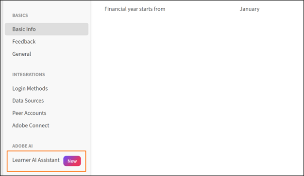
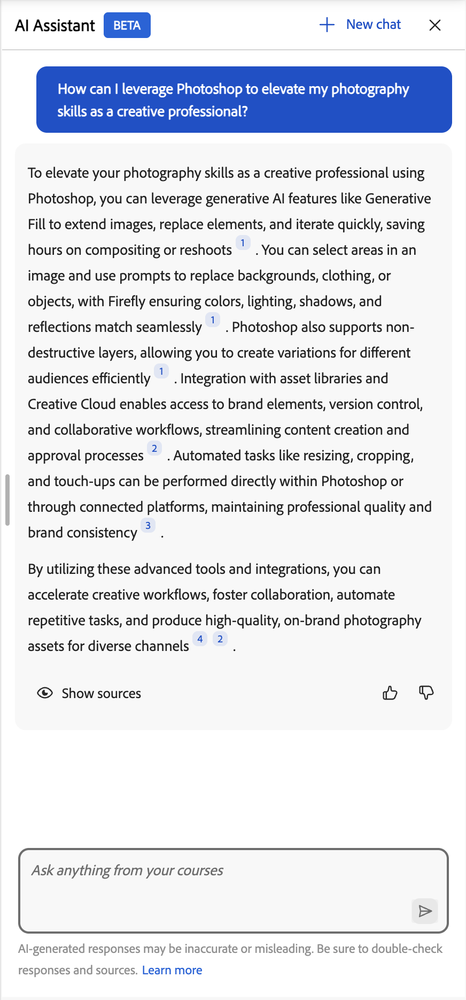
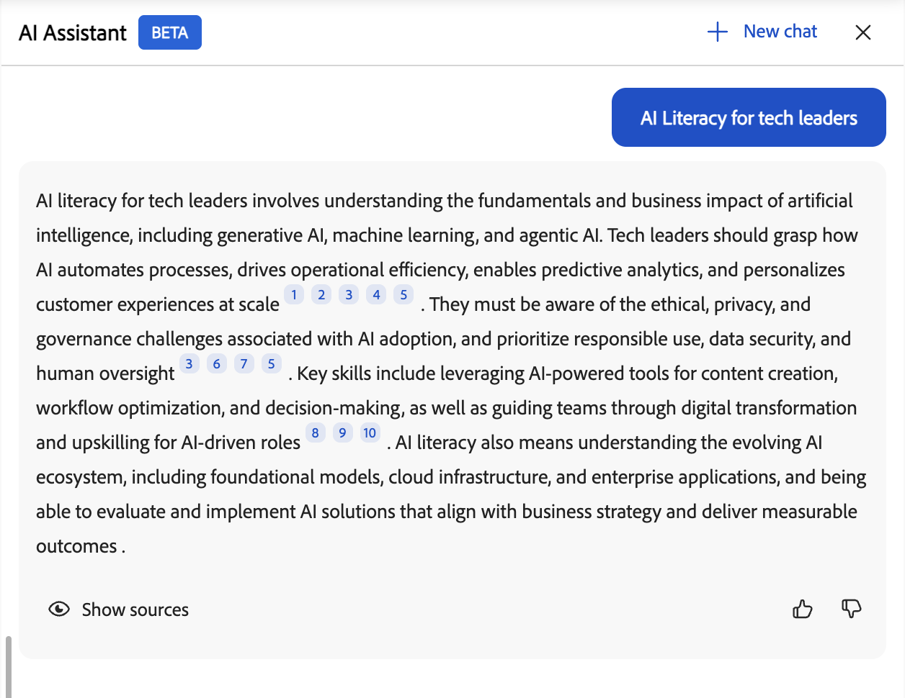

# Asistente de IA para los alumnos

## Introducción

Utilice el asistente de inteligencia artificial para obtener respuestas rápidas y precisas del contenido de aprendizaje asignado, generar resúmenes de cursos, comparar objetos de aprendizaje, encontrar respuestas de procedimientos y crear rutas de aprendizaje personalizadas, todo ello sin tener que desplazarse por cursos enteros.

>[!IMPORTANT]
>
>El Asistente de inteligencia artificial para alumnos está disponible actualmente como función beta. Las capacidades, los escenarios compatibles y las limitaciones pueden cambiar a medida que evoluciona la función.

>[!NOTE]
>
>Esta función no está disponible en entornos autorizados por FedRAMP. Consulte [Disponibilidad de funciones en entornos FedRAMP](/help/migrated/feature-availability-in-fedramp-authorized-environment.md) para obtener más información.

## ¿Qué es el Asistente de IA para alumnos?

El Asistente de IA es un compañero de chat generativo basado en IA en Adobe Learning Manager que ofrece respuestas rápidas y precisas utilizando su contenido de aprendizaje de confianza. Incluye citas para que siempre conozca la fuente de la información.

### Capacidades

- **Respuesta inteligente a preguntas**
  - Conversaciones de una vuelta y varias vueltas
  - Comprensión del lenguaje natural en inglés
  - Respuestas derivadas de cursos, certificaciones, rutas de aprendizaje y ayudas de trabajo
  - Aclaración inteligente de preguntas cuando las consultas son ambiguas

- **Orígenes de contenido y citas**
  - Recupera respuestas de recursos disponibles en catálogos compatibles
  - Proporciona citas con vínculos directos a materiales de origen
  - Admite todos los formatos de contenido de Learning Manager (estático e interactivo): PDF, DOCX, PPTX, XLSX, audio (MP3, WAV, M4A), vídeo (MP4, MOV, WMV), HTML, SCORM 2004 y SCORM 1.2

- **Experiencia de usuario**
  - Interfaz del panel lateral accesible desde todas las páginas del alumno
  - Diseño interactivo que se adapta al área de contenido
  - Historial de chat mantenido en la sesión del navegador
  - Limpiar pizarra en nuevo inicio de sesión o actualización de página
  - Sonido agradable, claro y pedagógico

- **Controles de administrador**
  - Habilitar o deshabilitar la función en el nivel de cuenta
  - Seleccionar los catálogos que se incluyen para las respuestas de AI
  - Requisito de aceptación de las Condiciones de uso conforme a las directrices de IA de Adobe

## Qué puede hacer el Asistente de inteligencia artificial

El asistente de inteligencia artificial es un compañero de chat generativo que responde a las preguntas con el contenido de aprendizaje asignado. Cada respuesta incluye citas con enlaces directos al material de origen para que puedas verificar la información y seguir aprendiendo en contexto.

Además de responder a preguntas, el Asistente de inteligencia artificial puede:

- **Resumir objetos de aprendizaje**: genera una descripción general rápida de cualquier curso, ayuda de trabajo, ruta de aprendizaje o certificación en tu catálogo sin abrirlo
- **Compara objetos de aprendizaje**: identifica las diferencias entre dos cursos en paralelo para decidir cuál se ajusta a tus objetivos de aprendizaje
- **Responder preguntas de procedimiento**: respuestas de origen de la documentación de ayuda oficial de Adobe Experience League para preguntas sobre el uso de Adobe Learning Manager como alumno
- **Consulta contenido de terceros**: haz preguntas sobre los cursos de Go1 o LinkedIn Learning si el administrador ha añadido esos catálogos
- **Crea una ruta de aprendizaje personalizada**: mantén una conversación guiada con el asistente de inteligencia artificial para crear un plan de aprendizaje personalizado y secuenciado basado en tus objetivos, tus antecedentes y el tiempo disponible.

El administrador controla los catálogos que utiliza el Asistente de inteligencia artificial. Si no tiene acceso a un curso, el Asistente para inteligencia artificial no mostrará información a partir de él.

## Tipos de contenido admitidos

El Asistente de inteligencia artificial recupera información del contenido de aprendizaje asignado a usted, que incluye:

- **Documentos:** PDF, Word, PowerPoint, Excel, HTML
- **Medios:** Audio (MP3, WAV, M4A), Vídeo (MP4, MOV, WMV)
- **Contenido interactivo:** SCORM 1.2, SCORM 2004
- **Tipos de objetos de aprendizaje:** cursos, rutas de aprendizaje, certificaciones, ayudas de trabajo

Adobe procesa de forma segura el contenido de aprendizaje mediante servicios de confianza.

### Limitaciones de catálogos y fuentes de contenido

El Asistente de IA solo usa contenido de los catálogos **internos** configurados explícitamente por los administradores.

Las siguientes fuentes de contenido no son compatibles con la versión actual:

- **Catálogos compartidos**
- **Catálogos adquiridos**
- **Catálogos externos**
- **Predeterminado** catálogos
- Bibliotecas de contenido de terceros (por ejemplo, LinkedIn Learning o Go1)

Si no tiene acceso a un curso o una ayuda de trabajo, el Asistente de inteligencia artificial no mostrará la información de ese contenido y no se podrá acceder a los vínculos de citas.

## Casos de uso

### Alumno técnico

Sarah es ingeniera de ventas que está aprendiendo sobre tarjetas gráficas. Necesita entender rápidamente las especificaciones técnicas y las ventajas para responder con confianza a las preguntas de los clientes.

El asistente de inteligencia artificial ayuda a Sarah con lo siguiente:

- Explicación técnica clara de la compleja arquitectura de GPU
- Profundizar en el conocimiento de varias tarjetas gráficas y sus diferencias
- Explicación de los ejemplos para que Sarah pueda relacionar las funciones con casos prácticos del mundo real

### Asistencia al cliente

Marcus es un especialista de soporte en una empresa asociada. Necesita respuestas rápidas sobre las funciones de los productos para ayudar a los clientes sin pasar a los equipos de ingeniería.

El asistente de inteligencia artificial ayuda a Marcus con lo siguiente:

- Encontrar contenido de asistencia relevante para las consultas frecuentes de los clientes
- Hacer preguntas aclaratorias cuando la respuesta inicial no es lo suficientemente específica
- Encontrar recomendaciones para cursos de solución de problemas relacionados para mejorar sus habilidades

### Incorporación de nuevos empleados

Jennifer acaba de unirse a la compañía y se siente abrumada por la cantidad de material de entrenamiento. Necesita una forma de encontrar información específica sin revisar cursos enteros.

El asistente de inteligencia artificial ayuda a Jennifer con lo siguiente:

- Obtención de una guía paso a paso sobre el envío de informes de gastos
- Descubrimiento de cursos sobre las políticas de la empresa sin examinar todo el catálogo
- Guiándola a la sección apropiada de un curso sin hacerla ver horas de video

## Cómo utiliza el contenido el Asistente para inteligencia artificial

El asistente de inteligencia artificial encuentra respuestas precisas a partir del contenido de aprendizaje. Así es como funciona.

### Qué contenido utiliza el Asistente de inteligencia artificial

El Asistente de inteligencia artificial responde a las preguntas utilizando únicamente el contenido de aprendizaje activado por el administrador de la cuenta. El contenido de los catálogos seleccionados se indexa.

El asistente de inteligencia artificial analiza el contenido de aprendizaje asignado para generar respuestas contextuales y enfocadas:

- Cada respuesta incluye citas que hacen referencia al contenido original.
- Puede seleccionar una cita para ir directamente al curso, módulo o documento correspondiente.
- Las citas le ayudan a verificar la información y explorar el contexto adicional cuando sea necesario.

### Respuestas de transmisión

El Asistente de inteligencia artificial proporciona respuestas progresivamente a medida que se generan, para que pueda empezar a leer inmediatamente sin esperar a que se cargue toda la respuesta.

### Citas y transparencia de la fuente

Cada respuesta del asistente de inteligencia artificial incluye citas que se vinculan directamente al curso, módulo u objeto de aprendizaje original. Las citas le permiten:

- Seleccione un número de cita en línea para saltar a la sección de referencia exacta.
- Abra la lista de orígenes completa seleccionando **Mostrar orígenes** en la parte inferior de la respuesta.
- Compruebe la información y explore el contexto adicional de la fuente autorizada.

> **IMPORTANTE**
> El Asistente para inteligencia artificial proporciona respuestas basadas en el contenido habilitado por el administrador. Si no tiene acceso a un elemento al que se hace referencia, verá el mensaje &quot;no admitido&quot; cuando intente abrirlo.

## Mensajes incorporados

El Asistente para inteligencia artificial incluye mensajes integrados que le ayudan a empezar rápidamente con preguntas y situaciones comunes. Estos mensajes le guiarán en la interacción con el asistente y le mostrarán los tipos de preguntas que puede hacer.

Las organizaciones pueden personalizar los mensajes incorporados para reflejar sus objetivos de aprendizaje, funciones, terminología o casos prácticos específicos. Los administradores pueden trabajar con su administrador de éxito de clientes para configurar o actualizar las solicitudes integradas. En la versión actual, no es posible personalizar las indicaciones directamente en la interfaz de Adobe Learning Manager.

## Configurar el Asistente de inteligencia artificial (administradores)

Los administradores seleccionan qué catálogos **internos** pueden acceder a la función Asistente de inteligencia artificial. Asegúrate de que los catálogos que asignes solo incluyan el contenido de aprendizaje apropiado para las respuestas y citas de IA, y que esos catálogos sean **internos** (no **compartidos**, **adquiridos** o **externos**).

Antes de configurar el Asistente de IA, confirme que tiene credenciales de administrador y que tiene catálogos identificados que deben tener acceso.

### Configurar el acceso del Asistente de IA

Para activar el Asistente de inteligencia artificial del alumno:

1. Inicie sesión en Adobe Learning Manager como administrador.

1. Seleccione **Configuración** en la página principal.

   

1. Seleccione **Asistente de inteligencia artificial del alumno (beta)** en el menú **Configuración**.

   

1. Seleccione el conmutador para habilitar el **Asistente de inteligencia artificial del alumno (beta)**.

   <!---->
   <!--5. Select one or more user groups from the **Eligible user groups** option.-->
   <!--5. Select **Save** to apply the user group settings.-->

1. Seleccione uno o varios catálogos en la opción **Catálogos aptos**.

1. Seleccione **Guardar** para aplicar la configuración del catálogo.

>[!IMPORTANT]
>
>Solo se admiten **catálogos internos**. Si se selecciona **Compartido**, **Adquirido**, **Externo** u otro catálogo que no sea interno, el Asistente de IA no mostrará su contenido, aunque aparezca en la lista **Catálogos aptos**.

## Iniciar el Asistente de IA (alumnos)

Para iniciar el Asistente de IA:

1. Inicie sesión en Adobe Learning Manager como alumno.

1. Seleccione **Preguntar al Asistente de IA** en la página principal.

   

1. Cuando aparezca la pantalla **Asistente de inteligencia artificial del alumno**, seleccione **Introducción**.

   

   >[!NOTE]
   >
   >Al iniciar AI Assistant por primera vez, debe dar su consentimiento antes de utilizarlo. El cuadro de diálogo de consentimiento solo aparecerá durante este inicio inicial. Para todos los inicios posteriores, se le dirigirá directamente al Asistente de inteligencia artificial para introducir sus indicaciones.

1. Escriba el mensaje en el campo de texto.

   <!--  -->

1. Presione **Intro** para recibir una respuesta. Revisar la respuesta, las fuentes y las recomendaciones.

Puede realizar lo siguiente:

- Seleccione el número de cita en línea para ir directamente a la sección de referencia exacta
- Abra la lista completa de orígenes seleccionando **Mostrar orígenes** en la parte inferior de la respuesta

El asistente de inteligencia artificial incluye citas con cada respuesta para mostrar de dónde procede la información. Cada cita se vincula directamente al curso, módulo u objeto de aprendizaje original utilizado para generar la respuesta.

Puede seleccionar cualquier cita para abrir la página del curso en Adobe Learning Manager y revisar todo el contenido en su contexto. Las citas le ayudan a verificar la información, explorar detalles adicionales y seguir aprendiendo de la fuente autorizada.

## Acceder al Asistente de inteligencia artificial mediante la búsqueda

También puede iniciar el Asistente de inteligencia artificial directamente desde la barra de búsqueda. Escriba su pregunta en el campo de búsqueda y luego seleccione **Ask AI Assistant** entre las opciones que aparecen.

## Proporcionar comentarios sobre las respuestas de AI Assistant

Sus comentarios sobre las respuestas generadas por el Asistente de inteligencia artificial (Beta) ayudan a mejorar su precisión, relevancia y rendimiento general.

### Indicar si una respuesta le gusta o no

- Selecciona **Pulgares arriba**, elige lo que te haya parecido útil en la respuesta, agrega comentarios de manera opcional y luego selecciona **Enviar**.
- Selecciona **Pulgares abajo**, elige la razón por la que la respuesta no fue útil, añade comentarios y luego selecciona **Enviar**.

## Iniciar una nueva conversación

Iniciar un nuevo chat le permite iniciar una nueva conversación, borrando el contexto anterior para que el asistente pueda centrarse en el nuevo tema sin hacer referencia a interacciones anteriores.

Para borrar la conversación actual e iniciar una nueva conversación, seleccione **Nuevo chat** en la pantalla del Asistente de inteligencia artificial y luego seleccione **Sí**.

El asistente de inteligencia artificial proporciona a los alumnos respuestas rápidas y contextuales, admite varios tipos de contenido y ofrece citas en línea para la transparencia. Los administradores pueden controlar el acceso, lo que garantiza que el asistente de inteligencia artificial se adapte a las necesidades de la organización y mejore la experiencia de aprendizaje.

## Obtener resúmenes y respuestas de objetos de aprendizaje específicos en el Asistente de aprendizaje

El Asistente de aprendizaje de Adobe Learning Manager puede generar un resumen de cualquier curso, ayuda de trabajo, ruta de aprendizaje o certificación del catálogo\. El resumen se obtiene a partir del contenido del curso y las transcripciones de los módulos almacenados en el catálogo.

### Buscar un curso

1. Abra _Asistente de aprendizaje_ en la página principal del alumno.
2. En el panel de chat, escriba / para iniciar una búsqueda de contenido.

>[!NOTE]
>
>Los objetos de aprendizaje no añadidos al catálogo no se pueden buscar. Puede acceder a cualquier contenido al que tenga acceso, pero el Asistente del alumno solo obtiene el resumen del contenido del módulo.

1. Escriba el nombre del curso, la ayuda de trabajo, la ruta de aprendizaje o la certificación que desea resumir\. Aparece una lista de tipos de elementos de catálogo coincidentes.
2. Seleccione el objeto de aprendizaje de la lista.

### Generar un resumen rápido de un curso

Utilice esta función cuando necesite una instantánea rápida y fiable de un curso sin abrirlo por completo\. Los escenarios comunes incluyen:

- Repaso o preparación del aprendizaje
  *Escenario:* Un representante de ventas completó un curso de &quot;Fundamentos de negociación&quot; hace seis meses y ahora tiene una gran llamada de renovación de clientes para mañana. En lugar de volver a ver los cuatro módulos, solicitan al Asistente de aprendizaje que resuma el curso y obtenga un repaso rápido de las tácticas de negociación clave tratadas\.
- Decidir si se inscribe_
  *Escenario:* Un nuevo administrador ve recomendado &quot;Liderar a través del cambio&quot; en su catálogo, pero no está seguro de si es el adecuado para la situación actual de su equipo. Primero piden un resumen, ven que se centra en la administración de cambios en el equipo remoto y deciden inscribirse porque coincide con lo que necesitan.
- Preparar o hacer referencia a topic_
  *Escenario:* Un ingeniero de soporte técnico está a punto de unirse a una llamada de cliente sobre una característica del producto que no ha tocado en mucho tiempo. En lugar de profundizar en un curso de formación de 45 minutos, solicitan al Asistente de aprendizaje que resuma el curso correspondiente para poder actualizar rápidamente los pasos clave y la terminología antes de la llamada.

1. En la entrada de chat, escriba una consulta, como Resumir este curso, o escriba un resumen de este curso.
2. Seleccione **Enviar** para enviar la consulta.
3. El Asistente de aprendizaje genera y muestra un resumen basado en los módulos del curso y el contenido almacenado en el catálogo.

### Prácticas recomendadas

- Utilice nombres de cursos específicos al buscar para obtener resultados precisos de escritura anticipada.
- Puede solicitar resúmenes de cursos, ayudas de trabajo, programas de aprendizaje y certificaciones.
- Revise el resumen para determinar rápidamente si un curso aborda sus objetivos de aprendizaje antes de inscribirse.

## Comparar objetos de aprendizaje en el Asistente de aprendizaje

El Asistente de aprendizaje de Adobe Learning Manager le permite comparar hasta dos objetos de aprendizaje de su catálogo en paralelo. Utilice esta función para comprender las diferencias de contenido, ámbito o enfoque entre dos cursos antes de inscribirse.

### Seleccionar objetos de aprendizaje para comparar

1. Abra _Asistente de aprendizaje_ en la página principal del alumno.
2. En el panel de chat, escriba / para iniciar una búsqueda de contenido.
3. Escriba el nombre del primer objeto de aprendizaje. Aparece una lista de escritura anticipada de elementos de catálogo coincidentes.
4. Seleccione el primer objeto de aprendizaje de la lista.
5. Escriba / de nuevo y busque el segundo objeto de aprendizaje.
6. Seleccione el segundo objeto de aprendizaje de la lista.

>[!NOTE]
>
>Puede comparar un máximo de dos objetos de aprendizaje en una única consulta.

### Solicitar la comparación

1. En la entrada de chat, escriba una consulta, como cuál es la diferencia entre estos dos cursos, o compare estos objetos de aprendizaje.
2. Seleccione _Enviar_ para enviar la consulta.
3. El Asistente de aprendizaje genera y muestra una comparación que resalta las diferencias de contenido entre los dos objetos de aprendizaje.

### Prácticas recomendadas

- Revisa los resúmenes de los cursos individuales antes de compararlos para comprender brevemente cada curso.
- Utilice el resultado de la comparación para identificar qué curso abarca los temas más relevantes para su función o carencia de habilidades.
- Si los elementos de catálogo no aparecen en el tipo\-delante, confirme con el administrador que ambos objetos de aprendizaje forman parte del catálogo asignado.

## Respuestas de Experience League en el Asistente de aprendizaje

Aprenda cómo el Asistente de aprendizaje de Adobe Learning Manager puede responder a las preguntas de los alumnos mediante contenido de Adobe Experience League, incluidos los vínculos a artículos de ayuda relevantes.

### Cómo utiliza el Experience League el Asistente de aprendizaje

El Asistente de aprendizaje de Adobe Learning Manager puede obtener respuestas de [Adobe Experience League](/help/migrated/user-guide.md), el sitio oficial de ayuda y documentación de Adobe. Cuando un alumno formula una pregunta de procedimiento o de procedimiento, el Asistente de aprendizaje puede recuperar una respuesta pertinente e incluir un vínculo al artículo completo del Experience League.

### Qué tipos de preguntas puede responder el Asistente de aprendizaje

El Asistente de aprendizaje puede responder preguntas sobre cómo utilizar Adobe Learning Manager como alumno. Algunos ejemplos son:

- Cómo inscribirse en un curso con nominación de responsable
- Cómo acceder a un programa de aprendizaje o una certificación
- Cómo buscar y ver los cursos completados

Cuando el Asistente de aprendizaje encuentra una respuesta relevante en Experience League, la respuesta incluye un vínculo al artículo de origen para que pueda explorar la documentación completa.

### En qué se diferencia de Admin Assistant

El [Asistente de administración](/help/migrated/administrators/feature-summary/alm-ai-assistant.md) de Adobe Learning Manager ha proporcionado respuestas de origen Experience League para administradores desde versiones anteriores. La mejora de agosto de 2026 amplía esta capacidad al Asistente de aprendizaje orientado al alumno para que los alumnos también puedan obtener ayuda sin salir de la plataforma.

Tanto el Asistente de administración como el Asistente de aprendizaje orientado al alumno utilizan el mismo contenido de Experience League subyacente para generar las respuestas.

## Compatibilidad con contenido de terceros en el Asistente de aprendizaje

El Asistente de aprendizaje de Adobe Learning Manager puede responder preguntas del alumno sobre objetos de aprendizaje a partir de cualquier contenido de terceros disponible en la plataforma, así como contenido nativo de Adobe Learning Manager. Para que los alumnos puedan consultar estos cursos, un administrador debe añadir el catálogo de aprendizaje Go1 o LinkedIn a Adobe Learning Manager.

### Cómo funciona la compatibilidad con catálogos de terceros

>[!IMPORTANT]
>
>Como prerrequisito, un administrador debe añadir los catálogos necesarios al Asistente del alumno. Consulta [Configurar el acceso al Asistente de inteligencia artificial](https://experienceleague.adobe.com/es/docs/learning-manager/using/learner/learner-ai-assistant#configure-ai-assistant-access) para obtener más detalles.

Cuando un administrador añade un catálogo de Go1 o LinkedIn Learning a Adobe Learning Manager, el contenido del catálogo pasa por un proceso de ingesta programado. Una vez completada la ingesta, los objetos de aprendizaje de ese catálogo estarán disponibles para que el Asistente de aprendizaje los consulte.

La ingestión suele completarse en una o dos horas después de que el administrador haya añadido el catálogo.

Una vez completada la ingesta, los alumnos pueden formular preguntas sobre los cursos de Go1 o LinkedIn Learning del mismo modo que consultan el contenido nativo de Adobe Learning Manager\. Por ejemplo, un alumno puede solicitar un resumen de un curso de Go1 o comparar un curso de LinkedIn Learning con un curso de Adobe Learning Manager mediante el comando /.

- Adobe Learning Manager no tiene transcripciones de contenido para contenido de terceros, por lo que no se utilizan para recuperar respuestas. Las respuestas solo se recuperan de los metadatos disponibles, como el título, la descripción y la descripción general.
- Actualmente solo se admite _inglés_.

### Requisitos

Para que el Asistente de aprendizaje consulte el contenido de Go1 o LinkedIn Learning:

- Un administrador debe añadir el catálogo de aprendizaje Go1 o LinkedIn correspondiente a Adobe Learning Manager.
- La ingesta programada del catálogo debe completarse antes de que los cursos estén disponibles para consulta.
- Los objetos de aprendizaje deben formar parte del catálogo asignado al alumno.

## Solución de problemas del Asistente de AI

> **NOTA**
> Después de configurar un nuevo catálogo, espere entre 4 y 5 horas para que el contenido se indexe y esté disponible para las respuestas del Asistente de inteligencia artificial.

### Sin acceso al contenido

**Problema:** Un alumno tiene acceso al Asistente para inteligencia artificial, pero recibe respuestas del tipo &quot;No tengo respuesta a esta pregunta&quot;.

**Posibles causas:**

- Los catálogos del alumno no se incluyen en la configuración del Asistente para inteligencia artificial.
- El contenido relacionado con la pregunta no está en los catálogos seleccionados o los catálogos están vacíos.
- El alumno no tiene visibilidad del contenido relevante.

**Solución:**

- Verifique el acceso al catálogo del alumno.
- Compruebe qué catálogos están activados en la configuración del Asistente de IA.
- Asegúrese de que esos catálogos contengan el contenido correspondiente.
- Espere unas horas después de agregar contenido nuevo para que se indexe.

### Respuestas irrelevantes o de mala calidad

**Problema:** El Asistente para inteligencia artificial proporciona respuestas que no coinciden con la pregunta o son de baja calidad.

**Posibles causas:**

- La pregunta es demasiado amplia o ambigua.
- El contenido relevante tiene metadatos deficientes (descripciones, etiquetas).
- La estructura del contenido dificulta la extracción de información.

**Solución:**

- Anima a los alumnos a hacer preguntas más específicas.
- Revisar y mejorar descripciones y metadatos de cursos.
- Asegúrate de que el contenido tiene encabezados y estructura claros.
- Revise el informe de uso detallado para identificar patrones.
- Plantéate crear ayudas de trabajo para las preguntas frecuentes.

### Preguntas fuera del ámbito

**Problema:** Un alumno hace preguntas no relacionadas con el contenido de formación.

**Ejemplos:**

- Preguntas generales de conocimiento (&quot;¿Quién es el presidente?&quot;)
- Opiniones personales (&quot;¿Qué piensas de X?&quot;)
- Contenido inapropiado

El Asistente de inteligencia artificial está diseñado para responder preguntas basadas únicamente en el contenido de aprendizaje asignado y no responde a consultas fuera del ámbito.

### Los cursos de Go1 o LinkedIn Learning no aparecen en la búsqueda del Asistente de aprendizaje

Confirme con el administrador que el catálogo Go1 o LinkedIn Learning se ha añadido a Adobe Learning Manager y que la ingesta del catálogo se ha completado. La ingestión puede tardar entre una y dos horas después de añadir el catálogo.

### Un curso añadido recientemente aún no está disponible

Espere a que se complete la sincronización del catálogo programado. Si el curso sigue sin aparecer después de dos horas, póngase en contacto con el administrador para confirmar que la conexión del catálogo está activa.
