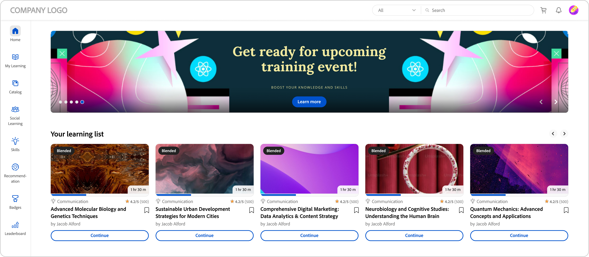
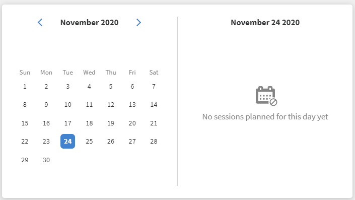

# Página de inicio del alumno

## Información general {#overview}

Una vez que el administrador active el diseño envolvente, el alumno recibirá una interfaz de usuario completamente renovada al iniciar sesión en la aplicación.

>[!NOTE]
>
>El explorador IE11 no admite el diseño envolvente.

## Nueva interfaz de usuario del alumno para el diseño envolvente

>[!IMPORTANT]
>
>Lanzaremos la nueva interfaz de usuario del alumno por fases.

Hemos actualizado la interfaz de usuario del alumno con un diseño más elegante y actualizado. La nueva interfaz de usuario tiene como objetivo proporcionar una experiencia de usuario coherente en las páginas de inicio de **[!UICONTROL Learner Home]**, **[!UICONTROL My Learning]**, **[!UICONTROL Catalog]** y **[!UICONTROL Course Overview]**. Los nuevos elementos visuales siguen los estilos de diseño actuales, lo que hace que el producto parezca más fácil de usar y atractivo. Esta actualización incluye una nueva cabecera, un panel lateral y widgets contemporáneos.

>[!NOTE]
>
>La interfaz de usuario renovada solo se aplica al diseño envolvente. La aplicación/web móvil aún no admite estos cambios y los actualizará en una futura versión.

_Interfaz de usuario antigua_

_Nueva interfaz de usuario_

### Homepage

La página de inicio tiene un nuevo diseño con un panel lateral mejorado, un encabezado superior, tarjetas de curso mejoradas y widgets.

_Nueva página de inicio_

### Página Catálogo

Las páginas Catálogo tienen un nuevo aspecto con filtros organizados y tarjetas de curso mejoradas para proporcionar una mejor experiencia de usuario.

_Página de catálogo_

### Página Resumen del curso

La página de descripción general del curso tiene un nuevo aspecto con más detalles sobre el curso. Esta página ayuda a los alumnos a obtener toda la información que necesitan.

_Página de descripción general del curso_

### Tarjetas del curso

Las tarjetas del curso también presentan un diseño rediseñado para mostrar los detalles de manera más eficaz. Las tarjetas de curso renovadas resaltan los metadatos relevantes necesarios para la inscripción. Estos metadatos incluyen las fechas de publicación o vencimiento, clasificaciones y descripciones correctas, junto con sus autores o proveedores.

_Tarjeta de curso antigua_

_Nueva tarjeta de curso_

Para los cursos importados de **LinkedIn** y la plataforma **Go1**, las tarjetas del curso mostrarán las fechas de publicación originales de **LinkedIn** y **Go1**. También puede ver estas fechas de publicación específicas en la interfaz de usuario.

### Barra lateral y barra de búsqueda

La barra lateral se actualiza con nuevos elementos de la interfaz de usuario para un aspecto más limpio. La nueva barra de búsqueda no tiene botón de búsqueda, lo que le da un aspecto más limpio. Los alumnos pueden escribir una palabra clave y pulsar Intro para iniciar la búsqueda o seleccionar resultados debajo de la barra de búsqueda.

_Barra lateral y barra de búsqueda_

### Cabecera {#masthead}

Incluye un carrusel de vídeos o imágenes con una dirección URL incrustada. El [administrador puede cargar cualquier recurso de imagen o vídeo](../../administrators/feature-summary/announcements.md#masthead) como cabecera y establecer su visibilidad para un grupo de alumnos.

*Ver cabecera*

### Mi lista de aprendizaje {#mylearninglist}

Muestra la formación que ha realizado el alumno. Estos cursos de formación se muestran como tarjetas alineadas horizontalmente. Puede hacer clic en el botón derecho o izquierdo para examinar los cursos.

*Ver mi lista de aprendizaje*

También puede deslizar el dedo hacia la izquierda y hacia la derecha para desplazarse por la lista.

Para reanudar un curso, haz clic en **[!UICONTROL Continuar]** en una tarjeta y se iniciará el reproductor.

El administrador puede activar o desactivar los iconos de cada tarjeta de aprendizaje a través de la aplicación de administración (**Configuración** > **General** > **Habilitar iconos de las tarjetas de aprendizaje**).

**Añadir a Mi lista de aprendizaje**

Si coloca el cursor sobre cualquier tarjeta de curso de las listas **Recomendado en función de sus áreas de interés** y **Recomendado en función de la actividad de los compañeros**, aparecerá una opción para añadir el curso a **Mi lista de aprendizaje**. Haga clic en **[!UICONTROL +]** en la tarjeta del curso y el curso se agregará a **Mi lista de aprendizaje**.

*Añadir a Mi lista de aprendizaje*

## Elegir niveles de aptitudes {#chooseskilllevels}

Como alumno, puede filtrar el catálogo de cursos según estos niveles:

* Principiante
* Intermedio
* Avanzado

Elija una opción y, a continuación, podrá ver el catálogo de cursos según la selección.

*Seleccionar niveles de aptitud*

## Widget de tablero de cumplimiento

El widget del tablero de cumplimiento permite a los alumnos filtrar cursos/rutas de aprendizaje/certificaciones con fechas límite próximas mediante la etiqueta Cumplimiento. Esta función está disponible en todas las aplicaciones de alumno, incluidas las aplicaciones ALM Teams, AEM, aplicación móvil, envolvente y SF.

_Widget de panel de cumplimiento_

## Calendario {#calendar}

Muestra las sesiones y la formación programadas. Examine el calendario para ver la formación de los meses siguientes.

*Ver calendario para sesiones programadas*

El widget Calendario presenta las siguientes funciones. Puede ver:

* Formación por mes. Desplácese hacia la izquierda o la derecha.
* Próximo curso de formación en clase real o virtual en el que puede inscribirse.
* Próximo curso de formación en clase real o virtual en el que se ha inscrito.
* Las sesiones de clase o clase virtual finalizadas
* Curso de formación en clase real o virtual aprobado por el responsable.

Puede aplicar el filtro **[!UICONTROL Ver solo sesiones inscritas]** para ver solo las sesiones inscritas en su calendario.

## Fuente de redes sociales {#socialfeed}

*Ver fuente social*

Vea de qué están hablando otros usuarios.

El widget resume la actividad durante un periodo. Este:

* Muestra los usuarios activos y las actividades de los usuarios que están en su ámbito o grupo.
* Muestra las publicaciones realizadas en las dos últimas semanas.

## Aptitudes del perfil {#profileskills}

Las aptitudes del perfil se utilizan para las recomendaciones de cursos. Si el administrador asigna una aptitud a un usuario o un grupo de usuarios, esta se añade a las aptitudes del perfil del alumno. Si el alumno añade una aptitud a su perfil, todos los niveles de la aptitud se añaden a las aptitudes del perfil del alumno. Cuando un alumno coloca el cursor sobre una aptitud, puede ver el nombre y el método de adición de la aptitud, el nivel, el porcentaje de finalización de la aptitud y los créditos.

*Ver aptitudes de perfil*

Si un alumno se inscribe en un curso, solo las aptitudes externas basadas en una puntuación se añaden a las aptitudes del perfil. Además, un alumno puede buscar, seleccionar y añadir aptitudes externas a su perfil. Si un alumno ha iniciado sesión por primera vez en la aplicación del alumno y sus aptitudes ya están presentes, estas aparecerán en Mi perfil.

## Recomendación en función de su área de interés {#recommendationbasedonyourareaofinterest}

Muestra la formación según el área de interés elegida. La recomendación se basa en un algoritmo de aprendizaje automático.

*Ver cursos recomendados*

Para obtener recomendaciones más específicas, puedes actualizar tus habilidades haciendo clic en **Ver/Actualizar**.

Después de añadir una aptitud, las recomendaciones futuras serán más específicas y se centrarán más en sus preferencias.

Si el administrador ha desactivado la opción **Explorar aptitudes**, podrá añadir intereses a sus aptitudes.

Los cursos recomendados se muestran en forma de tarjetas. Al pasar el ratón sobre una tarjeta, puede ver más detalles del curso.

También se admite la terminología del producto.

**Aptitudes adaptadas al sector**

Podrá ver el gráfico de red de aptitudes si el administrador ha activado la opción **Adaptado al sector** en su aplicación.

Estas aptitudes solo se pueden ver cuando el administrador establece el tipo de formación en Adaptado al sector.

En la visualización Mapa de aptitudes, puede buscar y añadir una o varias aptitudes.

*Visualización del mapa de aptitudes*

Habilite la opción **Mostrar aptitudes para las que hay cursos de formación presentes en mi cuenta** si desea mostrar todas las aptitudes que hay en su cuenta.

Después de añadir una aptitud, puede ver el gráfico basado en fuerzas con la aptitud seleccionada como vértice principal y las aptitudes asociadas como vértices más pequeños.

Las aptitudes seleccionadas también se muestran en la sección **Aptitudes seleccionadas**.

*Aptitudes seleccionadas*

Para añadir las aptitudes, haga clic en **[!UICONTROL Añadir]**.

## Recomendación en función de la actividad de los compañeros {#recommendationbasedonpeeractivity}

Muestra la formación en función de lo que estén realizando sus compañeros. Esto se controla también mediante un algoritmo de aprendizaje automático. Las recomendaciones se basan en la formación personalizada y adaptada al sector de los alumnos.
