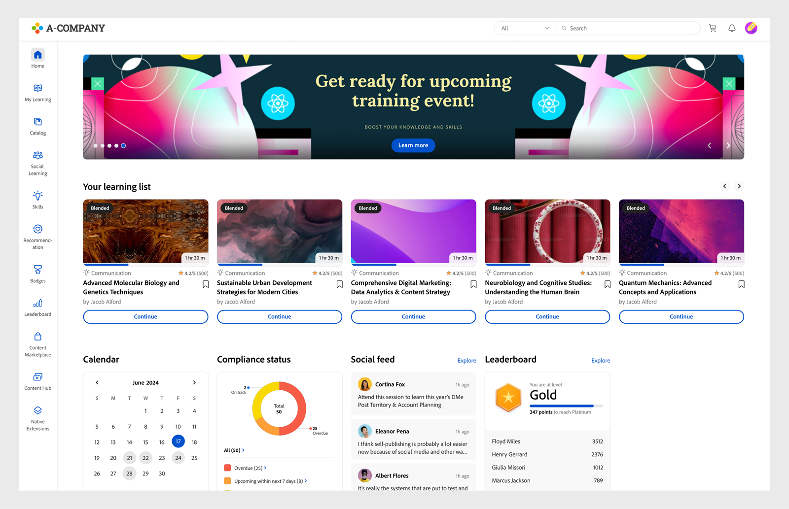
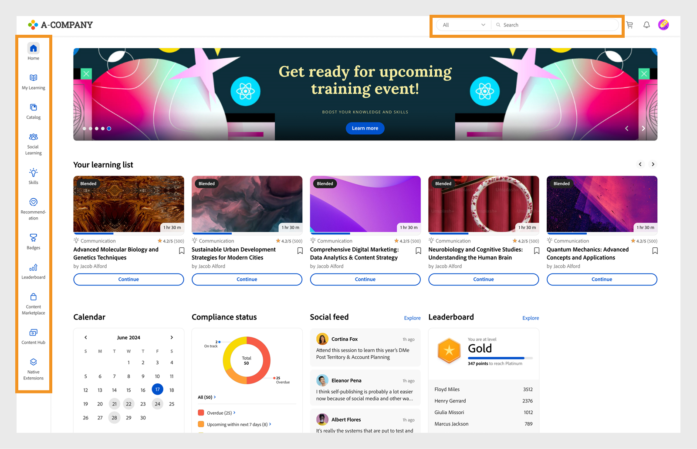

# Página de inicio del alumno

## Información general {#overview}

Una vez que el administrador habilita el diseño inmersivo, el alumno recibe con una interfaz de usuario completamente renovada al iniciar sesión en la aplicación.

>[!NOTE]
>
>El navegador IE11 no es compatible con el diseño inmersivo.

## Nueva interfaz de alumno para el diseño inmersivo

>[!IMPORTANT]
>
>La nueva interfaz de usuario de alumno se publicará en fases.

Hemos actualizado la IU del alumno con un diseño más elegante y actualizado. El objetivo de la nueva IU es proporcionar una experiencia de usuario coherente en las **[!UICONTROL páginas de destino de la página de inicio]** del alumno, **[!UICONTROL Mi aprendizaje]**, **[!UICONTROL Catálogo]** y **[!UICONTROL Descripción general]** del curso. Los nuevos elementos visuales siguen los estilos de diseño actuales, haciendo que el producto parezca más fácil de usar y atractivo. Esta actualización incluye una nueva cabecera, un panel lateral y widgets contemporáneos.

>[!NOTE]
>
>La interfaz de usuario mejorada solo se aplica al diseño inmersivo. La web/aplicación móvil aún no admite estos cambios y los actualizará en una versión posterior.

_Interfaz de usuario antigua_

_Nueva interfaz de usuario_

### Página principal

La página de inicio tiene un nuevo diseño con un panel lateral mejorado, encabezado superior, tarjetas de curso mejoradas y widgets.

_Nueva página de inicio_

### Página Catálogo

Las páginas Catálogo tienen un nuevo aspecto, con filtros organizados y tarjetas de curso mejoradas para ofrecer una mejor experiencia de usuario.

_Página Catálogo_

### Página Resumen del curso

La página de resumen del curso tiene un nuevo aspecto con más detalles sobre el curso. Esta página ayuda a los alumnos a obtener toda la información que necesitan.

_Página de descripción general del curso_

### Tarjetas de curso

Las tarjetas de curso también presentan un diseño rediseñado para mostrar los detalles de manera más efectiva. Las tarjetas de curso renovadas resaltan los metadatos relevantes requeridos para la inscripción. Estos metadatos incluyen fechas, clasificaciones y descripciones correctas publicadas o debidas, junto con sus autores o proveedores.

_Tarjeta de curso antigua_

_Nueva tarjeta de curso_

Para los cursos importados de **LinkedIn y la** plataforma Go1 **, las tarjetas del curso mostrarán las fechas de publicación originales de** LinkedIn **y** Go1 ****. También puede ver estas fechas de publicación específicas en la interfaz de usuario.

### Barra lateral y barra de búsqueda

La barra lateral se actualiza con nuevos elementos de interfaz de usuario para ofrecer un aspecto más nítido. La nueva barra de búsqueda no tiene botón de búsqueda, lo que le da un aspecto más limpio. Los alumnos pueden escribir una palabra clave y pulsar Intro para iniciar la búsqueda o seleccionar los resultados situados debajo de la barra de búsqueda.

_Barra lateral y barra de búsqueda_

### Cabecera {#masthead}

Incluye un carrusel de vídeo o imagen con una URL incrustada. El [administrador puede cargar cualquier activo de imagen o vídeo](../../administrators/feature-summary/announcements.md#masthead) como cabecera y definir su visibilidad para un grupo de alumnos.

*Ver cabecera*

### Mi lista de aprendizaje {#mylearninglist}

Muestra la formación que el alumno ha realizado. Estos entrenamientos se muestran como tarjetas alineadas horizontalmente. Puede hacer clic en el botón derecho o el botón izquierdo para explorar los cursos.

*Ver la lista Mi aprendizaje*

También puede desplazarse a izquierda y derecha para navegar por la lista.

Para reanudar un curso, haga clic **[!UICONTROL en Continuar]** en una tarjeta y el reproductor se iniciará.

El administrador activa o desactiva la apariencia de iconos en cada tarjeta de entrenamiento a través de la aplicación de administración (**Configuración** > **General** > **Activar iconos** de tarjetas de entrenamiento).

**Añadir a Mi lista de aprendizaje**

Si coloca el cursor sobre cualquier tarjeta de curso de las listas **Recomendado en función de sus áreas de interés** y **Recomendado en función de la actividad de los compañeros**, aparecerá una opción para añadir el curso a **Mi lista de aprendizaje**. Haga clic **[!UICONTROL en +]** en la tarjeta del curso y el curso se agregará a la **lista** Mi aprendizaje.

*Añadir a Mi lista de aprendizaje*

## Elegir niveles de aptitudes {#chooseskilllevels}

Como alumno, puede filtrar el catálogo de cursos según estos niveles:

* Principiante
* Intermedio
* Avanzado

Elija una opción y, a continuación, podrá ver el catálogo de cursos según la selección.

*Seleccionar niveles de aptitud*

## Widget del tablero de cumplimiento

El widget del tablero Cumplimiento permite a los alumnos filtrar cursos, rutas de aprendizaje o certificaciones que tienen plazos inminentes utilizando la etiqueta de cumplimiento. Esta función está disponible en todas las aplicaciones de alumnos, incluidas la aplicación ALM Teams, AEM, la aplicación móvil, la aplicación Immersive y la aplicación SF.

_Widget del tablero de cumplimiento_

## Calendario {#calendar}

Muestra las sesiones y la formación programadas. Navegue por el calendario para ver la capacitación para los meses siguientes.

*Ver calendario de sesiones programadas*

El widget Calendario presenta las siguientes funciones. Puede ver:

* Formación por mes. Desplácese hacia la izquierda o la derecha.
* Próximo curso de formación en clase real o virtual en el que puede inscribirse.
* Próximo curso de formación en clase real o virtual en el que se ha inscrito.
* Curso de formación en clase real o virtual aprobado por el responsable.

## Fuente de redes sociales {#socialfeed}

*Ver feed de redes sociales*

Vea de qué están hablando otros usuarios.

El widget resume la actividad durante un periodo. Este:

* Muestra los usuarios activos y las actividades de los usuarios que están en su ámbito o grupo.
* Muestra las publicaciones realizadas en las dos últimas semanas.

## Aptitudes del perfil {#profileskills}

Las aptitudes del perfil se utilizan para las recomendaciones de cursos. Si el administrador asigna una aptitud a un usuario o un grupo de usuarios, esta se añade a las aptitudes del perfil del alumno. Si el alumno añade una aptitud a su perfil, todos los niveles de la aptitud se añaden a las aptitudes del perfil del alumno. Cuando un alumno coloca el cursor sobre una aptitud, puede ver el nombre y el método de adición de la aptitud, el nivel, el porcentaje de finalización de la aptitud y los créditos.

*Ver aptitudes de perfil*

Si un alumno se inscribe en un curso, solo las aptitudes externas basadas en una puntuación se añaden a las aptitudes del perfil. Además, un alumno puede buscar, seleccionar y agregar habilidades externas a su perfil. Si un alumno ha iniciado sesión en la aplicación de alumno por primera vez y las aptitudes de éste ya están presentes, las aptitudes aparecen en Mi perfil.

## Recomendación en función de su área de interés {#recommendationbasedonyourareaofinterest}

Muestra la formación según el área de interés elegida. La recomendación se basa en un algoritmo de aprendizaje automático.

*Ver cursos recomendados*

Para obtener recomendaciones más específicas, puede actualizar sus habilidades haciendo clic en **Ver/Actualizar**.

Después de añadir una aptitud, las recomendaciones futuras serán más específicas y se centrarán más en sus preferencias.

Si el administrador ha desactivado la opción **Explorar aptitudes**, podrá añadir intereses a sus aptitudes.

Los cursos recomendados se muestran en forma de tarjetas. Al pasar el ratón por encima de una tarjeta, puede ver más detalles del curso.

También se admite la terminología del producto.

**Aptitudes adaptadas al sector**

Podrá ver el gráfico de red de aptitudes si el administrador ha activado la opción **Adaptado al sector** en su aplicación.

Estas aptitudes solo se pueden ver cuando el administrador establece el tipo de formación en Adaptado al sector.

En la visualización Mapa de aptitudes, puede buscar y añadir una o varias aptitudes.

*Visualización de mapas de habilidades*

Active la opción **Mostrar aptitudes para las que hay formación en mi cuenta** si desea mostrar todas las aptitudes que hay en su cuenta.

Después de añadir una aptitud, puede ver el gráfico basado en fuerzas con la aptitud seleccionada como vértice principal y las aptitudes asociadas como vértices más pequeños.

Las aptitudes seleccionadas también se muestran en la sección **Aptitudes seleccionadas**.

*Aptitudes seleccionadas*

Para añadir las aptitudes, haga clic en **[!UICONTROL Añadir]**.

## Recomendación en función de la actividad de los compañeros {#recommendationbasedonpeeractivity}

Muestra el entrenamiento basado en lo que sus compañeros están tomando. Esto se controla también mediante un algoritmo de aprendizaje automático. Las recomendaciones se basan en la capacitación de alumnos personalizados y alineados con la industria.
