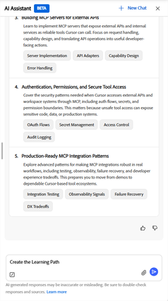

# Qué es el agente de rutas de aprendizaje

Un agente de rutas de aprendizaje crea una ruta de aprendizaje estructurada mediante el asistente de IA. A diferencia de las rutas de aprendizaje estándar asignadas por el administrador, dichas rutas de aprendizaje se generan mediante una conversación guiada. Describa su objetivo y el agente creará una ruta que se adapte a sus necesidades de aprendizaje.

El agente extrae primero el contenido del catálogo de cursos internos de su organización, priorizando los cursos aprobados y relevantes para su equipo. Si el administrador ha activado contenido de terceros, el agente también puede incluir cursos de proveedores externos conectados para cubrir cualquier laguna en la cobertura. Siempre se le inscribe automáticamente en los cursos dentro de la ruta guardada, para que pueda empezar a aprender de inmediato.

Las rutas de aprendizaje personalizadas están diseñadas para dos casos prácticos principales:

- **Desarrollo de habilidades dirigidas**: Cuando necesita lograr un resultado empresarial específico o alcanzar un objetivo de rendimiento con rapidez, como prepararse para una nueva responsabilidad o cerrar una brecha de habilidades identificada en una revisión.
- **Creación de experiencia profunda**: Cuando quieras pasar de principiante a experto en un dominio, tecnología o disciplina elegidos a lo largo de un periodo de tiempo más largo.

## Cómo funciona el enfoque basado en la conversación

El agente se reúne contigo donde estés. Empiezas por describir lo que quieres aprender en un lenguaje sencillo, con tanto o tan poco detalle como lo tengas. A continuación, el agente le hace preguntas de seguimiento para comprender su función, sus desafíos específicos y cuánto tiempo puede dedicar al aprendizaje cada semana.

A partir de sus respuestas, el agente identifica de 3 a 5 temas de aprendizaje con niveles de competencia sugeridos. Puede revisar estos temas, solicitar cambios o confirmarlos antes de que el agente busque cursos coincidentes. A continuación, el agente genera una ruta de aprendizaje con nombre que muestra cada curso, su descripción, duración y número de módulos. Puede ajustar aún más el trazado antes de guardarlo.

Al guardar la ruta, se le inscribirá automáticamente en todos los cursos. La ruta aparece en tu página de inicio en la sección _Rutas de aprendizaje personalizadas_, lista para comenzar.

### Fuentes de contenido y selección de cursos

El agente selecciona los cursos en función de la relevancia para el objetivo indicado, el nivel de competencia actual, el tiempo total disponible y la actualización reciente del contenido. Cuando el agente no puede encontrar cursos coincidentes para un tema específico en el catálogo disponible, le indica y sugiere que se ponga en contacto con el administrador para solicitar contenido adicional para esa área.

### Rutas de aprendizaje personalizadas en la página de inicio

Todas las rutas de aprendizaje personalizadas guardadas aparecen en la tira de _rutas de aprendizaje personalizadas_ en tu página de inicio. Cada tarjeta muestra el nombre de la ruta, el número de cursos y un botón _Continuar_ para continuar donde lo dejaste.

### Compartir una ruta de aprendizaje

Una vez que haya guardado una ruta de aprendizaje personalizada, podrá compartirla con sus compañeros. El uso compartido les envía un vínculo o una invitación por correo electrónico. Cuando un compañero abre una ruta compartida, puede inscribirse con una sola acción. El uso compartido es útil cuando varias personas de tu equipo tienen objetivos de aprendizaje similares y quieres que sigan el mismo plan estructurado.

### Prácticas recomendadas

- Describe tu objetivo de aprendizaje de la forma más específica posible cuando inicies la conversación. Cuanto más contexto tenga el agente, más relevante será su ruta.
- Proporcione su compromiso de tiempo por adelantado, para que la ruta generada se ajuste a su programación real. El agente entiende el lenguaje natural: &quot;dos noches a la semana&quot; o &quot;30 minutos al día&quot; son ambos válidos.
- Revise los temas sugeridos antes de pedir al agente que genere cursos. Confirmar o ajustar los temas en esa fase ahorra tiempo en comparación con la revisión de la lista de cursos posterior.
- Si un tema no muestra contenido coincidente, anótelo y póngase en contacto con el administrador para solicitar que se agreguen cursos relevantes al catálogo.

## Configurar el agente de rutas de aprendizaje personalizadas

El agente de rutas de aprendizaje personalizadas está activado de forma predeterminada en Adobe Learning Manager cuando se activa la opción Asistente de inteligencia artificial en Configuración.

>[!NOTE]
>
> La visibilidad del contenido sigue las reglas de acceso al catálogo existentes. Un alumno solo verá y recibirá cursos de catálogos a los que ya tiene acceso\. El agente de la ruta de aprendizaje personalizada no omite las restricciones del catálogo.

Dentro de cada origen, el agente clasifica los cursos por su relevancia para el objetivo del alumno y por el nivel de curso que coincide con la competencia declarada por el alumno.

Si no hay cursos coincidentes disponibles para un tema del catálogo, el agente informa al alumno y le sugiere que se ponga en contacto con un administrador para solicitar contenido para esa área.

<!-- 
### Monitor credit usage

The Personalized Learning Path agent consumes AI credits each time a learner generates a path. To monitor and manage usage:

1. In the left navigation of the administrator's home page, select **Billing**.
2. Select the **AI Credits** tab. The **Learning Path** agent appears as a line item in the features list.
3. Review current usage and adjust the credit allocation or usage limit as needed.

>[!CAUTION]
>
>If the credit limit for the Learning Path agent is reached, learners receive an in-app message that the agent is unavailable and are directed to contact an administrator. Increase the allocation to restore access. 
-->

## Creación de una ruta de aprendizaje personalizada con el asistente de inteligencia artificial del alumno

Utiliza el asistente de inteligencia artificial para alumnos de Adobe Learning Manager para generar una ruta de aprendizaje personalizada que se ajuste a tu objetivo, experiencia y tiempo disponible. Luego guárdalo en tu perfil y empieza a aprender de inmediato.

### Abra el asistente de inteligencia artificial del alumno e inicie una conversación

1. Selecciona **Asistente de IA** en tu página de inicio.
2. Escriba su objetivo de aprendizaje en el campo de texto. Sé lo más específico que puedas. Por ejemplo:
   - *Soy desarrollador de software y quiero crear un agente de inteligencia artificial con Cursor.*
   - *Me acaban de ascender a la función de responsable y quiero aprender a manejar conversaciones difíciles.*
   - *Quiero dominar el modelado financiero como analista.*
     

3. Opcionalmente, seleccione _+ Nuevo chat_ para iniciar una nueva conversación si tiene abiertas sesiones anteriores.

Notas:

- De manera opcional, adjunta un documento con el icono de _clip_, como un currículum, un correo electrónico de comentarios del administrador o un resumen del proyecto. El agente utiliza el documento para obtener más información sobre el objetivo de aprendizaje y los antecedentes.
- Seleccione _Enviar_.

### Describir el objetivo y el fondo

El agente responde con un mensaje que reconoce su objetivo y solicita un contexto adicional para adaptar su ruta. Por lo general pregunta sobre:

- _Tu función actual y tus antecedentes_: lo que ya sabes, el tiempo que llevas en tu función o cualquier experiencia relevante.
- _Tus situaciones o desafíos específicos_ te permiten afrontar de inmediato las situaciones del mundo real que necesitas este aprendizaje.
- _Tu dedicación de tiempo_ te permite dedicar el número de horas a la semana al aprendizaje de manera realista.

No es necesario responder a todas las preguntas. La única entrada necesaria es tu objetivo de aprendizaje o desafío. El agente procederá con cualquier contexto que usted proporcione.

>[!TIP]
>
>El agente entiende expresiones de tiempo naturales. Puedes decir &quot;dos noches a la semana&quot;, &quot;unos 30 minutos al día&quot; o &quot;un par de horas los fines de semana&quot;, y el agente lo convierte en horas semanales para estimarlo y confirmarlo contigo.

Escriba su respuesta y seleccione _Enviar_.

Continúe la conversación hasta que el agente presente los temas sugeridos.

### Revisar los temas sugeridos

Después de reunir suficiente contexto, el agente presenta una lista de 3-5 temas de aprendizaje, cada uno con un título, una breve descripción y un nivel de competencia sugerido.

1. Lea atentamente la lista de temas. El agente selecciona los niveles de competencia en función de lo que haya compartido, pero puede solicitar cambios.
2. Para ajustar un tema, por ejemplo, para cambiar el nivel de competencia o intercambiar un tema, escriba sus comentarios en el chat. Por ejemplo, ya tengo algún conocimiento del primer tema. ¿Puedes poner eso en intermedio?
3. Si está satisfecho con los temas sugeridos, confirme respondiendo en el chat o seleccionando el mensaje de confirmación sugerido si aparece uno.

### Revisar la ruta de aprendizaje

El agente busca en el catálogo disponible y crea una ruta de aprendizaje con nombre. La ruta muestra:

- Nombre de la ruta y duración total estimada
- Título, descripción, duración y número de módulos de cada curso
- Indicación de si algunos temas no tienen contenido coincidente disponible

Si algunos temas no tienen contenido coincidente:

El agente le informa de que no ha podido encontrar cursos para esos temas específicos y le sugiere que se ponga en contacto con su administrador para solicitar contenido para esas áreas. La ruta se sigue generando para los temas en los que se encontraron los cursos.

<!-- - Review the path. If you want to change something, for example, remove a course, adjust the scope, or explore different topics. Type your request in the chat\. For example, Can you remove the first course and replace it with something shorter? -->
Cuando esté satisfecho con la ruta, pida al agente que la guarde escribiendo save the learning path.

### Guarda tu ruta de aprendizaje y accede a ella

Al guardar la ruta, el agente confirma la operación de guardar e inscribe automáticamente en todos los cursos de la ruta.

Para acceder a la ruta:

- Seleccione _Ir a la ruta de aprendizaje_ en el mensaje de confirmación para abrirlo inmediatamente, o
- Encuéntrala en la tira de _Rutas de aprendizaje personalizadas_ de tu página de inicio en cualquier momento.

### Compartir la ruta de aprendizaje

Desde la página de descripción general de la ruta, puede compartir la ruta guardada con sus compañeros.

1. Abre la ruta guardada desde la tira de _Rutas de aprendizaje personalizadas_ en tu página de inicio.
2. Seleccione _Compartir_.
3. Comparta el vínculo generado o introduzca las direcciones de correo electrónico para enviar una invitación directa.

Un compañero que reciba el vínculo compartido puede inscribirse en la ruta con una sola acción.

## Prácticas recomendadas

- Proporcionar contexto sobre su función y los retos actuales. Cuanto más específico sea, más relevante será la selección del curso.
- Mencione su compromiso de tiempo semanal en lenguaje natural. El agente confirmará su interpretación antes de generar la ruta.
- Revise los temas sugeridos antes de solicitar la generación de rutas. Ajustar los temas en esa fase es más rápido que revisar la lista de cursos después\.
- Si la ruta generada incluye cursos que ya ha completado, informe al agente. Puede sugerir alternativas.

## Preguntas frecuentes

_¿Dónde puedo encontrar mis rutas de aprendizaje personalizadas guardadas?_

Todas tus rutas guardadas aparecen en la tira de _Rutas de aprendizaje personalizadas_ en tu página de inicio. Cada tarjeta muestra el nombre de la ruta de acceso y un botón _Continuar_. También puede abrir cualquier ruta desde allí para ver su lista completa de cursos y su progreso.

_¿Cuántas rutas de aprendizaje personalizadas puedo guardar?_

La tira de _Rutas de aprendizaje personalizadas_ de tu página de inicio muestra un máximo de 10 rutas.

_¿Qué información debo proporcionar para obtener una ruta de aprendizaje relevante?_

Como mínimo, describe tu objetivo de aprendizaje o el desafío específico que estás intentando abordar. Cuanto más contexto proporcione, mejor será la ruta\. La información útil incluye su función actual, cuánto tiempo ha estado desempeñándola, cualquier experiencia previa relevante y cuántas horas a la semana puede dedicar de manera realista al aprendizaje.

_¿Qué sucede si el agente no encuentra cursos que coincidan con mis temas?_

El agente le indica directamente en la conversación que no pudo encontrar cursos coincidentes para uno o más de sus temas. Genera la ruta utilizando únicamente los temas en los que había cursos disponibles.

Si el agente no encuentra cursos para ninguno de los temas, le informará de que no puede crear una ruta para ese objetivo. En cualquier caso, póngase en contacto con el administrador de aprendizaje y hágale saber qué temas no tienen contenido disponible. Pueden añadir cursos relevantes al catálogo para cubrir futuras solicitudes de rutas.

<!-- 
_How does the agent decide which courses to include?_

The agent prioritizes your organization's internal course catalog above external sources. It selects courses based on relevance to your stated goal, whether the course level matches your proficiency, how recently the content was published or updated, and quality signals such as ratings and completion rates\. Your administrator controls which content sources are available. 
-->

_¿Puedo ajustar los temas en mi ruta de aprendizaje?_

Sí. Durante la conversación, puede solicitar al agente que agregue, quite o cambie temas antes de generar la ruta. El agente actualizará la lista de temas y regenerará la ruta de acceso para que coincida.

_¿Puedo cambiar los cursos individuales en una ruta generada?_

No. Una vez que el agente genera una ruta, se fija la selección del curso. No se pueden intercambiar, quitar ni reemplazar cursos individuales. Lo que recomiende el agente es lo que contiene la ruta.

Si los cursos sugeridos no se sienten bien, el mejor enfoque es volver atrás y ajustar los temas antes de generar. El agente selecciona los cursos en función de los temas que confirme, por lo que si se cambia el ámbito del tema o el nivel de competencia, se generará un conjunto de cursos diferente.

_¿Por qué el agente sigue haciendo preguntas de seguimiento?_

El agente necesita suficiente claridad sobre su objetivo de aprendizaje para identificar los temas relevantes. Si tu mensaje inicial era amplio, como &quot;Quiero aprender marketing&quot;, hará preguntas para reducir el alcance. Proporcionar detalles más específicos sobre su función, los retos a los que se enfrenta y lo que desea poder hacer después de aprender ayudará al agente a pasar a la generación de temas más rápido.