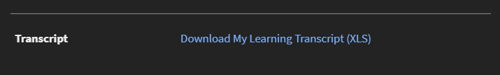

# Configuración de perfil

Lea este artículo para saber cómo configurar los ajustes de perfil del alumno y añadir una foto de perfil. Obtenga información sobre cómo descargar la transcripción del alumno para su perfil.

## Configuración de ajustes de perfil {#configuringprofilesettings}

1. En la esquina superior derecha de la página, haga clic en la flecha desplegable junto a su perfil o fotografía.
1. Seleccione Configuración de perfil.
1. En el cuadro de diálogo emergente que aparece, puede realizar las siguientes acciones:

   * Añadir o actualizar la foto de perfil: pase el ratón sobre la foto. Haga clic en Cargar y añada una foto. Haga clic en Editar para cambiar la fotografía.
   * Eliminar foto: sitúe el cursor sobre la foto de perfil. Haga clic en Eliminar.
   * Añada contenido sobre mí haciendo clic en el área de texto que se encuentra debajo.
   * Modifique el contenido de Acerca de mí haciendo clic en Editar junto al campo.
   * Establezca la Configuración regional de su perfil. En el menú desplegable Configuración regional , seleccione el idioma que desee.
   * Establezca la Configuración regional actual de su perfil.
   * Establezca la zona horaria de su perfil.
   * Descargue la transcripción del alumno con sus datos.

   
   *Ver preferencias de alumno*

   Al hacer clic en el vínculo Descargar la transcripción de aprendizaje XLS , se descarga una hoja de Excel en el sistema. Esta hoja de Excel contiene detalles sobre los objetos de aprendizaje consumidos por usted, el estado de finalización de cada objeto de aprendizaje, las fechas de vencimiento correspondientes, las aptitudes obtenidas, etc. Descargue esta hoja para obtener rápidamente algunos datos generales de su perfil de aprendizaje.

1. Si un administrador ha activado el correo electrónico de resumen y usted no se encuentra en la lista No molestar, puede suscribirse a los mensajes de resumen o cancelar la suscripción. Active la opción siguiente.

   
   *Suscribirse o cancelar la suscripción a los mensajes de correo electrónico de resumen*

   En función de la frecuencia establecida por el administrador, el alumno recibirá el mensaje de correo electrónico con periodicidad quincenal o mensual.

## Cancelar la suscripción a los mensajes de resumen {#unsubscribefromdigestemails}

Cuando reciba un correo electrónico, puede cancelar la suscripción al correo electrónico de resumen haciendo clic en **Cancelar suscripción** en la parte inferior del correo electrónico.

Después de hacer clic **[!UICONTROL Cancelar suscripción]**, se le redirigirá a su **Configuración de perfil** , donde puede desactivar la opción de recibir correos electrónicos.

## Anatomía de un correo electrónico de resumen {#anatomyofadigestemail}

Un mensaje de correo electrónico de resumen consta de las siguientes secciones:

<table>
 <tbody>
  <tr>
   <td>
    
<b>Sección</b>
</td>
   <td>
    
<b>Descripción</b>
</td>
  </tr>
  <tr>
   <td>
    
Resumen de formación personal
</td>
   <td>
    
Esta sección personaliza las métricas de formación de un alumno mencionando el número de minutos dedicados a la formación.

    
En función del tiempo dedicado por el alumno, el contenido se personaliza según las reglas definidas a continuación:

    
Si (tiempo_dedicado) &gt;= 60 minutos, aparece el siguiente texto:

    
<i>"Durante las últimas dos semanas/mes, ha aceptado <b>(tiempo_dedicado)</b> minutos de entrenamiento para mejorar tus habilidades. A continuación, se muestran algunas recomendaciones para que obtenga más información". </i>

    
 Si (tiempo_dedicado) &lt; 60 minutos, aparece el siguiente texto:

    
<i>"Durante las últimas dos semanas/mes, ha aceptado <b>(tiempo_dedicado)</b> minutos de entrenamiento para mejorar tus habilidades. A continuación, se muestran algunas recomendaciones que esperamos que encuentre útiles para empezar y continuar".</i>
</td>
  </tr>
  <tr>
   <td>
    
Actividad de formación
</td>
   <td>
    
Esta sección muestra el resumen de nivel de organización de la actividad de formación de esa cuenta.

    
El resumen de las actividades de formación incluye lo siguiente: 

    <ul>
     <li>Número de cursos de formación disponibles en la cuenta.</li>
     <li>Número de alumnos que han estado consumiendo activamente las actividades de formación.</li>
     <li>Número de horas de aprendizaje dedicadas por los compañeros.</li>
     <li>Tiempo medio (en minutos) dedicado por los compañeros a mejorar sus aptitudes en la cuenta.</li>
    </ul></td>
  </tr>
  <tr>
   <td>
    
Cursos recomendados
</td>
   <td>
    
Se trata de una sección personalizada que incluye los cursos de formación recomendados para los alumnos. En esta sección, un alumno puede ver tres cursos de formación seleccionados por el motor de recomendaciones.

    
Cada curso de formación incluye un botón Explorar que, al hacer clic en él, redirigirá a la página de inicio de la aplicación del alumno.  
</td>
  </tr>
  <tr>
   <td>
    
Tabla de posiciones
</td>
   <td>
    
Muestra un gráfico de barras en el que cada barra representa a un alumno junto con los puntos de interacción de cada alumno (solo si el administrador ha activado la interacción para todos los alumnos).

    
La tabla de posiciones muestra lo siguiente:

    <ul>
     <li>Puntos obtenidos por un alumno.</li>
     <li>Puntos necesarios para alcanzar el siguiente nivel.</li>
    </ul>
    
También hay una pequeña tabla de posiciones que muestra al responsable y a los dos alumnos más próximos al alumno en ese ámbito de usuario.

    
Si la tabla de posiciones está vacía, esta sección no se muestra en el correo electrónico.
</td>
  </tr>
  <tr>
   <td>
    
<a>Publicaciones sociales</a>
</td>
   <td>
    
Esta sección muestra las tres publicaciones sociales más recientes.

    
Un alumno puede ver la fecha de creación, el nombre del tablero, el título de la publicación (si lo hubiera), el nombre de usuario y el icono del creador. La publicación también puede contener un vídeo, un documento, un PDF o cualquier otro archivo.

    
Cada publicación tiene vínculos para redirigir al alumno a la página de aprendizaje social en la aplicación del alumno.

    
Si no hay publicaciones recientes, esta sección del correo electrónico no estará visible para el alumno.
</td>
  </tr>
 </tbody>
</table>

## Preguntas más frecuentes {#frequentlyaskedquestions}

**1. ¿Cómo descargar una transcripción de alumno como alumno?**

En la esquina superior derecha, haga clic en su **[!UICONTROL perfil de usuario]** > **[!UICONTROL Configuración de perfil]**. En el cuadro de diálogo que aparece, haga clic en **Descargar la transcripción de mi aprendizaje (XLS)**.

*Descargar transcripciones de alumnos*
