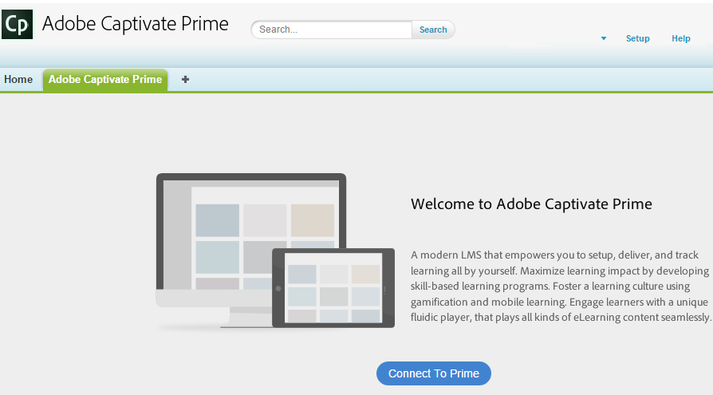

# Aplicación Learning Manager para Salesforce

## Resumen {#overview}

Salesforce™ es la solución de CRM más popular entre los equipos de ventas y marketing. Con la aplicación Adobe Learning Manager en Salesforce, los alumnos pueden acceder a todo su contenido de aprendizaje desde su interfaz de Salesforce. Los alumnos pueden acceder a su contenido de aprendizaje asignado, como cursos, programas de aprendizaje y ayudas de trabajo, desde Salesforce. Los usuarios también pueden recibir notificaciones sobre sus inscripciones y anuncios del administrador.

Esta aplicación solo estará disponible en Salesforce cuando el administrador de su cuenta de Learning Manager haya completado las actividades de configuración necesarias. Para obtener más información, consulte [Aplicación Learning Manager para Salesforce](../../integration-admin/feature-summary/sfdc-app.md)y solicite al administrador que instale la aplicación de Learning Manager para Salesforce.

## Buscar aplicación en Salesforce {#locateappinsalesforce}

Puede hacer clic en el icono **Aplicaciones** en la esquina derecha de la página y seleccione el Administrador de aprendizaje de Adobe.

Si no encuentra la aplicación en el menú desplegable, póngase en contacto con el administrador de Salesforce.

Una vez seleccionada la aplicación, puede cambiar a la aplicación de Adobe Learning Manager, como se muestra en la captura de pantalla siguiente.

<!---->

## Inicio de sesión e instrucciones de uso {#loginandusageinstructions}

Haga clic en **[!UICONTROL Conectarse a Learning Manager]** en Adobe Learning Manager, como se muestra en la captura de pantalla anterior, e inicie sesión con las credenciales de su cuenta de Learning Manager.

Puede conectarse a la aplicación Learning Manager y utilizarla desde Salesforce.

También puede iniciar sesión en la cuenta de Learning Manager en Salesforce mediante el componente Notificaciones de Adobe de Learning Manager en la página de inicio, en el panel izquierdo. Los alumnos pueden ver este componente solo cuando el administrador configura el componente Notificaciones de Adobe Learning Manager en Salesforce.

A continuación, se muestra una captura de pantalla representativa de la vista del alumno de la aplicación Adobe Learning Manager como referencia.

*vista de la aplicación Adobe Learning Manager*

## Desconectarse de la aplicación {#disconnectfromtheapp}

Puede hacer clic en el vínculo Desconectar situado en la parte inferior de la página de alumnos, como se ha marcado en la captura de pantalla anterior, para **Desconectar** desde la aplicación Adobe Learning Manager. Una vez desconectado, se le redirigirá a la página de bienvenida de la aplicación Adobe Learning Manager.

Puede conectarse o desconectarse de la aplicación muchas veces.
