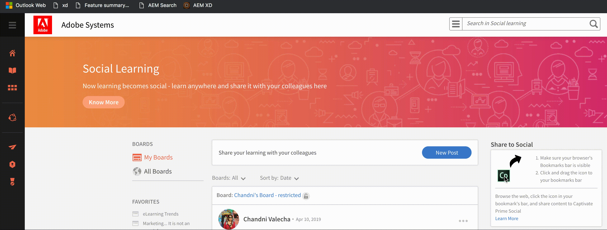

# Compartir en Aprendizaje social

Aprenda a utilizar Social Bookmark-let para compartir instantáneamente las enseñanzas en línea de un usuario en la web social.

Compartir en Aprendizaje social es un marcador que permite a los alumnos compartir sus aprendizajes en línea, como páginas web y blogs, con sus compañeros. Esta función solo se admite en navegadores de escritorio.

Al hacer clic en este marcador desde la barra de marcadores, se abre como una ventana emergente con o dentro de la página web en función del navegador que se vaya a compartir.

<!---->

Asegúrese de permitir las ventanas emergentes en el navegador.

Si ha iniciado sesión en Learning Manager, el marcador iniciará sesión automáticamente en su cuenta; de lo contrario, deberá iniciar sesión con sus credenciales de Learning Manager como alumno.

Agregue una descripción a su publicación y, a continuación, seleccione el tablero en el que desea publicar y haga clic en **[!UICONTROL Post]**. El tablero se publica en su tablero, que se puede ver haciendo clic en **Ir a publicación**.

## Agregar uso compartido a marcador social: dejar en la barra de marcadores {#addsharetosocialbookmarklettothebookmarksbar}

**Para añadir este marcador a la barra de marcadores del navegador, haga lo siguiente:**

1. Asegúrese de que la pestaña Marcadores esté activada en el navegador.
1. Inicie sesión en Learning Manager como alumno.
1. Haga clic en Aprendizaje social en el panel de navegación izquierdo. Si no está visible, póngase en contacto con el administrador.
1. Arrastre el **Compartir en redes sociales** en la barra de marcadores de su navegador.

   La acción de arrastrar y soltar no funciona en navegadores como Chrome en Mac y Microsoft Edge en Windows. Para obtener más información, [haga clic aquí](share-to-social.md#add%20bookmarkl-let%20manually).

   <!---->

## Activación de la barra de marcadores en diferentes navegadores {#enablingthebookmarksbarondifferentbrowsers}

## Chrome {#chrome}

* Haga clic en el botón de menú principal, representado por tres puntos situados en la esquina superior derecha de la ventana del navegador.
* Seleccione Configuración en el menú desplegable. También se puede acceder a la pantalla de configuración introduciendo **chrome://settings** en la barra de direcciones del navegador.
* Busque la sección Aspecto, que contiene una opción denominada mostrar la barra de marcadores acompañada de una casilla de verificación. Para asegurarse de que la barra de marcadores siempre se muestra al cargar una página, active la casilla de verificación haciendo clic en ella una vez. Para desactivar esta función, quite la marca de verificación.

## Mozilla Firefox {#mozillafirefox}

* Haga clic en el botón de menú y seleccione personalizar.
* Haga clic en el menú desplegable Barras de herramientas en la parte inferior de la pantalla y elija Barra de herramientas Marcadores.
* Haga clic en Hecho.

## Internet Explorer {#internetexplorer}

* Haga clic con el botón derecho en el icono de configuración de la esquina superior derecha del navegador. O utilice **Alt + C** en el teclado para abrir la ventana de la barra de favoritos.
* Para que la barra de favoritos esté visible en el explorador, haga clic en **[!UICONTROL Barra de favoritos]**.

## Microsoft Edge {#microsoftedge}

* Haga clic en el botón de menú principal representado por tres puntos en la esquina superior derecha > Configuración > Barra de favoritos.
* Para activar la barra de favoritos, haga clic en el botón de encendido y apagado.

## Safari {#safari}

* Haga clic en el menú Ver > Mostrar barra de favoritos. (Método abreviado de teclado: **Comando + Mayús + B**)

## Cómo añadir manualmente marcadores a la barra de marcadores en diferentes navegadores {#add-bookmark-let-manually}

Para añadir manualmente marcadores a la barra de marcadores, haga clic con el botón derecho en el **Compartir en redes sociales** icono > **Copiar dirección de vínculo** y siga el procedimiento que se indica a continuación:

## Chrome en Mac OS {#chromeinmacos}

1. Haga clic en el icono de menú contraído del navegador >  **Marcadores** > **Administrador de marcadores.**
1. Haga clic en Opciones del menú Marcadores > **Añadir nuevo marcador.**
1. Aparecen dos campos de entrada en el cuadro de diálogo emergente. Escriba el nombre que desee para el marcador como **Compartir en redes sociales** en el primer campo.
1. Pegue el **Compartir en redes sociales** en el segundo campo.

## Microsoft Edge en Windows {#microsoftedgeinwindows}

1. Asegúrese de que la barra de favoritos esté visible. Haga clic con el botón derecho en la barra de favoritos > **Crear nueva carpeta**.
1. Para agregar la dirección URL a la carpeta de la barra de favoritos que desee, haga clic en el **Centro de marcadores** icono > **Icono Marcadores**.
1. Guarde cualquier página en línea en la carpeta y cámbiele el nombre a Compartir en redes sociales.
1. Seleccione el icono del centro de marcadores > Compartir en redes sociales > Editar URL.
1. Pegue la dirección del vínculo y haga clic en el botón de entrada.
