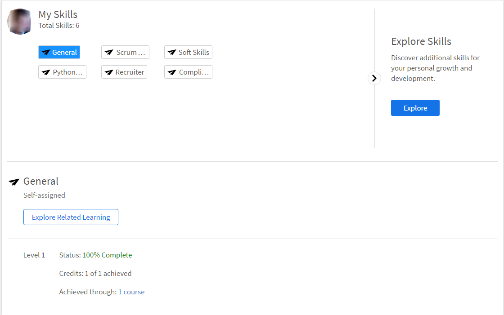

# Aptitudes y niveles

Lea este artículo para saber cómo adquirir aptitudes en Learning Manager como alumno.

El mapa de aptitudes es una agrupación de conjuntos de aptitudes, conocimientos y atributos de un empleado en una organización. Estas habilidades ayudan a las empresas/organizaciones a establecer o aumentar las expectativas de rendimiento de sus empleados. Las habilidades permiten a los empleados alinear sus comportamientos con las expectativas de la organización.

Adobe Learning Manager le permite asignar el rendimiento de los alumnos en función de sus conjuntos de aptitudes mediante el widget Aptitudes. Cuando los alumnos completan algunos cursos, pueden saber su posición respecto a cada aptitud haciendo clic en Aptitudes en la página de inicio del alumno.

## Ver aptitudes {#viewskills}

Para ver las aptitudes, haga clic en cualquiera de los nombres de las aptitudes en el widget Aptitudes de la página Alumno. Las aptitudes se muestran junto con sus niveles adyacentes.

*Ver todas las aptitudes*

El porcentaje de finalización de cada aptitud está disponible junto a la aptitud en el widget. Al hacer clic en cada aptitud, la aplicación le lleva a la página Aptitudes, donde puede ver los detalles de la aptitud en la que ha hecho clic.

La página Aptitudes muestra el estado de la aptitud en la que ha hecho clic. Por ejemplo, Java. La página Aptitud muestra el estado, por ejemplo, &quot;En curso&quot;, y los créditos, por ejemplo, &quot;2 de 10 alcanzado&quot;.

En esta página, puede hacer clic en cada una de sus aptitudes para ver los datos correspondientes.

*Ver cada aptitud*

Solo los administradores pueden crear aptitudes y asignarlas a los alumnos. Los alumnos se asignan automáticamente a las aptitudes correspondientes a los cursos o programas de aprendizaje en los que se inscriben.

## Conseguir una aptitud {#achieveskill}

Un alumno puede obtener una aptitud a medida que completa los cursos/programas de aprendizaje asignados con créditos de aptitudes asignados a ellos. Los alumnos también pueden obtener aptitudes inscribiéndose automáticamente en los cursos que pertenecen a una aptitud concreta y completándola.
