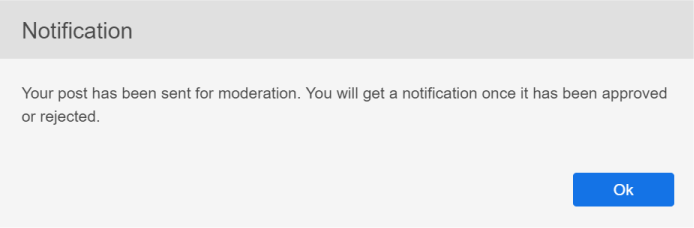

# Aprendizaje social en Learning Manager

Aprenda a utilizar la web de Aprendizaje social como alumno

El aprendizaje social es una plataforma de Learning Manager que permite a los usuarios compartir ideas e información significativa en un entorno informal. Es una metodología que complementa la idea de aprendizaje tradicional. Completar un curso en línea no da una ventaja a los usuarios para interactuar con sus compañeros a nivel social.

Con solo asistir a una formación, no garantiza que los usuarios conserven todo lo que se enseña. Por otro lado, el aprendizaje social permite a los usuarios utilizar la experiencia que les rodea para obtener exactamente la información que necesitan. A su vez, los usuarios pueden aplicar rápidamente esa información para completar una tarea y lograr un objetivo.

Del mismo modo, la función Aprendizaje social de Learning Manager permite a los usuarios interactuar entre sí al compartir contenido y aprender de él.

En esta plataforma, los diferentes tipos de contenido que se pueden compartir son vídeo, audio, captura de pantalla, texto, pregunta y encuesta. Los usuarios también pueden compartir sus conocimientos en línea con sus compañeros mediante el **Compartir en el marcador social**. Para obtener más información, consulte  [Compartir en Aprendizaje social](share-to-social.md).

El contenido también se puede publicar dentro de un tablero con la ayuda del **aplicación de Adobe Learning Manager para escritorio**. Para obtener más información, consulte  [Aplicación de Adobe Learning Manager para escritorio](../adobe-learning-manager-app-for-desktop.md).

Solo si el administrador activa el Aprendizaje social, la función estará visible para el alumno.

 

*Ver tablero de aprendizaje*

<table>
 <tbody>
  <tr>
   <td>
    
<b>Sl. No.</b>
</td>
   <td>
    
<b>Terminología o concepto</b>
</td>
   <td>
    
<b>Breve explicación</b>
</td>
  </tr>
  <tr>
   <td>
    
1
</td>
   <td>
    
Mis tableros
</td>
   <td>
    
Un tablero es <code>
      collection
     </code> de publicaciones creadas por un usuario. En mis tableros, se muestran todas las publicaciones en las que el usuario ha participado, creado y seguido.
</td>
  </tr>
  <tr>
   <td>
    
2
</td>
   <td>
    
Todos los tableros
</td>
   <td>
    
En la página Todos los tableros, los usuarios pueden ver los tableros creados por todos los alumnos que comparten el ámbito de actividad.
</td>
  </tr>
  <tr>
   <td>
    
3
</td>
   <td>
    
Comentario
</td>
   <td>
    
Los usuarios pueden comentar y ver las publicaciones creadas en los tableros. 
</td>
  </tr>
  <tr>
   <td>
    
4
</td>
   <td>
    
Responder
</td>
   <td>
    
Los usuarios pueden responder a los comentarios que se realicen en publicaciones dentro de un tablero.
</td>
  </tr>
  <tr>
   <td>
    
5
</td>
   <td>
    
Votar a favor/en contra
</td>
   <td>
    
Haga clic en los botones de votar a favor y votar en contra para marcar como favorita o no una publicación.
</td>
  </tr>
  <tr>
   <td>
    
6
</td>
   <td>
    
Social Leaderboard
</td>
   <td>
    
En la tabla de clasificación de redes sociales, los usuarios pueden ver los nombres de los alumnos con el número de puntos que han obtenido al participar en Aprendizaje social.
</td>
  </tr>
  <tr>
   <td>
    
7
</td>
   <td>
    
Gente que sigo
</td>
   <td>
    
Aquí los usuarios pueden ver los nombres de otros alumnos a los que siguen y el número de publicaciones que han creado.
</td>
  </tr>
  <tr>
   <td>
    
8
</td>
   <td>
    
Habilidades populares
</td>
   <td>
    
En las secciones Todos los tableros, las aptitudes que utilizan con frecuencia los alumnos se pueden ver junto con el número de publicaciones que han creado con esa aptitud.
</td>
  </tr>
  <tr>
   <td>
    
9
</td>
   <td>
    
Compartir en redes sociales
</td>
   <td>
    
Compartir en redes sociales es un marcador que permite a los usuarios compartir sus aprendizajes en línea, como páginas web y blogs, directamente en Learning Manager Social Learning.
</td>
  </tr>
  <tr>
   <td>
    
10
</td>
   <td>
    
Nueva publicación
</td>
   <td>
    
El botón Nueva publicación permite a los usuarios crear y publicar contenido dentro de los tableros.
</td>
  </tr>
 </tbody>
</table>

## Creación de contenido como publicación {#creatingcontentasapost}

El contenido se crea como una publicación dentro de un tablero. Para crear una publicación, siga estos pasos:

1. Haga clic en **[!UICONTROL Nueva publicación].**

   
   *Seleccionar nueva publicación*

1. Seleccione cualquiera de los siguientes tipos de contenido para publicar: texto, pregunta, vídeo, audio, encuesta y captura de pantalla. El contenido existente se puede cargar desde el sistema de los usuarios o desde la galería de la aplicación de Adobe Learning Manager para escritorio.

   Utilice la aplicación de Adobe Learning Manager para escritorio para grabar un vídeo o una pantalla, grabar audio y tomar una captura de pantalla. Para obtener más información, consulte [aplicación de Adobe Learning Manager para escritorio](../adobe-learning-manager-app-for-desktop.md).

   <!---->

1. Busque un tablero o una aptitud que estén relacionados con la publicación. Si el tablero no existe, haga clic en **[!UICONTROL Crear un nuevo tablero]**.

   

   *Crear un tablero*

   Si es un usuario externo o interno y el administrador le ha concedido acceso para crear un tablero, puede crear un tablero. Si no tiene los permisos para crear un tablero, el vínculo **Crear un nuevo tablero** no aparece.

1. En el cuadro de diálogo emergente, rellene los detalles y seleccione el siguiente tipo de tablero:

   * **Público** - La participación y la visibilidad de las publicaciones están disponibles para todos los usuarios.
   * **Privado** - La publicación solo es visible para el creador del tablero, los moderadores y los usuarios añadidos al tablero.
   * **Restringido** - Solo el propietario del tablero, el administrador y los moderadores del tablero pueden crear publicaciones. Otros usuarios pueden participar comentando/respondiendo, votando a favor/votando a favor/en contra, etc.

   <!---->

   >[!NOTE]
   >
   >En la aplicación de Aprendizaje social, solo se crea un **Administrador** tiene la capacidad de crear tableros privados con grupos de usuarios (internos/externos).
   >
   >Ningún otro usuario, a excepción de un administrador, un autor, un alumno, un responsable y un instructor, entre otros, **no** crear tableros privados con grupos de usuarios. No pueden ver la sección de **grupos de usuarios** en la creación de tablero privado.

   Solo para administradores: cuando elija **Privado**, verá dos opciones: **Usuarios** y **Grupos de usuarios**. Elija la opción **Grupos de usuarios** y, a continuación, agregue los grupos de usuarios con los que desee compartir el tablero privado.

   En el campo Grupos de usuarios, puede elegir grupos internos, externos o personalizados. Su tablero privado estará visible para todos los grupos de usuarios especificados, independientemente de la configuración del ámbito.

1. Para compartir contenido, haga clic en **[!UICONTROL Post]**. Al hacer clic en Publicar, el usuario recibe una notificación.

   El contenido se publica en función de la configuración de revisión establecida por el administrador para el contenido de Aprendizaje social que puede seleccionar  [Moderadores de tableros/expertos en la materia](social-learning-web-user.md#HowtobecomeaSubjectMatterExpertSME).

   <!---->

1. Los usuarios reciben notificaciones cuando se aprueba o rechaza su publicación, si el administrador ha establecido la configuración de revisión en Revisión solo manual. Si se rechaza la publicación, haga clic en el **Haga clic para revisar** para revisar los comentarios de los moderadores del tablero o de los expertos en la materia (expertos en la materia).

   El contenido creado por los usuarios lo seleccionan los moderadores del tablero o los expertos en la materia.

   <!---->

Al crear o responder a una publicación en Aprendizaje social, puede redactar una publicación mediante el Editor de texto enriquecido y aplicar distintos tipos de formato.

*Utilizar el Editor de texto enriquecido para crear una publicación*

Además, al crear un tablero, tiene acceso al mismo conjunto de opciones en el Editor de texto enriquecido.

*Utilizar el Editor de texto enriquecido para crear una publicación*

## Ver contenido aprobado {#viewingapprovedcontent}

Una vez aprobada una publicación, se muestra en un tablero de Aprendizaje social. Los usuarios pueden ahora, comentar, responder, votar a favor / votar a favor en la publicación.

Los usuarios pueden utilizar el siguiente tipo de contenido para hacer un comentario: Grabar pantalla, cámara web, o ambos, Grabar audio, Tomar captura de pantalla, Cargar archivo, Galería de Learning Manager.

<!---->

## Contenido en el reproductor social {#contentinsocialplayer}

En Learning Manager, los vídeos, el contenido estático, como las presentaciones y las imágenes, se publican dentro del reproductor social en un tablero. Puede cargar un archivo desde el sistema, grabar un vídeo/pantalla y capturar una captura de pantalla con la ayuda de la aplicación de Adobe Learning Manager para escritorio.

Una vez que el usuario ha terminado de publicar contenido, otros alumnos pueden verlo en su ámbito de actividad. En el reproductor social, los alumnos pueden ver, comentar/responder, votar a favor/votar en contra y notificar infracciones.

<!---->

**Para comentar, responder, votar a favor o votar en contra en un reproductor social, siga estos pasos:**

1. Haga clic en el botón de pantalla completa en la esquina inferior derecha del reproductor social.
1. Para ver los controles del reproductor en la pantalla, haga clic en la flecha hacia abajo.
1. Para ver la sección de comentarios, haga clic en el icono de comentarios de la esquina inferior izquierda de la pantalla.
1. Los usuarios pueden comentar/responder, votar a favor/votar en contra y denunciar abusos.
1. Haga clic en la tecla Esc para salir del modo de pantalla completa.

## Vista de tablero en Aprendizaje social {#board-view-social}

Un alumno puede ver todos los tableros en una vista de lista. Inicie sesión en la aplicación de alumno y, en la página de Aprendizaje social, haga clic en el botón, como se muestra a continuación:

*Vista de tablero en Aprendizaje social*

Cuando vea las publicaciones en formato de tablero, puede ordenar las publicaciones según **Post** y **Colaborador**.

* Si elige **Publicaciones**, los tableros se ordenarán según el número de publicaciones realizadas en el tablero.
* Si elige **Colaboradores**, los tableros se ordenarán según el número de usuarios que hayan comentado o respondido en los hilos.

### Filtro de aptitudes {#skillfilter}

*Ordenar las publicaciones*

Con el filtro Aptitud, puede seleccionar varias aptitudes para filtrar los tableros. También puede borrar los filtros una vez que haya seleccionado las aptitudes.

### Filtro de nivel de actividad {#activitylevelfilter}

*Filtrar niveles de actividad*

Con el filtro Actividad, puede ordenar los tableros según la magnitud de las interacciones de un tablero. Puede ordenarlos de acuerdo con:

* Alta actividad
* Actividad normal
* Baja actividad

En la vista de tablero, puede realizar las acciones habituales en el nivel de tablero.

<!---->

## Descargar publicaciones {#downloadposts}

Los alumnos pueden descargar el contenido, con archivos adjuntos, desde la plataforma de Aprendizaje social para utilizarlo sin conexión.

*Descargar una publicación en redes sociales*

Puede descargar el contenido desde las secciones Publicaciones, Comentarios o Respuestas. Solo puede descargar un archivo a la vez.

Ambos tipos de usuarios (internos o externos) deben poder descargar el contenido.

El botón Descargar también se puede ver en los resultados de búsqueda de publicaciones, comentarios o respuestas.

Aún no puede descargar una publicación en la aplicación del dispositivo. Esta función estará disponible próximamente.

## Formatos de contenido admitidos {#supportedcontentformats}

<table>
 <tbody>
  <tr>
   <td>
    
<b>Tipo de contenido</b>
</td>
   <td>
    
<b>Extensiones</b>
</td>
  </tr>
  <tr>
   <td>
    
Vídeo
</td>
   <td>
    
wmv, f4v, asf, 3gp, 3g2, avi, mov, h264, m4v, mp4, MPEG, mpg
</td>
  </tr>
  <tr>
   <td>
    
Audio
</td>
   <td>
    
mp3, amr, m4a, wav, wma, aac
</td>
  </tr>
  <tr>
   <td>
    
Archivos estáticos
</td>
   <td>
    
PDF, ppt, pptx, doc, docx, xls, xlsx
</td>
  </tr>
  <tr>
   <td>
    
Imagen
</td>
   <td>
    
jpg, jpeg, png, bmp y gif
</td>
  </tr>
 </tbody>
</table>

## Tablero visible solo para usuarios seleccionados {#selected-users}

Un alumno que también tiene un **administrador** Esta función puede añadir un grupo de usuarios a un tablero privado. Cualquier grupo de usuarios se puede agregar al tablero privado y los usuarios que pertenecen al grupo de usuarios solo tienen acceso al tablero.

Si se añade un nuevo usuario al grupo de usuarios, ambos usuarios pueden ver el tablero privado.

Si se elimina algún usuario del tablero privado, el usuario ya no podrá ver el tablero privado.

Si se añaden varios grupos de usuarios al tablero privado, todos los usuarios de ambos grupos tienen acceso a los tableros privados.

<!---->

## Acciones que se pueden realizar en una publicación {#actionsthatcanbedoneonapost}

Haga clic en el icono de menú contraído en la esquina superior derecha de una publicación para ver sus opciones. Se muestra la siguiente lista de menús: Editar, añadir a mi artículo, copiar URL, eliminar e informar.

Sólo algunos usuarios tienen permisos para realizar tareas concretas. Los siguientes tipos de usuarios son los propietarios del contenido, los moderadores del tablero y el administrador de la organización.

<table>
 <tbody>
  <tr>
   <td>
    
<b>Sl. No.</b>
</td>
   <td>
    
<b>Acción</b>
</td>
   <td>
    
<b>Explicación</b>
</td>
  </tr>
  <tr>
   <td>
    
1
</td>
   <td>
    
Editar
</td>
   <td>
    
Editar permite al creador del contenido corregir o modificar su publicación.
</td>
  </tr>
  <tr>
   <td>
    
2
</td>
   <td>
    
Añadir a mi historia
</td>
   <td>
    
Un artículo es una colección de contenido seleccionado por un usuario. Los usuarios pueden establecer la visibilidad del contenido en Privado o Público.
</td>
  </tr>
  <tr>
   <td>
    
3
</td>
   <td>
    
Copiar URL
</td>
   <td>
    
Esta opción permite a todos los usuarios copiar la URL de un tablero o publicación y compartirla.
</td>
  </tr>
  <tr>
   <td>
    
4
</td>
   <td>
    
Eliminar
</td>
   <td>
    
La opción Eliminar elimina la publicación tras la confirmación del usuario.
</td>
  </tr>
  <tr>
   <td>
    
5
</td>
   <td>
    
Informe
</td>
   <td>
    
Cada usuario tiene permisos para informar de un abuso de una publicación si viola su privacidad o si su contenido es inapropiado.

    
Una vez que se informa de una publicación, se envía una notificación al administrador del tablero y a los moderadores para que realicen más acciones.
</td>
  </tr>
 </tbody>
</table>

**Añadir a mi historia**

La historia social permite a los usuarios agregar o crear historias con publicaciones creadas por ellos u otros usuarios.

Para añadir una publicación a un artículo, siga estos pasos:

1. Haga clic en el icono de menú contraído en la esquina superior derecha de una publicación y haga clic en **[!UICONTROL Añadir a mi historia]**.

   

   *Añadir a una historia*

1. Desde el **Seleccionar artículo** , seleccione un artículo relevante para añadir la publicación. Si no hay artículos relevantes existentes, cree un artículo haciendo clic en **Nueva historia**.

   

   *Crear una historia*

1. En el cuadro de diálogo Nuevo artículo, rellene los campos Nombre del artículo y Descripción. También puede establecer la visibilidad del artículo en Público o Privado.

   

   *Agregar nombre de artículo y descripción*

   Para ver historias creadas por usuarios, haga clic en el nombre del usuario en las opciones del menú de perfil.

## Privilegios de usuario para realizar las acciones en una publicación {#userprivilegesforperformingtheactionsonapost}

<table>
 <tbody>
  <tr>
   <td>
    
 
</td>
   <td>
    
<b>Propietario del contenido</b>
</td>
   <td>
    
<b>Cualquier usuario</b>
</td>
   <td>
    
<b>Moderadores de tableros</b>
</td>
   <td>
    
<b>Administrador</b>
</td>
  </tr>
  <tr>
   <td>
    
<b>Editar</b>
</td>
   <td>
    
Sí
</td>
   <td>
    
No
</td>
   <td>
    
No
</td>
   <td>
    
No
</td>
  </tr>
  <tr>
   <td>
    
<b>Añadir a mi historia</b>
</td>
   <td>
    
Sí
</td>
   <td>
    
Sí
</td>
   <td>
    
Sí
</td>
   <td>
    
Sí
</td>
  </tr>
  <tr>
   <td>
    
<b>Copiar URL</b>
</td>
   <td>
    
Sí
</td>
   <td>
    
Sí
</td>
   <td>
    
Sí
</td>
   <td>
    
Sí
</td>
  </tr>
  <tr>
   <td>
    
<b>Eliminar</b>
</td>
   <td>
    
Sí
</td>
   <td>
    
No
</td>
   <td>
    
Sí
</td>
   <td>
    
Sí
</td>
  </tr>
  <tr>
   <td>
    
<b>Informe</b>
</td>
   <td>
    
Sí
</td>
   <td>
    
Sí
</td>
   <td>
    
Sí
</td>
   <td>
    
Sí
</td>
  </tr>
 </tbody>
</table>

## Visualización de contenido en tableros {#viewingcontentinboards}

Las juntas son una colección de puestos. Todos los tableros de Aprendizaje social se crean en función de una aptitud. En Aprendizaje social, los usuarios pueden ver la **Todos los tableros** página y **Mis tableros** página.

En la página Todos los tableros, las publicaciones o tableros creados por todos los usuarios en un ámbito de actividad son visibles. Sin embargo, en la página Mis tableros, solo se ven los tableros creados, seguidos y en los que participa un usuario.

En la página Mis tableros, los tableros visibles se pueden filtrar según lo siguiente: **Todo**, **Creado por mí**, **Comentado por mí**, **Seguido por mí**.

*Filtrar tableros visibles*

En ambos, Mis tableros y Todos los tableros, los usuarios pueden ordenar los tableros por **Relevancia** o **Fecha**.

*Ordenar tableros por relevancia y fecha*

Al crear una publicación, si no hay tableros relevantes para la publicación, haga clic en [Crear un nuevo tablero](social-learning-web-user.md#Creatingcontentasapost).  Para ver, editar, eliminar, informar, copiar URL y añadir un tablero a su lista de tableros favoritos, siga los pasos que se indican a continuación:

1. Haga clic en el nombre del tablero o en **[!UICONTROL Ir a bordo]**.
1. En la página Tableros, haga clic en el icono de menú contraído y seleccione una opción de la lista desplegable.

   <!---->

**Los usuarios pueden ver las siguientes opciones en una página de tableros:**

* El número de publicaciones, vistas y personas que siguen el tablero es visible en esta página. El nombre del creador del tablero y la fecha de creación del tablero también se muestran junto con los principales expertos en la materia del tablero.

* También se muestran los nombres de los tableros añadidos a la lista de tableros favoritos de un usuario.

<!---->

## Compartir en redes sociales {#sharetosocial}

Compartir en redes sociales es un marcador que permite a los usuarios compartir sus conocimientos en línea, como páginas web y blogs, directamente en la página de redes sociales como una publicación. Para obtener más información, consulte [Compartir en Aprendizaje social](share-to-social.md).

*Compartir en Aprendizaje social*

## Mis habilidades {#myskills}

Los usuarios pueden ver las aptitudes y el número de publicaciones o tableros creados con una aptitud en la página Mis tableros . Para ver todas las aptitudes utilizadas por el usuario al crear un tablero, haga clic en **[!UICONTROL Ver todas las aptitudes]**.

*Ver todas las aptitudes*

## Personas que sigo {#peopleifollow}

En la página Mis tableros, los usuarios pueden ver los nombres de las personas a las que siguen y el número de publicaciones que han creado.

*Personas que sigue un alumno*

Para seguir a otros usuarios, siga estos pasos:

1. Para ver la página de perfil de otro usuario, haga clic en su nombre.
1. Haga clic en el botón Seguir/ Dejar de seguir para realizar la acción deseada.

   

   *Seguir o dejar de seguir a un usuario*

## Consejo de Líderes Sociales {#socialleaderboard}

La tabla de clasificación social mejora la interacción. Se conceden puntos de actividad a los usuarios al crear un nuevo puesto o tablero, al obtener un voto favorable para su puesto, al proporcionar la respuesta correcta a una pregunta y a otras participaciones en el aprendizaje social.

El número total de puntos y nuevas publicaciones para todos los usuarios en el mismo ámbito es visible en la lista de la tabla de posiciones de redes sociales. El alumno con el número máximo de puntos aparece en la parte superior de la lista de la tabla de posiciones de redes sociales, seguido por los demás alumnos en consecuencia.

Haga clic en **[!UICONTROL Ir a Tabla de posiciones]** en el **Mis tableros** para ver todos los alumnos y el número de puntos que se les ha concedido.

*Ver todos los alumnos*

## Puntos de actividad {#activitypoints}

El número de puntos de actividad otorgados a los usuarios se basa en las actividades sociales realizadas.

**Se conceden puntos de actividad a los usuarios por lo siguiente:**

* 5 puntos para crear un tablero.
* 5 puntos para añadir una publicación como texto o como tipo de pregunta.
* 2 puntos por comentar cualquier publicación.
* Se concede 1 punto al usuario que sea el primero en empezar a utilizar un tablero. Los usuarios obtienen un total de 20 puntos por los primeros 20 nuevos puestos publicados en ese tablero.

## Cómo convertirse en experto en la materia (SME) {#howtobecomeasubjectmatterexpertsme}

Un experto en la materia (SME) es una persona con la experiencia en una habilidad particular. En Aprendizaje social de Learning Manager, los usuarios se designan como expertos en la materia en función del número máximo de puntos de actividad que se les conceden para una aptitud.

Los principales expertos en la materia tienen el privilegio de seleccionar el contenido del alumno antes de publicarlo en un tablero de Aprendizaje social.

El administrador de la organización también tiene el privilegio de añadir más puntos a un alumno para convertirlo en el experto en la materia de una aptitud.

## ¿Cómo se selecciona contenido como experto en la materia? {#howtocuratecontentasasme}

1. Al crear una nueva publicación o tablero por un usuario, el experto en la materia recibe una notificación que indica que una publicación de un tablero está a la espera de una revisión.

   <!---->

1. Para moderar la publicación, haga clic en **Haga clic para revisar** vínculo. Esta acción desplaza al experto en la materia hasta la página de moderación de contenido, que se parece a la captura de pantalla siguiente.

   <!---->

1. Para valorar el contenido en función del porcentaje de relevancia que tenga para la aptitud de un tablero, seleccione el color en la escala de relevancia. El primer color se clasifica como irrelevante (10 % de relevancia) y el último color representa muy relevante (100 % de relevancia).
1. Se recomienda que el experto en la materia escriba un comentario basándose en una puntuación de relevancia determinada. Los usuarios entienden mejor por qué su publicación es rechazada al leer el comentario.

<!--## AI-enabled auto curation {#autocuration}-->

## Buscar en el aprendizaje formal e informal {#searchinformalandinformallearning}

Cada página de Aprendizaje social tiene un campo de búsqueda que permite a los usuarios buscar cualquier tablero, aptitud o contenido. Busque escribiendo en el campo de búsqueda y haga clic en el icono de búsqueda o presione la tecla Intro en el teclado.

<!---->

Las siguientes páginas de aprendizaje informal tienen un campo de búsqueda: **Mis tableros**, **Todos los tableros**, **Página Tableros**, del usuario **Página de perfil**, y **página de perfil de otro alumno**.

Cuando un usuario busca contenido en el aprendizaje informal , se muestra el número total de resultados de búsqueda para el contenido en el aprendizaje informal y formal de Learning Manager.

Del mismo modo, el número de resultados de búsqueda encontrados en el aprendizaje informal se muestra al buscar contenido en una página de aprendizaje formal.

*Resultados de búsqueda para aprendizaje*

En la página del tablero de aprendizaje informal, solo se pueden realizar búsquedas relacionadas con el tablero. No se muestra ninguna búsqueda no relacionada con un tablero.

## Ver perfil de usuario {#viewuserprofile}

Si Aprendizaje social está activado para un alumno, el usuario puede ver su perfil haciendo clic en su imagen de perfil en la esquina superior derecha de Aprendizaje social y haciendo clic en su nombre en la lista desplegable.

*Ver perfil de usuario*

En la página de perfil, los alumnos pueden ver el número total de puntos obtenidos, el número de publicaciones creadas y el número de seguidores que tienen.

Los alumnos también pueden ver las aptitudes para las que se les ha designado como expertos en la materia.

En la página del alumno también se muestran sus **historias seleccionadas**, **actividades recientes** y el resultado de **personas seguidas** por ellos.

## Notificaciones {#notifications}

Al aprobar o rechazar una publicación de SME, los usuarios reciben una notificación que puede verse al hacer clic en el icono de notificaciones en la esquina superior derecha de la ventana. Los usuarios pueden ver notificaciones de actividades de aprendizaje social y aprendizaje formal.

<!---->
