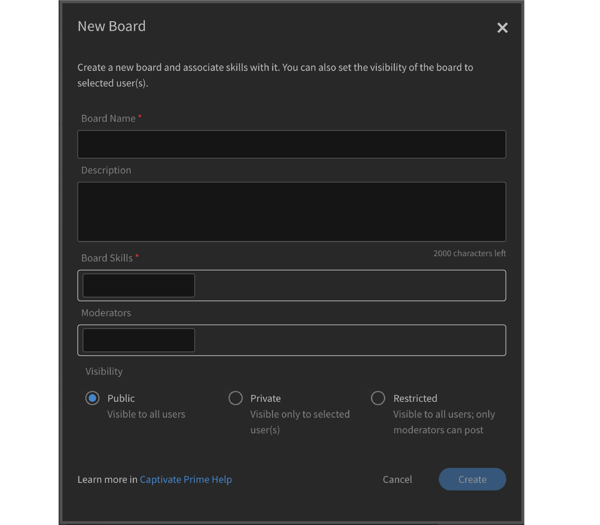

# Aprendizaje social en Learning Manager

Uso de Aprendizaje social como alumno

Aprendizaje social es una plataforma de Learning Manager. En ella, los usuarios pueden compartir ideas y conocimientos valiosos en un entorno informal. Es una metodología que complementa el concepto de aprendizaje tradicional. Completar un curso en línea no ofrece ninguna ventaja a los usuarios para interactuar con otras personas del mismo entorno social.

El mero hecho de asistir a una formación no garantiza que los usuarios recuerden todo lo que se imparte. Por otro lado, el aprendizaje social permite que los usuarios aprovechen los conocimientos de otras personas para obtener exactamente la información que necesitan. A su vez, los usuarios aplican de inmediato esa información para completar una tarea y lograr un objetivo.

Del mismo modo, la función Aprendizaje social de Learning Manager permite a los usuarios interactuar entre sí al compartir contenido y aprender de él.

En esta plataforma, se pueden compartir contenido de vídeo, audio, capturas de pantalla, texto, preguntas y encuestas. Los usuarios también pueden compartir sus conocimientos en línea con sus compañeros mediante el marcador **Compartir en redes sociales**. Para obtener más información, consulte [Compartir en Aprendizaje social](share-to-social.md).

El contenido también se puede publicar dentro de un tablero con la ayuda de la **aplicación de escritorio de Adobe Learning Manager**. Para obtener más información, consulte [Aplicación para escritorio de Adobe Learning Manager](../adobe-learning-manager-app-for-desktop.md).

El alumno puede ver la función solo si el administrador activa Aprendizaje social.

 

*Ver panel de aprendizaje*

<table>
 <tbody>
  <tr>
   <td>
    
<b>N.º Ap. soc.</b>
</td>
   <td>
    
<b>Terminología o concepto</b>
</td>
   <td>
    
<b>Breve explicación</b>
</td>
  </tr>
  <tr>
   <td>
    
1
</td>
   <td>
    
Mis tableros
</td>
   <td>
    
Un tablero es <code>
      collection
     </code> de publicaciones creadas por un usuario. En Mis tableros se muestran todas las publicaciones creadas por el usuario, o bien publicaciones en las que participa o que sigue.
</td>
  </tr>
  <tr>
   <td>
    
2
</td>
   <td>
    
Todos los tableros
</td>
   <td>
    
En la página Todos los tableros, los usuarios pueden ver los tableros creados por todos los alumnos que comparten el ámbito de la actividad.
</td>
  </tr>
  <tr>
   <td>
    
3
</td>
   <td>
    
Comentario
</td>
   <td>
    
Los usuarios pueden comentar y ver las publicaciones que se crean en los tableros. 
</td>
  </tr>
  <tr>
   <td>
    
4
</td>
   <td>
    
Responder
</td>
   <td>
    
Los usuarios pueden responder a los comentarios que se formulan en las publicaciones de un tablero.
</td>
  </tr>
  <tr>
   <td>
    
5
</td>
   <td>
    
Votar a favor/Votar en contra
</td>
   <td>
    
Haga clic en el botón de votar a favor o de votar en contra para indicar si una publicación le gusta o no.
</td>
  </tr>
  <tr>
   <td>
    
6
</td>
   <td>
    
Tabla de posiciones de Social
</td>
   <td>
    
En la tabla de posiciones de Social, los usuarios pueden ver los nombres de los alumnos, así como la cantidad de puntos que han obtenido al participar en Aprendizaje social.
</td>
  </tr>
  <tr>
   <td>
    
7
</td>
   <td>
    
Personas a las que sigo
</td>
   <td>
    
Aquí los usuarios pueden ver los nombres de otros alumnos a los que siguen y el número de publicaciones que han creado.
</td>
  </tr>
  <tr>
   <td>
    
8
</td>
   <td>
    
Aptitudes populares
</td>
   <td>
    
En la sección Todos los tableros, se pueden ver las aptitudes utilizadas con frecuencia por los alumnos, así como la cantidad de publicaciones que han creado mediante dicha aptitud.
</td>
  </tr>
  <tr>
   <td>
    
9
</td>
   <td>
    
Compartir en Social
</td>
   <td>
    
Compartir en Social es un bookmarklet que permite a los usuarios compartir sus aprendizajes en línea, por ejemplo, páginas web y blogs, directamente en Aprendizaje social de Learning Manager.
</td>
  </tr>
  <tr>
   <td>
    
10
</td>
   <td>
    
Nueva publicación
</td>
   <td>
    
Con el botón Nueva publicación, los usuarios crean y publican contenido en tableros.
</td>
  </tr>
 </tbody>
</table>

## Creación de contenido como publicación {#creatingcontentasapost}

El contenido se crea como una publicación dentro de un tablero. Para crear una publicación, siga estos pasos:

1. Haga clic en **[!UICONTROL Nueva publicación].**

   
   *Seleccionar nueva publicación*

1. Seleccione cualquiera de los tipos siguientes de contenido para publicar: Texto, Pregunta, Vídeo, Audio, Sondeo o Captura de pantalla. El contenido se puede cargar desde el sistema del usuario o desde la galería de la aplicación Adobe Learning Manager para escritorio.

   Use la aplicación Adobe Learning Manager para escritorio para grabar un vídeo, una pantalla o un audio, o para realizar una captura de pantalla. Para obtener más información, consulte [Aplicación de escritorio de Adobe Learning Manager](../adobe-learning-manager-app-for-desktop.md).

   <!---->

1. Busque un tablero o una aptitud que estén relacionados con la publicación. Si el tablero no existe, haga clic en **[!UICONTROL Crear un nuevo tablero]**.

   

   *Crear un tablero*

   Si es un usuario externo o interno, y si el administrador le ha otorgado acceso para crear un tablero, puede crearlo. Si no tiene los permisos para crear un tablero, el vínculo **Crear un nuevo tablero** no aparecerá.

1. En el cuadro de diálogo que aparece en pantalla, complete los detalles y seleccione el siguiente tipo de tablero:

   * **Público** - La participación y la visibilidad de las publicaciones están disponibles para todos los usuarios.
   * **Privado**: la publicación solo está visible para el creador del tablero, los moderadores y los usuarios agregados al tablero.
   * **Restringido**: el propietario, el administrador y los moderadores del tablero son los únicos que pueden crear publicaciones. Otros usuarios pueden participar comentando/respondiendo, votando a favor/votando a favor/en contra, etc.

   <!---->

   >[!NOTE]
   >
   >En la aplicación de Aprendizaje social, solo un **administrador** puede crear un tablero privado con grupos de usuarios (internos/externos).
   >
   >Ningún otro usuario, a excepción de un administrador, un autor, un alumno, un responsable y un instructor, entre otros, **no puede** crear tableros privados con grupos de usuarios. No pueden ver la sección de **grupos de usuarios** durante la creación de un tablero privado.

   Solo para un administrador: al elegir **Privado**, aparecen dos opciones: **Usuarios** y **Grupos de usuarios**. Elija la opción **Grupos de usuarios**; a continuación, agregue los grupos de usuarios con los que desea compartir el tablero privado.

   En el campo Grupos de usuarios, puede elegir grupos internos, externos o personalizados. Su tablero privado será visible para todos los grupos de usuarios especificados, sea cual sea la configuración del ámbito.

1. Para compartir contenido, haz clic en **[!UICONTROL Publicar]**. Al hacer clic en Publicar, el usuario recibe una notificación.

   El contenido se publica según la configuración de revisión establecida por el administrador para el contenido de Aprendizaje social, que puede seleccionar [Moderadores del tablero/expertos en la materia](social-learning-web-user.md#HowtobecomeaSubjectMatterExpertSME).

   <!---->

1. Los usuarios reciben notificaciones cuando se aprueba o se rechaza su publicación, si el administrador ha definido la opción Revisión solo manual. Si la publicación se rechaza, haga clic en el hipervínculo **Haga clic para revisar** a fin de examinar los comentarios de revisión emitidos por los moderadores o los expertos en la materia del tablero.

   Los moderadores o los expertos en la materia del tablero revisan el contenido creado por los usuarios.

   <!---->

Al crear o responder a una publicación en Aprendizaje social, puede redactar una entrada mediante el Editor de texto enriquecido y aplicar distintos tipos de formato.

*Usar el Editor de texto enriquecido para crear una publicación*

Además, al crear un tablero, tiene acceso al mismo conjunto de opciones en el Editor de texto enriquecido.

*Usar el Editor de texto enriquecido para crear una publicación*

## Visualización del contenido aprobado {#viewingapprovedcontent}

Cuando se aprueba una publicación, se muestra en un tablero de Aprendizaje social. A partir de entonces, los usuarios pueden comentar, responder, votar a favor o en contra en la publicación.

Los usuarios pueden utilizar el tipo de contenido siguiente para efectuar un comentario: Grabar pantalla, cámara web o ambas, Grabar audio, Tomar captura de pantalla, Cargar archivo o Galería de Learning Manager.

<!---->

## Contenido en el reproductor de Social {#contentinsocialplayer}

En Learning Manager, los vídeos y el contenido estático como las presentaciones y las imágenes se publican en el reproductor de Social de un tablero. Se puede cargar un archivo del sistema, grabar un vídeo o una pantalla, o realizar una captura de pantalla mediante la aplicación Adobe Learning Manager para escritorio.

Cuando el usuario ha terminado de publicar el contenido, otros alumnos pueden verlo en el ámbito de la actividad. En el reproductor de Social, los alumnos pueden ver, comentar, responder, votar a favor, votar en contra e informar sobre abusos.

<!---->

**Para comentar, responder, votar a favor o votar en contra en el reproductor de Social, siga estos pasos:**

1. En la esquina inferior derecha del reproductor de Social, haga clic en el botón de pantalla completa.
1. Para ver los controles del reproductor en la pantalla, haga clic en la flecha orientada hacia abajo.
1. Para ver la sección de comentarios, haga clic en el icono de comentarios en la esquina inferior izquierda de la pantalla.
1. Los usuarios pueden comentar, responder, votar a favor, votar en contra e informar sobre abusos.
1. Haga clic en la tecla Esc para salir del modo de pantalla completa.

## Vista de tablero en Aprendizaje social {#board-view-social}

Un alumno puede ver todos los tableros en una vista de lista. Inicie sesión en la aplicación de alumno y, en la página de Aprendizaje social, haga clic en el botón, como se muestra a continuación:

*Vista de tablero en redes sociales*

Cuando vea las publicaciones en formato de tablero, puede ordenar las publicaciones según **Publicación** y **Colaborador**.

* Si elige **Publicaciones**, los tableros se ordenarán según el número de publicaciones incluidas en el tablero.
* Si elige **Colaboradores**, los tableros se ordenarán según el número de usuarios que hayan comentado o respondido en los hilos.

### Filtro de aptitudes {#skillfilter}

*Ordenar las publicaciones*

Con el filtro Aptitud, puede seleccionar varias aptitudes para filtrar los tableros. También puede borrar los filtros una vez que haya seleccionado las aptitudes.

### Filtro de nivel de actividad {#activitylevelfilter}

*Filtrar niveles de actividad*

Con el filtro Actividad, puede ordenar los tableros según la magnitud de las interacciones de un tablero. Puede ordenarlas según:

* Alta actividad
* Actividad normal
* Baja actividad

En la vista de tablero, puede realizar las acciones habituales en el nivel de tablero.

<!---->

## Descargar publicaciones {#downloadposts}

Los alumnos pueden descargar el contenido, con archivos adjuntos, desde la plataforma de Aprendizaje social para utilizarlo sin conexión.

*Descargar una publicación en redes sociales*

Puede descargar el contenido desde las secciones Publicaciones, Comentarios o Respuestas. Solo puede descargar un archivo a la vez.

Ambos tipos de usuarios (internos o externos) deben poder descargar el contenido.

El botón Descargar también se puede ver en los resultados de búsqueda de publicaciones, comentarios o respuestas.

Sin embargo, aún no se puede descargar una publicación en la aplicación del dispositivo. Esta función estará disponible próximamente.

## Formatos de contenido admitidos {#supportedcontentformats}

<table>
 <tbody>
  <tr>
   <td>
    
<b>Tipo de contenido</b>
</td>
   <td>
    
<b>Extensiones</b>
</td>
  </tr>
  <tr>
   <td>
    
Vídeo
</td>
   <td>
    
wmv, f4v, asf, 3gp, 3g2, avi, mov, h264, m4v, mp4, MPEG, mpg
</td>
  </tr>
  <tr>
   <td>
    
Audio
</td>
   <td>
    
mp3, amr, m4a, wav, wma, aac
</td>
  </tr>
  <tr>
   <td>
    
Archivos estáticos
</td>
   <td>
    
PDF, ppt, pptx, doc, docx, xls, xlsx
</td>
  </tr>
  <tr>
   <td>
    
Imagen
</td>
   <td>
    
jpg, jpeg, png, bmp, gif
</td>
  </tr>
 </tbody>
</table>

## Tablero visible solo para usuarios seleccionados {#selected-users}

Un alumno que tenga también una función de **administrador** puede añadir un grupo de usuarios a un tablero privado. Se puede agregar cualquier grupo de usuarios al tablero privado. Los usuarios que pertenecen al grupo de usuarios solo tienen acceso al tablero.

Si se añade un usuario nuevo al grupo de usuarios, ambos usuarios pueden ver el tablero privado.

Si se elimina algún usuario del tablero privado, dicho usuario ya no puede ver el tablero privado.

Si se añaden varios grupos de usuarios al tablero privado, todos los usuarios de ambos grupos tienen acceso a los tableros privados.

<!---->

## Acciones que se pueden efectuar en una publicación {#actionsthatcanbedoneonapost}

En la esquina superior derecha de una publicación, haga clic en el icono de menú contraído para ver las opciones. Se muestra la lista siguiente de menús: Editar, Añadir a mi historia, Copiar URL, Eliminar e Informe.

Solo algunos usuarios tienen permisos para realizar determinadas tareas. Los tipos de usuarios siguientes son propietarios de contenido, moderadores de tableros y el administrador de la organización.

<table>
 <tbody>
  <tr>
   <td>
    
<b>N.º Ap. soc.</b>
</td>
   <td>
    
<b>Acción</b>
</td>
   <td>
    
<b>Explicación</b>
</td>
  </tr>
  <tr>
   <td>
    
1
</td>
   <td>
    
Editar
</td>
   <td>
    
El creador de contenido puede corregir o modificar su publicación.
</td>
  </tr>
  <tr>
   <td>
    
2
</td>
   <td>
    
Añadir a mi historia
</td>
   <td>
    
Una historia es un conjunto de contenidos revisados por un usuario. Los usuarios pueden definir la visibilidad del contenido como Privado o Público.
</td>
  </tr>
  <tr>
   <td>
    
3
</td>
   <td>
    
Copiar URL
</td>
   <td>
    
Con esta opción, los usuarios pueden copiar la URL de un tablero o una publicación, y compartirlo.
</td>
  </tr>
  <tr>
   <td>
    
4
</td>
   <td>
    
Eliminar
</td>
   <td>
    
La opción Eliminar elimina la publicación tras la confirmación del usuario.
</td>
  </tr>
  <tr>
   <td>
    
5
</td>
   <td>
    
Informe
</td>
   <td>
    
Cada usuario tiene permisos para informar sobre abusos respecto a una publicación si esta infringe su privacidad o si el contenido es inapropiado.

    
Cuando se informa sobre una publicación, se envía una notificación al administrador y a los moderadores del tablero para que emprendan las acciones oportunas.
</td>
  </tr>
 </tbody>
</table>

**Añadir a mi historia**

La opción Social - Historia permite que los usuarios añadan o creen historias a partir de publicaciones creadas por ellos mismos o por otros usuarios.

Para añadir una publicación, siga los pasos que se indican a continuación:

1. Haga clic en el icono de menú contraído en la esquina superior derecha de una publicación y haga clic en **[!UICONTROL Agregar a mi historia]**.

   

   *Agregar a un artículo*

1. En el cuadro de diálogo **Seleccionar historia**, elija una historia y añádala a la publicación. Si no encuentra ninguna historia que le satisfaga, cree una haciendo clic en **Nueva historia**.

   

   *Crear un artículo*

1. En el cuadro de diálogo Nueva historia, complete los campos Nombre de la historia y Descripción. La visibilidad de la historia se puede definir en Pública o Privada.

   

   *Agregar nombre de artículo y descripción*

   Para ver las historias creadas por los usuarios, haga clic en el nombre del usuario en las opciones del menú del perfil.

## Privilegios de usuario para efectuar las acciones en una publicación {#userprivilegesforperformingtheactionsonapost}

<table>
 <tbody>
  <tr>
   <td>
    
 
</td>
   <td>
    
<b>Propietario de contenido</b>
</td>
   <td>
    
<b>Cualquier usuario</b>
</td>
   <td>
    
<b>Moderadores de tablero</b>
</td>
   <td>
    
<b>El administrador</b>
</td>
  </tr>
  <tr>
   <td>
    
<b>Editar</b>
</td>
   <td>
    
Sí
</td>
   <td>
    
No
</td>
   <td>
    
No
</td>
   <td>
    
No
</td>
  </tr>
  <tr>
   <td>
    
<b>Añadir a mi historia</b>
</td>
   <td>
    
Sí
</td>
   <td>
    
Sí
</td>
   <td>
    
Sí
</td>
   <td>
    
Sí
</td>
  </tr>
  <tr>
   <td>
    
<b>Copiar URL</b>
</td>
   <td>
    
Sí
</td>
   <td>
    
Sí
</td>
   <td>
    
Sí
</td>
   <td>
    
Sí
</td>
  </tr>
  <tr>
   <td>
    
<b>Eliminar</b>
</td>
   <td>
    
Sí
</td>
   <td>
    
No
</td>
   <td>
    
Sí
</td>
   <td>
    
Sí
</td>
  </tr>
  <tr>
   <td>
    
<b>Informe</b>
</td>
   <td>
    
Sí
</td>
   <td>
    
Sí
</td>
   <td>
    
Sí
</td>
   <td>
    
Sí
</td>
  </tr>
 </tbody>
</table>

## Visualización de contenido en los tableros {#viewingcontentinboards}

Los tableros son una colección de publicaciones. Cada tablero de Aprendizaje social se crea según una aptitud. En Aprendizaje social, los usuarios pueden ver las páginas **Todos los tableros** y **Mis tableros**.

En la página Todos los tableros, están visibles las publicaciones o los tableros creados por todos los alumnos de un ámbito de actividad. Ahora bien, en la página Mis tableros, solo están visibles los tableros creados por un usuario o los tableros en los que dicho usuario participa o los que sigue.

En la página Mis tableros, los tableros visibles se pueden filtrar según lo siguiente: **Todos**, **Creados por mí**, **Comentados por mí**, **Seguidos por mí**.

*Filtrar tableros visibles*

En Mis tableros y Todos los tableros, los usuarios pueden ordenar los tableros por **Relevancia** o **Fecha**.

*Ordenar los tableros por relevancia y fecha*

Al crear una publicación, si no hay tableros relevantes para la publicación, haga clic en [Crear un nuevo tablero](social-learning-web-user.md#Creatingcontentasapost).  Para ver, editar, eliminar, informar, copiar URL y añadir un tablero a su lista de tableros favoritos, siga los pasos que se indican a continuación:

1. Haga clic en el nombre del tablero o haga clic en **[!UICONTROL Ir a tablero]**.
1. En la página de tableros, haga clic en el icono de menú contraído y seleccione una opción en la lista desplegable.

   <!---->

**En una página de tableros, los usuarios verán las opciones siguientes:**

* La cantidad de publicaciones, vistas y personas que siguen el tablero se muestra en esta página. También se muestran el nombre del creador del tablero, la fecha de creación del tablero y los principales expertos en la materia del tablero.

* Los nombres de los tableros añadidos a la lista de tableros favoritos del usuario.

<!---->

## Compartir en Social {#sharetosocial}

Compartir en Social es un bookmarklet que permite a los usuarios compartir sus aprendizajes en línea, por ejemplo páginas web y blogs, directamente en la página de Social como publicación. Para obtener más información, consulte [Compartir en Aprendizaje social](share-to-social.md).

*Compartir en aprendizaje social*

## Mis aptitudes {#myskills}

En la página Mis tableros, los usuarios pueden ver las aptitudes y la cantidad de publicaciones o tableros que se han creado mediante una aptitud. Para ver todas las aptitudes utilizadas por un usuario al crear un tablero, haga clic en **[!UICONTROL Ver todas las aptitudes]**.

*Ver todas las aptitudes*

## Personas a las que sigo {#peopleifollow}

En la página Personas a las que sigo, los usuarios pueden ver los nombres de las personas a las que siguen y el número de publicaciones que han creado.

*Personas que sigue un alumno*

Para seguir a otros usuarios, aplique los pasos que se indican a continuación:

1. Para ver la página de perfil de otro usuario, haga clic en su nombre.
1. Haga clic en el botón Seguir o Dejar de seguir según el caso.

   

   *Seguir o dejar de seguir a un usuario*

## Tabla de posiciones de Social {#socialleaderboard}

La tabla de posiciones de Social mejora la interacción. Se conceden puntos de actividad a los usuarios que crean publicaciones o tableros, votan a favor de una publicación, responden correctamente a una pregunta o participan de otras maneras en Aprendizaje social.

La cantidad de puntos y publicaciones nuevas de todos los usuarios que pertenecen al mismo ámbito está visible en la lista de la tabla de posiciones de Social. El alumno con la máxima cantidad de puntos aparece en la parte superior de dicha lista, seguida por los otros alumnos y sus puntuaciones respectivas.

Haga clic en **[!UICONTROL Ir a tabla de posiciones]** en la página **Mis tableros** para ver todos los alumnos y la cantidad de puntos que han obtenido.

*Ver todos los alumnos*

## Puntos de actividad {#activitypoints}

El número de puntos de actividad que se conceden a los usuarios depende de las actividades realizadas en Social.

**Se conceden puntos de actividad por los conceptos siguientes:**

* 5 puntos por crear un tablero.
* 5 puntos por añadir una publicación como texto o tipo de pregunta.
* 2 puntos por comentar cualquier publicación.
* Se otorga 1 punto al usuario que es el primero en utilizar un tablero. Los usuarios obtienen un total de 20 puntos por las primeras 20 publicaciones nuevas que se han añadido a ese tablero.

## Cómo convertirse en experto en la materia {#howtobecomeasubjectmatterexpertsme}

Un experto en la materia es una persona con conocimientos sobre una determinada aptitud. En Aprendizaje social de Learning Manager, los usuarios se designan como expertos en la materia en función del número máximo de puntos de actividad que se les conceden para una aptitud.

Los principales expertos en la materia tienen el privilegio de seleccionar el contenido del alumno antes de publicarlo en un tablero de Aprendizaje social.

El administrador de la organización también tiene el privilegio de añadir más puntos a un alumno a fin de convertirlo en un experto en la materia de una aptitud.

## Cómo se revisa contenido como experto en la materia {#howtocuratecontentasasme}

1. Cuando un usuario crea una publicación o un tablero, el experto en la materia recibe una notificación que le indica que una publicación o un tablero están pendientes de revisión.

   <!---->

1. Para moderar la publicación, haz clic en el vínculo **Haga clic para revisar**. De este modo, el experto en la materia accede a la página de moderación de contenido, similar a la captura de pantalla siguiente.

   <!---->

1. Para calificar el contenido según el porcentaje de relevancia que tenga respecto a la aptitud de un tablero, seleccione el color en la escala de relevancia. El primer color se considera irrelevante (10 % de relevancia) y el último color muy relevante (100 % de relevancia).
1. Se recomienda que el experto en la materia redacte un comentario según la puntuación otorgada. Los usuarios entienden mejor por qué se rechaza publicación al leer el comentario.

<!--## AI-enabled auto curation {#autocuration}-->

## Buscar en aprendizaje formal e informal {#searchinformalandinformallearning}

Cualquier página de Aprendizaje social dispone de un campo para poder buscar un determinado tablero, aptitud o contenido. Escriba texto en el campo de búsqueda; a continuación, haga clic en el icono de buscar (una lupa) o bien pulse la tecla Intro.

<!---->

Las siguientes páginas de aprendizaje informal tienen un campo de búsqueda: **Mis tableros**, **Todos los tableros**, **Página de tableros**, **Página de perfil** del usuario y **Página de perfil de otro alumno**.

Cuando un alumno busca contenido en el aprendizaje informal, se muestra el número total de los resultados de la búsqueda del contenido de aprendizaje informal y formal de Learning Manager.

Asimismo, se muestra el número de los resultados de la búsqueda de aprendizaje informal al buscar contenido en una página de aprendizaje formal.

*Resultados de la búsqueda de aprendizaje*

En la página del tablero de aprendizaje informal, solo pueden realizarse búsquedas relacionadas con el tablero. No se muestra ninguna búsqueda que no esté relacionada con un tablero.

## Ver el perfil de usuario {#viewuserprofile}

Si Aprendizaje social está activado para un alumno, el usuario puede ver su perfil haciendo clic en la imagen del perfil, en la esquina superior derecha de Aprendizaje social, y seleccionando el nombre en la lista desplegable.

*Ver perfil de usuario*

En la página de perfil, los alumnos pueden ver el número total de puntos obtenidos, y la cantidad de publicaciones creadas y de seguidores que tienen.

También pueden ver las aptitudes por las cuales han recibido la denominación de experto en la materia.

La página del alumno también muestra las **historias revisadas** del alumno, las **actividades recientes** realizadas y las **personas a las que siguen**.

## Notificaciones {#notifications}

Cuando un experto en la materia aprueba o rechaza una publicación, los usuarios reciben una notificación que se puede examinar haciendo clic en el icono de notificaciones que está en la esquina superior derecha de la ventana. Los usuarios pueden ver notificaciones de Aprendizaje social y actividades de aprendizaje formal.

<!---->
