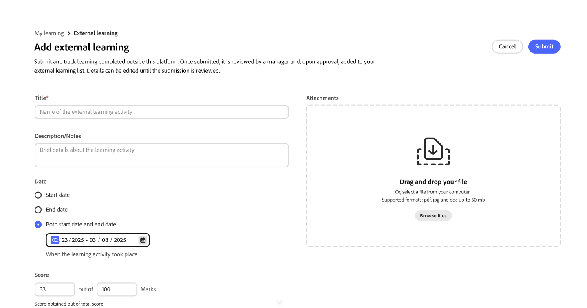

# Enviar aprendizaje externo como alumno

En Adobe Learning Manager, puedes registrar la formación que completes fuera de la plataforma, como un taller, examen de certificación, seminario o curso en línea, mediante la función **Aprendizaje externo**. Cada envío se envía a su responsable para su revisión. Una vez aprobada, la actividad aparece en la transcripción del alumno.

## Cómo funciona el proceso de envío de aprendizaje externo

Los envíos de aprendizaje externos siguen un proceso de tres pasos:

1. Rellene un formulario de envío con detalles sobre la formación que ha completado y, opcionalmente, cargue una prueba.

2. El responsable recibe una notificación en la plataforma y revisa el envío.

3. El responsable aprueba o rechaza la solicitud. Recibirá una notificación en la plataforma de la decisión.

Los envíos aprobados aparecen en tu **transcripción del alumno** como actividades de aprendizaje externas completadas.

Puede enviar tantas solicitudes de aprendizaje externas como necesite. No hay límite en el número de envíos que puede crear.

**Buscando aprendizaje externo en la navegación**

El aprendizaje externo está disponible en **Mi aprendizaje** en la navegación principal. Selecciona **Aprendizaje externo** para ver tu historial de envíos y crear nuevos envíos.

<!---->

Si no ve la opción **Aprendizaje externo**, es posible que el administrador no haya habilitado la función para su cuenta. Póngase en contacto con el administrador para obtener ayuda.

### Enviar una solicitud de aprendizaje externa

1. En la barra de navegación izquierda, seleccione **Mi aprendizaje**.

2. Seleccione la opción **Aprendizaje externo**.

3. Seleccione **Agregar aprendizaje externo**.
   

4. Rellena el formulario de envío:

   1. **Título:** Escriba el nombre del curso de formación. Este campo es obligatorio.

   2. **Descripción/notas:** Agregue cualquier detalle que ayude a su administrador a comprender la formación, como el nombre del proveedor o los objetivos de aprendizaje.

   3. **Fecha de inicio:** Seleccione la fecha en que comenzó el entrenamiento.

   4. **Fecha de finalización:** Seleccione la fecha en que se completó el curso de formación.

   5. **Duración:** Especifique el tiempo total (en horas) que pasó en el curso de formación.

   6. **Puntuación:** Indique su puntuación si el curso de formación incluye una evaluación.

   7. **Archivos adjuntos:** Carga un certificado, una transcripción u otro documento como prueba. Los tipos de archivo admitidos son PDF, DOC, DOCX, PNG, JPEG y JPG. El tamaño máximo de archivo es de 50 MB.
      

   8. Rellene cualquier campo personalizado adicional que el administrador haya configurado.

5. Seleccione **Enviar**.

El responsable recibe una notificación en la aplicación de que hay una nueva solicitud de aprendizaje externa pendiente de revisión. Tu envío aparece en tu lista de **Aprendizaje externo** con el estado **Pendiente de revisión**.
<!---->

>[!NOTE]
>
>Recibirás una notificación en la plataforma cuando tu responsable apruebe o rechace tu envío.

### Editar un envío pendiente

Puede editar un envío mientras su estado sea **Pendiente de aprobación**. Una vez que el responsable lo apruebe o lo rechace, ya no podrá editar ese envío.

1. En la pestaña **Aprendizaje externo**, busca el envío que deseas actualizar.

2. Seleccione el envío para abrirlo.

3. Seleccione **Editar**.

4. Actualice los campos según sea necesario. El formulario muestra la última configuración de campos establecida por el administrador, que puede incluir campos que no estaban presentes cuando se envió originalmente.

5. Seleccione **Enviar**.

El responsable recibe una nueva notificación y revisa el envío actualizado.

**Si el envío fue rechazado:** No puede editar un envío rechazado. Para volver a enviarla, cree una nueva solicitud de aprendizaje externa y haga referencia a los comentarios que el responsable haya proporcionado en el comentario de revisión.

### Estados de envío de aprendizaje externo

| **Estado** | **Qué significa** | **¿Se puede editar?** |
|-----------------|----------------------------------------------------------------------------------|---------------------------------------------------------|
| Pendiente de revisión | El envío está pendiente de revisión por parte del responsable. | Sí. Seleccione **Editar** en la página de detalles del envío. |
| Aprobado | Su responsable aprobó el envío; se incluye en la transcripción del alumno. | No. |
| Rechazado | El administrador rechazó el envío; revise sus comentarios para obtener orientación. | No. Cree una nueva solicitud de aprendizaje externa para volver a enviarla. |
