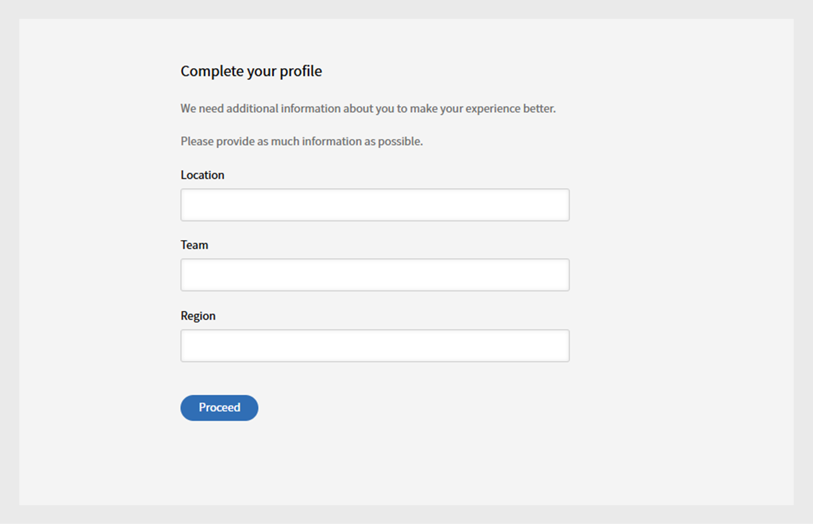

# Iniciar sesión

Inicie sesión en Learning Manager como alumno.

Al utilizar Adobe Learning Manager por primera vez, los alumnos deben crear una cuenta. Puede hacerlo de una de estas dos formas:

* Registro automático: utilice la dirección URL proporcionada en el correo electrónico de bienvenida para crear su cuenta.
* Cuenta creada por el administrador: un administrador puede crear una cuenta en su nombre.

## Crear una cuenta mediante la dirección URL de correo electrónico de bienvenida

Siga estos pasos para crear su cuenta con la URL del correo electrónico de bienvenida:

1. Inicie Adobe Learning Manager mediante el vínculo seguro que recibió en el correo electrónico de bienvenida de su administrador.

   Aparece la pantalla de inicio de sesión.

1. Seleccione Iniciar sesión.

   

   *Iniciar sesión con nombre de usuario y contraseña*

1. Escriba el Adobe ID, la contraseña y haga clic en Iniciar sesión.

   Si ha olvidado la contraseña, haga clic en ¿Ha olvidado la contraseña? y proporcione el ID de correo electrónico que utilizó para crear Adobe ID.

   <!--
   If you do not have an Adobe ID, [click here](../../../manage-account.md) to learn how to create an Adobe ID.
   
   -->

1. Escriba su información en los campos Activo para completar su perfil.

   
   _Escriba su información en Campos activos para completar la configuración del perfil_

1. Otra opción es utilizar la identificación empresarial. Para esto, haga clic en el vínculo Iniciar sesión con el Id. empresarial.

>[!NOTE]
>
>Una vez que inicie sesión por primera vez, su Adobe ID se asociará a la cuenta de su empresa. Para las sesiones subsiguientes, puede marcar la URL de su cuenta (segunda URL) que recibió en el correo electrónico de bienvenida.
